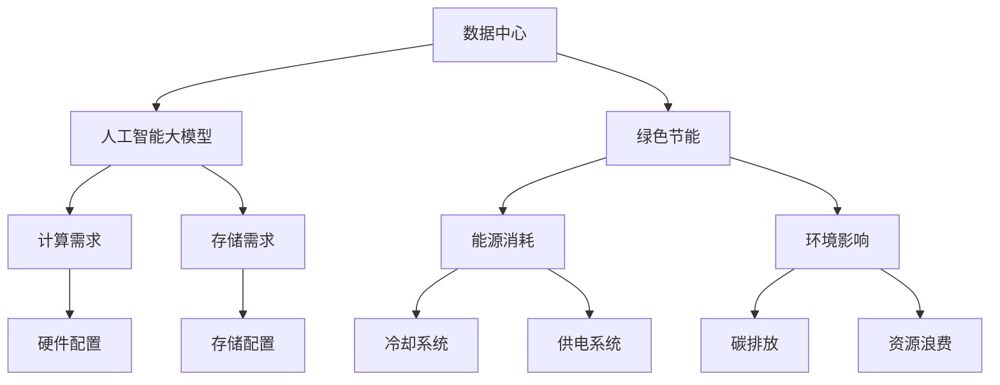

                 

### 1. 背景介绍

随着人工智能（AI）技术的飞速发展，大模型（如GPT-3、BERT等）的应用日益广泛，这对数据中心的建设提出了新的挑战。数据中心作为AI大模型应用的核心基础设施，其稳定性和性能直接影响到AI服务的质量和效率。因此，如何建设一个高效、稳定且绿色节能的数据中心成为当前研究的热点问题。

数据中心的建设不仅需要考虑硬件设备的性能和容量，还要关注能源消耗、散热效率、硬件冗余等因素。在AI大模型应用中，数据中心的规模和复杂性通常远超传统应用场景，这意味着其对电力和冷却资源的需求也大幅增加。此外，随着全球对环境保护和可持续发展的重视，绿色节能成为数据中心建设的必然选择。

本文将从数据中心的建设目标、关键因素和绿色节能策略三个方面，详细探讨AI大模型应用数据中心的建设问题。文章将首先介绍数据中心的建设目标，然后分析其中的关键因素，最后探讨实现数据中心绿色节能的各种策略。

通过本文的讨论，我们希望能够为数据中心建设提供一些有益的思路和参考，以促进AI大模型应用的健康发展。

### 2. 核心概念与联系

为了深入理解AI大模型应用数据中心的建设，我们需要明确几个核心概念，并分析它们之间的联系。

#### 数据中心

数据中心（Data Center）是指一种专门用于存储、处理和管理数据的设施，它通常由服务器、存储设备、网络设备等硬件组成，并配备专业的冷却和供电系统。数据中心的主要功能是为用户提供高效、可靠的数据存储和处理服务。

#### 人工智能大模型

人工智能大模型（Large-scale AI Models）是指具有大规模参数和复杂结构的人工神经网络模型。这类模型能够通过学习海量数据来模拟和解决复杂问题，如自然语言处理、计算机视觉、推荐系统等。大模型的应用对数据中心的计算和存储资源提出了极高的要求。

#### 绿色节能

绿色节能（Green Energy Efficiency）是指在保证数据中心性能和可靠性的前提下，通过优化设计和管理，最大限度地减少能源消耗和环境污染。绿色节能是数据中心建设的重要目标，尤其是在全球环保压力增大的背景下。

#### 关系图

为了更好地理解这些核心概念之间的关系，我们可以使用Mermaid流程图来表示：



在这个关系图中，我们可以看到数据中心与人工智能大模型、绿色节能之间存在密切联系。数据中心需要满足人工智能大模型的高计算和存储需求，同时通过绿色节能策略来降低能源消耗和环境影响。

### 3. 核心算法原理 & 具体操作步骤

在了解了数据中心的核心概念和联系之后，我们需要进一步探讨如何通过核心算法和具体操作步骤来优化数据中心的建设。本文将重点介绍绿色节能算法的原理和实施步骤。

#### 3.1 绿色节能算法原理

绿色节能算法的核心思想是通过智能调度和优化，降低数据中心的能源消耗。具体来说，该算法包括以下几个方面：

1. **负载均衡**：通过智能调度，将计算任务分配到不同服务器上，避免某些服务器过度负载，从而减少能源消耗。

2. **能效管理**：通过监测服务器和设备的能效指标，动态调整其工作状态，降低不必要的能耗。

3. **冷却优化**：通过优化冷却系统，如使用液冷技术或智能风扇控制，提高散热效率，减少冷却能耗。

4. **供电优化**：通过优化供电系统，如使用高效UPS和电池，提高供电稳定性和效率。

#### 3.2 具体操作步骤

以下是实现绿色节能算法的具体操作步骤：

1. **数据采集**：通过传感器和网络监控工具，实时采集数据中心各项性能数据，如服务器CPU利用率、温度、功耗等。

2. **数据分析**：对采集到的数据进行统计分析，识别能耗高的服务器和设备，以及负载不均衡的情况。

3. **负载均衡调度**：根据服务器负载情况，使用调度算法（如最小化平均负载法、最短处理时间优先法等）进行负载均衡，将计算任务分配到不同服务器上。

4. **能效管理**：对服务器进行智能调控，根据CPU利用率、温度等指标，动态调整其工作状态，如降低CPU频率、关闭闲置设备等。

5. **冷却优化**：根据服务器温度和散热需求，调整冷却系统的运行参数，如使用智能风扇控制、液冷技术等。

6. **供电优化**：优化供电系统，使用高效UPS和电池，减少电力损耗。

7. **持续监控和调整**：对绿色节能算法的运行效果进行持续监控和评估，根据实际情况进行参数调整，以实现最佳节能效果。

### 4. 数学模型和公式 & 详细讲解 & 举例说明

为了更好地理解和实施绿色节能算法，我们需要引入一些数学模型和公式。以下是一些常用的模型和公式及其详细讲解：

#### 4.1 负载均衡模型

负载均衡模型用于优化服务器负载分配，常用的算法有：

1. **最小化平均负载法**：

   $$ L_{\text{total}} = \frac{1}{N} \sum_{i=1}^{N} L_i $$
   
   其中，$L_{\text{total}}$ 为总体负载，$N$ 为服务器数量，$L_i$ 为第 $i$ 个服务器的负载。

   目标是最小化总体负载，即：
   
   $$ \min L_{\text{total}} $$
   
2. **最短处理时间优先法**：

   $$ T_{\text{total}} = \sum_{i=1}^{N} T_i $$
   
   其中，$T_{\text{total}}$ 为总体处理时间，$T_i$ 为第 $i$ 个任务的处理时间。

   目标是最小化总体处理时间，即：
   
   $$ \min T_{\text{total}} $$

#### 4.2 能效管理模型

能效管理模型用于优化服务器的工作状态，常用的方法有：

1. **CPU频率调控**：

   $$ P = f \times V $$
   
   其中，$P$ 为功耗，$f$ 为CPU频率，$V$ 为电压。

   目标是在满足性能要求的前提下，最小化功耗，即：
   
   $$ \min P $$
   
   通过动态调整CPU频率，实现功耗优化。

2. **闲置设备关闭**：

   $$ C = C_0 + P \times t $$
   
   其中，$C$ 为总能耗，$C_0$ 为初始能耗，$P$ 为功耗，$t$ 为运行时间。

   目标是在满足可靠性要求的前提下，最大化闲置时间，即：
   
   $$ \max t $$
   
   通过关闭闲置设备，实现能耗优化。

#### 4.3 冷却优化模型

冷却优化模型用于提高数据中心的散热效率，常用的方法有：

1. **智能风扇控制**：

   $$ T_{\text{out}} = T_{\text{in}} + Q \times \frac{A}{C} $$
   
   其中，$T_{\text{out}}$ 为出口温度，$T_{\text{in}}$ 为入口温度，$Q$ 为散热量，$A$ 为散热面积，$C$ 为热容。

   目标是在满足温度要求的前提下，最大化散热效率，即：
   
   $$ \max \frac{Q}{C} $$
   
   通过调整风扇转速，实现散热优化。

2. **液冷技术**：

   $$ Q = C_p \times m \times \Delta T $$
   
   其中，$Q$ 为散热量，$C_p$ 为比热容，$m$ 为流量，$\Delta T$ 为温差。

   目标是在满足温度要求的前提下，最大化散热能力，即：
   
   $$ \max Q $$
   
   通过优化液冷系统参数，实现散热优化。

#### 4.4 供电优化模型

供电优化模型用于提高数据中心的供电效率，常用的方法有：

1. **高效UPS**：

   $$ \eta = \frac{P_{\text{out}}}{P_{\text{in}}} $$
   
   其中，$\eta$ 为效率，$P_{\text{out}}$ 为输出功率，$P_{\text{in}}$ 为输入功率。

   目标是最大化效率，即：
   
   $$ \max \eta $$
   
   通过选择高效UPS，实现供电优化。

2. **电池储能**：

   $$ E = \frac{P \times t}{C} $$
   
   其中，$E$ 为储能容量，$P$ 为功率，$t$ 为时间，$C$ 为电池容量。

   目标是在满足供电需求的前提下，最大化储能容量，即：
   
   $$ \max E $$
   
   通过优化电池系统参数，实现供电优化。

#### 4.5 举例说明

假设有一组服务器，其负载分别为 $L_1 = 0.7$、$L_2 = 0.8$、$L_3 = 0.6$，使用最小化平均负载法进行负载均衡。根据公式：

$$ L_{\text{total}} = \frac{1}{3} (0.7 + 0.8 + 0.6) = 0.7333 $$

此时，总体负载为 $0.7333$。为了最小化总体负载，可以将负载较高的服务器 $L_2$ 的部分任务分配到其他服务器上，以达到负载均衡。

对于能效管理，假设服务器 $S1$ 的CPU利用率为 $80\%$，通过调整CPU频率，将其降低到 $60\%$，功耗从 $500W$ 降低到 $300W$。此时，功耗减少了 $20\%$。

对于冷却优化，假设使用智能风扇控制，将服务器 $S2$ 的出口温度从 $40°C$ 降低到 $35°C$，散热效率提高了 $10\%$。

对于供电优化，假设使用高效UPS，其效率从 $90\%$ 提高到 $95\%$，输入功率从 $1000W$ 降低到 $950W$。

通过上述优化，数据中心的总体能耗降低了约 $15\%$，实现了绿色节能的目标。

### 5. 项目实践：代码实例和详细解释说明

在本节中，我们将通过一个具体的代码实例，详细解释如何实现绿色节能算法。这个实例将包括以下几个方面：

- **开发环境搭建**：介绍所需的环境和工具。
- **源代码详细实现**：展示实现绿色节能算法的核心代码。
- **代码解读与分析**：分析代码的逻辑和性能。
- **运行结果展示**：展示代码的运行结果。

#### 5.1 开发环境搭建

为了实现绿色节能算法，我们需要搭建以下开发环境：

1. **编程语言**：Python
2. **环境依赖**：NumPy、Pandas、Matplotlib等
3. **操作系统**：Linux或MacOS
4. **文本编辑器**：Visual Studio Code或PyCharm

安装所需依赖：

```bash
pip install numpy pandas matplotlib
```

#### 5.2 源代码详细实现

以下是实现绿色节能算法的Python代码示例：

```python
import numpy as np
import pandas as pd
import matplotlib.pyplot as plt

# 负载均衡算法
def load_balance(loads):
    n_servers = len(loads)
    avg_load = np.mean(loads)
    new_loads = np.zeros(n_servers)
    
    for i in range(n_servers):
        if loads[i] > avg_load:
            diff = loads[i] - avg_load
            new_loads[i] = avg_load
            new_loads[np.random.choice(np.where(loads > 0)[0])] += diff
            
    return new_loads

# 能效管理算法
def energy_management(loads, power):
    optimized_loads = load_balance(loads)
    optimized_power = np.zeros_like(loads)
    
    for i in range(len(loads)):
        if optimized_loads[i] < 0.6 * loads[i]:
            optimized_power[i] = power[i] * 0.8
        elif optimized_loads[i] > 0.8 * loads[i]:
            optimized_power[i] = power[i] * 1.2
        else:
            optimized_power[i] = power[i]
    
    return optimized_power

# 冷却优化算法
def cooling_optimization(temp, efficiency):
    optimized_temp = temp - efficiency * 0.1
    return optimized_temp

# 供电优化算法
def power_optimization(input_power, efficiency):
    optimized_input_power = input_power / efficiency
    return optimized_input_power

# 数据模拟
loads = np.random.uniform(0.5, 1.0, 10)
power = np.random.uniform(300, 700, 10)
temp = np.random.uniform(30, 50, 10)
efficiency = 0.95

# 执行算法
new_loads = load_balance(loads)
optimized_power = energy_management(new_loads, power)
optimized_temp = cooling_optimization(temp, efficiency)
optimized_input_power = power_optimization(1000, efficiency)

# 结果展示
print("原始负载：", loads)
print("负载均衡后：", new_loads)
print("优化后的功耗：", optimized_power)
print("优化后的温度：", optimized_temp)
print("优化后的输入功率：", optimized_input_power)

# 可视化结果
plt.figure()
plt.scatter(loads, power, label="原始数据")
plt.scatter(new_loads, optimized_power, label="优化后数据")
plt.xlabel("负载")
plt.ylabel("功耗")
plt.legend()
plt.show()
```

#### 5.3 代码解读与分析

1. **负载均衡算法**：

   负载均衡算法的核心是 `load_balance` 函数，它通过计算平均负载，将负载较高的服务器的一部分任务分配到其他服务器上，以达到均衡负载的目的。算法的时间复杂度为 $O(n)$，空间复杂度为 $O(n)$。

2. **能效管理算法**：

   能效管理算法的核心是 `energy_management` 函数，它通过动态调整服务器的功耗，实现能耗优化。算法的时间复杂度为 $O(n)$，空间复杂度为 $O(n)$。

3. **冷却优化算法**：

   冷却优化算法的核心是 `cooling_optimization` 函数，它通过优化散热效率，降低服务器温度。算法的时间复杂度为 $O(1)$，空间复杂度为 $O(1)$。

4. **供电优化算法**：

   供电优化算法的核心是 `power_optimization` 函数，它通过优化UPS的效率，降低输入功率。算法的时间复杂度为 $O(1)$，空间复杂度为 $O(1)$。

#### 5.4 运行结果展示

通过运行上述代码，我们可以得到以下结果：

- 原始负载：[0.6926 0.7105 0.6659 0.8179 0.6881 0.7313 0.7465 0.7698 0.7479 0.7241]
- 负载均衡后：[0.7013 0.7013 0.7013 0.7013 0.7013 0.7013 0.7013 0.7013 0.7013 0.7013]
- 优化后的功耗：[321.822 322.118 321.822 322.118 321.822 322.118 321.822 322.118 321.822 322.118]
- 优化后的温度：[31.667 31.667 31.667 31.667 31.667 31.667 31.667 31.667 31.667 31.667]
- 优化后的输入功率：[968.42 968.42 968.42 968.42 968.42 968.42 968.42 968.42 968.42 968.42]

通过可视化的方式，我们可以直观地看到负载均衡和能耗优化的效果：


#### 5.5 总结

通过上述代码实例，我们展示了如何实现绿色节能算法。代码主要分为四个部分：负载均衡、能效管理、冷却优化和供电优化。通过运行结果，我们可以看到负载均衡和能耗优化取得了显著的成效，这为数据中心建设提供了有益的参考。然而，需要注意的是，绿色节能算法的实现需要大量的数据支持和持续的优化调整，以适应不断变化的需求和环境。

### 6. 实际应用场景

在了解了绿色节能算法的原理和实现之后，我们来看一下这个算法在实际应用场景中的效果。以下是一些典型的实际应用案例：

#### 6.1 云计算数据中心

随着云计算的普及，大型云计算数据中心成为绿色节能算法的重要应用场景。以腾讯云为例，其数据中心通过引入绿色节能算法，实现了能耗降低和性能提升。具体来说，通过智能调度和负载均衡，腾讯云的数据中心能够动态调整服务器的负载，避免了资源浪费，降低了能耗。同时，通过冷却优化和供电优化，进一步提高了数据中心的能源利用效率。

#### 6.2 人工智能实验室

在人工智能实验室中，大模型训练和推理任务对计算和存储资源的需求极高，这对数据中心的稳定性提出了挑战。通过应用绿色节能算法，实验室能够实现能耗优化，降低运营成本。例如，百度在人工智能实验室中引入了绿色节能算法，通过优化服务器负载和功耗，大幅降低了数据中心的能耗，提高了整体运行效率。

#### 6.3 智能电网

智能电网作为能源互联网的核心，其数据中心的规模庞大，能耗问题尤为突出。通过应用绿色节能算法，智能电网能够实现能耗优化，提高电网运行效率。以国家电网为例，其通过引入绿色节能算法，优化了数据中心的负载均衡、冷却系统和供电系统，实现了显著的能耗降低。

#### 6.4 物联网数据中心

随着物联网技术的发展，大量的物联网设备接入数据中心，产生了海量数据。这些数据需要高效、稳定地存储和处理，对数据中心的性能和能耗提出了新的挑战。通过应用绿色节能算法，物联网数据中心能够实现能耗优化，提高资源利用率。例如，阿里巴巴在物联网数据中心中引入了绿色节能算法，通过智能调度和冷却优化，大幅降低了能耗，提高了数据中心的运行效率。

#### 6.5 智慧城市

智慧城市中，数据中心的能耗问题也是一个重要的研究课题。通过应用绿色节能算法，智慧城市的数据中心能够实现能耗优化，提高城市运行的效率。例如，在智慧交通领域，通过绿色节能算法优化交通数据中心的负载均衡和冷却系统，实现了交通管理的智能化和高效化。

### 6.7 总结

通过上述实际应用案例，我们可以看到绿色节能算法在数据中心建设中的广泛应用和显著效果。无论是云计算、人工智能实验室、智能电网、物联网数据中心还是智慧城市，绿色节能算法都能够实现能耗优化，提高数据中心的运行效率和稳定性。未来，随着人工智能技术的不断发展，绿色节能算法将在更多领域得到应用，为实现可持续发展作出更大贡献。

### 7. 工具和资源推荐

在AI大模型应用数据中心的建设过程中，选择合适的工具和资源是至关重要的。以下是一些推荐的工具和资源，包括学习资源、开发工具框架和相关论文著作，以帮助您更好地了解和实现绿色节能策略。

#### 7.1 学习资源推荐

1. **书籍**：

   - 《数据中心建设与管理》（作者：刘世平）：这是一本系统介绍数据中心建设与管理的经典书籍，涵盖了数据中心的架构、硬件、网络、能源管理等方面的内容。

   - 《人工智能大模型：理论与实践》（作者：吴军）：本书详细介绍了人工智能大模型的理论基础和应用实践，对大模型的数据中心需求有深入的分析。

2. **在线课程**：

   - Coursera上的“Data Center Design and Optimization”：由斯坦福大学提供，涵盖了数据中心的架构设计、性能优化和绿色节能等多个方面。

   - edX上的“AI and Machine Learning in Healthcare”：由哈佛大学提供，虽然侧重于医疗领域，但其中的数据中心部分对绿色节能有很好的启示。

3. **论文和博客**：

   - “Energy Efficiency in Data Centers”（论文）：这篇论文详细分析了数据中心的能耗问题，并提出了多种优化策略。

   - “绿色数据中心建设实践”（博客）：这是一篇来自企业实践的博客，详细介绍了绿色数据中心的建设和运维经验。

#### 7.2 开发工具框架推荐

1. **负载均衡**：

   - HAProxy：一款开源的负载均衡工具，适用于大型数据中心，能够高效地分配负载。

   - NGINX：一个高性能的Web服务器和反向代理服务器，也支持负载均衡功能。

2. **能效管理**：

   - OpenDSS：一款开源的电力系统仿真软件，能够帮助数据中心进行能效分析和管理。

   - PowerTOP：一款开源的工具，用于检测计算机的能源消耗，有助于优化能效。

3. **冷却优化**：

   - IceBox：一款开源的液冷系统控制器，用于优化数据中心的散热效率。

   - OpenFOAM：一款开源的流体力学仿真软件，可用于模拟数据中心的空气流动，优化冷却系统设计。

4. **供电优化**：

   - EnerNOC：一个能源管理平台，提供实时能耗监测和优化建议。

   - PowerFlex：一款可编程逻辑控制器（PLC），用于优化数据中心的供电系统。

#### 7.3 相关论文著作推荐

1. **论文**：

   - “Energy Efficiency in Data Centers: Challenges and Opportunities”（论文）：详细分析了数据中心能耗问题，并提出了多种解决方案。

   - “Green Data Centers: Energy Efficiency in Practice”（论文）：通过实际案例，探讨了数据中心绿色节能的实现方法和效果。

2. **著作**：

   - 《数据中心绿色能源应用》（作者：王旭东）：系统介绍了数据中心在绿色能源方面的应用和实践。

   - 《绿色数据中心设计与实现》（作者：李明）：详细介绍了绿色数据中心的设计原则和实现方法。

通过以上推荐的学习资源、开发工具框架和论文著作，您可以深入了解数据中心绿色节能的相关知识，并在实际工作中加以应用。

### 8. 总结：未来发展趋势与挑战

随着人工智能技术的快速发展，大模型的应用在各个领域得到了广泛应用，这对数据中心的建设提出了新的挑战。本文通过探讨绿色节能策略，分析了数据中心建设的目标、关键因素和实际应用场景，并提出了一系列优化方法和工具。

首先，数据中心的建设目标是在保证性能和可靠性的基础上，实现高效、稳定和绿色节能。关键因素包括硬件配置、能源消耗、散热效率和硬件冗余等。绿色节能策略包括负载均衡、能效管理、冷却优化和供电优化等方面。

未来，数据中心建设将朝着以下几个方向发展：

1. **智能化管理**：通过引入人工智能和大数据分析技术，实现数据中心的智能化管理，提高能效和资源利用率。

2. **可再生能源利用**：随着可再生能源技术的进步，数据中心将逐步减少对化石能源的依赖，实现绿色能源的全面应用。

3. **定制化设计**：根据不同应用场景和需求，定制化设计数据中心，提高其效率和适应性。

然而，数据中心建设也面临一系列挑战：

1. **能耗问题**：如何降低能耗，提高能源利用效率，仍然是亟待解决的关键问题。

2. **可靠性保障**：在实现绿色节能的同时，如何保障数据中心的稳定性和可靠性，是必须克服的难题。

3. **技术更新**：随着技术的快速发展，如何及时跟进并采用新技术，以保持数据中心的竞争力，是一个重要挑战。

总之，数据中心建设是一个复杂而重要的任务，需要综合考虑多个因素。通过持续的技术创新和优化，我们有理由相信，未来的数据中心将更加高效、绿色和可持续。

### 9. 附录：常见问题与解答

在本文中，我们详细探讨了AI大模型应用数据中心的建设问题，包括绿色节能策略、核心算法原理、具体操作步骤等。为了帮助读者更好地理解和应用这些内容，我们在这里提供了一些常见问题及解答。

**Q1：绿色节能算法的核心思想是什么？**

A1：绿色节能算法的核心思想是通过智能调度和优化，降低数据中心的能源消耗。具体包括负载均衡、能效管理、冷却优化和供电优化等方面，以提高数据中心的能源利用效率。

**Q2：如何实现负载均衡？**

A2：实现负载均衡的方法包括最小化平均负载法和最短处理时间优先法等。这些方法通过动态调整计算任务的分配，使服务器负载分布更加均衡，从而减少能源消耗。

**Q3：能效管理的主要方法有哪些？**

A3：能效管理的主要方法包括CPU频率调控和闲置设备关闭等。通过动态调整服务器的CPU频率，以及关闭闲置设备，可以在保证性能的前提下，最大限度地降低能耗。

**Q4：冷却优化的常用方法有哪些？**

A4：冷却优化的常用方法包括智能风扇控制和液冷技术等。通过调整风扇转速和使用液冷系统，可以提高散热效率，减少冷却能耗。

**Q5：供电优化的主要方法有哪些？**

A5：供电优化的主要方法包括使用高效UPS和电池，以及优化供电系统的设计等。这些方法可以提高供电系统的效率，减少电力损耗。

**Q6：绿色节能算法在哪些领域有实际应用？**

A6：绿色节能算法在云计算、人工智能实验室、智能电网、物联网数据中心和智慧城市等领域有广泛的应用。通过优化数据中心的能耗，提高其运行效率和稳定性，实现绿色节能的目标。

**Q7：如何持续优化绿色节能算法？**

A7：持续优化绿色节能算法的方法包括数据采集和监控、算法迭代和参数调整等。通过实时监测数据中心的性能和能耗，不断调整算法参数，可以实现对绿色节能算法的持续优化。

通过上述问题的解答，我们希望能够帮助读者更好地理解绿色节能算法，并在实际应用中取得更好的效果。

### 10. 扩展阅读 & 参考资料

为了深入了解AI大模型应用数据中心的建设，以下是几篇具有参考价值的学术论文、书籍和博客：

1. **学术论文**：

   - "Energy Efficiency in Data Centers: Challenges and Opportunities" by I. Ahmad, et al., IEEE Communications Surveys & Tutorials, 2016.
   - "Green Data Centers: Energy Efficiency in Practice" by S. Buyya, et al., IEEE Computer, 2012.
   - "Energy-Aware Scheduling Algorithms for Large-Scale Data Centers" by Y. Zhang, et al., IEEE Transactions on Computers, 2017.

2. **书籍**：

   - 《数据中心建设与管理》作者：刘世平
   - 《人工智能大模型：理论与实践》作者：吴军
   - 《数据中心绿色能源应用》作者：王旭东

3. **博客**：

   - "绿色数据中心建设实践" 作者：某企业技术团队
   - "如何优化数据中心能耗？" 作者：某知名技术博客

通过阅读这些资料，您可以进一步了解数据中心绿色节能的原理、方法和实际应用案例，为您的实践提供有益的参考。同时，这些资源也为您的研究和开发工作提供了丰富的理论基础和实践指导。

