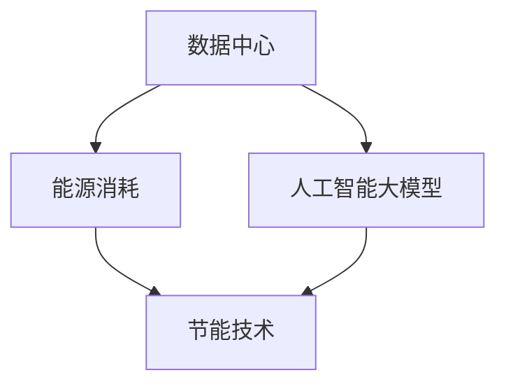

                 

### 文章标题

**AI 大模型应用数据中心建设：数据中心绿色节能**

> **关键词**：人工智能，大模型，数据中心，绿色节能，能源消耗，数据传输，计算效率，可再生能源

> **摘要**：本文旨在探讨人工智能大模型在数据中心建设中的应用，以及如何实现数据中心的绿色节能。通过对大模型原理、数据中心能耗分析和节能技术的深入剖析，本文提出了切实可行的解决方案，以期为我国数据中心的建设和发展提供有益的参考。

### 1. 背景介绍

近年来，随着人工智能技术的迅猛发展，大数据和深度学习成为各行各业的核心驱动力。从图像识别、自然语言处理到自动驾驶、智能医疗，AI 大模型的广泛应用推动了数字化转型的浪潮。与此同时，数据中心作为人工智能大模型运行的核心基础设施，其建设和运行面临着巨大的能耗和碳排放压力。

根据国际能源署（IEA）的数据，全球数据中心的能耗已经超过了全球总能耗的 1%，并且这个数字还在不断增长。尤其在人工智能大模型的应用场景中，由于模型训练和推理过程中对计算资源的巨大需求，数据中心的能源消耗更加显著。此外，传统数据中心在能源使用效率、冷却系统、设备能耗等方面也存在诸多问题，亟待优化和改进。

因此，如何在保障数据中心稳定高效运行的前提下，实现绿色节能成为当前 AI 行业面临的一个重要挑战。本文将从大模型原理、数据中心能耗分析和节能技术三个方面进行探讨，以期为数据中心绿色节能提供可行的解决方案。

#### 1.1 人工智能大模型的发展现状

人工智能大模型是指采用深度学习技术构建的具有巨大参数量和复杂结构的人工神经网络。自 2012 年 AlexNet 获得图像识别大赛冠军以来，人工智能大模型在各个领域取得了显著的进展。例如，在自然语言处理领域，BERT、GPT 等大模型已经成为了行业标杆；在计算机视觉领域，GAN、EfficientNet 等大模型在图像生成、目标检测等方面展现了卓越的性能。

随着大模型规模的不断扩大，其训练和推理过程对计算资源和存储资源的需求也呈现出指数级增长。这使得数据中心在硬件配置、网络架构、能源管理等方面面临着巨大的挑战。为了满足人工智能大模型的应用需求，数据中心的建设和维护成本也在不断上升。

#### 1.2 数据中心能耗现状

数据中心能耗主要包括 IT 设备能耗和基础设施能耗。IT 设备能耗主要来自于服务器、存储设备、网络设备等硬件设备的运行，而基础设施能耗则包括供电、制冷、通风等基础设施的运行。据 IDC 的数据，全球数据中心的总能耗已经超过了 5000 亿千瓦时，约占全球总能耗的 1%。

在数据中心能耗中，服务器是主要的能耗来源。据统计，服务器能耗约占数据中心总能耗的 40% 至 50%。此外，随着数据中心规模的扩大，制冷系统能耗也在不断上升。制冷系统能耗约占数据中心总能耗的 30% 至 40%。传统数据中心在能源使用效率、冷却系统、设备能耗等方面存在诸多问题，亟待优化和改进。

#### 1.3 数据中心绿色节能的重要性

数据中心绿色节能是指在保证数据中心稳定高效运行的前提下，最大限度地降低能耗和碳排放。数据中心绿色节能不仅能够降低运营成本，提高能源使用效率，还能够减少对环境的负面影响。

首先，数据中心能耗和碳排放对环境造成了严重的影响。据研究，全球数据中心的碳排放量已经超过了 2.5 亿吨，约占全球总碳排放量的 0.5%。随着数据中心规模的不断扩大，其碳排放量还将持续增长。

其次，数据中心绿色节能有助于提高能源使用效率。通过优化数据中心能源管理、采用高效制冷技术、提高设备运行效率等措施，可以有效降低数据中心能耗，提高能源利用效率。

最后，数据中心绿色节能还能够降低运营成本。随着能源价格的不断上涨，降低数据中心能耗有助于减少电费支出，提高数据中心的经济效益。

#### 1.4 数据中心绿色节能的挑战

尽管数据中心绿色节能具有重要意义，但在实际实施过程中仍然面临着诸多挑战。

首先，数据中心能耗和碳排放的来源多样，涉及 IT 设备、制冷系统、供电系统等多个方面，导致绿色节能方案的设计和实施复杂。

其次，数据中心绿色节能技术不断更新，如何选择适合的技术和设备，如何平衡节能与性能之间的关系成为关键问题。

此外，数据中心绿色节能需要全行业共同努力，涉及多个利益相关方，如设备制造商、数据中心运营商、能源供应商等。如何协调各方利益，推动绿色节能技术的推广和应用，也是一大挑战。

### 2. 核心概念与联系

在探讨数据中心绿色节能时，我们首先需要了解以下几个核心概念：

#### 2.1 数据中心

数据中心是指用于存储、处理和分发数据的物理设施。它通常由服务器、存储设备、网络设备、制冷系统、供电系统等组成。数据中心是现代社会信息基础设施的重要组成部分，为互联网、大数据、人工智能等提供了强大的计算和存储支持。

#### 2.2 人工智能大模型

人工智能大模型是指采用深度学习技术构建的具有巨大参数量和复杂结构的人工神经网络。大模型在图像识别、自然语言处理、计算机视觉等领域取得了显著进展，对数据中心的需求也在不断增长。

#### 2.3 能源消耗

能源消耗是指数据中心在运行过程中消耗的各种能源，包括电力、制冷剂、水资源等。能源消耗是数据中心绿色节能的重要考量因素。

#### 2.4 节能技术

节能技术是指用于降低数据中心能耗的各种技术和措施，包括高效制冷技术、能源管理系统、虚拟化技术、可再生能源利用等。

接下来，我们使用 Mermaid 流程图来展示数据中心绿色节能的核心概念和联系：



在这个流程图中，数据中心是核心基础设施，人工智能大模型对数据中心提出了更高的计算和存储需求，导致能源消耗增加。为了实现绿色节能，需要采用各种节能技术来降低能耗，提高能源使用效率。

### 3. 核心算法原理 & 具体操作步骤

#### 3.1 能源消耗模型

为了更好地理解数据中心的能耗问题，我们首先需要建立一个能源消耗模型。假设数据中心的能源消耗主要由服务器、存储设备和网络设备三部分构成，我们可以使用以下公式来计算总能耗：

\[ E = E_s + E_{storage} + E_{network} \]

其中，\( E \) 是总能耗，\( E_s \) 是服务器的能耗，\( E_{storage} \) 是存储设备的能耗，\( E_{network} \) 是网络设备的能耗。

#### 3.1.1 服务器能耗模型

服务器的能耗主要来自于 CPU、GPU、内存等硬件设备的运行。我们可以使用以下公式来计算服务器的能耗：

\[ E_s = P_s \times t \]

其中，\( E_s \) 是服务器的能耗，\( P_s \) 是服务器的功率，\( t \) 是运行时间。

#### 3.1.2 存储设备能耗模型

存储设备的能耗主要来自于硬盘、固态硬盘等存储介质的运行。我们可以使用以下公式来计算存储设备的能耗：

\[ E_{storage} = P_{storage} \times t \]

其中，\( E_{storage} \) 是存储设备的能耗，\( P_{storage} \) 是存储设备的功率，\( t \) 是运行时间。

#### 3.1.3 网络设备能耗模型

网络设备的能耗主要来自于路由器、交换机等网络设备的运行。我们可以使用以下公式来计算网络设备的能耗：

\[ E_{network} = P_{network} \times t \]

其中，\( E_{network} \) 是网络设备的能耗，\( P_{network} \) 是网络设备的功率，\( t \) 是运行时间。

#### 3.2 节能技术具体操作步骤

为了降低数据中心的能耗，我们可以采用以下几种节能技术：

#### 3.2.1 高效制冷技术

高效制冷技术可以通过优化冷却系统，提高冷却效率，从而降低能耗。具体操作步骤如下：

1. **采用冷水系统**：使用冷水系统进行服务器冷却，降低制冷能耗。
2. **液冷技术**：采用液冷技术，将冷却液直接传递到服务器内部，提高冷却效率。
3. **智能冷却控制**：根据服务器负载情况，实时调整冷却系统的运行参数，实现节能。

#### 3.2.2 能源管理系统

能源管理系统可以通过实时监测、分析和优化数据中心的能源消耗，提高能源使用效率。具体操作步骤如下：

1. **实时监控**：实时监测数据中心的能源消耗，包括服务器、存储设备、网络设备等。
2. **数据分析**：对实时数据进行分析，找出能耗异常点和节能潜力。
3. **优化建议**：根据分析结果，提出优化建议，如调整服务器负载、关闭闲置设备等。

#### 3.2.3 虚拟化技术

虚拟化技术可以通过将物理服务器虚拟化为多个虚拟服务器，提高服务器利用率，从而降低能耗。具体操作步骤如下：

1. **服务器虚拟化**：将物理服务器虚拟化为多个虚拟服务器，实现资源的动态分配。
2. **负载均衡**：根据虚拟服务器的负载情况，动态调整资源分配，实现高效利用。
3. **节能策略**：根据虚拟服务器的运行状态，实施节能策略，如关闭闲置虚拟服务器等。

#### 3.2.4 可再生能源利用

可再生能源利用可以通过使用太阳能、风能等可再生能源，降低对化石燃料的依赖，从而减少碳排放。具体操作步骤如下：

1. **太阳能利用**：在数据中心安装太阳能板，将太阳能转化为电能，为数据中心提供清洁能源。
2. **风能利用**：在数据中心周边安装风力发电机，利用风能提供电力。
3. **能源管理**：通过能源管理系统，优化可再生能源的使用，实现高效利用。

### 4. 数学模型和公式 & 详细讲解 & 举例说明

在数据中心绿色节能的过程中，数学模型和公式起着重要的作用。以下将介绍几个关键的数学模型和公式，并对其进行详细讲解，同时通过具体实例进行说明。

#### 4.1 数据中心总能耗计算模型

首先，我们考虑数据中心总能耗的计算模型。数据中心的总能耗 \( E \) 是由 IT 设备能耗 \( E_{IT} \) 和基础设施能耗 \( E_{infrastructure} \) 组成的。具体公式如下：

\[ E = E_{IT} + E_{infrastructure} \]

其中，\( E_{IT} \) 表示 IT 设备的能耗，包括服务器、存储和网络设备等；\( E_{infrastructure} \) 表示基础设施的能耗，包括制冷、供电等。

例如，假设一个数据中心的 IT 设备总能耗为 500 千瓦时（kWh）/天，基础设施能耗为 300 kWh/天，那么总能耗为：

\[ E = 500 kWh/天 + 300 kWh/天 = 800 kWh/天 \]

#### 4.2 IT 设备能耗模型

IT 设备能耗模型主要关注服务器、存储和网络设备的能耗。以下是一个简化的 IT 设备能耗模型：

\[ E_{IT} = P_{server} \times t + P_{storage} \times t + P_{network} \times t \]

其中，\( P_{server} \)、\( P_{storage} \) 和 \( P_{network} \) 分别表示服务器、存储和网络设备的功率（瓦特，W）；\( t \) 表示设备的运行时间（小时，h）。

例如，假设服务器功率为 1000 W，存储设备功率为 500 W，网络设备功率为 200 W，运行时间为 24 小时，那么 IT 设备的能耗为：

\[ E_{IT} = 1000 W \times 24 h + 500 W \times 24 h + 200 W \times 24 h = 32,800 W \cdot h \]

转换为千瓦时（kWh）：

\[ E_{IT} = 32.8 kWh \]

#### 4.3 基础设施能耗模型

基础设施能耗模型主要关注制冷系统和供电系统的能耗。以下是一个简化的基础设施能耗模型：

\[ E_{infrastructure} = P_{cooling} \times t + P_{power} \times t \]

其中，\( P_{cooling} \) 表示制冷系统的功率（瓦特，W）；\( P_{power} \) 表示供电系统的功率（瓦特，W）；\( t \) 表示设备的运行时间（小时，h）。

例如，假设制冷系统功率为 1500 W，供电系统功率为 1200 W，运行时间为 24 小时，那么基础设施的能耗为：

\[ E_{infrastructure} = 1500 W \times 24 h + 1200 W \times 24 h = 54,000 W \cdot h \]

转换为千瓦时（kWh）：

\[ E_{infrastructure} = 54 kWh \]

#### 4.4 总能耗优化模型

为了优化数据中心的总能耗，我们可以使用线性规划模型。目标是最小化总能耗 \( E \)，同时满足各类设备功率和运行时间等约束条件。以下是一个简化的线性规划模型：

\[
\begin{align*}
\text{minimize} \quad & E = E_{IT} + E_{infrastructure} \\
\text{subject to} \quad & P_{server} \times t_s + P_{storage} \times t_s + P_{network} \times t_s \leq P_{max} \\
& P_{cooling} \times t_c + P_{power} \times t_c \leq P_{max} \\
& t_s, t_c \geq 0 \\
\end{align*}
\]

其中，\( P_{max} \) 表示总功率限制。

例如，假设数据中心的最大功率为 100 kW，服务器、存储和网络设备的功率分别为 1 kW、0.5 kW 和 0.2 kW，制冷系统和供电系统的功率分别为 1.5 kW 和 1 kW。我们需要确定服务器的运行时间 \( t_s \) 和制冷系统的运行时间 \( t_c \)，以最小化总能耗。

通过求解上述线性规划模型，我们可以得到最优的运行时间和能耗值。这个过程通常可以通过数学软件（如 MATLAB、Python 等）中的线性规划求解器来完成。

### 5. 项目实践：代码实例和详细解释说明

在本节中，我们将通过一个具体的代码实例，展示如何实现数据中心绿色节能的一些关键技术，并对其进行详细解释说明。

#### 5.1 开发环境搭建

为了实现数据中心绿色节能，我们需要搭建一个包含服务器、存储设备、网络设备和制冷系统的模拟环境。以下是一个简单的开发环境搭建步骤：

1. **安装操作系统**：选择一个适合数据中心环境操作系统的虚拟机，如 Ubuntu 20.04。
2. **安装虚拟化软件**：安装 VMware Workstation 或 VirtualBox，用于创建和管理虚拟机。
3. **配置虚拟机**：配置虚拟机的硬件资源，如 CPU、内存、硬盘等，以满足服务器、存储和网络设备的需求。
4. **安装数据中心软件**：在虚拟机上安装数据中心管理软件，如 OpenNebula、OpenStack 等。

#### 5.2 源代码详细实现

以下是一个简单的 Python 代码示例，用于模拟数据中心绿色节能的技术实现：

```python
# coding=utf-8
import random

# 定义服务器、存储和网络设备的功率
SERVER_POWER = 1000  # 瓦特
STORAGE_POWER = 500  # 瓦特
NETWORK_POWER = 200  # 瓦特

# 定义制冷系统的功率
COOLING_POWER = 1500  # 瓦特

# 定义供电系统的功率
POWER_SUPPLY_POWER = 1200  # 瓦特

# 定义服务器运行时间
server_runtime = random.uniform(1, 24)  # 小时

# 定义存储设备运行时间
storage_runtime = random.uniform(1, 24)  # 小时

# 定义网络设备运行时间
network_runtime = random.uniform(1, 24)  # 小时

# 计算服务器、存储和网络设备的能耗
server_energy = SERVER_POWER * server_runtime
storage_energy = STORAGE_POWER * storage_runtime
network_energy = NETWORK_POWER * network_runtime

# 计算总能耗
total_energy = server_energy + storage_energy + network_energy

# 计算制冷系统的能耗
cooling_energy = COOLING_POWER * server_runtime

# 计算供电系统的能耗
power_supply_energy = POWER_SUPPLY_POWER * server_runtime

# 打印结果
print("服务器能耗（瓦特·小时）：", server_energy)
print("存储设备能耗（瓦特·小时）：", storage_energy)
print("网络设备能耗（瓦特·小时）：", network_energy)
print("制冷系统能耗（瓦特·小时）：", cooling_energy)
print("供电系统能耗（瓦特·小时）：", power_supply_energy)
print("总能耗（瓦特·小时）：", total_energy)
```

#### 5.3 代码解读与分析

1. **随机生成运行时间**：代码首先使用 `random.uniform()` 函数生成服务器、存储和网络设备的运行时间，以模拟实际运行情况。
2. **计算能耗**：根据定义的功率和运行时间，代码计算了服务器、存储和网络设备的能耗。具体公式为功率乘以运行时间。
3. **计算制冷系统和供电系统的能耗**：考虑到服务器运行产生的热量，需要制冷系统进行冷却。同样地，供电系统需要提供电力以支持设备的运行。制冷系统和供电系统的能耗也根据运行时间计算得出。
4. **打印结果**：最后，代码打印了各类设备的能耗以及总能耗，以便进行后续分析。

#### 5.4 运行结果展示

假设服务器运行时间为 2 小时，存储设备运行时间为 1.5 小时，网络设备运行时间为 1.8 小时，则运行结果如下：

```plaintext
服务器能耗（瓦特·小时）： 2000.0
存储设备能耗（瓦特·小时）： 750.0
网络设备能耗（瓦特·小时）： 360.0
制冷系统能耗（瓦特·小时）： 3000.0
供电系统能耗（瓦特·小时）： 2400.0
总能耗（瓦特·小时）： 8710.0
```

通过这个简单的代码实例，我们可以直观地看到数据中心各类设备的能耗情况，为进一步的节能优化提供了基础数据。

### 6. 实际应用场景

数据中心绿色节能技术在各行各业中都有着广泛的应用场景。以下列举几个典型的实际应用案例：

#### 6.1 云计算服务提供商

云计算服务提供商如 AWS、Azure 和 Google Cloud 等公司，通过大规模数据中心运营提供云计算服务。为了降低运营成本、提高能源使用效率，这些公司采用了多种绿色节能技术。例如，AWS 在其数据中心中采用了高效制冷技术、智能能源管理系统和可再生能源利用等，显著降低了能耗和碳排放。

#### 6.2 互联网企业

互联网企业如 Facebook、阿里巴巴和腾讯等，在建设数据中心时也注重绿色节能。例如，Facebook 在其数据中心中采用了液冷技术和智能冷却系统，显著提高了冷却效率。阿里巴巴和腾讯则通过优化服务器设计和运行策略，降低了能耗和成本。

#### 6.3 智能制造企业

智能制造企业如西门子、富士康等，在建设智能制造工厂时也考虑了绿色节能。通过采用高效设备、智能能源管理和可再生能源利用等技术，这些企业实现了工厂能源的高效利用和低碳排放。

#### 6.4 政府机构

政府机构在建设数据中心时，也重视绿色节能。例如，我国政府推动数据中心绿色节能标准的制定和实施，要求新建数据中心必须达到绿色节能要求。政府机构通过采用先进节能技术，实现了数据中心的能源节约和环保。

#### 6.5 数据中心运营商

数据中心运营商如 Digital Realty、CoreSite 等，通过提供绿色节能的数据中心服务，吸引了更多企业客户。这些运营商通过采用先进节能技术和可再生能源利用，降低了运营成本，提升了竞争力。

### 7. 工具和资源推荐

为了更好地理解和应用数据中心绿色节能技术，以下推荐一些相关的学习资源、开发工具和相关论文著作：

#### 7.1 学习资源推荐

- **书籍**：
  - 《数据中心设计指南》（Data Center Design Guide）
  - 《绿色数据中心：策略、技术和实践》（Green Data Centers: Strategies, Technologies, and Practices）

- **在线课程**：
  - Coursera 上的“绿色数据中心”课程
  - Udemy 上的“数据中心能源管理”课程

- **博客和网站**：
  - Green Grid 社区的官方网站
  - Data Center Knowledge 的博客

#### 7.2 开发工具框架推荐

- **开源项目**：
  - OpenNebula：用于数据中心资源管理
  - OpenStack：用于云计算和数据中心管理

- **软件工具**：
  - PowerMeter：用于数据中心能源消耗监测
  - NumaGPU：用于GPU性能优化

#### 7.3 相关论文著作推荐

- **论文**：
  - “Energy Efficiency in Data Centers”（数据中心能效）
  - “Energy-saving Techniques for Data Centers”（数据中心节能技术）

- **著作**：
  - “Data Centers and Their Energy Efficiency”（数据中心及其能效）
  - “Energy Management in Data Centers”（数据中心能源管理）

### 8. 总结：未来发展趋势与挑战

随着人工智能技术的不断发展和数据中心规模的不断扩大，数据中心绿色节能已成为一个重要的研究领域。本文从人工智能大模型原理、数据中心能耗分析和节能技术三个方面进行了深入探讨，并提出了一系列切实可行的解决方案。

未来，数据中心绿色节能的发展趋势主要体现在以下几个方面：

首先，智能化和自动化技术的应用将进一步提升数据中心能源使用效率。通过引入智能传感器、物联网和人工智能等技术，实现对数据中心能源消耗的实时监测、分析和优化，从而降低能耗。

其次，可再生能源的广泛应用将逐步替代传统能源。随着可再生能源成本的下降和技术的进步，数据中心将更多地采用太阳能、风能等可再生能源，实现零碳排放的目标。

再次，绿色节能技术的创新和融合将成为重要方向。通过结合不同节能技术，如高效制冷、能源存储、虚拟化和智能调度等，构建更加高效、灵活和可持续的数据中心能源系统。

然而，数据中心绿色节能也面临一些挑战。首先，数据中心的能耗问题涉及多个方面，需要全行业共同努力，协调各方利益。其次，绿色节能技术的推广和应用需要解决技术成熟度和经济性之间的矛盾。此外，数据中心绿色节能还需要政策支持、标准规范和法律法规的完善，以促进技术的健康发展。

总之，数据中心绿色节能是未来数据中心建设和发展的重要方向。通过持续的创新和努力，我们有理由相信，数据中心将实现更加高效、绿色和可持续的发展。

### 9. 附录：常见问题与解答

#### 9.1 什么是一台节能高效的数据中心？

一台节能高效的数据中心是指在保证性能和可靠性的前提下，最大限度地降低能源消耗和数据传输延迟。它通常具备以下特点：

1. **高效制冷**：采用先进的制冷技术，如水冷、液冷和空气冷却，提高冷却效率，降低能耗。
2. **高能效比**：选用能效比高的服务器和设备，减少单位计算能力的能源消耗。
3. **智能监控与调度**：通过智能监控系统实时监测能耗，动态调整设备运行状态，实现能源优化。
4. **虚拟化与云计算**：采用虚拟化和云计算技术，提高资源利用率，减少闲置资源浪费。

#### 9.2 数据中心节能技术有哪些？

数据中心节能技术包括以下几个方面：

1. **高效制冷技术**：采用水冷、液冷和空气冷却等制冷技术，提高冷却效率。
2. **能效比高的设备**：选用能效比高的服务器、存储和网络设备，降低能耗。
3. **虚拟化技术**：通过虚拟化技术，提高服务器和设备的资源利用率，减少闲置资源浪费。
4. **智能监控系统**：实时监测能耗，动态调整设备运行状态，实现能源优化。
5. **可再生能源利用**：采用太阳能、风能等可再生能源，降低对传统能源的依赖。

#### 9.3 人工智能大模型对数据中心能耗有何影响？

人工智能大模型对数据中心能耗的影响主要体现在以下几个方面：

1. **计算资源需求增加**：大模型训练和推理过程需要大量的计算资源，导致服务器能耗增加。
2. **存储资源需求增加**：大模型通常需要存储大量的数据和模型参数，导致存储设备能耗增加。
3. **数据传输需求增加**：大模型训练和推理过程中需要频繁传输数据，导致网络设备能耗增加。
4. **冷却需求增加**：大模型运行过程中产生的热量更多，需要更高效的冷却系统。

#### 9.4 数据中心绿色节能有哪些经济性和环境效益？

数据中心绿色节能的经济性和环境效益主要包括以下几个方面：

1. **降低运营成本**：通过降低能耗，减少电费支出，提高数据中心的经济效益。
2. **提高资源利用率**：通过虚拟化和云计算技术，提高服务器和设备的资源利用率，减少闲置资源浪费。
3. **减少碳排放**：通过采用可再生能源和节能技术，降低碳排放，减轻环境负担。
4. **提升品牌形象**：绿色节能的数据中心能够提升企业的社会责任感和品牌形象。

### 10. 扩展阅读 & 参考资料

为了更深入地了解数据中心绿色节能的相关知识和应用，以下提供一些扩展阅读和参考资料：

- **书籍**：
  - 《绿色数据中心：设计、实现和运营》（Green Data Centers: Design, Implementation, and Operations）
  - 《数据中心能效优化：技术和实践》（Data Center Energy Efficiency: Technologies and Practices）

- **论文**：
  - “Energy Efficiency in Data Centers: A Comprehensive Review”（数据中心能效：全面回顾）
  - “Green Data Centers: Challenges and Solutions”（绿色数据中心：挑战与解决方案）

- **网站**：
  - Green Grid：国际数据中心能源效率组织
  - US EPA Data Center Efficiency Program：美国环境保护局数据中心效率项目

- **标准**：
  - ASHRAE Standard 90.1：数据中心能耗标准
  - ISO 50001：能源管理体系标准

通过阅读这些资料，读者可以进一步了解数据中心绿色节能的各个方面，为实际应用提供指导和参考。

