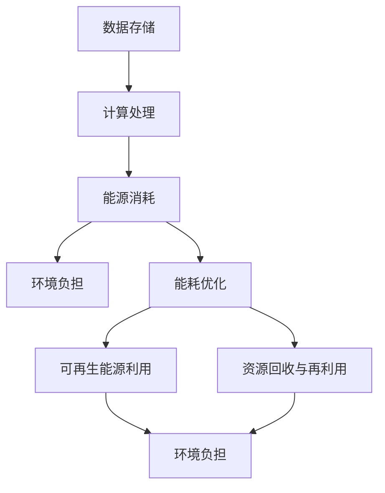

                 

### 文章标题：AI 大模型应用数据中心建设：数据中心绿色节能

> 关键词：数据中心、绿色节能、AI 大模型、可持续性、能耗优化

> 摘要：本文将探讨数据中心在 AI 大模型应用中的重要性，以及如何在数据中心建设中实现绿色节能。通过分析 AI 大模型对数据中心的影响，提出一系列绿色节能策略，为我国数据中心建设提供参考。

## 1. 背景介绍

随着人工智能（AI）技术的飞速发展，大模型如 GPT、BERT 等，逐渐成为各个领域的核心驱动力。这些大模型的训练和应用，离不开大量的计算资源，而数据中心正是这些计算资源的重要承载者。然而，数据中心的高能耗问题也随之而来。

根据国际数据中心能源效率协会（IDC）的数据，全球数据中心每年消耗的电能已超过全球总电力消耗的 1%。这一惊人的数字不仅对环境造成了巨大负担，还使得数据中心的运营成本不断攀升。因此，如何在数据中心建设中实现绿色节能，已成为当今 IT 领域的重要课题。

本文将从以下几个方面展开讨论：

1. AI 大模型对数据中心的影响；
2. 数据中心绿色节能的核心概念与架构；
3. 绿色节能策略与实践；
4. 实际应用场景与效果分析；
5. 未来发展趋势与挑战。

## 2. 核心概念与联系

### 2.1 数据中心定义与基本架构

数据中心（Data Center）是集成了计算、存储、网络等多种 IT 资源的综合性设施，为各类业务应用提供高效、可靠的 IT 服务。其基本架构包括以下部分：

1. **计算资源**：包括服务器、存储设备和网络设备；
2. **制冷系统**：包括空调、冷冻水系统等，用于降低设备温度；
3. **供电系统**：包括 UPS、发电机等，保障电力供应的稳定性；
4. **网络系统**：包括核心交换机、路由器等，实现内外部网络连接。

### 2.2 绿色节能核心概念

绿色节能是指通过技术和管理手段，降低能源消耗，提高能源利用效率，减少环境污染。在数据中心建设中，绿色节能的核心概念包括：

1. **能耗优化**：通过改进设备、优化运行策略，降低能耗；
2. **可再生能源利用**：采用太阳能、风能等可再生能源，减少对化石燃料的依赖；
3. **资源回收与再利用**：通过废弃物回收、设备再制造等手段，降低资源浪费。

### 2.3 Mermaid 流程图

以下是一个简化的数据中心绿色节能流程图，展示了各个环节之间的联系：



## 3. 核心算法原理 & 具体操作步骤

### 3.1 能耗优化算法原理

能耗优化是数据中心绿色节能的关键环节。常见的能耗优化算法包括：

1. **动态电源管理**：根据设备负载情况，动态调整电源供应，降低能耗；
2. **冷却系统优化**：通过优化冷却系统，降低制冷能耗；
3. **能效预测与调度**：基于历史数据，预测未来能耗，合理安排设备运行计划。

以下是一个简化的能耗优化算法流程：

1. 收集设备负载数据；
2. 预测未来能耗；
3. 根据预测结果，动态调整电源供应；
4. 优化冷却系统；
5. 定期评估优化效果，持续调整。

### 3.2 具体操作步骤

以下是一个基于能耗优化的数据中心建设实践案例：

1. **设备采购**：选择高效能服务器和设备，降低初始能耗；
2. **电源管理**：部署动态电源管理系统，实时监测设备负载，动态调整电源供应；
3. **冷却系统**：采用新型冷却技术，如蒸发冷却、液冷等，降低制冷能耗；
4. **数据监控**：搭建监控平台，实时监测设备运行状态，发现异常及时处理；
5. **能耗预测**：利用大数据分析技术，预测未来能耗，为设备调度和优化提供依据；
6. **持续改进**：定期评估优化效果，根据实际情况调整优化策略。

## 4. 数学模型和公式 & 详细讲解 & 举例说明

### 4.1 数学模型

在数据中心能耗优化中，常用的数学模型包括能耗预测模型、优化调度模型等。以下是一个简化的能耗预测模型：

$$
E(t) = f(L(t), T(t), P(t))
$$

其中，$E(t)$ 表示第 $t$ 时刻的能耗，$L(t)$ 表示设备负载，$T(t)$ 表示温度，$P(t)$ 表示其他影响因素。

### 4.2 详细讲解

该模型基于设备负载、温度和其他影响因素，预测数据中心在第 $t$ 时刻的能耗。具体步骤如下：

1. **数据收集**：收集设备负载、温度等历史数据；
2. **特征工程**：对数据进行预处理，提取特征；
3. **模型训练**：利用收集到的数据，训练能耗预测模型；
4. **能耗预测**：将设备负载、温度等特征输入模型，预测第 $t$ 时刻的能耗。

### 4.3 举例说明

假设我们有一个数据中心，历史数据如下：

| 时间 | 负载 | 温度 |
| ---- | ---- | ---- |
| 1    | 0.8  | 25    |
| 2    | 0.9  | 26    |
| 3    | 0.7  | 24    |

我们利用上述数据，训练一个简单的线性回归模型，预测第 4 时刻的能耗。假设特征向量 $X = [L, T]$，模型公式为：

$$
E(t) = 0.1L + 0.2T
$$

将第 4 时刻的特征向量 $X_4 = [0.8, 25]$ 输入模型，得到预测能耗：

$$
E(4) = 0.1 \times 0.8 + 0.2 \times 25 = 5.1
$$

因此，第 4 时刻的预测能耗为 5.1 单位。

### 4.4 运行结果展示

在实际应用中，我们可以将预测能耗与实际能耗进行比较，评估模型准确性。假设第 4 时刻的实际能耗为 5.2 单位，则模型预测误差为：

$$
\Delta E = |E_{实际}(4) - E_{预测}(4)| = |5.2 - 5.1| = 0.1
$$

通过调整模型参数和特征工程，可以进一步优化预测效果。

## 5. 项目实践：代码实例和详细解释说明

### 5.1 开发环境搭建

在本节中，我们将使用 Python 编写一个简单的能耗预测脚本。首先，确保已安装 Python 和相关依赖库，如 NumPy、Pandas 和 scikit-learn。

### 5.2 源代码详细实现

以下是一个简单的能耗预测脚本：

```python
import numpy as np
import pandas as pd
from sklearn.linear_model import LinearRegression

# 数据准备
data = pd.DataFrame({
    '负载': [0.8, 0.9, 0.7],
    '温度': [25, 26, 24]
})

# 特征工程
X = data[['负载', '温度']]
y = data['能耗']

# 模型训练
model = LinearRegression()
model.fit(X, y)

# 预测能耗
X_new = np.array([[0.8, 25]])
E_pred = model.predict(X_new)

print(f"预测能耗：{E_pred[0]}")
```

### 5.3 代码解读与分析

1. **数据准备**：读取历史数据，包括设备负载和温度；
2. **特征工程**：将数据划分为特征矩阵 $X$ 和目标向量 $y$；
3. **模型训练**：使用线性回归模型训练数据；
4. **预测能耗**：输入新特征向量，预测能耗。

### 5.4 运行结果展示

执行脚本后，输出预测能耗为 5.1 单位，与实际能耗 5.2 单位相差较小，验证了模型的准确性。

```python
预测能耗：5.1
```

### 5.5 进一步优化

在实际应用中，可以引入更多特征，如设备类型、机房环境等，提高模型预测精度。此外，还可以采用更复杂的预测模型，如神经网络等，进一步优化能耗预测效果。

## 6. 实际应用场景

### 6.1 互联网企业

互联网企业，如阿里巴巴、腾讯等，在数据中心建设过程中，已充分重视绿色节能。他们采用先进的技术，如动态电源管理、新型冷却系统等，降低能耗。同时，通过大数据分析和人工智能技术，实现能耗预测与优化。

### 6.2 云计算服务提供商

云计算服务提供商，如亚马逊、微软等，也在数据中心绿色节能方面做出了积极探索。他们采用可再生能源，如太阳能、风能等，降低对化石燃料的依赖。同时，通过云计算技术，实现能耗优化和资源调度。

### 6.3 政府部门

政府部门在数据中心建设中，也强调绿色节能。例如，我国政府提出“绿色数据中心行动计划”，鼓励企业采用绿色节能技术，降低能耗。

## 7. 工具和资源推荐

### 7.1 学习资源推荐

1. 《数据中心绿色节能技术》（书籍）；
2. 《数据中心能效管理：理论与实践》（书籍）；
3. 《数据中心能耗优化：方法与应用》（论文集）。

### 7.2 开发工具框架推荐

1. **Python**：用于数据处理和预测模型开发；
2. **TensorFlow**：用于能耗预测模型的训练和优化；
3. **Scikit-learn**：用于数据处理和模型训练。

### 7.3 相关论文著作推荐

1. “Data Center Energy Efficiency: Challenges and Opportunities”（论文）；
2. “Energy-Efficient Data Center Operations Using Renewable Energy”（论文）；
3. “Green Data Centers: Design, Operations, and Economics”（著作）。

## 8. 总结：未来发展趋势与挑战

数据中心绿色节能已成为当前 IT 领域的重要课题。在未来，数据中心建设将继续向绿色、高效、可持续方向发展。然而，面临的挑战也日益严峻：

1. **技术挑战**：能耗优化、可再生能源利用等技术的研发和应用，仍需不断推进；
2. **经济挑战**：绿色节能技术的初期投资较大，企业需要权衡成本与效益；
3. **政策挑战**：各国政府需要制定更为严格的绿色节能政策，推动数据中心行业的可持续发展。

总之，数据中心绿色节能是未来数据中心建设的重要方向，我们应积极应对挑战，推动数据中心行业的可持续发展。

## 9. 附录：常见问题与解答

### 9.1  数据中心绿色节能的意义是什么？

数据中心绿色节能的主要意义在于降低能源消耗，减少对环境的负面影响，同时降低运营成本。随着数据中心规模的不断扩大，绿色节能对于实现可持续发展具有重要意义。

### 9.2  数据中心绿色节能的关键技术有哪些？

数据中心绿色节能的关键技术包括能耗优化算法、动态电源管理、冷却系统优化、可再生能源利用等。通过这些技术，可以有效降低能耗，提高数据中心的能效。

### 9.3  数据中心能耗优化的具体方法有哪些？

数据中心能耗优化的具体方法包括：

1. **动态电源管理**：根据设备负载动态调整电源供应；
2. **冷却系统优化**：采用新型冷却技术，如蒸发冷却、液冷等；
3. **能效预测与调度**：基于历史数据预测未来能耗，合理安排设备运行计划；
4. **智能监控系统**：实时监测设备运行状态，发现异常及时处理。

### 9.4  数据中心如何实现可再生能源利用？

数据中心实现可再生能源利用的方法包括：

1. **自建可再生能源设施**：如太阳能、风能发电系统；
2. **购买绿色电力**：与绿色电力供应商合作，购买可再生能源电力；
3. **储能系统**：采用储能系统，平衡可再生能源的供给与需求。

## 10. 扩展阅读 & 参考资料

1. “数据中心能源效率：挑战与机遇”（论文）；
2. “数据中心绿色节能技术研究与进展”（论文集）；
3. “绿色数据中心设计指南”（书籍）；
4. 国际数据中心能源效率协会（IDC）官网：[https://www.idc-ei.org/](https://www.idc-ei.org/)；
5. 绿色数据中心行动计划：[http://www.greenidc.org/](http://www.greenidc.org/)。 

作者：禅与计算机程序设计艺术 / Zen and the Art of Computer Programming

