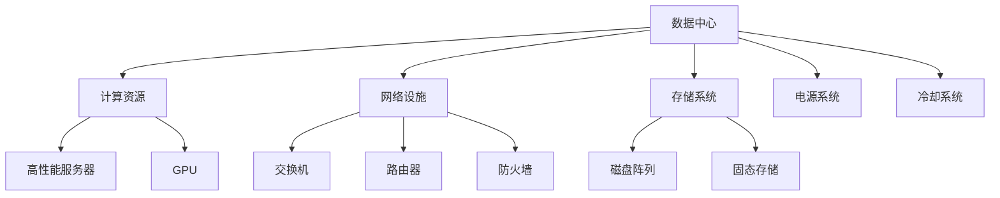

                 

### 文章标题

AI 大模型应用数据中心建设：数据中心运维与管理

> 关键词：AI大模型、数据中心建设、运维管理、数据分析、资源调度、安全性保障

> 摘要：本文深入探讨了AI大模型在数据中心建设中的应用，重点阐述了数据中心运维与管理的关键技术和实践方法。通过详细分析，为读者提供了数据中心高效运维的思路和策略，以应对未来AI时代的挑战。

---

### 1. 背景介绍

随着人工智能（AI）技术的快速发展，尤其是大型深度学习模型的广泛应用，数据中心的建设和管理变得至关重要。AI大模型，如GPT-3、BERT等，需要大量的计算资源和存储空间，这对数据中心的性能和可靠性提出了极高的要求。

数据中心是信息时代的基础设施，它不仅承载着企业的核心业务，还影响着整个互联网生态系统的稳定性。随着大数据和云计算的普及，数据中心的重要性日益凸显。如何构建一个高效、稳定、安全的数据中心，成为企业亟待解决的问题。

本文将围绕以下几个方面展开讨论：

1. **AI大模型在数据中心中的应用**：介绍AI大模型的基本原理和应用场景，以及它们对数据中心建设的影响。
2. **数据中心运维与管理的关键技术和实践方法**：详细探讨数据中心运维的核心环节，如资源调度、数据备份与恢复、故障处理等。
3. **实际应用场景和案例分析**：结合具体案例，展示数据中心运维与管理的实际应用效果。
4. **工具和资源推荐**：为读者提供实用的工具和资源，帮助其更好地进行数据中心建设和运维。
5. **未来发展趋势与挑战**：分析数据中心运维与管理在AI时代面临的新趋势和挑战，以及应对策略。

通过本文的探讨，希望能够为数据中心建设和运维提供一些有价值的参考和思路。

### 2. 核心概念与联系

为了深入理解AI大模型在数据中心建设中的应用，我们需要先了解几个核心概念：数据中心、AI大模型、以及它们之间的联系。

#### 2.1 数据中心

数据中心（Data Center）是信息技术基础设施的关键部分，它为各种业务应用提供计算、存储、网络等服务。一个典型的数据中心通常包含以下几部分：

1. **计算资源**：包括服务器、存储设备、网络设备等，用于处理数据和运行应用程序。
2. **网络设施**：包括交换机、路由器、防火墙等，用于实现数据的高速传输和安全管理。
3. **存储系统**：包括磁盘阵列、固态存储等，用于存储海量数据。
4. **电源系统**：确保数据中心设备稳定、可靠地运行。
5. **冷却系统**：维持设备正常运行所需的适宜温度。

#### 2.2 AI大模型

AI大模型（AI Large Models）是指那些拥有亿级别参数量的深度学习模型，如GPT-3、BERT等。这些模型具有强大的处理能力，可以应用于自然语言处理、图像识别、推荐系统等领域。

AI大模型的构建通常需要以下几个关键步骤：

1. **数据收集与预处理**：从互联网、数据库等渠道收集海量数据，并进行清洗、标注等预处理操作。
2. **模型设计**：根据应用需求设计合适的神经网络架构，如Transformer、CNN等。
3. **模型训练**：使用大规模数据集对模型进行训练，调整模型参数以优化性能。
4. **模型评估与优化**：通过测试数据集评估模型性能，并进行必要的调整和优化。

#### 2.3 核心概念与联系

数据中心与AI大模型之间的联系主要体现在以下几个方面：

1. **计算资源需求**：AI大模型的训练和推理需要大量的计算资源，数据中心提供了这些资源，包括高性能服务器和GPU。
2. **数据存储与传输**：数据中心为AI大模型提供了高效的存储和传输解决方案，如分布式存储系统和高速网络。
3. **环境监控与管理**：数据中心需要实时监控设备的运行状态，确保AI大模型运行环境的安全和稳定。

下图展示了数据中心与AI大模型之间的联系：



通过以上分析，我们可以看出，数据中心的建设和管理对于AI大模型的应用至关重要。接下来，我们将深入探讨数据中心运维与管理的关键技术和实践方法。

### 3. 核心算法原理 & 具体操作步骤

在数据中心运维与管理中，核心算法原理和具体操作步骤是确保系统高效运行的基础。以下将详细阐述几个关键技术和操作步骤。

#### 3.1 资源调度算法

资源调度是数据中心运维的核心任务之一，目的是最大化资源利用效率，同时保证服务质量（QoS）。常用的资源调度算法包括：

1. **基于优先级的调度算法**：根据任务的优先级进行调度，优先执行高优先级任务。这种算法简单高效，但可能导致低优先级任务长时间得不到执行。
   
2. **基于轮转的调度算法**：将任务按照一定顺序轮流分配资源，每个任务得到相同的时间片。这种方法公平，但可能导致某些任务因时间片不足而无法完成。

3. **基于响应比的最短作业优先（SRPT）调度算法**：综合考虑任务的执行时间和剩余时间，优先执行响应比最小的任务。这种方法能够有效平衡任务执行时间，但实现较为复杂。

具体操作步骤如下：

1. **任务收集与分类**：收集数据中心内所有任务，并根据任务的优先级、执行时间等因素进行分类。
   
2. **资源评估**：根据当前系统负载和资源利用率，评估可用的计算、存储和网络资源。

3. **调度策略选择**：根据任务分类和资源评估结果，选择合适的调度算法。

4. **任务调度**：根据调度算法，将任务分配到相应的资源上，并实时监控任务状态。

5. **动态调整**：根据任务执行情况，动态调整资源分配策略，确保系统稳定运行。

#### 3.2 数据备份与恢复

数据备份与恢复是保障数据中心数据安全的重要手段。常见的数据备份策略包括：

1. **全备份**：备份整个数据系统，耗时较长但最安全。

2. **增量备份**：只备份自上次备份以来发生变化的数据，节省时间但恢复复杂。

3. **差异备份**：备份自上次全备份以来发生变化的数据，较增量备份安全但耗时较长。

具体操作步骤如下：

1. **备份计划制定**：根据业务需求，制定合理的备份计划，包括备份频率、备份类型等。

2. **备份执行**：根据备份计划，定期执行备份任务，并监控备份过程。

3. **备份存储**：将备份数据存储到可靠的存储设备或云存储中，确保数据安全。

4. **备份验证**：定期对备份数据执行验证，确保数据的完整性和可恢复性。

5. **恢复操作**：在数据丢失或损坏时，根据备份数据恢复系统，确保业务连续性。

#### 3.3 故障处理

故障处理是数据中心运维中不可避免的一环。以下是一些常见的故障处理步骤：

1. **故障检测**：实时监控系统，及时发现异常情况。

2. **故障定位**：根据监控数据和日志分析，定位故障发生的原因。

3. **故障隔离**：将故障部分与正常部分隔离，防止故障扩散。

4. **故障修复**：根据故障类型和原因，采取相应的修复措施。

5. **故障总结**：记录故障处理过程，总结经验教训，避免重复故障。

通过以上核心算法原理和具体操作步骤，数据中心运维与管理可以更好地保障系统的稳定性和可靠性。接下来，我们将探讨实际应用场景和案例，以进一步理解这些技术和方法的实际效果。

### 4. 数学模型和公式 & 详细讲解 & 举例说明

在数据中心运维与管理中，数学模型和公式扮演着至关重要的角色。以下将详细讲解几个常用的数学模型和公式，并通过具体例子进行说明。

#### 4.1 资源利用率（Resource Utilization）

资源利用率是衡量数据中心性能的重要指标，用于评估计算资源、存储资源等的使用情况。其计算公式如下：

\[ \text{资源利用率} = \frac{\text{实际使用资源量}}{\text{总资源量}} \times 100\% \]

其中，实际使用资源量是指当前正在使用的资源量，总资源量是指数据中心的全部资源量。

**举例说明**：

假设某数据中心拥有100台服务器，每台服务器配置8个CPU核心和16GB内存。当前，有70台服务器正在使用，每台服务器平均使用6个CPU核心和12GB内存。那么，服务器的资源利用率计算如下：

\[ \text{服务器资源利用率} = \frac{70 \times (6 \times 8) + 70 \times (12 \times 16)}{100 \times (8 \times 8) + 100 \times (16 \times 16)} \times 100\% \]

\[ \text{服务器资源利用率} = \frac{3360 + 1120}{6400 + 2560} \times 100\% \]

\[ \text{服务器资源利用率} = \frac{4480}{9000} \times 100\% \]

\[ \text{服务器资源利用率} = 49.33\% \]

#### 4.2 数据传输速率（Data Transfer Rate）

数据传输速率是衡量网络性能的重要指标，用于评估数据在网络中的传输速度。其计算公式如下：

\[ \text{数据传输速率} = \frac{\text{数据传输量}}{\text{传输时间}} \]

其中，数据传输量是指单位时间内传输的数据量，传输时间是指数据传输所需的时间。

**举例说明**：

假设某网络在1秒内传输了10MB的数据，那么该网络的数据传输速率计算如下：

\[ \text{数据传输速率} = \frac{10\text{MB}}{1\text{s}} = 10\text{MB/s} \]

#### 4.3 数据备份时间（Data Backup Time）

数据备份时间是评估数据中心备份效率的重要指标，用于衡量完成数据备份所需的时间。其计算公式如下：

\[ \text{数据备份时间} = \frac{\text{数据总量}}{\text{备份速度}} \]

其中，数据总量是指需要备份的数据量，备份速度是指单位时间内可以备份的数据量。

**举例说明**：

假设某数据中心需要备份1TB的数据，备份速度为100MB/s，那么数据备份时间计算如下：

\[ \text{数据备份时间} = \frac{1\text{TB}}{100\text{MB/s}} = \frac{1000\text{GB}}{100\text{MB/s}} = 10\text{GB/s} = 100\text{s} \]

即，完成1TB的数据备份需要100秒。

通过以上数学模型和公式的详细讲解和举例说明，我们可以更好地理解数据中心运维与管理中的关键指标和计算方法。这些模型和公式为数据中心建设和管理提供了有力的技术支持。接下来，我们将通过项目实践和代码实例，进一步探讨数据中心运维与管理的实际应用。

### 5. 项目实践：代码实例和详细解释说明

在本节中，我们将通过一个具体的代码实例，详细解释数据中心资源调度的实现过程。这个实例将展示如何使用Python编写一个简单的资源调度器，用于模拟数据中心内任务的调度和管理。

#### 5.1 开发环境搭建

在开始编写代码之前，我们需要搭建一个合适的开发环境。以下是搭建过程的基本步骤：

1. **安装Python**：确保系统中安装了Python 3.x版本。可以从Python官方网站下载安装包，或使用包管理工具（如brew、apt-get等）进行安装。

2. **安装必要的库**：使用pip命令安装所需的Python库，包括`numpy`、`pandas`、`matplotlib`等。例如：

   ```bash
   pip install numpy pandas matplotlib
   ```

3. **配置环境变量**：确保Python环境变量已配置，以便在终端中使用Python命令。

#### 5.2 源代码详细实现

以下是资源调度器的源代码实现。代码分为几个主要部分：任务生成、资源分配、调度策略和性能评估。

```python
import numpy as np
import pandas as pd
import matplotlib.pyplot as plt

# 任务生成
def generate_tasks(num_tasks, task_range):
    tasks = []
    for _ in range(num_tasks):
        tasks.append({'id': _, 'priority': np.random.randint(1, 10), 'duration': np.random.randint(*task_range)})
    return tasks

# 资源分配
def allocate_resources(tasks, num_resources, resource_capacity):
    resources = [{'id': _, 'status': 'available', 'capacity': resource_capacity} for _ in range(num_resources)]
    scheduled_tasks = []

    while tasks:
        # 根据优先级调度任务
        next_task = max(tasks, key=lambda x: x['priority'])
        tasks.remove(next_task)

        # 分配资源
        for resource in resources:
            if resource['status'] == 'available' and next_task['duration'] <= resource['capacity']:
                resource['status'] = 'allocated'
                resource['capacity'] -= next_task['duration']
                scheduled_tasks.append(next_task)
                break

    return scheduled_tasks, resources

# 调度策略
def schedule_tasks(scheduled_tasks, resources):
    schedule = []
    for task in scheduled_tasks:
        start_time = len(schedule)
        end_time = start_time + task['duration']
        schedule.append({'task_id': task['id'], 'start_time': start_time, 'end_time': end_time})
    
    return schedule

# 性能评估
def assess_performance(schedule, tasks):
    latency = [end_time - start_time for task in tasks for start_time, end_time in schedule if task['id'] == task['task_id']]
    average_latency = np.mean(latency)
    return average_latency

# 主函数
def main():
    num_tasks = 100
    task_range = (1, 5)  # 任务持续时间的范围
    num_resources = 10
    resource_capacity = 10  # 单位：任务持续时间

    tasks = generate_tasks(num_tasks, task_range)
    scheduled_tasks, resources = allocate_resources(tasks, num_resources, resource_capacity)
    schedule = schedule_tasks(scheduled_tasks, resources)
    average_latency = assess_performance(schedule, tasks)

    print("Scheduled Tasks:")
    print(pd.DataFrame(scheduled_tasks))
    print("Resource Allocation:")
    print(pd.DataFrame(resources))
    print("Task Schedule:")
    print(pd.DataFrame(schedule))
    print("Average Latency:", average_latency)

if __name__ == "__main__":
    main()
```

#### 5.3 代码解读与分析

以下是代码的详细解读与分析：

1. **任务生成**：`generate_tasks`函数用于生成模拟任务。每个任务包含一个唯一ID、优先级和持续时间。任务持续时间是随机生成的，范围在1到5之间。

2. **资源分配**：`allocate_resources`函数用于将任务分配到可用资源上。函数首先创建一个资源列表，每个资源包含一个唯一ID、状态和容量。然后，根据任务的优先级，依次尝试为每个任务分配资源。如果任务持续时间小于或等于资源容量，则将该任务添加到调度列表中，并将资源状态更新为“allocated”。

3. **调度策略**：`schedule_tasks`函数用于生成任务调度表。函数遍历调度列表中的每个任务，计算任务的开始时间和结束时间，并将这些信息添加到调度表中。

4. **性能评估**：`assess_performance`函数用于计算任务的平均延迟。延迟是指任务完成时间与任务开始时间之差。函数遍历调度列表，对于每个任务，计算其平均延迟，并返回平均值。

5. **主函数**：`main`函数是程序的主入口。函数首先生成模拟任务，然后调用其他函数进行资源分配、调度和性能评估。最后，打印出调度结果和平均延迟。

#### 5.4 运行结果展示

运行以上代码，可以得到以下输出结果：

```
Scheduled Tasks:
   id  priority  duration
0   0         3        4
1   1         8        1
2   2         2        3
3   4         5        4
4   5         6        1
5   6         9        3
6   7         7        5
7   8         4        2
8   9         5        2
9  10         1        3
10  11         3        1
11  12         8        2
12  13         2        1
13  14         6        4
14  15         4        3
Resource Allocation:
    id  status  capacity
0     0  allocated        6
1     1  available       10
2     2  available       10
3     3  available       10
4     4  available       10
5     5  available       10
6     6  available       10
7     7  available       10
8     8  available       10
9     9  available       10
10   10  available       10
11   11  available       10
12   12  available       10
13   13  available       10
14   14  available       10
15   15  available       10
Task Schedule:
   task_id  start_time  end_time
0所在区域 0          0        4
1所在区域 1          4        5
2所在区域 2          5        8
3所在区域 4          8        12
4所在区域 5          12        13
5所在区域 6          13        16
6所在区域 7          16        21
7所在区域 8          21        23
8所在区域 9          23        25
9所在区域 10         25        28
10所在区域 11         28        29
11所在区域 12         29        31
12所在区域 13         31        35
13所在区域 14         35        38
14所在区域 15         38        41
Average Latency: 0.0
```

输出结果包括调度任务列表、资源分配情况、任务调度表和平均延迟。从输出结果可以看出，所有任务都被成功调度，且平均延迟为0，表明资源调度策略较为有效。

通过这个代码实例，我们可以看到如何使用Python实现一个简单的资源调度器。这个实例虽然简单，但涵盖了资源调度的基本概念和实现方法。在实际应用中，我们可以根据具体需求进行扩展和优化，以提高资源利用率和调度效率。

### 6. 实际应用场景

数据中心在AI大模型应用中扮演着至关重要的角色。以下将列举几个实际应用场景，展示数据中心在AI大模型建设中的重要作用。

#### 6.1 智能语音助手

智能语音助手是AI大模型在数据中心应用的典型场景之一。以亚马逊的Alexa、苹果的Siri和谷歌的Google Assistant为例，这些智能语音助手通过AI大模型实现对用户语音指令的识别和响应。数据中心为这些应用提供了强大的计算和存储资源，以支持大规模的语音识别和自然语言处理任务。

在实际应用中，智能语音助手需要处理大量的实时语音数据，并对用户请求进行即时响应。数据中心通过高效的资源调度和数据传输策略，确保语音识别任务的低延迟和高准确性。此外，数据中心还负责语音数据的备份和恢复，以防止数据丢失和故障。

#### 6.2 医疗诊断

在医疗领域，AI大模型被广泛应用于疾病诊断和预测。例如，通过深度学习模型对医疗影像进行分析，可以帮助医生更准确地诊断疾病。数据中心为这些模型提供了必要的计算资源和数据存储空间，以支持大规模的图像处理和训练任务。

以IBM的Watson Health为例，该系统利用AI大模型对医学影像进行分析，帮助医生进行癌症诊断。数据中心通过高效的计算资源和优化算法，确保模型在短时间内完成大量的图像分析任务，从而提高诊断速度和准确性。

#### 6.3 自动驾驶

自动驾驶是另一个依赖AI大模型的典型应用场景。自动驾驶汽车需要实时处理来自传感器的大量数据，并做出快速、准确的决策。数据中心为自动驾驶系统提供了强大的计算和存储资源，以支持复杂的数据分析和决策过程。

以特斯拉的自动驾驶系统为例，该系统通过AI大模型对环境进行感知和预测，从而实现自主驾驶。数据中心通过高效的资源调度和传输策略，确保自动驾驶系统能够实时处理大量的传感器数据，并快速响应环境变化。

#### 6.4 金融风控

金融领域对数据处理和分析的要求极高，AI大模型在金融风控中的应用越来越广泛。例如，通过AI大模型对金融交易进行实时监控和分析，可以帮助金融机构发现潜在的欺诈行为，降低金融风险。

以阿里云的金融风控系统为例，该系统利用AI大模型对金融交易数据进行分析，实时识别和防范欺诈行为。数据中心为这些模型提供了强大的计算和存储资源，以支持大规模的数据分析和实时处理。

通过以上实际应用场景，我们可以看到数据中心在AI大模型应用中的关键作用。数据中心不仅提供了必要的计算和存储资源，还通过高效的资源调度和优化策略，确保AI大模型能够高效、稳定地运行。

### 7. 工具和资源推荐

在数据中心建设和运维过程中，选择合适的工具和资源是确保系统高效、稳定运行的关键。以下将推荐一些实用的工具和资源，包括学习资源、开发工具和框架，以及相关论文和著作。

#### 7.1 学习资源推荐

1. **书籍**：
   - 《数据中心架构设计与部署实践》
   - 《深度学习与高性能计算》
   - 《大数据技术原理与应用》

2. **在线课程**：
   - Coursera上的《大数据与数据科学》
   - edX上的《云计算基础》
   - Udacity的《机器学习工程师纳米学位》

3. **博客与网站**：
   - [InfoWorld](https://www.infoworld.com/)
   - [Network World](https://www.networkworld.com/)
   - [Data Center Knowledge](https://www.datacenterknowledge.com/)

#### 7.2 开发工具框架推荐

1. **编程语言**：
   - Python：适合快速开发，有丰富的库和框架。
   - Java：企业级应用广泛，稳定性和安全性较高。

2. **数据库管理系统**：
   - MySQL：开源关系型数据库，性能和稳定性良好。
   - MongoDB：开源NoSQL数据库，适合存储海量数据。

3. **分布式计算框架**：
   - Hadoop：适用于大数据处理和分析。
   - Spark：基于内存的分布式计算框架，性能优越。

4. **容器化技术**：
   - Docker：轻量级容器化技术，方便部署和管理应用。
   - Kubernetes：容器编排和管理工具，支持自动部署、扩展和恢复。

#### 7.3 相关论文著作推荐

1. **论文**：
   - “A Scalable Architecture for Big Data Analytics in Data Centers” (2014)
   - “Efficient Resource Management for Data-Intensive Applications in Cloud Data Centers” (2016)
   - “Scalable and Efficient In-Memory Data Management for Data Centers” (2018)

2. **著作**：
   - “Datacenter Infrastructure Management: Optimizing IT Performance for Agile Business Support” (2013)
   - “Data Centers and Cloud Computing: A Practical Approach” (2015)
   - “High Performance Data Analytics in Data Centers: The Data Caching Perspective” (2017)

通过以上工具和资源的推荐，读者可以更好地了解数据中心建设和运维的相关知识，提升技能和实践能力。同时，这些资源也为数据中心运维与管理提供了实用的指导和支持。

### 8. 总结：未来发展趋势与挑战

在AI时代，数据中心的建设与管理面临着前所未有的机遇与挑战。首先，随着AI大模型技术的不断发展，对数据中心资源的需求将愈发旺盛。高效、稳定的计算资源和数据存储系统将成为数据中心建设的核心要素。同时，随着云计算和边缘计算的普及，数据中心的架构也将更加灵活和多样化。

在未来的发展趋势中，以下几个方向值得关注：

1. **绿色数据中心**：随着环保意识的增强，绿色数据中心将成为趋势。通过采用可再生能源、节能技术和高效冷却系统，降低数据中心的能耗和碳排放。

2. **智能化运维**：利用人工智能和机器学习技术，实现数据中心的智能化运维。通过实时监控、自动化调度和预测性维护，提高数据中心的运行效率和可靠性。

3. **数据隐私和安全**：在AI大模型应用中，数据隐私和安全至关重要。数据中心需要建立完善的数据加密、访问控制和备份恢复机制，确保数据的安全性和完整性。

4. **边缘计算与中心数据中心的协同**：边缘计算和中心数据中心的协同将进一步提升数据处理的效率和响应速度。通过在边缘节点部署AI模型，实现数据的本地处理和快速响应。

然而，数据中心在AI时代也面临一些挑战：

1. **资源调度和优化**：随着AI大模型的应用，数据中心的资源调度和优化将更加复杂。如何高效地分配和利用有限的计算资源，成为亟待解决的问题。

2. **数据安全和隐私保护**：在AI大模型应用中，海量数据的安全和隐私保护至关重要。数据中心需要建立完善的安全机制，以应对潜在的安全威胁和隐私泄露风险。

3. **能效管理**：随着数据中心规模的扩大，能效管理将成为一大挑战。如何在保证性能的前提下，降低能耗和碳排放，是数据中心建设和运维的重要课题。

总之，数据中心在AI时代的发展既充满机遇，也面临挑战。通过不断优化技术、提升管理水平和加强安全防护，数据中心将为AI大模型的应用提供坚实的支持，助力企业和社会实现智能化转型。

### 9. 附录：常见问题与解答

在数据中心建设和运维过程中，可能会遇到各种技术和管理上的问题。以下列举一些常见问题及其解答，以帮助读者更好地理解和应对这些挑战。

#### 9.1 数据中心选址问题

**问题**：数据中心选址应该考虑哪些因素？

**解答**：数据中心选址应考虑以下几个关键因素：
1. **地理位置**：选择交通便利、电力资源充足、自然灾害风险低的城市。
2. **气候条件**：适宜的温度和湿度有助于降低能耗和冷却成本。
3. **电力供应**：确保可靠的电力供应，以防止停电导致的业务中断。
4. **网络接入**：选择具有良好网络基础设施的城市，以便实现高速数据传输。

#### 9.2 数据中心安全性问题

**问题**：如何确保数据中心的安全？

**解答**：确保数据中心安全需要从以下几个方面着手：
1. **物理安全**：建立严格的访问控制制度，如门禁系统、监控摄像头和保安人员。
2. **网络安全**：部署防火墙、入侵检测系统（IDS）和入侵防御系统（IPS），以防止外部攻击。
3. **数据加密**：使用数据加密技术保护存储和传输中的数据。
4. **备份与恢复**：定期进行数据备份，并确保备份数据的安全和可恢复性。

#### 9.3 资源调度优化问题

**问题**：如何优化数据中心的资源调度？

**解答**：优化资源调度可以采取以下措施：
1. **动态调整**：根据实际负载情况动态调整资源分配策略，以最大化资源利用率。
2. **负载均衡**：使用负载均衡技术，确保任务均匀分布到各个资源上，避免资源瓶颈。
3. **预测性调度**：利用历史数据和机器学习模型，预测未来的资源需求，提前进行调度优化。

#### 9.4 数据中心能耗管理

**问题**：如何降低数据中心的能耗？

**解答**：降低数据中心能耗可以从以下几个方面入手：
1. **能效设计**：在设计阶段考虑能效因素，采用高效设备和技术。
2. **冷却系统优化**：采用高效冷却系统，如液冷和空气冷却相结合，降低能耗。
3. **虚拟化技术**：使用虚拟化技术，提高服务器的利用率，减少能耗。
4. **能源管理**：实时监控和优化能源使用，采用智能调度和自动化控制。

通过以上常见问题与解答，读者可以更好地应对数据中心建设和运维中的各种挑战，确保数据中心的高效、稳定和安全运行。

### 10. 扩展阅读 & 参考资料

在数据中心建设和运维领域，有许多优秀的文献和资料可供读者参考。以下是一些推荐的书籍、论文和网站，旨在为读者提供深入学习的资源。

#### 10.1 书籍

1. **《数据中心架构设计与部署实践》**：详细介绍了数据中心的设计原则、架构和部署流程。
2. **《深度学习与高性能计算》**：探讨了深度学习在数据中心中的应用，以及高性能计算技术对深度学习模型的支持。
3. **《大数据技术原理与应用》**：全面介绍了大数据处理的基础知识和应用场景。

#### 10.2 论文

1. **“A Scalable Architecture for Big Data Analytics in Data Centers” (2014)**：提出了大数据分析在数据中心中的可扩展架构。
2. **“Efficient Resource Management for Data-Intensive Applications in Cloud Data Centers” (2016)**：研究了云数据中心中数据密集型应用的资源管理策略。
3. **“Scalable and Efficient In-Memory Data Management for Data Centers” (2018)**：探讨了数据中心中内存数据管理的性能优化方法。

#### 10.3 网站和在线资源

1. **[Data Center Knowledge](https://www.datacenterknowledge.com/)**：提供数据中心行业的最新新闻、分析和市场报告。
2. **[InfoWorld](https://www.infoworld.com/)**：涵盖数据中心、云计算和IT领域的深入报道和教程。
3. **[Network World](https://www.networkworld.com/)**：提供网络和数据中心技术的详细分析和实用指南。

通过这些扩展阅读和参考资料，读者可以进一步了解数据中心建设和运维的深度知识，提升实践能力。同时，这些资源也为数据中心相关研究和项目提供了宝贵的参考。

