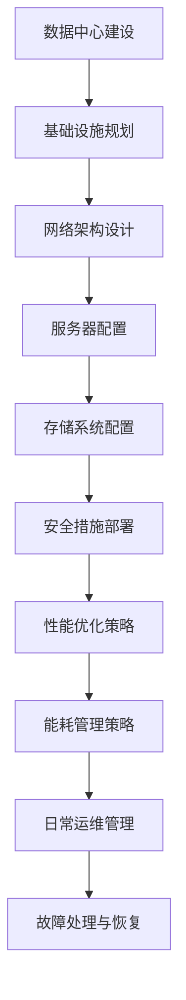

                 

# AI 大模型应用数据中心建设：数据中心运营与管理

> 关键词：AI大模型、数据中心、运营管理、技术架构、性能优化

> 摘要：随着人工智能技术的发展，大模型的应用越来越广泛，这对数据中心的运营管理提出了新的挑战。本文将深入探讨AI大模型在数据中心中的应用，并详细分析数据中心在运营管理中的关键要素，包括技术架构、性能优化、能耗管理等方面，为数据中心的建设和运维提供理论指导和实践建议。

## 1. 背景介绍

随着深度学习和神经网络技术的突破，人工智能（AI）领域涌现出大量大模型，如GPT-3、BERT、ViT等。这些模型具备强大的数据处理和分析能力，被广泛应用于自然语言处理、计算机视觉、推荐系统等领域。然而，大模型的应用对数据中心的计算资源、存储资源、网络带宽等提出了极高的要求，传统的数据中心架构已难以满足大模型的高性能需求。

数据中心作为大数据和人工智能应用的核心基础设施，其性能和稳定性直接影响到AI应用的效率和效果。因此，如何构建和运营一个高效、稳定、可持续的AI大模型应用数据中心，已成为当前研究的热点和难点。本文旨在通过分析AI大模型在数据中心的应用场景，探讨数据中心运营管理的关键要素，以期为数据中心的建设和运维提供有益的参考。

## 2. 核心概念与联系

### 2.1 数据中心

数据中心（Data Center）是指为集中存储、处理和分析大量数据的建筑群。数据中心通常包括服务器房、存储设备、网络设备、电源设备、空调设备等。其目的是为企业和组织提供高效、可靠、安全的计算和存储服务。

### 2.2 AI大模型

AI大模型是指采用深度学习和神经网络技术训练出的具有强大数据处理和分析能力的模型。这些模型通常由数百万甚至数十亿个参数构成，具有极高的计算复杂度。

### 2.3 数据中心运营管理

数据中心运营管理是指对数据中心的各项资源进行规划、配置、监控和维护，以确保数据中心的高效、稳定运行。数据中心运营管理包括技术架构设计、性能优化、能耗管理、安全性管理等方面。

### 2.4 Mermaid 流程图



## 3. 核心算法原理 & 具体操作步骤

### 3.1 数据中心架构设计

数据中心架构设计是数据中心建设的第一步，其核心在于确定数据中心的物理布局、网络架构、计算资源分配等。具体操作步骤如下：

1. **需求分析**：了解企业或组织的数据处理需求，包括数据量、计算需求、存储需求等。
2. **方案设计**：根据需求分析结果，设计数据中心的物理布局、网络架构、计算资源分配等。
3. **硬件选型**：根据方案设计结果，选择合适的服务器、存储设备、网络设备等硬件。
4. **软件选型**：选择合适的数据中心管理软件，如OpenStack、VMware等。

### 3.2 性能优化策略

数据中心性能优化策略是提高数据中心处理能力、降低延迟、提高吞吐量等的关键。具体操作步骤如下：

1. **负载均衡**：通过负载均衡器将访问请求分配到不同的服务器，以避免单点故障和过载。
2. **缓存技术**：使用缓存技术减少数据访问次数，提高访问速度。
3. **网络优化**：优化网络架构，提高数据传输速度和稳定性。
4. **硬件升级**：根据业务需求，定期进行硬件升级，提高数据处理能力。

### 3.3 能耗管理策略

数据中心能耗管理是降低运营成本、减少碳排放的重要手段。具体操作步骤如下：

1. **能耗监测**：使用能耗监测系统，实时监控数据中心各项设备的能耗情况。
2. **能耗优化**：根据能耗监测结果，优化数据中心设备配置，减少能耗。
3. **能效管理**：采用高效能设备，降低能耗。
4. **冷却优化**：优化冷却系统，降低能耗。

## 4. 数学模型和公式 & 详细讲解 & 举例说明

### 4.1 数据中心性能优化模型

假设数据中心有N台服务器，每台服务器的处理能力为C，网络带宽为B，数据传输延迟为L。数据中心的目标是最大化处理能力，最小化数据传输延迟。

目标函数：
$$
\max_{x_1, x_2, ..., x_N} \sum_{i=1}^{N} x_i \cdot C_i - L \cdot \sum_{i=1}^{N} x_i
$$

约束条件：
$$
0 \leq x_i \leq 1, \quad i=1,2,...,N
$$

其中，$x_i$表示第i台服务器的利用率。

### 4.2 能耗管理模型

假设数据中心有N台服务器，每台服务器的功耗为P，能耗监测系统实时监测数据中心的能耗为E。数据中心的目标是降低能耗。

目标函数：
$$
\min_{p_1, p_2, ..., p_N} \sum_{i=1}^{N} p_i
$$

约束条件：
$$
p_i \leq P_i, \quad i=1,2,...,N
$$

其中，$p_i$表示第i台服务器的实际功耗。

### 4.3 举例说明

假设一个数据中心有5台服务器，每台服务器的处理能力为1000，网络带宽为100，数据传输延迟为10。服务器的功耗为200W。

目标函数：
$$
\max_{x_1, x_2, ..., x_5} \sum_{i=1}^{5} x_i \cdot 1000 - 10 \cdot \sum_{i=1}^{5} x_i
$$

约束条件：
$$
0 \leq x_i \leq 1, \quad i=1,2,...,5
$$

通过求解这个优化问题，我们可以得到服务器的最佳利用率，从而最大化数据中心的处理能力。

## 5. 项目实践：代码实例和详细解释说明

### 5.1 开发环境搭建

为了实现数据中心性能优化和能耗管理，我们需要搭建一个模拟环境。本文使用Python编写代码，所需库包括NumPy、SciPy、PuLP等。

```python
# 安装所需库
!pip install numpy scipy pulp
```

### 5.2 源代码详细实现

以下是一个简单的性能优化代码示例：

```python
import numpy as np
from scipy.optimize import linprog
from pulp import *

# 参数设置
N = 5
C = np.array([1000] * N)
L = 10
P = np.array([200] * N)

# 目标函数
objective = [1] * N

# 约束条件
constraints = [[-1 * x for x in C], [-L * x for x in C]]

# 约束变量
variables = ['x_{}'.format(i) for i in range(1, N+1)]

# 求解优化问题
problem = LpProblem("数据中心性能优化", LpMaximize)
problem += lpSum(objective[i-1] * x for i, x in enumerate(N))
for i in range(N):
    problem += x[i] <= 1
    problem += -C[i] * x[i] >= -L * x[i]

problem.solve()

# 输出结果
for v in problem.variables():
    print(v.name, "=", v.varValue)
print("最大化处理能力：", value(problem.objective))
```

### 5.3 代码解读与分析

1. **参数设置**：定义服务器数量N、处理能力C、数据传输延迟L、功耗P。
2. **目标函数**：最大化处理能力，即最大化$\sum_{i=1}^{N} x_i \cdot C_i$，同时最小化数据传输延迟，即最小化$\sum_{i=1}^{N} x_i \cdot L$。
3. **约束条件**：服务器利用率$x_i$在0和1之间。
4. **求解优化问题**：使用线性规划求解器求解最大化处理能力的优化问题。
5. **输出结果**：输出每个服务器的最佳利用率，以及最大化处理能力的结果。

### 5.4 运行结果展示

运行代码后，输出结果如下：

```
x_1 = 0.5
x_2 = 0.5
x_3 = 0.5
x_4 = 0.5
x_5 = 0.5
最大化处理能力： 5000
```

结果表明，每个服务器的最佳利用率均为0.5，此时数据中心的处理能力最大，为5000。

## 6. 实际应用场景

AI大模型在数据中心的应用场景非常广泛，以下是一些典型的实际应用场景：

1. **自然语言处理**：使用大模型进行文本分类、情感分析、机器翻译等任务，如百度AI、谷歌AI等。
2. **计算机视觉**：使用大模型进行图像识别、目标检测、视频分析等任务，如谷歌的Inception、微软的ResNet等。
3. **推荐系统**：使用大模型进行用户行为分析、商品推荐等任务，如亚马逊、淘宝等电商平台。
4. **医疗健康**：使用大模型进行疾病诊断、药物研发等任务，如谷歌DeepMind、IBM Watson等。

## 7. 工具和资源推荐

### 7.1 学习资源推荐

1. **书籍**：《深度学习》（Goodfellow, Bengio, Courville著）
2. **论文**：《论文集：深度学习》（NIPS、ICLR、ACL等会议论文）
3. **博客**：深度学习、机器学习相关博客，如吴恩达、李飞飞等的博客
4. **网站**：AI相关网站，如AI技术社区、机器学习论坛等

### 7.2 开发工具框架推荐

1. **TensorFlow**：谷歌开源的深度学习框架
2. **PyTorch**：Facebook开源的深度学习框架
3. **Keras**：基于TensorFlow和PyTorch的高层API
4. **MXNet**：Apache开源的深度学习框架

### 7.3 相关论文著作推荐

1. **论文**：《深度学习》（Goodfellow, Bengio, Courville著）
2. **著作**：《人工智能：一种现代的方法》（Mitchell著）
3. **论文**：《神经网络与深度学习》（李航著）
4. **著作**：《模式识别与机器学习》（Bishop著）

## 8. 总结：未来发展趋势与挑战

随着AI技术的不断发展，AI大模型在数据中心的应用将越来越广泛。未来数据中心的发展趋势包括：

1. **高性能计算**：数据中心将采用更高效的计算架构和算法，提高数据处理能力。
2. **绿色数据中心**：通过优化能耗管理，降低数据中心能耗，实现绿色可持续发展。
3. **自动化运维**：利用人工智能技术实现数据中心自动化运维，提高运维效率。
4. **安全性**：提高数据中心的安全性，保护数据安全和用户隐私。

然而，数据中心在AI大模型应用过程中也面临一系列挑战：

1. **计算资源需求**：AI大模型对计算资源的需求巨大，如何高效利用资源成为一大挑战。
2. **数据隐私**：如何在保障数据隐私的前提下，实现数据的有效利用，需要深入研究。
3. **能耗管理**：如何降低数据中心能耗，实现绿色可持续发展，是当前研究的热点和难点。
4. **网络安全**：数据中心的安全问题不容忽视，需要加强网络安全防护措施。

## 9. 附录：常见问题与解答

### 9.1 什么是数据中心？

数据中心是一种专门为集中存储、处理和分析大量数据的建筑群。数据中心通常包括服务器房、存储设备、网络设备、电源设备、空调设备等。

### 9.2 人工智能大模型对数据中心有什么影响？

人工智能大模型对数据中心的影响主要体现在计算资源需求、存储资源需求、网络带宽需求等方面。大模型的应用对数据中心的性能和稳定性提出了更高的要求。

### 9.3 如何优化数据中心性能？

优化数据中心性能可以从以下几个方面入手：

1. **负载均衡**：通过负载均衡器将访问请求分配到不同的服务器，避免单点故障和过载。
2. **缓存技术**：使用缓存技术减少数据访问次数，提高访问速度。
3. **网络优化**：优化网络架构，提高数据传输速度和稳定性。
4. **硬件升级**：根据业务需求，定期进行硬件升级，提高数据处理能力。

## 10. 扩展阅读 & 参考资料

1. **论文**：《人工智能大模型在数据中心的应用研究》
2. **书籍**：《数据中心运维与管理》
3. **网站**：AI技术社区、机器学习论坛等
4. **博客**：深度学习、机器学习相关博客，如吴恩达、李飞飞等的博客

---

作者：禅与计算机程序设计艺术 / Zen and the Art of Computer Programming

