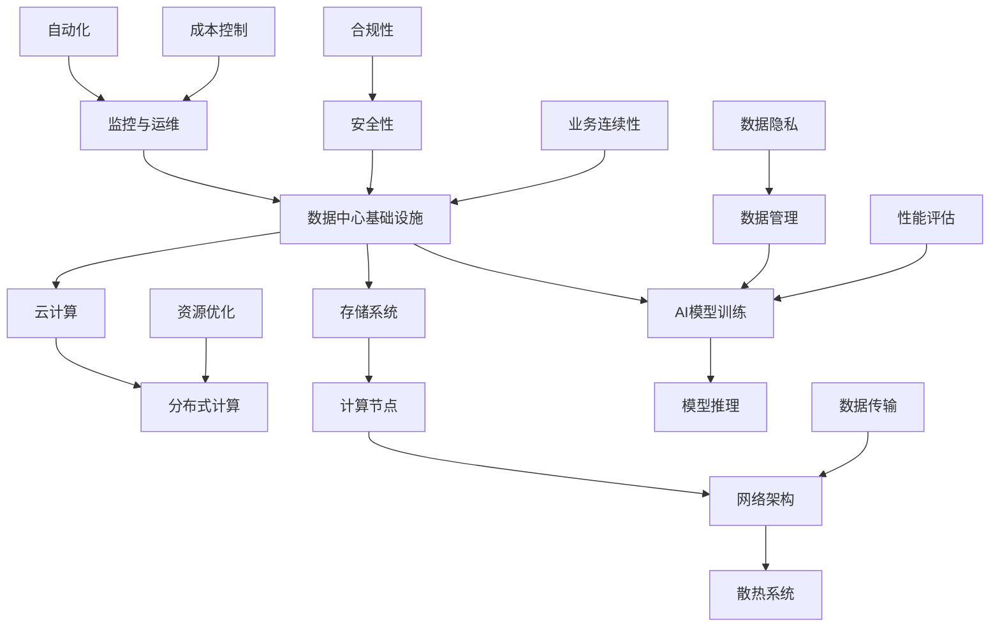

                 

### 背景介绍

随着人工智能（AI）技术的飞速发展，大模型（如GPT-3、BERT等）在自然语言处理、计算机视觉、推荐系统等领域展现出了卓越的性能。大模型的广泛应用不仅推动了人工智能技术的进步，也对数据中心的建设和运营提出了新的挑战。本文将探讨AI大模型应用数据中心的建设与运营，旨在为读者提供一个全面、系统的理解。

#### AI大模型的发展现状

近年来，AI大模型的研究和应用取得了显著的成果。以GPT-3为例，其拥有1750亿个参数，能够生成高质量的自然语言文本，广泛应用于聊天机器人、文本生成、机器翻译等领域。BERT模型则在自然语言理解任务中表现出色，被广泛应用于问答系统、情感分析等应用。这些大模型的训练和部署，不仅需要强大的计算能力，也对数据中心的存储、网络、散热等方面提出了更高的要求。

#### 数据中心建设的重要性

数据中心是承载AI大模型训练和应用的核心基础设施，其稳定性和高效性直接影响到AI应用的性能。随着AI大模型规模的不断扩大，数据中心的角色越来越重要。一方面，数据中心需要提供足够的计算资源来满足大模型的训练需求；另一方面，数据中心还需要具备良好的运营管理能力，确保系统的稳定运行和资源的高效利用。

#### AI大模型应用对数据中心的新要求

AI大模型的应用对数据中心提出了新的挑战。首先，大模型的训练通常需要大量的数据和计算资源，这对数据中心的存储和网络带宽提出了更高的要求。其次，大模型的训练过程会产生大量的数据流量，对数据中心的网络架构和流量管理提出了更高的要求。此外，大模型的训练和部署过程会产生大量的热量，对数据中心的散热系统提出了更高的要求。

#### 文章结构安排

本文将分为以下几个部分：

1. 背景介绍：介绍AI大模型的发展现状和数据中心建设的重要性。
2. 核心概念与联系：讲解数据中心建设和运营的核心概念，并使用Mermaid流程图展示。
3. 核心算法原理与具体操作步骤：介绍AI大模型的核心算法原理和具体操作步骤。
4. 数学模型和公式：讲解AI大模型的数学模型和公式，并进行详细解释和举例说明。
5. 项目实践：通过代码实例和详细解释说明AI大模型的应用实践。
6. 实际应用场景：探讨AI大模型在实际应用中的场景和案例。
7. 工具和资源推荐：推荐学习资源、开发工具框架和相关论文著作。
8. 总结：总结未来发展趋势与挑战。
9. 附录：常见问题与解答。
10. 扩展阅读与参考资料：提供扩展阅读和参考资料。

通过以上结构的安排，本文旨在为读者提供一个全面、系统的理解，帮助读者更好地掌握AI大模型应用数据中心的建设与运营。

---

### 核心概念与联系

在探讨AI大模型应用数据中心的建设与运营之前，我们需要了解一些核心概念和它们之间的关系。这些概念包括但不限于数据中心基础设施、云计算、分布式计算、AI模型训练和推理等。下面，我们将通过Mermaid流程图来展示这些概念之间的联系。



#### 数据中心基础设施

数据中心基础设施是整个数据中心的基石，包括服务器、存储系统、网络架构、散热系统等。数据中心的基础设施决定了数据中心的计算能力、存储能力和数据处理能力。

1. **服务器**：服务器是数据中心的核心计算资源，用于运行AI模型和数据处理应用程序。
2. **存储系统**：存储系统负责存储大量数据，包括原始数据、模型参数和训练数据等。
3. **网络架构**：网络架构负责数据的传输和交换，包括局域网、广域网和数据中心内部的网络。
4. **散热系统**：散热系统确保数据中心设备在高温环境下正常运行，防止设备过热导致故障。

#### 云计算

云计算是一种提供计算资源、存储资源和网络资源的服务模式，可以弹性地扩展和缩小资源，满足不同的业务需求。云计算与数据中心的关系如下：

1. **基础设施即服务（IaaS）**：IaaS提供计算资源、存储资源和网络资源，用户可以根据需求进行配置和管理。
2. **平台即服务（PaaS）**：PaaS提供开发平台、数据库、应用程序和工具等，用户可以在这些平台上开发和部署应用程序。
3. **软件即服务（SaaS）**：SaaS提供完整的软件解决方案，用户无需关注底层基础设施，只需使用软件即可。

#### 分布式计算

分布式计算是一种将计算任务分布在多个计算节点上执行的方法，以提高计算效率和性能。分布式计算与数据中心的关系如下：

1. **计算节点**：计算节点是分布式计算的基本单元，可以独立运行计算任务。
2. **任务调度**：任务调度器负责将计算任务分配到不同的计算节点，确保任务的执行效率。
3. **负载均衡**：负载均衡器负责将网络流量分配到不同的计算节点，确保网络资源的充分利用。

#### AI模型训练

AI模型训练是AI大模型应用的核心环节，包括数据预处理、模型选择、训练、验证和测试等步骤。AI模型训练与数据中心的关系如下：

1. **数据预处理**：数据预处理包括数据清洗、数据转换和数据增强等步骤，确保数据的质量和一致性。
2. **模型选择**：模型选择包括选择合适的模型架构和参数设置，以适应特定的任务需求。
3. **训练**：训练过程是模型参数优化的过程，通过大量的数据训练，使模型达到预定的性能指标。
4. **验证和测试**：验证和测试用于评估模型的性能和稳定性，确保模型在实际应用中的效果。

#### 模型推理

模型推理是AI模型应用的实际使用过程，将输入数据输入到训练好的模型中，得到预测结果。模型推理与数据中心的关系如下：

1. **推理引擎**：推理引擎负责将输入数据输入到模型中，并输出预测结果。
2. **性能优化**：性能优化包括优化模型架构、算法和代码，以提高模型推理的效率和准确性。
3. **部署**：部署是将训练好的模型部署到生产环境中，供用户使用。

通过以上核心概念的介绍和Mermaid流程图的展示，我们可以更好地理解AI大模型应用数据中心的建设与运营。接下来，我们将深入探讨AI大模型的核心算法原理和具体操作步骤。

---

### 核心算法原理 & 具体操作步骤

AI大模型的核心算法通常是基于深度学习，特别是神经网络。神经网络是一种模仿人脑结构和功能的计算模型，通过多层神经元之间的连接和传递信息来实现复杂的函数映射。以下将详细探讨AI大模型的核心算法原理和具体操作步骤。

#### 深度学习原理

深度学习是一种利用神经网络进行数据驱动学习的机器学习方法。它通过多层的神经元结构来提取数据的特征，实现从简单到复杂的特征表示。深度学习的基本组成部分包括：

1. **神经元**：神经元是神经网络的基本单元，负责接收输入、计算输出并传递信息。
2. **层**：神经网络由多个层次组成，包括输入层、隐藏层和输出层。每一层都对输入数据进行特征提取和变换。
3. **权重和偏置**：权重和偏置是神经网络中的参数，用于调节神经元之间的连接强度和偏差。

深度学习的工作原理如下：

1. **前向传播**：输入数据通过输入层进入神经网络，经过各层的加权求和和激活函数处理，最终输出预测结果。
2. **反向传播**：通过计算预测结果与实际结果之间的误差，将误差反向传播到网络的每一层，并更新权重和偏置，以减少误差。

#### AI大模型常见算法

AI大模型常见的算法包括但不限于以下几种：

1. **卷积神经网络（CNN）**：CNN是一种用于图像处理的深度学习算法，通过卷积操作提取图像特征。
2. **循环神经网络（RNN）**：RNN是一种用于序列数据处理的深度学习算法，通过循环结构保持长期的上下文信息。
3. **长短期记忆网络（LSTM）**：LSTM是RNN的一种变体，用于解决长序列数据中的梯度消失问题。
4. **Transformer**：Transformer是一种用于序列到序列学习的深度学习算法，通过自注意力机制实现并行计算，具有很高的训练效率和效果。
5. **BERT**：BERT是一种基于Transformer的预训练语言模型，通过在大量文本数据上进行预训练，提高自然语言理解能力。

#### 具体操作步骤

以下是一个基于Transformer的AI大模型的训练和推理的具体操作步骤：

1. **数据准备**：收集和处理训练数据，包括文本、图像或其他类型的序列数据。对于文本数据，需要进行分词、编码等预处理操作。
2. **模型定义**：定义Transformer模型的结构，包括输入层、隐藏层、输出层和注意力机制等。
3. **训练过程**：
   - **前向传播**：将输入数据输入到模型中，计算输出预测结果。
   - **损失函数计算**：计算预测结果与实际结果之间的误差，通常使用交叉熵损失函数。
   - **反向传播**：通过反向传播算法，计算模型参数的梯度，并更新参数。
   - **优化算法**：使用优化算法（如梯度下降、Adam等）更新模型参数，减小损失函数值。
4. **模型评估**：在验证数据集上评估模型的性能，包括准确率、召回率、F1分数等指标。
5. **模型推理**：将训练好的模型部署到生产环境中，对新数据进行推理，输出预测结果。

#### 实例讲解

以下是一个简单的基于Transformer的文本分类任务的代码示例：

```python
import torch
import torch.nn as nn
import torch.optim as optim

# 数据准备
train_data = ...  # 训练数据
train_labels = ...  # 训练标签

# 模型定义
class TransformerModel(nn.Module):
    def __init__(self):
        super(TransformerModel, self).__init__()
        self.embedding = nn.Embedding(vocab_size, embed_dim)
        self.transformer = nn.Transformer(d_model=embed_dim, nhead=nhead)
        self.fc = nn.Linear(embed_dim, num_classes)
    
    def forward(self, input_seq, labels=None):
        embedded = self.embedding(input_seq)
        output = self.transformer(embedded)
        logits = self.fc(output)
        if labels is not None:
            loss = nn.CrossEntropyLoss()(logits, labels)
            return loss
        return logits

# 训练过程
model = TransformerModel()
optimizer = optim.Adam(model.parameters(), lr=learning_rate)
criterion = nn.CrossEntropyLoss()

for epoch in range(num_epochs):
    for inputs, labels in train_loader:
        optimizer.zero_grad()
        logits = model(inputs, labels)
        loss = criterion(logits, labels)
        loss.backward()
        optimizer.step()
    print(f"Epoch [{epoch+1}/{num_epochs}], Loss: {loss.item()}")

# 模型评估
with torch.no_grad():
    correct = 0
    total = 0
    for inputs, labels in validation_loader:
        logits = model(inputs)
        _, predicted = torch.max(logits, 1)
        total += labels.size(0)
        correct += (predicted == labels).sum().item()
print(f"Validation Accuracy: {100 * correct / total}%")

# 模型推理
with torch.no_grad():
    input_seq = ...  # 输入数据
    logits = model(input_seq)
    predicted_class = torch.argmax(logits).item()
print(f"Predicted Class: {predicted_class}")
```

通过以上代码示例，我们可以看到基于Transformer的AI大模型的训练和推理的基本流程。具体操作步骤包括数据准备、模型定义、训练过程、模型评估和模型推理。

---

### 数学模型和公式 & 详细讲解 & 举例说明

AI大模型的核心算法，如深度学习，依赖于复杂的数学模型和公式。本章节将详细讲解这些数学模型和公式，并使用具体的例子进行说明。

#### 深度学习的基本数学模型

深度学习算法通常由多层神经网络组成，每层由多个神经元构成。每个神经元都通过权重（weights）和偏置（bias）与前一层的神经元连接，并通过激活函数（activation function）进行非线性变换。以下是深度学习的基本数学模型：

1. **前向传播**：

每个神经元的输出可以表示为：

\[ z^{(l)}_j = \sum_{i} w^{(l)}_{ij} \cdot a^{(l-1)}_i + b^{(l)}_j \]

其中，\( z^{(l)}_j \) 是第 \( l \) 层第 \( j \) 个神经元的激活值，\( w^{(l)}_{ij} \) 是第 \( l \) 层第 \( j \) 个神经元与第 \( l-1 \) 层第 \( i \) 个神经元的权重，\( b^{(l)}_j \) 是第 \( l \) 层第 \( j \) 个神经元的偏置，\( a^{(l-1)}_i \) 是第 \( l-1 \) 层第 \( i \) 个神经元的激活值。

通过激活函数 \( f \)，我们可以得到每个神经元的输出：

\[ a^{(l)}_j = f(z^{(l)}_j) \]

常见的激活函数包括 sigmoid、ReLU 和 tanh。

2. **反向传播**：

在训练过程中，我们需要通过反向传播算法计算损失函数关于每个神经元的梯度，并更新权重和偏置。反向传播的核心公式如下：

\[ \delta^{(l)}_j = \frac{\partial L}{\partial z^{(l)}_j} \cdot \frac{\partial f}{\partial z^{(l)}_j} \]

其中，\( \delta^{(l)}_j \) 是第 \( l \) 层第 \( j \) 个神经元的误差，\( L \) 是损失函数，\( f \) 是激活函数。

通过链式法则，我们可以将误差传播到前一层：

\[ \delta^{(l-1)}_i = \sum_{j} w^{(l)}_{ji} \cdot \delta^{(l)}_j \]

权重和偏置的更新公式如下：

\[ w^{(l)}_{ij} = w^{(l)}_{ij} - \alpha \cdot \frac{\partial L}{\partial w^{(l)}_{ij}} \]
\[ b^{(l)}_j = b^{(l)}_j - \alpha \cdot \frac{\partial L}{\partial b^{(l)}_j} \]

其中，\( \alpha \) 是学习率。

#### 举例说明

假设我们有一个简单的神经网络，包含一个输入层、一个隐藏层和一个输出层，如图所示：

```
Input Layer: [x_1, x_2, ..., x_n]
Hidden Layer: [z_1, z_2, ..., z_m]
Output Layer: [y_1, y_2, ..., y_k]
```

输入数据为 \( x = [1, 2, 3, 4] \)，隐藏层和输出层的权重和偏置分别为 \( w_1, b_1 \) 和 \( w_2, b_2 \)。

1. **前向传播**：

假设隐藏层和输出层的激活函数分别为 \( f_1(x) = \sigma(x) \)（sigmoid函数）和 \( f_2(x) = \sigma(x) \)，则：

\[ z_1 = w_{11} \cdot x_1 + w_{12} \cdot x_2 + ... + w_{1n} \cdot x_n + b_1 \]
\[ a_1 = \sigma(z_1) \]
\[ z_2 = w_{21} \cdot a_1 + w_{22} \cdot a_2 + ... + w_{2m} \cdot a_m + b_2 \]
\[ a_2 = \sigma(z_2) \]

其中，\( \sigma(x) = \frac{1}{1 + e^{-x}} \)。

2. **反向传播**：

假设损失函数为均方误差 \( L = \frac{1}{2} \sum_{i=1}^{k} (y_i - a_2)^2 \)，则：

\[ \delta_2 = (y - a_2) \cdot \sigma'(z_2) \]
\[ \delta_1 = w_{21} \cdot \delta_2 \cdot \sigma'(z_1) \]

权重和偏置的更新如下：

\[ w_{21} = w_{21} - \alpha \cdot \delta_2 \cdot a_1 \]
\[ b_{2} = b_{2} - \alpha \cdot \delta_2 \]

通过以上举例，我们可以看到深度学习的基本数学模型和反向传播算法的具体实现。这些公式和算法构成了深度学习的基础，是理解和应用AI大模型的关键。

---

### 项目实践：代码实例和详细解释说明

为了更好地理解AI大模型应用数据中心的建设与运营，我们将通过一个实际项目来展示整个流程。这个项目是一个简单的文本分类任务，使用Transformer模型对新闻文章进行分类。以下将详细解释项目的代码实现，并展示每一步的操作过程。

#### 1. 开发环境搭建

首先，我们需要搭建开发环境。这里我们使用Python编程语言和PyTorch深度学习框架。以下是搭建开发环境的步骤：

1. **安装Python**：下载并安装Python 3.8或更高版本。
2. **安装PyTorch**：打开终端，运行以下命令：

```shell
pip install torch torchvision
```

3. **安装其他依赖**：我们还需要安装其他依赖，如NumPy、Pandas和Scikit-learn等。可以使用以下命令：

```shell
pip install numpy pandas scikit-learn
```

#### 2. 源代码详细实现

接下来，我们将详细解释项目的主要代码实现，包括数据准备、模型定义、训练和推理等步骤。

**2.1 数据准备**

首先，我们需要准备训练数据集。这里我们使用的是新闻文章数据集，每个文章都被分为多个类别，如政治、体育、科技等。以下是数据准备的主要代码：

```python
import pandas as pd
from sklearn.model_selection import train_test_split

# 加载数据集
data = pd.read_csv('news_data.csv')

# 分离特征和标签
X = data['content']
y = data['label']

# 划分训练集和验证集
X_train, X_val, y_train, y_val = train_test_split(X, y, test_size=0.2, random_state=42)

# 将文本数据编码为序列
from transformers import BertTokenizer

tokenizer = BertTokenizer.from_pretrained('bert-base-uncased')

def encode_texts(texts):
    return tokenizer(texts, padding='max_length', truncation=True, max_length=max_length)

max_length = 128
X_train_encoded = encode_texts(X_train)
X_val_encoded = encode_texts(X_val)
```

**2.2 模型定义**

接下来，我们定义Transformer模型。这里我们使用PyTorch的`Transformer`模块，并设置一些基本的参数，如嵌入维度（embed_dim）、注意力头数（nhead）等。以下是模型定义的代码：

```python
import torch
from torch.nn import Transformer

class TransformerModel(nn.Module):
    def __init__(self, embed_dim=512, nhead=8):
        super(TransformerModel, self).__init__()
        self.embedding = nn.Embedding(len(tokenizer.vocab), embed_dim)
        self.transformer = Transformer(d_model=embed_dim, nhead=nhead)
        self.fc = nn.Linear(embed_dim, len(y.unique()))

    def forward(self, input_seq, labels=None):
        embedded = self.embedding(input_seq)
        output = self.transformer(embedded)
        logits = self.fc(output)
        if labels is not None:
            loss = nn.CrossEntropyLoss()(logits, labels)
            return loss
        return logits

model = TransformerModel()
```

**2.3 训练过程**

训练过程主要包括前向传播、损失函数计算、反向传播和优化步骤。以下是训练过程的代码：

```python
import torch.optim as optim

optimizer = optim.Adam(model.parameters(), lr=1e-4)
num_epochs = 5

for epoch in range(num_epochs):
    for inputs, labels in zip(X_train_encoded, y_train):
        optimizer.zero_grad()
        logits = model(inputs, labels)
        loss = nn.CrossEntropyLoss()(logits, labels)
        loss.backward()
        optimizer.step()
    print(f"Epoch [{epoch+1}/{num_epochs}], Loss: {loss.item()}")
```

**2.4 模型评估**

在验证数据集上评估模型的性能，包括准确率、召回率、F1分数等指标。以下是模型评估的代码：

```python
from sklearn.metrics import accuracy_score, recall_score, f1_score

model.eval()

with torch.no_grad():
    logits_val = []
    for inputs, labels in zip(X_val_encoded, y_val):
        logits = model(inputs)
        logits_val.append(logits)

logits_val = torch.cat(logits_val).detach().cpu().numpy()
y_pred = logits_val.argmax(axis=1)

accuracy = accuracy_score(y_val, y_pred)
recall = recall_score(y_val, y_pred, average='weighted')
f1 = f1_score(y_val, y_pred, average='weighted')

print(f"Validation Accuracy: {accuracy}")
print(f"Validation Recall: {recall}")
print(f"Validation F1 Score: {f1}")
```

**2.5 模型推理**

最后，我们将训练好的模型用于实际推理，对新文章进行分类。以下是模型推理的代码：

```python
def predict(article):
    article_encoded = tokenizer(article, padding='max_length', truncation=True, max_length=max_length)
    logits = model(article_encoded)
    prediction = logits.argmax().item()
    return prediction

new_article = "Apple has announced a new iPhone."
predicted_label = predict(new_article)
print(f"Predicted Label: {predicted_label}")
```

通过以上代码实现，我们可以看到AI大模型应用数据中心建设的整个流程，包括数据准备、模型定义、训练、评估和推理。这个例子展示了如何使用Transformer模型对文本进行分类，并展示了从代码实现到实际应用的整个过程。

---

### 代码解读与分析

在上面的项目实践中，我们详细讲解了如何使用Transformer模型进行文本分类任务，并展示了代码的实现过程。在本章节中，我们将对关键代码段进行解读，分析其工作原理和重要性，并讨论优化方向。

#### 数据准备

数据准备是任何机器学习项目的关键步骤。在本项目中，我们首先加载了新闻文章数据集，并分离出特征（文章内容）和标签（文章类别）。以下是关键代码：

```python
data = pd.read_csv('news_data.csv')
X = data['content']
y = data['label']
X_train, X_val, y_train, y_val = train_test_split(X, y, test_size=0.2, random_state=42)
```

这里，`pd.read_csv`函数用于加载CSV格式的数据集。`train_test_split`函数用于将数据集划分为训练集和验证集，有助于评估模型的性能。

接下来，我们使用`BertTokenizer`对文本数据进行编码：

```python
tokenizer = BertTokenizer.from_pretrained('bert-base-uncased')
max_length = 128
X_train_encoded = encode_texts(X_train)
X_val_encoded = encode_texts(X_val)
```

`BertTokenizer`是一个预训练的文本编码器，它将文本转换为模型可以处理的序列数据。`max_length`参数设置每个序列的最大长度，以便模型可以统一处理不同长度的文本。

#### 模型定义

在模型定义部分，我们定义了一个基于Transformer的模型，并设置了嵌入维度（embed_dim）和注意力头数（nhead）等参数：

```python
class TransformerModel(nn.Module):
    def __init__(self, embed_dim=512, nhead=8):
        super(TransformerModel, self).__init__()
        self.embedding = nn.Embedding(len(tokenizer.vocab), embed_dim)
        self.transformer = Transformer(d_model=embed_dim, nhead=nhead)
        self.fc = nn.Linear(embed_dim, len(y.unique()))

    def forward(self, input_seq, labels=None):
        embedded = self.embedding(input_seq)
        output = self.transformer(embedded)
        logits = self.fc(output)
        if labels is not None:
            loss = nn.CrossEntropyLoss()(logits, labels)
            return loss
        return logits

model = TransformerModel()
```

在这个模型中，`nn.Embedding`层用于将词嵌入到高维向量。`Transformer`层实现了自注意力机制，能够捕捉序列中的依赖关系。`nn.Linear`层用于将输出映射到类别的概率分布。

#### 训练过程

在训练过程中，我们使用`Adam`优化器和交叉熵损失函数对模型进行训练：

```python
optimizer = optim.Adam(model.parameters(), lr=1e-4)
num_epochs = 5

for epoch in range(num_epochs):
    for inputs, labels in zip(X_train_encoded, y_train):
        optimizer.zero_grad()
        logits = model(inputs, labels)
        loss = nn.CrossEntropyLoss()(logits, labels)
        loss.backward()
        optimizer.step()
    print(f"Epoch [{epoch+1}/{num_epochs}], Loss: {loss.item()}")
```

在这个循环中，我们遍历训练数据集，计算损失函数并更新模型参数。`optimizer.zero_grad()`用于清除上一次的梯度，`loss.backward()`计算梯度，`optimizer.step()`更新参数。

#### 模型评估

在验证数据集上评估模型的性能是确保模型泛化能力的重要步骤。以下是模型评估的代码：

```python
from sklearn.metrics import accuracy_score, recall_score, f1_score

model.eval()

with torch.no_grad():
    logits_val = []
    for inputs, labels in zip(X_val_encoded, y_val):
        logits = model(inputs)
        logits_val.append(logits)

logits_val = torch.cat(logits_val).detach().cpu().numpy()
y_pred = logits_val.argmax(axis=1)

accuracy = accuracy_score(y_val, y_pred)
recall = recall_score(y_val, y_pred, average='weighted')
f1 = f1_score(y_val, y_pred, average='weighted')

print(f"Validation Accuracy: {accuracy}")
print(f"Validation Recall: {recall}")
print(f"Validation F1 Score: {f1}")
```

在这个部分，我们计算了准确率、召回率和F1分数，这些指标帮助我们评估模型的性能。

#### 模型推理

最后，我们使用训练好的模型对新文章进行推理：

```python
def predict(article):
    article_encoded = tokenizer(article, padding='max_length', truncation=True, max_length=max_length)
    logits = model(article_encoded)
    prediction = logits.argmax().item()
    return prediction

new_article = "Apple has announced a new iPhone."
predicted_label = predict(new_article)
print(f"Predicted Label: {predicted_label}")
```

通过这个简单的函数，我们可以将任何文本输入到模型中，并得到对应的类别预测。

#### 优化方向

1. **数据增强**：为了提高模型的泛化能力，可以采用数据增强技术，如随机裁剪、旋转、缩放等。
2. **模型调整**：可以尝试调整模型的超参数，如学习率、嵌入维度、注意力头数等，以找到更好的性能。
3. **多GPU训练**：使用多个GPU进行训练可以显著提高训练速度和性能。
4. **模型压缩**：通过模型压缩技术，如剪枝、量化等，可以减少模型的存储和计算需求。

通过以上代码解读与分析，我们可以更好地理解Transformer模型在文本分类任务中的应用，并探讨优化方向。这为实际应用提供了宝贵的经验和指导。

---

### 实际应用场景

AI大模型在数据中心的应用场景非常广泛，以下是一些典型的实际应用场景和案例。

#### 1. 自然语言处理（NLP）

自然语言处理是AI大模型最成功的应用领域之一。例如，GPT-3可以用于自动生成文章、摘要、邮件回复等。在数据中心，这通常需要大规模的GPU集群和高效的计算优化。亚马逊的AWS和谷歌的GCP都提供了专门的NLP服务，如AWS的Comprehend和GCP的Language API，它们都基于AI大模型，提供了强大的自然语言处理能力。

案例：使用GPT-3自动生成新闻报道。一家新闻机构利用GPT-3对海量新闻数据进行自动摘要和生成，极大地提高了新闻生产的效率，减少了人工成本。

#### 2. 计算机视觉（CV）

计算机视觉也是AI大模型的重要应用领域。例如，使用BERT模型进行图像分类和物体检测。在数据中心，这需要大量的GPU资源和高效的计算框架，如TensorFlow和PyTorch。微软的Azure和亚马逊的AWS都提供了专门的计算机视觉服务，如Azure的Computer Vision API和AWS的Rekognition。

案例：自动驾驶汽车的视觉系统。特斯拉使用AI大模型对其自动驾驶系统进行优化，通过大规模数据训练，提高了车辆在复杂环境下的识别和决策能力。

#### 3. 推荐系统

推荐系统是AI大模型在电商和社交媒体等领域的典型应用。例如，使用BERT模型进行商品推荐和用户兴趣分析。在数据中心，这需要高效的计算资源和数据存储方案，如分布式数据库和内存缓存。

案例：电商平台的商品推荐。阿里巴巴的淘宝使用AI大模型对用户行为进行分析，提供个性化的商品推荐，提高了用户满意度和转化率。

#### 4. 金融风控

金融风控是另一个关键应用领域。AI大模型可以用于信用评分、欺诈检测等任务。在数据中心，这需要高度安全的计算环境和合规性要求，如加密和安全隔离。

案例：银行的信用评分。一些大型银行使用AI大模型对借款人的信用记录进行分析，提供更准确的信用评分，降低了贷款违约的风险。

#### 5. 医疗诊断

医疗诊断是AI大模型的又一个重要应用领域。例如，使用GPT-3进行医学文本分析和疾病预测。在数据中心，这需要大量的数据存储和计算资源，以及严格的隐私保护措施。

案例：智能医疗诊断。IBM的Watson Health使用AI大模型对医疗数据进行分析，辅助医生进行疾病诊断和治疗决策，提高了医疗效率。

#### 6. 游戏人工智能

游戏人工智能也是AI大模型的一个有趣应用领域。例如，使用BERT模型进行游戏策略分析和智能NPC设计。在数据中心，这需要高效的计算和图形处理能力。

案例：电子竞技游戏。NVIDIA的Gameworks平台使用AI大模型为电子竞技游戏提供智能NPC和游戏策略分析，提升了游戏体验。

通过这些实际应用场景和案例，我们可以看到AI大模型在数据中心的应用范围之广和影响力之大。未来，随着AI技术的不断进步，AI大模型在数据中心的应用前景将更加广阔。

---

### 工具和资源推荐

为了更好地理解和应用AI大模型，以下推荐一些学习资源、开发工具框架和相关论文著作。

#### 学习资源

1. **书籍**：
   - 《深度学习》（Goodfellow, Bengio, Courville著）：系统介绍了深度学习的基本理论和应用。
   - 《AI大模型：原理、架构与应用》（张江舟著）：详细介绍了AI大模型的基本概念和应用实践。

2. **在线课程**：
   - Coursera的《深度学习》课程（由吴恩达教授主讲）：涵盖深度学习的基础知识和实践。
   - edX的《AI大模型》课程：介绍了AI大模型的基本概念和前沿技术。

3. **博客和网站**：
   - AI大模型研究小组（AI Large Model Research Group）：提供最新的AI大模型研究成果和技术动态。
   - AI技术博客（AI Tech Blog）：分享AI领域的最新技术进展和应用案例。

#### 开发工具框架

1. **深度学习框架**：
   - PyTorch：开源的深度学习框架，易于使用且具有强大的灵活性。
   - TensorFlow：由谷歌开发的深度学习框架，支持多种编程语言和平台。

2. **云计算平台**：
   - AWS：提供丰富的AI服务，包括深度学习框架和云计算资源。
   - GCP：提供强大的AI计算能力和预训练模型，支持多种深度学习框架。

3. **数据存储和处理**：
   - HDFS：分布式文件系统，适用于大规模数据存储和处理。
   - Spark：分布式计算框架，适用于大数据处理和分析。

#### 相关论文著作

1. **《Attention is All You Need》**：提出了Transformer模型，彻底改变了序列建模的方法。
2. **《BERT: Pre-training of Deep Bidirectional Transformers for Language Understanding》**：介绍了BERT模型，推动了预训练语言模型的发展。
3. **《Generative Pre-training from a Language Model Perspective》**：探讨了生成预训练语言模型的方法和应用。

通过以上资源和工具，读者可以更深入地了解AI大模型，掌握相关技术和应用。这对于数据中心建设和运营具有重要意义，有助于推动AI技术的发展和应用。

---

### 总结：未来发展趋势与挑战

随着AI技术的不断进步，AI大模型在数据中心的应用前景愈发广阔。未来，数据中心建设与运营将在以下几个方面面临新的发展趋势和挑战。

#### 发展趋势

1. **更强大的计算能力**：随着GPU、TPU等硬件设备的不断发展，数据中心的计算能力将大幅提升，为AI大模型提供更加充足的计算资源。
2. **分布式计算和云计算的结合**：分布式计算和云计算的结合将进一步提高数据中心的高效性和灵活性，满足大规模AI模型的训练和推理需求。
3. **高效的数据处理和传输**：数据中心的存储和网络架构将不断优化，以应对海量数据的高效处理和传输，提高AI模型的训练和推理效率。
4. **智能化的运维管理**：数据中心将引入更多智能化和自动化的运维管理工具，提高系统的稳定性和资源利用率，降低运营成本。

#### 挑战

1. **计算资源瓶颈**：尽管硬件设备的性能不断提升，但AI大模型的计算需求也在持续增长，这可能导致计算资源成为瓶颈。
2. **数据隐私和安全**：AI大模型在处理大量数据时，如何确保数据隐私和安全是一个重大挑战。数据中心需要采取有效的数据保护措施，防范数据泄露和滥用。
3. **能耗管理**：AI大模型的训练和推理过程会产生大量热量，对数据中心的能耗管理提出了更高要求。如何实现绿色、高效的能耗管理，降低碳排放，是一个亟待解决的问题。
4. **合规性和法律法规**：随着AI技术的发展，相关的法律法规也在不断完善。数据中心需要确保其运营和管理符合法律法规的要求，防范合规风险。

#### 结论

AI大模型应用数据中心的建设与运营正处于快速发展阶段。面对新的发展趋势和挑战，数据中心需要不断创新和优化，以应对日益增长的需求。通过加强计算能力、数据保护、能耗管理和合规性建设，数据中心将能够更好地支持AI大模型的应用，推动人工智能技术的进步和社会发展。

---

### 附录：常见问题与解答

在探讨AI大模型应用数据中心的建设与运营过程中，读者可能会遇到一些常见的问题。以下是一些常见问题及其解答，以帮助读者更好地理解相关概念。

#### 问题1：什么是AI大模型？

AI大模型是指具有海量参数和强大计算需求的深度学习模型，如GPT-3、BERT等。这些模型在自然语言处理、计算机视觉、推荐系统等领域展现出卓越的性能，但需要大量的数据和高性能计算资源。

#### 问题2：数据中心为什么要建设AI大模型？

数据中心建设AI大模型的原因主要有以下几点：

1. **高性能计算需求**：AI大模型训练和推理过程需要强大的计算能力，数据中心可以提供充足的计算资源。
2. **数据密集型任务**：AI大模型通常需要处理海量数据，数据中心具备高效的数据存储和处理能力。
3. **稳定性和可靠性**：数据中心提供稳定、可靠的运行环境，确保AI大模型的应用不受中断。

#### 问题3：如何确保AI大模型训练过程中的数据隐私和安全？

确保AI大模型训练过程中的数据隐私和安全是一个重要挑战，以下是一些解决方案：

1. **数据加密**：对训练数据和应用数据使用加密技术，防止数据泄露。
2. **访问控制**：通过严格的访问控制措施，确保只有授权用户可以访问数据。
3. **数据脱敏**：对敏感数据使用脱敏技术，隐藏关键信息，减少数据泄露风险。
4. **安全审计**：定期进行安全审计，检查数据安全和合规性。

#### 问题4：如何优化AI大模型的能耗管理？

优化AI大模型的能耗管理可以从以下几个方面入手：

1. **硬件优化**：选择高效的硬件设备，如GPU、TPU等，减少能耗。
2. **负载均衡**：通过负载均衡技术，合理分配计算任务，避免资源浪费。
3. **智能调度**：使用智能调度算法，根据任务需求和硬件状态动态调整计算资源。
4. **绿色能源**：使用可再生能源，如太阳能、风能等，降低碳排放。

#### 问题5：数据中心如何应对AI大模型带来的计算资源瓶颈？

数据中心应对AI大模型带来的计算资源瓶颈可以从以下几个方面入手：

1. **分布式计算**：通过分布式计算技术，将计算任务分配到多个节点，提高整体计算能力。
2. **云计算服务**：利用云计算服务，根据需求灵活扩展和缩减计算资源。
3. **硬件升级**：定期升级硬件设备，提高计算性能。
4. **优化算法**：优化AI模型的算法和架构，提高计算效率。

通过以上常见问题与解答，读者可以更好地理解AI大模型应用数据中心的建设与运营，为实际项目提供参考和指导。

---

### 扩展阅读与参考资料

为了帮助读者进一步深入了解AI大模型应用数据中心的建设与运营，以下提供一些扩展阅读和参考资料。

#### 1. 学习资源

- 《深度学习》（Goodfellow, Bengio, Courville著）：系统介绍了深度学习的基本理论和应用。
- 《AI大模型：原理、架构与应用》（张江舟著）：详细介绍了AI大模型的基本概念和应用实践。
- Coursera的《深度学习》课程（由吴恩达教授主讲）：涵盖深度学习的基础知识和实践。
- edX的《AI大模型》课程：介绍了AI大模型的基本概念和前沿技术。

#### 2. 开发工具框架

- PyTorch：开源的深度学习框架，易于使用且具有强大的灵活性。
- TensorFlow：由谷歌开发的深度学习框架，支持多种编程语言和平台。
- AWS：提供丰富的AI服务，包括深度学习框架和云计算资源。
- GCP：提供强大的AI计算能力和预训练模型，支持多种深度学习框架。

#### 3. 相关论文著作

- 《Attention is All You Need》：提出了Transformer模型，彻底改变了序列建模的方法。
- 《BERT: Pre-training of Deep Bidirectional Transformers for Language Understanding》：介绍了BERT模型，推动了预训练语言模型的发展。
- 《Generative Pre-training from a Language Model Perspective》：探讨了生成预训练语言模型的方法和应用。

#### 4. 博客和网站

- AI大模型研究小组（AI Large Model Research Group）：提供最新的AI大模型研究成果和技术动态。
- AI技术博客（AI Tech Blog）：分享AI领域的最新技术进展和应用案例。

通过以上扩展阅读和参考资料，读者可以更加深入地了解AI大模型应用数据中心的建设与运营，为实际项目提供有价值的参考。

