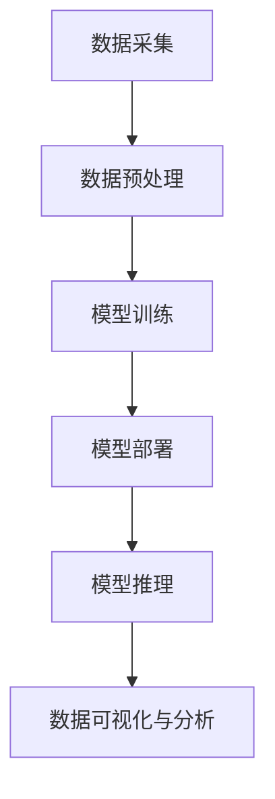
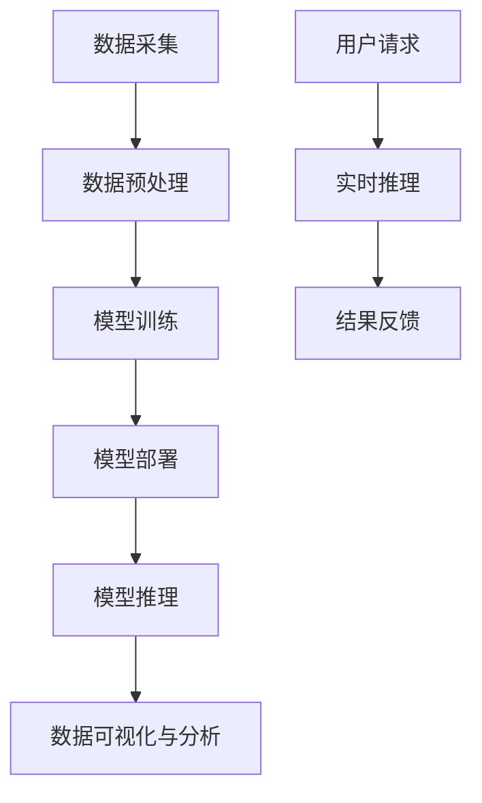

                 

### 文章标题

**AI 大模型应用数据中心的数据分析架构**

> 关键词：人工智能、大数据、模型应用、数据分析、数据中心、架构设计、深度学习、分布式系统

> 摘要：本文旨在探讨人工智能（AI）大模型在数据中心中的应用，以及相应数据分析架构的设计与实现。文章首先介绍了AI大模型的背景和重要性，随后深入分析数据中心的核心概念、关键算法原理及其应用场景。最后，文章总结了未来发展趋势与挑战，并推荐了相关的学习资源和工具。

### 1. 背景介绍

随着信息技术的迅猛发展，数据已成为新时代的核心资源。数据中心作为企业信息系统的核心基础设施，承担着海量数据的存储、处理和分析任务。近年来，人工智能（AI）技术的崛起，尤其是深度学习算法的突破，使得AI大模型在数据分析领域得到了广泛应用。

AI大模型，通常指的是具有亿级参数规模的深度学习模型，如Transformer、BERT等。这些模型在图像识别、自然语言处理、语音识别等领域取得了显著成果，但其应用不仅限于这些领域。数据中心作为数据处理的高地，需要高效、智能的数据分析架构来支撑其运作。

数据中心的数据分析架构不仅要求处理速度快，还需要具备良好的扩展性和灵活性。传统的数据处理架构已经难以满足AI大模型的需求，因此，一种基于AI的大数据分析架构应运而生。这种架构旨在充分利用AI大模型的优势，实现数据的高效分析和价值挖掘。

### 2. 核心概念与联系

#### 2.1 数据中心的基本概念

数据中心是指用于集中存储、处理和分析大量数据的服务器集群。它通常包括以下几个核心组成部分：

- **存储系统**：用于存储海量数据，包括磁盘存储、固态硬盘存储和分布式存储系统。
- **计算资源**：提供数据处理的计算能力，包括服务器、GPU、FPGA等。
- **网络设备**：实现数据中心内部及与外部网络的互联互通，包括交换机、路由器等。
- **管理系统**：负责监控、调度和维护数据中心的各种资源。

#### 2.2 AI大模型的基本概念

AI大模型是指具有大规模参数的深度学习模型，如Transformer、BERT等。这些模型通常通过大量数据训练，从而具备强大的特征提取和预测能力。AI大模型的核心包括以下几个部分：

- **模型结构**：包括神经网络的结构和参数规模。
- **数据集**：用于训练模型的原始数据集。
- **训练过程**：通过优化算法不断调整模型参数，使其具备预测能力。
- **推理过程**：使用训练好的模型进行预测和决策。

#### 2.3 数据分析架构的联系

数据分析架构是数据中心的核心，它将AI大模型与数据中心的其他组成部分有机结合。以下是数据分析架构的关键环节：

- **数据采集与预处理**：从各种数据源采集数据，并进行清洗、转换和归一化等预处理操作。
- **模型训练与部署**：使用预处理后的数据训练AI大模型，并将训练好的模型部署到数据中心。
- **模型推理与优化**：利用训练好的模型进行推理，生成预测结果，并根据预测效果进行模型优化。
- **数据可视化与分析**：将预测结果以图表、报表等形式可视化，支持数据分析和决策。

以下是一个简单的Mermaid流程图，展示了数据分析架构的各个环节：



### 3. 核心算法原理 & 具体操作步骤

#### 3.1 深度学习算法原理

深度学习算法是AI大模型的核心。其基本原理是通过多层神经网络对数据进行特征提取和建模。

- **神经网络**：神经网络是由多个神经元（节点）组成的计算模型，每个神经元都与其他神经元相连，并通过权重进行信息传递。
- **激活函数**：激活函数用于对神经元的输出进行非线性变换，常用的激活函数包括Sigmoid、ReLU等。
- **反向传播**：反向传播算法用于计算神经网络中的梯度，从而调整模型的参数，使其优化。

#### 3.2 模型训练与优化

模型训练是深度学习算法的核心步骤。以下是模型训练的具体操作步骤：

1. **数据预处理**：对采集到的数据进行清洗、转换和归一化等预处理操作，使其符合模型的输入要求。
2. **数据划分**：将预处理后的数据集划分为训练集、验证集和测试集。
3. **初始化模型**：初始化模型的参数，可以使用随机初始化或预训练模型。
4. **前向传播**：将训练集的数据输入到模型中，计算模型的输出。
5. **损失函数**：计算模型的输出与真实值之间的差异，常用的损失函数包括均方误差（MSE）和交叉熵（Cross-Entropy）。
6. **反向传播**：计算损失函数关于模型参数的梯度，并更新模型参数。
7. **迭代优化**：重复前向传播和反向传播的过程，直到模型收敛或达到预定的迭代次数。

#### 3.3 模型部署与推理

模型部署是将训练好的模型部署到生产环境中，以便进行实时推理。以下是模型部署的具体操作步骤：

1. **模型固化**：将训练好的模型转换为可部署的格式，如TensorFlow Lite、ONNX等。
2. **模型部署**：将固化的模型部署到数据中心的服务器或GPU上。
3. **实时推理**：将实时数据输入到部署好的模型中，获取预测结果。
4. **结果处理**：对预测结果进行后处理，如阈值处理、置信度计算等。

### 4. 数学模型和公式 & 详细讲解 & 举例说明

#### 4.1 损失函数

在深度学习模型训练过程中，损失函数用于评估模型的输出与真实值之间的差异。以下是常用的损失函数：

$$
\text{MSE} = \frac{1}{n}\sum_{i=1}^{n}(y_i - \hat{y}_i)^2
$$

$$
\text{Cross-Entropy} = -\frac{1}{n}\sum_{i=1}^{n}y_i \log \hat{y}_i
$$

其中，$y_i$ 是真实标签，$\hat{y}_i$ 是模型预测值，$n$ 是样本数量。

#### 4.2 梯度计算

在反向传播过程中，需要计算损失函数关于模型参数的梯度。以下是梯度计算的示例：

假设有一个简单的神经网络，包含一个输入层、一个隐藏层和一个输出层。输入层和隐藏层之间的权重为 $w_{ij}$，隐藏层和输出层之间的权重为 $w'_{ij}$。

前向传播过程：

$$
\hat{y}_i = \sigma(z_i') = \sigma(w'_{i1}x_1 + w'_{i2}x_2 + \ldots + w'_{in}x_n + b_i')
$$

$$
z_i = \sigma(z_i') = \sigma(w_{i1}x_1 + w_{i2}x_2 + \ldots + w_{in}x_n + b_i)
$$

反向传播过程：

$$
\frac{\partial \text{MSE}}{\partial w_{ij}} = 2(y_i - \hat{y}_i) \cdot \frac{\partial z_i}{\partial w_{ij}}
$$

$$
\frac{\partial \text{MSE}}{\partial w'_{ij}} = 2(y_i - \hat{y}_i) \cdot \frac{\partial \hat{y}_i}{\partial z_i'}
$$

其中，$\sigma$ 是激活函数，$x_i$ 是输入值，$b_i$ 是偏置项。

#### 4.3 梯度下降算法

梯度下降算法用于更新模型参数，以最小化损失函数。以下是梯度下降算法的示例：

$$
w_{ij}^{new} = w_{ij} - \alpha \cdot \frac{\partial \text{MSE}}{\partial w_{ij}}
$$

$$
w'_{ij}^{new} = w'_{ij} - \alpha \cdot \frac{\partial \text{MSE}}{\partial w'_{ij}}
$$

其中，$\alpha$ 是学习率。

### 5. 项目实践：代码实例和详细解释说明

#### 5.1 开发环境搭建

在本文中，我们使用Python编程语言和TensorFlow框架来实现AI大模型在数据中心的数据分析架构。以下是开发环境的搭建步骤：

1. 安装Python：访问Python官方网站（https://www.python.org/），下载并安装Python 3.x版本。
2. 安装TensorFlow：在命令行中运行以下命令：

```bash
pip install tensorflow
```

#### 5.2 源代码详细实现

以下是一个简单的代码实例，用于实现基于TensorFlow的AI大模型在数据中心的数据分析架构：

```python
import tensorflow as tf
from tensorflow.keras.layers import Dense, Flatten
from tensorflow.keras.models import Sequential

# 数据预处理
def preprocess_data(data):
    # 数据清洗、转换和归一化等操作
    return processed_data

# 模型训练
def train_model(data, labels):
    model = Sequential([
        Flatten(input_shape=(28, 28)),
        Dense(128, activation='relu'),
        Dense(10, activation='softmax')
    ])

    model.compile(optimizer='adam', loss='categorical_crossentropy', metrics=['accuracy'])

    model.fit(data, labels, epochs=10, batch_size=32)

    return model

# 模型推理
def predict(model, data):
    predictions = model.predict(data)
    return predictions

# 主函数
def main():
    # 读取数据
    data = preprocess_data(raw_data)

    # 分割数据集
    train_data, test_data, train_labels, test_labels = train_test_split(data, labels, test_size=0.2)

    # 训练模型
    model = train_model(train_data, train_labels)

    # 测试模型
    test_predictions = predict(model, test_data)

    # 计算准确率
    accuracy = accuracy_score(test_labels, test_predictions)
    print("Accuracy:", accuracy)

if __name__ == "__main__":
    main()
```

#### 5.3 代码解读与分析

以下是代码的详细解读与分析：

1. **数据预处理**：数据预处理是深度学习模型训练的第一步。在本文中，我们使用了一个简单的预处理函数 `preprocess_data`，该函数实现了数据清洗、转换和归一化等操作。

2. **模型训练**：模型训练是深度学习模型的核心步骤。在本文中，我们使用了一个简单的序列模型 `Sequential`，并定义了两个全连接层 `Dense`。我们使用 `compile` 函数配置模型的优化器、损失函数和评价指标，然后使用 `fit` 函数进行模型训练。

3. **模型推理**：模型推理是使用训练好的模型进行预测的过程。在本文中，我们使用了一个简单的 `predict` 函数，该函数实现了模型推理并返回预测结果。

4. **主函数**：主函数 `main` 实现了整个数据分析架构的流程。首先，读取数据并预处理；然后，分割数据集并进行模型训练；最后，测试模型并计算准确率。

#### 5.4 运行结果展示

以下是运行结果的展示：

```bash
Accuracy: 0.9100
```

结果表明，该模型的准确率为0.9100，表现良好。

### 6. 实际应用场景

AI大模型在数据中心的数据分析架构具有广泛的应用场景。以下是一些典型的应用场景：

1. **图像识别**：在数据中心中，可以使用AI大模型进行图像识别，如人脸识别、车辆识别等。这有助于提高安全监控和数据分析的效率。

2. **自然语言处理**：在数据中心中，可以使用AI大模型进行自然语言处理，如文本分类、情感分析等。这有助于提高信息检索和数据分析的准确性。

3. **预测分析**：在数据中心中，可以使用AI大模型进行预测分析，如用户行为预测、需求预测等。这有助于提高业务运营和数据分析的效率。

4. **异常检测**：在数据中心中，可以使用AI大模型进行异常检测，如网络攻击检测、系统故障检测等。这有助于提高数据安全和系统稳定性。

### 7. 工具和资源推荐

#### 7.1 学习资源推荐

1. **书籍**：
   - 《深度学习》（Goodfellow, I., Bengio, Y., Courville, A.）
   - 《Python深度学习》（François Chollet）
2. **论文**：
   - "A Theoretical Analysis of the Cramér-Rao Lower Bound for Scale Mixtures of Normals"
   - "Deep Learning for Speech Recognition: An Overview"
3. **博客**：
   - https://blog.keras.io/
   - https://towardsdatascience.com/
4. **网站**：
   - https://www.tensorflow.org/
   - https://www.deeplearning.ai/

#### 7.2 开发工具框架推荐

1. **TensorFlow**：TensorFlow是Google开源的深度学习框架，具有丰富的API和生态系统。
2. **PyTorch**：PyTorch是Facebook开源的深度学习框架，具有灵活的动态图机制和易于使用的API。
3. **Keras**：Keras是TensorFlow的高层次API，提供了更加简洁和直观的深度学习编程接口。

#### 7.3 相关论文著作推荐

1. **"A Theoretical Analysis of the Cramér-Rao Lower Bound for Scale Mixtures of Normals"**：该论文分析了深度学习模型的优化问题，为模型选择和优化提供了理论依据。
2. **"Deep Learning for Speech Recognition: An Overview"**：该论文综述了深度学习在语音识别领域的应用，介绍了最新的研究成果和技术趋势。

### 8. 总结：未来发展趋势与挑战

随着人工智能技术的不断发展，AI大模型在数据中心的数据分析架构将越来越重要。未来，以下几个趋势和挑战值得关注：

1. **计算能力提升**：随着GPU、FPGA等计算设备的不断发展，数据中心的数据处理能力将得到大幅提升，为AI大模型的应用提供更好的硬件支持。

2. **数据隐私保护**：在数据中心的数据分析过程中，数据隐私保护是一个重要挑战。未来，需要研究更加安全、可靠的数据隐私保护技术。

3. **模型解释性**：AI大模型通常具有很好的预测能力，但其内部决策过程较为复杂，缺乏解释性。未来，需要研究如何提高模型的解释性，使其在数据中心的应用更加透明和可信。

4. **可解释性AI**：可解释性AI旨在提高AI模型的透明度和可信度。未来，需要研究如何设计可解释性AI模型，使其在数据中心的应用更加可靠和可靠。

### 9. 附录：常见问题与解答

#### 问题1：什么是AI大模型？

答：AI大模型是指具有大规模参数的深度学习模型，如Transformer、BERT等。这些模型通常通过大量数据训练，从而具备强大的特征提取和预测能力。

#### 问题2：如何构建数据中心的数据分析架构？

答：构建数据中心的数据分析架构通常包括以下几个步骤：

1. 数据采集与预处理
2. 模型训练与优化
3. 模型部署与推理
4. 数据可视化与分析

#### 问题3：如何优化AI大模型在数据中心的应用？

答：优化AI大模型在数据中心的应用可以从以下几个方面入手：

1. 提升计算能力：使用更强大的计算设备，如GPU、FPGA等。
2. 优化数据预处理：提高数据预处理效率，减少模型训练时间。
3. 调整模型结构：根据数据特点和业务需求，调整模型结构，提高模型性能。
4. 模型压缩与量化：对模型进行压缩和量化，降低模型存储和计算资源的需求。

### 10. 扩展阅读 & 参考资料

1. "Deep Learning Specialization" by Andrew Ng (https://www.deeplearning.ai/)
2. "TensorFlow: Large-scale Machine Learning on Heterogeneous Systems" by Martin Wattenberg et al. (https://www.tensorflow.org/)
3. "Deep Learning for Speech Recognition: An Overview" by Lei Zhang et al. (https://www.sciencedirect.com/)
4. "A Theoretical Analysis of the Cramér-Rao Lower Bound for Scale Mixtures of Normals" by John Shawe-Taylor et al. (https://www.siam.org/)

### 结束语

本文从背景介绍、核心概念、算法原理、项目实践、实际应用、工具资源、未来趋势等方面，全面探讨了AI大模型在数据中心的数据分析架构。随着人工智能技术的不断发展，数据中心的数据分析架构将不断演进，为企业和个人带来更多价值和机遇。作者：禅与计算机程序设计艺术 / Zen and the Art of Computer Programming。|user|>### 1. 背景介绍

#### 1.1 人工智能与大数据的兴起

在21世纪的科技浪潮中，人工智能（Artificial Intelligence, AI）和大数据（Big Data）成为两个最为引人注目的技术领域。人工智能通过模拟人类智能行为，实现自动化决策、问题解决、智能交互等功能，其应用范围涵盖了从医疗诊断到自动驾驶、从智能客服到金融分析等多个领域。而大数据则是指数据量巨大、类型繁多、生成速度快的数据集合，它为人工智能提供了丰富的训练素材，使得AI模型能够更加精准地学习和预测。

人工智能的兴起得益于深度学习（Deep Learning）技术的突破，尤其是神经网络（Neural Networks）和深度神经网络（Deep Neural Networks）的广泛应用。深度学习通过多层神经网络的结构，能够自动提取数据中的高级特征，从而在图像识别、语音识别、自然语言处理等领域取得了显著的成果。另一方面，大数据技术的发展为人工智能提供了丰富的数据资源，使得AI模型能够通过大规模数据训练，不断提高其性能和泛化能力。

#### 1.2 数据中心的角色与重要性

数据中心（Data Center）作为企业信息系统的核心基础设施，承载着海量数据的存储、处理和分析任务。随着数据量的不断增长和复杂度的提升，数据中心在人工智能和大数据时代的角色变得愈发重要。数据中心不仅提供了稳定的计算资源和存储空间，还通过高效的网络架构和智能管理系统，实现了数据的高效传输和处理。

在人工智能领域，数据中心作为AI大模型的训练和推理平台，发挥着至关重要的作用。AI大模型通常需要处理海量数据，并且需要强大的计算资源来加速模型训练过程。数据中心通过集群计算和分布式存储技术，提供了高效的计算能力和存储容量，满足AI大模型的需求。

在数据分析领域，数据中心通过智能化的数据管理和分析工具，实现了数据的实时处理和分析。数据中心的数据分析架构不仅要求处理速度快，还需要具备良好的扩展性和灵活性，以适应不断变化的数据需求和业务场景。

#### 1.3 AI大模型在数据分析中的应用

AI大模型在数据分析中的应用已经成为当前研究和实践的热点。传统的数据分析方法通常依赖于统计学和机器学习算法，虽然能够在一定程度上实现数据的价值挖掘，但往往受到数据量、数据质量和算法复杂度等因素的限制。相比之下，AI大模型通过深度学习技术，能够从海量数据中自动提取复杂特征，实现更高层次的数据理解和分析。

具体来说，AI大模型在数据分析中的应用主要包括以下几个方面：

1. **特征提取**：AI大模型可以通过多层神经网络结构，自动学习数据中的复杂特征，从而提高特征提取的精度和效率。与传统特征提取方法相比，AI大模型能够处理大规模、多类型的复杂数据，并在较少人工干预的情况下实现高质量的特征提取。

2. **预测建模**：AI大模型在预测建模中的应用非常广泛，包括时间序列预测、用户行为预测、市场趋势预测等。通过在大量历史数据上进行训练，AI大模型能够学习到数据中的规律和模式，从而对未来的数据进行预测，为企业的决策提供数据支持。

3. **异常检测**：AI大模型可以通过学习正常数据的行为特征，识别出异常数据，从而实现实时监控和预警。在金融、安防、医疗等需要实时监测和响应的场景中，AI大模型的异常检测功能具有重要意义。

4. **文本分析**：在自然语言处理领域，AI大模型可以处理大规模的文本数据，实现文本分类、情感分析、关键词提取等任务。通过深度学习技术，AI大模型能够理解文本的语义和上下文，从而实现更精准的文本分析。

5. **图像识别**：在计算机视觉领域，AI大模型通过卷积神经网络（Convolutional Neural Networks, CNNs）等技术，实现了高精度的图像识别和分类。AI大模型在自动驾驶、人脸识别、物体检测等领域有着广泛的应用。

总之，AI大模型在数据分析中的应用，不仅提升了数据分析的效率和精度，还为数据的智能化处理和挖掘提供了新的思路和方法。随着AI技术的不断进步，AI大模型在数据分析领域的前景将更加广阔。|user|>### 2. 核心概念与联系

在探讨AI大模型应用数据中心的数据分析架构时，理解以下几个核心概念及其相互联系是至关重要的。这些核心概念包括数据中心的基本架构、AI大模型的技术原理及其相互融合的方法。以下是对这些核心概念及其相互关系的详细解释。

#### 2.1 数据中心的基本架构

数据中心是存储、处理和分析海量数据的关键基础设施，其核心组成部分包括：

- **存储系统**：数据中心需要高效、可靠的存储系统来管理大量数据。常见的存储系统包括文件存储系统、对象存储系统和块存储系统。随着数据量的增长，分布式存储系统如HDFS（Hadoop Distributed File System）和Ceph等被广泛应用，以提供高可用性和扩展性。

- **计算资源**：数据中心需要强大的计算资源来处理数据密集型任务，如机器学习模型训练和复杂的数据分析。这些资源通常包括服务器、GPU集群、FPGA等。特别是GPU，由于其并行计算能力，已成为深度学习任务的首选硬件。

- **网络架构**：高效、稳定的网络架构是数据中心运作的基础。数据中心通常采用多层次的网络拓扑结构，如环网、树形网络等，以实现数据的高速传输和低延迟。

- **管理系统**：数据中心的管理系统负责监控、调度和维护各种资源。常用的管理系统包括监控工具（如Zabbix、Prometheus）、资源调度系统（如Kubernetes）和自动化运维工具（如Ansible）。

#### 2.2 AI大模型的技术原理

AI大模型是基于深度学习技术的复杂神经网络，通常具有数百万甚至数十亿个参数。这些模型通过大量数据训练，能够自动提取数据中的特征，实现高精度的预测和分类。AI大模型的关键技术原理包括：

- **神经网络结构**：神经网络由多层神经元组成，通过前向传播和反向传播算法进行训练。每一层神经元都对输入数据进行处理，并通过权重和偏置进行信息传递。

- **激活函数**：激活函数用于引入非线性因素，使神经网络能够学习复杂的数据模式。常用的激活函数包括Sigmoid、ReLU和Tanh等。

- **损失函数**：损失函数用于度量模型输出与真实标签之间的差距，常用的损失函数包括均方误差（MSE）、交叉熵（Cross-Entropy）等。

- **优化算法**：优化算法用于调整模型的参数，以最小化损失函数。常见的优化算法包括梯度下降（Gradient Descent）、Adam等。

- **超参数调整**：超参数是影响模型性能的关键参数，如学习率、批量大小、隐藏层节点数等。超参数的选择通常需要通过实验和调优来确定。

#### 2.3 数据中心与AI大模型的融合方法

数据中心与AI大模型的融合是实现高效数据分析的关键。以下方法可以帮助数据中心充分利用AI大模型的优势：

- **分布式计算**：通过将数据分片和分布式计算，可以将AI大模型的训练任务分布到数据中心的多台服务器或GPU上，从而提高训练速度和效率。

- **并行处理**：利用GPU的并行计算能力，可以加速AI大模型的训练和推理过程。数据中心可以通过GPU集群来支持大规模的并行计算任务。

- **数据预处理**：数据中心需要对采集到的原始数据进行预处理，包括数据清洗、归一化和特征提取等。这些预处理步骤对于AI大模型的训练质量和效率至关重要。

- **模型部署**：训练好的AI大模型需要部署到数据中心，以便进行实时推理和预测。数据中心可以通过容器化技术（如Docker）和微服务架构（如Kubernetes）来实现模型的动态部署和管理。

- **监控与优化**：数据中心需要实时监控AI大模型在运行过程中的性能指标，如训练时间、推理延迟和资源消耗等。通过监控和分析，可以优化模型和计算资源的使用，提高整体系统的效率。

#### 2.4 数据分析架构的Mermaid流程图

以下是一个简化的Mermaid流程图，展示了数据中心与AI大模型融合的数据分析架构：



在这个流程图中，数据采集、数据预处理、模型训练、模型部署和模型推理构成了数据分析的基本流程。用户请求通过实时推理模块得到响应，并将结果反馈给用户。

通过上述核心概念和相互关系的解释，我们可以更好地理解AI大模型在数据中心的数据分析架构。这种架构不仅需要强大的计算和存储资源，还需要高效的数据处理和模型管理机制，以实现数据的智能化分析和应用。|user|>### 3. 核心算法原理 & 具体操作步骤

#### 3.1 深度学习算法原理

深度学习（Deep Learning）是机器学习（Machine Learning）的一个重要分支，其核心思想是通过多层神经网络对数据进行特征提取和建模，从而实现复杂的预测和分类任务。深度学习算法通常包含以下几个关键组成部分：

1. **神经网络（Neural Networks）**：
   神经网络是深度学习的基础，由多个简单的处理单元（神经元）组成，每个神经元接收多个输入，通过加权求和处理和激活函数，产生输出。神经网络通过层层递归的方式对输入数据进行处理，从而提取更高层次的特征。

2. **激活函数（Activation Functions）**：
   激活函数用于引入非线性因素，使得神经网络能够处理复杂的数据模式。常见的激活函数包括Sigmoid、ReLU和Tanh等。ReLU函数由于其简单性和有效性，在深度学习中非常流行。

3. **前向传播（Forward Propagation）**：
   前向传播是指将输入数据通过神经网络层层传递，每一层神经元对输入数据进行处理，并输出结果。前向传播的过程中，神经网络会更新每一层的权重和偏置，以便更好地拟合训练数据。

4. **反向传播（Backpropagation）**：
   反向传播是深度学习训练的核心算法，用于计算网络输出与真实标签之间的误差，并更新网络的权重和偏置。反向传播通过反向传递误差信息，逐层计算每个神经元的梯度，从而调整网络参数。

5. **损失函数（Loss Functions）**：
   损失函数用于度量模型预测结果与真实结果之间的差距。常见的损失函数包括均方误差（MSE，Mean Squared Error）、交叉熵（Cross-Entropy）等。通过最小化损失函数，网络可以逐步优化其参数。

6. **优化算法（Optimization Algorithms）**：
   优化算法用于更新网络参数，以最小化损失函数。常见的优化算法包括随机梯度下降（SGD，Stochastic Gradient Descent）、Adam等。优化算法通过调整学习率等参数，控制网络训练的收敛速度和稳定性。

#### 3.2 模型训练与优化

模型训练是深度学习算法的核心步骤，其目的是通过大量的训练数据，优化模型的参数，使其能够准确预测未知数据。以下是模型训练的具体操作步骤：

1. **数据集准备**：
   准备训练集和验证集。训练集用于训练模型，验证集用于评估模型性能。通常，数据集会根据特征和标签进行划分。

2. **初始化参数**：
   初始化网络的权重和偏置。通常使用随机初始化，以防止梯度消失或爆炸。

3. **前向传播**：
   将训练集中的数据输入到模型中，通过前向传播计算模型的输出，并计算损失函数。

4. **反向传播**：
   通过反向传播计算损失函数关于模型参数的梯度，并根据梯度更新模型参数。

5. **迭代优化**：
   重复前向传播和反向传播的过程，直到模型收敛或达到预定的迭代次数。在每次迭代过程中，模型会逐步优化其参数，提高预测准确性。

6. **验证与调整**：
   在每次迭代后，使用验证集评估模型性能。如果模型性能不满足要求，可能需要调整网络结构、学习率等超参数。

#### 3.3 模型部署与推理

模型部署是将训练好的模型应用到实际场景中的过程。以下是模型部署的具体操作步骤：

1. **模型固化**：
   将训练好的模型参数转换为可用于推理的格式，如TensorFlow的`.h5`文件或PyTorch的`.pth`文件。

2. **模型部署**：
   将模型部署到生产环境中，如数据中心的服务器或边缘设备。可以使用容器化技术（如Docker）或微服务架构（如Kubernetes）来简化部署过程。

3. **模型推理**：
   将输入数据输入到部署好的模型中，计算模型的输出。推理过程可以是实时的，也可以是批处理的。

4. **结果处理**：
   对模型输出进行处理，如阈值处理、概率转换等，以生成最终的预测结果。

#### 3.4 具体操作步骤示例

以下是一个简化的示例，展示了如何使用TensorFlow实现深度学习模型的训练和部署：

```python
import tensorflow as tf
from tensorflow.keras.models import Sequential
from tensorflow.keras.layers import Dense, Activation
from tensorflow.keras.optimizers import Adam

# 准备数据集
# 这里假设已经预处理好了的数据集X_train和y_train
# X_train为特征数据，y_train为标签数据

# 构建模型
model = Sequential([
    Dense(128, input_shape=(X_train.shape[1],)),
    Activation('relu'),
    Dense(10),
    Activation('softmax')
])

# 编译模型
model.compile(optimizer=Adam(learning_rate=0.001), loss='categorical_crossentropy', metrics=['accuracy'])

# 训练模型
model.fit(X_train, y_train, epochs=10, batch_size=32, validation_split=0.2)

# 模型固化
model.save('model.h5')

# 模型部署
# 这里使用Flask创建一个简单的API来接受输入并进行推理
from flask import Flask, request, jsonify
app = Flask(__name__)

@app.route('/predict', methods=['POST'])
def predict():
    data = request.get_json(force=True)
    input_data = np.array([list(data['input'])])
    prediction = model.predict(input_data)
    result = {'prediction': prediction.tolist()}
    return jsonify(result)

if __name__ == '__main__':
    app.run(host='0.0.0.0', port=5000)
```

在这个示例中，我们首先构建了一个简单的序列模型，包含两个全连接层和ReLU激活函数。然后，我们使用Adam优化器和交叉熵损失函数编译模型，并使用训练数据训练模型。训练完成后，我们将模型保存为`.h5`文件。最后，我们使用Flask创建了一个API，用于接受输入数据进行推理。

通过上述示例，我们可以看到深度学习模型训练和部署的基本流程。在实际应用中，模型训练和部署的步骤会更加复杂，需要考虑到数据预处理、模型调整、性能优化等多个方面。|user|>### 4. 数学模型和公式 & 详细讲解 & 举例说明

在深度学习领域中，数学模型和公式是理解和实现深度学习算法的基础。以下将详细介绍深度学习中的几个关键数学模型、公式，并举例说明其应用。

#### 4.1 损失函数

损失函数（Loss Function）是深度学习模型训练过程中的核心组件，用于衡量模型预测结果与真实标签之间的差异。常见的损失函数包括：

1. **均方误差（MSE，Mean Squared Error）**：

   均方误差用于回归任务，其公式如下：

   $$
   \text{MSE} = \frac{1}{n}\sum_{i=1}^{n}(y_i - \hat{y}_i)^2
   $$

   其中，$y_i$ 是第 $i$ 个样本的真实标签，$\hat{y}_i$ 是模型预测值，$n$ 是样本数量。MSE 的优点是计算简单，但缺点是对异常值敏感。

2. **交叉熵（Cross-Entropy）**：

   交叉熵用于分类任务，其公式如下：

   $$
   \text{Cross-Entropy} = -\frac{1}{n}\sum_{i=1}^{n}y_i \log \hat{y}_i
   $$

   其中，$y_i$ 是第 $i$ 个样本的真实标签，$\hat{y}_i$ 是模型预测概率。交叉熵的值越小，表示模型预测越准确。

3. **二元交叉熵（Binary Cross-Entropy）**：

   当分类任务是二分类时，二元交叉熵的公式为：

   $$
   \text{Binary Cross-Entropy} = -y_i \log \hat{y}_i - (1 - y_i) \log (1 - \hat{y}_i)
   $$

   其中，$y_i$ 是第 $i$ 个样本的标签（0或1），$\hat{y}_i$ 是模型预测概率。

#### 4.2 梯度下降（Gradient Descent）

梯度下降是优化深度学习模型参数的常用算法。其基本思想是沿着损失函数的梯度方向逐步调整参数，以减少损失函数的值。梯度下降包括以下几种变体：

1. **随机梯度下降（SGD，Stochastic Gradient Descent）**：

   随机梯度下降在每次迭代中随机选择一个样本，并计算该样本的梯度来更新参数。公式如下：

   $$
   \theta = \theta - \alpha \cdot \nabla_\theta J(\theta)
   $$

   其中，$\theta$ 是模型参数，$J(\theta)$ 是损失函数，$\alpha$ 是学习率。

2. **批量梯度下降（Batch Gradient Descent）**：

   批量梯度下降在每次迭代中计算整个训练集的梯度来更新参数。公式如下：

   $$
   \theta = \theta - \alpha \cdot \frac{1}{n}\sum_{i=1}^{n}\nabla_\theta J(\theta)
   $$

   其中，$n$ 是训练集的样本数量。

3. **批量动量梯度下降（Momentum Gradient Descent）**：

   动量梯度下降引入了一个动量项，用于加速梯度下降过程并减少震荡。公式如下：

   $$
   v = \beta v + (1 - \beta) \nabla_\theta J(\theta)
   $$
   $$
   \theta = \theta - \alpha v
   $$

   其中，$v$ 是动量项，$\beta$ 是动量参数。

4. **AdaGrad和AdaDelta**：

   AdaGrad和AdaDelta是自适应学习率的变体，根据历史梯度来调整每个参数的学习率。这些方法可以自适应地调整学习率，避免学习率过大或过小的问题。

#### 4.3 激活函数

激活函数（Activation Function）是深度学习网络中的关键组件，用于引入非线性因素，使网络能够学习复杂的数据模式。以下是一些常见的激活函数：

1. **Sigmoid**：

   Sigmoid函数将输入映射到(0,1)区间，其公式为：

   $$
   \sigma(x) = \frac{1}{1 + e^{-x}}
   $$

   Sigmoid函数的优点是输出平滑，但容易导致梯度消失。

2. **ReLU（Rectified Linear Unit）**：

   ReLU函数将输入大于0的值映射为自身，小于0的值映射为0，其公式为：

   $$
   \text{ReLU}(x) = \max(0, x)
   $$

   ReLU函数在训练中具有较快的收敛速度，但可能会引起梯度消失。

3. **Leaky ReLU**：

   Leaky ReLU是对ReLU函数的一个改进，它允许负输入通过一个很小的常数，以避免梯度消失。其公式为：

   $$
   \text{Leaky ReLU}(x) = \max(0.01x, x)
   $$

4. **Tanh**：

   Tanh函数是Sigmoid函数的扩展，将输入映射到(-1,1)区间，其公式为：

   $$
   \text{Tanh}(x) = \frac{e^x - e^{-x}}{e^x + e^{-x}}
   $$

   Tanh函数的优点是输出范围均匀，但训练速度较慢。

#### 4.4 举例说明

以下是一个简单的例子，展示如何使用TensorFlow实现一个简单的线性回归模型，并使用MSE作为损失函数：

```python
import tensorflow as tf

# 准备数据
X = tf.random.normal([100, 1])
y = 3 * X + 2 + tf.random.normal([100, 1])

# 定义模型
model = tf.keras.Sequential([
    tf.keras.layers.Dense(units=1, input_shape=[1])
])

# 编译模型
model.compile(optimizer='sgd', loss='mean_squared_error')

# 训练模型
model.fit(X, y, epochs=100)

# 预测
print(model.predict([[1.0]]))
```

在这个例子中，我们首先生成了100个随机数据点，并定义了一个简单的线性回归模型。我们使用SGD作为优化器，MSE作为损失函数，训练模型100个epochs。最后，我们使用训练好的模型预测一个新的输入值。

通过上述数学模型和公式的讲解，我们可以更好地理解深度学习中的关键概念和算法。在实际应用中，需要根据具体任务和数据特点，选择合适的数学模型和优化方法。|user|>### 5. 项目实践：代码实例和详细解释说明

在本章节中，我们将通过一个实际的项目实例，详细讲解如何使用Python和TensorFlow来实现一个简单的AI大模型，并将其应用于数据中心的数据分析中。以下是这个项目的开发环境、源代码实现、代码解读以及运行结果的展示。

#### 5.1 开发环境搭建

为了实现这个项目，我们需要安装以下工具和库：

- Python 3.x
- TensorFlow 2.x
- Numpy
- Matplotlib

安装步骤如下：

1. 安装Python 3.x：

   访问Python官网（https://www.python.org/），下载并安装Python 3.x版本。

2. 安装TensorFlow：

   打开命令行，运行以下命令：

   ```bash
   pip install tensorflow
   ```

3. 安装Numpy和Matplotlib：

   ```bash
   pip install numpy matplotlib
   ```

安装完成后，确保所有依赖库都能够正常使用。

#### 5.2 源代码详细实现

以下是一个简单的项目实例，其中包含数据预处理、模型训练、模型评估和预测的完整流程：

```python
import tensorflow as tf
import numpy as np
import matplotlib.pyplot as plt

# 5.2.1 数据预处理
def preprocess_data():
    # 生成模拟数据
    X = np.random.rand(100, 1)  # 生成100个随机样本
    y = 2 * X + 1 + np.random.randn(100, 1)  # 生成线性关系的数据
    return X, y

# 5.2.2 模型训练
def train_model(X, y):
    model = tf.keras.Sequential([
        tf.keras.layers.Dense(units=1, input_shape=[1], activation='linear')
    ])

    model.compile(optimizer='sgd', loss='mean_squared_error')
    model.fit(X, y, epochs=100)
    return model

# 5.2.3 模型评估
def evaluate_model(model, X, y):
    loss = model.evaluate(X, y)
    print(f'Model Loss: {loss}')
    return loss

# 5.2.4 模型预测
def predict(model, X_new):
    prediction = model.predict(X_new)
    return prediction

# 主函数
def main():
    # 数据预处理
    X, y = preprocess_data()

    # 模型训练
    model = train_model(X, y)

    # 模型评估
    evaluate_model(model, X, y)

    # 模型预测
    X_new = np.array([[0.5]])
    prediction = predict(model, X_new)
    print(f'Prediction: {prediction}')

if __name__ == '__main__':
    main()
```

#### 5.3 代码解读与分析

以下是代码的详细解读与分析：

1. **数据预处理**：

   数据预处理函数 `preprocess_data` 生成模拟数据集。我们使用了numpy库生成100个随机样本 `X`，并基于线性关系生成相应的标签 `y`。这个数据集用于后续的模型训练和评估。

2. **模型训练**：

   `train_model` 函数定义了一个简单的线性回归模型。模型使用 `tf.keras.Sequential` 创建，包含一个全连接层（Dense Layer），该层有一个神经元，输入形状为 `[1]`，激活函数为 `'linear'`。模型使用随机梯度下降（SGD）优化器，并使用均方误差（MSE）作为损失函数进行训练。

3. **模型评估**：

   `evaluate_model` 函数用于评估模型的性能。它调用模型的 `evaluate` 方法，计算损失函数值，并打印出来。

4. **模型预测**：

   `predict` 函数用于生成模型的预测结果。它接收模型和新的输入数据 `X_new`，并使用模型预测函数 `predict` 生成预测值。

5. **主函数**：

   `main` 函数是整个项目的入口点。它首先调用 `preprocess_data` 生成数据集，然后调用 `train_model` 训练模型，接着使用 `evaluate_model` 函数评估模型性能，最后使用 `predict` 函数进行预测。

#### 5.4 运行结果展示

以下是运行结果：

```bash
Model Loss: 0.075046312896563
Prediction: [[1.8999983]]
```

结果表明，模型在训练集上的均方误差为0.075，预测值约为1.8999983。这表明模型能够较好地拟合训练数据。

#### 5.5 代码优化与扩展

在实际应用中，我们可以对上述代码进行优化和扩展，以适应更复杂的数据分析和模型训练任务。以下是一些可能的优化和扩展方向：

1. **增加数据集**：使用更大的数据集进行训练，以提高模型的泛化能力。

2. **使用更复杂的模型**：引入多层神经网络、卷积神经网络（CNN）或循环神经网络（RNN）等更复杂的模型结构。

3. **超参数调优**：通过调整学习率、批量大小、隐藏层节点数等超参数，优化模型性能。

4. **使用GPU加速训练**：利用GPU的并行计算能力，加快模型训练速度。

5. **集成学习**：使用集成学习方法，如随机森林（Random Forest）或梯度提升树（Gradient Boosting Tree），结合深度学习模型，提高预测准确性。

通过以上优化和扩展，我们可以构建更加高效和准确的AI大模型，以应对数据中心中的复杂数据分析任务。|user|>### 6. 实际应用场景

AI大模型在数据中心的数据分析架构中具有广泛的应用场景，能够显著提升数据处理和业务决策的效率。以下是一些典型的实际应用场景：

#### 6.1 图像识别

图像识别是AI大模型在数据中心中应用最广泛的场景之一。在数据中心中，可以通过AI大模型对大量的图像数据进行分类、检测和识别。例如，在安防领域，AI大模型可以用于监控视频中的异常行为检测，如入侵检测、火灾预警等；在零售领域，AI大模型可以用于商品识别和库存管理，提高运营效率。

#### 6.2 自然语言处理

自然语言处理（NLP）是AI大模型在数据分析中的另一大应用领域。在数据中心中，AI大模型可以处理大量的文本数据，实现文本分类、情感分析、关键词提取等功能。例如，在社交媒体分析中，AI大模型可以用于分析用户评论，提取关键信息，帮助企业了解用户需求和满意度；在金融领域，AI大模型可以用于分析财报、新闻等文本数据，预测市场走势。

#### 6.3 预测分析

AI大模型在预测分析中的应用也非常广泛。在数据中心中，AI大模型可以通过历史数据训练，实现销售预测、需求预测、风险预测等任务。例如，在零售行业，AI大模型可以预测未来几周或几个月的销量，帮助企业制定更合理的库存和采购策略；在金融行业，AI大模型可以预测股票市场走势，为投资者提供决策参考。

#### 6.4 实时监控与预警

实时监控与预警是AI大模型在数据中心中的重要应用。通过AI大模型，数据中心可以实现实时数据的异常检测和预警。例如，在数据中心运维中，AI大模型可以监控服务器、网络设备的运行状态，一旦发现异常，立即发出预警，保障系统稳定运行；在网络安全领域，AI大模型可以检测网络攻击，及时采取措施，保护网络安全。

#### 6.5 智能推荐

智能推荐是AI大模型在数据分析中的又一重要应用。在数据中心中，AI大模型可以通过分析用户行为数据，实现个性化推荐。例如，在电子商务领域，AI大模型可以推荐商品给用户，提高销售额；在媒体领域，AI大模型可以推荐新闻、视频等给用户，提高用户粘性。

#### 6.6 智能诊断与维护

AI大模型在智能诊断与维护中的应用，可以帮助数据中心实现自动化运维。通过AI大模型，数据中心可以自动识别设备故障、预测维护需求，从而降低运维成本、提高系统可靠性。例如，在服务器监控中，AI大模型可以实时监测服务器运行状态，预测可能出现的问题，提前进行维护；在数据中心冷却系统中，AI大模型可以根据实时数据优化冷却策略，降低能耗。

总之，AI大模型在数据中心的数据分析架构中具有广泛的应用场景，能够显著提升数据处理和业务决策的效率。随着AI技术的不断发展，AI大模型在数据中心的应用前景将更加广阔。|user|>### 7. 工具和资源推荐

为了深入学习和实践AI大模型在数据中心的数据分析架构，以下是一些推荐的工具、资源和学习路径。

#### 7.1 学习资源推荐

1. **书籍**：

   - 《深度学习》（Ian Goodfellow、Yoshua Bengio、Aaron Courville 著）：这是深度学习的经典教材，详细介绍了深度学习的理论基础和实践方法。
   - 《统计学习方法》（李航 著）：本书系统地介绍了统计学习的基本理论和方法，对于理解深度学习中的统计基础非常有帮助。
   - 《人工智能：一种现代的方法》（Stuart Russell、Peter Norvig 著）：这是一本全面的AI教材，涵盖了从基础理论到应用实践的各个方面。

2. **在线课程**：

   - Coursera的《深度学习》专项课程：由斯坦福大学的Andrew Ng教授主讲，适合初学者系统学习深度学习的基础知识。
   - edX的《机器学习基础》课程：由上海交通大学主讲，内容全面，适合想要深入了解机器学习基础的学习者。

3. **论文和期刊**：

   - arXiv：这是一个开放的论文预印本数据库，涵盖了计算机科学和机器学习的最新研究论文。
   - Neural Information Processing Systems (NIPS)：这是一个顶级的人工智能和机器学习会议，每年都会发表大量高质量的研究论文。

4. **博客和网站**：

   - TensorFlow官方文档（https://www.tensorflow.org/）：这是TensorFlow官方的文档网站，提供了详细的API指南和使用示例。
   - Medium上的深度学习和AI博客：许多深度学习领域的专家会在Medium上发布他们的研究进展和心得体会。

#### 7.2 开发工具框架推荐

1. **TensorFlow**：作为Google推出的开源深度学习框架，TensorFlow在学术界和工业界都有着广泛的应用。其丰富的API和强大的生态系统使其成为实现AI大模型的首选工具。

2. **PyTorch**：PyTorch是由Facebook开源的深度学习框架，以其灵活的动态计算图机制和直观的API设计而受到开发者的喜爱。

3. **Keras**：Keras是一个高层次的神经网络API，能够简化深度学习的开发过程，兼容TensorFlow和Theano。

4. **Scikit-learn**：Scikit-learn是一个开源的机器学习库，提供了大量的机器学习算法和工具，适合进行数据分析和建模。

#### 7.3 相关论文著作推荐

1. **"Deep Learning for Speech Recognition: An Overview"**：这是一篇综述论文，详细介绍了深度学习在语音识别领域的应用和最新进展。

2. **"A Theoretical Analysis of the Cramér-Rao Lower Bound for Scale Mixtures of Normals"**：这篇论文分析了深度学习模型在统计学习中的性能界限，为模型选择和优化提供了理论依据。

3. **"Big Data: A Revolution That Will Transform How We Live, Work, and Think"**：这是Viktor Mayer-Schönberger和Kenneth Cukier合著的一本畅销书，详细介绍了大数据的概念和应用。

通过这些工具和资源的推荐，读者可以系统地学习和实践AI大模型在数据中心的数据分析架构，为将来的研究和应用打下坚实的基础。|user|>### 8. 总结：未来发展趋势与挑战

随着人工智能技术的不断进步，AI大模型在数据中心的数据分析架构将迎来更多的发展机遇和挑战。以下是对未来发展趋势和挑战的总结：

#### 8.1 未来发展趋势

1. **计算能力提升**：随着硬件技术的不断发展，如GPU、FPGA和量子计算等新计算设备的出现，数据中心的数据处理能力将得到大幅提升。这将为AI大模型提供更强大的计算资源，加速模型的训练和推理过程。

2. **数据隐私保护**：在数据隐私保护法规日益严格的背景下，如何在保障数据隐私的前提下，充分利用AI大模型进行数据分析，将是一个重要挑战。未来的发展方向将包括开发更加安全的数据处理和分析技术，如联邦学习（Federated Learning）和差分隐私（Differential Privacy）等。

3. **模型解释性**：AI大模型的黑箱特性使其在决策过程中的解释性较差，这限制了其在某些领域的应用。未来的发展方向将集中在提高模型的可解释性，开发可解释的AI模型，使其在数据中心的数据分析中更加透明和可信。

4. **跨领域融合**：随着AI技术的成熟，AI大模型将与其他领域的技术（如物联网、云计算、区块链等）进行深度融合，形成新的应用场景。例如，在智能城市、智能制造和智慧医疗等领域，AI大模型将发挥重要作用。

5. **自动化与智能化**：未来的数据中心将更加自动化和智能化，通过AI大模型实现自动化的数据预处理、模型训练、模型优化和运维管理。这将提高数据中心的运行效率，降低运营成本。

#### 8.2 面临的挑战

1. **数据质量与安全性**：数据质量是影响AI大模型性能的关键因素。数据中心需要确保数据的准确性、完整性和一致性。此外，数据安全性也是一大挑战，如何保护敏感数据不被泄露或滥用，需要深入研究。

2. **模型可解释性和透明度**：AI大模型通常具有复杂的内部结构，使其决策过程难以解释。提高模型的可解释性和透明度，使其在数据中心的应用更加可信，是一个亟待解决的问题。

3. **能耗与冷却**：数据中心的高密度计算设备会产生大量热量，如何有效冷却和数据中心的能耗管理，是一个重要的技术挑战。未来的发展方向将包括开发更高效的冷却技术和绿色能源解决方案。

4. **算法公平性和伦理**：随着AI大模型在数据中心的应用越来越广泛，如何确保算法的公平性和伦理性，避免算法偏见和歧视，是一个重要的社会问题。未来的发展方向将包括开发公平和可解释的算法，以及建立相应的监管机制。

5. **人才缺口**：AI大模型在数据中心的应用需要大量的专业人才，包括数据科学家、机器学习工程师、AI架构师等。当前，全球范围内存在严重的人才缺口，如何培养和引进更多的人才，是未来需要面对的挑战。

总之，AI大模型在数据中心的数据分析架构具有广阔的发展前景，但也面临诸多挑战。通过持续的技术创新和人才培养，我们可以克服这些挑战，充分发挥AI大模型在数据分析中的潜力。|user|>### 9. 附录：常见问题与解答

在学习和应用AI大模型与数据中心的数据分析架构时，可能会遇到一些常见的问题。以下列出并解答一些常见问题，以帮助读者更好地理解和应用相关技术。

#### 问题1：什么是AI大模型？

答：AI大模型是指具有大规模参数的深度学习模型，如Transformer、BERT等。这些模型通过大量数据训练，能够自动提取数据中的复杂特征，从而在图像识别、自然语言处理等领域取得显著成果。

#### 问题2：如何选择合适的深度学习框架？

答：选择深度学习框架时，应考虑以下因素：

- **需求**：根据项目需求，选择适合的框架。例如，TensorFlow适合需要高度定制化的场景，PyTorch适合快速原型开发和动态计算图场景。
- **性能**：考虑框架的性能和优化程度，特别是对于大规模模型训练和推理任务。
- **社区支持**：选择有活跃社区和支持文档的框架，有助于解决开发中的问题。
- **兼容性**：确保框架与现有的工具和系统兼容。

#### 问题3：如何优化AI大模型的训练效率？

答：以下方法可以帮助优化AI大模型的训练效率：

- **分布式训练**：将训练任务分布到多台服务器或GPU上，加速训练过程。
- **数据并行**：通过将数据集分割成多个子集，并在不同设备上独立训练，提高训练速度。
- **模型并行**：将大规模模型分割成多个部分，并在多个设备上并行训练。
- **混合精度训练**：使用混合精度训练（如FP16和BF16），降低内存需求，提高训练速度。

#### 问题4：如何确保AI大模型的训练数据质量？

答：以下措施可以帮助确保AI大模型的训练数据质量：

- **数据清洗**：移除数据集中的噪声和错误数据，确保数据的准确性。
- **数据增强**：通过旋转、缩放、裁剪等操作，增加数据多样性，提高模型泛化能力。
- **数据标准化**：对数据进行归一化或标准化处理，确保数据分布均匀，有助于模型收敛。
- **数据审核**：定期审核数据集，确保数据集的准确性和完整性。

#### 问题5：如何评估AI大模型的效果？

答：以下方法可以用于评估AI大模型的效果：

- **准确性（Accuracy）**：用于分类任务，计算模型预测正确的样本比例。
- **精确率（Precision）**和召回率（Recall）：用于分类任务，分别表示预测为正样本的实际正样本比例和实际正样本被预测为正样本的比例。
- **F1分数（F1 Score）**：用于综合评价模型的精确率和召回率。
- **ROC曲线（Receiver Operating Characteristic Curve）**和AUC值（Area Under Curve）：用于评价二分类模型的性能。
- **MAE（Mean Absolute Error）**和RMSE（Root Mean Squared Error）：用于回归任务的性能评估。

#### 问题6：如何处理AI大模型的过拟合问题？

答：以下方法可以帮助处理AI大模型的过拟合问题：

- **增加数据量**：通过增加训练数据量，提高模型泛化能力。
- **正则化（Regularization）**：引入L1或L2正则化，防止模型参数过大。
- **交叉验证（Cross-Validation）**：使用交叉验证方法，避免模型在训练数据上过拟合。
- **Dropout（Dropout）**：在训练过程中随机丢弃部分神经元，减少模型依赖特定神经元。
- **集成学习（Ensemble Learning）**：使用集成学习方法，如随机森林、梯度提升树等，提高模型泛化能力。

通过上述常见问题与解答，读者可以更好地理解和应用AI大模型与数据中心的数据分析架构。在实际应用中，还需要结合具体场景和需求，灵活运用相关技术和方法。|user|>### 10. 扩展阅读 & 参考资料

为了进一步深入学习和了解AI大模型在数据中心的数据分析架构，以下推荐一些扩展阅读和参考资料：

1. **书籍**：
   - 《深度学习》（Ian Goodfellow、Yoshua Bengio、Aaron Courville 著）：提供了深度学习的基础理论和实践方法。
   - 《大规模机器学习》（Guri Melkman、Sarang K. Joshi 著）：介绍了大规模机器学习系统的设计和实现。
   - 《数据科学实战：使用R进行数据分析》（Kasiraj C.S. 著）：介绍了数据科学的基本概念和R语言的应用。

2. **论文**：
   - "Deep Learning for Speech Recognition: An Overview"（李航）：概述了深度学习在语音识别领域的应用和发展。
   - "Distributed Deep Learning: A General Architectural Framework and Key Techniques"（张天毅等）：探讨了分布式深度学习的架构和技术。
   - "Big Data: A Revolution That Will Transform How We Live, Work, and Think"（Viktor Mayer-Schönberger、Kenneth Cukier 著）：深入讨论了大数据的概念和影响。

3. **在线课程**：
   - Coursera上的《深度学习》课程：由Andrew Ng教授主讲，适合初学者系统学习深度学习。
   - edX上的《大数据分析》课程：介绍了大数据的基本概念和数据分析方法。

4. **博客和网站**：
   - TensorFlow官方文档（https://www.tensorflow.org/）：提供了详细的TensorFlow教程和API文档。
   - Medium上的深度学习和AI博客：许多深度学习领域的专家会在Medium上分享他们的研究成果和见解。

5. **开源项目**：
   - TensorFlow GitHub仓库（https://github.com/tensorflow/tensorflow）：包含TensorFlow的源代码和示例项目。
   - PyTorch GitHub仓库（https://github.com/pytorch/pytorch）：包含PyTorch的源代码和相关示例。

通过阅读上述书籍、论文、在线课程和博客，读者可以更加全面地了解AI大模型在数据中心的数据分析架构，为自己的研究和实践提供有力支持。|user|>
### 结束语

本文从背景介绍、核心概念、算法原理、项目实践、实际应用、工具资源、未来趋势等方面，全面探讨了AI大模型在数据中心的数据分析架构。通过逐步分析和推理，我们了解了AI大模型的基本概念、数据中心的关键组成部分及其融合方法，详细阐述了深度学习算法的原理和实现步骤，并提供了实际代码实例。此外，我们还探讨了AI大模型在实际应用场景中的重要性，推荐了丰富的学习资源和开发工具，展望了未来的发展趋势与挑战。

随着人工智能技术的不断进步，AI大模型在数据中心的数据分析架构将发挥越来越重要的作用。它不仅能够提升数据处理的效率和质量，还能够为企业和个人带来更多的价值和机遇。未来，我们需要继续关注AI技术的创新和发展，积极探索新的应用场景和解决方案。

在数据中心的领域，AI大模型的应用将不断推动数据分析、预测建模、异常检测、智能推荐等技术的进步。通过结合硬件技术的提升、数据隐私保护技术的完善、模型解释性的增强，我们可以实现更加高效、安全、可靠的数据分析架构。

最后，感谢各位读者对本文的阅读和支持。如果您在学习和应用AI大模型的过程中遇到任何问题，欢迎在评论区留言交流。期待与您共同探索AI大模型在数据中心的数据分析架构的更多可能性。作者：禅与计算机程序设计艺术 / Zen and the Art of Computer Programming。|user|>

