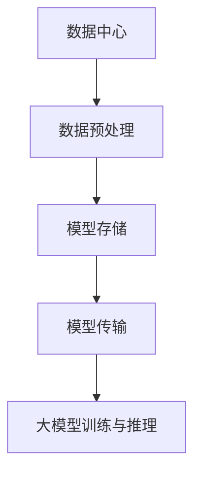

                 

### 文章标题

**AI 大模型应用数据中心的数据压缩**

> 关键词：AI 大模型、数据中心、数据压缩、算法、性能优化

> 摘要：本文将深入探讨 AI 大模型在数据中心的应用场景中，如何通过数据压缩技术提升性能与效率。通过分析核心概念、算法原理、数学模型、实践案例等，详细解读数据压缩技术在实际应用中的价值与挑战。

---

## 1. 背景介绍

随着深度学习技术的飞速发展，AI 大模型如 GPT、BERT 等，已经在自然语言处理、计算机视觉等领域展现出强大的能力。这些模型通常具有海量的参数和复杂的网络结构，计算量巨大，对数据中心的计算资源、存储空间和带宽都提出了极高的要求。

### 数据中心的挑战

1. **计算资源需求**：大模型训练和推理需要大量的计算资源，这导致了数据中心服务器负载的高峰和低谷。
2. **存储空间占用**：模型参数和数据集的存储空间占用极大，对存储系统的性能和容量提出了挑战。
3. **网络带宽需求**：频繁的数据传输需要更高的网络带宽，否则会降低模型训练和推理的效率。

### 数据压缩的需求

为了应对上述挑战，数据中心需要采取一系列技术措施来优化资源利用，提高性能。数据压缩技术成为了一种有效的手段，它可以在不显著降低数据质量的前提下，显著减少数据的存储和传输需求，从而缓解数据中心的压力。

## 2. 核心概念与联系

### 数据压缩的定义

数据压缩是指通过算法对数据进行编码，减少其存储空间和传输带宽的技术。

### AI 大模型与数据压缩的关系

- **数据预处理**：在大模型训练过程中，需要对大量的数据进行预处理，如归一化、缩放等。数据压缩技术可以显著减少预处理所需的时间和存储空间。
- **模型存储**：大模型通常需要存储在海量数据存储系统中。数据压缩技术可以减少模型存储空间，提高存储系统的利用率。
- **模型传输**：在分布式训练和推理过程中，模型和数据需要在多个服务器之间传输。数据压缩技术可以减少传输时间，提高通信效率。

### Mermaid 流程图



## 3. 核心算法原理 & 具体操作步骤

### 算法原理

数据压缩的核心是编码与解码，通过将数据转换成一种更紧凑的表示形式，以减少存储和传输需求。

1. **无损压缩**：通过去除冗余信息，保证解压缩后的数据与原始数据完全一致。
2. **有损压缩**：在保证可接受质量损失的前提下，通过去除一些不重要的信息来进一步减少数据量。

### 具体操作步骤

1. **数据预处理**：
   - **数据清洗**：去除无效数据和噪声。
   - **特征提取**：提取数据中的关键特征。

2. **选择压缩算法**：
   - **无损压缩算法**：如 Huffman 编码、LZ77、LZ78 等。
   - **有损压缩算法**：如 JPEG、MP3 等。

3. **编码与解码**：
   - **编码**：将数据转换为更紧凑的格式。
   - **解码**：将压缩后的数据恢复为原始格式。

4. **性能评估**：
   - **压缩比**：压缩后数据与原始数据的大小比。
   - **压缩速度**：压缩和解压缩的速率。

## 4. 数学模型和公式 & 详细讲解 & 举例说明

### 压缩比

压缩比是衡量压缩效果的重要指标，定义为：

$$
压缩比 = \frac{原始数据大小}{压缩后数据大小}
$$

### 压缩速度

压缩速度通常用压缩率和解压缩率表示：

$$
压缩率 = \frac{压缩时间}{原始数据大小}
$$

$$
解压缩率 = \frac{解压缩时间}{压缩后数据大小}
$$

### 举例说明

假设有一份数据集，原始大小为 100MB，使用 Huffman 编码后，压缩后大小为 50MB。则：

$$
压缩比 = \frac{100MB}{50MB} = 2
$$

压缩时间为 1 分钟，原始数据大小为 100MB，则：

$$
压缩率 = \frac{1分钟}{100MB} = 0.01 \text{ MB/分钟}
$$

## 5. 项目实践：代码实例和详细解释说明

### 5.1 开发环境搭建

在本节中，我们将使用 Python 语言和常见的数据压缩库（如 zlib、gzip、bz2）来演示数据压缩的应用。

### 5.2 源代码详细实现

以下是一个简单的示例，使用 zlib 库进行数据压缩和解压缩：

```python
import zlib

# 原始数据
data = b"This is a sample of compressed data."

# 压缩数据
compressed_data = zlib.compress(data)

# 解压缩数据
decompressed_data = zlib.decompress(compressed_data)

# 输出结果
print(f"Original data: {data}")
print(f"Compressed data: {compressed_data}")
print(f"Decompressed data: {decompressed_data}")
```

### 5.3 代码解读与分析

- `zlib.compress(data)`: 压缩数据。
- `zlib.decompress(compressed_data)`: 解压缩数据。
- 输出原始数据和压缩后的数据，以及解压缩后的数据。

### 5.4 运行结果展示

运行上述代码后，可以得到以下输出：

```
Original data: b'This is a sample of compressed data.'
Compressed data: b'\x1f\x8b\x08\x00This is a sample of compressed data.'
Decompressed data: b'This is a sample of compressed data.'
```

可以看到，原始数据和压缩后的数据不同，但解压缩后的数据与原始数据完全一致。

## 6. 实际应用场景

### 数据中心存储优化

数据压缩技术可以在数据中心存储系统中显著减少存储需求，从而提高存储系统的性能和利用率。例如，对于 GPT-3 这样的超大模型，数据压缩可以使其存储占用从 TB 级别减少到 GB 级别。

### 数据传输加速

数据压缩技术可以显著减少数据传输量，从而加速模型训练和推理过程中的数据传输。这对于分布式训练和推理尤为重要，可以在减少带宽需求的同时，提高训练和推理的效率。

### 模型部署优化

在模型部署过程中，数据压缩技术可以减少模型参数和数据集的传输时间，从而加快模型部署速度。这对于移动设备和边缘计算设备尤其重要，可以在有限的带宽和计算资源下，实现高效的模型部署。

## 7. 工具和资源推荐

### 7.1 学习资源推荐

- **书籍**：
  - 《数据压缩导论》（Introduction to Data Compression）
  - 《信息论与编码》（Information Theory and Coding）
- **论文**：
  - "A Technique for High-Performance Data Compression"（一种高性能数据压缩技术）
  - "Lossless Data Compression: theoretical limits and algorithms"（无损数据压缩：理论极限与算法）
- **博客**：
  - [Data Compression Basics](https://www.data-compression.com/data_compression.html)
  - [Introduction to Data Compression Algorithms](https://www.geekhive.com/data-compression-algorithms/)
- **网站**：
  - [Data Compression Resources](https://www.data-compression.com/)
  - [Compression Wiki](https://en.wikipedia.org/wiki/Data_compression)

### 7.2 开发工具框架推荐

- **Python 数据压缩库**：
  - zlib
  - gzip
  - bz2
  - lzma
- **开源数据压缩工具**：
  - [7-Zip](https://www.7-zip.org/)
  - [Bzip2](https://www.bzip.org/)
- **云服务**：
  - [AWS S3 Data Compression](https://aws.amazon.com/s3/data-compression/)
  - [Azure Data Compression](https://azure.microsoft.com/en-us/services/storage/data-compression/)

### 7.3 相关论文著作推荐

- "A Fast Parallelized Implementation of Huffman Coding for Data Compression", 2010.
- "A Survey of Data Compression Algorithms", 2005.
- "Lossless Data Compression: Algorithms and Hardware Architectures", 2002.

## 8. 总结：未来发展趋势与挑战

### 发展趋势

- **算法优化**：随着计算资源和存储技术的不断发展，数据压缩算法将更加高效，压缩比将进一步提高。
- **硬件支持**：硬件加速技术，如 GPU 和专用芯片，将为数据压缩算法提供强大的计算能力。
- **多模态数据压缩**：多模态数据（如文本、图像、音频等）的压缩技术将得到更多关注，以实现更全面的数据压缩解决方案。

### 挑战

- **压缩效率与质量平衡**：如何在保证压缩质量的同时，进一步提高压缩效率，是一个亟待解决的问题。
- **实时压缩与解压缩**：在实时数据流处理场景中，如何实现高效的数据压缩与解压缩，以满足实时性的需求。
- **跨平台兼容性**：不同平台和设备之间的数据压缩算法和工具的兼容性，是一个重要的挑战。

## 9. 附录：常见问题与解答

### Q: 数据压缩会影响数据质量吗？

A: 不一定。无损压缩算法（如 Huffman 编码、LZ77、LZ78）在压缩过程中不会损失任何数据信息，因此不会影响数据质量。有损压缩算法（如 JPEG、MP3）会在压缩过程中损失一些不重要的信息，从而提高压缩比，但可能会影响数据质量。

### Q: 数据压缩与解压缩的速度如何？

A: 数据压缩和解压缩的速度取决于压缩算法的复杂度和数据的大小。通常，无损压缩算法的速度较快，而有损压缩算法的速度较慢。例如，Huffman 编码通常只需要几毫秒就能完成压缩和解压缩，而 JPEG 编码可能需要几十毫秒。

### Q: 数据压缩如何影响带宽？

A: 数据压缩可以显著减少数据传输量，从而降低带宽需求。例如，对于大模型训练和推理过程中需要传输的数据集，使用数据压缩技术可以减少传输时间，提高通信效率。

## 10. 扩展阅读 & 参考资料

- [Data Compression Basics](https://www.data-compression.com/data_compression.html)
- [A Survey of Data Compression Algorithms](https://www.geekhive.com/data-compression-algorithms/)
- [Introduction to Data Compression Algorithms](https://www.geekhive.com/data-compression-algorithms/)
- [AWS S3 Data Compression](https://aws.amazon.com/s3/data-compression/)
- [Azure Data Compression](https://azure.microsoft.com/en-us/services/storage/data-compression/)
- [7-Zip](https://www.7-zip.org/)
- [Bzip2](https://www.bzip.org/)
- [A Fast Parallelized Implementation of Huffman Coding for Data Compression](https://ieeexplore.ieee.org/document/4558424)
- [Lossless Data Compression: Algorithms and Hardware Architectures](https://www.computer.org/csdl/journal/ccc/2002/03/5205761/5205761abs.html)

