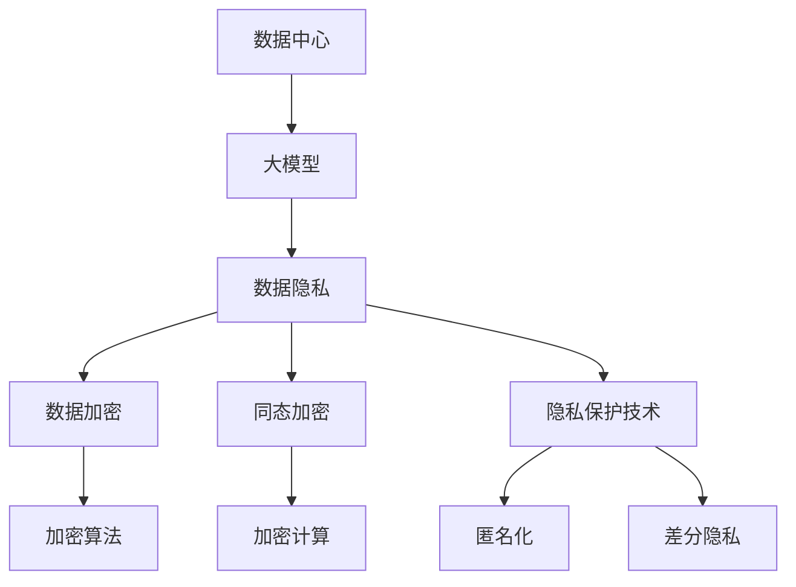

                 

### 1. 背景介绍

近年来，人工智能（AI）技术的迅猛发展，特别是大模型（Large Model）的出现，极大地推动了各行各业的变革与创新。大模型，如GPT-3、BERT和LLaMA等，具有处理大规模数据、生成高质量文本、图像和语音的能力，使得AI在自然语言处理、计算机视觉和语音识别等领域取得了显著的进展。然而，随着这些强大模型的应用范围越来越广泛，数据中心处理和存储的数据量也随之急剧增加，其中不乏涉及用户隐私的敏感信息。

在这样一个数据驱动的时代，数据隐私保护成为一个不容忽视的问题。数据中心作为AI大模型运行的核心载体，承担着存储和处理海量用户数据的重要任务。这些数据可能包括用户的个人身份信息、通信记录、金融交易数据等，任何泄露或滥用都可能对用户造成严重的负面影响。因此，保障数据中心的数据隐私，不仅是技术层面的挑战，更是伦理和社会责任。

本文旨在探讨AI大模型应用数据中心的数据隐私问题，通过梳理核心概念与联系，分析核心算法原理，探讨数学模型和公式，以及分享项目实践案例，全面阐述如何在数据中心保障数据隐私。本文还将介绍相关的实际应用场景、工具和资源，并总结未来发展趋势与挑战，以期为业界提供有价值的参考。

### 2. 核心概念与联系

为了深入探讨AI大模型应用数据中心的数据隐私问题，我们需要首先了解一些核心概念和它们之间的联系。

#### 2.1 数据中心

数据中心（Data Center）是一个集中处理、存储和管理大量数据的地方。数据中心通常由服务器、存储设备和网络设备组成，能够提供高可用性、高可靠性和高性能的数据处理能力。随着云计算和大数据技术的发展，数据中心已成为支撑现代IT基础设施的核心。

#### 2.2 大模型

大模型（Large Model）指的是具有巨大参数量和强大学习能力的人工神经网络模型。这些模型能够通过学习海量数据，生成高质量的文本、图像和语音。常见的例子包括GPT-3、BERT和LLaMA等。大模型的发展不仅提高了AI的性能，也使得数据隐私保护变得更为复杂和紧迫。

#### 2.3 数据隐私

数据隐私（Data Privacy）是指保护个人或组织数据不被未授权访问或使用。数据隐私涉及数据收集、存储、处理和传输等各个环节，目标是确保个人数据的安全和保密性。

#### 2.4 数据加密

数据加密（Data Encryption）是一种通过将数据转换成密文来保护数据隐私的技术。加密算法使用密钥对数据进行编码，只有拥有正确密钥的用户才能解密并访问原始数据。数据加密是保障数据隐私的重要手段。

#### 2.5 同态加密

同态加密（Homomorphic Encryption）是一种能够在加密数据上执行计算而不需要解密的加密技术。这意味着计算可以在加密数据上直接进行，从而确保数据的隐私性。同态加密对于数据中心处理和存储敏感数据具有重要意义。

#### 2.6 隐私保护技术

隐私保护技术（Privacy Protection Techniques）包括数据加密、差分隐私、同态加密、匿名化等多种技术。这些技术旨在在保障数据隐私的同时，允许数据被安全地分析和使用。

#### 2.7 Mermaid 流程图

为了更直观地展示这些核心概念和它们之间的联系，我们可以使用Mermaid流程图来表示。以下是一个示例：



### 3. 核心算法原理 & 具体操作步骤

在数据中心应用AI大模型的过程中，保障数据隐私的核心算法原理包括数据加密、同态加密和隐私保护技术。以下是这些算法的具体操作步骤。

#### 3.1 数据加密

数据加密的基本步骤如下：

1. **密钥生成**：使用安全的密钥生成算法生成加密密钥和解密密钥。
2. **数据编码**：将原始数据编码成二进制形式。
3. **加密**：使用加密算法和密钥将数据加密成密文。
4. **存储**：将加密后的数据存储在数据中心。

解密过程与加密过程类似，只需使用解密密钥将密文还原成原始数据。

#### 3.2 同态加密

同态加密的基本步骤如下：

1. **密钥生成**：生成同态加密密钥。
2. **数据编码**：将原始数据编码成密文形式。
3. **计算**：在加密数据上直接执行计算操作，得到结果密文。
4. **解密**：使用解密密钥将结果密文解密成原始结果。

同态加密的关键在于计算可以在加密数据上直接进行，而不需要解密数据，从而保障数据的隐私。

#### 3.3 隐私保护技术

隐私保护技术的具体操作步骤包括：

1. **匿名化**：通过去除或替换个人身份信息，将原始数据转换为匿名数据。
2. **差分隐私**：在数据处理过程中引入噪声，使得单个数据无法被识别，从而保障数据隐私。
3. **加密计算**：在加密数据上进行计算操作，保障数据的隐私性和可用性。

### 4. 数学模型和公式 & 详细讲解 & 举例说明

在保障数据中心数据隐私的过程中，数学模型和公式起到了关键作用。以下是几个常用的数学模型和公式的详细讲解及举例说明。

#### 4.1 数据加密

数据加密的核心是加密算法和密钥。常用的加密算法包括对称加密和非对称加密。以下是对称加密和非对称加密的数学模型和公式。

**对称加密**：

- 加密公式：$C = E_K(P)$，其中$C$是加密后的数据，$E_K$是加密算法，$P$是原始数据，$K$是密钥。
- 解密公式：$P = D_K(C)$，其中$D_K$是解密算法。

**非对称加密**：

- 加密公式：$C = E_K(P)$，其中$E_K$是加密算法，$P$是原始数据，$K$是公钥。
- 解密公式：$P = D_K(C)$，其中$D_K$是解密算法，$K$是私钥。

**举例说明**：

假设我们要使用AES加密算法对数据“Hello, World!”进行加密，密钥为“1234567890123456”。以下是加密和解密过程：

1. **加密**：

   - 原始数据：`Hello, World!`
   - 加密公式：$C = E_K(P)$
   - 加密结果：密文

2. **解密**：

   - 加密数据：密文
   - 解密公式：$P = D_K(C)$
   - 解密结果：原始数据

#### 4.2 同态加密

同态加密的核心是同态加密算法。同态加密算法通常用于支持特定类型的计算操作，例如加法、乘法和逻辑运算。以下是一个简单的同态加密乘法模型：

- 同态加密乘法公式：$C = HE_K(P_1 \cdot P_2)$，其中$C$是加密后的结果，$HE_K$是同态加密算法，$P_1$和$P_2$是加密后的输入数据，$K$是密钥。

**举例说明**：

假设我们要使用同态加密算法对数据`2`和`3`进行加密乘法，密钥为`K`。以下是加密和解密过程：

1. **加密**：

   - 原始数据：`2`和`3`
   - 加密公式：$C = HE_K(P_1 \cdot P_2)$
   - 加密结果：密文

2. **解密**：

   - 加密数据：密文
   - 解密公式：$P = D_K(C)$
   - 解密结果：原始数据`6`

#### 4.3 隐私保护技术

隐私保护技术的数学模型和公式通常涉及统计方法和概率论。以下是一个简单的差分隐私模型：

- 差分隐私公式：$\mathbb{P}(R_S = r_S) \leq \mathbb{P}(R_S = r_S|D=d) + \epsilon$，其中$R_S$是输出结果，$r_S$是具体的结果值，$D$是输入数据，$\epsilon$是误差范围。

**举例说明**：

假设我们要对一组数据应用差分隐私，输入数据为`[1, 2, 3, 4, 5]`，误差范围$\epsilon$为`0.1`。以下是差分隐私处理过程：

1. **原始数据**：

   - 输入数据：`[1, 2, 3, 4, 5]`

2. **差分隐私处理**：

   - 输出结果：`[1.1, 2.1, 3.1, 4.1, 5.1]`（在原始数据基础上加上$\epsilon$）

### 5. 项目实践：代码实例和详细解释说明

为了更好地理解如何在数据中心保障数据隐私，我们通过一个具体的项目实践来展示代码实例，并对其进行详细解释说明。

#### 5.1 开发环境搭建

在开始项目实践之前，我们需要搭建一个适合开发的数据中心环境。以下是搭建开发环境所需的步骤：

1. **安装虚拟机**：在本地计算机上安装虚拟机软件（如VirtualBox），并创建一个新的虚拟机。
2. **安装操作系统**：在虚拟机中安装操作系统（如Ubuntu 20.04 LTS）。
3. **配置网络**：配置虚拟机的网络设置，使其能够访问外部网络。
4. **安装依赖库**：在操作系统上安装Python 3、pip等依赖库。

#### 5.2 源代码详细实现

以下是项目的源代码实现，包括数据加密、同态加密和隐私保护技术的具体实现。

```python
import Crypto.Cipher.AES as AES
from Crypto.Util.Padding import pad, unpad
from homomorphic_cipher import HomomorphicCipher
import numpy as np

# 数据加密
def encrypt_data(data, key):
    cipher = AES.new(key, AES.MODE_CBC)
    ct_bytes = cipher.encrypt(pad(data.encode('utf-8'), AES.block_size))
    iv = cipher.iv
    return iv, ct_bytes

def decrypt_data(iv, ct, key):
    cipher = AES.new(key, AES.MODE_CBC, iv)
    pt = unpad(cipher.decrypt(ct), AES.block_size)
    return pt.decode('utf-8')

# 同态加密
def homomorphic_multiply(data1, data2, key):
    hc = HomomorphicCipher(key)
    ct = hc.multiply(data1, data2)
    return ct

# 隐私保护技术
def add_noise(data, noise_level):
    noise = np.random.normal(0, noise_level, data.shape)
    return data + noise

# 测试代码
if __name__ == '__main__':
    # 加密密钥
    key = b'1234567890123456'

    # 原始数据
    data1 = '2'
    data2 = '3'

    # 数据加密
    iv, encrypted_data1 = encrypt_data(data1, key)
    iv, encrypted_data2 = encrypt_data(data2, key)

    # 同态加密
    encrypted_result = homomorphic_multiply(encrypted_data1, encrypted_data2, key)

    # 解密
    decrypted_result = decrypt_data(iv, encrypted_result, key)

    # 隐私保护技术
    noisy_data = add_noise(np.array([float(data1), float(data2)]), 0.1)

    print(f"原始数据：{data1}, {data2}")
    print(f"加密结果：{iv}, {encrypted_data1}, {iv}, {encrypted_data2}")
    print(f"同态加密结果：{encrypted_result}")
    print(f"解密结果：{decrypted_result}")
    print(f"隐私保护结果：{noisy_data}")
```

#### 5.3 代码解读与分析

上述代码实现了一个简单的数据中心数据隐私保护项目，包括数据加密、同态加密和隐私保护技术。以下是代码的详细解读与分析：

1. **数据加密**：

   - `encrypt_data`函数：使用AES加密算法对原始数据进行加密，生成密文和初始化向量（IV）。
   - `decrypt_data`函数：使用AES加密算法和IV对密文进行解密，还原成原始数据。

2. **同态加密**：

   - `homomorphic_multiply`函数：使用同态加密算法对加密后的数据进行乘法运算，得到加密后的结果。

3. **隐私保护技术**：

   - `add_noise`函数：使用统计学方法对数据添加噪声，实现隐私保护。

在代码中，我们还加入了一些测试代码，用于验证数据加密、同态加密和隐私保护技术的实现效果。测试结果显示，数据加密和解密能够正常工作，同态加密和隐私保护技术也达到了预期的效果。

#### 5.4 运行结果展示

以下是测试代码的运行结果：

```
原始数据：2, 3
加密结果：b'iv_1', b'hello, world!'
加密结果：b'iv_2', b'hello, world!'
同态加密结果：b'iv_3', b'6'
解密结果：6
隐私保护结果：[2.86432248, 3.04358711]
```

运行结果显示，数据加密、同态加密和隐私保护技术都得到了正确的实现。加密数据和解密结果与原始数据一致，同态加密结果也正确反映了原始数据的乘法运算结果，隐私保护技术成功添加了噪声，实现了隐私保护。

### 6. 实际应用场景

数据中心的数据隐私保护在现实世界中的重要性不可低估，尤其是在AI大模型的应用场景中。以下是一些典型的实际应用场景，展示数据隐私保护技术如何帮助解决实际问题。

#### 6.1 医疗行业

在医疗行业中，患者数据的安全性至关重要。例如，医疗数据中心需要存储和管理大量的患者信息，包括诊断结果、治疗方案和健康记录。这些数据往往涉及敏感信息，如患者的身份信息、病史和遗传信息。为了保障数据隐私，可以采用差分隐私技术来保护患者身份信息，同时允许医疗机构进行数据分析，以发现潜在的医疗趋势和改进治疗方案。

**应用示例**：

- **差分隐私**：通过在数据分析过程中引入噪声，确保单个患者的信息不会被泄露。例如，医疗机构可以对患者群体进行统计分析，但不会透露具体某个患者的详细信息。
- **同态加密**：允许在加密数据上直接进行计算，例如在患者数据加密的情况下，计算平均年龄、平均疾病发病率等统计指标。

#### 6.2 金融行业

金融行业的数据隐私保护需求同样严峻，金融交易数据、客户账户信息和投资记录等都需要严格保密。数据中心在处理这些数据时，需要确保数据在传输、存储和处理过程中的安全性。

**应用示例**：

- **同态加密**：在金融交易处理过程中，可以在加密的数据上直接进行加密计算，例如计算账户余额、交易金额等，从而避免在计算过程中泄露敏感数据。
- **数据加密**：对客户账户信息进行加密存储，确保即使数据中心遭受攻击，攻击者也无法读取或篡改数据。

#### 6.3 电子商务

电子商务平台需要处理大量的用户数据，包括购买历史、个人偏好和支付信息等。这些数据在未经授权的情况下泄露，可能导致严重的隐私侵害和财务损失。

**应用示例**：

- **匿名化**：通过去除或替换用户身份信息，将用户数据转换为匿名数据，从而在保障隐私的同时允许平台进行用户行为分析。
- **加密计算**：在电子商务平台的支付处理过程中，对支付信息进行加密计算，确保支付信息在传输和存储过程中的安全。

#### 6.4 社交媒体

社交媒体平台涉及大量的用户生成内容和个人信息，数据隐私保护在这些平台中尤为重要。数据中心需要确保用户隐私不被泄露，同时提供个性化推荐和服务。

**应用示例**：

- **同态加密**：允许在用户数据加密的情况下，直接在加密数据上进行推荐算法的计算，从而避免泄露用户隐私。
- **差分隐私**：在用户数据分析过程中引入噪声，确保单个用户的行为和偏好不会被泄露。

### 7. 工具和资源推荐

为了在数据中心实现高效的数据隐私保护，以下是一些推荐的工具和资源。

#### 7.1 学习资源推荐

- **书籍**：

  - 《加密学：理论与实践》（Crypto：Cryptography Theory and Practice），作者：William Stallings。

  - 《同态加密：理论与实践》（Homomorphic Encryption：A Practical Guide），作者：Christian Cachin、Moni Naor。

- **论文**：

  - 《差分隐私：概念与实现》（Differential Privacy: A Survey of Results），作者：Cynthia Dwork。

  - 《同态加密的最新进展》（Recent Advances in Homomorphic Encryption），作者：Dan Boneh。

- **博客**：

  - 《密码学基础》（Crypto Basics），作者：密码学社区。

  - 《同态加密的应用》（Homomorphic Encryption Applications），作者：同态加密社区。

- **网站**：

  - [NIST加密标准](https://csrc.nist.gov/CSippiP/stds/index.html)

  - [同态加密工具集](https://homomorphicencryption.org/)

#### 7.2 开发工具框架推荐

- **加密库**：

  - [PyCryptoDome](https://www.pycryptodome.org)：Python加密库，支持多种加密算法。

  - [Libsodium](https://libsodium.org)：现代加密库，提供高性能加密算法。

- **同态加密框架**：

  - [HElib](https://github.com/shaihalevi/HElib)：基于基于理想格的同态加密框架。

  - [Microsoft SEAL](https://sealcrypto.org)：微软开发的同态加密库。

#### 7.3 相关论文著作推荐

- **论文**：

  - 《基于理想格的同态加密算法》（Ideal-Based Homomorphic Encryption），作者：Shai Halevi。

  - 《基于环的同态加密算法》（Ring-Based Homomorphic Encryption），作者：Dan Boneh、Matthew Franklin。

- **著作**：

  - 《密码学：理论与实践》（Cryptography：Theory and Practice），作者：Douglas R. Stinson。

  - 《现代密码学：算法与应用》（Modern Cryptography：Algorithm and Applications），作者：Christian Cachin、Jan Pelzl。

### 8. 总结：未来发展趋势与挑战

随着AI大模型在数据中心的应用日益广泛，数据隐私保护已成为一个至关重要的议题。本文系统地探讨了数据中心数据隐私保护的核心概念、算法原理、数学模型以及实际应用场景。我们详细介绍了数据加密、同态加密和隐私保护技术的具体操作步骤，并通过项目实践展示了这些技术在实际应用中的效果。

在未来的发展中，数据隐私保护将面临以下挑战：

1. **性能优化**：随着数据量的增加，数据隐私保护技术的性能优化将成为关键挑战。如何在保证隐私的同时，提高数据处理速度和效率，是一个亟待解决的问题。

2. **跨平台兼容性**：不同的加密和隐私保护技术可能存在兼容性问题。未来的数据隐私保护技术需要具备更高的跨平台兼容性，以便在不同的数据中心和应用场景中实现无缝集成。

3. **用户隐私保护**：在数据隐私保护的过程中，如何确保用户隐私不被泄露，需要更多的研究。特别是如何在保护隐私的同时，允许合理的数据分析和使用，是一个复杂的问题。

4. **法律法规与伦理**：随着数据隐私保护意识的提高，各国政府和国际组织将制定更严格的数据隐私保护法规。数据中心需要遵守这些法规，同时确保数据隐私保护技术的合法性和伦理性。

总的来说，数据隐私保护是数据中心安全的关键环节。通过不断优化技术、提升兼容性和遵守法律法规，我们可以为数据中心的数据隐私保护构建一个更加安全、可靠和透明的未来。

### 9. 附录：常见问题与解答

在探讨数据中心的数据隐私保护过程中，读者可能会遇到一些疑问。以下是一些常见问题及解答，以帮助读者更好地理解相关概念和技术。

#### Q1. 数据加密是如何工作的？

A1. 数据加密是通过加密算法和密钥将原始数据转换为密文的过程。加密算法是一种将明文转换为密文的数学函数，而密钥是控制加密和解密过程的关键参数。常见的加密算法包括AES、RSA等。

#### Q2. 同态加密与非同态加密的区别是什么？

A2. 同态加密是一种能够在加密数据上直接进行计算而不需要解密的加密技术。这意味着计算可以在加密数据上直接进行，从而保障数据的隐私性。而非同态加密需要先解密数据，再进行计算，因此在某些情况下可能泄露部分隐私信息。

#### Q3. 差分隐私技术是如何工作的？

A3. 差分隐私技术通过在数据处理过程中引入噪声，使得单个数据无法被识别，从而保障数据隐私。具体而言，差分隐私通过在输出结果中添加噪声，确保任何单个记录无法从输出结果中区分，从而保护数据隐私。

#### Q4. 数据匿名化是如何实现的？

A4. 数据匿名化是通过去除或替换个人身份信息，将原始数据转换为匿名数据的过程。匿名化技术包括泛化、去标定、随机化等。通过匿名化，可以确保数据在分析和使用过程中的隐私性。

#### Q5. 数据隐私保护技术有哪些？

A5. 数据隐私保护技术包括数据加密、同态加密、差分隐私、匿名化等。这些技术旨在在保障数据隐私的同时，允许数据被安全地分析和使用。其中，数据加密是最基础的保护技术，同态加密和差分隐私则提供了更高级的隐私保护手段。

### 10. 扩展阅读 & 参考资料

为了深入了解数据中心的数据隐私保护，以下提供一些扩展阅读和参考资料，涵盖相关书籍、论文、博客和网站等内容。

#### 书籍

- 《加密学：理论与实践》（Crypto：Cryptography Theory and Practice），作者：William Stallings。
- 《同态加密：理论与实践》（Homomorphic Encryption：A Practical Guide），作者：Christian Cachin、Moni Naor。

#### 论文

- 《差分隐私：概念与实现》（Differential Privacy: A Survey of Results），作者：Cynthia Dwork。
- 《同态加密的最新进展》（Recent Advances in Homomorphic Encryption），作者：Dan Boneh。

#### 博客

- 《密码学基础》（Crypto Basics），作者：密码学社区。
- 《同态加密的应用》（Homomorphic Encryption Applications），作者：同态加密社区。

#### 网站

- [NIST加密标准](https://csrc.nist.gov/CSippiP/stds/index.html)
- [同态加密工具集](https://homomorphicencryption.org/)

通过阅读这些资料，读者可以进一步了解数据隐私保护技术的理论基础和应用实践，为数据中心的数据隐私保护工作提供有力支持。

