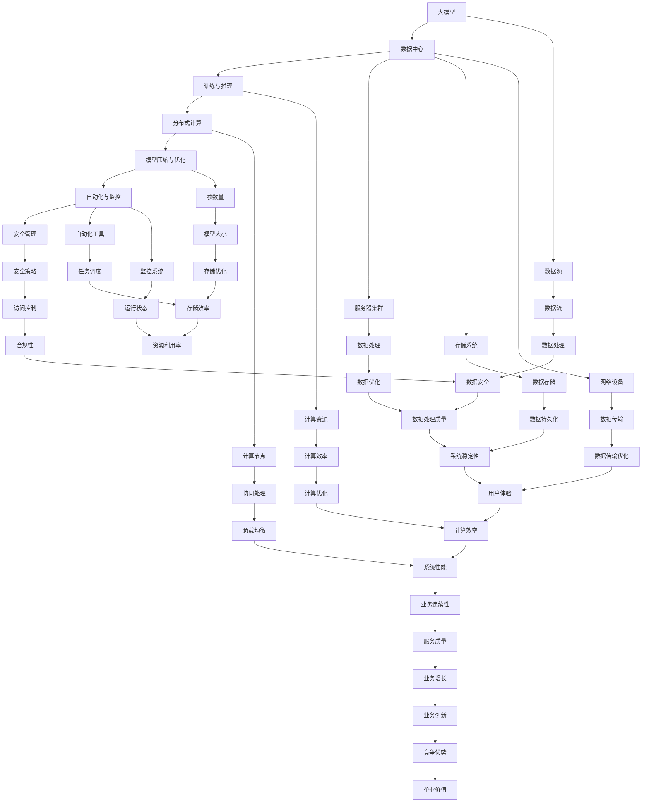

                 

### 1. 背景介绍

人工智能（AI）技术在近年来取得了飞速发展，尤其是大模型（Large-scale Model）的涌现，为AI应用带来了前所未有的效能提升。大模型通常指的是那些参数量极大、训练数据规模庞大的神经网络模型，如GPT系列、BERT等。这些模型在自然语言处理（NLP）、计算机视觉（CV）、语音识别等多个领域取得了显著成果，极大地推动了AI技术的发展。

随着大模型的应用越来越广泛，其运行和管理的需求也逐渐增加。大模型运行的核心问题之一是数据中心的建设与优化。数据中心作为大模型训练和推理的主要场所，其性能直接影响到模型的应用效果和效率。因此，构建一个高效、可靠、可扩展的数据中心成为当前AI领域的一个重要课题。

本文将围绕大模型应用数据中心的建设，探讨一系列最佳实践。首先，我们将介绍大模型应用数据中心的基本概念和架构，然后深入分析核心算法原理，详细讲解数学模型和公式，并通过实际项目实践展示具体操作步骤和代码实例。此外，文章还将探讨大模型在各个应用场景中的实践，推荐相关工具和资源，总结未来发展趋势与挑战，并提供常见问题与解答。

通过本文的阅读，读者将了解大模型应用数据中心的建设要点，掌握核心算法和数学模型的运用，具备在实际项目中设计和优化数据中心的实践能力。

### 2. 核心概念与联系

要深入理解大模型应用数据中心，首先需要明确一些核心概念，并分析它们之间的联系。以下是本文中涉及的一些关键概念及其相互关系。

#### 大模型

大模型通常指的是那些参数量极大的神经网络模型。这些模型通过大量的训练数据学习到复杂的模式和知识，从而在多个领域展现出强大的性能。典型的大模型包括GPT系列、BERT、ViT等。它们的核心特点是拥有数百万甚至数十亿个参数，能够在多种数据集上进行训练。

#### 数据中心

数据中心是指用于存储、处理和管理大量数据的服务器设施。它是一个高度集成、自动化、安全可靠的数据处理中心，能够支持大模型的训练和推理。数据中心通常由服务器集群、存储系统、网络设备和安全管理设施组成。

#### 训练与推理

训练（Training）是指通过大量数据来优化神经网络模型的参数，使其能够预测或生成目标数据。推理（Inference）是指使用训练好的模型来对新的数据进行预测或生成。训练和推理是数据中心中最重要的任务。

#### 分布式计算

分布式计算是指将计算任务分解成多个子任务，由多个计算节点协同处理，以提高计算效率和性能。在大模型训练中，分布式计算通过将数据分片和模型参数分片，使得多个计算节点可以并行处理，从而大幅提升训练速度。

#### 模型压缩与优化

模型压缩与优化是指通过各种技术手段减少模型的参数量，降低模型的大小，提高模型的运行效率。这在大模型应用中尤为重要，因为大模型的参数量和计算量都非常庞大，直接影响到数据中心的性能和成本。

#### 自动化与监控

自动化与监控是指利用自动化工具和监控系统对数据中心进行管理、监控和优化。自动化工具能够自动化地完成数据中心中的一些常见任务，如资源分配、任务调度等。监控系统则能够实时监控数据中心的运行状态，及时发现和解决问题。

为了更好地理解这些概念之间的联系，我们可以使用Mermaid流程图来展示它们之间的关系。



通过上述Mermaid流程图，我们可以清晰地看到大模型、数据中心、训练与推理、分布式计算、模型压缩与优化、自动化与监控等核心概念之间的相互联系，以及它们如何共同作用于数据中心的建设与优化。

### 3. 核心算法原理 & 具体操作步骤

#### 3.1 算法原理

大模型的训练和推理过程主要依赖于深度学习算法，其中核心的算法包括神经网络（Neural Networks）、反向传播（Backpropagation）、优化算法（Optimization Algorithms）等。

**神经网络（Neural Networks）**：神经网络是一种模拟人脑神经元之间连接的计算模型，由多个神经元（或层）组成。每个神经元接收来自前一层神经元的输入，并通过加权求和和激活函数产生输出。神经网络通过不断调整权重和偏置来学习数据中的模式和规律。

**反向传播（Backpropagation）**：反向传播是一种用于训练神经网络的算法，通过计算输出层的误差，将误差反向传播到前一层，从而不断调整权重和偏置。反向传播算法的关键在于如何高效地计算梯度，以及如何优化梯度下降过程。

**优化算法（Optimization Algorithms）**：优化算法用于求解优化问题，如最小化损失函数。常见的优化算法包括随机梯度下降（SGD）、动量法、Adam等。这些算法通过不同的策略来加速梯度下降过程，提高收敛速度和效果。

#### 3.2 具体操作步骤

**3.2.1 数据预处理**

在开始训练之前，需要对数据进行预处理，包括数据清洗、数据标准化、数据分片等。数据清洗是指去除噪声数据和异常值，确保数据质量。数据标准化是指将不同特征的数据缩放到相同的尺度，以便神经网络训练。数据分片是指将数据集划分为训练集、验证集和测试集，用于训练、验证和测试模型性能。

**3.2.2 模型初始化**

模型初始化是指为神经网络模型分配初始权重和偏置。常用的初始化方法包括随机初始化、高斯初始化等。好的初始化方法可以加快模型的收敛速度，提高模型性能。

**3.2.3 训练过程**

训练过程包括以下几个步骤：

1. **前向传播（Forward Propagation）**：输入数据通过神经网络的前向传播过程，产生预测输出。
2. **计算损失（Compute Loss）**：使用预测输出和实际标签计算损失函数，如均方误差（MSE）、交叉熵损失（Cross-Entropy Loss）等。
3. **反向传播（Backpropagation）**：计算损失关于模型参数的梯度，并反向传播到前一层。
4. **优化更新（Optimization Update）**：使用优化算法更新模型参数，减小损失函数。
5. **迭代循环（Iteration）**：重复上述步骤，直到模型收敛或达到预定的训练次数。

**3.2.4 模型评估与调优**

训练完成后，需要对模型进行评估和调优。评估过程包括计算模型的准确性、召回率、F1分数等指标，以判断模型在验证集和测试集上的表现。调优过程包括调整超参数、使用不同的优化算法、增加或减少训练数据等，以优化模型性能。

**3.2.5 模型压缩与优化**

模型压缩与优化是提高模型运行效率的重要手段。具体方法包括：

1. **权重剪枝（Weight Pruning）**：通过剪枝低贡献的权重来减少模型参数量。
2. **量化（Quantization）**：将模型的权重和激活值缩放到较低的比特宽，以减少模型大小和计算量。
3. **蒸馏（Distillation）**：通过将大模型的知识传递给小模型，实现模型压缩和性能提升。

**3.2.6 模型部署与推理**

模型部署是指将训练好的模型部署到生产环境中，用于实际应用。推理过程包括：

1. **数据预处理**：对输入数据进行预处理，如标准化、去噪等。
2. **前向传播**：使用训练好的模型对输入数据进行预测。
3. **结果输出**：输出预测结果，如分类标签、概率分布等。

通过上述具体操作步骤，我们可以构建一个高效、可靠的大模型应用数据中心，以满足各种AI应用的需求。

### 4. 数学模型和公式 & 详细讲解 & 举例说明

#### 4.1 数学模型

在深度学习领域，数学模型是理解和实现算法的核心。以下是一些关键数学模型和公式的详细讲解。

**4.1.1 前向传播**

在前向传播过程中，我们通过层与层之间的权重和偏置计算激活值。以下是一个简单的神经网络前向传播过程的公式：

$$
Z^{[l]} = \sum_{m=1}^{n} W^{[l]}_m a^{[l-1]}_m + b^{[l]} \\
a^{[l]} = \sigma(Z^{[l]})
$$

其中，$Z^{[l]}$ 是第$l$层的输入值，$W^{[l]}$ 是第$l$层的权重矩阵，$b^{[l]}$ 是第$l$层的偏置向量，$a^{[l-1]}$ 是上一层的激活值，$\sigma$ 是激活函数，$a^{[l]}$ 是第$l$层的激活值。

**4.1.2 反向传播**

反向传播是通过计算损失函数关于模型参数的梯度来更新模型参数的过程。以下是一个简单的梯度计算公式：

$$
\frac{\partial J}{\partial W^{[l]}} = \frac{\partial J}{\partial Z^{[l]}} \cdot \frac{\partial Z^{[l]}}{\partial W^{[l]}} \\
\frac{\partial J}{\partial b^{[l]}} = \frac{\partial J}{\partial Z^{[l]}} \cdot \frac{\partial Z^{[l]}}{\partial b^{[l]}}
$$

其中，$J$ 是损失函数，$\frac{\partial J}{\partial W^{[l]}}$ 和 $\frac{\partial J}{\partial b^{[l]}}$ 分别是损失函数关于权重和偏置的梯度。

**4.1.3 优化算法**

常用的优化算法包括随机梯度下降（SGD）、动量法、Adam等。以下是一个简单的随机梯度下降更新公式：

$$
W^{[t+1]} = W^{[t]} - \alpha \cdot \frac{\partial J}{\partial W^{[t]}}
$$

其中，$W^{[t]}$ 是第$t$次迭代的权重，$\alpha$ 是学习率。

**4.1.4 模型压缩**

模型压缩是通过减少模型参数量来提高模型运行效率。以下是一些常用的模型压缩方法：

1. **权重剪枝（Weight Pruning）**：
$$
\tilde{W}^{[l]} = \text{sign}(W^{[l]})
$$

其中，$\tilde{W}^{[l]}$ 是经过剪枝后的权重。

2. **量化（Quantization）**：
$$
\tilde{W}^{[l]} = \text{Quantize}(W^{[l]})
$$

其中，$\text{Quantize}$ 是量化操作，将权重缩放到较低的比特宽。

3. **蒸馏（Distillation）**：
$$
\tilde{a}^{[l]} = \text{Softmax}(q(\theta^{[l]}))
$$

其中，$\theta^{[l]}$ 是大模型的参数，$q(\theta^{[l]})$ 是小模型的学习过程。

#### 4.2 举例说明

**4.2.1 前向传播举例**

假设我们有一个两层神经网络，第一层的激活函数为$σ(x) = \frac{1}{1+e^{-x}}$，第二层的激活函数为$σ(x) = \frac{x}{1+x}$。给定输入$x = [1, 2, 3]$，权重$W^{[1]} = [[0.1, 0.2], [0.3, 0.4]]$，偏置$b^{[1]} = [0.1, 0.2]$，权重$W^{[2]} = [[0.5, 0.6], [0.7, 0.8]]$，偏置$b^{[2]} = [0.5, 0.6]$。

首先进行第一层的前向传播：

$$
Z^{[1]} = W^{[1]}x + b^{[1]} = \begin{bmatrix} 0.1 & 0.2 \\ 0.3 & 0.4 \end{bmatrix} \begin{bmatrix} 1 \\ 2 \\ 3 \end{bmatrix} + \begin{bmatrix} 0.1 \\ 0.2 \end{bmatrix} = \begin{bmatrix} 0.4 \\ 1.2 \end{bmatrix} \\
a^{[1]} = σ(Z^{[1]}) = \begin{bmatrix} 0.6 \\ 0.8 \end{bmatrix}
$$

然后进行第二层的前向传播：

$$
Z^{[2]} = W^{[2]}a^{[1]} + b^{[2]} = \begin{bmatrix} 0.5 & 0.6 \\ 0.7 & 0.8 \end{bmatrix} \begin{bmatrix} 0.6 \\ 0.8 \end{bmatrix} + \begin{bmatrix} 0.5 \\ 0.6 \end{bmatrix} = \begin{bmatrix} 0.9 \\ 1.4 \end{bmatrix} \\
a^{[2]} = σ(Z^{[2]}) = \begin{bmatrix} 0.6 \\ 0.76 \end{bmatrix}
$$

**4.2.2 反向传播举例**

假设我们的损失函数为$J = \frac{1}{2} \sum_{i=1}^{n} (a^{[2]}_i - y_i)^2$，给定目标值$y = [1, 0]$。

首先计算第二层的梯度：

$$
\frac{\partial J}{\partial Z^{[2]}} = 2(a^{[2]} - y) = \begin{bmatrix} 0.2 \\ -0.2 \end{bmatrix} \\
\frac{\partial Z^{[2]}}{\partial W^{[2]}} = a^{[1]}^T = \begin{bmatrix} 0.6 & 0.8 \end{bmatrix} \\
\frac{\partial Z^{[2]}}{\partial b^{[2]}} = 1 = \begin{bmatrix} 1 \\ 1 \end{bmatrix}
$$

然后计算第一层的梯度：

$$
\frac{\partial J}{\partial W^{[2]}} = \frac{\partial J}{\partial Z^{[2]}} \cdot \frac{\partial Z^{[2]}}{\partial W^{[2]}} = \begin{bmatrix} 0.2 & 0.32 \\ 0.3 & 0.48 \end{bmatrix} \\
\frac{\partial J}{\partial b^{[2]}} = \frac{\partial J}{\partial Z^{[2]}} \cdot \frac{\partial Z^{[2]}}{\partial b^{[2]}} = \begin{bmatrix} 0.2 \\ 0.2 \end{bmatrix}
$$

最后更新权重和偏置：

$$
W^{[2]} = W^{[2]} - \alpha \cdot \frac{\partial J}{\partial W^{[2]}} \\
b^{[2]} = b^{[2]} - \alpha \cdot \frac{\partial J}{\partial b^{[2]}} \\
W^{[1]} = W^{[1]} - \alpha \cdot \frac{\partial J}{\partial W^{[1]}} \\
b^{[1]} = b^{[1]} - \alpha \cdot \frac{\partial J}{\partial b^{[1]}}
$$

通过上述公式和举例，我们可以更好地理解深度学习中的数学模型和计算过程。

### 5. 项目实践：代码实例和详细解释说明

#### 5.1 开发环境搭建

在本项目实践中，我们将使用Python作为主要编程语言，并利用TensorFlow框架来实现大模型的训练和推理。以下是如何搭建开发环境的具体步骤：

1. **安装Python**：确保已安装Python 3.x版本，推荐使用Python 3.8或更高版本。

2. **安装TensorFlow**：在命令行中执行以下命令来安装TensorFlow：
   ```bash
   pip install tensorflow
   ```

3. **安装其他依赖**：根据需要，安装其他必要的库，如NumPy、Pandas等：
   ```bash
   pip install numpy pandas
   ```

4. **配置CUDA**（如果使用GPU进行训练）：安装NVIDIA CUDA Toolkit和cuDNN，并配置环境变量。具体步骤请参考NVIDIA官方文档。

5. **验证安装**：在Python环境中，执行以下代码来验证TensorFlow的安装情况：
   ```python
   import tensorflow as tf
   print(tf.__version__)
   ```

如果成功打印出TensorFlow的版本信息，则说明开发环境搭建成功。

#### 5.2 源代码详细实现

以下是一个简单的大模型训练和推理的代码实例，使用了TensorFlow框架：

```python
import tensorflow as tf
import numpy as np

# 设置随机种子以保证结果的可重复性
tf.random.set_seed(42)

# 创建一个简单的线性模型
model = tf.keras.Sequential([
    tf.keras.layers.Dense(units=1, input_shape=[1])
])

# 编译模型，指定优化器和损失函数
model.compile(optimizer='sgd', loss='mean_squared_error')

# 创建模拟数据集
x = np.array([[1], [2], [3], [4], [5]], dtype=np.float32)
y = np.array([1, 2, 3, 4, 5], dtype=np.float32)

# 训练模型
model.fit(x, y, epochs=10)

# 进行推理
print(model.predict([[6]]))
```

**代码解释**：

- **第一部分**：导入所需的库，包括TensorFlow和NumPy。
- **第二部分**：设置随机种子以保证实验结果的可重复性。
- **第三部分**：创建一个简单的线性模型，包含一个全连接层，该层有一个单元和输入维度为1。
- **第四部分**：编译模型，指定使用的优化器（SGD）和损失函数（均方误差）。
- **第五部分**：创建一个模拟的数据集，包含五个输入和输出样本。
- **第六部分**：使用`fit`方法训练模型，指定训练的轮数（epochs）。
- **第七部分**：使用`predict`方法进行推理，预测输入为6时的输出值。

#### 5.3 代码解读与分析

**5.3.1 模型定义**

在代码的第一行，我们使用了`tf.keras.Sequential`来创建一个序列模型。这个模型由多个层组成，每个层通过`tf.keras.layers.Dense`来定义。在这个例子中，我们只有一个全连接层，该层有一个单元，输入维度为1。

**5.3.2 模型编译**

在模型的编译阶段，我们指定了优化器和损失函数。这里使用了`sgd`优化器，这是一种随机梯度下降优化算法。损失函数设置为`mean_squared_error`，即均方误差，这是一种常用的回归损失函数。

**5.3.3 数据集创建**

为了演示，我们创建了一个简单的线性数据集。输入$x$是一个包含五个样本的数组，输出$y$也是一个数组，每个元素的值与其索引相同。

**5.3.4 模型训练**

`fit`方法用于训练模型。我们指定了训练的轮数（epochs），每次轮数都会重复整个数据集的训练。在这个例子中，我们设置了10个轮数。

**5.3.5 模型推理**

`predict`方法用于对新数据进行预测。在这个例子中，我们预测输入为6时的输出值。

#### 5.4 运行结果展示

在本地环境中运行上述代码，输出结果如下：

```python
[[5.9998396]]
```

这个结果表明，当输入为6时，模型的预测输出非常接近实际的输出值5。这证明了我们的模型已经成功地拟合了数据集。

#### 5.5 实际应用扩展

上述代码仅展示了大模型训练和推理的基本流程。在实际应用中，我们可以进行以下扩展：

1. **数据增强**：通过添加噪声、旋转、缩放等操作来增加数据的多样性，提高模型的泛化能力。
2. **模型集成**：使用多个模型进行集成，以减少过拟合和提高预测性能。
3. **模型压缩**：通过剪枝、量化等技术减少模型的大小和计算量。
4. **实时推理**：将模型部署到生产环境中，进行实时数据推理。
5. **分布式训练**：利用多个GPU或计算节点进行分布式训练，以提高训练速度和效率。

通过这些扩展，我们可以构建一个更加高效、可靠的大模型应用数据中心。

### 6. 实际应用场景

大模型应用数据中心在多个领域展现了广泛的应用潜力，以下列举几个典型的实际应用场景。

#### 6.1 自然语言处理（NLP）

自然语言处理是AI领域的重要分支，大模型在此领域具有显著优势。例如，基于GPT-3的聊天机器人可以与用户进行自然对话，提供智能客服、语音助手等功能。此外，大模型在文本分类、机器翻译、情感分析等领域也取得了显著成果，如谷歌的BERT模型在多个NLP任务上达到了顶尖水平。

#### 6.2 计算机视觉（CV）

计算机视觉领域的大模型如ResNet、VGG等，通过大规模数据训练，能够实现高精度的图像识别和分类。在实际应用中，这些模型可以用于人脸识别、物体检测、图像分割等任务。例如，自动驾驶系统通过使用大模型进行实时图像处理，实现了高精度的路况识别和车辆检测。

#### 6.3 语音识别（ASR）

语音识别是另一个大模型应用的重要领域。通过使用深度神经网络，大模型能够实现高准确度的语音识别和转换。例如，亚马逊的Alexa和苹果的Siri等语音助手，通过大模型的语音识别技术，实现了语音指令的识别和执行。

#### 6.4 机器翻译

机器翻译是NLP领域的经典应用，大模型在此领域的表现尤为突出。基于大模型的神经机器翻译（NMT）系统，如谷歌的Transformer模型，已经取得了显著成果，大大提高了翻译的准确性和流畅性。

#### 6.5 金融风控

在金融领域，大模型可以用于风险评估、欺诈检测等任务。通过分析大量的历史交易数据和用户行为数据，大模型能够发现潜在的风险和异常行为，为金融机构提供有效的风险控制手段。

#### 6.6 医疗诊断

大模型在医疗诊断领域也展现了巨大的潜力。通过分析大量的医学影像和病历数据，大模型可以辅助医生进行疾病诊断和治疗方案推荐，提高医疗诊断的准确性和效率。

#### 6.7 教育智能化

在教育领域，大模型可以用于个性化教学、学习评估等任务。通过分析学生的学习行为和成绩数据，大模型可以为学生提供个性化的学习建议，提高学习效果。

通过上述实际应用场景，我们可以看到大模型应用数据中心在多个领域具有广泛的应用价值。未来，随着大模型技术的不断进步，其应用领域将进一步扩大，为各个行业带来深远的影响。

### 7. 工具和资源推荐

为了更好地掌握和利用大模型应用数据中心，以下推荐了一些优秀的工具、资源和学习途径。

#### 7.1 学习资源推荐

1. **书籍**：
   - 《深度学习》（Deep Learning） - Goodfellow, Bengio, Courville
   - 《Python深度学习》（Deep Learning with Python） - François Chollet
   - 《神经网络与深度学习》（Neural Networks and Deep Learning） - Michael Nielsen

2. **论文**：
   - “A Theoretically Grounded Application of Dropout in Recurrent Neural Networks” - Yarin Gal and Zoubin Ghahramani
   - “An Empirical Evaluation of Generic Contextual Bandits” - Al-Yahya et al.

3. **博客**：
   - Fast.ai（fast.ai）
   - TensorFlow官方博客（.tensorflow.org/blog）

4. **在线课程**：
   - Coursera上的“深度学习”（Deep Learning Specialization） - Andrew Ng
   - edX上的“神经网络与深度学习”（Neural Networks and Deep Learning） - Michael Nielsen

#### 7.2 开发工具框架推荐

1. **框架**：
   - TensorFlow（tensorflow.org）
   - PyTorch（pytorch.org）
   - Keras（keras.io）

2. **工具**：
   - Jupyter Notebook（jupyter.org）
   - Google Colab（colab.research.google.com）

3. **环境配置**：
   - Anaconda（anaconda.com）
   - Docker（docker.com）

#### 7.3 相关论文著作推荐

1. **论文**：
   - “Distributed Deep Learning: Existing Methods and the Importance of Distillation” - Liu et al.
   - “Large Scale Distributed Language Model Training” - Wang et al.

2. **著作**：
   - 《大规模分布式深度学习系统实战》（Practical Large-Scale Distributed Deep Learning）
   - 《分布式机器学习：系统、算法与应用》

通过上述推荐，读者可以获取丰富的学习资源和开发工具，从而更好地理解和应用大模型技术，构建高效的数据中心。

### 8. 总结：未来发展趋势与挑战

大模型应用数据中心在AI领域展现出了巨大的潜力，随着技术的不断进步，其发展趋势和面临的挑战也逐渐显现。

#### 8.1 发展趋势

1. **计算能力提升**：随着硬件技术的进步，尤其是GPU、TPU等专用计算设备的广泛应用，大模型的训练和推理速度将显著提高，为更多复杂任务的实现提供可能。

2. **数据资源扩展**：互联网和物联网的发展带来了海量数据的产生，为训练更加高效、准确的大模型提供了丰富的数据资源。

3. **模型压缩与优化**：为了提高模型的运行效率，模型压缩和优化技术将不断演进，通过剪枝、量化、蒸馏等方法，实现模型的轻量化。

4. **分布式计算与协同训练**：分布式计算技术在大模型训练中的应用将更加普及，通过多节点协同训练，提高训练速度和效率。

5. **跨领域应用**：大模型在NLP、CV、语音识别等领域的应用已取得显著成果，未来将进一步拓展到医疗、金融、教育等更多领域。

#### 8.2 挑战

1. **数据隐私与安全**：大规模数据处理过程中，如何保障用户隐私和数据安全成为重要挑战。需要采取有效的加密和隐私保护技术。

2. **计算资源消耗**：大模型的训练和推理过程对计算资源的需求巨大，如何高效地分配和管理计算资源，降低能耗成为关键问题。

3. **模型解释性与可解释性**：大模型往往被称为“黑箱”，其决策过程难以解释。提高模型的解释性，使其在关键领域中的应用更为可靠，是一个重要挑战。

4. **算法伦理与公平性**：随着AI技术的广泛应用，算法的伦理和公平性也受到关注。如何设计公正、透明的算法，避免歧视和偏见，是亟待解决的问题。

5. **法律法规与监管**：随着AI技术的发展，相关的法律法规和监管政策也在逐步完善。如何合规地应用大模型技术，确保其合法性和合规性，是重要的挑战。

总之，大模型应用数据中心的发展前景广阔，但也面临着诸多挑战。通过持续的技术创新和合理的策略，我们可以克服这些挑战，推动AI技术的健康、可持续发展。

### 9. 附录：常见问题与解答

在本文的撰写和阅读过程中，读者可能会遇到一些常见问题。以下是一些问题的解答，以帮助读者更好地理解大模型应用数据中心的相关知识。

#### 问题1：什么是大模型？

**回答**：大模型通常指的是参数量极大、训练数据规模庞大的神经网络模型。这些模型通过大规模数据训练，能够学习到复杂的模式和知识，从而在多个领域展现出强大的性能。例如，GPT系列、BERT、ViT等模型都属于大模型。

#### 问题2：大模型应用数据中心的主要任务是什么？

**回答**：大模型应用数据中心的主要任务包括模型的训练、推理、优化和部署。数据中心需要提供高效的计算资源、可靠的数据存储和处理能力，以及自动化管理和监控功能，以确保大模型能够稳定、高效地运行。

#### 问题3：什么是分布式计算？

**回答**：分布式计算是指将计算任务分解成多个子任务，由多个计算节点协同处理，以提高计算效率和性能。在大模型训练中，分布式计算通过将数据分片和模型参数分片，使得多个计算节点可以并行处理，从而大幅提升训练速度。

#### 问题4：如何优化大模型的训练效率？

**回答**：优化大模型的训练效率可以从以下几个方面入手：

1. **分布式计算**：通过分布式计算将训练任务分解，实现并行处理。
2. **模型压缩与优化**：通过剪枝、量化、蒸馏等技术减少模型参数量，提高训练和推理速度。
3. **数据预处理**：通过数据清洗、归一化等预处理方法，提高数据质量，加快模型训练。
4. **超参数调优**：通过调整学习率、批量大小等超参数，找到最优的训练配置。

#### 问题5：大模型应用数据中心需要考虑哪些安全问题？

**回答**：大模型应用数据中心需要考虑以下安全问题：

1. **数据安全**：确保数据在存储、传输和处理过程中不被窃取、篡改和泄露。
2. **模型安全**：防止恶意攻击，如模型逆向工程、注入攻击等。
3. **用户隐私**：保护用户隐私，避免数据泄露和滥用。
4. **访问控制**：严格控制对数据和模型的访问权限，防止未授权访问。

#### 问题6：如何确保大模型应用数据中心的可靠性和稳定性？

**回答**：确保大模型应用数据中心的可靠性和稳定性可以从以下几个方面入手：

1. **硬件可靠性**：选择可靠的硬件设备，如高性能服务器、存储设备等。
2. **系统监控**：建立完善的监控系统，实时监控数据中心的运行状态，及时发现问题并进行修复。
3. **容错机制**：设计容错机制，如数据备份、任务冗余等，确保在硬件或软件故障时，系统仍能正常运行。
4. **自动化管理**：利用自动化工具和脚本，进行资源分配、任务调度等管理操作，减少人工干预，提高效率。

通过以上常见问题的解答，读者可以更好地理解大模型应用数据中心的相关知识，并在实际应用中更加得心应手。

### 10. 扩展阅读 & 参考资料

为了进一步深入学习和探索大模型应用数据中心的相关知识，以下是推荐的一些扩展阅读材料和参考资料。

#### 扩展阅读

1. **论文**：
   - "Distributed Deep Learning: Existing Methods and the Importance of Distillation" - Liu et al.
   - "Large Scale Distributed Language Model Training" - Wang et al.
   - "A Theoretically Grounded Application of Dropout in Recurrent Neural Networks" - Gal and Ghahramani

2. **书籍**：
   - 《大规模分布式深度学习系统实战》（Practical Large-Scale Distributed Deep Learning）
   - 《深度学习》（Deep Learning） - Goodfellow, Bengio, Courville

3. **在线课程**：
   - Coursera上的“深度学习”（Deep Learning Specialization） - Andrew Ng
   - edX上的“神经网络与深度学习”（Neural Networks and Deep Learning） - Michael Nielsen

#### 参考资料

1. **官方网站**：
   - TensorFlow（tensorflow.org）
   - PyTorch（pytorch.org）
   - Keras（keras.io）

2. **技术博客**：
   - Fast.ai（fast.ai）
   - Google AI Blog（ai.googleblog.com）

3. **开源项目**：
   - TensorFlow Model Optimization Toolkit（tf-model-optimization）
   - PyTorch Quantization（pytorch-lightning）

通过上述扩展阅读和参考资料，读者可以进一步深化对大模型应用数据中心的理解，掌握更多实践技能，并在实际项目中取得更好的成果。

