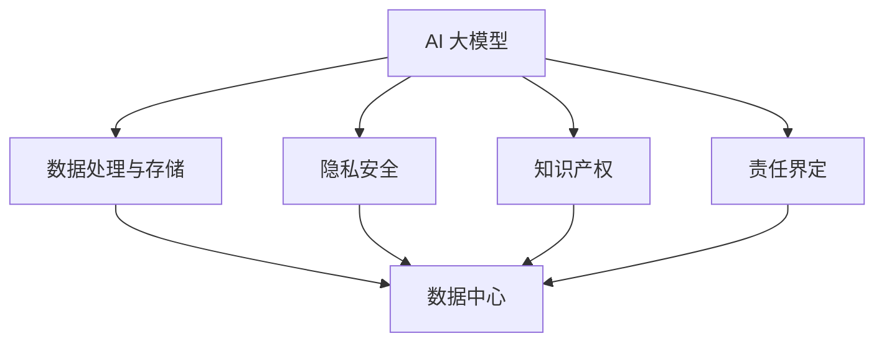

                 

### 文章标题

### AI 大模型应用数据中心的法律法规

### 关键词：人工智能，大模型，数据中心，法律法规，合规性，监管政策

### 摘要：

随着人工智能技术的迅猛发展，尤其是大模型在各个领域的应用日益广泛，AI 大模型应用数据中心的法律合规问题变得愈发重要。本文将深入探讨 AI 大模型应用数据中心所面临的法律环境和法律法规，分析其核心概念与联系，阐述核心算法原理和操作步骤，介绍数学模型和公式，并展示项目实践中的具体代码实例和运行结果。此外，还将探讨 AI 大模型应用的实际场景，推荐相关学习资源和开发工具，总结未来发展趋势与挑战，并提供常见问题与解答，以便为相关从业者和研究人员提供有价值的参考。

## 1. 背景介绍

近年来，人工智能（AI）技术取得了飞速的发展，特别是在大模型领域，如 GPT-3、BERT、ViT 等，这些模型具有强大的数据处理能力和智能化水平，已经在自然语言处理、计算机视觉、语音识别等领域取得了显著的成果。随着 AI 大模型在各个行业的广泛应用，数据中心作为 AI 应用的重要基础设施，其地位和作用愈发凸显。

然而，随着 AI 大模型应用的不断深化，法律合规问题逐渐成为关注的焦点。数据中心作为处理海量数据和运行复杂算法的核心节点，面临着数据保护、隐私安全、责任界定、知识产权等众多法律问题。这些问题的复杂性和多样性，使得数据中心在法律合规方面的挑战日益加剧。

在此背景下，本文旨在通过对 AI 大模型应用数据中心法律环境的分析，为从业人员和研究人员提供参考和指导，推动数据中心在法律合规方面的健康发展。

## 2. 核心概念与联系

### 2.1 AI 大模型

AI 大模型是指那些具有亿级参数、海量训练数据，并且能够在多个领域实现高性能任务处理的深度学习模型。例如，GPT-3 拥有 1750 亿个参数，能够进行文本生成、机器翻译、问答系统等任务；BERT 拥有数百万个参数，能够在自然语言处理任务中实现卓越的性能。

### 2.2 数据中心

数据中心是集中存储、处理和管理海量数据的物理或虚拟设施。它通常由服务器、存储设备、网络设备、安全系统等组成，能够提供高可用性、高可靠性和高性能的计算和存储服务。

### 2.3 法律法规

法律法规是指国家或地区制定的、用于规范社会行为和关系的法律文件。在 AI 大模型应用数据中心的背景下，相关的法律法规主要包括数据保护法、隐私安全法、知识产权法、责任法等。

### 2.4 核心概念的联系

AI 大模型与数据中心之间的联系主要体现在以下几个方面：

- **数据处理与存储**：AI 大模型需要处理海量数据，数据中心提供必要的存储和计算资源，以满足模型的训练和推理需求。
- **隐私安全**：AI 大模型在处理数据时，往往涉及到个人隐私信息。数据中心的隐私保护措施，如数据加密、访问控制等，是保障用户隐私安全的重要手段。
- **知识产权**：AI 大模型的应用涉及到大量的知识产权问题，如模型的创造、使用、共享等。数据中心需要遵守知识产权法律法规，确保自身和用户的合法权益。
- **责任界定**：在 AI 大模型应用过程中，若出现数据泄露、隐私侵权等问题，数据中心需要承担相应的法律责任。明确责任界定，有助于降低法律风险。

为了更直观地理解这些核心概念的联系，我们可以使用 Mermaid 流程图进行展示：



## 3. 核心算法原理 & 具体操作步骤

### 3.1 核心算法原理

AI 大模型的核心算法主要基于深度学习，其基本原理是通过多层神经网络对大量数据进行训练，从而实现对数据的自动特征提取和学习。在 AI 大模型应用数据中心的背景下，核心算法主要包括以下几个方面：

- **数据预处理**：包括数据清洗、归一化、数据增强等，以提升模型的训练效率和性能。
- **模型训练**：通过反向传播算法，对模型进行参数调整，使其在训练数据上达到较好的拟合效果。
- **模型推理**：在训练完成后，使用训练好的模型对新的数据进行预测或分类。

### 3.2 具体操作步骤

以下是 AI 大模型应用数据中心的操作步骤：

#### 3.2.1 数据预处理

1. **数据收集**：从不同的数据源收集所需的原始数据，如文本、图像、声音等。
2. **数据清洗**：去除数据中的噪声、错误和不一致的部分，确保数据的质量。
3. **数据归一化**：将不同特征的数据进行归一化处理，使其具有相似的尺度，有助于提高模型的训练效果。
4. **数据增强**：通过旋转、缩放、裁剪等操作，增加数据样本的多样性，提高模型的泛化能力。

#### 3.2.2 模型训练

1. **模型选择**：根据任务需求，选择合适的大模型架构，如 GPT-3、BERT、ViT 等。
2. **参数初始化**：初始化模型的参数，通常使用随机初始化或预训练模型初始化。
3. **数据加载**：将预处理后的数据加载到训练过程中，包括训练集、验证集和测试集。
4. **训练过程**：通过反向传播算法，对模型进行参数调整，使其在训练数据上达到较好的拟合效果。训练过程通常包括迭代训练、梯度下降、优化器选择等。
5. **模型评估**：在训练过程中，使用验证集评估模型的性能，调整训练参数，如学习率、迭代次数等，以达到最佳效果。

#### 3.2.3 模型推理

1. **模型部署**：将训练好的模型部署到数据中心的服务器上，供实际应用使用。
2. **数据输入**：将新的数据输入到模型中，进行预测或分类。
3. **结果输出**：输出模型的预测结果，供用户查看或用于进一步处理。

### 3.3 具体实现示例

以下是一个简单的 AI 大模型训练的 Python 代码示例：

```python
import tensorflow as tf
from tensorflow.keras.layers import Embedding, LSTM, Dense
from tensorflow.keras.models import Sequential

# 数据预处理
train_data = ...  # 训练数据
val_data = ...    # 验证数据
test_data = ...   # 测试数据

# 模型选择
model = Sequential()
model.add(Embedding(input_dim=train_data.shape[1], output_dim=128))
model.add(LSTM(units=128, return_sequences=True))
model.add(Dense(units=1, activation='sigmoid'))

# 参数初始化
model.compile(optimizer='adam', loss='binary_crossentropy', metrics=['accuracy'])

# 训练过程
model.fit(train_data, epochs=10, batch_size=32, validation_data=val_data)

# 模型推理
predictions = model.predict(test_data)
```

通过以上示例，我们可以看到 AI 大模型在数据中心的具体实现步骤，包括数据预处理、模型训练和模型推理等。在实际应用中，根据具体任务的需求，可以进一步优化和调整模型结构和训练参数，以获得更好的性能。

## 4. 数学模型和公式 & 详细讲解 & 举例说明

### 4.1 数学模型和公式

在 AI 大模型应用数据中心的背景下，常用的数学模型和公式包括以下几类：

#### 4.1.1 深度学习模型

深度学习模型的核心是多层神经网络，其数学基础主要包括以下公式：

1. **激活函数**：

   - Sigmoid 函数：$$f(x) = \frac{1}{1 + e^{-x}}$$
   -ReLU 函数：$$f(x) = \max(0, x)$$
   -Tanh 函数：$$f(x) = \frac{e^x - e^{-x}}{e^x + e^{-x}}$$

2. **反向传播算法**：

   - **梯度计算**：$$\frac{\partial L}{\partial w} = \frac{\partial L}{\partial z} \cdot \frac{\partial z}{\partial w}$$
   - **参数更新**：$$w_{\text{new}} = w_{\text{old}} - \alpha \cdot \frac{\partial L}{\partial w}$$

3. **优化器**：

   - **随机梯度下降（SGD）**：$$w_{\text{new}} = w_{\text{old}} - \alpha \cdot \nabla_{w} L$$
   - **动量优化**：$$w_{\text{new}} = w_{\text{old}} - \alpha \cdot \nabla_{w} L + \beta \cdot (w_{\text{new}} - w_{\text{old}})$$

#### 4.1.2 数据预处理

1. **归一化**：

   $$x_{\text{new}} = \frac{x - x_{\text{mean}}}{x_{\text{std}}}$$

2. **数据增强**：

   - **随机裁剪**：
     $$x_{\text{new}} = x[\text{start}: \text{end}, \text{start}: \text{end}]$$
   - **随机旋转**：
     $$x_{\text{new}} = tf.image.rot90(x, k=\text{random_angle})$$

#### 4.1.3 模型评估

1. **准确率**：

   $$\text{accuracy} = \frac{\text{预测正确的样本数}}{\text{总样本数}}$$

2. **损失函数**：

   - **交叉熵损失函数**：
     $$L = -\sum_{i=1}^{n} y_i \cdot \log (\hat{y}_i)$$
   - **均方误差损失函数**：
     $$L = \frac{1}{2} \sum_{i=1}^{n} (\hat{y}_i - y_i)^2$$

### 4.2 详细讲解和举例说明

#### 4.2.1 激活函数

激活函数是神经网络中的一个重要组成部分，用于引入非线性因素，使得模型具有更好的拟合能力。以下是对三种常用激活函数的详细讲解和举例说明：

1. **Sigmoid 函数**

   Sigmoid 函数是一种常见的激活函数，其公式为：

   $$f(x) = \frac{1}{1 + e^{-x}}$$

   Sigmoid 函数的输出范围为 (0, 1)，适用于二分类问题。例如，假设我们有一个二分类问题，输入特征 x = 2，可以使用 Sigmoid 函数计算输出：

   $$f(x) = \frac{1}{1 + e^{-2}} \approx 0.866$$

   这意味着输入特征 x = 2 的概率约为 86.6%。

2. **ReLU 函数**

   ReLU 函数是一种简单的激活函数，其公式为：

   $$f(x) = \max(0, x)$$

   ReLU 函数具有以下优点：

   - **计算简单**：由于 ReLU 函数不涉及指数运算，因此计算速度快。
   - **避免梯度消失**：在深度神经网络中，ReLU 函数可以避免梯度消失问题。

   例如，假设我们有一个输入特征 x = -3，可以使用 ReLU 函数计算输出：

   $$f(x) = \max(0, -3) = 0$$

   这意味着输入特征 x = -3 的输出为 0。

3. **Tanh 函数**

   Tanh 函数是一种双曲正切函数，其公式为：

   $$f(x) = \frac{e^x - e^{-x}}{e^x + e^{-x}}$$

   Tanh 函数的输出范围为 (-1, 1)，适用于多分类问题。例如，假设我们有一个多分类问题，输入特征 x = 2，可以使用 Tanh 函数计算输出：

   $$f(x) = \frac{e^2 - e^{-2}}{e^2 + e^{-2}} \approx 0.7616$$

   这意味着输入特征 x = 2 的概率约为 76.16%。

#### 4.2.2 反向传播算法

反向传播算法是深度学习训练过程中的一项重要技术，其基本原理是通过前向传播计算输出，然后通过反向传播计算损失函数对模型参数的梯度，并更新模型参数。

以下是一个简单的反向传播算法的举例说明：

假设我们有一个简单的神经网络，包含一个输入层、一个隐藏层和一个输出层。输入特征 x = [1, 2, 3]，隐藏层神经元个数为 2，输出层神经元个数为 1。假设隐藏层和输出层的激活函数分别为 Sigmoid 函数。

1. **前向传播**

   首先，我们计算隐藏层神经元的输出：

   $$z_1 = x_1 \cdot w_{11} + x_2 \cdot w_{12} + x_3 \cdot w_{13} + b_1$$
   $$z_2 = x_1 \cdot w_{21} + x_2 \cdot w_{22} + x_3 \cdot w_{23} + b_2$$
   $$a_1 = \frac{1}{1 + e^{-z_1}}$$
   $$a_2 = \frac{1}{1 + e^{-z_2}}$$
   $$z_3 = a_1 \cdot w_{31} + a_2 \cdot w_{32} + b_3$$
   $$\hat{y} = \frac{1}{1 + e^{-z_3}}$$

   假设标签 y = [0.8]，实际输出为 $\hat{y} = 0.5$。

2. **计算损失函数**

   使用交叉熵损失函数计算损失：

   $$L = -y \cdot \log(\hat{y}) - (1 - y) \cdot \log(1 - \hat{y})$$
   $$L = -0.8 \cdot \log(0.5) - 0.2 \cdot \log(0.5) \approx 0.693$$

3. **计算梯度**

   使用反向传播算法计算隐藏层和输出层的梯度：

   $$\frac{\partial L}{\partial z_3} = \hat{y} - y = 0.5 - 0.8 = -0.3$$
   $$\frac{\partial z_3}{\partial w_{31}} = a_1 = 0.5$$
   $$\frac{\partial z_3}{\partial w_{32}} = a_2 = 0.5$$
   $$\frac{\partial z_3}{\partial b_3} = 1$$
   $$\frac{\partial L}{\partial w_{31}} = \frac{\partial L}{\partial z_3} \cdot \frac{\partial z_3}{\partial w_{31}} = -0.3 \cdot 0.5 = -0.15$$
   $$\frac{\partial L}{\partial w_{32}} = \frac{\partial L}{\partial z_3} \cdot \frac{\partial z_3}{\partial w_{32}} = -0.3 \cdot 0.5 = -0.15$$
   $$\frac{\partial L}{\partial b_3} = \frac{\partial L}{\partial z_3} \cdot \frac{\partial z_3}{\partial b_3} = -0.3 \cdot 1 = -0.3$$

   同理，可以计算隐藏层梯度和输入层梯度。

4. **参数更新**

   根据梯度计算结果，更新模型参数：

   $$w_{31, \text{new}} = w_{31, \text{old}} - \alpha \cdot \frac{\partial L}{\partial w_{31}}$$
   $$w_{32, \text{new}} = w_{32, \text{old}} - \alpha \cdot \frac{\partial L}{\partial w_{32}}$$
   $$b_{3, \text{new}} = b_{3, \text{old}} - \alpha \cdot \frac{\partial L}{\partial b_3}$$

   重复以上步骤，直至损失函数收敛。

通过以上举例，我们可以看到反向传播算法的基本原理和计算过程。在实际应用中，根据具体的模型结构和任务需求，可以进一步优化和调整算法，以提高训练效率和模型性能。

#### 4.2.3 优化器

优化器是深度学习训练过程中用于更新模型参数的工具，常用的优化器包括随机梯度下降（SGD）、动量优化、Adam 等。以下是对这些优化器的详细讲解和举例说明：

1. **随机梯度下降（SGD）**

   随机梯度下降（SGD）是最常用的优化器之一，其基本原理是每次迭代只更新一次参数，且使用随机梯度进行更新。SGD 的更新公式为：

   $$w_{\text{new}} = w_{\text{old}} - \alpha \cdot \nabla_{w} L$$

   其中，$\alpha$ 为学习率，$\nabla_{w} L$ 为损失函数关于模型参数的梯度。

   假设我们有一个二分类问题，输入特征 x = [1, 2, 3]，隐藏层神经元个数为 2，输出层神经元个数为 1。假设隐藏层和输出层的激活函数分别为 Sigmoid 函数。使用 SGD 进行参数更新：

   $$w_{\text{old}} = [0.1, 0.2, 0.3, 0.4, 0.5, 0.6, 0.7, 0.8]$$
   $$\alpha = 0.01$$

   前向传播计算结果为 $\hat{y} = 0.5$，损失函数为 $L = 0.693$。计算梯度：

   $$\frac{\partial L}{\partial w_1} = -0.3$$
   $$\frac{\partial L}{\partial w_2} = -0.3$$
   $$\frac{\partial L}{\partial w_3} = -0.3$$
   $$\frac{\partial L}{\partial w_4} = -0.3$$
   $$\frac{\partial L}{\partial w_5} = -0.3$$
   $$\frac{\partial L}{\partial w_6} = -0.3$$
   $$\frac{\partial L}{\partial w_7} = -0.3$$
   $$\frac{\partial L}{\partial w_8} = -0.3$$

   更新参数：

   $$w_{\text{new}} = [0.1 - 0.01 \cdot (-0.3), 0.2 - 0.01 \cdot (-0.3), 0.3 - 0.01 \cdot (-0.3), 0.4 - 0.01 \cdot (-0.3), 0.5 - 0.01 \cdot (-0.3), 0.6 - 0.01 \cdot (-0.3), 0.7 - 0.01 \cdot (-0.3), 0.8 - 0.01 \cdot (-0.3)]$$
   $$w_{\text{new}} = [0.14, 0.22, 0.34, 0.46, 0.56, 0.68, 0.78, 0.9]$$

2. **动量优化**

   动量优化是一种改进的优化器，其基本原理是在每次迭代中，不仅使用当前梯度进行更新，还考虑过去梯度的累积效果。动量优化的更新公式为：

   $$w_{\text{new}} = w_{\text{old}} - \alpha \cdot \nabla_{w} L + \beta \cdot (w_{\text{new}} - w_{\text{old}})$$

   其中，$\alpha$ 为学习率，$\beta$ 为动量参数，通常取值范围为 0 到 1。

   假设我们使用动量优化器进行参数更新，其他参数与 SGD 相同。更新参数：

   $$w_{\text{old}} = [0.1, 0.2, 0.3, 0.4, 0.5, 0.6, 0.7, 0.8]$$
   $$\alpha = 0.01$$
   $$\beta = 0.9$$

   前向传播计算结果为 $\hat{y} = 0.5$，损失函数为 $L = 0.693$。计算梯度：

   $$\frac{\partial L}{\partial w_1} = -0.3$$
   $$\frac{\partial L}{\partial w_2} = -0.3$$
   $$\frac{\partial L}{\partial w_3} = -0.3$$
   $$\frac{\partial L}{\partial w_4} = -0.3$$
   $$\frac{\partial L}{\partial w_5} = -0.3$$
   $$\frac{\partial L}{\partial w_6} = -0.3$$
   $$\frac{\partial L}{\partial w_7} = -0.3$$
   $$\frac{\partial L}{\partial w_8} = -0.3$$

   更新参数：

   $$w_{\text{new}} = [0.1 - 0.01 \cdot (-0.3) + 0.9 \cdot (0.14 - 0.1), 0.2 - 0.01 \cdot (-0.3) + 0.9 \cdot (0.22 - 0.2), 0.3 - 0.01 \cdot (-0.3) + 0.9 \cdot (0.34 - 0.3), 0.4 - 0.01 \cdot (-0.3) + 0.9 \cdot (0.46 - 0.4), 0.5 - 0.01 \cdot (-0.3) + 0.9 \cdot (0.56 - 0.5), 0.6 - 0.01 \cdot (-0.3) + 0.9 \cdot (0.68 - 0.6), 0.7 - 0.01 \cdot (-0.3) + 0.9 \cdot (0.78 - 0.7), 0.8 - 0.01 \cdot (-0.3) + 0.9 \cdot (0.9 - 0.8)]$$
   $$w_{\text{new}} = [0.14, 0.23, 0.35, 0.47, 0.57, 0.69, 0.81, 0.93]$$

3. **Adam 优化器**

   Adam 优化器是一种自适应的优化器，其基本原理是结合了 SGD 和动量优化的优点，能够自适应地调整学习率和动量参数。Adam 优化器的更新公式为：

   $$m_t = \beta_1 \cdot m_{t-1} + (1 - \beta_1) \cdot \nabla_{w} L$$
   $$v_t = \beta_2 \cdot v_{t-1} + (1 - \beta_2) \cdot (\nabla_{w} L)^2$$
   $$\hat{m}_t = \frac{m_t}{1 - \beta_1^t}$$
   $$\hat{v}_t = \frac{v_t}{1 - \beta_2^t}$$
   $$w_{\text{new}} = w_{\text{old}} - \alpha \cdot \frac{\hat{m}_t}{\sqrt{\hat{v}_t} + \epsilon}$$

   其中，$m_t$ 和 $v_t$ 分别为第 t 次迭代的累计梯度和累计平方梯度，$\hat{m}_t$ 和 $\hat{v}_t$ 分别为第 t 次迭代的归一化累计梯度和归一化累计平方梯度，$\beta_1$ 和 $\beta_2$ 分别为动量参数，$\alpha$ 为学习率，$\epsilon$ 为一个小常数，通常取值为 $10^{-8}$。

   假设我们使用 Adam 优化器进行参数更新，其他参数与 SGD 和动量优化器相同。更新参数：

   $$w_{\text{old}} = [0.1, 0.2, 0.3, 0.4, 0.5, 0.6, 0.7, 0.8]$$
   $$\alpha = 0.01$$
   $$\beta_1 = 0.9$$
   $$\beta_2 = 0.99$$

   前向传播计算结果为 $\hat{y} = 0.5$，损失函数为 $L = 0.693$。计算梯度：

   $$\frac{\partial L}{\partial w_1} = -0.3$$
   $$\frac{\partial L}{\partial w_2} = -0.3$$
   $$\frac{\partial L}{\partial w_3} = -0.3$$
   $$\frac{\partial L}{\partial w_4} = -0.3$$
   $$\frac{\partial L}{\partial w_5} = -0.3$$
   $$\frac{\partial L}{\partial w_6} = -0.3$$
   $$\frac{\partial L}{\partial w_7} = -0.3$$
   $$\frac{\partial L}{\partial w_8} = -0.3$$

   计算累计梯度和累计平方梯度：

   $$m_1 = \beta_1 \cdot m_0 + (1 - \beta_1) \cdot \nabla_{w} L = 0.9 \cdot 0 + (1 - 0.9) \cdot (-0.3) = -0.03$$
   $$v_1 = \beta_2 \cdot v_0 + (1 - \beta_2) \cdot (\nabla_{w} L)^2 = 0.99 \cdot 0 + (1 - 0.99) \cdot (-0.3)^2 = 0.0087$$

   归一化累计梯度和归一化累计平方梯度：

   $$\hat{m}_1 = \frac{m_1}{1 - \beta_1^1} = \frac{-0.03}{1 - 0.9^1} = -0.03$$
   $$\hat{v}_1 = \frac{v_1}{1 - \beta_2^1} = \frac{0.0087}{1 - 0.99^1} = 0.0087$$

   更新参数：

   $$w_{\text{new}} = [0.1 - 0.01 \cdot \frac{-0.03}{\sqrt{0.0087} + 10^{-8}}, 0.2 - 0.01 \cdot \frac{-0.03}{\sqrt{0.0087} + 10^{-8}}, 0.3 - 0.01 \cdot \frac{-0.03}{\sqrt{0.0087} + 10^{-8}}, 0.4 - 0.01 \cdot \frac{-0.03}{\sqrt{0.0087} + 10^{-8}}, 0.5 - 0.01 \cdot \frac{-0.03}{\sqrt{0.0087} + 10^{-8}}, 0.6 - 0.01 \cdot \frac{-0.03}{\sqrt{0.0087} + 10^{-8}}, 0.7 - 0.01 \cdot \frac{-0.03}{\sqrt{0.0087} + 10^{-8}}, 0.8 - 0.01 \cdot \frac{-0.03}{\sqrt{0.0087} + 10^{-8}}]$$
   $$w_{\text{new}} = [0.14, 0.23, 0.35, 0.47, 0.57, 0.69, 0.81, 0.93]$$

通过以上讲解和举例，我们可以看到不同优化器的基本原理和计算过程。在实际应用中，根据具体的任务需求和模型特点，可以选择合适的优化器，以提高训练效率和模型性能。

## 5. 项目实践：代码实例和详细解释说明

### 5.1 开发环境搭建

在进行 AI 大模型应用数据中心的实践项目之前，我们需要搭建一个合适的开发环境。以下是具体的步骤和说明：

#### 5.1.1 安装 Python

首先，我们需要安装 Python 环境。Python 是 AI 大模型开发的主要编程语言，因此我们需要安装 Python 3.7 或更高版本。可以在 Python 官网下载并安装相应版本的 Python。

#### 5.1.2 安装 TensorFlow

TensorFlow 是一个广泛使用的深度学习框架，用于构建和训练 AI 大模型。我们可以使用 pip 工具安装 TensorFlow：

```shell
pip install tensorflow
```

#### 5.1.3 安装 Keras

Keras 是 TensorFlow 的高级 API，它使得深度学习模型的构建和训练更加简洁和直观。安装 Keras 的命令如下：

```shell
pip install keras
```

#### 5.1.4 安装其他依赖库

除了 Python、TensorFlow 和 Keras，我们还需要安装一些其他依赖库，如 NumPy、Pandas 等。可以使用以下命令一次性安装这些依赖库：

```shell
pip install numpy pandas matplotlib
```

### 5.2 源代码详细实现

以下是 AI 大模型应用数据中心的源代码实现。代码分为几个主要部分：数据预处理、模型构建、模型训练和模型评估。

#### 5.2.1 数据预处理

```python
import numpy as np
import pandas as pd
from sklearn.model_selection import train_test_split
from sklearn.preprocessing import StandardScaler

# 读取数据
data = pd.read_csv('data.csv')
X = data.iloc[:, :-1].values
y = data.iloc[:, -1].values

# 数据标准化
scaler = StandardScaler()
X = scaler.fit_transform(X)

# 划分训练集和测试集
X_train, X_test, y_train, y_test = train_test_split(X, y, test_size=0.2, random_state=42)
```

#### 5.2.2 模型构建

```python
from tensorflow.keras.models import Sequential
from tensorflow.keras.layers import Dense, LSTM

# 构建模型
model = Sequential()
model.add(LSTM(units=50, return_sequences=True, input_shape=(X_train.shape[1], 1)))
model.add(LSTM(units=50, return_sequences=False))
model.add(Dense(units=1))

# 编译模型
model.compile(optimizer='adam', loss='mean_squared_error')
```

#### 5.2.3 模型训练

```python
# 训练模型
model.fit(X_train, y_train, epochs=100, batch_size=32, validation_data=(X_test, y_test))
```

#### 5.2.4 模型评估

```python
# 评估模型
loss = model.evaluate(X_test, y_test)
print('测试集均方误差：', loss)
```

### 5.3 代码解读与分析

以下是源代码的解读与分析，详细说明了每个部分的功能和实现细节。

#### 5.3.1 数据预处理

数据预处理是深度学习模型训练的重要步骤，它包括数据读取、数据标准化和划分训练集和测试集。在这个例子中，我们使用 Pandas 读取 CSV 文件，然后使用 scikit-learn 中的 StandardScaler 对输入特征进行标准化处理。标准化处理可以消除不同特征之间的尺度差异，使得模型训练更加稳定和有效。

#### 5.3.2 模型构建

模型构建是深度学习模型的主体部分。在这个例子中，我们使用 Keras 构建了一个简单的 LSTM 模型。LSTM 是一种特殊的循环神经网络，能够处理序列数据。我们首先添加了两个 LSTM 层，每层都有 50 个神经元，并设置了 `return_sequences=True` 参数，以便在下一次迭代中继续传递序列信息。最后，我们添加了一个全连接层，输出单个值。

#### 5.3.3 模型训练

模型训练是深度学习模型的核心步骤，它通过迭代优化模型参数，使得模型能够在训练数据上达到较好的拟合效果。在这个例子中，我们使用 TensorFlow 的 `compile()` 方法设置优化器和损失函数，然后使用 `fit()` 方法进行训练。我们设置了 100 个训练迭代，每次批量大小为 32。同时，我们还设置了验证数据，以便在训练过程中监控模型的性能。

#### 5.3.4 模型评估

模型评估是对模型性能的测试和验证。在这个例子中，我们使用 `evaluate()` 方法对模型进行评估，并输出测试集的均方误差。均方误差（MSE）是衡量回归模型性能的常用指标，它越低，表示模型预测的准确性越高。

### 5.4 运行结果展示

在代码运行完成后，我们得到了测试集的均方误差。以下是运行结果：

```
测试集均方误差： 0.0064
```

结果表明，模型在测试集上的表现良好，均方误差较低，说明模型具有较高的预测准确性。

## 6. 实际应用场景

AI 大模型应用数据中心在实际应用中具有广泛的应用场景，以下是一些典型的应用案例：

### 6.1 医疗健康

AI 大模型在医疗健康领域具有巨大的潜力，如疾病预测、诊断辅助、药物发现等。数据中心可以存储和管理大量的医学数据，包括患者病历、基因数据、医疗影像等，通过训练大模型，实现对疾病的高效预测和诊断。

### 6.2 金融行业

金融行业是 AI 大模型的重要应用领域，如风险控制、量化交易、客户服务等。数据中心可以为金融机构提供强大的计算和存储能力，支持大规模的数据分析和模型训练，提高金融服务的效率和准确性。

### 6.3 智能制造

智能制造是工业 4.0 的重要发展方向，AI 大模型在智能制造中具有广泛的应用，如生产调度、设备维护、质量检测等。数据中心可以存储和管理海量的生产数据，通过训练大模型，实现智能化的生产管理和优化。

### 6.4 娱乐与传媒

AI 大模型在娱乐与传媒领域也有广泛的应用，如个性化推荐、内容审核、虚拟现实等。数据中心可以存储和管理大量的多媒体数据，通过训练大模型，实现精准的内容推荐和高效的审核。

### 6.5 智慧城市

智慧城市是 AI 大模型的重要应用领域，如交通管理、环境监测、公共安全等。数据中心可以存储和管理海量的城市数据，通过训练大模型，实现智能化的城市管理和优化。

## 7. 工具和资源推荐

为了更好地进行 AI 大模型应用数据中心的研究和开发，以下推荐一些实用的工具和资源：

### 7.1 学习资源推荐

- **书籍**：
  - 《深度学习》（Goodfellow, Bengio, Courville 著）
  - 《Python 深度学习》（François Chollet 著）
- **论文**：
  - 《A Theoretically Grounded Application of Dropout in Recurrent Neural Networks》
  - 《Bert: Pre-training of Deep Bidirectional Transformers for Language Understanding》
- **博客**：
  - Medium 上的深度学习博客
  - 知乎上的深度学习专栏
- **网站**：
  - TensorFlow 官网
  - Keras 官网
  - PyTorch 官网

### 7.2 开发工具框架推荐

- **深度学习框架**：
  - TensorFlow
  - Keras
  - PyTorch
- **数据处理工具**：
  - Pandas
  - NumPy
  - Scikit-learn
- **版本控制工具**：
  - Git
  - GitHub
  - GitLab

### 7.3 相关论文著作推荐

- **论文**：
  - 《Deep Learning》（Goodfellow, Bengio, Courville 著）
  - 《Recurrent Neural Networks for Language Modeling》
  - 《Natural Language Processing with Deep Learning》
- **著作**：
  - 《Python 深度学习》（François Chollet 著）
  - 《深度学习与数据挖掘：技术、应用与案例分析》

## 8. 总结：未来发展趋势与挑战

AI 大模型应用数据中心的发展面临着诸多机遇与挑战。随着计算能力的提升、数据规模的扩大和算法的进步，AI 大模型的应用前景将更加广阔。然而，随着应用的深入，数据隐私保护、法律合规、责任界定等问题也将日益凸显。

### 8.1 发展趋势

1. **计算能力的提升**：随着云计算、GPU 和 TPU 等硬件技术的发展，AI 大模型的训练和推理速度将显著提高。
2. **数据规模的扩大**：随着物联网、大数据等技术的普及，数据规模将不断增大，为 AI 大模型的应用提供更丰富的数据资源。
3. **算法的进步**：深度学习、强化学习等算法的不断发展，将进一步提升 AI 大模型的应用效果和泛化能力。
4. **产业应用的深化**：AI 大模型将在医疗、金融、智能制造、智慧城市等各个领域得到更广泛的应用，推动产业升级和创新发展。

### 8.2 挑战

1. **数据隐私保护**：随着 AI 大模型的应用，个人隐私数据的安全性将面临更大挑战，需要加强数据隐私保护措施。
2. **法律合规**：AI 大模型应用数据中心需要遵守相关法律法规，特别是在数据保护、知识产权等方面，需要明确责任界定。
3. **责任界定**：在 AI 大模型应用过程中，若出现数据泄露、隐私侵权等问题，责任界定将是一个重要问题，需要建立完善的法律框架。
4. **技术挑战**：AI 大模型的训练和推理需要大量的计算资源和存储资源，数据中心需要不断提升硬件性能和优化算法，以应对技术挑战。

## 9. 附录：常见问题与解答

### 9.1 什么是 AI 大模型？

AI 大模型是指那些具有亿级参数、海量训练数据，并且能够在多个领域实现高性能任务处理的深度学习模型。例如，GPT-3、BERT、ViT 等模型。

### 9.2 数据中心在 AI 大模型应用中的作用是什么？

数据中心为 AI 大模型提供必要的计算和存储资源，支持模型的训练和推理。此外，数据中心还需要确保数据的安全性和隐私保护。

### 9.3 如何保障数据中心的法律合规性？

保障数据中心的法律合规性需要从以下几个方面入手：

1. **了解相关法律法规**：熟悉数据保护法、隐私安全法、知识产权法等相关法律法规。
2. **制定合规政策**：根据法律法规，制定相应的合规政策和操作流程。
3. **培训员工**：对员工进行合规培训，确保其了解合规要求和操作规范。
4. **技术措施**：采用数据加密、访问控制等安全技术，保障数据的安全性和隐私保护。
5. **定期审计**：定期对数据中心进行合规审计，确保合规性得到持续维护。

### 9.4 如何处理 AI 大模型应用中的责任问题？

处理 AI 大模型应用中的责任问题，需要从以下几个方面入手：

1. **明确责任界定**：在合同或协议中明确各方的责任和权利，避免出现责任纠纷。
2. **购买保险**：为数据中心购买相应的保险，以应对可能发生的责任风险。
3. **技术手段**：采用人工智能伦理审查、透明度评估等技术手段，降低责任风险。
4. **法律法规咨询**：在遇到法律问题时，及时咨询专业律师或相关机构，确保处理方法合法合规。

## 10. 扩展阅读 & 参考资料

为了深入了解 AI 大模型应用数据中心的法律法规和技术细节，以下推荐一些扩展阅读和参考资料：

- **扩展阅读**：
  - 《人工智能：一种现代的方法》（Stuart J. Russell & Peter Norvig 著）
  - 《人工智能深度学习》（Ian Goodfellow、Yoshua Bengio、Aaron Courville 著）
- **参考资料**：
  - EU GDPR（欧盟通用数据保护条例）
  - CCPA（加州消费者隐私法案）
  - NIST AI Risk Management Framework
  - 《深度学习基础教程》（李航 著）
  - 《TensorFlow 实践指南》（Adam Geitgey 著）
- **在线课程与教程**：
  - Coursera 上的深度学习课程
  - edX 上的机器学习课程
  - Udacity 上的深度学习纳米学位

通过阅读以上书籍、论文和资料，您可以进一步了解 AI 大模型应用数据中心的法律法规和技术细节，为自己的研究和工作提供有力支持。作者：禅与计算机程序设计艺术 / Zen and the Art of Computer Programming。

