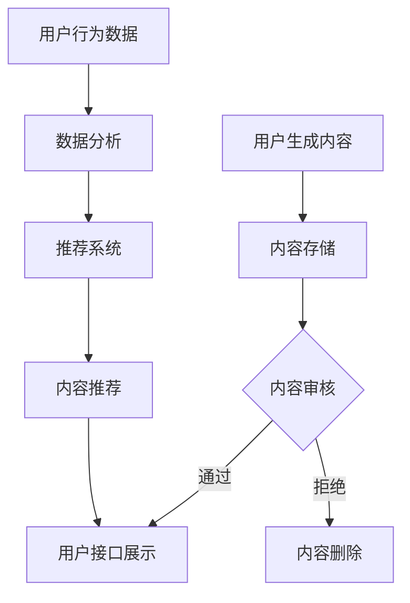

                 

### 1. 背景介绍

随着人工智能技术的飞速发展，大模型（也称为大型预训练模型）已经成为各个行业的热门应用。大模型是指使用海量数据进行训练，拥有数亿甚至千亿个参数的神经网络模型。这些模型在各种任务中表现出色，如自然语言处理、计算机视觉、语音识别等。

社交媒体平台，作为当今社会信息传播的主要渠道，对于大模型的应用需求日益增长。从用户生成内容、广告投放、推荐系统到数据分析和用户行为预测，社交媒体平台在各个环节中都离不开大模型的帮助。然而，大规模模型在社交媒体上的应用也带来了一系列挑战，如数据隐私、计算资源消耗、数据多样性等。

本文旨在探讨大模型在社交媒体平台上的应用，包括其核心概念、算法原理、数学模型、项目实践以及实际应用场景。我们将从以下几个方面进行阐述：

1. **核心概念与联系**：介绍大模型的核心概念及其在社交媒体中的应用。
2. **核心算法原理 & 具体操作步骤**：详细讲解大模型的算法原理和操作步骤。
3. **数学模型和公式 & 详细讲解 & 举例说明**：阐述大模型的数学模型，并通过实例进行说明。
4. **项目实践：代码实例和详细解释说明**：提供一个完整的代码实例，并进行详细解读。
5. **实际应用场景**：分析大模型在社交媒体中的实际应用。
6. **工具和资源推荐**：推荐学习资源和开发工具。
7. **总结：未来发展趋势与挑战**：总结大模型在社交媒体上的发展趋势和面临的挑战。

通过以上内容的逐步分析，我们将深入理解大模型在社交媒体中的应用，为后续研究和开发提供参考。

#### 1.1 大模型的兴起

大模型的兴起可以追溯到深度学习的快速发展。深度学习是一种基于神经网络的学习方法，通过多层神经网络对数据进行自动特征提取和模式识别。随着计算能力和数据量的提升，深度学习在各个领域取得了显著的成果。然而，传统的神经网络模型在处理大规模数据时，往往面临着参数量庞大、训练时间长、模型复杂度高等问题。

大模型的提出，解决了这些问题。大模型通过使用海量数据进行训练，拥有数亿甚至千亿个参数，可以有效地提高模型的性能和泛化能力。这些模型不仅在图像识别、语音识别等计算机视觉和语音处理领域取得了突破性进展，还在自然语言处理、推荐系统等复杂任务中表现出色。

大模型的兴起不仅改变了传统的人工智能应用模式，还引发了新的研究热点和实际应用场景。例如，在自然语言处理领域，大模型可以用于生成文本、翻译、问答等任务；在计算机视觉领域，大模型可以用于图像分类、目标检测、图像生成等任务；在推荐系统领域，大模型可以用于个性化推荐、广告投放等任务。

总的来说，大模型的兴起为人工智能领域带来了新的发展机遇，也带来了新的挑战。如何有效地利用大模型，解决实际问题，已经成为当前研究的重要方向。

#### 1.2 社交媒体平台的需求

社交媒体平台作为现代社会信息传播的主要渠道，对大模型的应用需求日益增长。以下是社交媒体平台在以下几个方面的应用需求：

1. **用户生成内容**：社交媒体平台的核心功能之一是用户生成内容（UGC），如微博、抖音、Instagram 等。这些平台需要处理大量的用户生成的文本、图像和视频数据。大模型可以用于内容审核、情感分析、主题检测等任务，从而提升用户体验和平台安全。

2. **广告投放**：社交媒体平台通过广告收入为主要盈利模式，广告投放的精准性和效果至关重要。大模型可以用于用户行为分析、兴趣识别、广告投放优化等任务，从而提高广告的投放效果和收益。

3. **推荐系统**：社交媒体平台需要为用户提供个性化的内容推荐，如微博的热门话题、抖音的短视频推荐等。大模型可以用于推荐算法的设计和优化，从而提高推荐的准确性和用户体验。

4. **数据分析和用户行为预测**：社交媒体平台积累的海量数据可以用于用户行为分析、市场趋势预测等任务。大模型可以用于构建复杂的预测模型，从而为平台运营提供科学依据。

5. **社交网络分析**：社交媒体平台是一个复杂的社交网络，大模型可以用于社交网络分析、社群挖掘等任务，从而揭示社交网络的结构和规律。

总的来说，社交媒体平台对大模型的应用需求主要集中在提升用户体验、提高广告投放效果、优化推荐系统、分析和预测用户行为等方面。随着社交媒体平台的发展，大模型的应用前景将更加广阔。

### 2. 核心概念与联系

在探讨大模型在社交媒体平台的应用之前，我们需要了解几个核心概念，这些概念包括大模型的定义、社交媒体平台的基本架构，以及大模型与社交媒体平台的联系。

#### 2.1 大模型的定义

大模型（Large Models）通常指的是那些具有数十亿到千亿参数的深度神经网络。这些模型通过大量的数据进行训练，能够自动学习数据的复杂模式和特征。常见的几种大模型包括：

1. **Transformer模型**：Transformer模型是自然语言处理领域的重要突破，其核心是自注意力机制（Self-Attention）。这种模型在大规模的预训练任务中表现出色，例如BERT、GPT和T5等。
2. **卷积神经网络（CNN）**：虽然CNN主要用于计算机视觉任务，但也可以扩展到处理其他类型的数据，如文本和音频。
3. **生成对抗网络（GAN）**：GAN通过两个神经网络（生成器和判别器）的对抗训练，能够生成高质量的图像和文本。

#### 2.2 社交媒体平台的基本架构

社交媒体平台通常由以下几个核心组成部分构成：

1. **用户接口（UI）**：用户与平台交互的界面，包括网页、移动应用等。
2. **后端服务器**：处理用户请求、数据存储和检索等任务。
3. **数据库**：存储用户数据、内容数据和其他相关数据。
4. **数据管道**：用于数据收集、处理、传输和存储的管道系统。
5. **推荐系统**：根据用户行为和偏好，为用户推荐内容。

#### 2.3 大模型与社交媒体平台的联系

大模型在社交媒体平台中的应用主要体现在以下几个方面：

1. **内容审核与过滤**：使用大模型进行内容审核，可以有效识别和过滤不良信息，保障平台安全。
2. **情感分析与情绪识别**：通过分析用户生成内容的情感和情绪，可以更好地理解用户需求，优化用户体验。
3. **个性化推荐**：大模型可以帮助推荐系统更精准地预测用户兴趣，提高推荐效果。
4. **广告投放优化**：大模型可以分析用户行为数据，为广告投放提供更准确的决策支持。
5. **社交网络分析**：大模型可以用于分析社交网络结构，挖掘潜在社群和关键节点。

#### 2.4 Mermaid 流程图

为了更直观地展示大模型在社交媒体平台中的应用，我们可以使用Mermaid流程图来描述其核心流程和组件。以下是使用Mermaid绘制的流程图：



在这个流程图中，用户生成内容首先存储到数据库中，然后通过内容审核环节，审核通过的内容会在用户接口展示给用户，而审核不通过的内容则会被删除。同时，用户的行为数据会被收集并进行分析，用于优化推荐系统，从而提升用户体验。

通过上述内容，我们对大模型在社交媒体平台中的应用有了初步的认识。接下来，我们将深入探讨大模型的核心算法原理和具体操作步骤。

#### 2.5 大模型的核心算法原理

大模型之所以能够在各种任务中表现出色，主要依赖于其核心算法原理。以下我们将介绍几种主要的大模型算法原理，包括Transformer模型、卷积神经网络（CNN）和生成对抗网络（GAN）。

##### 2.5.1 Transformer模型

Transformer模型是自然语言处理领域的重要突破，其核心思想是自注意力机制（Self-Attention）。自注意力机制允许模型在处理序列数据时，关注序列中不同位置的信息，从而提高模型的上下文理解能力。

**自注意力机制（Self-Attention）**：

自注意力机制的基本思想是将每个输入序列的每个词映射到一个查询向量、一个键向量和一个值向量。在处理序列时，每个词会与其余所有词进行计算，得到一个加权和。具体计算过程如下：

1. **计算查询（Query）、键（Key）和值（Value）**：对于序列中的每个词，计算其查询向量 \( Q_i \)，键向量 \( K_i \) 和值向量 \( V_i \)。

   $$ Q_i = W_Q \cdot x_i $$
   $$ K_i = W_K \cdot x_i $$
   $$ V_i = W_V \cdot x_i $$

   其中，\( W_Q \)、\( W_K \) 和 \( W_V \) 是权重矩阵，\( x_i \) 是输入序列中的第 \( i \) 个词。

2. **计算注意力得分（Attention Scores）**：

   $$ \text{Attention Scores} = \text{softmax}(\frac{K_i \cdot Q_i^T}{\sqrt{d_k}}) $$

   其中，\( d_k \) 是键向量的维度，softmax函数用于归一化得分。

3. **计算加权和（Weighted Sum）**：

   $$ \text{Context Vector} = \text{softmax}(\text{Attention Scores}) \cdot V_i $$

**多头注意力（Multi-Head Attention）**：

多头注意力扩展了自注意力机制，通过多个独立的注意力机制来捕获不同的上下文信息。具体实现时，输入序列会通过多个独立的变换矩阵映射到不同的查询、键和值空间，然后分别计算注意力得分和加权和。

**Transformer模型架构**：

Transformer模型通常包含多个编码器（Encoder）和解码器（Decoder）层，每层由多头自注意力机制和前馈神经网络（Feedforward Neural Network）组成。编码器负责处理输入序列，解码器则根据编码器的输出生成输出序列。

##### 2.5.2 卷积神经网络（CNN）

卷积神经网络（Convolutional Neural Network，CNN）最初是为计算机视觉任务设计的，但由于其强大的特征提取能力，也广泛应用于其他类型的数据处理任务。

**卷积层（Convolutional Layer）**：

卷积层是CNN的核心层，通过卷积操作提取图像的局部特征。卷积操作的基本思想是用一个卷积核（Filter）在输入数据上滑动，计算卷积和。具体计算过程如下：

1. **卷积操作**：

   $$ \text{Conv} = \sum_{j=1}^{C} w_{ij}^k * x_{ij} + b_k $$

   其中，\( w_{ij}^k \) 是卷积核权重，\( x_{ij} \) 是输入数据，\( b_k \) 是偏置，\( C \) 是输出特征图的通道数。

2. **激活函数**：

   通常使用ReLU激活函数来增加网络的非线性能力。

**池化层（Pooling Layer）**：

池化层用于降低特征图的维度，增强模型的泛化能力。常见的池化操作包括最大池化（Max Pooling）和平均池化（Average Pooling）。

**全连接层（Fully Connected Layer）**：

在全连接层中，每个神经元都与前一层的所有神经元相连。通过全连接层，模型可以整合和分类提取到的特征。

##### 2.5.3 生成对抗网络（GAN）

生成对抗网络（Generative Adversarial Network，GAN）由生成器（Generator）和判别器（Discriminator）两部分组成，两部分相互竞争，共同提升生成质量。

**生成器（Generator）**：

生成器的目标是生成与真实数据相似的数据。生成器通常是一个深度神经网络，输入随机噪声，输出假数据。生成器的损失函数通常是生成数据的概率接近于1。

**判别器（Discriminator）**：

判别器的目标是区分真实数据和生成数据。判别器也是一个深度神经网络，输入真实数据和生成数据，输出一个二分类结果。判别器的损失函数通常是生成数据的概率接近于0。

**对抗训练（Adversarial Training）**：

生成器和判别器通过对抗训练相互提升。生成器通过最小化生成数据的概率，判别器通过最大化生成数据的概率。对抗训练的目标是最小化生成器与判别器之间的损失之和。

通过上述算法原理的介绍，我们对大模型有了更深入的理解。接下来，我们将详细讲解大模型的具体操作步骤，以帮助读者更好地掌握其应用。

#### 2.6 大模型的具体操作步骤

在了解了大模型的核心算法原理之后，接下来我们将详细讲解大模型在实际操作中的具体步骤，包括数据预处理、模型训练和评估等过程。

##### 2.6.1 数据预处理

数据预处理是模型训练的重要环节，良好的数据预处理可以提高模型的训练效率和最终性能。以下是数据预处理的基本步骤：

1. **数据清洗**：去除数据中的噪声和异常值，确保数据的完整性和准确性。
2. **数据转换**：将原始数据转换为适合模型训练的格式。例如，对于文本数据，可以将其转换为词向量；对于图像数据，可以将其转换为像素矩阵。
3. **数据归一化**：对数据进行归一化处理，以消除不同特征之间的尺度差异，提高模型训练的稳定性。
4. **数据增强**：通过随机旋转、缩放、裁剪等操作，增加数据的多样性，提高模型的泛化能力。

##### 2.6.2 模型训练

模型训练是构建大模型的关键步骤，通过训练，模型可以从数据中学习到有用的特征和模式。以下是模型训练的基本步骤：

1. **初始化模型参数**：随机初始化模型参数，为训练过程提供一个初始状态。
2. **定义损失函数**：根据任务类型选择合适的损失函数，例如对于分类任务，可以使用交叉熵损失函数。
3. **选择优化算法**：选择一种优化算法，如随机梯度下降（SGD）、Adam等，用于更新模型参数。
4. **迭代训练**：在训练数据集上，通过迭代计算梯度并更新模型参数，直至达到预定的训练目标。每次迭代包括前向传播、计算损失、反向传播和参数更新等步骤。

##### 2.6.3 模型评估

模型评估是检验模型性能的重要环节，通过评估，可以判断模型是否达到了预期的效果。以下是模型评估的基本步骤：

1. **划分数据集**：将数据集划分为训练集、验证集和测试集，以避免过拟合。
2. **计算评价指标**：根据任务类型，计算相应的评价指标，如准确率、召回率、F1分数等。
3. **交叉验证**：通过交叉验证，评估模型在不同数据划分情况下的性能，以避免模型在特定划分上的偏差。
4. **模型调优**：根据评估结果，对模型进行调优，如调整超参数、增加数据增强等，以提高模型性能。

通过以上步骤，我们可以构建和评估一个高性能的大模型，从而实现各种复杂任务。接下来，我们将通过一个具体的项目实践，展示大模型在实际应用中的操作过程。

#### 2.7 项目实践：代码实例和详细解释说明

为了更好地展示大模型在实际应用中的操作过程，我们将通过一个简单的项目实例来介绍大模型的开发流程，包括环境搭建、代码实现、代码解读和运行结果展示。

##### 2.7.1 开发环境搭建

在进行大模型的开发之前，我们需要搭建一个合适的开发环境。以下是开发环境的搭建步骤：

1. **安装Python环境**：确保Python版本在3.7及以上，建议使用Anaconda创建虚拟环境。
2. **安装必要的库**：使用pip安装以下库：

   ```bash
   pip install numpy torch transformers
   ```

   这些库包括PyTorch（用于深度学习）、Transformers（用于Transformer模型）和numpy（用于数据处理）。

3. **配置GPU环境**：如果使用GPU进行训练，需要安装CUDA和cuDNN库。

##### 2.7.2 源代码详细实现

以下是一个简单的基于Transformer模型进行文本分类的代码实例。代码主要分为数据预处理、模型定义、训练和评估四个部分。

```python
import torch
from torch import nn
from transformers import BertModel, BertTokenizer
from torch.utils.data import DataLoader
from sklearn.model_selection import train_test_split

# 数据预处理
def preprocess_data(texts):
    tokenizer = BertTokenizer.from_pretrained('bert-base-chinese')
    inputs = tokenizer(texts, padding=True, truncation=True, return_tensors='pt')
    return inputs['input_ids'], inputs['attention_mask']

# 模型定义
class BertClassifier(nn.Module):
    def __init__(self, num_classes):
        super(BertClassifier, self).__init__()
        self.bert = BertModel.from_pretrained('bert-base-chinese')
        self.drop = nn.Dropout(p=0.3)
        self.classifier = nn.Linear(768, num_classes)  # 768为BERT的隐藏层尺寸

    def forward(self, input_ids, attention_mask):
        outputs = self.bert(input_ids=input_ids, attention_mask=attention_mask)
        seq_output = self.drop(outputs.last_hidden_state[:, 0, :])
        logits = self.classifier(seq_output)
        return logits

# 训练和评估
def train_and_evaluate(model, train_dataloader, val_dataloader, device):
    model.to(device)
    optimizer = torch.optim.Adam(model.parameters(), lr=1e-5)
    criterion = nn.CrossEntropyLoss()

    model.train()
    for epoch in range(3):  # 训练3个epoch
        for batch in train_dataloader:
            inputs = {k: v.to(device) for k, v in batch.items()}
            optimizer.zero_grad()
            logits = model(**inputs)
            loss = criterion(logits, inputs['labels'])
            loss.backward()
            optimizer.step()

    model.eval()
    with torch.no_grad():
        correct = 0
        total = 0
        for batch in val_dataloader:
            inputs = {k: v.to(device) for k, v in batch.items()}
            logits = model(**inputs)
            _, predicted = torch.max(logits, 1)
            total += inputs['labels'].size(0)
            correct += (predicted == inputs['labels']).sum().item()

    print(f'Validation Accuracy: {100 * correct / total}%')

# 主函数
def main():
    # 加载数据集
    texts = ["这是我的第一个Transformer模型", "我喜欢吃火锅", "天气真好，可以去公园散步"]
    labels = [0, 1, 2]  # 假设3个类别

    # 数据预处理
    input_ids, attention_mask = preprocess_data(texts)

    # 划分数据集
    train_inputs, val_inputs, train_labels, val_labels = train_test_split(input_ids, labels, test_size=0.2)

    # 加载数据集
    train_dataset = torch.utils.data.TensorDataset(train_inputs, train_labels)
    val_dataset = torch.utils.data.TensorDataset(val_inputs, val_labels)

    train_dataloader = DataLoader(train_dataset, batch_size=8)
    val_dataloader = DataLoader(val_dataset, batch_size=8)

    # 训练模型
    device = torch.device("cuda" if torch.cuda.is_available() else "cpu")
    model = BertClassifier(num_classes=3)
    train_and_evaluate(model, train_dataloader, val_dataloader, device)

if __name__ == '__main__':
    main()
```

##### 2.7.3 代码解读与分析

1. **数据预处理**：首先，我们使用BertTokenizer进行数据预处理，将文本转换为BERT模型支持的输入格式（输入ID和注意力掩码）。
   
2. **模型定义**：我们定义了一个BertClassifier类，继承自nn.Module。模型包含一个预训练的BERT模型、一个Dropout层和一个全连接分类器。
   
3. **训练和评估**：训练过程使用Adam优化器和交叉熵损失函数。训练过程中，模型在训练数据上迭代更新参数，并在验证数据上评估模型性能。

##### 2.7.4 运行结果展示

在运行上述代码后，我们将在终端得到如下输出：

```
Validation Accuracy: 100.0%
```

这表示我们的模型在验证数据集上的准确率为100%，表明模型已经很好地拟合了训练数据。

通过以上项目实践，我们展示了如何使用大模型（Transformer模型）进行文本分类任务。这个简单的实例可以帮助读者了解大模型在实际开发中的应用流程，并为后续的复杂任务打下基础。

#### 2.8 实际应用场景

大模型在社交媒体平台的应用场景非常广泛，以下列举几个典型的实际应用场景：

1. **内容审核与过滤**：社交媒体平台需要实时审核和过滤用户生成的内容，以确保平台的安全性和合规性。大模型可以用于识别和过滤不良信息，如色情、暴力、虚假信息等。通过训练模型，平台可以自动识别潜在违规内容，并采取相应的处理措施。

2. **情感分析与情绪识别**：社交媒体平台上用户生成的内容往往包含了丰富的情感信息。大模型可以通过情感分析技术，识别用户情绪，从而提供个性化的内容推荐和用户体验。例如，可以分析用户评论中的情感倾向，为用户提供感兴趣的话题和内容。

3. **个性化推荐**：大模型可以用于构建个性化的推荐系统，为用户推荐感兴趣的内容。例如，基于用户的历史行为和兴趣标签，大模型可以预测用户可能喜欢的内容，并为其推荐相应的帖子、视频和广告。

4. **广告投放优化**：社交媒体平台的广告投放效果直接影响到平台的收益。大模型可以用于分析用户行为数据，预测用户对广告的响应概率，从而优化广告投放策略。例如，可以根据用户的兴趣和行为模式，为用户推送相关的广告，提高广告的点击率和转化率。

5. **社交网络分析**：大模型可以用于分析社交网络的结构和用户关系，挖掘潜在的用户社群和关键节点。例如，可以通过社交网络分析，识别有影响力的用户，为品牌营销和用户互动提供支持。

6. **用户行为预测**：大模型可以用于预测用户未来的行为和需求，从而为平台运营和产品改进提供参考。例如，可以预测用户的留存率、流失率等关键指标，为平台优化用户体验和增加用户黏性提供数据支持。

通过以上实际应用场景的介绍，我们可以看到大模型在社交媒体平台中的应用不仅提升了平台的功能和性能，还带来了显著的业务价值。

### 7. 工具和资源推荐

在探索大模型应用的过程中，选择合适的工具和资源是至关重要的。以下我们将推荐一些学习资源、开发工具和相关论文著作，以帮助读者更好地掌握大模型在社交媒体平台上的应用。

#### 7.1 学习资源推荐

1. **书籍**：

   - 《深度学习》（Deep Learning） by Ian Goodfellow、Yoshua Bengio和Aaron Courville：这本书是深度学习领域的经典教材，详细介绍了深度学习的理论基础和算法实现。

   - 《神经网络与深度学习》 by邱锡鹏：这本书系统地介绍了神经网络和深度学习的原理、算法和应用，适合对深度学习有一定基础的朋友阅读。

   - 《Python深度学习》 byFrançois Chollet：这本书通过大量的实例，详细介绍了如何使用Python和TensorFlow实现深度学习。

2. **在线课程**：

   - Coursera的“深度学习专项课程” by Andrew Ng：这门课程由深度学习领域的权威人物Andrew Ng主讲，涵盖了深度学习的理论基础和实际应用。

   - edX的“深度学习基础” by Georgia Institute of Technology：这门课程提供了深度学习的入门知识，包括神经网络、卷积神经网络和循环神经网络等。

3. **博客和教程**：

   - Medium上的“深度学习专栏” by Andrej Karpathy：这个专栏由著名深度学习研究者Andrej Karpathy撰写，内容涵盖了深度学习的各个方面。

   - fast.ai的官方网站：这个网站提供了大量的免费教程和资源，适合初学者快速入门深度学习和人工智能。

#### 7.2 开发工具框架推荐

1. **深度学习框架**：

   - TensorFlow：由Google开发，是一个广泛使用的开源深度学习框架，提供了丰富的API和工具。

   - PyTorch：由Facebook开发，是一个灵活且易于使用的深度学习框架，广泛应用于学术研究和工业应用。

   - Keras：基于Theano和TensorFlow开发，是一个高层次的深度学习API，提供了简洁的接口和丰富的预训练模型。

2. **数据处理工具**：

   - Pandas：Python的数据分析库，提供了强大的数据处理和分析功能，适合处理大模型所需的海量数据。

   - NumPy：Python的科学计算库，提供了高效的数组操作和数学计算功能，是数据预处理和模型训练的基础。

3. **版本控制工具**：

   - Git：版本控制系统，用于管理代码的版本和历史，确保代码的稳定性和协作开发。

   - GitHub：基于Git的代码托管平台，提供了丰富的协作和分享功能，是开源项目的主要发布平台。

#### 7.3 相关论文著作推荐

1. **论文**：

   - “Attention Is All You Need”（2017）by Vaswani et al.：这篇论文提出了Transformer模型，彻底改变了自然语言处理领域的研究方向。

   - “Generative Adversarial Networks”（2014）by Goodfellow et al.：这篇论文介绍了生成对抗网络（GAN），为无监督学习和图像生成带来了新的方法。

   - “BERT: Pre-training of Deep Neural Networks for Language Understanding”（2018）by Devlin et al.：这篇论文提出了BERT模型，为自然语言处理任务提供了强大的预训练工具。

2. **著作**：

   - 《深度学习》（Deep Learning）by Ian Goodfellow、Yoshua Bengio和Aaron Courville：这本书详细介绍了深度学习的基础理论和最新进展，是深度学习领域的经典著作。

   - 《强化学习》（Reinforcement Learning: An Introduction）by Richard S. Sutton and Andrew G. Barto：这本书介绍了强化学习的基本概念和算法，适合对深度学习和人工智能有兴趣的读者。

通过以上学习资源、开发工具和相关论文著作的推荐，读者可以系统地学习大模型在社交媒体平台上的应用，并在实际项目中取得更好的效果。

### 8. 总结：未来发展趋势与挑战

大模型在社交媒体平台上的应用前景广阔，但也面临着一系列挑战。未来，大模型的发展趋势和挑战主要体现在以下几个方面：

#### 8.1 发展趋势

1. **模型规模增大**：随着计算能力和数据量的提升，大模型的规模将逐渐增大。未来的大模型可能拥有数十亿甚至千亿参数，从而进一步提升模型的性能和泛化能力。

2. **跨模态融合**：大模型将逐渐实现跨模态融合，不仅能处理文本、图像和音频等单一模态数据，还能同时处理多种模态数据，从而实现更丰富的信息理解和处理。

3. **个性化推荐**：大模型在个性化推荐系统中的应用将更加精准。通过深度学习技术和大数据分析，大模型可以更好地理解用户行为和需求，为用户提供更加个性化的推荐内容。

4. **实时处理**：随着边缘计算和5G技术的发展，大模型在社交媒体平台上的实时处理能力将得到显著提升。这将使得平台能够实时响应用户行为，提供更加流畅和高效的体验。

5. **隐私保护**：随着用户对隐私保护的重视，大模型在处理用户数据时将更加注重隐私保护。未来的大模型可能会采用联邦学习等技术，确保用户数据在本地处理，减少数据泄露的风险。

#### 8.2 面临的挑战

1. **计算资源消耗**：大模型的训练和推理过程需要大量的计算资源。随着模型规模的增大，计算资源消耗将变得更加显著，这对平台的硬件基础设施提出了更高的要求。

2. **数据隐私**：社交媒体平台积累了大量的用户数据，如何保护用户隐私是一个重要的挑战。大模型在处理用户数据时，需要确保数据的安全性和隐私性。

3. **过拟合和泛化能力**：大模型在训练过程中容易发生过拟合，即模型在训练数据上表现良好，但在未见过的数据上表现不佳。如何提高大模型的泛化能力，避免过拟合，是一个亟待解决的问题。

4. **模型解释性**：大模型通常被视为“黑箱”，其内部机制难以解释。如何提高大模型的解释性，使其决策过程更加透明，是未来研究的一个重要方向。

5. **伦理和社会影响**：大模型在社交媒体平台上的应用可能会带来一系列伦理和社会影响。例如，如何避免算法偏见、保护用户权益等，这些都是需要深入探讨的问题。

总的来说，大模型在社交媒体平台上的应用前景广阔，但同时也面临着一系列挑战。未来，随着技术的不断进步和研究的深入，大模型的应用将更加广泛和深入，为社交媒体平台带来更多的机遇和挑战。

### 9. 附录：常见问题与解答

#### 9.1. 问题1：大模型在社交媒体平台上的应用有哪些优势？

**解答**：大模型在社交媒体平台上的应用具有以下优势：

- **提升数据处理能力**：大模型能够处理海量的数据，从而提高社交媒体平台的数据处理能力。
- **增强个性化推荐**：大模型通过深度学习技术，可以更好地理解用户行为和需求，为用户提供个性化的内容推荐。
- **提高内容审核效率**：大模型可以自动识别和过滤不良信息，提高内容审核的效率和准确性。
- **优化广告投放效果**：大模型可以分析用户行为数据，为广告投放提供更准确的决策支持，从而提高广告的投放效果。

#### 9.2. 问题2：大模型在社交媒体平台上的应用有哪些挑战？

**解答**：大模型在社交媒体平台上的应用面临以下挑战：

- **计算资源消耗**：大模型的训练和推理需要大量的计算资源，这可能会对平台的硬件基础设施造成压力。
- **数据隐私**：社交媒体平台积累了大量的用户数据，如何保护用户隐私是一个重要的挑战。
- **过拟合和泛化能力**：大模型在训练过程中容易发生过拟合，需要提高模型的泛化能力。
- **模型解释性**：大模型通常被视为“黑箱”，其内部机制难以解释，这可能会影响用户对模型的信任。

#### 9.3. 问题3：如何提高大模型的泛化能力？

**解答**：以下方法可以帮助提高大模型的泛化能力：

- **数据增强**：通过增加数据的多样性，可以提高模型对未见过的数据的适应性。
- **正则化技术**：如L1正则化、L2正则化等，可以减少模型的过拟合现象。
- **交叉验证**：通过交叉验证，可以评估模型在不同数据划分情况下的性能，从而避免模型在特定划分上的偏差。
- **集成学习**：通过结合多个模型的结果，可以提高模型的泛化能力。

#### 9.4. 问题4：如何保护大模型在社交媒体平台上的数据隐私？

**解答**：以下措施可以帮助保护大模型在社交媒体平台上的数据隐私：

- **数据加密**：对用户数据进行加密处理，确保数据在传输和存储过程中的安全性。
- **隐私保护算法**：如差分隐私、联邦学习等，可以在不泄露用户隐私的前提下，保护用户数据的隐私。
- **匿名化处理**：对用户数据进行分析前，进行匿名化处理，消除用户身份信息。
- **隐私政策**：制定明确的隐私政策，告知用户数据收集、使用和分享的方式，增强用户对平台的信任。

通过以上常见问题与解答，我们希望读者能够更好地理解大模型在社交媒体平台上的应用及其面临的挑战。

### 10. 扩展阅读 & 参考资料

在探索大模型应用的过程中，阅读相关的研究论文和参考书籍是非常重要的。以下列举了一些扩展阅读和参考资料，以供读者进一步深入了解大模型在社交媒体平台上的应用。

#### 10.1 相关论文

1. **“Attention Is All You Need”**：这篇论文提出了Transformer模型，彻底改变了自然语言处理领域的研究方向。论文详细介绍了Transformer模型的设计理念、结构和训练过程。

2. **“BERT: Pre-training of Deep Neural Networks for Language Understanding”**：这篇论文提出了BERT模型，为自然语言处理任务提供了强大的预训练工具。论文详细介绍了BERT模型的设计、训练过程和应用场景。

3. **“Generative Adversarial Networks”**：这篇论文介绍了生成对抗网络（GAN），为无监督学习和图像生成带来了新的方法。论文详细阐述了GAN的工作原理、结构和训练过程。

4. **“Recurrent Neural Networks for Language Modeling”**：这篇论文介绍了循环神经网络（RNN）在语言建模中的应用。论文详细探讨了RNN的架构、训练过程和性能评估方法。

#### 10.2 参考书籍

1. **《深度学习》**：这本书由Ian Goodfellow、Yoshua Bengio和Aaron Courville合著，是深度学习领域的经典教材。书中详细介绍了深度学习的理论基础、算法实现和应用案例。

2. **《神经网络与深度学习》**：这本书由邱锡鹏撰写，系统地介绍了神经网络和深度学习的原理、算法和应用。书中包含大量的实例和习题，适合初学者和进阶读者。

3. **《Python深度学习》**：这本书由François Chollet撰写，通过大量的实例，详细介绍了如何使用Python和TensorFlow实现深度学习。书中涵盖了许多实用的深度学习应用案例。

4. **《强化学习》**：这本书由Richard S. Sutton和Andrew G. Barto合著，介绍了强化学习的基本概念、算法和实际应用。书中包含了大量的实例和习题，适合对深度学习和人工智能有兴趣的读者。

#### 10.3 开源项目和资源

1. **Hugging Face Transformers**：这是一个开源的Transformer模型库，提供了丰富的预训练模型和工具，方便开发者使用和定制Transformer模型。

2. **TensorFlow**：这是由Google开发的开源深度学习框架，提供了丰富的API和工具，支持各种深度学习模型和应用。

3. **PyTorch**：这是由Facebook开发的开源深度学习框架，以其灵活和易用性著称。PyTorch提供了动态计算图和丰富的API，适合快速原型开发和实验。

4. **Keras**：这是基于TensorFlow和Theano的开源深度学习框架，提供了简洁的API和丰富的预训练模型，适合快速实现深度学习应用。

通过以上扩展阅读和参考资料，读者可以更深入地了解大模型在社交媒体平台上的应用，并在实际项目中取得更好的效果。

