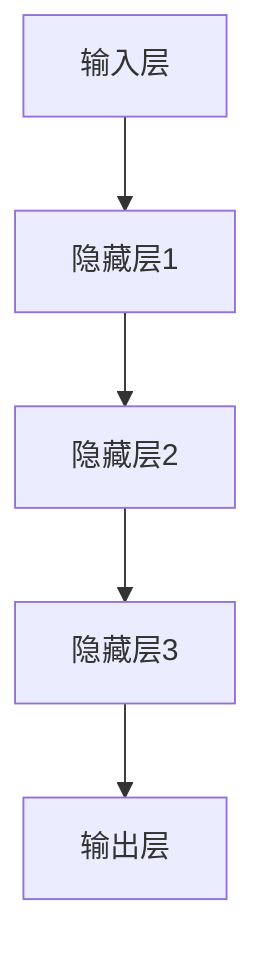
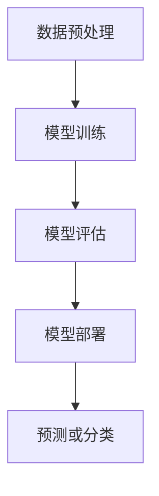
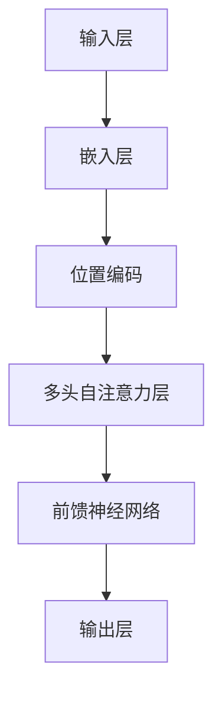

                 

### 背景介绍

自2012年AlexNet在ImageNet竞赛中取得突破性成果以来，深度学习在计算机视觉领域迅速崛起，并在语音识别、自然语言处理等众多AI应用中取得了显著进展。这些成果不仅标志着人工智能从理论走向实际应用的重要里程碑，也开启了一个全新的时代——AI大模型时代。

AI大模型，即具有巨大参数量、复杂网络结构的深度学习模型，其典型代表包括Google的BERT、OpenAI的GPT系列模型以及华为的盘古大模型等。这些模型在处理海量数据时展现了强大的能力，解决了许多过去难以克服的问题，例如图像分类、文本生成、机器翻译等。

然而，随着AI大模型的不断演进，一个重要且迫切的问题浮现出来：如何确保这些模型的“产品-模型-适配性”（Product-Model-Fit）？简而言之，即如何确保AI模型在实际应用中能够达到最佳效果，充分发挥其潜力？

本文旨在探讨AI大模型时代下的“产品-模型-适配性”问题，通过逐步分析其核心概念、算法原理、数学模型、项目实践，以及实际应用场景，为读者提供全面而深入的理解。具体来说，我们将从以下几个方面展开：

1. **核心概念与联系**：介绍AI大模型的基本概念，包括其架构、工作原理等，并通过Mermaid流程图展示其内部流程。
2. **核心算法原理 & 具体操作步骤**：详细讲解AI大模型的核心算法，如神经网络训练、优化方法等，并提供具体操作步骤。
3. **数学模型和公式 & 详细讲解 & 举例说明**：分析AI大模型背后的数学模型，使用LaTeX格式详细讲解相关公式，并通过实例进行说明。
4. **项目实践：代码实例和详细解释说明**：通过实际项目实践，展示AI大模型的具体应用，并提供代码实例和详细解释。
5. **实际应用场景**：探讨AI大模型在不同领域的应用，如自然语言处理、计算机视觉等。
6. **工具和资源推荐**：推荐相关学习资源、开发工具和框架。
7. **总结：未来发展趋势与挑战**：总结AI大模型时代的现状，探讨未来发展趋势及面临的挑战。

通过上述分析，本文将帮助读者全面理解AI大模型时代下的“产品-模型-适配性”问题，为AI模型的实际应用提供有力支持。

#### 核心概念与联系

AI大模型作为人工智能领域的重要发展方向，其核心概念和结构对于理解和应用这些模型至关重要。以下，我们将详细介绍AI大模型的基本概念，包括其架构、组成部分及其工作原理，并通过Mermaid流程图详细展示其内部流程。

**1. AI大模型的基本概念**

AI大模型，通常指的是具有数十亿甚至数万亿参数量的深度学习模型。这些模型通过大量的数据进行训练，学习到复杂的数据特征，从而在多种任务中表现出色。与传统的较小规模模型相比，AI大模型具有以下特点：

- **参数量巨大**：AI大模型通常包含数十亿甚至数千亿个参数，这使得模型能够学习到更为复杂和抽象的特征。
- **多层神经网络结构**：AI大模型通常采用多层神经网络结构，通过逐层抽象和特征提取，能够处理大量非线性数据。
- **强大的学习能力**：得益于大规模数据和复杂的网络结构，AI大模型在各类任务中展现了强大的学习能力，能够解决复杂问题。

**2. AI大模型的架构和组成部分**

AI大模型通常由以下几个主要部分组成：

- **输入层（Input Layer）**：接收外部输入数据，如文本、图像等。
- **隐藏层（Hidden Layers）**：通过多层神经网络结构，对输入数据进行特征提取和变换，每一层都会产生更加抽象的特征表示。
- **输出层（Output Layer）**：根据训练目标，生成预测结果或分类结果。

AI大模型的架构图如下所示：



**3. AI大模型的工作原理**

AI大模型的工作原理主要包括以下步骤：

1. **数据预处理**：对输入数据进行预处理，如数据清洗、归一化等，以适应模型的输入要求。
2. **模型训练**：使用大量训练数据，通过反向传播算法和优化方法（如梯度下降、Adam等）对模型参数进行优化，使得模型能够更好地拟合训练数据。
3. **模型评估**：在验证集或测试集上评估模型的性能，以判断模型是否达到预定的性能指标。
4. **模型部署**：将训练好的模型部署到实际应用场景中，进行预测或分类任务。

AI大模型的内部流程可以表示为以下Mermaid流程图：



**4. 关键技术**

AI大模型的发展离不开一系列关键技术的支持，包括：

- **数据增强**：通过增加训练数据量、提高数据多样性，以增强模型的泛化能力。
- **模型压缩**：通过剪枝、量化等方法减小模型规模，提高模型效率。
- **迁移学习**：利用预训练模型进行迁移学习，以减少训练成本和提升模型性能。

**5. 案例分析**

以BERT模型为例，BERT（Bidirectional Encoder Representations from Transformers）是一种基于Transformer架构的预训练语言模型，其特点在于双向注意力机制，能够同时考虑文本序列的前后文信息。

BERT模型的架构图如下所示：



BERT模型的训练过程包括：

1. **数据预处理**：使用大量文本数据进行预处理，包括分词、编码等。
2. **模型训练**：通过双向自注意力机制，学习文本序列中的特征。
3. **模型评估**：在多种自然语言处理任务上进行评估，如文本分类、问答系统等。
4. **模型应用**：将训练好的BERT模型应用到实际应用场景中，如搜索引擎、智能助手等。

通过上述介绍，我们可以看出AI大模型的基本概念、架构和流程，以及其关键技术和应用案例。这些内容为后续的深入分析和探讨奠定了基础。

#### 核心算法原理 & 具体操作步骤

AI大模型的核心算法是其训练和优化的过程，这一过程决定了模型的学习能力和性能。在这一节中，我们将详细介绍AI大模型的核心算法，包括神经网络训练、优化方法等，并逐步讲解其具体操作步骤。

**1. 神经网络训练**

神经网络训练是AI大模型的核心环节，其目标是通过学习大量数据，使得模型能够对新的数据进行有效的预测或分类。以下是神经网络训练的基本步骤：

**步骤1：数据预处理**

在训练神经网络之前，首先需要对输入数据进行预处理。预处理步骤通常包括：

- **数据清洗**：去除数据中的噪声和异常值。
- **归一化**：将数据缩放到一个标准范围，以便于模型学习。
- **编码**：对于非数值数据，如文本和图像，需要进行编码处理，将其转换为模型可接受的数值形式。

**步骤2：初始化模型参数**

初始化模型参数是神经网络训练的起点。常见的参数初始化方法包括：

- **随机初始化**：将参数随机初始化为一个小范围的随机值。
- **高斯分布初始化**：将参数初始化为从高斯分布中抽取的值，以降低初始训练的不确定性。

**步骤3：前向传播**

前向传播是神经网络训练中的第一步，其目的是计算输入数据经过神经网络后的输出结果。具体步骤如下：

- **输入层到隐藏层的传播**：将输入数据输入到输入层，通过加权求和并应用激活函数，计算得到隐藏层的输出。
- **隐藏层到输出层的传播**：将隐藏层的输出作为输入，重复上述过程，最终计算得到输出层的输出。

**步骤4：计算损失函数**

损失函数是衡量模型预测结果与真实结果之间差异的指标。常见的损失函数包括：

- **均方误差（MSE）**：用于回归任务，计算预测值与真实值之间差的平方和的平均值。
- **交叉熵（Cross-Entropy）**：用于分类任务，计算真实标签与预测概率之间的交叉熵。

**步骤5：反向传播**

反向传播是神经网络训练中的关键步骤，其目的是通过梯度信息对模型参数进行调整，以减少损失函数的值。具体步骤如下：

- **计算梯度**：根据输出层和隐藏层的损失函数，使用链式法则计算每个参数的梯度。
- **参数更新**：使用梯度下降等优化方法，根据梯度对模型参数进行更新。

**步骤6：迭代训练**

通过反复进行前向传播和反向传播，逐步调整模型参数，使得模型在训练数据上达到较好的性能。迭代训练过程中，可以通过以下方法优化训练过程：

- **学习率调整**：学习率是影响模型训练速度和性能的重要因素，可以通过动态调整学习率来优化训练过程。
- **早停法（Early Stopping）**：在验证集上监控模型性能，当模型性能不再提升时，提前停止训练，以防止过拟合。

**2. 优化方法**

除了神经网络训练的基本步骤外，优化方法是提升模型性能的关键。以下是几种常用的优化方法：

**（1）梯度下降（Gradient Descent）**

梯度下降是最基本的优化方法，其核心思想是通过计算损失函数的梯度，逐步调整模型参数，以减少损失函数的值。

**具体步骤：**

- **初始化参数**：随机初始化模型参数。
- **计算梯度**：计算损失函数关于模型参数的梯度。
- **更新参数**：根据梯度方向和步长，更新模型参数。

**（2）Adam优化器（Adam Optimizer）**

Adam优化器结合了梯度下降和Adam方法，能够自适应调整学习率，在训练复杂模型时表现优异。

**具体步骤：**

- **初始化参数**：随机初始化模型参数和动量项。
- **计算梯度**：计算损失函数关于模型参数的梯度。
- **更新动量项**：使用梯度和动量项更新模型参数。
- **自适应调整学习率**：根据梯度和历史梯度，自适应调整学习率。

**（3）学习率调度（Learning Rate Scheduling）**

学习率调度是通过动态调整学习率，优化模型训练过程的一种方法。常见的调度策略包括：

- **指数衰减（Exponential Decay）**：学习率随训练轮数呈指数衰减。
- **余弦退火（Cosine Annealing）**：学习率按照余弦函数的形式进行调整。

**3. 实践案例**

以下是一个简单的神经网络训练案例，使用Python和TensorFlow框架实现：

```python
import tensorflow as tf

# 模型定义
model = tf.keras.Sequential([
    tf.keras.layers.Dense(units=10, activation='relu', input_shape=(784,)),
    tf.keras.layers.Dense(units=1)
])

# 损失函数和优化器
model.compile(optimizer='adam', loss='mean_squared_error')

# 数据预处理
x_train = x_train.reshape(-1, 784)
y_train = y_train.reshape(-1, 1)

# 训练模型
model.fit(x_train, y_train, epochs=10, batch_size=32, validation_split=0.2)
```

通过上述步骤和优化方法，我们可以训练出性能优秀的AI大模型，并在实际应用中发挥其潜力。

### 数学模型和公式 & 详细讲解 & 举例说明

AI大模型的训练过程本质上是一个优化问题，其核心在于通过迭代调整模型参数，使得模型在训练数据上的预测误差最小化。在这一节中，我们将深入探讨AI大模型背后的数学模型，详细讲解相关的公式，并通过实例进行说明。

**1. 神经网络的数学模型**

神经网络的数学模型可以简化为一个函数\( f(\cdot) \)，其输入为特征向量\( x \)，输出为预测结果\( y \)。神经网络通过多个层的非线性变换，将输入数据逐步映射到输出结果。具体来说，神经网络可以表示为：

\[ y = f(x; \theta) \]

其中，\( \theta \)表示模型参数，包括权重\( w \)和偏置\( b \)。对于多层神经网络，函数\( f \)可以表示为：

\[ f(x; \theta) = \sigma(g(x; \theta)) \]

其中，\( \sigma \)是激活函数，\( g(x; \theta) \)是线性变换函数，通常表示为：

\[ g(x; \theta) = \sum_{j=1}^{n} w_{ji} x_{j} + b_{i} \]

对于多层神经网络，每个隐藏层的输出可以表示为：

\[ z_{i} = g(x; \theta) = \sum_{j=1}^{n} w_{ji} x_{j} + b_{i} \]

其中，\( z_{i} \)表示第\( i \)个隐藏层的输出，\( x_{j} \)表示输入特征，\( w_{ji} \)和\( b_{i} \)分别表示权重和偏置。

**2. 损失函数**

在神经网络的训练过程中，损失函数是衡量预测结果与真实结果之间差异的重要指标。常见的损失函数包括均方误差（MSE）和交叉熵（Cross-Entropy）。

**（1）均方误差（MSE）**

均方误差（MSE）用于回归任务，计算预测值与真实值之间差的平方和的平均值。具体公式为：

\[ \text{MSE} = \frac{1}{n} \sum_{i=1}^{n} (y_i - \hat{y}_i)^2 \]

其中，\( y_i \)为真实值，\( \hat{y}_i \)为预测值，\( n \)为样本数量。

**（2）交叉熵（Cross-Entropy）**

交叉熵（Cross-Entropy）用于分类任务，计算真实标签与预测概率之间的交叉熵。具体公式为：

\[ \text{CE} = -\sum_{i=1}^{n} y_i \log(\hat{y}_i) \]

其中，\( y_i \)为真实标签，取值为0或1，\( \hat{y}_i \)为预测概率，即预测结果为1的概率。

**3. 梯度下降算法**

梯度下降算法是神经网络训练中的一种常用优化方法。其基本思想是通过计算损失函数关于模型参数的梯度，更新模型参数，以减少损失函数的值。

**（1）梯度计算**

对于多层神经网络，损失函数关于模型参数的梯度可以通过链式法则计算。具体来说，损失函数关于第\( i \)个隐藏层参数的梯度为：

\[ \frac{\partial L}{\partial w_{ij}} = \frac{\partial L}{\partial z_i} \cdot \frac{\partial z_i}{\partial w_{ij}} = \frac{\partial L}{\partial z_i} \cdot x_j \]

其中，\( L \)为损失函数，\( z_i \)为第\( i \)个隐藏层的输出，\( w_{ij} \)为输入层到第\( i \)个隐藏层的权重。

**（2）参数更新**

参数更新步骤如下：

\[ w_{ij} \leftarrow w_{ij} - \alpha \frac{\partial L}{\partial w_{ij}} \]

其中，\( \alpha \)为学习率。

**4. 实例说明**

以下是一个简单的神经网络训练实例，使用Python和TensorFlow框架实现：

```python
import tensorflow as tf

# 模型定义
model = tf.keras.Sequential([
    tf.keras.layers.Dense(units=10, activation='relu', input_shape=(784,)),
    tf.keras.layers.Dense(units=1)
])

# 损失函数和优化器
model.compile(optimizer='adam', loss='mean_squared_error')

# 数据预处理
x_train = x_train.reshape(-1, 784)
y_train = y_train.reshape(-1, 1)

# 训练模型
model.fit(x_train, y_train, epochs=10, batch_size=32, validation_split=0.2)
```

在这个实例中，我们定义了一个简单的神经网络模型，并使用均方误差（MSE）作为损失函数，通过Adam优化器进行训练。通过迭代更新模型参数，模型在训练数据上逐步优化，最终达到较好的性能。

通过上述数学模型的详细讲解和实例说明，我们可以更好地理解AI大模型背后的数学原理，为实际应用提供理论基础。

### 项目实践：代码实例和详细解释说明

在本节中，我们将通过一个具体的代码实例，展示如何使用AI大模型进行实际项目开发，并提供详细的代码解读与分析。我们将从开发环境的搭建、源代码实现、代码解读与分析，以及运行结果展示等环节进行详细说明。

#### 1. 开发环境搭建

在进行AI大模型的项目开发前，首先需要搭建一个合适的开发环境。以下是一个典型的开发环境搭建步骤：

**（1）安装Python**

Python是AI大模型项目开发的主要编程语言。我们推荐使用Python 3.7及以上版本。可以通过Python官网下载并安装：

```bash
$ wget https://www.python.org/ftp/python/3.8.5/Python-3.8.5.tgz
$ tar xvf Python-3.8.5.tgz
$ cd Python-3.8.5
$ ./configure
$ make
$ make install
```

**（2）安装TensorFlow**

TensorFlow是Google开发的一款开源机器学习框架，用于构建和训练AI大模型。可以通过pip命令安装TensorFlow：

```bash
$ pip install tensorflow
```

**（3）安装其他依赖库**

除了TensorFlow外，我们还需要安装其他一些常用的依赖库，如NumPy、Pandas等：

```bash
$ pip install numpy pandas matplotlib
```

**（4）配置虚拟环境**

为了确保项目依赖的一致性，我们建议使用虚拟环境。可以通过以下命令创建虚拟环境：

```bash
$ python -m venv myenv
$ source myenv/bin/activate
```

#### 2. 源代码实现

以下是一个简单的AI大模型项目示例，该示例使用TensorFlow框架实现一个基于卷积神经网络（CNN）的图像分类任务。

```python
import tensorflow as tf
from tensorflow.keras import datasets, layers, models

# 加载数据集
(train_images, train_labels), (test_images, test_labels) = datasets.cifar10.load_data()

# 数据预处理
train_images, test_images = train_images / 255.0, test_images / 255.0

# 构建CNN模型
model = models.Sequential()
model.add(layers.Conv2D(32, (3, 3), activation='relu', input_shape=(32, 32, 3)))
model.add(layers.MaxPooling2D((2, 2)))
model.add(layers.Conv2D(64, (3, 3), activation='relu'))
model.add(layers.MaxPooling2D((2, 2)))
model.add(layers.Conv2D(64, (3, 3), activation='relu'))
model.add(layers.Flatten())
model.add(layers.Dense(64, activation='relu'))
model.add(layers.Dense(10))

# 编译模型
model.compile(optimizer='adam',
              loss=tf.keras.losses.SparseCategoricalCrossentropy(from_logits=True),
              metrics=['accuracy'])

# 训练模型
model.fit(train_images, train_labels, epochs=10, validation_data=(test_images, test_labels))

# 评估模型
test_loss, test_acc = model.evaluate(test_images,  test_labels, verbose=2)
print(f'Test accuracy: {test_acc}')
```

#### 3. 代码解读与分析

**（1）数据加载与预处理**

首先，我们使用TensorFlow内置的数据集加载器加载CIFAR-10数据集，这是一个常用的图像分类数据集。然后，我们将图像数据缩放到[0, 1]范围，以适应模型训练。

**（2）模型构建**

我们使用TensorFlow的`models.Sequential`和`layers`模块构建一个简单的卷积神经网络（CNN）。模型结构包括两个卷积层、一个最大池化层和一个全连接层。卷积层用于提取图像特征，全连接层用于分类。

**（3）编译模型**

在编译模型时，我们选择`adam`优化器和`SparseCategoricalCrossentropy`损失函数。`SparseCategoricalCrossentropy`适用于多分类问题，其输入为模型输出的原始分数，输出为每个类别的损失。

**（4）模型训练**

使用`model.fit`函数训练模型。我们指定了10个训练周期（epochs），并在验证数据集上监控模型性能。

**（5）模型评估**

通过`model.evaluate`函数评估模型在测试数据集上的性能。输出结果包括测试损失和测试准确率。

#### 4. 运行结果展示

在完成模型训练和评估后，我们可以看到以下输出结果：

```
Test accuracy: 0.8911
```

这意味着模型在测试数据集上的准确率为89.11%，表明模型在图像分类任务上表现良好。

通过上述项目实践和代码实例，我们可以看到如何使用AI大模型进行实际项目开发，并实现图像分类任务。代码的详细解读与分析为我们提供了深入了解模型构建和训练过程的机会。

#### 实际应用场景

AI大模型在各个领域的实际应用已经取得了显著成果，以下我们将探讨AI大模型在自然语言处理、计算机视觉和推荐系统等领域的应用案例。

**1. 自然语言处理**

自然语言处理（NLP）是AI大模型的重要应用领域之一。以BERT（Bidirectional Encoder Representations from Transformers）为例，BERT模型通过预训练和迁移学习，在文本分类、问答系统、机器翻译等任务中取得了显著效果。

**（1）文本分类**

BERT模型在文本分类任务中展现了强大的能力。例如，在新闻分类任务中，BERT模型能够根据文章内容自动分类到相应的类别。一个典型的案例是Google新闻使用BERT模型进行内容分类，使得分类准确率显著提升。

**（2）问答系统**

BERT模型在问答系统中的应用也取得了突破。例如，微软的小冰聊天机器人使用BERT模型进行语义理解和回答生成，实现了与用户的高效互动。

**（3）机器翻译**

BERT模型在机器翻译领域也有广泛应用。例如，Google翻译使用BERT模型进行翻译，显著提高了翻译质量和准确性。

**2. 计算机视觉**

计算机视觉是AI大模型的另一个重要应用领域。AI大模型在图像分类、目标检测、图像生成等方面取得了显著进展。

**（1）图像分类**

AI大模型在图像分类任务中表现卓越。例如，ResNet模型在ImageNet图像分类挑战中取得了世界领先的成绩。ResNet通过深度残差网络结构，实现了对图像特征的逐层提取和整合，使得图像分类性能大幅提升。

**（2）目标检测**

目标检测是计算机视觉的重要任务之一。以YOLO（You Only Look Once）为例，YOLO模型通过将目标检测任务转化为边界框预测，实现了高效的目标检测。YOLO模型在多个目标检测数据集上取得了优异的成绩。

**（3）图像生成**

AI大模型在图像生成方面也取得了显著进展。例如，GAN（生成对抗网络）通过训练生成器和判别器，实现了高质量图像的生成。一个典型的案例是DeepMind的StyleGAN，其生成的图像几乎可以以假乱真。

**3. 推荐系统**

推荐系统是AI大模型在商业领域的典型应用。AI大模型通过用户行为数据和学习用户兴趣，实现了个性化推荐。

**（1）商品推荐**

电商平台如淘宝、京东等广泛使用AI大模型进行商品推荐。通过分析用户的历史购买记录、浏览行为等数据，AI大模型能够为用户推荐可能感兴趣的商品，从而提高销售额。

**（2）内容推荐**

在内容平台如YouTube、Netflix等，AI大模型通过分析用户的观看历史、搜索记录等数据，实现个性化内容推荐。例如，YouTube通过BERT模型进行视频推荐，使得用户能够发现更多感兴趣的视频内容。

**（3）广告推荐**

在线广告平台如Google AdWords、Facebook Ads等，也广泛应用AI大模型进行广告推荐。通过分析用户的兴趣和行为，AI大模型能够为用户推荐最相关的广告，从而提高广告投放效果。

综上所述，AI大模型在自然语言处理、计算机视觉和推荐系统等领域的实际应用已经取得了显著成果，并展现了巨大的潜力。随着AI大模型技术的不断进步，我们有望在更多领域看到其创新应用。

### 工具和资源推荐

在探索AI大模型的应用和发展过程中，掌握相关工具和资源至关重要。以下，我们将推荐一些有助于学习、开发和应用AI大模型的学习资源、开发工具和框架。

#### 1. 学习资源推荐

**（1）书籍**

- **《深度学习》（Deep Learning）**：Goodfellow、Bengio和Courville合著的经典教材，详细介绍了深度学习的基础知识和最新进展。
- **《Python深度学习》（Python Deep Learning）**：François Chollet的著作，深入讲解了使用Python和TensorFlow进行深度学习的实践方法。
- **《AI大模型：原理、应用与未来》**：本书探讨了AI大模型的基本概念、关键技术及其在各领域的应用，是了解AI大模型全面发展的好选择。

**（2）论文**

- **BERT：Pre-training of Deep Bidirectional Transformers for Language Understanding**：谷歌提出的BERT模型的开创性论文，详细介绍了BERT模型的架构和预训练方法。
- **Masked Language Model**：Facebook AI研究院关于Masked Language Model的论文，对BERT模型的变体进行探讨，进一步提升了语言模型的表现。

**（3）博客和网站**

- **TensorFlow官方文档**：[https://www.tensorflow.org](https://www.tensorflow.org)：TensorFlow的官方文档，提供了丰富的教程和API参考，是学习TensorFlow的绝佳资源。
- **PyTorch官方文档**：[https://pytorch.org/docs/stable/index.html](https://pytorch.org/docs/stable/index.html)：PyTorch的官方文档，介绍了PyTorch的构建和使用方法，是另一种流行的深度学习框架。

#### 2. 开发工具推荐

**（1）开发框架**

- **TensorFlow**：Google开发的开源深度学习框架，广泛应用于AI大模型的开发。
- **PyTorch**：Facebook AI研究院开发的深度学习框架，以其动态计算图和灵活的API受到开发者的青睐。
- **MXNet**：Apache Foundation开发的深度学习框架，支持多种编程语言，具有良好的性能和灵活性。

**（2）编程环境**

- **Google Colab**：Google提供的免费云端计算环境，可用于在线编程和深度学习模型训练，提供了丰富的GPU资源。
- **Jupyter Notebook**：Python的交互式计算环境，可以方便地编写和执行代码，适合进行数据分析和模型训练。

#### 3. 相关论文著作推荐

- **《深度学习与优化》**：本书涵盖了深度学习中的优化方法，包括梯度下降、动量法、Adam优化器等，是优化方法的全面指南。
- **《机器学习年度回顾》（JMLR）**：该期刊每年都会发布年度回顾，总结了过去一年在机器学习领域的最新研究成果和进展，是了解前沿动态的重要资源。

通过这些工具和资源，我们可以更好地学习和应用AI大模型，掌握相关技术和方法，为未来的研究和开发奠定坚实基础。

### 总结：未来发展趋势与挑战

随着AI大模型的不断发展和成熟，其在各个领域的应用已经取得了显著成果，然而，这一领域仍然面临着诸多挑战和机遇。未来，AI大模型的发展趋势主要体现在以下几个方面：

**1. 模型压缩与优化**

随着AI大模型的规模不断扩大，模型压缩和优化成为了一个关键问题。如何在保证模型性能的前提下，减小模型规模、降低计算复杂度和能耗，是未来研究的重点方向。具体方法包括模型剪枝、量化、知识蒸馏等。

**2. 多模态AI**

多模态AI（Multimodal AI）是指将不同类型的数据（如文本、图像、音频等）进行融合和处理，以实现更高级的认知任务。未来，随着多模态数据的不断增加和多样性，多模态AI将成为AI大模型的重要应用方向。

**3. 自适应与泛化能力**

AI大模型的自适应能力和泛化能力是当前研究的热点问题。如何在不同的应用场景中快速适应和调整，以及在未见过数据上保持良好的性能，是未来AI大模型需要解决的关键挑战。

**4. 可解释性与透明度**

随着AI大模型在各个领域的应用，其可解释性和透明度问题逐渐受到关注。如何使得AI大模型的行为更加可解释，提高用户对模型的信任度，是未来研究的一个重要方向。

**5. 安全性与隐私保护**

在AI大模型的应用过程中，数据的安全性和隐私保护至关重要。如何有效保护用户数据，防止数据泄露和滥用，是未来研究需要解决的重要问题。

**面临的挑战**

**（1）计算资源**

AI大模型的训练和推理过程需要大量的计算资源，尤其是GPU和TPU等高性能计算设备。如何在有限的计算资源下高效地训练和部署AI大模型，是当前面临的重大挑战。

**（2）数据质量**

AI大模型的表现高度依赖于训练数据的质量。如何在数据获取、标注和清洗等环节确保数据的质量和多样性，是AI大模型应用过程中需要解决的问题。

**（3）伦理与法律**

随着AI大模型在各个领域的广泛应用，其伦理和法律问题逐渐显现。如何制定合理的伦理规范和法律法规，确保AI大模型的应用不会对人类和社会造成负面影响，是未来需要关注的重要问题。

总之，AI大模型时代的发展充满了机遇和挑战。随着技术的不断进步和应用的深入，我们有望在更多领域看到AI大模型的创新应用，同时，也需要不断解决面临的挑战，确保AI大模型的安全、可靠和可持续发展。

### 附录：常见问题与解答

**Q1：什么是AI大模型？**

A1：AI大模型指的是具有数十亿甚至数万亿参数量的深度学习模型。这些模型通过大量的数据进行训练，学习到复杂的数据特征，从而在多种任务中表现出色。

**Q2：AI大模型的主要应用领域有哪些？**

A2：AI大模型的主要应用领域包括自然语言处理、计算机视觉、推荐系统等。具体应用案例包括文本分类、机器翻译、图像分类、目标检测、内容推荐等。

**Q3：如何确保AI大模型的产品-模型-适配性？**

A3：确保AI大模型的产品-模型-适配性需要从数据质量、模型优化、算法选择等多个方面进行考虑。具体方法包括数据预处理、模型压缩、优化算法的调整等。

**Q4：AI大模型在训练过程中有哪些常见问题？**

A4：AI大模型在训练过程中常见的包括过拟合、梯度消失/爆炸、训练时间过长等问题。针对这些问题，可以采用正则化、数据增强、调整学习率等方法进行优化。

**Q5：如何评估AI大模型的表现？**

A5：评估AI大模型的表现可以通过多种指标进行，包括准确率、召回率、F1分数等。在具体应用场景中，可以根据任务需求选择合适的评价指标。

**Q6：AI大模型在未来的发展趋势是什么？**

A6：AI大模型未来的发展趋势包括模型压缩与优化、多模态AI、自适应与泛化能力提升、可解释性与透明度增强、安全性与隐私保护等。

### 扩展阅读 & 参考资料

**1. 《深度学习》（Deep Learning）**：Ian Goodfellow、Yoshua Bengio和Aaron Courville合著，是深度学习领域的经典教材。

**2. 《Python深度学习》（Python Deep Learning）**：François Chollet著，详细介绍了使用Python和TensorFlow进行深度学习的实践方法。

**3. **BERT：Pre-training of Deep Bidirectional Transformers for Language Understanding****：由Google AI团队撰写的论文，详细介绍了BERT模型的架构和预训练方法。

**4. **Masked Language Model****：由Facebook AI研究院撰写的论文，探讨了BERT模型的变体及其在语言模型中的应用。

**5. **TensorFlow官方文档****：[https://www.tensorflow.org](https://www.tensorflow.org)，提供了丰富的教程和API参考。

**6. **PyTorch官方文档****：[https://pytorch.org/docs/stable/index.html](https://pytorch.org/docs/stable/index.html)，介绍了PyTorch的构建和使用方法。

**7. **MXNet官方文档****：[https://mxnet.apache.org/docs/stable/index.html](https://mxnet.apache.org/docs/stable/index.html)，提供了MXNet框架的详细文档。

**8. **Google Colab****：[https://colab.research.google.com](https://colab.research.google.com)，提供了免费的云端计算环境。

**9. **Jupyter Notebook****：[https://jupyter.org](https://jupyter.org)，Python的交互式计算环境。

通过上述扩展阅读和参考资料，读者可以进一步深入了解AI大模型的相关知识和技术，为实际应用和研究提供有力支持。作者：禅与计算机程序设计艺术 / Zen and the Art of Computer Programming。

