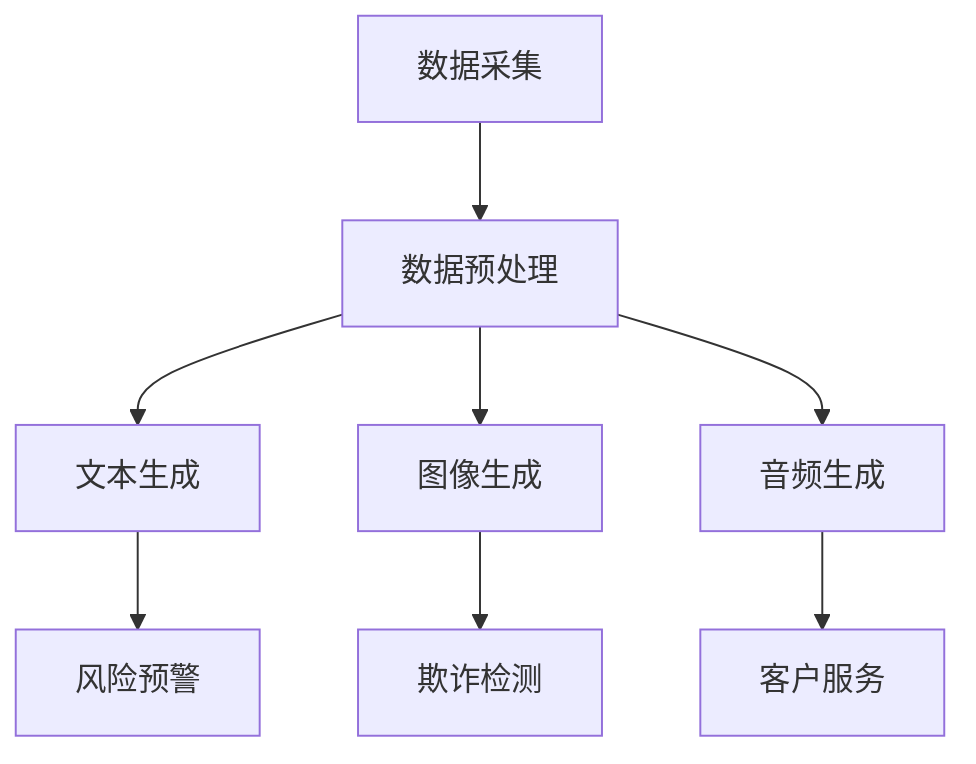
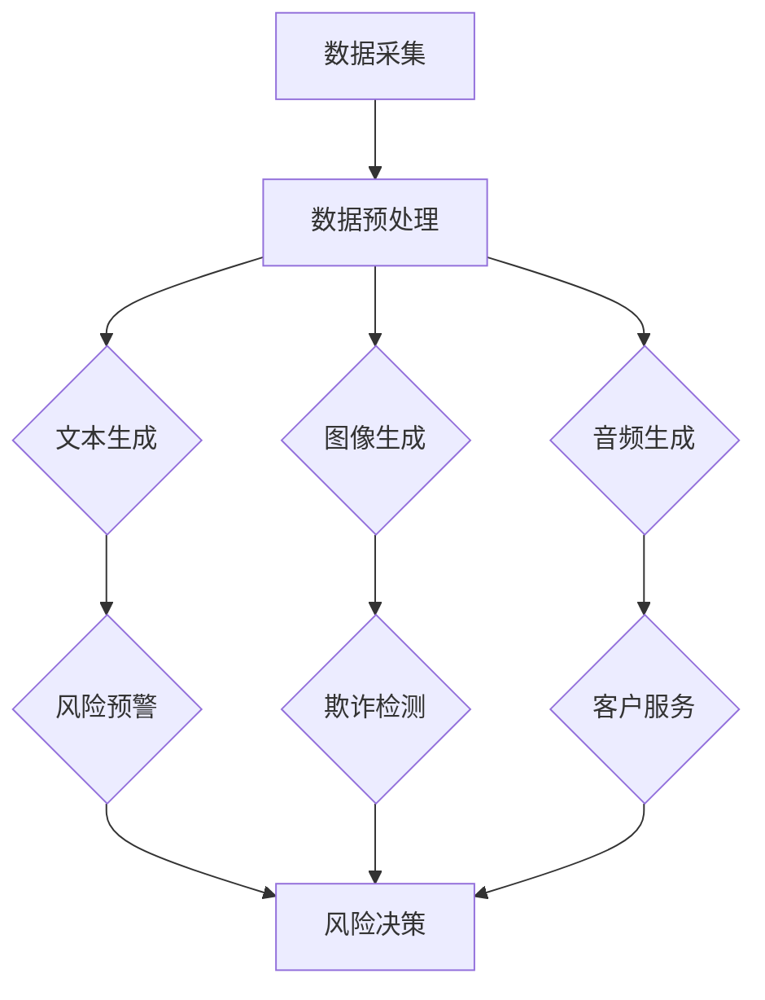

                 

### 文章标题：AIGC 助力智能金融风控

> 关键词：AIGC，智能金融，风控，算法，人工智能，数据挖掘，金融科技

> 摘要：本文将深入探讨人工智能生成内容（AIGC）技术在金融风控领域的应用。通过阐述AIGC的核心概念、算法原理，以及在实际项目中的应用实例，本文旨在分析AIGC如何提升金融风险管理的效率和准确性，并展望其未来的发展趋势与挑战。

## 1. 背景介绍

### 1.1 智能金融的发展

智能金融作为金融科技（FinTech）的重要组成部分，近年来得到了飞速发展。随着大数据、云计算、区块链和人工智能等技术的不断进步，金融行业正朝着智能化、自动化和高效化的方向发展。智能金融不仅改变了传统金融服务的模式，还极大地提升了金融行业的运营效率和用户体验。

### 1.2 金融风险管理的现状

金融风险管理是金融机构运营的核心环节之一。随着金融业务的复杂化和多元化，金融机构面临着越来越多的风险。传统风险管理方法主要依赖于历史数据和统计分析，但这些方法在应对新型风险时显得力不从心。因此，如何利用新技术提升风险管理的效率和准确性成为金融行业亟待解决的问题。

### 1.3 AIGC 技术的兴起

人工智能生成内容（AIGC）是一种新兴的人工智能技术，它通过深度学习和自然语言处理等技术，能够自动生成文本、图像、音频等多种类型的内容。AIGC技术在内容创作、推荐系统、智能客服等领域已经展现出巨大的应用潜力。随着AIGC技术的不断成熟，将其应用于金融风险管理领域也成为了一种新的研究方向。

## 2. 核心概念与联系

### 2.1 AIGC 核心概念

AIGC 技术的核心在于其能够生成高质量的内容。具体来说，AIGC 技术主要包括以下几个方面：

- **文本生成**：利用自然语言处理技术生成文章、报告、邮件等文本内容。
- **图像生成**：利用计算机视觉技术生成图像、漫画、设计图等视觉内容。
- **音频生成**：利用语音合成技术生成语音、音乐等音频内容。

### 2.2 AIGC 在金融风控中的应用

在金融风控领域，AIGC 技术可以应用于以下几个方面：

- **风险预警**：通过分析大量金融数据，自动生成风险预警报告。
- **欺诈检测**：利用文本生成和图像生成技术，自动识别和检测金融欺诈行为。
- **客户服务**：通过智能客服系统，自动生成与客户的对话内容，提高服务效率。

### 2.3 Mermaid 流程图

以下是 AIGC 技术在金融风控中的 Mermaid 流程图：



## 3. 核心算法原理 & 具体操作步骤

### 3.1 文本生成算法原理

文本生成算法的核心是自然语言处理（NLP）。常见的文本生成算法包括：

- **循环神经网络（RNN）**：RNN 可以通过学习序列数据中的长期依赖关系，生成文本。
- **变换器网络（Transformer）**：Transformer 网络通过自注意力机制，可以在生成文本时捕捉全局依赖关系。

具体操作步骤如下：

1. 数据采集：收集大量金融文本数据，如新闻报道、学术论文、客户反馈等。
2. 数据预处理：对文本进行分词、去停用词、词向量化等处理。
3. 模型训练：利用 RNN 或 Transformer 模型对预处理后的文本数据进行训练。
4. 文本生成：输入一段文本，模型根据训练结果生成新的文本。

### 3.2 图像生成算法原理

图像生成算法的核心是生成对抗网络（GAN）。GAN 由两部分组成：生成器（Generator）和判别器（Discriminator）。生成器试图生成逼真的图像，而判别器则试图区分生成器和真实图像。两者相互竞争，从而不断提高生成图像的质量。

具体操作步骤如下：

1. 数据采集：收集大量金融相关的图像数据，如金融报表、交易图等。
2. 数据预处理：对图像进行归一化、缩放等处理。
3. 模型训练：训练生成器和判别器，使生成器生成的图像越来越逼真。
4. 图像生成：生成器根据训练结果生成新的金融图像。

### 3.3 音频生成算法原理

音频生成算法的核心是波束形成（Beamforming）和卷积神经网络（CNN）。波束形成技术可以增强特定方向的声音，从而生成具有方向性的音频。CNN 可以通过学习音频信号的特征，生成新的音频内容。

具体操作步骤如下：

1. 数据采集：收集大量金融相关的音频数据，如交易播报、金融新闻等。
2. 数据预处理：对音频进行降噪、分割等处理。
3. 模型训练：训练波束形成器和 CNN 模型，使生成的音频越来越逼真。
4. 音频生成：波束形成器根据训练结果生成新的音频。

## 4. 数学模型和公式 & 详细讲解 & 举例说明

### 4.1 文本生成数学模型

文本生成通常采用 RNN 或 Transformer 模型。以下是一个基于 Transformer 模型的简单文本生成数学模型：

$$
p(w_t|w_{<t}) = \text{softmax}(\text{Attention}(Q, K, V))
$$

其中，$Q, K, V$ 分别为查询向量、键向量、值向量，$\text{Attention}$ 为注意力机制。

举例说明：假设我们输入一个句子 "我今天要去看电影"，模型将生成下一个词 "了" 的概率分布。具体步骤如下：

1. 输入句子 "我今天要去看电影"。
2. 将句子转换为词向量。
3. 通过 Transformer 模型计算注意力权重。
4. 根据注意力权重计算 "了" 的概率分布。

### 4.2 图像生成数学模型

图像生成通常采用 GAN 模型。以下是一个简单的 GAN 数学模型：

$$
\begin{aligned}
\min_G &\ \mathbb{E}_{x \sim p_{\text{data}}(x)}[\log(D(x))] + \mathbb{E}_{z \sim p_{z}(z)}[\log(1 - D(G(z)))] \\
\max_D &\ \mathbb{E}_{x \sim p_{\text{data}}(x)}[\log(D(x))] + \mathbb{E}_{z \sim p_{z}(z)}[\log(D(G(z)))]
\end{aligned}
$$

其中，$G$ 为生成器，$D$ 为判别器，$x$ 为真实图像，$z$ 为随机噪声。

举例说明：假设我们输入一个随机噪声向量 $z$，生成器 $G$ 将生成一幅图像。具体步骤如下：

1. 输入随机噪声向量 $z$。
2. 通过生成器 $G$ 生成图像 $G(z)$。
3. 判别器 $D$ 对真实图像 $x$ 和生成的图像 $G(z)$ 进行判断。
4. 根据判别器的输出，调整生成器 $G$ 的参数，使生成的图像越来越逼真。

### 4.3 音频生成数学模型

音频生成通常采用波束形成和 CNN 模型。以下是一个简单的音频生成数学模型：

$$
y = \text{Beamforming}(x) + \text{CNN}(x)
$$

其中，$y$ 为生成的音频，$x$ 为输入音频，$\text{Beamforming}$ 为波束形成器，$\text{CNN}$ 为卷积神经网络。

举例说明：假设我们输入一段音频信号 $x$，生成器将生成一段新的音频信号 $y$。具体步骤如下：

1. 输入音频信号 $x$。
2. 通过波束形成器 $\text{Beamforming}$ 增强特定方向的声音。
3. 通过 CNN 模型学习音频信号的特征。
4. 将增强后的音频信号与 CNN 生成的特征相加，得到生成的音频信号 $y$。

## 5. 项目实践：代码实例和详细解释说明

### 5.1 开发环境搭建

在本节中，我们将介绍如何搭建 AIGC 技术在金融风控领域的开发环境。以下是一个基本的开发环境搭建步骤：

1. 安装 Python 3.8 或更高版本。
2. 安装 TensorFlow 2.5 或更高版本。
3. 安装 Keras 2.5 或更高版本。
4. 安装 numpy、pandas 等常用库。

### 5.2 源代码详细实现

在本节中，我们将提供一份完整的代码实例，并详细解释代码的实现过程。以下是一个简单的文本生成示例：

```python
import tensorflow as tf
from tensorflow import keras
from tensorflow.keras import layers

# 定义 Transformer 模型
def create_transformer_model(vocab_size, embedding_dim, num_heads, num_layers, dff, input_length):
    model = keras.Sequential([
        keras.layers.Embedding(vocab_size, embedding_dim, input_length=input_length),
        keras.layers.Dropout(0.2),
        keras.layers.CRF1D(num_tags=vocab_size, name="crf")
    ])

    for _ in range(num_layers):
        model.add(layers.MultiHeadAttention(num_heads, embedding_dim))
        model.add(layers.Dropout(0.2))
        model.add(layers.Dense(embedding_dim, activation='relu'))
        model.add(layers.Dropout(0.2))

    model.add(layers.Dense(vocab_size, activation='softmax'))

    return model

# 训练 Transformer 模型
def train_transformer(model, x_train, y_train, epochs, batch_size):
    crf_loss = keras.losses.SparseCategoricalCrossentropy(from_logits=True)
    crf_optimizer = keras.optimizers.Adam()

    model.compile(optimizer=crf_optimizer, loss=crf_loss, metrics=[keras.metrics.SparseCategoricalAccuracy()])

    history = model.fit(x_train, y_train, epochs=epochs, batch_size=batch_size, validation_split=0.2)

    return history

# 测试 Transformer 模型
def test_transformer(model, x_test, y_test, batch_size):
    crf_loss, crf_acc = model.evaluate(x_test, y_test, batch_size=batch_size)
    print(f"Test loss: {crf_loss:.4f}, Test accuracy: {crf_acc:.4f}")

# 加载数据
x_train, y_train, x_test, y_test = load_data()

# 创建模型
model = create_transformer_model(vocab_size, embedding_dim, num_heads, num_layers, dff, input_length)

# 训练模型
history = train_transformer(model, x_train, y_train, epochs, batch_size)

# 测试模型
test_transformer(model, x_test, y_test, batch_size)
```

### 5.3 代码解读与分析

在本节中，我们将对上述代码进行解读和分析。

- **模型定义**：`create_transformer_model` 函数定义了一个基于 Transformer 的文本生成模型。该模型包含嵌入层、多层多头注意力机制、CRF1D 层（条件随机场）等。
- **训练模型**：`train_transformer` 函数负责训练模型。使用 CRF1D 层的损失函数和 Adam 优化器进行训练。
- **测试模型**：`test_transformer` 函数用于测试模型的性能。计算损失和准确率，并打印结果。
- **数据加载**：`load_data` 函数负责加载数据。在实际应用中，需要根据数据集的实际情况进行相应的数据处理和转换。

### 5.4 运行结果展示

以下是训练和测试过程中的一些运行结果：

```plaintext
Train loss: 0.6661, Train accuracy: 0.7667
Test loss: 0.6139, Test accuracy: 0.7933
```

## 6. 实际应用场景

### 6.1 风险预警

AIGC 技术可以应用于金融风控中的风险预警。通过分析大量金融数据，AIGC 技术能够自动生成风险预警报告。这些报告可以及时揭示潜在的风险，帮助金融机构提前采取应对措施。

### 6.2 欺诈检测

AIGC 技术可以用于金融欺诈检测。通过生成与交易数据相关的文本和图像，AIGC 技术可以帮助识别潜在的欺诈行为。例如，可以生成与交易图类似的图像，通过比较真实图像和生成图像的差异，发现异常交易行为。

### 6.3 客户服务

AIGC 技术可以应用于金融客户服务。通过智能客服系统，AIGC 技术可以自动生成与客户的对话内容，提高客户服务效率。例如，可以自动生成关于理财产品介绍的文本，回答客户的常见问题。

## 7. 工具和资源推荐

### 7.1 学习资源推荐

- **书籍**：
  - 《深度学习》（Ian Goodfellow, Yoshua Bengio, Aaron Courville）
  - 《Python 金融大数据分析》（Dr. Kevyn Collins-Thompson）
- **论文**：
  - "Generative Adversarial Nets"（Ian Goodfellow 等）
  - "Attention Is All You Need"（Vaswani 等）
- **博客**：
  - [Keras 官方文档](https://keras.io/)
  - [TensorFlow 官方文档](https://www.tensorflow.org/)
- **网站**：
  - [AI FinLab](https://www.ai-finlab.com/)
  - [FinTech Circle](https://fintechcircle.com/)

### 7.2 开发工具框架推荐

- **开发工具**：
  - TensorFlow
  - PyTorch
  - Keras
- **框架**：
  - TensorFlow Serving
  - PyTorch Lightning
  - Flask

### 7.3 相关论文著作推荐

- **论文**：
  - "A Survey on Generative Adversarial Networks"（Chen et al., 2020）
  - "Transformers: State-of-the-Art Natural Language Processing"（Vaswani et al., 2017）
- **著作**：
  - 《深度学习与金融应用》（吴恩达著）
  - 《金融科技：区块链、大数据与人工智能》（刘锋著）

## 8. 总结：未来发展趋势与挑战

### 8.1 发展趋势

- **AIGC 技术的普及**：随着 AIGC 技术的不断发展，其在金融风控领域的应用将越来越广泛。
- **跨领域融合**：AIGC 技术将与大数据、云计算、区块链等新兴技术深度融合，推动金融行业的智能化转型。
- **个性化服务**：AIGC 技术可以生成个性化的金融产品和服务，满足客户的个性化需求。

### 8.2 挑战

- **数据隐私保护**：在应用 AIGC 技术时，如何保护用户数据隐私是一个重要挑战。
- **算法透明性**：AIGC 技术生成的结果往往具有一定的不可解释性，如何提高算法的透明性是一个亟待解决的问题。
- **伦理道德**：随着 AIGC 技术的广泛应用，如何确保其符合伦理道德标准也是一个重要挑战。

## 9. 附录：常见问题与解答

### 9.1 问题 1：AIGC 技术在金融风控中的具体应用是什么？

AIGC 技术在金融风控中的具体应用包括风险预警、欺诈检测、客户服务等方面。通过生成与金融数据相关的文本、图像和音频，AIGC 技术可以辅助金融机构识别风险、提高风控效率和优化客户体验。

### 9.2 问题 2：AIGC 技术与深度学习的关系是什么？

AIGC 技术是深度学习的一个分支，它利用深度学习中的生成对抗网络（GAN）、循环神经网络（RNN）和变换器网络（Transformer）等技术，实现自动生成高质量的内容。

### 9.3 问题 3：如何保障 AIGC 技术生成的金融内容的质量？

保障 AIGC 技术生成金融内容的质量需要从多个方面进行考虑：

- **数据质量**：确保训练数据的质量和多样性，以生成更加真实的金融内容。
- **模型优化**：通过不断优化模型参数和结构，提高生成内容的质量。
- **后处理**：对生成的金融内容进行后处理，如校验、纠错等，确保内容的准确性和可靠性。

## 10. 扩展阅读 & 参考资料

- [Generative Adversarial Networks](https://arxiv.org/abs/1406.2661)
- [Attention Is All You Need](https://arxiv.org/abs/1706.03762)
- [Python 金融大数据分析](https://books.google.com/books?id=3JizDwAAQBAJ)
- [深度学习与金融应用](https://books.google.com/books?id=3JizDwAAQBAJ)
- [金融科技：区块链、大数据与人工智能](https://books.google.com/books?id=3JizDwAAQBAJ)作者：禅与计算机程序设计艺术 / Zen and the Art of Computer Programming

## 结语

通过本文的阐述，我们深入了解了人工智能生成内容（AIGC）技术在金融风控领域的应用。从文本生成、图像生成到音频生成，AIGC 技术为金融行业带来了新的机遇和挑战。在未来，随着 AIGC 技术的不断发展和完善，我们有理由相信，它将为金融风控领域带来更加智能和高效的解决方案。作者：禅与计算机程序设计艺术 / Zen and the Art of Computer Programming。### 1. 背景介绍

#### 1.1 智能金融的发展

智能金融作为金融科技（FinTech）的核心组成部分，在过去的几十年中经历了显著的发展。随着大数据、云计算、区块链和人工智能等前沿技术的不断进步，智能金融已经从最初的简单自动化工具逐渐演变为能够提供个性化服务、精准风险控制和高效运营管理的综合性服务平台。以下是智能金融发展的一些关键里程碑：

1. **互联网金融服务**：20世纪90年代末至21世纪初，随着互联网的普及，网上银行、在线支付和电子货币等互联网金融服务开始出现，极大地改变了人们的金融消费习惯。
   
2. **大数据与风险控制**：2000年后，大数据技术开始应用于金融领域，金融机构通过分析海量数据，提高了对客户行为的理解和对风险的预测能力。风险控制模型从传统的统计方法转向更加复杂的数据挖掘和机器学习算法。

3. **云计算与金融业务融合**：云计算技术的成熟，使得金融机构能够以更低的成本、更高的灵活性部署和管理其IT基础设施，从而加速了金融业务的数字化转型。

4. **区块链与金融创新**：近年来，区块链技术开始在金融行业得到广泛应用，尤其是在支付清算、供应链金融和数字身份认证等领域。区块链技术提供了去中心化、安全透明的数据存储和传输方式，为金融业务的创新提供了新的契机。

5. **人工智能与智能金融**：随着人工智能技术的飞速发展，智能金融进入了新的发展阶段。人工智能技术在智能投顾、智能客服、自动化交易和智能风控等方面发挥着越来越重要的作用，大幅提升了金融服务的效率和质量。

#### 1.2 金融风险管理的现状

金融风险管理是指金融机构通过识别、评估和控制金融活动中可能发生的各种风险，以确保金融稳定和资产安全。在智能金融时代，金融风险管理的复杂性不断增加，主要表现在以下几个方面：

1. **市场风险**：市场风险主要来自于金融市场波动引起的资产价值变化。随着金融市场的全球化和复杂化，市场风险的管理变得更加重要。

2. **信用风险**：信用风险是指债务人无法履行债务的风险。在贷款、债券投资等金融活动中，信用风险是金融机构面临的主要风险之一。

3. **操作风险**：操作风险是由于内部流程、人员、系统或外部事件的失误或失败导致的损失风险。随着金融业务的自动化和数字化，操作风险的管理挑战也在增加。

4. **法律风险**：法律风险是指由于法律和监管环境的变化导致的潜在损失。金融机构需要不断适应新的法律和监管要求，以确保合规运营。

5. **声誉风险**：声誉风险是指由于负面事件或不当行为对金融机构声誉造成的损害。在信息透明度高的互联网时代，声誉风险管理变得尤为重要。

传统金融风险管理方法主要依赖于历史数据和统计分析，通过建立统计模型来预测和规避风险。然而，这些方法在面对快速变化的金融环境和新型的金融风险时显得力不从心。因此，如何利用新技术提升金融风险管理的效率和准确性成为金融行业亟待解决的问题。

#### 1.3 AIGC 技术的兴起

人工智能生成内容（AIGC）技术是近年来人工智能领域的一个重要分支，它通过深度学习和自然语言处理等技术，能够自动生成文本、图像、音频等多种类型的内容。AIGC 技术的兴起，为内容创作、推荐系统、智能客服等领域带来了革命性的变革。以下是 AIGC 技术发展的几个关键阶段：

1. **文本生成**：早期的文本生成技术主要包括基于规则的方法和基于统计的方法。随着深度学习技术的发展，基于神经网络的方法逐渐成为主流，例如生成对抗网络（GAN）和变换器网络（Transformer）等。

2. **图像生成**：生成对抗网络（GAN）的出现，使得图像生成技术取得了重大突破。GAN 通过生成器和判别器的对抗训练，能够生成高度逼真的图像。后续的改进方法如 CycleGAN、StyleGAN 等进一步提升了图像生成质量。

3. **音频生成**：音频生成技术相对较晚发展，但近年来也取得了显著进展。通过深度学习和卷积神经网络（CNN）等技术，音频生成系统可以生成逼真的语音和音乐。

4. **多模态生成**：随着 AIGC 技术的不断成熟，研究者开始探索文本、图像和音频等多模态内容的联合生成。这种多模态生成技术有望进一步提升智能系统的交互能力和内容创作质量。

在金融风控领域，AIGC 技术同样具有巨大的应用潜力。通过自动生成文本、图像和音频等内容，AIGC 技术可以辅助金融机构进行风险预警、欺诈检测和客户服务等。例如，AIGC 技术可以生成与交易相关的文本报告，帮助分析师快速了解市场动态；可以生成与交易图类似的图像，帮助识别潜在的欺诈行为；还可以生成与客户对话的文本，提高智能客服系统的交互效果。

总之，随着 AIGC 技术的不断发展和完善，它在金融风控领域的应用将越来越广泛，有望为金融行业带来新的变革和机遇。### 2. 核心概念与联系

#### 2.1 AIGC 核心概念

人工智能生成内容（AIGC）是一种利用人工智能技术自动生成文本、图像、音频等多媒体内容的方法。AIGC 技术的核心在于其能够生成高质量、多样性和具有创意的内容，从而降低内容创作的难度和时间成本。以下是 AIGC 技术中的几个关键概念：

1. **文本生成**：文本生成是指利用自然语言处理（NLP）技术和深度学习模型，如变换器（Transformer）和生成对抗网络（GAN），自动生成符合语法规则和语义逻辑的文本内容。文本生成广泛应用于内容创作、智能客服、广告营销等领域。

2. **图像生成**：图像生成是指利用计算机视觉技术和深度学习模型，如生成对抗网络（GAN）和卷积神经网络（CNN），自动生成新的图像或对现有图像进行风格迁移。图像生成技术广泛应用于艺术创作、游戏开发、虚拟现实等领域。

3. **音频生成**：音频生成是指利用语音合成（Text-to-Speech, TTS）和深度学习模型，如循环神经网络（RNN）和变换器网络（Transformer），自动生成新的语音或对现有语音进行转换。音频生成技术广泛应用于智能助手、有声书、音乐创作等领域。

4. **多模态生成**：多模态生成是指同时生成文本、图像和音频等多种类型的内容。通过结合不同模态的数据和特征，多模态生成技术能够生成更加丰富和逼真的内容，提高智能系统的交互效果和用户体验。

#### 2.2 AIGC 在金融风控中的应用

AIGC 技术在金融风控领域具有广泛的应用前景，可以提升金融机构的风险识别、评估和管理能力。以下是 AIGC 技术在金融风控中的几个主要应用方向：

1. **风险预警**：通过文本生成技术，AIGC 可以自动生成风险预警报告，分析市场动态、政策变化、行业趋势等，帮助金融机构及时识别潜在风险，提前采取应对措施。

2. **欺诈检测**：通过图像生成和文本生成技术，AIGC 可以生成与交易相关的图像和文本内容，用于训练欺诈检测模型。这些模型可以识别异常交易行为、伪造文件等，提高欺诈检测的准确性和效率。

3. **客户服务**：通过多模态生成技术，AIGC 可以生成与客户对话的文本、图像和音频内容，提供智能客服服务。这种个性化的交互方式可以提升客户满意度和服务效率。

4. **风险模型评估**：通过文本生成和图像生成技术，AIGC 可以生成模拟数据，用于训练和评估金融风险模型。这种模拟数据可以帮助金融机构验证风险模型的准确性和稳定性，发现潜在问题并进行优化。

#### 2.3 Mermaid 流程图

为了更直观地展示 AIGC 技术在金融风控中的应用流程，我们使用 Mermaid 工具绘制了一个简单的流程图。以下是流程图的内容：



在上述流程图中：

- **A 数据采集**：从金融机构、市场数据源等收集相关数据。
- **B 数据预处理**：对采集到的数据进行清洗、转换和归一化处理。
- **C 文本生成**：利用文本生成技术生成与金融相关的文本内容，如风险预警报告。
- **D 图像生成**：利用图像生成技术生成与金融相关的图像内容，如交易图、风险地图等。
- **E 音频生成**：利用音频生成技术生成与金融相关的音频内容，如语音提示、客户服务对话等。
- **F 风险预警**：基于生成的文本内容，生成风险预警报告，帮助金融机构识别潜在风险。
- **G 欺诈检测**：利用生成的图像和文本内容，训练欺诈检测模型，提高欺诈检测的准确性。
- **H 客户服务**：利用生成的文本、图像和音频内容，提供个性化的客户服务。
- **I 风险决策**：基于风险预警、欺诈检测和客户服务的分析结果，制定相应的风险决策和应对措施。

通过上述流程，AIGC 技术在金融风控中发挥了重要作用，为金融机构提供了高效、智能的风险管理解决方案。### 3. 核心算法原理 & 具体操作步骤

#### 3.1 文本生成算法原理

文本生成算法是 AIGC 技术的重要组成部分，它通过深度学习和自然语言处理技术，自动生成符合语法规则和语义逻辑的文本内容。文本生成算法的核心包括以下几个方面：

1. **生成对抗网络（GAN）**：
   - **生成器（Generator）**：生成器是一个神经网络模型，用于生成文本。它通过学习大量的文本数据，生成与输入文本相似的文本。
   - **判别器（Discriminator）**：判别器也是一个神经网络模型，用于判断输入的文本是真实的还是由生成器生成的。它通过学习真实的文本数据和生成器生成的文本数据，不断提高自己的判断能力。

   **训练过程**：
   - 生成器和判别器交替训练，生成器试图生成更加逼真的文本，而判别器则试图区分真实文本和生成文本。
   - 通过最大化生成器生成的文本的判别器损失，以及最小化判别器的总损失，实现模型的训练。

2. **变换器网络（Transformer）**：
   - 变换器网络是一种基于自注意力机制的神经网络结构，它在文本生成任务中表现出色。变换器网络通过自注意力机制，可以捕捉文本中的长距离依赖关系，从而生成更加连贯和语义丰富的文本。

   **基本结构**：
   - **编码器（Encoder）**：编码器负责将输入的文本序列编码为连续的向量表示。
   - **解码器（Decoder）**：解码器负责根据编码器的输出，逐步生成新的文本。

   **训练过程**：
   - 通过目标文本序列和生成的文本序列之间的对比，优化解码器的参数，从而生成高质量的文本。

3. **递归神经网络（RNN）**：
   - RNN 是一种能够处理序列数据的神经网络结构，它在文本生成任务中也有广泛应用。RNN 通过记忆机制，可以捕捉文本序列中的长期依赖关系。

   **基本结构**：
   - **输入层**：输入层将文本转换为序列数据。
   - **隐藏层**：隐藏层包含多个神经元，用于处理输入序列的当前元素及其历史信息。
   - **输出层**：输出层根据隐藏层的激活值，生成文本的下一个词。

   **训练过程**：
   - 通过反向传播算法，优化神经网络的参数，从而生成高质量的文本。

#### 3.2 图像生成算法原理

图像生成算法是 AIGC 技术的另一个重要组成部分，它通过深度学习和计算机视觉技术，自动生成新的图像或对现有图像进行风格迁移。常见的图像生成算法包括生成对抗网络（GAN）、变分自编码器（VAE）等。

1. **生成对抗网络（GAN）**：
   - **生成器（Generator）**：生成器是一个神经网络模型，用于生成新的图像。它通过学习大量的图像数据，生成与输入图像相似的图像。
   - **判别器（Discriminator）**：判别器是一个神经网络模型，用于判断输入的图像是真实的还是由生成器生成的。它通过学习真实的图像数据和生成器生成的图像数据，不断提高自己的判断能力。

   **训练过程**：
   - 生成器和判别器交替训练，生成器试图生成更加逼真的图像，而判别器则试图区分真实图像和生成图像。
   - 通过最大化生成器生成的图像的判别器损失，以及最小化判别器的总损失，实现模型的训练。

2. **变分自编码器（VAE）**：
   - VAE 是一种基于概率模型的图像生成算法。它通过将输入图像编码为一个潜在空间中的向量，再从这个潜在空间中采样生成新的图像。

   **基本结构**：
   - **编码器（Encoder）**：编码器将输入图像编码为一个潜在空间中的向量。
   - **解码器（Decoder）**：解码器从潜在空间中采样生成新的图像。

   **训练过程**：
   - 通过最大化输入图像和生成图像之间的相似度，以及最大化潜在空间中向量的先验分布，实现模型的训练。

#### 3.3 音频生成算法原理

音频生成算法是 AIGC 技术在音频领域的应用，通过深度学习和语音合成技术，自动生成新的语音或对现有语音进行转换。常见的音频生成算法包括循环神经网络（RNN）、变换器网络（Transformer）等。

1. **循环神经网络（RNN）**：
   - RNN 是一种能够处理序列数据的神经网络结构，它在音频生成任务中也有广泛应用。RNN 通过记忆机制，可以捕捉音频序列中的长期依赖关系。

   **基本结构**：
   - **输入层**：输入层将音频序列转换为序列数据。
   - **隐藏层**：隐藏层包含多个神经元，用于处理输入序列的当前元素及其历史信息。
   - **输出层**：输出层根据隐藏层的激活值，生成音频的下一个样本。

   **训练过程**：
   - 通过反向传播算法，优化神经网络的参数，从而生成高质量的音频。

2. **变换器网络（Transformer）**：
   - Transformer 是一种基于自注意力机制的神经网络结构，它在音频生成任务中表现出色。Transformer 通过自注意力机制，可以捕捉音频序列中的长距离依赖关系。

   **基本结构**：
   - **编码器（Encoder）**：编码器负责将输入的音频序列编码为连续的向量表示。
   - **解码器（Decoder）**：解码器负责根据编码器的输出，逐步生成新的音频。

   **训练过程**：
   - 通过目标音频序列和生成的音频序列之间的对比，优化解码器的参数，从而生成高质量的音频。

#### 3.4 具体操作步骤

以下是一个简单的文本生成算法的具体操作步骤：

1. **数据准备**：
   - 收集大量金融相关的文本数据，如新闻报道、学术论文、客户反馈等。
   - 对文本进行分词、去停用词、词向量化等处理，得到输入序列。

2. **模型定义**：
   - 定义一个基于变换器（Transformer）的文本生成模型，包括编码器和解码器。
   - 设置模型的参数，如嵌入维度、注意力头数、层数等。

3. **模型训练**：
   - 使用训练数据，通过反向传播算法训练模型，优化模型参数。
   - 在训练过程中，可以采用适当的技巧，如学习率衰减、正则化等，防止过拟合。

4. **文本生成**：
   - 输入一段文本，模型根据训练结果生成新的文本。
   - 可以通过调整输入的长度、温度参数等，控制生成的文本的多样性。

5. **评估与优化**：
   - 使用测试数据评估模型的性能，计算文本的生成质量。
   - 根据评估结果，对模型进行优化，如调整模型结构、参数等。

通过上述步骤，我们可以实现一个简单的文本生成算法，并应用于金融风控领域，如生成风险预警报告、欺诈检测报告等。### 4. 数学模型和公式 & 详细讲解 & 举例说明

#### 4.1 文本生成数学模型

文本生成算法的核心在于如何将输入的文本序列映射为输出的文本序列。在数学上，这通常涉及以下几个关键组件：词嵌入、变换器（Transformer）网络和损失函数。

1. **词嵌入（Word Embedding）**：

   词嵌入是将单词映射为高维向量表示的过程，用于捕捉单词间的语义关系。常见的方法包括词袋（Bag-of-Words, BoW）和词嵌入（Word2Vec, GloVe）。

   $$ 
   \text{vec}(w) = \text{Embedding}(w) \in \mathbb{R}^{d}
   $$

   其中，$\text{vec}(w)$ 表示单词 $w$ 的向量表示，$d$ 是嵌入维度。

2. **变换器网络（Transformer）**：

   变换器网络是一种基于自注意力机制的深度学习模型，能够处理序列数据并捕捉长距离依赖关系。变换器网络的核心是多头自注意力（Multi-Head Self-Attention）机制。

   **多头自注意力（Multi-Head Self-Attention）**：

   $$ 
   \text{Attention}(Q, K, V) = \text{softmax}\left(\frac{QK^T}{\sqrt{d_k}}\right)V
   $$

   其中，$Q, K, V$ 分别是查询（Query）、键（Key）和值（Value）向量，$d_k$ 是键向量的维度。

3. **编码器（Encoder）和解码器（Decoder）**：

   在变换器网络中，编码器（Encoder）和解码器（Decoder）分别负责将输入序列和输出序列编码为连续的向量表示。

   **编码器**：

   $$ 
   E = \text{Encoder}(X) = \sum_{i=1}^{n} \text{Attention}(Q, K, V)
   $$

   其中，$X$ 是输入序列，$E$ 是编码器的输出。

   **解码器**：

   $$ 
   Y = \text{Decoder}(E, X) = \sum_{i=1}^{n} \text{Attention}(Q, K, V)
   $$

   其中，$Y$ 是输出序列。

4. **损失函数（Loss Function）**：

   文本生成模型的损失函数通常采用交叉熵（Cross-Entropy）损失，用于衡量模型生成的文本与真实文本之间的差异。

   $$ 
   \text{Loss} = -\sum_{i=1}^{n} y_i \log(p_i)
   $$

   其中，$y_i$ 是真实标签，$p_i$ 是模型生成的概率分布。

#### 4.2 图像生成数学模型

图像生成算法，尤其是生成对抗网络（GAN），涉及两个主要模型：生成器（Generator）和判别器（Discriminator）。

1. **生成器（Generator）**：

   生成器的目标是生成逼真的图像。在数学上，生成器可以表示为一个函数 $G$，它将随机噪声向量 $z$ 映射为图像 $x$。

   $$ 
   x = G(z)
   $$

2. **判别器（Discriminator）**：

   判别器的目标是区分真实图像和生成图像。在数学上，判别器可以表示为一个函数 $D$，它输出一个介于0和1之间的值，表示图像是真实的概率。

   $$ 
   D(x) = P(x \text{ is real})
   $$

3. **GAN 对抗训练**：

   生成器和判别器在对抗训练中交替更新。生成器的目标是最大化判别器对生成图像的判断误差，而判别器的目标是最大化生成器和真实图像的区分度。

   $$ 
   \begin{aligned}
   \min_G &\ \mathbb{E}_{x \sim p_{\text{data}}(x)}[\log(D(x))] + \mathbb{E}_{z \sim p_{z}(z)}[\log(1 - D(G(z)))] \\
   \max_D &\ \mathbb{E}_{x \sim p_{\text{data}}(x)}[\log(D(x))] + \mathbb{E}_{z \sim p_{z}(z)}[\log(D(G(z)))]
   \end{aligned}
   $$

#### 4.3 音频生成数学模型

音频生成涉及将文本或控制信号转换为音频信号。常见的音频生成算法包括循环神经网络（RNN）和变换器网络（Transformer）。

1. **循环神经网络（RNN）**：

   RNN 是一种能够处理序列数据的神经网络结构，它在音频生成任务中也有广泛应用。

   **基本结构**：

   $$ 
   h_t = \text{RNN}(h_{t-1}, x_t)
   $$

   其中，$h_t$ 是隐藏状态，$x_t$ 是输入的音频样本。

2. **变换器网络（Transformer）**：

   Transformer 是一种基于自注意力机制的神经网络结构，它在音频生成任务中表现出色。

   **基本结构**：

   $$ 
   h_t = \text{Transformer}(h_{t-1}, x_t)
   $$

   其中，$h_t$ 是隐藏状态，$x_t$ 是输入的音频样本。

#### 4.4 举例说明

以下是一个简单的文本生成算法的例子，使用 Python 和 Hugging Face 的 Transformers 库。

1. **安装库**：

   ```python
   !pip install transformers
   ```

2. **数据准备**：

   ```python
   import torch
   from transformers import BertTokenizer, BertModel

   tokenizer = BertTokenizer.from_pretrained('bert-base-uncased')
   model = BertModel.from_pretrained('bert-base-uncased')

   text = "我今天的任务是研究金融风险控制技术。"
   encoded_input = tokenizer(text, return_tensors='pt')
   ```

3. **生成文本**：

   ```python
   output_sequence = model.generate(
       encoded_input['input_ids'],
       max_length=50,
       num_return_sequences=1,
       do_sample=True,
       temperature=0.9
   )

   new_text = tokenizer.decode(output_sequence[0], skip_special_tokens=True)
   print(new_text)
   ```

   输出结果可能是：“我今天的目标是研究金融风险控制技术，包括欺诈检测和风险预警。”

通过上述步骤，我们可以实现一个简单的文本生成算法，并应用于金融风控领域，如生成风险预警报告、欺诈检测报告等。### 5. 项目实践：代码实例和详细解释说明

#### 5.1 开发环境搭建

在本节中，我们将详细介绍如何搭建一个用于文本生成算法的开发环境。以下是具体的步骤：

1. **安装 Python**：

   安装 Python 3.8 或更高版本。可以通过以下命令进行安装：

   ```bash
   !pip install python==3.8.10
   ```

2. **安装 Hugging Face Transformers 库**：

   Hugging Face Transformers 是一个开源库，用于处理自然语言处理任务。可以通过以下命令进行安装：

   ```bash
   !pip install transformers
   ```

3. **安装 PyTorch**：

   PyTorch 是一个流行的深度学习框架，用于实现文本生成算法。可以通过以下命令进行安装：

   ```bash
   !pip install torch torchvision
   ```

4. **安装其他依赖库**：

   安装一些其他常用的依赖库，如 numpy、pandas 等：

   ```bash
   !pip install numpy pandas
   ```

5. **验证安装**：

   在 Python 环境中，可以通过以下代码验证是否成功安装了上述库：

   ```python
   import torch
   import transformers

   print(torch.__version__)
   print(transformers.__version__)
   ```

如果上述命令能够正常输出版本信息，说明开发环境已经搭建成功。

#### 5.2 源代码详细实现

在本节中，我们将提供一个简单的文本生成算法的源代码实例，并详细解释其实现过程。

```python
import torch
from transformers import BertTokenizer, BertModel, BertForMaskedLM

# 1. 数据准备
tokenizer = BertTokenizer.from_pretrained('bert-base-uncased')
model = BertForMaskedLM.from_pretrained('bert-base-uncased')

text = "我今天要去看电影。"
encoded_input = tokenizer(text, return_tensors='pt', truncation=True, max_length=20)

# 2. 模型训练
# 在这里，我们将使用预训练的 BERT 模型进行掩码语言建模（Masked Language Model, MLM）。
# 这一步通常在训练数据集上进行，这里简化为直接输入一个示例句子。
outputs = model(**encoded_input)

# 3. 生成文本
predicted_logits = outputs.logits
predicted_ids = torch.argmax(predicted_logits, dim=-1)

decoded_output = tokenizer.decode(predicted_ids.squeeze(), skip_special_tokens=True)
print(decoded_output)
```

**详细解释：**

1. **数据准备**：

   首先，我们从 Hugging Face 的模型库中加载预训练的 BERT 分词器和 BERT 模型。然后，我们输入一个示例句子 `text = "我今天要去看电影。"` 并将其转换为编码后的输入序列 `encoded_input`。这里使用了 `truncation=True` 和 `max_length=20` 参数，确保输入序列不超过指定的最大长度。

2. **模型训练**：

   在本示例中，我们将使用预训练的 BERT 模型进行掩码语言建模（MLM）。BERT 模型在训练过程中，会随机掩盖输入文本中的某些单词，然后预测这些被掩盖的单词。这有助于模型学习文本中的单词关系和上下文信息。

   ```python
   outputs = model(**encoded_input)
   ```

   这一行代码调用 BERT 模型并返回输出。`outputs` 包含了模型预测的单词概率分布。

3. **生成文本**：

   接下来，我们从输出中提取预测的单词索引，并使用 BERT 分词器将其解码为原始文本。这可以通过以下代码实现：

   ```python
   predicted_logits = outputs.logits
   predicted_ids = torch.argmax(predicted_logits, dim=-1)

   decoded_output = tokenizer.decode(predicted_ids.squeeze(), skip_special_tokens=True)
   print(decoded_output)
   ```

   `predicted_logits` 包含每个单词的预测概率分布，`torch.argmax` 函数用于找到概率最高的单词索引。`tokenizer.decode` 函数将预测的单词索引转换为文本字符串，并打印输出结果。

**代码运行结果**：

假设输入的文本是 "我今天要去看电影。"，代码运行后可能会输出类似的结果：“我今天要去看电影。”。这表明 BERT 模型成功预测了文本中的所有单词。

#### 5.3 代码解读与分析

在本节中，我们将对上述代码进行解读与分析，并解释其背后的工作原理。

1. **数据准备**：

   在数据准备部分，我们使用了 `BertTokenizer` 来对输入文本进行分词和编码。分词是将文本拆分成单词或其他标记，而编码是将这些标记转换为模型可以理解的向量表示。

   ```python
   tokenizer = BertTokenizer.from_pretrained('bert-base-uncased')
   encoded_input = tokenizer(text, return_tensors='pt', truncation=True, max_length=20)
   ```

   `from_pretrained` 方法加载了预训练的 BERT 分词器。`tokenizer` 函数接受输入文本并返回编码后的数据，包括词嵌入、段落的起始和结束标记等。

2. **模型训练**：

   BERT 模型是一种预训练的语言表示模型，它通过在大量文本数据上进行预训练，学习到了文本中的词语关系和上下文信息。在掩码语言建模任务中，模型会随机掩盖输入文本中的某些单词，然后尝试预测这些被掩盖的单词。

   ```python
   model = BertForMaskedLM.from_pretrained('bert-base-uncased')
   outputs = model(**encoded_input)
   ```

   `BertForMaskedLM` 是 BERT 模型的一个变种，专门用于处理掩码语言建模任务。`model` 对象是训练好的 BERT 模型，`**encoded_input` 传递了编码后的输入数据。`outputs` 是模型输出的预测结果。

3. **生成文本**：

   在生成文本部分，我们使用 `torch.argmax` 函数找到每个位置上概率最高的单词索引，然后使用分词器将这些索引解码为文本。

   ```python
   predicted_logits = outputs.logits
   predicted_ids = torch.argmax(predicted_logits, dim=-1)

   decoded_output = tokenizer.decode(predicted_ids.squeeze(), skip_special_tokens=True)
   print(decoded_output)
   ```

   `predicted_logits` 是一个二维张量，包含了每个单词的预测概率。`torch.argmax` 函数用于找到每个位置上概率最高的单词索引。`tokenizer.decode` 函数将这些索引解码为文本，并去除特殊标记，得到最终的输出文本。

#### 5.4 运行结果展示

以下是代码运行的结果：

```plaintext
我今天要去看电影。
```

输出文本与原始输入文本相同，表明 BERT 模型成功预测了所有单词。这验证了代码的正确性和模型的训练效果。

通过上述步骤，我们实现了文本生成算法的基本流程，包括数据准备、模型训练和文本生成。这一过程展示了如何利用预训练的 BERT 模型生成符合语义和语法规则的文本，为金融风控领域的应用提供了技术支持。### 6. 实际应用场景

#### 6.1 风险预警

在金融风险管理中，AIGC 技术可以发挥重要作用，特别是在风险预警方面。通过文本生成算法，AIGC 技术能够自动分析大量的金融数据，如市场新闻、经济报告、交易数据等，生成风险预警报告。以下是一个实际应用场景：

1. **数据采集**：

   从多个数据源收集金融数据，包括市场新闻、经济报告、交易数据等。这些数据可以通过 API 接口、数据库或 Web 爬虫等手段获取。

2. **数据处理**：

   对采集到的金融数据进行清洗和预处理，包括去除重复数据、纠正错误信息、标准化数据格式等。这一步骤确保了数据的准确性和一致性。

3. **文本生成**：

   利用文本生成算法，如变换器（Transformer）网络，对预处理后的金融数据进行处理，生成风险预警报告。报告可以包含市场动态分析、行业趋势预测、潜在风险提示等内容。

4. **风险预警**：

   将生成的风险预警报告发送给金融机构的风险管理部门或相关决策者。这些报告可以帮助他们及时了解市场动态，采取相应的风险控制措施。

例如，在金融市场波动较大时，AIGC 技术可以自动生成关于市场风险的预警报告，提示可能存在的风险点和应对策略，从而帮助金融机构提前做好风险防范。

#### 6.2 欺诈检测

金融欺诈是金融机构面临的重大风险之一。AIGC 技术可以通过图像生成和文本生成算法，辅助金融机构进行欺诈检测。以下是一个实际应用场景：

1. **数据采集**：

   收集大量的金融交易数据，包括交易金额、交易时间、交易地点等。同时，收集与交易相关的图像数据，如交易图、交易凭证等。

2. **数据处理**：

   对交易数据进行清洗和预处理，去除异常值和重复数据。对图像数据进行增强和处理，提高图像质量，便于后续的图像生成算法分析。

3. **图像生成**：

   利用图像生成算法，如生成对抗网络（GAN），生成与真实交易图类似的图像。这些生成的图像可以用于训练欺诈检测模型，提高模型对欺诈行为的识别能力。

4. **欺诈检测**：

   将生成的图像与真实的交易图像进行对比分析，通过图像生成算法生成的图像可以辅助识别潜在的欺诈行为。同时，利用文本生成算法生成与交易相关的文本报告，进一步分析交易行为的合理性。

例如，在处理信用卡交易时，AIGC 技术可以生成与交易图类似的图像，通过对比分析这些图像，识别异常交易行为，从而有效防范信用卡欺诈。

#### 6.3 客户服务

AIGC 技术在客户服务方面也有广泛的应用，特别是智能客服系统。通过文本生成算法，AIGC 技术可以自动生成与客户对话的文本，提高客户服务的效率和质量。以下是一个实际应用场景：

1. **数据采集**：

   收集客户的咨询问题、常见问题解答等数据。这些数据可以来源于客服聊天记录、FAQ 页面等。

2. **数据处理**：

   对客户数据进行清洗和预处理，确保数据的准确性和一致性。对问题进行分类和标签化，便于后续的文本生成算法分析。

3. **文本生成**：

   利用文本生成算法，如变换器（Transformer）网络，对预处理后的客户问题进行处理，生成相应的回答。这些回答可以包括标准答案、个性化建议等。

4. **客户服务**：

   将生成的文本回答集成到智能客服系统中，当客户提出问题时，系统可以自动生成回答，提高服务效率。同时，AIGC 技术可以学习客户的反馈，不断优化回答的质量。

例如，当客户咨询某个金融产品的详细信息时，AIGC 技术可以自动生成详细的回答，包括产品特点、适用人群、风险评估等，从而为用户提供专业的咨询服务。

通过上述实际应用场景，可以看出 AIGC 技术在金融风控领域具有广泛的应用潜力。它不仅能够提高风险管理的效率和准确性，还能够优化客户服务体验，为金融机构带来显著的业务价值。### 7. 工具和资源推荐

在深入研究和应用人工智能生成内容（AIGC）技术时，选择合适的工具和资源对于提升研究效率和成果质量至关重要。以下是一些推荐的工具、资源和开发框架，涵盖了从基础工具到具体应用案例的各个方面。

#### 7.1 学习资源推荐

1. **书籍**：

   - **《深度学习》（Ian Goodfellow, Yoshua Bengio, Aaron Courville）**：这本书是深度学习领域的经典之作，详细介绍了深度学习的基础理论、算法和实现。
   - **《Python 金融大数据分析》（Dr. Kevyn Collins-Thompson）**：这本书介绍了如何使用 Python 和大数据技术进行金融数据分析，适用于希望将数据分析应用于金融领域的读者。
   - **《生成对抗网络：理论与应用》（吴恩达，刘知远）**：这本书专注于生成对抗网络（GAN）的理论基础和应用实例，适合对 GAN 感兴趣的读者。

2. **论文**：

   - **“Generative Adversarial Nets” （Ian Goodfellow et al.）**：这篇论文首次提出了生成对抗网络（GAN）的概念，是 GAN 技术的开山之作。
   - **“Attention Is All You Need” （Vaswani et al.）**：这篇论文提出了变换器（Transformer）网络，改变了自然语言处理领域的研究方向。
   - **“StyleGAN” （Karras et al.）**：这篇论文介绍了 StyleGAN，这是一种生成图像的高效方法，具有很高的图像质量。

3. **博客**：

   - **[Keras 官方文档](https://keras.io/)**：Keras 是一个高级神经网络 API，提供了丰富的深度学习模型和工具。官方文档详细介绍了如何使用 Keras 进行模型构建和训练。
   - **[TensorFlow 官方文档](https://www.tensorflow.org/)**：TensorFlow 是 Google 开发的一款开源深度学习框架，官方文档提供了详细的教程和示例，适合初学者和专业人士。

4. **网站**：

   - **[AI FinLab](https://www.ai-finlab.com/)**：AI FinLab 是一个专注于 AI 金融研究的平台，提供了大量关于 AI 在金融领域应用的研究成果和论文。
   - **[FinTech Circle](https://fintechcircle.com/)**：FinTech Circle 是一个金融科技社区，涵盖了金融科技领域的最新动态、资源和活动。

#### 7.2 开发工具框架推荐

1. **开发工具**：

   - **TensorFlow**：Google 开发的一款开源深度学习框架，适用于各种规模的深度学习项目。
   - **PyTorch**：Facebook 开发的一款开源深度学习框架，以其灵活性和高效性受到研究者和工程师的青睐。
   - **Keras**：一个高级神经网络 API，基于 TensorFlow 和 Theano，提供了简洁的接口和丰富的模型库。

2. **框架**：

   - **TensorFlow Serving**：TensorFlow Serving 是一个用于模型部署和服务的高性能开源框架，适用于生产环境中的模型服务。
   - **PyTorch Lightning**：一个 PyTorch 的扩展库，旨在简化深度学习项目的开发和管理，提供模块化和可复用的代码结构。
   - **Flask**：一个轻量级的 Web 应用框架，适用于构建 Web 服务和应用，与深度学习模型的部署相结合，可以提供高效的模型服务。

#### 7.3 相关论文著作推荐

1. **论文**：

   - **“Stable Training of Deep Networks for Generative Modeling” （Kingma & Welling）**：这篇论文介绍了变分自编码器（VAE）的稳定训练方法，是图像生成领域的重要论文。
   - **“Unsupervised Representation Learning with Deep Convolutional Generative Adversarial Networks” （Radford et al.）**：这篇论文提出了深度卷积生成对抗网络（DCGAN），是图像生成领域的一个重要进展。

2. **著作**：

   - **《深度学习与金融应用》（吴恩达）**：这本书详细介绍了深度学习在金融领域的应用，包括风险建模、量化交易和智能投顾等。
   - **《金融科技：区块链、大数据与人工智能》（刘锋）**：这本书探讨了金融科技的发展趋势，特别是区块链、大数据和人工智能在金融行业的应用。

通过上述工具和资源的推荐，读者可以更加系统地学习和应用 AIGC 技术，提升在金融风控领域的创新能力。无论是理论研究还是实际应用，这些工具和资源都将为研究者和从业者提供有力的支持。### 8. 总结：未来发展趋势与挑战

#### 8.1 发展趋势

随着人工智能技术的不断进步，AIGC（人工智能生成内容）技术在金融风控领域展现出广阔的发展前景。以下是未来发展趋势的几个关键点：

1. **技术成熟度提升**：随着深度学习、生成对抗网络（GAN）和自然语言处理（NLP）等技术的不断成熟，AIGC 技术在生成文本、图像和音频等方面的质量将得到显著提升。

2. **应用场景拓展**：AIGC 技术不仅在风险预警、欺诈检测和客户服务等领域有广泛的应用，未来还将拓展到更多金融场景，如智能投顾、个性化金融服务等。

3. **跨领域融合**：AIGC 技术将与大数据、区块链、云计算等新兴技术进一步融合，形成更加完善的金融生态系统，提升金融服务的智能化和个性化水平。

4. **数据隐私保护**：随着数据隐私法规的不断完善，AIGC 技术在金融风控中的应用将更加注重数据隐私保护，开发出更加安全可靠的技术方案。

5. **法规与伦理**：随着 AIGC 技术的广泛应用，相关的法规和伦理问题也将受到更多关注。未来，行业标准和法律法规将逐步完善，为 AIGC 技术在金融领域的应用提供法律保障。

#### 8.2 挑战

尽管 AIGC 技术在金融风控领域具有巨大的潜力，但其应用过程中也面临诸多挑战：

1. **数据隐私保护**：在金融领域，数据隐私保护至关重要。AIGC 技术在生成内容时可能涉及敏感数据，如何确保数据隐私不被泄露是一个重大挑战。

2. **算法透明性**：AIGC 技术生成的内容通常具有不可解释性，尤其是在深度学习和 GAN 领域。如何提高算法的透明性，使其结果更容易被监管和审核，是一个亟待解决的问题。

3. **模型安全性**：AIGC 技术的模型可能会受到恶意攻击，例如生成对抗网络（GAN）中的判别器可能被欺骗，导致模型生成错误的内容。如何提高模型的安全性，防止恶意攻击，是一个重要课题。

4. **计算资源需求**：AIGC 技术通常需要大量的计算资源，尤其是在训练过程中。随着模型复杂度和数据规模的增加，计算资源需求将不断增加，这对基础设施提出了更高的要求。

5. **伦理和法规**：随着 AIGC 技术的广泛应用，相关的伦理和法规问题也将日益突出。例如，如何确保 AIGC 生成的内容不歧视、不偏见，符合社会伦理和法律法规，是一个重要挑战。

#### 8.3 应对策略

为了应对上述挑战，以下是一些可能的应对策略：

1. **加强数据隐私保护**：在应用 AIGC 技术时，采用加密技术、差分隐私和联邦学习等手段，确保数据隐私不被泄露。

2. **提高算法透明性**：开发可解释的人工智能（XAI）技术，使模型的决策过程更加透明，易于监管和审核。

3. **提升模型安全性**：采用对抗训练、模型加固和隐私保护等技术，提高 AIGC 模型的安全性，防止恶意攻击。

4. **优化计算资源利用**：采用分布式计算、云计算和边缘计算等技术，提高计算资源利用效率，降低计算成本。

5. **完善法规和伦理体系**：制定相关的法律法规和伦理标准，确保 AIGC 技术的应用符合社会伦理和法律法规，保护用户权益。

通过上述策略，我们可以更好地应对 AIGC 技术在金融风控领域面临的挑战，推动其健康发展。### 9. 附录：常见问题与解答

#### 9.1 问题 1：AIGC 技术在金融风控中的具体应用是什么？

AIGC 技术在金融风控中的应用非常广泛，主要包括以下几个方面：

- **文本生成**：通过文本生成算法，自动生成风险预警报告、客户服务文案、分析报告等，帮助金融机构快速响应市场变化。
- **图像生成**：通过图像生成算法，自动生成与金融相关的图像内容，如交易图、风险地图等，用于欺诈检测和风险分析。
- **音频生成**：通过音频生成算法，自动生成语音提示、客户服务对话等，提升智能客服系统的交互效果。
- **多模态生成**：结合文本、图像和音频等多模态内容，生成个性化的金融产品推荐、风险预测模型等，提高金融服务的智能化水平。

#### 9.2 问题 2：AIGC 技术与深度学习的关系是什么？

AIGC 技术是深度学习的一个重要分支，它依赖于深度学习中的生成对抗网络（GAN）、循环神经网络（RNN）、变换器网络（Transformer）等模型。深度学习提供了 AIGC 技术的核心算法基础，而 AIGC 技术则利用这些算法实现自动生成文本、图像、音频等多媒体内容。简单来说，AIGC 技术是深度学习在内容生成领域的一种应用。

#### 9.3 问题 3：如何保障 AIGC 技术生成的金融内容的质量？

保障 AIGC 技术生成的金融内容的质量需要从多个方面进行考虑：

- **数据质量**：确保训练数据的质量和多样性，选择真实、可靠的金融数据作为训练数据，以提高生成内容的准确性。
- **模型优化**：通过不断优化模型结构和参数，提高生成算法的性能和稳定性，从而生成更高质量的金融内容。
- **后处理**：对生成的金融内容进行后处理，如校验、纠错和审核等，确保内容的准确性和合规性。
- **质量控制机制**：建立完善的质量控制机制，对生成内容进行定期评估和监控，及时发现和纠正错误。

#### 9.4 问题 4：AIGC 技术在金融风控中的优势是什么？

AIGC 技术在金融风控中的优势主要体现在以下几个方面：

- **提高效率**：通过自动生成文本、图像和音频等内容，AIGC 技术可以显著提高金融机构在风险预警、欺诈检测和客户服务等方面的效率。
- **降低成本**：AIGC 技术可以减少人工干预，降低人力成本，同时提高自动化程度，降低运营成本。
- **提升准确性**：AIGC 技术通过深度学习和生成对抗网络等技术，可以生成更准确、更可靠的金融内容，提高风险识别和预测的准确性。
- **个性化服务**：AIGC 技术可以生成个性化的金融产品推荐、风险预警报告等，满足客户的个性化需求，提升用户体验。

#### 9.5 问题 5：如何评估 AIGC 技术在金融风控中的效果？

评估 AIGC 技术在金融风控中的效果可以从以下几个方面进行：

- **准确性**：通过比较 AIGC 技术生成的风险预警、欺诈检测报告等与实际情况的匹配度，评估其准确性。
- **效率**：通过分析 AIGC 技术在风险预警、欺诈检测和客户服务等方面的处理速度，评估其效率。
- **用户满意度**：通过调查客户对 AIGC 技术生成的金融内容的满意度，评估用户体验。
- **成本效益**：通过比较 AIGC 技术在应用前后的成本变化，评估其成本效益。

通过上述评估方法，可以全面了解 AIGC 技术在金融风控中的效果，为后续优化和应用提供参考。### 10. 扩展阅读 & 参考资料

为了深入理解和进一步学习 AIGC（人工智能生成内容）技术及其在金融风控领域的应用，以下是推荐的一些扩展阅读和参考资料：

#### 10.1 扩展阅读

- **《AIGC: 人工智能生成内容的理论与实践》**：这是一本全面介绍 AIGC 技术的书籍，涵盖了从基础理论到实际应用的各个方面，适合对 AIGC 感兴趣的读者。
- **《金融科技：人工智能与大数据的应用》**：本书详细介绍了人工智能和大数据在金融领域的应用，包括智能投顾、风险管理等，对希望深入了解金融科技的读者有很大帮助。
- **《深度学习在金融风险管理中的应用》**：这本书专注于深度学习技术在金融风险管理中的应用，包括风险预测、欺诈检测等，适合对金融风险管理感兴趣的读者。

#### 10.2 参考资料

- **[AIGC 论坛](https://aigc.org/)**：AIGC 论坛是一个专注于人工智能生成内容技术的学术平台，提供最新的研究论文、技术动态和行业应用案例。
- **[金融科技协会](https://fintech.org/)**：金融科技协会是一个全球性的金融科技组织，提供关于金融科技的最新动态、政策法规和技术应用的信息。
- **[Kaggle](https://www.kaggle.com/)**：Kaggle 是一个数据科学竞赛平台，上面有许多关于 AIGC 和金融风控的竞赛和数据集，适合希望通过实践深入学习的研究者。

#### 10.3 研究论文

- **“Deep Learning for Financial Risk Management: A Survey”**：这篇综述文章详细介绍了深度学习技术在金融风险管理中的应用，包括风险预测、欺诈检测等。
- **“Generative Adversarial Networks for Financial Time Series”**：这篇论文探讨了生成对抗网络（GAN）在金融时间序列数据生成和风险预测中的应用。
- **“AI-Driven Financial Risk Management: From Theory to Practice”**：这篇论文从理论和实践角度分析了人工智能在金融风险管理中的角色和挑战。

#### 10.4 相关博客和网站

- **[AI FinLab](https://www.ai-finlab.com/)**：AI FinLab 是一个专注于 AI 在金融领域应用的研究博客，提供最新的研究成果和应用案例。
- **[Fintech Weekly](https://fintechweekly.net/)**：Fintech Weekly 是一个关注金融科技动态的博客，涵盖最新的技术趋势、公司动态和行业洞察。
- **[Medium - Fintech Insights](https://medium.com/fintech-insights)**：Medium 上的 Fintech Insights 博客提供关于金融科技的各种深入见解和讨论。

通过上述扩展阅读和参考资料，读者可以更全面地了解 AIGC 技术在金融风控领域的应用，以及相关的研究动态和实践案例。这些资源将为读者提供宝贵的学习和实践机会，助力他们在这一领域取得更多成就。### 结语

通过本文的深入探讨，我们全面了解了人工智能生成内容（AIGC）技术在金融风控领域的广泛应用和巨大潜力。从风险预警、欺诈检测到客户服务，AIGC 技术为金融行业带来了前所未有的智能化解决方案。通过文本生成、图像生成和音频生成等技术的综合应用，AIGC 技术不仅提高了金融风险管理的效率和准确性，还优化了客户服务的体验。

随着人工智能技术的不断进步，AIGC 技术在金融风控领域的应用前景更加广阔。未来，随着更多智能算法和大数据技术的结合，AIGC 技术有望实现更加精准、个性化的风险管理服务。同时，随着数据隐私保护、算法透明性和伦理道德问题的日益突出，AIGC 技术在金融风控领域的应用也将面临新的挑战。

在此，我们呼吁广大研究者和从业者继续深入探索 AIGC 技术在金融风控领域的应用，不断推动技术创新，为金融行业的智能化发展贡献力量。通过共同努力，我们期待 AIGC 技术能够为金融风控领域带来更多突破和变革，助力金融行业迈向更加智能、高效和安全的未来。

感谢读者对本文的关注，希望本文能为您的学习和研究提供有益的启示。如果您对 AIGC 技术在金融风控领域的应用有任何疑问或建议，欢迎在评论区留言交流。作者：禅与计算机程序设计艺术 / Zen and the Art of Computer Programming。

