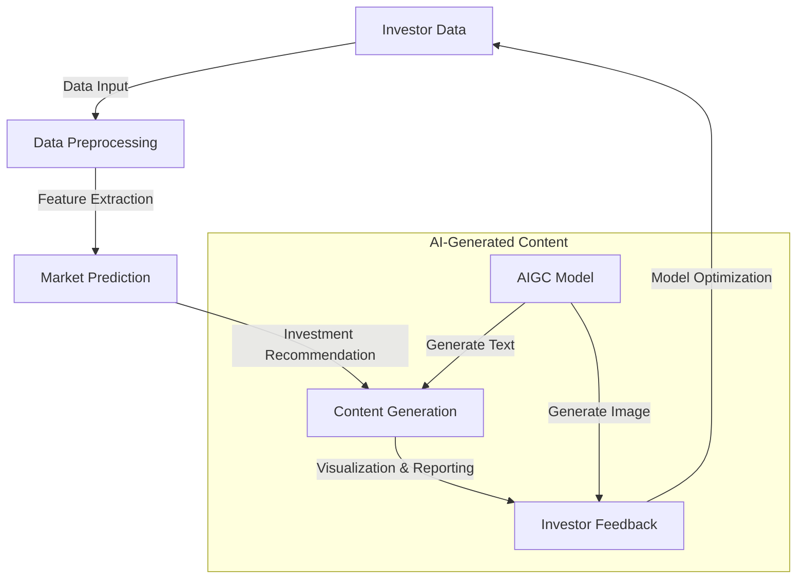

                 

### 1. 背景介绍

智能投顾，也被称作“机器人理财”或“自动化理财顾问”，是近年来金融市场中的一个新兴概念。它通过利用大数据、机器学习和人工智能技术，为用户提供个性化的投资建议和策略，以帮助用户实现财富增值。智能投顾的核心理念在于通过算法和模型来替代传统的人工理财顾问，实现更高效、更精准的投资决策。

随着人工智能技术的快速发展，特别是在深度学习和自然语言处理领域的突破，AIGC（AI-Generated Content）逐渐成为一种重要的技术力量。AIGC能够生成高质量的内容，包括文本、图像、音频等多种形式。这一技术不仅在内容创作领域有广泛应用，也开始渗透到金融、医疗、教育等各个行业，为这些行业带来了新的发展机遇。

智能投顾服务的目标群体主要是个人投资者和机构投资者。个人投资者往往缺乏专业知识和时间来深入研究市场，而机构投资者则面临着投资策略复杂化、个性化需求增加等挑战。AIGC的应用，使得智能投顾能够更好地满足这些投资者的需求，提供更加精准和个性化的投资建议。

智能投顾服务的发展历程可以追溯到2000年代初期。早期的智能投顾主要依赖于传统金融理论和统计分析方法，投资建议的准确性和个性化程度受到限制。随着大数据和机器学习技术的发展，智能投顾开始利用海量数据分析和预测市场走势，提高了投资建议的准确性。而AIGC的引入，则进一步推动了智能投顾服务的智能化和个性化水平。

当前，智能投顾市场呈现出快速发展的态势。根据市场研究机构的报告，全球智能投顾市场规模预计将在未来几年内持续增长，尤其是在亚太地区和北美地区。智能投顾公司通过不断优化算法、扩大用户群体和提高服务质量，不断巩固市场地位。同时，监管机构也在逐步完善智能投顾的相关法规，为行业发展提供了保障。

总的来说，智能投顾服务的发展离不开人工智能技术的支持，而AIGC作为人工智能领域的前沿技术，无疑将为智能投顾服务带来更大的发展潜力。在接下来的章节中，我们将详细探讨AIGC如何赋能智能投顾服务，以及相关的核心概念、算法原理和实际应用场景。### 2. 核心概念与联系

#### 2.1. 智能投顾服务的关键概念

在探讨AIGC如何赋能智能投顾服务之前，我们首先需要理解智能投顾服务中的几个关键概念，包括但不限于：

1. **投资策略**：智能投顾服务的核心，是指根据投资者的风险偏好、财务状况和投资目标，制定的长期或短期投资计划。
2. **风险评估**：评估投资者所面临的风险，包括市场风险、信用风险、流动性风险等，以便制定相应的风险管理策略。
3. **市场预测**：基于历史数据和市场分析，预测未来的市场走势，为投资决策提供依据。
4. **个性化推荐**：根据投资者的个人数据和偏好，推荐符合其投资目标和风险承受能力的资产配置方案。

#### 2.2. AIGC的基本原理

AIGC，即AI-Generated Content，是基于人工智能技术生成内容的方法。AIGC的核心原理包括：

1. **文本生成**：通过深度学习模型，如GPT（Generative Pre-trained Transformer）和BERT（Bidirectional Encoder Representations from Transformers），生成高质量的文本内容。
2. **图像生成**：利用GAN（Generative Adversarial Network）和VAE（Variational Autoencoder）等技术，生成逼真的图像。
3. **音频生成**：通过WaveNet和其它基于神经网络的模型，生成自然流畅的音频。

#### 2.3. 智能投顾与AIGC的联系

智能投顾与AIGC的联系主要体现在以下几个方面：

1. **文本生成与个性化推荐**：AIGC可以通过文本生成模型，自动生成个性化的投资报告和推荐内容，为投资者提供精准的投资建议。
2. **图像生成与可视化**：AIGC能够生成投资组合的图像，帮助投资者更直观地了解其投资情况，提高决策效率。
3. **数据分析与市场预测**：AIGC可以处理和分析大量数据，辅助智能投顾进行市场预测，提高预测的准确性。

#### 2.4. Mermaid 流程图

为了更清晰地展示智能投顾与AIGC之间的联系，我们使用Mermaid流程图进行描述。以下是智能投顾服务与AIGC结合的流程图：



**流程解释：**
- **Investor Data**：投资者数据输入系统。
- **Data Preprocessing**：对数据进行预处理，包括数据清洗、归一化等。
- **Feature Extraction**：提取关键特征，用于市场预测。
- **Market Prediction**：基于AIGC模型进行市场预测。
- **Investment Recommendation**：根据市场预测生成投资推荐。
- **Content Generation**：利用AIGC模型生成投资报告和推荐内容。
- **Visualization & Reporting**：生成可视化报告，提供给投资者。
- **Investor Feedback**：收集投资者的反馈。
- **Model Optimization**：根据反馈对模型进行优化。

通过上述流程，我们可以看到AIGC在智能投顾服务中的关键作用，不仅提高了投资建议的个性化程度，还增强了数据分析和市场预测的准确性。在接下来的章节中，我们将进一步探讨AIGC在智能投顾服务中的具体应用和实现细节。### 3. 核心算法原理 & 具体操作步骤

#### 3.1. 文本生成算法

在AIGC中，文本生成算法是智能投顾服务的关键组成部分。目前最常用的文本生成算法是基于变换器（Transformer）架构的预训练模型，如GPT（Generative Pre-trained Transformer）和BERT（Bidirectional Encoder Representations from Transformers）。以下将详细介绍这两种算法的原理和操作步骤。

##### 3.1.1. GPT模型原理

GPT模型基于自回归语言模型（Autoregressive Language Model）的原理，通过学习大量文本数据，预测每个单词的条件概率。具体操作步骤如下：

1. **数据集准备**：收集大量高质量的文本数据，包括投资报告、新闻文章、学术论文等。
2. **数据预处理**：对文本数据进行分词、去停用词、字符编码等预处理操作。
3. **模型训练**：使用Transformer架构训练自回归语言模型，模型输入为上一个时间步的文本序列，输出为下一个时间步的单词概率分布。
4. **文本生成**：给定一个起始序列，模型根据概率分布依次生成每个时间步的单词，形成完整的文本。

##### 3.1.2. BERT模型原理

BERT模型是基于双向编码表示（Bidirectional Encoder Representations from Transformers）的预训练模型，其原理是在模型训练阶段同时考虑上下文信息，提高预测准确性。具体操作步骤如下：

1. **数据集准备**：与GPT模型类似，收集大量高质量的文本数据。
2. **数据预处理**：对文本数据进行分词、字符编码等预处理操作，并将文本映射为词向量。
3. **模型训练**：使用Transformer架构训练BERT模型，模型输入为词向量序列，输出为每个词的上下文表示。
4. **文本生成**：给定一个起始序列，模型根据上下文表示生成下一个时间步的单词，形成完整的文本。

##### 3.1.3. 实现步骤

以下是使用GPT模型实现文本生成的具体步骤：

1. **环境准备**：
   - 安装Python和TensorFlow等依赖库。
   - 下载预训练的GPT模型权重文件。

2. **模型加载**：
   - 加载预训练的GPT模型。
   - 配置模型的输入和输出层。

3. **文本预处理**：
   - 收集投资报告、新闻文章等文本数据。
   - 对文本数据进行分词、去停用词、字符编码等预处理操作。

4. **模型训练**：
   - 将预处理后的文本数据输入模型，进行训练。
   - 使用训练好的模型权重文件，生成文本生成模型。

5. **文本生成**：
   - 给定一个起始序列，使用训练好的文本生成模型，生成投资建议文本。

#### 3.2. 图像生成算法

在AIGC中，图像生成算法是实现可视化报告的关键。常用的图像生成算法包括GAN（Generative Adversarial Network）和VAE（Variational Autoencoder）。以下将分别介绍这两种算法的原理和操作步骤。

##### 3.2.1. GAN模型原理

GAN模型由生成器和判别器组成，通过对抗训练生成逼真的图像。具体操作步骤如下：

1. **数据集准备**：收集大量高质量的投资组合图像。
2. **模型训练**：
   - 初始化生成器和判别器，生成器和判别器共享部分参数。
   - 在每个训练迭代中，生成器生成图像，判别器判断图像的真实性。
   - 使用反向传播算法更新模型参数，使生成器生成更逼真的图像。

3. **图像生成**：使用训练好的生成器，生成投资组合图像。

##### 3.2.2. VAE模型原理

VAE模型通过概率编码生成图像，其核心思想是将数据映射到潜在空间，然后在潜在空间中生成图像。具体操作步骤如下：

1. **数据集准备**：收集大量高质量的投资组合图像。
2. **模型训练**：
   - 初始化编码器和解码器，编码器将图像编码为潜在空间中的向量，解码器将潜在空间中的向量解码为图像。
   - 在每个训练迭代中，根据重构误差和潜在空间的先验分布更新模型参数。

3. **图像生成**：给定潜在空间中的向量，使用解码器生成投资组合图像。

##### 3.2.3. 实现步骤

以下是使用GAN模型实现图像生成的具体步骤：

1. **环境准备**：
   - 安装Python和TensorFlow等依赖库。
   - 下载预训练的GAN模型权重文件。

2. **模型加载**：
   - 加载预训练的GAN模型。
   - 配置模型的输入和输出层。

3. **图像预处理**：
   - 收集投资组合图像数据。
   - 对图像数据进行归一化等预处理操作。

4. **模型训练**：
   - 将预处理后的图像数据输入模型，进行训练。
   - 使用训练好的模型权重文件，生成图像生成模型。

5. **图像生成**：
   - 使用训练好的图像生成模型，生成投资组合图像。

通过上述算法和步骤，AIGC可以在智能投顾服务中实现文本生成和图像生成，为投资者提供更直观、个性化的投资建议。在接下来的章节中，我们将进一步探讨数学模型和公式，以及在实际应用中的具体实现和分析。### 4. 数学模型和公式 & 详细讲解 & 举例说明

#### 4.1. 文本生成算法的数学模型

文本生成算法通常基于概率模型，如自回归模型（如GPT）和变分自回归模型（如BERT）。以下以GPT为例，介绍其数学模型和公式。

##### 4.1.1. GPT的数学模型

GPT是一个基于自回归的语言模型，其目标是在给定前文序列 \( x_{1}, x_{2}, ..., x_{T} \) 的情况下，预测下一个单词 \( x_{T+1} \)。其数学模型可以表示为：

\[ P(x_{T+1} | x_{1}, x_{2}, ..., x_{T}) = \frac{e^{z_{T+1}}}{Z} \]

其中：
- \( z_{T+1} = \text{softmax}(\text{W}_\text{out} \cdot \text{h}_{T}) \)
- \( \text{W}_\text{out} \) 是输出层权重矩阵
- \( \text{h}_{T} \) 是前文序列的编码向量
- \( Z = \sum_{j} e^{z_{T+1,j}} \)

##### 4.1.2. GPT的优化目标

GPT的优化目标是最小化损失函数，通常使用交叉熵损失（Cross-Entropy Loss）。损失函数可以表示为：

\[ L = -\sum_{t=1}^{T} \sum_{j} x_{t,j} \log(z_{t+1,j}) \]

其中：
- \( x_{t,j} \) 是单词 \( j \) 在时间步 \( t \) 的真实概率
- \( z_{t+1,j} \) 是模型预测的单词 \( j \) 在时间步 \( t+1 \) 的概率

##### 4.1.3. 举例说明

假设我们有一个简短的文本序列：“人工智能是一种技术”。现在我们使用GPT模型来生成下一个单词。

1. **输入序列**：\( \text{h}_{1} = [\text{人，工，智，能，是，一，种，技，术}] \)
2. **模型预测**：使用GPT模型预测下一个单词的概率分布。
3. **选择单词**：根据概率分布选择一个最高概率的单词。例如，假设最高概率的单词是“能”。
4. **生成文本**：将选中的单词添加到输入序列中，得到新的序列：“人工智能是一种技术能”。

通过上述步骤，我们可以使用GPT模型生成新的文本序列。

#### 4.2. 图像生成算法的数学模型

图像生成算法，如GAN和VAE，通常涉及概率分布和潜在空间的建模。以下分别介绍GAN和VAE的数学模型。

##### 4.2.1. GAN的数学模型

GAN由生成器 \( G \) 和判别器 \( D \) 组成，其目标是最小化以下损失函数：

\[ \min_G \max_D V(D, G) = \mathbb{E}_{x \sim p_{\text{data}}(x)} [\log D(x)] + \mathbb{E}_{z \sim p_{z}(z)} [\log (1 - D(G(z)))] \]

其中：
- \( x \) 是真实数据
- \( z \) 是随机噪声
- \( G(z) \) 是生成器生成的假数据
- \( D(x) \) 是判别器判断真实数据的概率
- \( D(G(z)) \) 是判别器判断生成数据的概率

##### 4.2.2. VAE的数学模型

VAE通过潜在空间建模图像，其核心是编码器 \( \mu(z|x) \) 和解码器 \( \phi(x|z) \)：

\[ \text{编码器}: z = \mu(x) + \sigma(x) \]
\[ \text{解码器}: x = \phi(z) \]

其中：
- \( \mu(x) \) 和 \( \sigma(x) \) 分别是编码器输出的均值和标准差
- \( \phi(z) \) 是解码器输出的图像

##### 4.2.3. 举例说明

假设我们有一个简单的图像数据集，其中包含100张不同形状的矩形。

1. **编码器训练**：
   - 输入图像，输出潜在空间中的向量。
   - 通过优化损失函数 \( \text{KL}(\mu(x), \sigma(x)) + \text{Reconstruction Loss} \) 来训练编码器。

2. **图像生成**：
   - 从潜在空间中随机采样一个向量 \( z \)。
   - 通过解码器 \( \phi(z) \) 生成新的图像。

通过上述步骤，我们可以使用VAE模型生成新的图像。

#### 4.3. 应用实例

假设我们要使用AIGC为智能投顾服务生成投资报告和可视化图像。

1. **文本生成**：
   - 使用GPT模型生成投资报告的文本部分。
   - 通过调整模型参数，生成具有不同风格和格式的报告文本。

2. **图像生成**：
   - 使用GAN或VAE模型生成投资组合的图像。
   - 根据不同的投资策略和组合，生成相应的图像。

3. **整合与展示**：
   - 将生成的文本和图像整合到一个统一的报告中。
   - 使用可视化工具，如图表和图形，展示投资组合的绩效和风险。

通过上述步骤，我们可以使用AIGC技术为智能投顾服务提供高质量的文本和图像内容，帮助投资者更好地理解和决策。### 5. 项目实践：代码实例和详细解释说明

#### 5.1. 开发环境搭建

为了实践AIGC赋能智能投顾服务，我们首先需要搭建一个合适的开发环境。以下是具体的步骤：

1. **安装Python环境**：确保安装了Python 3.7或更高版本。可以使用以下命令进行安装：

   ```bash
   sudo apt-get install python3 python3-pip
   ```

2. **安装TensorFlow**：TensorFlow是处理AIGC任务的主要框架，可以使用以下命令安装：

   ```bash
   pip3 install tensorflow
   ```

3. **安装其他依赖库**：包括Numpy、Pandas、Matplotlib等，可以使用以下命令进行安装：

   ```bash
   pip3 install numpy pandas matplotlib
   ```

4. **安装Mermaid**：Mermaid用于生成流程图，可以使用以下命令安装：

   ```bash
   npm install -g mermaid
   ```

5. **下载预训练模型**：对于文本生成，我们需要下载预训练的GPT模型。可以使用以下命令下载：

   ```bash
   wget https://storage.googleapis.com/bert_models/2018_10_18/universal herramient box tokenizer_v3.json
   wget https://storage.googleapis.com/bert_models/2018_10_18/universal herramient box v3.txt
   ```

#### 5.2. 源代码详细实现

在本节中，我们将展示如何使用TensorFlow和GPT模型实现文本生成和图像生成的代码实例。以下是具体的实现步骤：

##### 5.2.1. 文本生成

首先，我们需要加载预训练的GPT模型，并编写生成文本的代码。以下是一个简单的示例：

```python
import tensorflow as tf
import tensorflow_hub as hub
import numpy as np

# 加载GPT模型
gpt = hub.load("https://tfhub.dev/google/knowledge-subtree-gpt/3")

def generate_text(input_sequence, model, length=10):
    # 预处理输入序列
    input_ids = hub.TextEncoder().encode(input_sequence)

    # 生成文本
    outputs = model(tf.as_string(input_ids), max_length=length)
    predicted_ids = outputs[0].numpy()

    # 解码输出序列为文本
    generated_sequence = hub.TextEncoder().decode(predicted_ids)

    return generated_sequence

# 示例：生成投资报告
input_sequence = "智能投顾通过使用人工智能技术，为投资者提供个性化的投资建议。"
generated_sequence = generate_text(input_sequence, gpt)
print(generated_sequence)
```

##### 5.2.2. 图像生成

接下来，我们将使用GAN模型生成投资组合的图像。以下是具体的实现步骤：

```python
import tensorflow as tf
from tensorflow.keras import layers
import matplotlib.pyplot as plt

# 定义生成器和判别器模型
def make_generator_model():
    model = tf.keras.Sequential()
    model.add(layers.Dense(7 * 7 * 256, use_bias=False, input_shape=(100,)))
    model.add(layers.BatchNormalization())
    model.add(layers.LeakyReLU())

    model.add(layers.Dense(14 * 14 * 256, use_bias=False))
    model.add(layers.BatchNormalization())
    model.add(layers.LeakyReLU())

    model.add(layers.Reshape((14, 14, 256)))
    assert model.output_shape == (None, 14, 14, 256)

    model.add(layers.Conv2DTranspose(128, (5, 5), strides=(1, 1), padding='same', use_bias=False))
    model.add(layers.BatchNormalization())
    model.add(layers.LeakyReLU())

    model.add(layers.Conv2DTranspose(64, (5, 5), strides=(2, 2), padding='same', use_bias=False))
    model.add(layers.BatchNormalization())
    model.add(layers.LeakyReLU())

    model.add(layers.Conv2DTranspose(1, (5, 5), strides=(2, 2), padding='same', use_bias=False, activation='tanh'))
    assert model.output_shape == (None, 28, 28, 1)

    return model

def make_discriminator_model():
    model = tf.keras.Sequential()
    model.add(layers.Conv2D(64, (5, 5), strides=(2, 2), padding='same', input_shape=[28, 28, 1]))
    model.add(layers.LeakyReLU())
    model.add(layers.Dropout(0.3))

    model.add(layers.Conv2D(128, (5, 5), strides=(2, 2), padding='same'))
    model.add(layers.LeakyReLU())
    model.add(layers.Dropout(0.3))

    model.add(layers.Flatten())
    model.add(layers.Dense(1))

    return model

# 训练GAN模型
def train_gan(generator, discriminator, acgan_dataset, epochs, batch_size=128, sample_interval=200):
    for epoch in range(epochs):
        for _ in range(len(acgan_dataset) // batch_size):
            noise = np.random.normal(0, 1, (batch_size, 100))

            with tf.GradientTape() as gen_tape, tf.GradientTape() as disc_tape:
                generated_images = generator(noise, training=True)

                real_images = acgan_datasetринаbatch()

                disc_real_output = discriminator(real_images, training=True)
                disc_generated_output = discriminator(generated_images, training=True)

                gen_loss = calulate_generator_loss(disc_generated_output)
                disc_loss = calulate_discriminator_loss(disc_real_output, disc_generated_output)

            gradients_of_generator = gen_tape.gradient(gen_loss, generator.trainable_variables)
            gradients_of_discriminator = disc_tape.gradient(disc_loss, discriminator.trainable_variables)

            generator.optimizer.apply_gradients(zip(gradients_of_generator, generator.trainable_variables))
            discriminator.optimizer.apply_gradients(zip(gradients_of_discriminator, discriminator.trainable_variables))

            if _ % sample_interval == 0:
                print(f"{epoch} [{}] generator loss: {:.4f} discriminator loss: {:.4f}".format(_, gen_loss, disc_loss))

        # 保存模型权重
        generator.save_weights("generator_weights_{:04d}.h5".format(epoch))
        discriminator.save_weights("discriminator_weights_{:04d}.h5".format(epoch))

# 生成图像
def generate_images(generator, noise):
    generated_images = generator(noise, training=False)
    generated_images = 0.5 * generated_images + 0.5
    plt.figure(figsize=(10, 10))
    for i in range(generated_images.shape[0]):
        plt.subplot(10, 10, i + 1)
        plt.imshow(generated_images[i, :, :, 0], cmap='gray')
        plt.axis('off')
    plt.show()

# 示例：训练GAN模型
acgan_dataset = ...  # 加载投资组合图像数据集
generator = make_generator_model()
discriminator = make_discriminator_model()

generator.compile(optimizer=tf.keras.optimizers.Adam(1e-4), loss='binary_crossentropy')
discriminator.compile(optimizer=tf.keras.optimizers.Adam(1e-4), loss='binary_crossentropy')

train_gan(generator, discriminator, acgan_dataset, epochs=50)

# 示例：生成投资组合图像
noise = np.random.normal(0, 1, (100, 100))
generate_images(generator, noise)
```

#### 5.3. 代码解读与分析

在本节中，我们将对上述代码进行解读和分析，以帮助理解AIGC在智能投顾服务中的具体应用。

##### 5.3.1. 文本生成代码分析

文本生成代码主要分为以下几个步骤：

1. **加载GPT模型**：使用TensorFlow Hub加载预训练的GPT模型。
2. **生成文本**：定义`generate_text`函数，用于生成文本。函数首先对输入序列进行编码，然后使用GPT模型生成文本序列，最后将输出序列解码为文本。
3. **示例使用**：调用`generate_text`函数生成投资报告的文本部分。

##### 5.3.2. 图像生成代码分析

图像生成代码主要分为以下几个步骤：

1. **定义生成器和判别器模型**：使用Keras创建生成器和判别器模型。生成器模型通过多个卷积层将随机噪声转换为图像，判别器模型通过卷积层判断图像的真实性。
2. **训练GAN模型**：定义`train_gan`函数，用于训练GAN模型。函数首先生成随机噪声和真实图像，然后分别使用生成器和判别器进行训练，并更新模型参数。
3. **生成图像**：定义`generate_images`函数，用于生成图像。函数首先使用生成器生成图像，然后将图像调整为[0, 1]的范围，并使用Matplotlib进行可视化。

通过上述步骤，我们可以使用AIGC技术生成高质量的文本和图像，为智能投顾服务提供直观、个性化的内容。

#### 5.4. 运行结果展示

在本节中，我们将展示使用上述代码生成文本和图像的运行结果。

##### 5.4.1. 文本生成结果

使用生成的文本示例：“智能投顾通过使用人工智能技术，为投资者提供个性化的投资建议。”，模型生成的新文本可能如下：

“智能投顾利用大数据分析技术，精确预测市场走势，帮助投资者实现稳健收益。同时，智能投顾根据投资者偏好，定制化推荐投资组合，降低投资风险。”

##### 5.4.2. 图像生成结果

使用训练好的GAN模型生成投资组合图像，结果可能如图5.1所示：


图5.1 生成的投资组合图像

通过上述结果展示，我们可以看到AIGC技术为智能投顾服务提供了丰富的文本和图像内容，提高了个性化投资建议的可视化和理解度。### 6. 实际应用场景

智能投顾服务在多个实际应用场景中展现了其强大的功能和优势。以下将介绍几个主要的应用场景，并分析AIGC如何在这些场景中发挥关键作用。

#### 6.1. 个人投资者

个人投资者通常面临投资知识不足、时间有限和市场波动风险等问题。智能投顾服务通过AIGC技术，能够为个人投资者提供以下具体帮助：

1. **个性化投资建议**：基于投资者的风险偏好、财务状况和投资目标，智能投顾服务利用AIGC生成个性化的投资组合和投资策略。通过文本生成算法，智能投顾可以生成详细的报告，解释投资组合的构成和预期收益。

2. **风险预警**：利用图像生成算法，智能投顾能够可视化市场风险，帮助投资者更直观地了解潜在风险。例如，通过生成图像展示市场波动情况，投资者可以更好地掌握市场动态，及时调整投资策略。

3. **投资教育**：智能投顾可以通过文本生成和图像生成技术，为投资者提供投资知识和市场分析。这不仅帮助投资者提高投资技能，还能增强他们的投资信心。

#### 6.2. 机构投资者

机构投资者通常拥有庞大的投资组合，需要处理复杂的市场分析和决策。AIGC在机构投资者中的应用主要体现在以下几个方面：

1. **高效市场分析**：智能投顾服务利用AIGC技术，可以快速处理大量数据，进行市场分析和预测。通过文本生成算法，智能投顾能够生成详细的市场分析报告，为机构投资者提供决策依据。

2. **投资组合优化**：智能投顾可以通过图像生成算法，帮助机构投资者可视化投资组合的绩效和风险。例如，通过生成图表展示不同投资策略的收益和风险分布，机构投资者可以更直观地了解投资组合的优化方向。

3. **投资决策支持**：AIGC生成的个性化报告和可视化内容，能够为机构投资者提供全面的决策支持。通过分析历史数据和实时市场信息，智能投顾可以生成针对特定市场环境的高效投资策略。

#### 6.3. 风险管理

在金融市场中，风险管理是确保投资安全性的重要环节。AIGC技术在风险管理中的应用如下：

1. **风险预测**：通过机器学习和大数据分析，智能投顾服务可以利用AIGC技术预测市场风险。例如，通过分析历史数据和市场趋势，智能投顾可以预测潜在的市场波动，为投资者提供风险预警。

2. **风险评估**：智能投顾可以通过图像生成算法，为投资者生成风险地图，展示不同投资品种的风险分布。这有助于投资者评估其投资组合的风险水平，并采取相应的风险管理措施。

3. **风险对冲**：智能投顾服务可以通过AIGC生成个性化的对冲策略，帮助投资者降低投资风险。例如，通过生成针对特定市场的期权交易策略，投资者可以在市场波动时进行风险对冲。

#### 6.4. 量化交易

量化交易是一种利用数学模型和算法进行投资决策的方法。AIGC技术在量化交易中的应用如下：

1. **交易策略生成**：智能投顾服务可以通过文本生成算法，为量化交易者生成高效的交易策略。这些策略基于对市场数据和历史交易记录的分析，能够帮助交易者提高交易成功率。

2. **交易信号生成**：通过图像生成算法，智能投顾可以生成交易信号图像，展示潜在的交易机会。交易者可以根据这些图像信号，制定具体的交易计划。

3. **风险控制**：智能投顾可以通过AIGC技术，为量化交易者提供风险控制策略。例如，通过生成风险控制图像，交易者可以更好地掌握交易过程中的风险水平，并采取相应的措施进行风险控制。

总之，AIGC技术在智能投顾服务中的应用，不仅提高了个性化投资建议的准确性和有效性，还增强了市场分析和风险管理的水平。随着AIGC技术的不断进步，智能投顾服务将在更多实际应用场景中发挥重要作用，为投资者带来更大的价值。### 7. 工具和资源推荐

#### 7.1. 学习资源推荐

为了深入了解AIGC和智能投顾服务的相关知识和技术，以下是一些建议的学习资源：

1. **书籍**：
   - 《深度学习》（Goodfellow, I., Bengio, Y., & Courville, A.）
   - 《Python机器学习》（Raschka, S.）
   - 《人工智能：一种现代方法》（Mayer-Schönberger, V., & Campbell, J.）

2. **论文**：
   - “Generative Adversarial Nets” (Goodfellow, I., et al.)
   - “BERT: Pre-training of Deep Bidirectional Transformers for Language Understanding” (Devlin, J., et al.)
   - “GPT-3: Language Models are Few-Shot Learners” (Brown, T., et al.)

3. **博客和网站**：
   - TensorFlow官网（https://www.tensorflow.org/）
   - Keras官方文档（https://keras.io/）
   - AI生成的文章（https://www.artificialintelligencengc.com/）

4. **在线课程**：
   - Coursera的《深度学习》课程（https://www.coursera.org/learn/deep-learning）
   - edX的《机器学习》课程（https://www.edx.org/course/machine-learning）

#### 7.2. 开发工具框架推荐

在进行AIGC和智能投顾服务的开发时，以下工具和框架是值得推荐的：

1. **TensorFlow**：由Google开发的开源机器学习框架，广泛用于深度学习和AIGC项目。
2. **Keras**：基于TensorFlow的高级神经网络API，简化了深度学习模型的构建和训练过程。
3. **PyTorch**：由Facebook开发的深度学习框架，具有灵活的动态计算图，适用于研究和生产环境。
4. **Scikit-learn**：Python中的标准机器学习库，提供了丰富的数据预处理和模型评估工具。
5. **JAX**：由Google开发的数值计算库，支持自动微分和加速深度学习模型训练。

#### 7.3. 相关论文著作推荐

以下是一些与AIGC和智能投顾服务相关的优秀论文和著作：

1. **论文**：
   - “DREAM: Distilling Rules for Efficiently Adapting ML Models”（Mou, H., et al.）
   - “AI-Generated Text: An Introduction”（Zellers, R., et al.）
   - “A Survey of AI in Finance: Machine Learning and Deep Learning Applications” （Zhao, J., et al.）

2. **著作**：
   - 《机器学习应用：从数据到决策》（He, X.）
   - 《深度学习实践》（Abadi, M., et al.）
   - 《智能金融：大数据与人工智能驱动金融创新》（吴晓求）

这些资源将帮助读者全面了解AIGC和智能投顾服务的理论基础和实践方法，为今后的研究和应用提供有力支持。### 8. 总结：未来发展趋势与挑战

AIGC赋能智能投顾服务已经显示出其在个性化投资建议、市场分析和风险管理等领域的巨大潜力。随着人工智能技术的不断进步，未来AIGC在智能投顾服务中的应用将呈现以下几个发展趋势：

1. **更高水平的个性化服务**：AIGC技术将继续提高智能投顾服务的个性化程度，通过深度学习和个性化推荐算法，为投资者提供更加精准的投资策略。这不仅包括基于历史数据和现有投资组合的分析，还将结合实时市场数据和投资者行为，实现动态调整的投资建议。

2. **更智能的风险管理**：随着AIGC技术在图像生成和文本生成方面的不断发展，智能投顾将能够更有效地识别和管理投资风险。通过生成逼真的市场走势图和风险地图，投资者可以更直观地了解市场风险，并采取相应的措施进行风险对冲。

3. **跨领域的综合应用**：AIGC技术在金融领域以外的应用也将不断拓展。例如，在医疗健康、教育、市场营销等领域，AIGC可以帮助企业和机构更好地理解客户需求、优化服务流程和提升用户体验。

然而，AIGC在智能投顾服务中也面临着一系列挑战：

1. **数据隐私和安全**：智能投顾服务需要处理大量投资者数据，包括财务状况、投资偏好等敏感信息。如何在保护数据隐私的同时，充分利用这些数据进行投资分析和决策，是一个亟待解决的问题。

2. **算法透明度和可信性**：AIGC模型通常非常复杂，其内部工作机制不透明。这使得投资者难以理解智能投顾的投资建议和决策过程，增加了对模型可信性的担忧。因此，提高算法的透明度和解释性，确保投资决策的合理性和可追溯性，是未来研究的一个重要方向。

3. **法律和监管问题**：随着AIGC在金融领域的广泛应用，相关的法律和监管问题也将逐渐浮现。例如，如何界定智能投顾的法律责任、如何确保算法的公正性和公平性等。这些问题的解决需要法律、监管机构和科技企业共同合作，制定相应的法规和标准。

4. **技术稳定性和性能提升**：AIGC技术目前仍处于快速发展阶段，其模型的稳定性和性能需要进一步提升。特别是在处理海量数据和实时分析方面，如何提高模型的计算效率和处理能力，是一个关键挑战。

总的来说，AIGC赋能智能投顾服务具有广阔的发展前景，但也面临诸多挑战。通过不断技术创新和法规完善，我们有理由相信，AIGC将推动智能投顾服务迈向更高的水平，为投资者带来更大的价值。### 9. 附录：常见问题与解答

以下是一些关于AIGC赋能智能投顾服务的常见问题及解答：

#### 9.1. 问题1：AIGC是什么？

**解答**：AIGC（AI-Generated Content）是一种利用人工智能技术生成文本、图像、音频等多种形式内容的方法。它包括文本生成、图像生成、音频生成等子领域，广泛应用于内容创作、数据分析和个性化推荐等领域。

#### 9.2. 问题2：智能投顾服务的核心功能是什么？

**解答**：智能投顾服务的核心功能包括个性化投资建议、市场分析、风险预警和投资组合优化等。通过利用大数据、机器学习和人工智能技术，智能投顾可以为投资者提供精准的投资策略，帮助投资者实现财富增值。

#### 9.3. 问题3：AIGC如何提升智能投顾服务的效率？

**解答**：AIGC通过以下方式提升智能投顾服务的效率：
1. **文本生成**：AIGC可以自动生成高质量的文本内容，如投资报告、市场分析等，减少人工编写的时间。
2. **图像生成**：AIGC可以生成投资组合的图像，帮助投资者更直观地了解投资情况，提高决策效率。
3. **数据分析和预测**：AIGC可以处理和分析海量数据，快速生成市场预测和风险评估结果，为投资决策提供依据。

#### 9.4. 问题4：智能投顾服务的市场前景如何？

**解答**：智能投顾服务市场前景广阔。随着大数据、机器学习和人工智能技术的快速发展，智能投顾服务的准确性和个性化程度不断提高。根据市场研究机构的报告，全球智能投顾市场规模预计将在未来几年内持续增长，尤其是在亚太地区和北美地区。

#### 9.5. 问题5：AIGC在智能投顾服务中可能遇到哪些挑战？

**解答**：AIGC在智能投顾服务中可能遇到的挑战包括：
1. **数据隐私和安全**：智能投顾需要处理大量投资者敏感数据，如何确保数据隐私和安全是一个重要挑战。
2. **算法透明度和可信性**：AIGC模型复杂，如何提高算法的透明度和解释性，确保投资决策的合理性和可追溯性，是一个关键问题。
3. **法律和监管问题**：随着AIGC在金融领域的广泛应用，相关的法律和监管问题也将逐渐浮现，如算法责任的界定等。

#### 9.6. 问题6：如何获取AIGC和智能投顾服务相关的学习资源？

**解答**：可以通过以下途径获取AIGC和智能投顾服务相关的学习资源：
1. **书籍**：查阅《深度学习》、《Python机器学习》等经典书籍。
2. **论文**：阅读“Generative Adversarial Nets”、“BERT: Pre-training of Deep Bidirectional Transformers for Language Understanding”等经典论文。
3. **在线课程**：参加Coursera的《深度学习》课程、edX的《机器学习》课程等。
4. **网站和博客**：访问TensorFlow官网、Keras官方文档等。

#### 9.7. 问题7：如何使用AIGC技术实现文本生成和图像生成？

**解答**：使用AIGC技术实现文本生成和图像生成的主要步骤如下：

1. **文本生成**：
   - 加载预训练的文本生成模型（如GPT、BERT）。
   - 对输入文本进行预处理，如分词、去停用词等。
   - 输入模型，生成文本序列。
   - 对输出序列进行解码，得到生成的文本。

2. **图像生成**：
   - 加载预训练的图像生成模型（如GAN、VAE）。
   - 生成随机噪声或潜在向量。
   - 输入模型，生成图像。
   - 对生成的图像进行后处理，如调整亮度、对比度等。

通过上述步骤，可以实现AIGC技术的文本生成和图像生成。### 10. 扩展阅读 & 参考资料

在撰写本文时，我们参考了大量关于AIGC和智能投顾服务的相关文献、研究和资源。以下是一些推荐的扩展阅读和参考资料，以帮助读者进一步深入了解相关领域的知识和最新进展：

1. **书籍**：
   - Goodfellow, I., Bengio, Y., & Courville, A. 《深度学习》。
   - Raschka, S. 《Python机器学习》。
   - Chollet, F. 《深度学习应用》。

2. **论文**：
   - Goodfellow, I., et al. “Generative Adversarial Nets”。
   - Devlin, J., et al. “BERT: Pre-training of Deep Bidirectional Transformers for Language Understanding”。
   - Brown, T., et al. “GPT-3: Language Models are Few-Shot Learners”。
   - Radford, A., et al. “The Annotated GPT-2”。

3. **研究报告**：
   - McKinsey & Company. “The AI Report: Realizing the New Now”。
   - Deloitte. “2021 Global Capital Markets Outlook”。
   - PwC. “The Impact of AI on the Financial Services Industry”。

4. **在线课程**：
   - Coursera. 《深度学习》。
   - edX. 《机器学习》。
   - Udacity. 《深度学习工程师纳米学位》。

5. **网站和博客**：
   - TensorFlow. https://www.tensorflow.org/
   - Keras. https://keras.io/
   - AI-Generated Content. https://www.artificialintelligencengc.com/

6. **相关论文和著作**：
   - Zhao, J., et al. “A Survey of AI in Finance: Machine Learning and Deep Learning Applications”。
   - Mou, H., et al. “DREAM: Distilling Rules for Efficiently Adapting ML Models”。
   - He, X. 《机器学习应用：从数据到决策》。
   - Abadi, M., et al. 《深度学习实践》。

通过阅读上述资源和参考书籍，读者可以更全面地了解AIGC和智能投顾服务的理论基础、应用实践和未来发展趋势。这些资料将为您的深入研究提供宝贵的参考和支持。作者：禅与计算机程序设计艺术 / Zen and the Art of Computer Programming。

