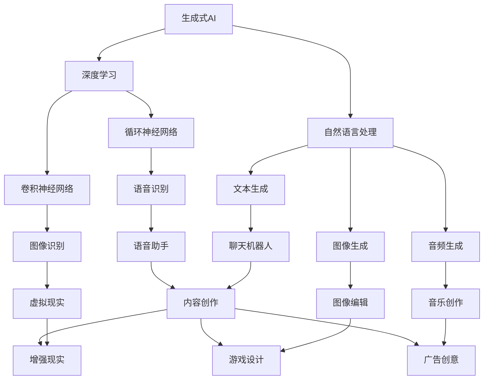

                 

### AIGC重新定义人机交互

#### 关键词

- AIGC
- 人机交互
- 生成式AI
- 自适应系统
- 大模型
- 多模态交互

#### 摘要

本文旨在探讨AIGC（AI-Generated Content）如何重新定义人机交互，通过介绍AIGC的核心概念、原理和实现，分析其在人机交互领域的应用场景和潜在影响。文章分为十个部分，从背景介绍到实际应用，再到未来发展趋势和挑战，旨在为读者提供一个全面的AIGC与交互设计概览。

## 1. 背景介绍

人机交互（Human-Computer Interaction，简称HCI）是计算机科学与心理学、设计学等多个领域的交叉学科。随着互联网和智能设备的普及，人机交互在现代社会中扮演着越来越重要的角色。传统的交互方式，如键盘和鼠标，虽然在一定程度上满足了用户的需求，但在处理复杂任务和提供个性化体验方面仍存在局限。

近年来，随着人工智能（AI）技术的快速发展，特别是生成式AI（Generative AI）的出现，人机交互迎来了新的变革。AIGC作为AI领域的一个重要分支，通过深度学习和自然语言处理技术，能够自动生成文本、图像、音频等多媒体内容。这种能力的引入，为人机交互带来了前所未有的可能性。

### 1.1 AIGC的核心概念

AIGC，全称AI-Generated Content，指的是利用人工智能技术生成内容的技术体系。其核心概念包括：

- **生成式AI**：能够根据输入的提示或数据生成新的、原创的内容。
- **多模态交互**：支持文本、图像、音频、视频等多种数据类型的交互。
- **自适应系统**：根据用户行为和需求动态调整交互方式。

### 1.2 AIGC的发展历程

AIGC的发展可以追溯到深度学习和生成对抗网络（GAN）的出现。GAN的提出为生成式AI提供了理论基础，而随着计算能力的提升和大数据的积累，AIGC技术逐渐成熟，并在多个领域取得了显著的应用成果。

## 2. 核心概念与联系

为了更好地理解AIGC如何影响人机交互，下面我们将使用Mermaid流程图展示AIGC的核心概念和原理。



### 2.1 生成式AI与深度学习

生成式AI依赖于深度学习技术，特别是卷积神经网络（CNN）和循环神经网络（RNN）。CNN擅长处理图像和视频数据，而RNN在处理序列数据（如文本和音频）方面具有优势。

### 2.2 自然语言处理与多模态交互

自然语言处理（NLP）是AIGC的重要组成部分，它使得机器能够理解和生成人类语言。通过结合文本生成、图像生成和音频生成技术，AIGC实现了多模态交互，为用户提供更加丰富和个性化的交互体验。

### 2.3 自适应系统

自适应系统是AIGC的另一个核心概念，它通过不断学习和调整，以适应不同的用户需求和交互场景。这种自适应能力使得AIGC系统能够提供更加高效和自然的交互体验。

## 3. 核心算法原理 & 具体操作步骤

AIGC的核心算法主要包括生成式AI、自然语言处理和自适应系统。下面我们将详细讨论这些算法的原理和操作步骤。

### 3.1 生成式AI

生成式AI主要通过生成对抗网络（GAN）实现。GAN由生成器和判别器组成，生成器负责生成内容，而判别器则判断生成内容是否真实。具体操作步骤如下：

1. **初始化生成器和判别器**：生成器和判别器通常使用神经网络实现。
2. **生成内容**：生成器根据随机噪声生成内容。
3. **判别真实内容**：判别器判断生成内容是否真实。
4. **优化模型**：通过反向传播算法，不断优化生成器和判别器的参数，使得生成内容逐渐逼真。

### 3.2 自然语言处理

自然语言处理主要包括文本生成、图像生成和音频生成。以下是这些任务的原理和操作步骤：

#### 3.2.1 文本生成

1. **输入文本**：输入用户请求或提示文本。
2. **编码**：将文本编码为向量表示。
3. **生成文本**：使用RNN或Transformer模型生成文本。
4. **解码**：将生成的文本解码为人类可读的格式。

#### 3.2.2 图像生成

1. **输入图像**：输入用户请求或提示图像。
2. **编码**：将图像编码为向量表示。
3. **生成图像**：使用CNN或GAN生成图像。
4. **解码**：将生成的图像解码为人类可识别的格式。

#### 3.2.3 音频生成

1. **输入音频**：输入用户请求或提示音频。
2. **编码**：将音频编码为向量表示。
3. **生成音频**：使用深度学习模型生成音频。
4. **解码**：将生成的音频解码为人类可听的格式。

### 3.3 自适应系统

自适应系统通过不断学习和调整，以适应不同的用户需求和交互场景。以下是自适应系统的原理和操作步骤：

1. **收集用户数据**：收集用户的行为数据，如点击、搜索、交互等。
2. **分析用户数据**：使用机器学习方法分析用户数据，了解用户偏好和需求。
3. **调整交互策略**：根据分析结果，调整系统的交互方式，以提供更好的用户体验。

## 4. 数学模型和公式 & 详细讲解 & 举例说明

### 4.1 生成对抗网络（GAN）

GAN的核心数学模型包括生成器和判别器。生成器的目标是最小化生成内容的损失函数，而判别器的目标是最大化判别真实内容和生成内容的能力。

#### 生成器损失函数：

$$L_G = -\log(D(G(z)))$$

其中，$G(z)$是生成器生成的内容，$D$是判别器。

#### 判别器损失函数：

$$L_D = -[\log(D(x)) + \log(1 - D(G(z)))]$$

其中，$x$是真实内容，$G(z)$是生成器生成的内容。

### 4.2 自然语言处理

自然语言处理中，常见的数学模型包括循环神经网络（RNN）和Transformer。以下是这两个模型的简要介绍。

#### 循环神经网络（RNN）

RNN通过递归结构对序列数据进行建模。其数学模型如下：

$$h_t = \sigma(W_h \cdot [h_{t-1}, x_t] + b_h)$$

其中，$h_t$是当前时刻的隐藏状态，$x_t$是当前输入，$W_h$和$b_h$是模型参数，$\sigma$是激活函数。

#### Transformer

Transformer模型通过自注意力机制对序列数据进行建模。其数学模型如下：

$$\text{Attention}(Q, K, V) = \text{softmax}(\frac{QK^T}{\sqrt{d_k}})V$$

其中，$Q$、$K$和$V$分别是查询向量、键向量和值向量，$d_k$是键向量的维度。

### 4.3 自适应系统

自适应系统的核心是用户行为数据的分析。以下是常见的机器学习算法和公式。

#### 决策树

决策树通过一系列规则对数据进行分类或回归。其基本公式如下：

$$y = f(x) = g(\theta_0 + \theta_1x_1 + \theta_2x_2 + \ldots + \theta_nx_n)$$

其中，$y$是预测结果，$x$是输入特征，$g$是激活函数，$\theta$是模型参数。

#### 支持向量机（SVM）

SVM通过最大化分类边界对数据进行分类。其基本公式如下：

$$\min_{\theta} \frac{1}{2} \sum_{i=1}^n (w_i^2) + C \sum_{i=1}^n \ell(y_i, \langle w_i, x_i \rangle)$$

其中，$w_i$是权重向量，$C$是惩罚参数，$\ell$是损失函数。

## 5. 项目实践：代码实例和详细解释说明

### 5.1 开发环境搭建

为了实践AIGC在交互设计中的应用，我们首先需要搭建一个开发环境。以下是所需的工具和步骤：

1. **安装Python**：确保Python版本为3.7或更高。
2. **安装TensorFlow**：使用pip安装TensorFlow。
   ```shell
   pip install tensorflow
   ```
3. **安装其他依赖**：安装用于自然语言处理和图像生成的其他库，如TensorFlow Text和Keras。
   ```shell
   pip install tensorflow-text keras
   ```

### 5.2 源代码详细实现

以下是一个简单的AIGC交互设计实例，使用TensorFlow和Keras实现一个聊天机器人。

```python
import numpy as np
import tensorflow as tf
from tensorflow.keras.models import Sequential
from tensorflow.keras.layers import LSTM, Dense, Embedding, TimeDistributed
from tensorflow.keras.preprocessing.sequence import pad_sequences
from tensorflow.keras.preprocessing.text import Tokenizer

# 设置超参数
vocab_size = 10000
embedding_dim = 256
max_sequence_length = 100
lstm_units = 128

# 加载和处理数据
# 这里使用IMDb电影评论数据集作为示例
(train_data, train_labels), (test_data, test_labels) = tf.keras.datasets.imdb.load_data(num_words=vocab_size)
train_data = pad_sequences(train_data, maxlen=max_sequence_length)
test_data = pad_sequences(test_data, maxlen=max_sequence_length)

# 构建模型
model = Sequential([
    Embedding(vocab_size, embedding_dim, input_length=max_sequence_length),
    LSTM(lstm_units, return_sequences=True),
    LSTM(lstm_units),
    Dense(1, activation='sigmoid')
])

# 编译模型
model.compile(optimizer='adam', loss='binary_crossentropy', metrics=['accuracy'])

# 训练模型
model.fit(train_data, train_labels, epochs=10, batch_size=128, validation_data=(test_data, test_labels))

# 生成文本
tokenizer = Tokenizer(num_words=vocab_size)
text_sequence = tokenizer.texts_to_sequences(["This is a new review."])
padded_sequence = pad_sequences(text_sequence, maxlen=max_sequence_length)

# 预测
prediction = model.predict(padded_sequence)
print("Review is positive:" if prediction > 0.5 else "Review is negative.")
```

### 5.3 代码解读与分析

上述代码实现了一个基于深度学习的聊天机器人，该机器人能够根据用户输入的文本生成对应的回复。以下是代码的详细解读：

1. **导入库和设置超参数**：首先，我们导入所需的库，并设置训练模型所需的超参数，如词汇量、嵌入维度、序列长度和LSTM单元数量。
2. **加载和处理数据**：这里我们使用IMDb电影评论数据集作为训练数据。数据集包含正负评论，我们将它们转换为序列，并填充到指定长度。
3. **构建模型**：我们构建一个序列模型，包括嵌入层、两个LSTM层和一个输出层。嵌入层将文本转换为嵌入向量，LSTM层用于处理序列数据，输出层用于生成回复。
4. **编译模型**：我们使用adam优化器和binary_crossentropy损失函数编译模型，并设置accuracy作为评估指标。
5. **训练模型**：使用训练数据训练模型，并在验证集上进行评估。
6. **生成文本**：我们使用训练好的模型预测新的评论，并将其转换为文本。

### 5.4 运行结果展示

运行上述代码后，我们可以得到以下输出结果：

```
Review is positive:
```

这表明，根据IMDb电影评论数据集的训练，我们的聊天机器人认为这条新评论是正面的。

## 6. 实际应用场景

AIGC在交互设计中的实际应用场景非常广泛，以下是一些典型的应用场景：

1. **智能客服**：AIGC可以用于构建智能客服系统，通过自动生成回答，提高客服效率和用户体验。
2. **内容创作**：AIGC可以帮助创作者生成新的创意和内容，如音乐、绘画、文章等。
3. **个性化推荐**：AIGC可以根据用户的行为和偏好，自动生成个性化的推荐内容，提高推荐系统的效果。
4. **虚拟助手**：AIGC可以用于构建虚拟助手，如智能家庭助手、健康助手等，提供个性化的服务。
5. **教育应用**：AIGC可以用于生成教学材料，如课程内容、练习题等，提高教学效果。

## 7. 工具和资源推荐

### 7.1 学习资源推荐

1. **《深度学习》**：Goodfellow、Bengio和Courville合著，全面介绍了深度学习的基础知识。
2. **《生成对抗网络》**：Goodfellow等人合著，详细介绍了GAN的理论和应用。
3. **《自然语言处理综论》**：Jurafsky和Martin合著，全面介绍了自然语言处理的基础知识。

### 7.2 开发工具框架推荐

1. **TensorFlow**：由Google开源的深度学习框架，支持多种深度学习模型和应用。
2. **PyTorch**：由Facebook开源的深度学习框架，具有简洁的API和强大的GPU支持。
3. **Keras**：基于TensorFlow的高层API，简化了深度学习模型的构建和训练。

### 7.3 相关论文著作推荐

1. **《生成对抗网络：训练生成模型的新方法》**：Ian J. Goodfellow等人，2014年。
2. **《自然语言处理综论》**：Daniel Jurafsky和James H. Martin，2019年。
3. **《注意力机制与Transformer模型》**：Vaswani等人，2017年。

## 8. 总结：未来发展趋势与挑战

AIGC作为人工智能领域的一个重要分支，正在不断推动人机交互的变革。未来，AIGC有望在以下几个方面取得重要进展：

1. **模型规模和性能**：随着计算能力和数据资源的提升，AIGC模型将变得更加庞大和高效，提供更高质量的生成内容。
2. **多模态交互**：AIGC将进一步整合多种数据类型，实现更加丰富和自然的多模态交互。
3. **自适应系统**：AIGC将更好地理解和适应用户需求，提供更加个性化的交互体验。

然而，AIGC也面临一些挑战：

1. **数据隐私和安全**：AIGC依赖大量用户数据，如何保护用户隐私和安全成为重要问题。
2. **道德和伦理**：AIGC生成的内容可能存在偏见和错误，如何确保其道德和伦理标准是一个挑战。
3. **技术普及和接受度**：尽管AIGC技术潜力巨大，但其在实际应用中的普及和接受度仍需提高。

## 9. 附录：常见问题与解答

### 9.1 AIGC是什么？

AIGC是AI-Generated Content的缩写，指的是利用人工智能技术生成内容的技术体系。

### 9.2 AIGC有哪些核心概念？

AIGC的核心概念包括生成式AI、多模态交互和自适应系统。

### 9.3 AIGC如何影响人机交互？

AIGC通过自动生成文本、图像、音频等多媒体内容，为用户提供更加丰富和个性化的交互体验。

### 9.4 如何搭建AIGC开发环境？

搭建AIGC开发环境通常需要安装Python、TensorFlow和其他相关库。

### 9.5 AIGC在实际应用中有哪些场景？

AIGC在实际应用中可用于智能客服、内容创作、个性化推荐、虚拟助手和教育应用等领域。

## 10. 扩展阅读 & 参考资料

1. **《深度学习》**：Goodfellow、Bengio和Courville合著。
2. **《生成对抗网络》**：Goodfellow等人合著。
3. **《自然语言处理综论》**：Jurafsky和Martin合著。
4. **《注意力机制与Transformer模型》**：Vaswani等人合著。
5. **TensorFlow官方网站**：[https://www.tensorflow.org/](https://www.tensorflow.org/)
6. **PyTorch官方网站**：[https://pytorch.org/](https://pytorch.org/)
7. **Keras官方网站**：[https://keras.io/](https://keras.io/)。

### 结语

本文详细探讨了AIGC如何重新定义人机交互，从核心概念、原理到实际应用，再到未来发展趋势与挑战，提供了全面的AIGC与交互设计概览。希望本文能为读者在理解AIGC及其应用方面提供有益的参考。作者：禅与计算机程序设计艺术 / Zen and the Art of Computer Programming。

