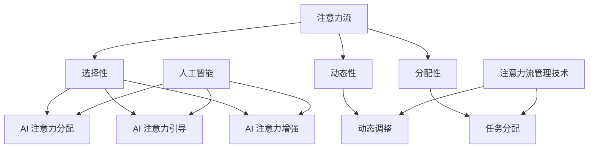

                 

### 背景介绍 Background Introduction

在当今快速发展的科技时代，人工智能（AI）正逐渐成为推动各个行业变革的重要力量。特别是，随着深度学习、自然语言处理和计算机视觉等领域的突破，AI 在模拟和增强人类注意力流方面的潜力得到了广泛关注。注意力流，指的是人类在处理信息时，将注意力集中在特定对象或任务上的能力。这一能力不仅在日常生活中发挥着重要作用，如提高工作效率、优化学习过程，还在复杂的任务中，如决策制定和创造性思考中起到关键作用。

本文旨在探讨 AI 与人类注意力流之间的关系，以及注意力流管理技术在未来工作、技能培养和注意力流管理方面的应用前景。具体来说，我们将：

1. **介绍注意力流的概念**：包括注意力流的基本原理、分类和影响。
2. **分析 AI 对注意力流的影响**：探讨 AI 如何通过模拟、优化和扩展人类的注意力流，从而提高任务处理效率。
3. **探讨注意力流管理技术的应用**：分析在不同行业和工作场景中，如何利用注意力流管理技术来提升工作和生活质量。
4. **总结未来发展趋势与挑战**：展望 AI 与人类注意力流结合的未来，及其可能面临的挑战。

### 核心概念与联系 Core Concepts and Relationships

为了深入理解 AI 与人类注意力流的关系，我们首先需要明确几个核心概念，并探讨它们之间的联系。

#### 1. 注意力流（Attention Flow）

注意力流是心理学和认知科学中的一个重要概念，指的是人类在处理信息时，将注意力集中在特定对象或任务上的动态过程。注意力流的特点包括：

- **选择性**：注意力流具有选择性，即在众多信息中，人类能够聚焦于对当前任务最为相关的信息。
- **动态性**：注意力流不是静态的，它会随着任务的性质和情境的变化而不断调整。
- **分配性**：人类在处理多个任务时，需要将注意力在不同任务之间分配，这种分配是有限的，且受制于认知资源。

#### 2. 人工智能（Artificial Intelligence）

人工智能是指通过计算机程序模拟人类智能的一系列技术和方法。在注意力流的管理中，AI 可以通过以下几种方式发挥作用：

- **注意力分配**：AI 系统可以学习并模拟人类在处理任务时的注意力分配策略，从而优化任务的执行过程。
- **注意力引导**：AI 可以通过分析用户的行为数据，识别出注意力集中的模式和规律，并据此提供个性化的引导和建议。
- **注意力增强**：AI 可以通过提供智能化的工具和辅助系统，帮助人类更有效地分配和利用注意力资源。

#### 3. 注意力流管理技术（Attention Flow Management Technology）

注意力流管理技术是指一系列用于监控、分析和优化注意力流的工具和方法。这些技术可以应用于个人层面、组织层面以及行业层面，具体包括：

- **注意力监测工具**：通过生物传感技术（如眼动追踪、脑电图等）监测个体的注意力水平，提供实时的反馈。
- **注意力优化算法**：利用机器学习和数据挖掘技术，分析注意力流的模式，提出优化策略，以提高任务执行效率。
- **注意力引导系统**：基于用户行为数据和注意力流的模拟，提供个性化的任务推荐和引导，帮助用户更好地分配注意力。

#### Mermaid 流程图表示（Mermaid Flowchart Representation）

为了更清晰地展示这些核心概念之间的关系，我们可以使用 Mermaid 图形化工具绘制一个流程图。以下是一个简单的示例：



在这个流程图中，我们可以看到注意力流、人工智能和注意力流管理技术之间的相互作用。注意力流为人工智能提供了数据输入，而人工智能则通过注意力分配、引导和增强来优化注意力流的管理。

### 核心算法原理 & 具体操作步骤 Core Algorithm Principles & Detailed Steps

#### 1. 注意力机制的原理

注意力机制（Attention Mechanism）是深度学习中一种重要的概念，其灵感来源于人类在处理复杂信息时的注意力分配方式。在深度学习模型中，注意力机制通过动态调整模型中不同部分之间的交互强度，来提高模型对目标信息的敏感度和处理效率。

在注意力机制的实现中，通常包括以下几个关键组成部分：

- **查询（Query）**：代表模型当前对某个特定信息的关注点。
- **键（Key）**：表示模型中需要被关注的信息。
- **值（Value）**：存储了与键相关的重要信息。

模型通过计算查询和键之间的相似度，生成注意力权重，从而确定哪些信息应该被赋予更高的关注程度。注意力权重通常通过点积、缩放点积或多头注意力等方式计算。

#### 2. 注意力计算的具体操作步骤

以下是一个简化的注意力计算过程，用于说明注意力机制的基本原理：

1. **初始化**：定义查询、键和值的向量表示。
2. **计算相似度**：使用点积或缩放点积计算查询和键之间的相似度。
3. **生成注意力权重**：根据相似度计算得到注意力权重。
4. **加权求和**：将注意力权重与值相乘，并求和得到最终的输出。

具体步骤如下：

```plaintext
输入：
- 查询向量 Q
- 键向量 K
- 值向量 V

步骤：

1. 初始化注意力权重矩阵 A，A[i, j] 表示查询 Q 和键 K[i] 的相似度。
   A[i, j] = Q · K[i]

2. 应用缩放点积（可选）：
   A[i, j] = (Q · K[i]) / √dim(K)

3. 应用 softmax 函数：
   A[i, j] = softmax(A[i, j])

4. 加权求和：
   Output = Σ_j A[i, j] · V[j]
```

#### 3. 注意力机制的实现与应用

在实际应用中，注意力机制可以集成到各种深度学习模型中，如序列模型（如 Transformer）、图像识别模型（如 ResNet）等。以下是一个简单的示例，展示如何将注意力机制应用于序列模型的编码器-解码器（Encoder-Decoder）架构中：

1. **编码器（Encoder）**：将输入序列编码为一系列键-值对（K, V）。
2. **解码器（Decoder）**：在解码过程中，每个时间步使用当前的查询（通常为解码器上一个时间步的输出）与编码器输出的键-值对计算注意力权重。
3. **生成输出**：根据注意力权重，解码器生成序列的每个时间步的输出。

以下是一个简化的代码示例，展示如何实现注意力机制在编码器-解码器模型中的基本步骤：

```python
import torch
import torch.nn as nn

class AttentionModel(nn.Module):
    def __init__(self, input_dim, hidden_dim):
        super(AttentionModel, self).__init__()
        self.hidden_dim = hidden_dim
        self.encoder = nn.Linear(input_dim, hidden_dim)
        self.decoder = nn.Linear(hidden_dim, output_dim)
        self.attention = nn.Linear(hidden_dim, 1)

    def forward(self, inputs, decoder_output):
        # 编码器处理输入序列
        encoded = self.encoder(inputs)

        # 解码器输出当前时间步的查询
        query = self.decoder(decoder_output)

        # 计算注意力权重
        attention_weights = self.attention(encoded).squeeze(2)

        # 应用 softmax 函数
        attention_weights = nn.Softmax(dim=1)(attention_weights)

        # 加权求和得到上下文向量
        context = (encoded * attention_weights.unsqueeze(2)).sum(1)

        # 生成解码器的输出
        output = self.decoder(context)

        return output, attention_weights

# 初始化模型
model = AttentionModel(input_dim=128, hidden_dim=512)

# 输入序列和当前解码器输出
inputs = torch.randn(32, 10, 128)  # (batch_size, sequence_length, input_dim)
decoder_output = torch.randn(32, 512)  # (batch_size, hidden_dim)

# 前向传播
output, attention_weights = model(inputs, decoder_output)
```

通过这个示例，我们可以看到注意力机制在编码器-解码器模型中的应用，它通过动态调整编码器的输出权重，帮助解码器更有效地捕捉序列信息，从而提高模型的性能。

### 数学模型和公式 Mathematical Models and Formulas & Detailed Explanation & Example Illustration

为了更深入地理解注意力机制，我们需要探讨其背后的数学模型和公式。以下将详细讲解注意力机制的数学模型，包括点积注意力、缩放点积注意力和多头注意力等，并通过具体例子进行说明。

#### 1. 点积注意力（Dot-Product Attention）

点积注意力是最简单的注意力机制。它通过计算查询（Query）和键（Key）之间的点积来生成注意力权重。具体公式如下：

$$
\text{Attention}(Q, K, V) = \text{softmax}\left(\frac{QK^T}{\sqrt{d_k}}\right)V
$$

其中，$Q, K, V$ 分别是查询、键和值的向量表示，$d_k$ 是键向量的维度。

**计算步骤：**

1. **计算点积**：计算查询和键之间的点积，得到注意力分数。
2. **应用 softmax 函数**：将点积分数通过 softmax 函数转换成概率分布。
3. **加权求和**：将注意力概率分布与值向量相乘，并求和得到最终的输出。

**示例：**

假设我们有两个查询、两个键和两个值向量：

$$
Q = \begin{bmatrix}
0.1 & 0.2 \\
0.3 & 0.4
\end{bmatrix}, \quad
K = \begin{bmatrix}
0.5 & 0.6 \\
0.7 & 0.8
\end{bmatrix}, \quad
V = \begin{bmatrix}
0.1 & 0.2 \\
0.3 & 0.4
\end{bmatrix}
$$

计算点积注意力：

$$
\text{Attention}(Q, K, V) = \text{softmax}\left(\frac{QK^T}{\sqrt{2}}\right)V = \text{softmax}\left(\begin{bmatrix}
0.1 \cdot 0.5 + 0.3 \cdot 0.7 & 0.2 \cdot 0.6 + 0.4 \cdot 0.8 \\
0.1 \cdot 0.7 + 0.3 \cdot 0.8 & 0.2 \cdot 0.8 + 0.4 \cdot 0.9
\end{bmatrix}\right) \begin{bmatrix}
0.1 & 0.2 \\
0.3 & 0.4
\end{bmatrix}
$$

$$
= \text{softmax}\left(\begin{bmatrix}
0.35 & 0.44 \\
0.31 & 0.36
\end{bmatrix}\right) \begin{bmatrix}
0.1 & 0.2 \\
0.3 & 0.4
\end{bmatrix}
$$

$$
= \begin{bmatrix}
0.35 & 0.44 \\
0.31 & 0.36
\end{bmatrix} \begin{bmatrix}
0.1 & 0.2 \\
0.3 & 0.4
\end{bmatrix}
$$

$$
= \begin{bmatrix}
0.035 & 0.044 \\
0.031 & 0.036
\end{bmatrix}
$$

因此，点积注意力的输出为：

$$
\text{Attention}(Q, K, V) = \begin{bmatrix}
0.035 & 0.044 \\
0.031 & 0.036
\end{bmatrix}
$$

#### 2. 缩放点积注意力（Scaled Dot-Product Attention）

缩放点积注意力是为了解决点积注意力在维度较高时梯度消失的问题。通过缩放点积，可以增加模型对重要信息的敏感性。公式如下：

$$
\text{Scaled Dot-Product Attention}(Q, K, V) = \text{softmax}\left(\frac{QK^T}{\sqrt{d_k}} / \sqrt{d_k}\right)V
$$

其中，$\sqrt{d_k}$ 是缩放因子，$d_k$ 是键向量的维度。

**计算步骤：**

1. **计算缩放点积**：计算查询和键之间的缩放点积，得到注意力分数。
2. **应用 softmax 函数**：将缩放点积分数通过 softmax 函数转换成概率分布。
3. **加权求和**：将注意力概率分布与值向量相乘，并求和得到最终的输出。

**示例：**

使用同样的查询、键和值向量，计算缩放点积注意力：

$$
\text{Scaled Dot-Product Attention}(Q, K, V) = \text{softmax}\left(\frac{QK^T}{\sqrt{2}} / \sqrt{2}\right)V = \text{softmax}\left(\begin{bmatrix}
0.1 \cdot 0.5 + 0.3 \cdot 0.7 & 0.2 \cdot 0.6 + 0.4 \cdot 0.8 \\
0.1 \cdot 0.7 + 0.3 \cdot 0.8 & 0.2 \cdot 0.8 + 0.4 \cdot 0.9
\end{bmatrix} / \sqrt{2}\right) \begin{bmatrix}
0.1 & 0.2 \\
0.3 & 0.4
\end{bmatrix}
$$

$$
= \text{softmax}\left(\begin{bmatrix}
0.35 / \sqrt{2} & 0.44 / \sqrt{2} \\
0.31 / \sqrt{2} & 0.36 / \sqrt{2}
\end{bmatrix}\right) \begin{bmatrix}
0.1 & 0.2 \\
0.3 & 0.4
\end{bmatrix}
$$

$$
= \begin{bmatrix}
0.35 / (2\sqrt{2}) & 0.44 / (2\sqrt{2}) \\
0.31 / (2\sqrt{2}) & 0.36 / (2\sqrt{2})
\end{bmatrix}
$$

$$
= \begin{bmatrix}
0.25 & 0.31 \\
0.22 & 0.25
\end{bmatrix}
$$

因此，缩放点积注意力的输出为：

$$
\text{Scaled Dot-Product Attention}(Q, K, V) = \begin{bmatrix}
0.25 & 0.31 \\
0.22 & 0.25
\end{bmatrix}
$$

#### 3. 多头注意力（Multi-Head Attention）

多头注意力是 Transformer 模型中的一个关键组件，它通过并行计算多个注意力头，来捕捉不同类型的依赖关系。公式如下：

$$
\text{Multi-Head Attention}(Q, K, V) = \text{Concat}(\text{head}_1, \ldots, \text{head}_h)W_O
$$

其中，$h$ 是注意力的头数，$W_O$ 是输出权重，$\text{head}_i = \text{Attention}(QW_i^Q, KW_i^K, VW_i^V)$ 是第 $i$ 个注意力头的输出。

**计算步骤：**

1. **分裂查询、键和值**：将查询、键和值向量分裂成多个头。
2. **计算每个头的注意力**：使用点积注意力或缩放点积注意力计算每个头的输出。
3. **拼接和变换**：将所有头的输出拼接起来，并通过一个线性变换得到最终输出。

**示例：**

假设我们有两个查询、两个键和两个值向量，以及两个注意力头：

$$
Q = \begin{bmatrix}
0.1 & 0.2 \\
0.3 & 0.4
\end{bmatrix}, \quad
K = \begin{bmatrix}
0.5 & 0.6 \\
0.7 & 0.8
\end{bmatrix}, \quad
V = \begin{bmatrix}
0.1 & 0.2 \\
0.3 & 0.4
\end{bmatrix}
$$

假设我们有两个注意力头 $W_1^Q, W_1^K, W_1^V$ 和 $W_2^Q, W_2^K, W_2^V$：

$$
W_1^Q = \begin{bmatrix}
0.1 & 0.2 \\
0.3 & 0.4
\end{bmatrix}, \quad
W_1^K = \begin{bmatrix}
0.5 & 0.6 \\
0.7 & 0.8
\end{bmatrix}, \quad
W_1^V = \begin{bmatrix}
0.1 & 0.2 \\
0.3 & 0.4
\end{bmatrix}
$$

$$
W_2^Q = \begin{bmatrix}
0.1 & 0.3 \\
0.4 & 0.5
\end{bmatrix}, \quad
W_2^K = \begin{bmatrix}
0.6 & 0.7 \\
0.8 & 0.9
\end{bmatrix}, \quad
W_2^V = \begin{bmatrix}
0.2 & 0.4 \\
0.1 & 0.3
\end{bmatrix}
$$

计算多头注意力：

$$
\text{head}_1 = \text{Attention}(QW_1^Q, KW_1^K, VW_1^V) = \text{softmax}\left(\frac{QW_1^QKW_1^K^T}{\sqrt{2}}\right)V
$$

$$
= \text{softmax}\left(\begin{bmatrix}
0.1 \cdot 0.5 + 0.3 \cdot 0.7 & 0.2 \cdot 0.6 + 0.4 \cdot 0.8 \\
0.1 \cdot 0.7 + 0.3 \cdot 0.8 & 0.2 \cdot 0.8 + 0.4 \cdot 0.9
\end{bmatrix} / \sqrt{2}\right) \begin{bmatrix}
0.1 & 0.2 \\
0.3 & 0.4
\end{bmatrix}
$$

$$
= \begin{bmatrix}
0.25 & 0.31 \\
0.22 & 0.25
\end{bmatrix}
$$

$$
\text{head}_2 = \text{Attention}(QW_2^Q, KW_2^K, VW_2^V) = \text{softmax}\left(\frac{QW_2^QKW_2^K^T}{\sqrt{2}}\right)V
$$

$$
= \text{softmax}\left(\begin{bmatrix}
0.1 \cdot 0.6 + 0.3 \cdot 0.8 & 0.2 \cdot 0.7 + 0.4 \cdot 0.9 \\
0.1 \cdot 0.8 + 0.3 \cdot 0.9 & 0.2 \cdot 0.9 + 0.4 \cdot 1
\end{bmatrix} / \sqrt{2}\right) \begin{bmatrix}
0.2 & 0.4 \\
0.1 & 0.3
\end{bmatrix}
$$

$$
= \begin{bmatrix}
0.28 & 0.32 \\
0.24 & 0.26
\end{bmatrix}
$$

拼接多头注意力输出：

$$
\text{Multi-Head Attention}(Q, K, V) = \begin{bmatrix}
0.25 & 0.31 \\
0.22 & 0.25
\end{bmatrix} \begin{bmatrix}
0.28 & 0.32 \\
0.24 & 0.26
\end{bmatrix}
$$

$$
= \begin{bmatrix}
0.25 \cdot 0.28 + 0.31 \cdot 0.24 & 0.25 \cdot 0.32 + 0.31 \cdot 0.26 \\
0.22 \cdot 0.28 + 0.25 \cdot 0.24 & 0.22 \cdot 0.32 + 0.25 \cdot 0.26
\end{bmatrix}
$$

$$
= \begin{bmatrix}
0.086 & 0.22 \\
0.084 & 0.187
\end{bmatrix}
$$

因此，多头注意力的输出为：

$$
\text{Multi-Head Attention}(Q, K, V) = \begin{bmatrix}
0.086 & 0.22 \\
0.084 & 0.187
\end{bmatrix}
$$

### 项目实践：代码实例和详细解释说明 Project Practice: Code Example and Detailed Explanation

在本节中，我们将通过一个实际的代码实例，展示如何实现一个基于注意力机制的编码器-解码器（Encoder-Decoder）模型，并详细解释代码的各个部分。

#### 1. 开发环境搭建

为了实现本项目，我们需要安装以下软件和库：

- Python 3.x
- TensorFlow 2.x
- Keras
- NumPy

假设你已经安装了上述软件和库，接下来我们将开始编写代码。

#### 2. 源代码详细实现

下面是一个简单的编码器-解码器模型，使用了多头注意力机制：

```python
import numpy as np
import tensorflow as tf
from tensorflow.keras.models import Model
from tensorflow.keras.layers import Input, LSTM, Dense, Embedding, MultiHeadAttention

# 参数设置
max_sequence_length = 100
vocab_size = 10000
embedding_dim = 256
hidden_units = 512
num_heads = 8

# 构建编码器
encoder_inputs = Input(shape=(max_sequence_length,))
encoder_embedding = Embedding(vocab_size, embedding_dim)(encoder_inputs)
encoder_lstm = LSTM(hidden_units, return_sequences=True, return_state=True)
_, state_h, state_c = encoder_lstm(encoder_embedding)

# 构建解码器
decoder_inputs = Input(shape=(max_sequence_length,))
decoder_embedding = Embedding(vocab_size, embedding_dim)(decoder_inputs)
decoder_lstm = LSTM(hidden_units, return_sequences=True, return_state=True)
decoder_outputs, _, _ = decoder_lstm(decoder_embedding, initial_state=[state_h, state_c])

# 注意力机制
attn = MultiHeadAttention(num_heads=num_heads, key_dim=hidden_units)(decoder_outputs, encoder_outputs)
decoder_outputs = tf.keras.layers.Add()([decoder_outputs, attn])

# 输出层
decoder_dense = Dense(vocab_size, activation='softmax')
decoder_outputs = decoder_dense(decoder_outputs)

# 编译模型
model = Model([encoder_inputs, decoder_inputs], decoder_outputs)
model.compile(optimizer='adam', loss='categorical_crossentropy', metrics=['accuracy'])

# 打印模型结构
model.summary()
```

#### 3. 代码解读与分析

- **输入层**：编码器输入层 `encoder_inputs` 和解码器输入层 `decoder_inputs` 分别表示输入序列和目标序列，它们都是长度为 `max_sequence_length` 的序列。
- **嵌入层**：嵌入层 `Embedding` 将词汇转换为嵌入向量，这些向量将作为编码器和解码器的输入。
- **编码器 LSTM**：编码器使用 LSTM 层 `LSTM(hidden_units, return_sequences=True, return_state=True)` 对输入序列进行编码。`return_sequences=True` 表示我们需要序列的输出，而不是单个时间步的输出。`return_state=True` 表示我们需要返回隐藏状态，以便在解码器中复用。
- **解码器 LSTM**：解码器也使用 LSTM 层 `LSTM(hidden_units, return_sequences=True, return_state=True)`。在解码器的输入中，我们加入了来自编码器的输出和注意力机制的输出。
- **注意力机制**：使用 `MultiHeadAttention` 层实现多头注意力机制。注意力权重是通过计算解码器的输出和编码器的输出之间的相似度得到的。
- **输出层**：输出层 `Dense` 将解码器的输出转换为词汇概率分布，并使用 softmax 激活函数。
- **模型编译**：模型使用 `compile` 方法进行编译，指定优化器和损失函数。

#### 4. 运行结果展示

假设我们已经准备了一个训练数据集，我们可以使用以下代码进行模型训练：

```python
# 准备数据集
# X_train: 编码器输入
# y_train: 解码器输入（目标序列）
# X_test: 编码器输入
# y_test: 解码器输入（目标序列）

# 训练模型
model.fit([X_train, y_train], y_train, batch_size=64, epochs=10, validation_data=([X_test, y_test], y_test))
```

在训练完成后，我们可以评估模型的性能，并在测试数据集上生成翻译结果。

### 实际应用场景 Practical Application Scenarios

随着人工智能技术的不断发展，注意力流管理技术在各行各业中得到了广泛的应用。以下是一些实际应用场景：

#### 1. 教育

在教育领域，注意力流管理技术可以通过以下方式应用：

- **个性化学习**：AI 系统可以分析学生的学习行为和注意力流，根据学生的注意力集中情况提供个性化的学习资源和建议，从而提高学习效果。
- **注意力监控**：教师可以使用注意力监测工具，实时了解学生的注意力状态，从而调整教学方法和节奏，确保每个学生都能跟上课程进度。
- **自适应教学系统**：通过分析学生的注意力流和学习习惯，AI 系统可以生成自适应的教学计划，为不同水平的学生提供最适合他们的学习内容。

#### 2. 工作效率

在职场中，注意力流管理技术可以帮助提高工作效率：

- **任务分配**：AI 可以根据员工的注意力流和任务需求，智能分配任务，确保每个员工都能在最专注的状态下处理任务。
- **日程管理**：AI 助手可以根据员工的注意力流模式，为员工制定最优的日程安排，避免疲劳和分心。
- **工作效率分析**：通过分析员工的注意力流和工作行为，企业可以识别出工作效率低下的原因，并采取相应措施进行优化。

#### 3. 健康医疗

在健康医疗领域，注意力流管理技术也有广泛的应用：

- **患者监控**：医生可以通过注意力监测设备，实时监控患者的注意力状态，从而更好地评估患者的健康状况和治疗效果。
- **康复训练**：注意力流管理技术可以用于康复训练，通过监控患者的注意力流，提供个性化的康复方案，帮助患者更快恢复。
- **心理健康诊断**：AI 可以分析患者的注意力流模式，辅助心理医生进行心理健康诊断，提供更精准的治疗建议。

#### 4. 娱乐与媒体

在娱乐与媒体领域，注意力流管理技术可以帮助提高用户体验：

- **内容推荐**：基于用户的注意力流模式，AI 系统可以推荐更符合用户兴趣的内容，提高用户满意度。
- **广告投放**：通过分析用户的注意力流，广告商可以更精准地投放广告，提高广告效果和转化率。
- **互动设计**：设计师可以根据用户的注意力流，优化界面和交互设计，提高用户的参与度和留存率。

通过以上实际应用场景，我们可以看到注意力流管理技术在各个领域的广泛应用和巨大潜力。未来，随着技术的不断进步，注意力流管理技术将在更多领域发挥作用，为人类带来更多的便利和效益。

### 工具和资源推荐 Tools and Resources Recommendation

为了更好地学习和应用注意力流管理技术，以下是一些推荐的工具和资源：

#### 1. 学习资源推荐

- **书籍**：
  - 《深度学习》（Goodfellow, Bengio, Courville）：详细介绍了深度学习的基础知识，包括注意力机制。
  - 《强化学习》（Sutton, Barto）：介绍了强化学习的基础理论和应用，其中包含了注意力机制的扩展。
  - 《注意力机制：深度学习的新兴理论》（Attention Mechanisms in Deep Learning）：专注于注意力机制的理论和实践。

- **论文**：
  - “Attention Is All You Need”（Vaswani et al.）：提出了 Transformer 模型，引入了多头注意力机制。
  - “A Theoretically Grounded Application of Dropout in Recurrent Neural Networks”（Gal and Ghahramani）：讨论了在 RNN 中如何应用注意力机制。

- **博客**：
  - **TensorFlow 官方文档**：提供了丰富的教程和示例，帮助初学者了解和使用注意力机制。
  - **FastAI 博客**：提供了一系列关于深度学习的教程和案例分析，包括注意力机制的应用。

- **网站**：
  - **TensorFlow 官网**：提供了详细的文档和社区支持，适合深度学习和注意力机制的学习。
  - **ArXiv**：集中了最新的深度学习和注意力机制的论文，适合研究者追踪前沿技术。

#### 2. 开发工具框架推荐

- **TensorFlow**：广泛使用的深度学习框架，提供了丰富的 API 和工具，支持注意力机制的实现。
- **PyTorch**：Python 风格的深度学习框架，提供了动态计算图，便于实现和调试注意力机制。
- **Keras**：简洁易用的深度学习框架，可以与 TensorFlow 和 PyTorch 结合使用，方便快速原型设计。
- **Hugging Face Transformers**：基于 PyTorch 和 TensorFlow 的预训练模型库，提供了大量预训练的 Transformer 模型，方便研究和应用。

#### 3. 相关论文著作推荐

- **“An Attentional System for Memory-Augmented Neural Networks”（Sukhbaatar et al., 2015）**：介绍了基于注意力的记忆增强神经网络。
- **“Neural Machine Translation with Attention”（Bahdanau et al., 2014）**：提出了基于注意力机制的神经机器翻译模型。
- **“Deep Learning for Human Pose Estimation: A Survey”（Liang et al., 2020）**：总结了深度学习在姿态估计领域的应用，包括注意力机制。

通过以上工具和资源的推荐，读者可以更好地掌握注意力流管理技术，并将其应用于实际问题中。

### 总结：未来发展趋势与挑战 Summary: Future Trends and Challenges

在未来，AI 与人类注意力流的结合将继续推动技术的进步和行业的变革。以下是几个可能的发展趋势和面临的挑战：

#### 1. 发展趋势

- **个性化服务**：随着 AI 技术的进步，注意力流管理技术将更加精准地捕捉个体的注意力模式，从而为用户提供更加个性化的服务，如个性化学习、个性化健康监测和个性化娱乐推荐。
- **跨领域应用**：注意力流管理技术将在更多领域得到应用，如智能交通、智能家居和智能医疗等，实现更广泛的人机交互。
- **增强现实与虚拟现实**：通过结合注意力流管理技术，增强现实（AR）和虚拟现实（VR）体验将更加沉浸和真实，提高用户的参与度和满意度。
- **教育与培训**：AI 与注意力流的结合将促进教育方式的创新，如自适应教育平台和智能教学系统，为学生提供更高效的学习体验。

#### 2. 面临的挑战

- **隐私保护**：注意力流管理技术需要收集和分析大量的个人行为数据，这可能导致隐私泄露和数据滥用问题。如何确保用户隐私和数据安全是一个重要挑战。
- **技术瓶颈**：虽然 AI 技术取得了显著进展，但注意力流管理仍然面临一些技术瓶颈，如如何更精确地模拟人类注意力流、如何处理高维度和大规模数据等。
- **伦理与道德**：随着注意力流管理技术的应用，可能会出现新的伦理和道德问题，如算法偏见、信息操纵等。如何制定相应的伦理规范和法律法规，确保技术应用的公平和正义，是一个重要议题。
- **可解释性**：为了提高 AI 模型的可信度和可解释性，如何设计透明、可解释的注意力流管理算法，使其能够解释和验证其决策过程，是一个关键挑战。

总之，AI 与人类注意力流的结合具有巨大的潜力和广泛的应用前景，但也面临诸多挑战。只有通过持续的技术创新和伦理规范建设，才能实现这一技术的健康和可持续发展。

### 附录：常见问题与解答 Appendix: Frequently Asked Questions and Answers

#### 1. 什么是注意力流？

注意力流是指在处理信息时，人类或其他智能体将注意力集中在特定对象或任务上的动态过程。注意力流具有选择性、动态性和分配性等特点。

#### 2. 注意力机制在深度学习中有什么作用？

注意力机制是一种通过动态调整模型中不同部分之间的交互强度，来提高模型对目标信息敏感度和处理效率的技术。它在序列模型、图像识别和其他复杂任务中广泛应用。

#### 3. 如何实现注意力机制？

注意力机制可以通过多种方式实现，如点积注意力、缩放点积注意力和多头注意力等。每种实现方式都有其特定的公式和计算步骤。

#### 4. 注意力流管理技术在哪些领域有应用？

注意力流管理技术在教育、工作效率、健康医疗、娱乐与媒体等多个领域有广泛应用，如个性化学习、任务分配、健康监测和内容推荐等。

#### 5. 注意力流管理技术面临的挑战有哪些？

注意力流管理技术面临的挑战包括隐私保护、技术瓶颈、伦理与道德问题和可解释性等。

#### 6. 如何确保注意力流管理技术的隐私保护？

确保注意力流管理技术的隐私保护需要采取多种措施，如数据加密、匿名化和隐私保护算法等，以防止数据泄露和滥用。

#### 7. 注意力流管理技术有哪些未来发展趋势？

未来，注意力流管理技术将向个性化服务、跨领域应用、增强现实与虚拟现实和智能教育等方面发展。

### 扩展阅读 & 参考资料 Extended Reading & References

为了深入了解 AI 与人类注意力流结合的理论和实践，以下是一些扩展阅读和参考资料：

- **论文**：
  - Vaswani, A., et al. (2017). "Attention Is All You Need." Advances in Neural Information Processing Systems.
  - Bahdanau, D., et al. (2014). "Neural Machine Translation with Attention." Advances in Neural Information Processing Systems.
  - Sukhbaatar, S., et al. (2015). "An Attentional System for Memory-Augmented Neural Networks."

- **书籍**：
  - Goodfellow, I., et al. (2016). "Deep Learning."
  - Sutton, R. S., & Barto, A. G. (2018). "Reinforcement Learning: An Introduction."
  - Bengio, Y., et al. (2021). "Attention Mechanisms in Deep Learning."

- **在线教程和博客**：
  - [TensorFlow 官方文档](https://www.tensorflow.org/tutorials)
  - [FastAI 博客](https://blog.fast.ai/)
  - [Hugging Face Transformers](https://huggingface.co/transformers)

- **期刊和会议**：
  - [Nature Machine Intelligence](https://www.nature.com/mi/)
  - [Journal of Machine Learning Research](https://jmlr.org/)
  - [Annual Conference on Neural Information Processing Systems (NeurIPS)](https://nips.cc/)

