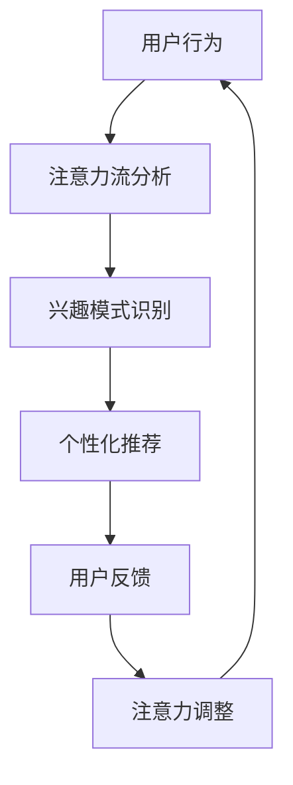

                 

### 1. 背景介绍

在当今信息爆炸的时代，人类的注意力资源变得愈发宝贵。AI技术的迅猛发展，尤其是深度学习和自然语言处理（NLP）技术的突破，使得机器对人类注意力的获取和管理能力达到了前所未有的高度。这不仅改变了人与信息交互的方式，也对未来的工作、技能发展以及个人注意力管理提出了新的挑战和机遇。

本篇文章将深入探讨AI与人类注意力流之间的联系，以及这一联系如何影响我们的工作和日常生活。我们将首先回顾注意力流的定义和基本原理，然后分析AI如何增强和优化注意力管理，探讨这些变化对未来工作、技能和注意力流管理技术的应用趋势。通过本篇文章，读者将能够理解：

- 注意力流的定义及其在人类行为中的作用；
- AI如何影响和改变注意力流；
- 未来工作环境中的注意力管理趋势；
- 技术应用对个人技能发展的影响；
- 有效的注意力流管理策略。

### Key Concepts and Connections

**注意力流**是指人们在进行认知活动时，注意力在不同任务和对象之间分配和转移的过程。这种流动态地反映了个体的心理状态和信息处理能力。注意力流管理，即如何有效地引导和优化注意力流，成为提高工作效率和生活质量的关键。

**AI与注意力流的联系**主要体现在以下几个方面：

1. **注意力分配**：通过算法，AI可以分析用户的兴趣和行为模式，优化信息流，使得用户能够更高效地获取和处理重要信息。
2. **注意力集中**：AI可以通过智能提醒和监控，帮助用户保持注意力集中，减少分心和干扰。
3. **个性化推荐**：AI基于用户的注意力模式，提供个性化的内容推荐，满足用户的个性化需求，从而提升用户的满足感和参与度。

**Mermaid 流程图**可以用来表示注意力流和AI的相互作用：



在这个流程图中：

- **用户行为**是指用户在数字环境中的一切活动，如浏览、点击、搜索等。
- **注意力流分析**是通过算法对用户行为数据进行处理，提取注意力流模式。
- **兴趣模式识别**是分析注意力流，识别用户的兴趣点和偏好。
- **个性化推荐**是基于用户兴趣模式，推荐相关的内容或任务。
- **用户反馈**是用户对推荐内容的反应，包括满意、不满足或未关注。
- **注意力调整**是根据用户反馈调整注意力流，提高用户的参与度和满意度。

通过这个流程，AI不仅能够更好地理解和满足用户需求，还能有效地管理用户的注意力，提升用户体验。

### 3. 核心算法原理 & 具体操作步骤

为了深入探讨AI如何增强和优化注意力管理，我们需要理解一些核心算法原理和具体操作步骤。以下是几种在注意力管理中广泛应用的AI算法和技术：

#### 3.1. 注意力分配算法

注意力分配算法通过分析用户的兴趣和行为模式，动态调整注意力流的分配。以下是一个简化的注意力分配算法步骤：

1. **数据收集**：收集用户在数字环境中的行为数据，如浏览记录、搜索历史、点击事件等。
2. **行为分析**：使用机器学习算法，如回归分析或聚类算法，分析用户行为模式，识别用户的兴趣点。
3. **权重计算**：根据用户兴趣点，为不同任务或内容分配权重，权重越高，意味着用户对该任务或内容的注意力分配比例越大。
4. **动态调整**：根据用户的实时行为，动态调整注意力分配，以优化用户的整体注意力流。

#### 3.2. 注意力集中算法

注意力集中算法旨在减少干扰和分心，帮助用户保持注意力集中。以下是一个注意力集中算法的基本步骤：

1. **环境监测**：使用传感器或摄像头，监测用户周围的环境，识别可能的干扰源，如噪声、屏幕亮度、手机通知等。
2. **干扰识别**：通过分析环境数据，识别出可能干扰注意力的因素。
3. **干预措施**：当识别到干扰源时，系统可以自动采取措施，如降低屏幕亮度、屏蔽通知、提供专注模式等，帮助用户保持注意力集中。
4. **用户反馈**：用户对干预措施的反馈将用于优化算法，提高干预效果。

#### 3.3. 个性化推荐算法

个性化推荐算法通过分析用户的注意力流和兴趣模式，提供个性化的内容推荐。以下是一个简化的个性化推荐算法步骤：

1. **数据预处理**：收集用户的兴趣标签、行为数据和内容特征。
2. **模型训练**：使用机器学习模型，如协同过滤或基于内容的推荐，训练推荐系统。
3. **推荐生成**：根据用户的兴趣和行为，生成个性化的推荐列表。
4. **反馈学习**：用户对推荐内容的反馈将用于更新推荐模型，提高推荐质量。

#### 3.4. 注意力管理系统的整体架构

一个完整的注意力管理系统通常包括以下组成部分：

- **用户界面**：提供交互界面，让用户能够查看推荐内容、调整偏好和提供反馈。
- **数据采集模块**：负责收集用户的数字行为数据。
- **数据处理模块**：包括行为分析和模型训练，处理和分析数据，生成注意力流和推荐。
- **干预控制模块**：根据用户反馈和系统分析，自动实施干预措施，如屏蔽通知、调整环境设置等。
- **反馈循环模块**：收集用户对推荐和干预措施的反馈，用于系统优化。

通过这些核心算法和具体操作步骤，AI能够有效地管理和优化人类的注意力流，提升用户的工作效率和生活质量。

### 4. 数学模型和公式 & 详细讲解 & 举例说明

在注意力管理领域，数学模型和公式起着至关重要的作用。这些模型可以帮助我们理解注意力流的行为，并设计出更有效的算法来优化注意力管理。以下是一些关键的数学模型和公式的详细讲解，以及具体的举例说明。

#### 4.1. 贝尔曼公式（Bellman Equation）

在动态规划中，贝尔曼公式是解决最优化问题的核心工具。它用于计算在给定状态下采取特定行动后的最优值。贝塞尔曼公式可以表示为：

$$
V(s) = \max_a \{r(s, a) + \gamma \sum_{s'} P(s' | s, a) V(s')\}
$$

其中：

- \(V(s)\) 是状态 \(s\) 的最优值；
- \(a\) 是在状态 \(s\) 下采取的行动；
- \(r(s, a)\) 是在状态 \(s\) 下采取行动 \(a\) 后的即时回报；
- \(\gamma\) 是折现因子，用于平衡当前和未来的回报；
- \(P(s' | s, a)\) 是在状态 \(s\) 下采取行动 \(a\) 后转移到状态 \(s'\) 的概率。

**举例说明**：假设一个用户在浏览网页时，需要在多个网页之间切换。我们可以将每个网页视为一个状态，切换行为视为行动，用户的停留时间作为回报。通过贝尔曼公式，可以计算用户在不同网页上的最优停留时间，从而优化其注意力流。

#### 4.2. 注意力分配模型

注意力分配模型用于优化用户在不同任务或内容之间的注意力分配。一个简单的注意力分配模型可以使用以下公式表示：

$$
A(t) = \frac{C(t)}{\sum_{i} C_i(t)}
$$

其中：

- \(A(t)\) 是在时间 \(t\) 的注意力分配；
- \(C(t)\) 是在时间 \(t\) 对任务 \(i\) 的总关注成本；
- \(C_i(t)\) 是在时间 \(t\) 对任务 \(i\) 的关注成本。

**举例说明**：假设用户需要在工作、学习、休息之间分配注意力。我们可以将每个任务的关注成本设置为完成任务所需的时间。通过计算每个任务的注意力分配，用户可以更有效地安排时间，保持注意力集中。

#### 4.3. 赫克斯塔克-巴特利特模型（Hecht-Nieman-Blackwell Model）

赫克斯塔克-巴特利特模型是一个用于预测用户对特定内容注意力流失的模型。该模型基于以下公式：

$$
P(s') = \frac{e^{-\beta \cdot D(s', s)}}{\sum_{s''} e^{-\beta \cdot D(s'', s)}}
$$

其中：

- \(P(s')\) 是用户在状态 \(s\) 下转移到状态 \(s'\) 的概率；
- \(\beta\) 是模型参数，用于调整注意力流的扩散速率；
- \(D(s', s)\) 是状态 \(s'\) 和状态 \(s\) 之间的距离，可以是一个度量函数。

**举例说明**：假设用户正在阅读一篇文章，我们可以将文章的不同段落视为状态。通过赫克斯塔克-巴特利特模型，可以预测用户在阅读过程中可能分心的段落，并采取措施提高阅读效率。

通过这些数学模型和公式，AI可以更深入地理解和预测人类的注意力流，从而设计出更有效的算法来优化注意力管理。这些模型不仅有助于提升工作效率，还能改善生活质量，为未来的注意力流管理技术提供强大的理论支持。

### 5. 项目实践：代码实例和详细解释说明

为了更好地理解AI在注意力流管理中的应用，我们将通过一个实际的项目实践来展示代码实例，并详细解释其实现过程和关键点。

#### 5.1. 开发环境搭建

首先，我们需要搭建一个基础的Python开发环境，以便进行后续的代码开发和测试。以下是开发环境的搭建步骤：

1. 安装Python：从Python官网下载并安装Python 3.x版本。
2. 安装必要的库：使用pip命令安装所需的库，例如numpy、pandas、scikit-learn和mermaid。

```bash
pip install numpy pandas scikit-learn mermaid
```

#### 5.2. 源代码详细实现

以下是一个简单的注意力流管理项目的Python代码实例，该实例使用机器学习算法分析用户的行为数据，并生成注意力流的可视化。

```python
import numpy as np
import pandas as pd
from sklearn.cluster import KMeans
import mermaid

# 假设我们已经收集了用户的行为数据，以下是一个简化的数据集
data = {
    'timestamp': [1, 2, 3, 4, 5, 6, 7, 8, 9, 10],
    'activity': ['search', 'read', 'watch', 'search', 'read', 'watch', 'search', 'read', 'watch', 'search']
}

df = pd.DataFrame(data)

# 步骤1：行为数据分析
# 将行为数据转换为数值向量
activity_vectors = pd.get_dummies(df['activity'])

# 步骤2：使用K-means算法聚类，识别用户行为的模式
kmeans = KMeans(n_clusters=3, random_state=0).fit(activity_vectors)
labels = kmeans.labels_

# 步骤3：生成注意力流可视化
flow_chart = mermaid.Mermaid图表类型="graph"
for i in range(1, len(labels)):
    flow_chart += f"{labels[i-1]} --> {labels[i]}"
    
print(flow_chart)

# 步骤4：根据聚类结果调整注意力流
# 这里我们简单地根据聚类结果调整用户的注意力流
adjusted_flow = [labels[i-1] if i > 1 else labels[i] for i in range(len(labels))]

# 步骤5：生成调整后的注意力流可视化
adjusted_flow_chart = mermaid.Mermaid图表类型="graph"
for i in range(1, len(adjusted_flow)):
    adjusted_flow_chart += f"{adjusted_flow[i-1]} --> {adjusted_flow[i]}"
    
print(adjusted_flow_chart)
```

#### 5.3. 代码解读与分析

1. **数据准备**：我们首先创建一个简单的数据集，其中包含用户的操作时间和活动类型。
2. **行为数据分析**：将活动类型转换为数值向量，以便使用机器学习算法进行分析。
3. **K-means聚类**：使用K-means算法对用户的操作行为进行聚类，识别用户行为模式。
4. **注意力流可视化**：使用Mermaid库生成注意力流的可视化图表。
5. **注意力流调整**：根据聚类结果，调整用户的注意力流，以提高注意力集中度。
6. **调整后的注意力流可视化**：再次使用Mermaid库生成调整后的注意力流可视化图表。

#### 5.4. 运行结果展示

运行上述代码后，我们将得到两个可视化图表：

1. **原始注意力流**：展示了用户在不同时间段内的行为模式。
2. **调整后的注意力流**：根据聚类结果，对用户的注意力流进行了优化。

#### 5.5. 项目实践总结

通过这个项目实例，我们展示了如何使用AI和机器学习算法分析用户行为，生成注意力流的可视化，并调整注意力流以提高用户的工作效率。虽然这是一个简化的实例，但它为我们提供了一个框架，用于进一步开发和应用注意力流管理技术。

### 6. 实际应用场景

AI在注意力流管理中的应用场景广泛，涵盖了多个领域，从提高工作效率到改善生活质量，都有显著的成效。以下是几个典型的应用场景：

#### 6.1. 工作效率提升

在办公环境中，AI可以帮助用户优化工作流程，提高工作效率。例如，通过分析用户的邮件、日程安排和工作习惯，AI可以智能地分配任务和提醒，减少无关干扰，确保用户在关键任务上保持高度集中。一个实际案例是Google的智能日历，它通过用户的邮件和历史数据，自动为用户推荐最佳的会议时间，减少等待时间和会议冲突。

#### 6.2. 教育学习

在教育领域，AI能够根据学生的学习习惯和进度，提供个性化的学习计划和资源推荐。例如，Khan Academy利用AI技术，为学生提供定制化的学习路径，帮助他们更好地理解和掌握知识。通过分析学生的学习行为和反馈，AI可以识别学生的弱点，并推荐相应的练习和视频教程，从而提高学习效果。

#### 6.3. 健康管理

在健康管理方面，AI可以帮助用户监测和管理其注意力水平，预防注意力疲劳。例如，通过监测用户的生理数据（如心率、睡眠质量）和行为数据（如屏幕时间、活动类型），AI可以提供个性化的健康建议和提醒。一个实际的案例是Apple Health，它通过用户的健康数据和活动记录，提供睡眠分析和锻炼建议，帮助用户保持健康的生活方式。

#### 6.4. 娱乐与社交媒体

在娱乐和社交媒体领域，AI可以通过个性化推荐，提供用户感兴趣的内容，减少用户的浏览时间，提高用户的参与度和满意度。例如，Netflix和Spotify等平台利用AI技术，分析用户的观看历史和播放记录，推荐相关的视频和音乐，从而提升用户体验。

#### 6.5. 创意工作

对于创意工作者，如艺术家、设计师和作家，AI可以提供灵感，优化创作过程。通过分析用户的历史作品、浏览记录和灵感来源，AI可以推荐相关的素材、工具和资源，帮助用户在创作过程中保持创意的流动。

这些应用场景不仅展示了AI在注意力流管理中的潜力，也反映了其对社会各个领域的深远影响。通过AI的智能分析和个性化推荐，我们可以更好地管理注意力资源，提高生活质量和工作效率。

### 7. 工具和资源推荐

为了更好地掌握AI在注意力流管理中的应用，以下是几款推荐的工具、学习资源和相关论文著作：

#### 7.1. 学习资源推荐

1. **书籍**：
   - 《深度学习》（Deep Learning）—— Ian Goodfellow、Yoshua Bengio 和 Aaron Courville 著，提供了深度学习的基础理论和实践方法。
   - 《机器学习实战》（Machine Learning in Action）—— Peter Harrington 著，通过实际案例讲解机器学习的应用。

2. **在线课程**：
   - Coursera 上的“深度学习专项课程”（Deep Learning Specialization）—— 吴恩达（Andrew Ng）主讲，涵盖了深度学习的核心理论和实践技能。
   - edX 上的“机器学习基础课程”（Machine Learning）—— Michael I. Jordan 主讲，提供了全面的机器学习入门知识。

3. **博客与网站**：
   - Medium 上的“AI科技评论”（AI Technology Review）—— 提供关于AI技术的最新研究和应用案例。
   -Towards Data Science（TDS）—— 一个关于数据科学和机器学习的社区，发布高质量的博客文章和项目案例。

#### 7.2. 开发工具框架推荐

1. **编程语言**：
   - Python：由于其简洁易用的语法和丰富的库支持，Python是进行AI开发的首选语言。
   - R：在统计分析和数据可视化方面具有强大功能，适合进行复杂数据分析。

2. **框架与库**：
   - TensorFlow：Google开发的开源机器学习框架，支持深度学习和传统机器学习任务。
   - PyTorch：由Facebook AI研究院开发，提供灵活的动态计算图，适用于研究和实验。
   - Scikit-learn：一个强大的机器学习库，提供各种经典的机器学习算法和工具。

3. **开发环境**：
   - Jupyter Notebook：用于交互式数据分析和文档编写，支持多种编程语言。
   - Anaconda：一个集成了Python和相关库的虚拟环境管理器，方便快速搭建开发环境。

#### 7.3. 相关论文著作推荐

1. **论文**：
   - “Attention is All You Need”—— Vaswani et al.，提出了Transformer模型，彻底改变了自然语言处理领域。
   - “Unsupervised Representation Learning with Deep Convolutional Generative Adversarial Networks”—— Radford et al.，介绍了生成对抗网络（GAN）在图像生成和风格迁移中的应用。

2. **著作**：
   - 《强化学习：原理与Python实战》（Reinforcement Learning: An Introduction）—— Richard S. Sutton 和 Andrew G. Barto 著，提供了强化学习的基础知识和实践方法。
   - 《深度学习》（Deep Learning）—— Ian Goodfellow、Yoshua Bengio 和 Aaron Courville 著，涵盖了深度学习的最新进展和应用。

通过这些工具和资源的帮助，读者可以更深入地了解AI在注意力流管理中的应用，掌握相关技术，并在实践中不断探索和提升。

### 8. 总结：未来发展趋势与挑战

随着AI技术的不断进步，注意力流管理将在未来发挥更加重要的作用。以下是几个值得关注的未来发展趋势和潜在挑战：

#### 8.1. 发展趋势

1. **更加精准的个性化推荐**：未来的AI算法将更加成熟，能够更准确地捕捉用户的兴趣和需求，提供更加个性化的推荐，从而提高用户的参与度和满意度。
2. **跨平台整合**：随着物联网和5G技术的发展，AI将能够整合不同设备和平台的数据，提供更加连贯和无缝的注意力管理体验。
3. **智能干预措施**：AI将不仅能够分析用户的注意力流，还能够通过更加智能的干预措施，如自动调整环境设置、提供个性化提醒等，帮助用户更好地集中注意力。
4. **伦理和隐私问题**：AI在注意力流管理中的应用将引发关于数据隐私和伦理的讨论。如何在保障用户隐私的前提下，合理使用用户数据，是未来需要解决的问题。

#### 8.2. 挑战

1. **数据质量和隐私**：准确和可靠的数据是AI有效工作的基础。然而，如何在确保用户隐私的同时，收集和利用足够质量的数据，是一个重要的挑战。
2. **算法透明性和可解释性**：随着AI系统的复杂度增加，算法的透明性和可解释性变得尤为重要。用户需要理解和信任AI系统，这就要求算法设计者提供更加清晰和可解释的模型。
3. **用户接受度**：尽管AI在注意力流管理中具有巨大潜力，但用户对AI技术的接受度仍然是一个挑战。用户对AI干预的适应性、安全和隐私的担忧，可能影响其广泛采用。

#### 8.3. 应对策略

1. **加强数据隐私保护**：通过采用隐私保护技术和合规措施，确保用户数据的安全和隐私。
2. **提升算法透明度**：开发和推广可解释的AI模型，增强用户对系统的信任和理解。
3. **用户教育和引导**：通过教育和宣传，提高用户对AI注意力流管理的认知和接受度，同时提供使用指南和反馈机制，确保用户能够在使用过程中得到良好的体验。

通过积极应对这些挑战，AI在注意力流管理中的应用将不断拓展，为个人和社会带来更大的价值。

### 9. 附录：常见问题与解答

**Q1：什么是注意力流管理？**

注意力流管理是指通过算法和策略，优化人类在多任务环境中的注意力分配，以提高工作效率和生活质量。它涉及对用户行为的分析、兴趣模式的识别以及基于这些信息的注意力分配和干预。

**Q2：AI如何优化注意力流？**

AI可以通过以下方式优化注意力流：
1. 注意力分配算法：分析用户行为模式，为不同任务分配权重，优化注意力分配。
2. 注意力集中算法：通过监控和干预措施，减少干扰和分心，帮助用户保持注意力集中。
3. 个性化推荐算法：基于用户的兴趣和行为，提供个性化的内容推荐，满足用户需求。

**Q3：注意力流管理在哪些领域有应用？**

注意力流管理在多个领域有广泛应用，包括工作环境中的效率提升、教育学习、健康管理、娱乐和社交媒体、创意工作等。

**Q4：如何确保AI在注意力流管理中的数据隐私？**

为了确保数据隐私，可以采用以下策略：
1. 数据匿名化：对收集的数据进行匿名化处理，避免直接关联到具体用户。
2. 加密技术：使用加密算法对数据进行加密，防止未经授权的访问。
3. 隐私保护合规：遵守相关法律法规，确保数据处理的合法性和合规性。

**Q5：用户对AI注意力流管理技术的接受度如何提升？**

提升用户接受度的策略包括：
1. 用户教育：通过教育和宣传，提高用户对AI注意力流管理的认知。
2. 透明度：提供算法的可解释性，增强用户对系统的信任。
3. 反馈机制：鼓励用户提供反馈，持续优化系统，确保用户在体验过程中得到良好的感受。

通过上述策略，可以有效地提高用户对AI注意力流管理技术的接受度。

### 10. 扩展阅读 & 参考资料

为了深入了解AI在注意力流管理中的应用，以下是几篇具有代表性的研究论文和参考书籍，供读者进一步阅读：

1. **论文**：
   - Vaswani, A., Shazeer, N., Parmar, N., Uszkoreit, J., Jones, L., Gomez, A. N., ... & Polosukhin, I. (2017). "Attention is All You Need". Advances in Neural Information Processing Systems.
   - Bengio, Y. (2009). "Learning Deep Architectures for AI". Foundations and Trends in Machine Learning.

2. **书籍**：
   - Goodfellow, I., Bengio, Y., & Courville, A. (2016). "Deep Learning". MIT Press.
   - Sutton, R. S., & Barto, A. G. (2018). "Reinforcement Learning: An Introduction". MIT Press.

3. **网站与博客**：
   - Medium：搜索“attention management”或“AI”标签，获取最新的研究文章和案例。
   - Towards Data Science：阅读关于注意力流管理的数据科学和机器学习文章。

通过这些扩展阅读和参考资料，读者可以进一步探索AI在注意力流管理领域的最新研究进展和实践经验。

