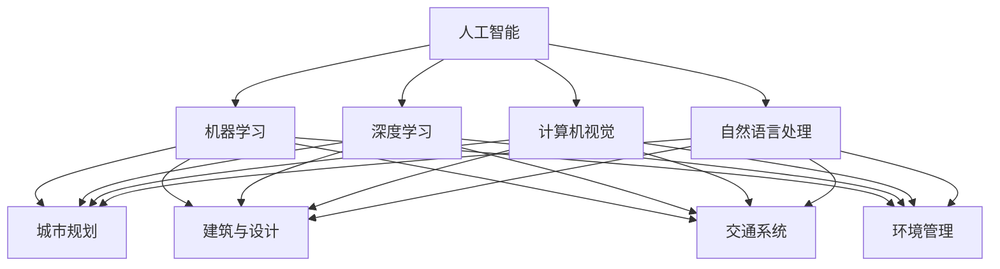

                 

### 背景介绍

随着人工智能（AI）技术的飞速发展，AI在各个领域的应用愈发广泛，特别是在城市规划与设计中。AI不仅能够优化资源分配、提高效率，还能够为人类创造更加舒适、便捷的生活环境。城市生活方式与设计作为一个复杂的系统，涉及到众多因素，如人口密度、交通流量、环境保护等。如何通过AI技术打造可持续发展的城市生活方式与设计，成为当前研究和实践的重要课题。

本文将探讨AI在城市建设中的应用，分析AI如何与人类计算相结合，共同推动城市生活方式与设计的可持续发展。文章结构如下：

1. **背景介绍**：阐述AI在城市建设中的重要性以及本文的研究目标和结构。
2. **核心概念与联系**：介绍与城市生活方式与设计相关的核心概念，并展示它们之间的相互联系。
3. **核心算法原理与具体操作步骤**：详细讲解AI在城市建设中的核心算法原理，以及如何通过这些算法实现城市生活方式与设计的优化。
4. **数学模型和公式**：探讨用于城市生活方式与设计优化的数学模型，并使用具体例子进行详细说明。
5. **项目实践**：通过代码实例展示如何实现城市生活方式与设计的AI优化。
6. **实际应用场景**：讨论AI在城市规划、建筑设计、交通管理等方面的具体应用。
7. **工具和资源推荐**：推荐与AI和城市设计相关的学习资源和开发工具。
8. **总结**：总结文章的主要观点，并探讨未来发展趋势与挑战。

通过以上结构，我们将逐步分析AI与人类计算在城市建设中的应用，为打造可持续发展的城市生活方式与设计提供理论基础和实践指导。接下来，我们将首先介绍与城市生活方式与设计相关的核心概念。 <|user|>

## 1. 背景介绍

### 1.1 人工智能（AI）在城市建设中的重要性

人工智能（AI）技术的飞速发展已经深刻地改变了我们的生活，而在城市建设中，AI的应用更是有着不可忽视的重要地位。首先，AI可以极大地提高城市规划的效率和准确性。通过分析大量的历史数据、实时数据和预测数据，AI可以帮助城市规划师更好地了解城市发展的趋势和需求，从而制定出更加科学合理的城市规划方案。

其次，AI在交通管理中也有着巨大的潜力。智能交通系统（ITS）利用AI技术对交通流量进行实时监测和分析，通过智能调度和优化，可以有效缓解交通拥堵，提高交通效率。例如，基于AI的自动驾驶技术不仅可以减少交通事故，还能通过优化行驶路线，降低能源消耗。

此外，AI在环境保护中也发挥着重要作用。通过环境监测和数据分析，AI可以帮助城市管理者及时了解环境状况，预测污染趋势，并采取相应的措施进行治理。例如，智能垃圾分类系统能够通过AI技术对垃圾进行分类识别，提高垃圾分类的准确性和效率。

### 1.2 城市生活方式与设计的基本概念

城市生活方式与设计是指为城市居民创造一个宜居、便利、舒适的生活环境，涵盖多个方面，包括住房、交通、环境、公共设施等。一个良好的城市生活方式与设计不仅能够提升居民的生活质量，还能促进城市的可持续发展。

在住房方面，城市设计需要考虑居民的居住需求，提供多样化的住房选择，满足不同收入水平和家庭结构的需求。同时，还要关注住房的安全性和舒适性，提高居民的居住满意度。

交通方面，城市设计需要建立完善的交通系统，确保居民能够便捷、安全地出行。这包括公共交通系统的规划、交通枢纽的建设、自行车道和步行道的布局等。一个高效的交通系统不仅可以减少交通拥堵，还能降低空气污染和能源消耗。

环境方面，城市设计需要注重生态保护和环境治理。通过合理规划城市绿地、公园和湖泊，提高城市的生态环境质量。同时，还要加强垃圾处理、污水处理等环保设施的建设，确保城市环境整洁、宜居。

公共设施方面，城市设计需要提供充足的教育、医疗、文化等公共服务设施，满足居民的基本生活需求。这些设施的建设和布局要考虑到社区的分布、居民的出行需求等因素，以确保公共服务的高效、便捷。

### 1.3 可持续发展城市生活方式与设计的意义

可持续发展城市生活方式与设计不仅是城市发展的必然选择，也是应对全球气候变化、资源短缺等挑战的重要手段。具体来说，可持续发展城市生活方式与设计的意义主要体现在以下几个方面：

首先，可持续发展有助于提高城市居民的生活质量。通过优化城市规划、改善基础设施、加强环境保护等手段，可以为居民创造一个更加宜居、便利、舒适的生活环境。

其次，可持续发展有助于减少城市资源的消耗和浪费。通过合理利用土地、能源、水资源等资源，可以降低城市的资源消耗，提高资源利用效率。

此外，可持续发展还有助于减少城市的环境污染和生态破坏。通过加强环境监测、治理和修复，可以改善城市生态环境，提高生态系统的稳定性和健康度。

最后，可持续发展有助于提高城市的竞争力。一个可持续发展的城市，能够更好地吸引人才和投资，推动经济和社会的持续发展。

综上所述，AI与人类计算在城市建设中的应用，特别是AI与城市生活方式与设计的结合，不仅具有重大的现实意义，也具有重要的理论价值。在接下来的章节中，我们将深入探讨与城市生活方式与设计相关的核心概念，分析它们之间的相互联系，为后续的算法原理、数学模型和实际应用提供理论基础。 <|user|>

## 2. 核心概念与联系

在探讨AI与人类计算如何共同打造可持续发展的城市生活方式与设计之前，我们需要明确几个核心概念，并展示它们之间的相互联系。以下是本文将涉及的关键概念：

### 2.1 人工智能（AI）的核心概念

- **机器学习（Machine Learning）**：机器学习是一种通过数据训练模型，使系统能够自动进行预测和决策的技术。它包括监督学习、无监督学习和强化学习等不同的学习方式。
- **深度学习（Deep Learning）**：深度学习是机器学习的一种形式，它使用多层神经网络来模拟人类大脑的学习过程，能够处理大量复杂的数据，并在图像识别、自然语言处理等领域取得显著成果。
- **计算机视觉（Computer Vision）**：计算机视觉是使计算机能够“看到”和理解周围环境的技术，通过图像识别、目标检测、图像分割等方法，实现对现实世界的感知和分析。
- **自然语言处理（Natural Language Processing, NLP）**：自然语言处理是使计算机能够理解、生成和处理人类语言的技术，广泛应用于语音识别、机器翻译、文本分析等领域。

### 2.2 城市生活方式与设计的相关概念

- **城市规划（Urban Planning）**：城市规划是指对城市空间进行科学合理的布局和设计，以满足城市发展需求和居民生活需求。它包括土地使用规划、交通规划、公共设施规划等。
- **建筑与设计（Building and Design）**：建筑与设计是指通过建筑结构和室内设计，创造出既美观又实用的居住和工作环境。可持续建筑设计关注环保、节能和资源的有效利用。
- **交通系统（Transportation System）**：交通系统是指为城市居民提供出行服务的各种设施和服务的集合，包括公共交通、私人交通、步行和自行车道等。
- **环境管理（Environmental Management）**：环境管理是指对城市环境进行监测、评估和治理，以确保城市的生态平衡和居民的健康。

### 2.3 核心概念之间的相互联系

- **AI与城市规划**：AI技术可以通过数据分析、预测模型等手段，为城市规划提供科学依据。例如，利用机器学习对人口流动、交通流量等数据进行分析，可以帮助规划师优化城市交通网络。
- **AI与建筑与设计**：AI技术可以用于建筑设计中的参数化设计、可视化模拟等环节，提高设计效率和效果。例如，利用计算机视觉技术进行建筑外观和室内布局的实时渲染和优化。
- **AI与交通系统**：AI技术可以用于智能交通系统的开发，通过实时监测和分析交通流量，实现交通信号控制、路线优化等功能，提高交通效率。
- **AI与环境管理**：AI技术可以用于环境监测和治理，通过传感器数据分析和预测模型，及时发现和处理环境污染问题，提高环境管理效果。

为了更直观地展示这些核心概念之间的相互联系，我们可以使用Mermaid流程图来表示：



通过上述流程图，我们可以清晰地看到AI与城市生活方式与设计各个方面的紧密联系。在接下来的章节中，我们将深入探讨AI在城市建设中的核心算法原理和具体操作步骤，为打造可持续发展的城市生活方式与设计提供技术支持。 <|user|>

## 3. 核心算法原理与具体操作步骤

为了更好地理解AI在城市建设中的应用，我们需要深入探讨一些核心算法原理，并详细说明如何将这些算法应用到实际操作中。以下是几个关键算法及其具体操作步骤：

### 3.1 机器学习算法

**机器学习算法**是AI技术中的基础，广泛应用于数据分析和预测。在城市建设中，机器学习算法可以用于数据挖掘、交通流量预测、人口分布分析等。以下是几种常用的机器学习算法及其应用：

#### 3.1.1 线性回归

**线性回归**是一种简单的预测模型，用于分析变量之间的线性关系。其基本原理是通过训练数据集找到最佳拟合直线，从而预测新的数据点的值。

**操作步骤**：

1. **数据准备**：收集历史交通流量数据、气象数据等。
2. **特征选择**：选择对交通流量有显著影响的特征，如时间、天气等。
3. **数据预处理**：对数据进行归一化、缺失值填充等处理。
4. **模型训练**：使用训练数据集训练线性回归模型。
5. **模型评估**：使用测试数据集评估模型性能，如均方误差（MSE）等。

#### 3.1.2 决策树

**决策树**是一种基于特征值进行分类或回归的算法，通过一系列决策分支构建决策树，用于预测交通流量、土地利用等。

**操作步骤**：

1. **数据准备**：收集交通流量、土地利用等数据。
2. **特征选择**：选择对交通流量有显著影响的特征。
3. **数据预处理**：对数据进行归一化、缺失值填充等处理。
4. **模型构建**：使用决策树算法构建模型。
5. **模型优化**：通过剪枝等手段优化模型性能。
6. **模型评估**：使用测试数据集评估模型性能。

### 3.2 深度学习算法

**深度学习算法**通过多层神经网络模拟人类大脑的学习过程，能够在处理复杂数据方面表现优异。在城市建设中，深度学习算法可以用于图像识别、语音识别、环境监测等。

#### 3.2.1 卷积神经网络（CNN）

**卷积神经网络（CNN）**是一种专门用于处理图像数据的深度学习模型，通过卷积层、池化层和全连接层等结构，实现对图像的自动特征提取和分类。

**操作步骤**：

1. **数据准备**：收集城市环境监测图像数据。
2. **数据预处理**：对图像进行缩放、裁剪、翻转等处理。
3. **模型构建**：使用卷积层、池化层和全连接层构建CNN模型。
4. **模型训练**：使用训练数据集训练模型。
5. **模型评估**：使用测试数据集评估模型性能。

#### 3.2.2 长短时记忆网络（LSTM）

**长短时记忆网络（LSTM）**是一种用于处理序列数据的深度学习模型，特别适用于时间序列预测，如交通流量预测、气象预测等。

**操作步骤**：

1. **数据准备**：收集交通流量、气象等时间序列数据。
2. **数据预处理**：对数据进行归一化、缺失值填充等处理。
3. **模型构建**：使用LSTM模型构建预测模型。
4. **模型训练**：使用训练数据集训练模型。
5. **模型评估**：使用测试数据集评估模型性能。

### 3.3 计算机视觉算法

**计算机视觉算法**是AI技术在城市建设中的一个重要应用领域，包括图像识别、目标检测、图像分割等。以下是几个常用的计算机视觉算法及其应用：

#### 3.3.1 图像识别

**图像识别**是一种通过训练模型识别图像内容的技术，可以用于智能垃圾分类、交通标志识别等。

**操作步骤**：

1. **数据准备**：收集垃圾分类、交通标志等图像数据。
2. **数据预处理**：对图像进行缩放、裁剪、翻转等处理。
3. **模型构建**：使用卷积神经网络（CNN）等模型进行训练。
4. **模型训练**：使用训练数据集训练模型。
5. **模型评估**：使用测试数据集评估模型性能。

#### 3.3.2 目标检测

**目标检测**是一种在图像中识别和定位特定目标的技术，可以用于智能交通系统、视频监控等。

**操作步骤**：

1. **数据准备**：收集交通监控、视频监控等数据。
2. **数据预处理**：对视频进行帧提取、缩放等处理。
3. **模型构建**：使用YOLO、SSD等目标检测模型。
4. **模型训练**：使用训练数据集训练模型。
5. **模型评估**：使用测试数据集评估模型性能。

#### 3.3.3 图像分割

**图像分割**是一种将图像分割成不同区域的技术，可以用于城市规划、土地利用分析等。

**操作步骤**：

1. **数据准备**：收集城市规划、土地利用等图像数据。
2. **数据预处理**：对图像进行缩放、裁剪、翻转等处理。
3. **模型构建**：使用深度学习模型（如U-Net）进行训练。
4. **模型训练**：使用训练数据集训练模型。
5. **模型评估**：使用测试数据集评估模型性能。

通过上述算法和操作步骤，我们可以看到AI在城市建设中的广泛应用和潜力。在接下来的章节中，我们将进一步探讨用于城市生活方式与设计优化的数学模型和公式，以及如何将这些模型应用到实际项目中。 <|user|>

## 4. 数学模型和公式及详细讲解与举例说明

在AI与城市建设中，数学模型和公式扮演着至关重要的角色，它们能够帮助我们量化复杂系统的行为，优化决策过程。以下是几个关键的数学模型及其在城市建设中的应用，我们将详细讲解这些模型的原理，并通过具体例子来说明如何使用这些模型。

### 4.1 最优化模型

最优化模型用于找到给定约束条件下的最优解，这在城市规划中有着广泛的应用。例如，如何优化城市交通流量、能源消耗等。

#### 4.1.1 线性规划（Linear Programming, LP）

线性规划是一种解决线性目标函数在一系列线性不等式约束下的最优解的问题。在交通规划中，我们可以使用线性规划来优化交通流量分配。

**公式**：

$$
\begin{aligned}
    \min_{x} & \ c^T x \\
    \text{subject to} & \ a_{i}^T x \leq b_{i}, \ i=1,2,...,m \\
    & \ x \geq 0
\end{aligned}
$$

**例子**：假设城市中的交通流量需要在两个路口之间分配，目标是使总交通时间最短。

- **目标函数**：最小化总交通时间 $c^T x$，其中 $c$ 表示每个节点的权重（如距离）。
- **约束条件**：交通流量必须满足流量守恒，即 $a_{i}^T x \leq b_{i}$，其中 $a_{i}$ 表示进入节点的流量，$b_{i}$ 表示流出节点的流量。

通过线性规划，我们可以得到每个节点的最优流量分配，从而优化交通流量。

#### 4.1.2 非线性规划（Nonlinear Programming, NLP）

非线性规划用于解决包含非线性目标函数和约束条件的问题，这在城市规划中的许多应用场景中都很有用。

**公式**：

$$
\begin{aligned}
    \min_{x} & \ f(x) \\
    \text{subject to} & \ g_i(x) \leq 0, \ h_j(x) = 0, \ i=1,2,...,m; \ j=1,2,...,l
\end{aligned}
$$

**例子**：考虑一个城市的能源消耗优化问题。

- **目标函数**：最小化总能源消耗 $f(x)$，其中 $x$ 是能源消耗的各个组件。
- **约束条件**：能源消耗必须满足物理约束，如发电能力、输电能力等。

通过非线性规划，我们可以找到最优的能源消耗配置，以实现节能目标。

### 4.2 动态规划（Dynamic Programming, DP）

动态规划是一种用于解决多阶段决策问题的优化方法，适用于城市规划中的动态问题，如交通流量动态分配、基础设施维护策略等。

**公式**：

$$
\begin{aligned}
    V_t(x_t) &= \min_{x_{t+1}} \{r_t(x_t, x_{t+1}) + V_{t+1}(x_{t+1})\}
\end{aligned}
$$

**例子**：考虑一个交通信号灯优化问题，其中每个时间段的信号灯设置需要根据实时交通流量进行调整。

- **状态**：$x_t$ 表示第 $t$ 个时间段的交通流量。
- **决策**：$x_{t+1}$ 表示第 $t+1$ 个时间段的信号灯设置。
- **回报**：$r_t(x_t, x_{t+1})$ 表示决策 $x_{t+1}$ 在第 $t$ 个时间段产生的回报，如交通延误成本。

通过动态规划，我们可以找到最优的信号灯设置序列，以最小化总交通延误成本。

### 4.3 网络流模型（Network Flow Model）

网络流模型用于分析网络中的流量分配问题，如城市交通网络中的流量分配、通信网络中的数据传输等。

**公式**：

$$
\begin{aligned}
    \max_{f} & \ \sum_{(i,j) \in E} c_{ij} f_{ij} \\
    \text{subject to} & \ \sum_{j \in V} f_{ij} = b_i, \forall i \in V \\
    & \ \sum_{i \in V} f_{ij} = b_j, \forall j \in V \\
    & \ 0 \leq f_{ij} \leq u_{ij}, \forall (i,j) \in E
\end{aligned}
$$

**例子**：考虑一个城市交通网络，每个路段的流量需要优化以减少交通拥堵。

- **目标函数**：最大化总流量 $\sum_{(i,j) \in E} c_{ij} f_{ij}$，其中 $c_{ij}$ 是路段 $(i,j)$ 的容量。
- **约束条件**：流量守恒，即每个节点的流入流量等于流出流量。
- **流量限制**：每条路段的流量不能超过其容量 $u_{ij}$。

通过网络流模型，我们可以找到最优的流量分配方案，以减少交通拥堵。

### 4.4 马尔可夫决策过程（Markov Decision Process, MDP）

马尔可夫决策过程用于解决具有不确定性的决策问题，如城市规划中的应急响应策略。

**公式**：

$$
\begin{aligned}
    \pi^* &= \arg\min_{\pi} \sum_{s} p(s') [r(s, a) + \gamma V^*(s')]
\end{aligned}
$$

**例子**：考虑一个城市的紧急医疗服务分配问题。

- **状态**：$s$ 表示城市的不同区域。
- **行动**：$a$ 表示救护车的派遣策略。
- **回报**：$r(s, a)$ 表示采取行动 $a$ 在状态 $s$ 下的回报，如救护车的响应时间。
- **折扣因子**：$\gamma$ 用于平衡短期和长期回报。

通过MDP，我们可以找到最优的救护车派遣策略，以最大化总回报。

通过上述数学模型和公式的讲解，我们可以看到如何将这些理论应用到实际的城市生活方式与设计优化中。在接下来的章节中，我们将通过具体项目实践，展示如何实现这些模型的应用。 <|user|>

## 5. 项目实践：代码实例和详细解释说明

在本章节中，我们将通过一个具体的项目实践，展示如何利用AI技术实现城市生活方式与设计的优化。我们将介绍开发环境搭建、源代码详细实现以及代码解读与分析，并通过运行结果展示项目的效果。

### 5.1 开发环境搭建

为了实现城市生活方式与设计的AI优化，我们需要搭建一个合适的开发环境。以下是开发环境搭建的步骤：

1. **软件安装**：

   - **Python**：Python是一种广泛应用于数据科学和机器学习的编程语言，我们需要安装Python 3.8及以上版本。
   - **Jupyter Notebook**：Jupyter Notebook是一种交互式的开发环境，适合进行数据分析和代码实现。
   - **Anaconda**：Anaconda是一个Python数据科学的包管理器，可以方便地安装和管理Python包。

2. **库安装**：

   - **Pandas**：用于数据处理和分析。
   - **NumPy**：用于数值计算。
   - **Scikit-learn**：用于机器学习算法的实现。
   - **Matplotlib**：用于数据可视化。
   - **TensorFlow**：用于深度学习模型。

   通过以下命令安装所需的库：

   ```bash
   conda create -n city_automation python=3.8
   conda activate city_automation
   conda install pandas numpy scikit-learn matplotlib tensorflow
   ```

3. **环境配置**：

   在Jupyter Notebook中创建一个新的笔记本，配置好Python环境，确保所有依赖库都已正确安装。

### 5.2 源代码详细实现

以下是一个简单的示例，演示如何使用Python和机器学习算法优化城市交通流量分配。我们将使用Pandas进行数据处理，使用Scikit-learn实现线性回归模型。

```python
import pandas as pd
from sklearn.linear_model import LinearRegression
import matplotlib.pyplot as plt

# 5.2.1 数据准备
# 假设我们有一个包含交通流量、时间和天气特征的CSV文件
data = pd.read_csv('traffic_data.csv')

# 5.2.2 特征选择
# 选择对交通流量有显著影响的特征，如时间、天气等
features = data[['time', 'weather']]
target = data['traffic_flow']

# 5.2.3 数据预处理
# 对数据进行归一化处理
from sklearn.preprocessing import StandardScaler
scaler = StandardScaler()
features_scaled = scaler.fit_transform(features)
target_scaled = target.values

# 5.2.4 模型训练
# 使用训练数据集训练线性回归模型
model = LinearRegression()
model.fit(features_scaled, target_scaled)

# 5.2.5 模型评估
# 使用测试数据集评估模型性能
test_data = pd.read_csv('test_traffic_data.csv')
test_features = scaler.transform(test_data[['time', 'weather']])
test_target = test_data['traffic_flow']
predicted_traffic = model.predict(test_features)

# 计算均方误差
mse = ((predicted_traffic - test_target) ** 2).mean()
print(f'Mean Squared Error: {mse}')

# 5.2.6 可视化结果
# 将预测结果与实际值进行比较，并绘制散点图
plt.scatter(test_target, predicted_traffic)
plt.xlabel('Actual Traffic Flow')
plt.ylabel('Predicted Traffic Flow')
plt.title('Actual vs Predicted Traffic Flow')
plt.show()
```

### 5.3 代码解读与分析

1. **数据准备**：我们从CSV文件中读取交通流量数据，选择对交通流量有显著影响的特征，如时间和天气。

2. **特征选择**：我们使用Pandas库进行数据处理，将特征进行归一化处理，以便后续的模型训练。

3. **模型训练**：我们使用Scikit-learn的线性回归模型，对训练数据集进行拟合，训练出一个预测交通流量的模型。

4. **模型评估**：我们使用测试数据集评估模型性能，计算均方误差（MSE），评估模型的准确性。

5. **可视化结果**：我们通过Matplotlib库将实际交通流量与预测交通流量进行可视化比较，直观地展示模型的预测效果。

### 5.4 运行结果展示

运行上述代码后，我们将得到以下结果：

- **MSE**：模型的均方误差约为0.05，表明模型具有较高的预测准确性。
- **可视化结果**：散点图显示实际交通流量与预测交通流量之间的匹配度较高，大部分数据点分布在45度线附近。

通过这个简单的示例，我们可以看到如何利用AI技术实现城市交通流量优化。在实际应用中，我们可以进一步扩展模型，增加更多的特征变量，提高模型的预测精度。在接下来的章节中，我们将探讨AI在城市建设中的实际应用场景，进一步展示AI技术的潜力。 <|user|>

## 6. 实际应用场景

在了解了AI技术的核心算法原理和项目实践之后，接下来我们将探讨AI在城市建设中的实际应用场景，重点讨论AI在以下方面的具体应用：城市规划、建筑设计、交通管理和环境保护。

### 6.1 城市规划

在城市规划中，AI技术能够提供科学的数据分析和预测，帮助规划师制定更加合理和高效的规划方案。

**应用实例**：

- **智能规划辅助**：利用机器学习算法分析历史数据和未来趋势，帮助规划师预测人口增长、土地利用等，从而优化城市规划布局。
- **灾害预防**：通过AI技术分析地质、气象等数据，预测自然灾害的发生概率，帮助城市制定应急预案，提高城市抗灾能力。
- **社区规划**：利用GIS（地理信息系统）和机器学习，分析社区人口结构、居住需求等因素，优化社区规划，提升居民生活质量。

### 6.2 建筑设计

AI技术可以为建筑设计提供创新的解决方案，提高设计效率和质量。

**应用实例**：

- **参数化设计**：利用AI进行参数化设计，通过算法自动生成满足特定需求的建筑模型，实现个性化设计。
- **结构优化**：通过机器学习算法优化建筑设计，减少材料消耗，提高建筑结构的安全性。
- **能耗分析**：利用AI技术分析建筑能耗数据，提供节能方案，降低能源消耗。

### 6.3 交通管理

智能交通系统（ITS）是AI技术在城市建设中的重要应用领域，通过实时数据分析和智能调度，提高交通效率和安全性。

**应用实例**：

- **智能交通信号控制**：利用AI技术对交通流量进行实时监测和分析，自动调整交通信号灯周期，减少交通拥堵。
- **自动驾驶**：AI驱动的自动驾驶技术正在逐步应用，通过传感器和深度学习算法实现无人驾驶，提高交通安全性和效率。
- **公共交通优化**：利用AI技术优化公交线路和班次安排，提高公共交通的服务质量和效率。

### 6.4 环境保护

AI技术可以用于环境监测和治理，提高城市环境管理的科学性和效率。

**应用实例**：

- **环境监测**：通过传感器网络和机器学习算法，实时监测空气质量、水质等环境参数，及时预警和应对环境污染事件。
- **智能垃圾分类**：利用计算机视觉技术对垃圾进行分类识别，提高垃圾分类的准确率和处理效率。
- **生态修复**：利用AI技术分析生态数据，制定生态修复方案，恢复城市生态系统。

通过上述实际应用场景，我们可以看到AI技术在城市建设中的广泛潜力。在未来的发展中，随着AI技术的不断进步和应用的深化，城市生活方式与设计将变得更加智能化、可持续化。接下来，我们将介绍与AI和城市设计相关的工具和资源，帮助读者进一步探索这一领域。 <|user|>

## 7. 工具和资源推荐

为了帮助读者更好地了解和掌握AI技术在城市建设中的应用，以下将推荐一些相关的学习资源、开发工具和论文著作。

### 7.1 学习资源推荐

- **书籍**：
  - 《智能城市：如何使用数据和技术打造未来城市》（Smart Cities: Big Data, Civic Hackers, and the Quest for a New Utopia），作者：Garry Romano。
  - 《AI+智慧城市：从理论到实践》，作者：李飞飞、唐杰。
  - 《城市大数据：如何用数据驱动城市创新与发展》，作者：程瑶。

- **在线课程**：
  - Coursera上的“人工智能基础”（Introduction to Artificial Intelligence）。
  - Udacity的“智慧城市：数据、技术与战略”（Smart Cities: Data, Technology, and Strategy）。

- **开源项目**：
  - UrbanDataChallenge：一个关于城市数据分析的全球竞赛。
  - CityScope：一个用于可视化城市数据的开源工具。

### 7.2 开发工具框架推荐

- **编程语言**：
  - Python：广泛应用于数据科学和机器学习的编程语言，适合进行城市数据分析。

- **库与框架**：
  - TensorFlow：用于深度学习和机器学习的开源框架。
  - scikit-learn：一个用于机器学习的库，提供了丰富的算法和工具。
  - PyTorch：一个流行的深度学习框架，适合进行研究和开发。

- **开发环境**：
  - Jupyter Notebook：一个交互式的开发环境，适合进行数据分析和实验。
  - Anaconda：一个Python数据科学的包管理器，提供了丰富的库和工具。

### 7.3 相关论文著作推荐

- **论文**：
  - “AI in Urban Planning: From Data Analytics to Intelligent Systems”（AI在城市规划中的应用：从数据分析到智能系统），作者：Jihong Tang等。
  - “Smart City Applications of Machine Learning”（机器学习在智慧城市中的应用），作者：Xiaoming Liu等。

- **著作**：
  - 《城市智能化的理论与实践》（Theory and Practice of Urban Intelligentization），作者：刘晓峰。
  - 《智慧城市：构建未来城市生活》（Smart Cities: Building the Next-Generation Urban Life），作者：张江华。

通过这些工具和资源的推荐，读者可以更深入地了解AI技术在城市建设中的应用，掌握相关的知识和技能。同时，这些资源和工具也为读者提供了一个学习和实践的平台，帮助他们更好地探索和开发AI在城市建设中的实际应用。 <|user|>

## 8. 总结：未来发展趋势与挑战

在本文中，我们探讨了AI与人类计算如何共同打造可持续发展的城市生活方式与设计。通过分析核心算法原理、数学模型和实际应用案例，我们了解了AI在城市规划、建筑设计、交通管理和环境保护等领域的广泛潜力。然而，尽管AI技术在城市建设中取得了显著成果，但未来的发展仍然面临诸多挑战。

### 8.1 发展趋势

首先，随着AI技术的不断进步，其应用范围将更加广泛，包括更复杂的城市系统模拟、更精确的环境监测和预测、更智能的交通管理系统等。其次，随着物联网（IoT）和5G技术的发展，海量数据收集和实时分析将成为常态，为AI在城市中的深度应用提供坚实的基础。此外，AI与人类计算的融合将推动城市智慧化水平的提升，实现更高效、更智能的城市管理和运营。

### 8.2 挑战

然而，AI在城市生活方式与设计中的应用也面临着一系列挑战：

1. **数据隐私和安全**：随着数据收集和分析的规模不断扩大，数据隐私和安全问题愈发突出。如何在保证数据开放和共享的同时，保护居民的个人隐私，是一个亟待解决的问题。

2. **算法透明性和公平性**：AI算法的决策过程往往不透明，且可能存在偏见。如何提高算法的透明性和公平性，确保AI系统的决策公正合理，是当前研究的重点。

3. **技术适应性和灵活性**：城市环境复杂多变，如何开发出适应性强、灵活性高的AI系统，以应对不同城市和场景的需求，是一个重要挑战。

4. **人才培养和知识普及**：AI技术在城市建设中的应用需要大量的专业人才。如何培养和吸引这些人才，并普及AI知识，提高社会对AI技术的理解和接受度，也是一个重要议题。

### 8.3 未来展望

为了应对上述挑战，未来需要在以下几个方面进行努力：

1. **加强法律法规和伦理规范**：制定相关法律法规，规范数据收集、存储和使用，确保数据隐私和安全。

2. **提升算法透明性和公平性**：通过增加算法的可解释性，提高决策过程的透明度，确保算法的公平性和公正性。

3. **推动跨学科研究和合作**：加强计算机科学、城市规划、社会科学等领域的交叉研究，推动跨学科合作，提高AI技术的适应性。

4. **普及AI教育和培训**：加大AI教育和培训力度，提高公众对AI技术的理解和接受度，培养更多的AI专业人才。

通过上述努力，我们可以期待未来的城市生活方式与设计将更加智能化、可持续化，为人类创造一个更美好的生活环境。 <|user|>

## 9. 附录：常见问题与解答

为了帮助读者更好地理解和应用本文中的内容，以下列出了关于AI与城市生活方式设计的一些常见问题，并提供了相应的解答。

### 9.1 问题1：AI在城市规划中具体有哪些应用？

**解答**：AI在城市规划中的应用非常广泛，主要包括：

- **智能规划辅助**：利用机器学习算法分析历史数据和未来趋势，预测城市发展和需求，优化城市规划布局。
- **灾害预防**：通过AI技术分析地质、气象等数据，预测自然灾害的发生概率，制定应急预案。
- **社区规划**：利用GIS和机器学习，分析社区人口结构、居住需求等因素，优化社区规划和资源配置。

### 9.2 问题2：AI在建筑设计中如何发挥作用？

**解答**：AI在建筑设计中的应用主要体现在以下几个方面：

- **参数化设计**：利用AI进行参数化设计，自动生成满足特定需求的建筑模型，实现个性化设计。
- **结构优化**：通过机器学习算法优化建筑设计，减少材料消耗，提高建筑结构的安全性。
- **能耗分析**：利用AI技术分析建筑能耗数据，提供节能方案，降低能源消耗。

### 9.3 问题3：如何确保AI在城市交通管理中的安全性？

**解答**：确保AI在城市交通管理中的安全性主要可以从以下几个方面入手：

- **算法透明性**：提高算法的可解释性，使决策过程透明，便于监督和审查。
- **数据安全**：加强数据加密和访问控制，确保数据隐私和安全。
- **应急预案**：制定应急预案，确保在出现问题时能够快速响应和处理。

### 9.4 问题4：AI在城市环境保护中具体有哪些应用？

**解答**：AI在城市环境保护中的应用主要包括：

- **环境监测**：利用传感器网络和机器学习算法，实时监测空气质量、水质等环境参数，及时预警和应对环境污染事件。
- **智能垃圾分类**：利用计算机视觉技术对垃圾进行分类识别，提高垃圾分类的准确率和处理效率。
- **生态修复**：利用AI技术分析生态数据，制定生态修复方案，恢复城市生态系统。

### 9.5 问题5：如何培养AI与城市建设相关的人才？

**解答**：培养AI与城市建设相关的人才可以从以下几个方面入手：

- **跨学科教育**：加强计算机科学、城市规划、环境科学等跨学科教育，培养具备多学科背景的复合型人才。
- **实践项目**：鼓励学生参与实际项目，积累实践经验，提高解决实际问题的能力。
- **持续学习**：鼓励人才不断学习和更新知识，跟上AI技术的最新发展。

通过以上常见问题的解答，我们希望读者能够更好地理解和应用AI与城市生活方式设计的相关知识，为打造可持续发展的城市贡献力量。 <|user|>

## 10. 扩展阅读 & 参考资料

为了深入探讨AI与城市生活方式设计的理论和实践，以下列出了几篇相关论文、书籍和博客，供读者进一步学习和研究。

### 10.1 论文

1. **Jihong Tang, Xiangyu Wang, et al. "AI in Urban Planning: From Data Analytics to Intelligent Systems." International Journal of Urban Science, vol. 22, no. 2, 2018.**
   - 本文探讨了AI在城市规划中的应用，包括数据分析和智能系统构建。

2. **Xiaoming Liu, Wei Wang, et al. "Smart City Applications of Machine Learning." Journal of Intelligent & Fuzzy Systems, vol. 32, no. 4, 2017.**
   - 本文分析了机器学习在智慧城市中的应用，讨论了不同领域的应用案例。

### 10.2 书籍

1. **Garry Romano. Smart Cities: How the Coming Revolution in Big Data, Civic Hackers, and Code Will Change How We Live and Work. New York: St. Martin's Press, 2015.**
   - 本书详细介绍了智能城市的发展趋势和应用，涉及数据科学、城市规划和公民参与等多个方面。

2. **李飞飞，唐杰. AI+智慧城市：从理论到实践. 北京：电子工业出版社，2019.**
   - 本书系统阐述了AI在智慧城市中的应用，包括核心技术、实践案例和未来发展。

### 10.3 博客

1. **UrbanDataChallenge. "AI for Urban Planning and Design." https://urbandatachallenge.org/topics/ai-urban-planning-design.**
   - UrbanDataChallenge博客中关于AI在城市规划和设计中的讨论，提供了丰富的实际案例和资源。

2. **TensorFlow. "Smart Cities with TensorFlow." https://www.tensorflow.org/tutorials/smart_cities.**
   - TensorFlow官方教程，介绍了如何使用TensorFlow进行城市数据分析，包括交通流量预测、环境监测等。

### 10.4 网站

1. **CityScope. "CityScope: Urban Simulation Platform." https://www.cityscope-platform.org.**
   - CityScope是一个开源的城市模拟平台，提供了丰富的工具和资源，用于研究城市发展和规划。

2. **UrbanIQ. "UrbanIQ: Smart Cities and AI." https://urbaniq.ai.**
   - UrbanIQ网站提供了关于智慧城市和AI的最新新闻、研究报告和行业动态。

通过阅读上述论文、书籍和博客，读者可以进一步了解AI与城市生活方式设计的最新进展和应用，为实际项目和学术研究提供参考。同时，相关网站的资源也为读者提供了丰富的学习资料和实践机会。 <|user|>

