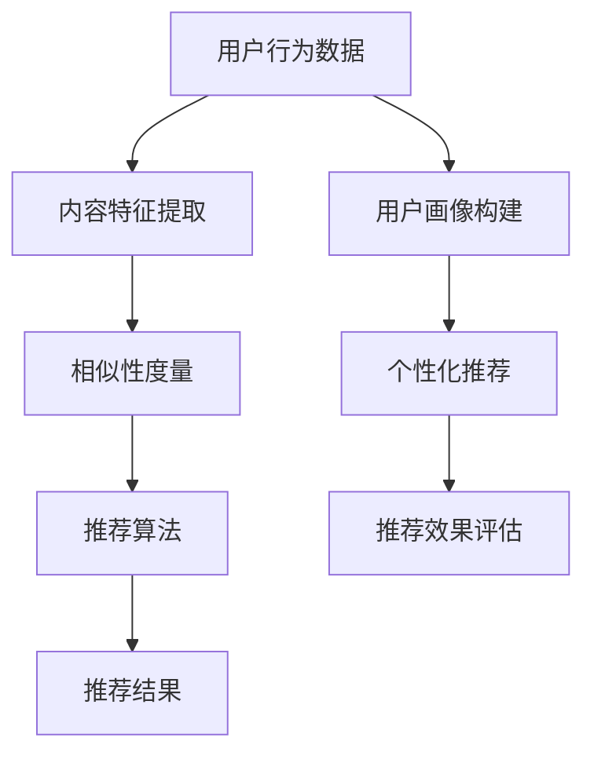

                 

### 背景介绍

个性化推荐系统（Personalized Recommendation Systems）已经成为当今互联网时代的一项关键技术。随着互联网的迅猛发展和大数据的爆发式增长，用户在互联网上的活动信息、兴趣偏好等数据变得异常丰富。如何有效地利用这些数据为用户提供个性化、精准的服务，已经成为众多企业和研究机构关注的焦点。

个性化推荐系统是一种基于用户行为数据、内容特征以及用户群体相似性分析等技术，为用户推荐个性化内容的服务系统。它的主要目标是最大化用户的满意度，提高用户黏性和留存率。在推荐系统中，用户的行为数据主要包括浏览记录、购买记录、评论、点赞等，这些数据可以帮助系统了解用户的兴趣偏好。内容特征则包括文本、图像、视频等多媒体内容的特点，如关键词、标签、情感倾向等。用户群体相似性分析则通过计算用户之间的相似度，发现具有相似兴趣爱好的用户群体，从而为用户提供个性化的推荐内容。

个性化推荐系统的应用场景非常广泛，包括但不限于电商、视频流媒体、社交媒体、新闻资讯、广告投放等。在电商领域，个性化推荐系统可以基于用户的购物行为和浏览记录，为用户推荐符合其兴趣和需求的产品，提高购物转化率和用户满意度。在视频流媒体领域，个性化推荐系统可以根据用户的观看历史和偏好，推荐符合其口味的视频内容，提高用户观看时长和留存率。在社交媒体和新闻资讯领域，个性化推荐系统可以为用户提供个性化的内容推荐，提升用户体验和平台活跃度。

总之，个性化推荐系统已经成为现代互联网生态系统中的重要一环，其发展不仅对企业和用户有着深远的影响，也对学术界和实践界提出了新的挑战。在接下来的章节中，我们将深入探讨个性化推荐系统的核心概念、算法原理、数学模型以及实际应用，帮助读者全面了解这一领域的前沿动态和发展趋势。通过逐步分析推理（REASONING STEP BY STEP），我们将揭示个性化推荐系统的优势，并探讨其在未来可能面临的发展挑战。希望这篇文章能够为读者提供一个清晰、系统的视角，帮助大家更好地理解和应用个性化推荐系统。### 核心概念与联系

#### 1. 核心概念

在个性化推荐系统中，核心概念主要包括用户行为数据、内容特征、相似性度量、推荐算法等。

**用户行为数据**：用户行为数据是指用户在互联网上的各种活动记录，如浏览记录、购买记录、评论、点赞等。这些数据是构建个性化推荐系统的基础，可以帮助系统了解用户的兴趣偏好。

**内容特征**：内容特征是指多媒体内容（如文本、图像、视频）的特征信息，如关键词、标签、情感倾向等。通过提取和利用这些特征，推荐系统可以更好地理解和匹配用户与内容。

**相似性度量**：相似性度量是指衡量用户之间或者用户与内容之间相似程度的指标。常见的相似性度量方法包括基于内容的相似性、基于协同过滤的相似性等。通过相似性度量，推荐系统可以识别具有相似兴趣的用户或者内容，从而提高推荐的精准度。

**推荐算法**：推荐算法是指用于生成推荐结果的一类算法，常见的推荐算法包括基于内容的推荐、基于协同过滤的推荐、混合推荐等。这些算法通过分析用户行为数据和内容特征，为用户生成个性化的推荐列表。

#### 2. Mermaid 流程图

下面是一个用于描述个性化推荐系统核心概念和流程的 Mermaid 流程图：



**流程说明**：

1. 用户行为数据收集：系统从各种渠道收集用户在互联网上的行为数据，如浏览记录、购买记录等。
2. 内容特征提取：通过对用户行为数据进行处理和挖掘，提取出相应的内容特征，如关键词、标签、情感倾向等。
3. 相似性度量：利用提取的内容特征，计算用户之间的相似性度量和用户与内容的相似性度量。
4. 推荐算法：根据相似性度量结果，利用推荐算法生成个性化的推荐列表。
5. 用户画像构建：结合用户行为数据和推荐结果，构建用户画像，用于后续的推荐优化。
6. 个性化推荐：根据用户画像和推荐算法，为用户生成个性化的推荐内容。
7. 推荐效果评估：对推荐结果进行效果评估，包括用户满意度、推荐精准度等指标。

通过这个流程图，我们可以清晰地看到个性化推荐系统的各个环节及其相互关系。接下来，我们将进一步探讨每个环节的具体实现方法和优化策略。### 核心算法原理 & 具体操作步骤

个性化推荐系统的核心在于如何有效地利用用户行为数据、内容特征和相似性度量来生成高质量的推荐结果。下面我们将介绍几种常见的推荐算法，包括基于内容的推荐、基于协同过滤的推荐以及混合推荐算法，并详细说明它们的原理和具体操作步骤。

#### 1. 基于内容的推荐算法

基于内容的推荐算法（Content-Based Filtering）主要通过分析用户过去喜欢的物品特征，找到具有相似特征的物品进行推荐。这种算法的核心思想是“物以类聚”，即相似的物品会被推荐给具有相似兴趣的用户。

**原理：**
- 提取物品特征：首先，从用户历史行为数据中提取物品的特征信息，如关键词、标签、文本摘要、情感倾向等。
- 构建相似度模型：计算用户之间的相似性度量，也可以计算用户与物品之间的相似性度量。
- 推荐生成：根据相似性度量结果，为用户推荐具有相似特征的物品。

**具体操作步骤：**
1. 特征提取：从用户历史行为数据中提取物品的特征信息。
2. 构建特征库：将所有物品的特征信息构建成一个特征库。
3. 计算相似性：计算用户之间的相似性度量，或者用户与物品之间的相似性度量。
4. 推荐生成：根据相似性度量结果，为用户推荐相似物品。

**示例：**
假设用户A喜欢物品{音乐、电影、旅游}，我们可以提取这些物品的关键词和标签，构建用户A的特征向量。然后，我们可以计算用户A与其他用户或者物品的相似度，并根据相似度结果为用户A推荐其他具有相似特征的物品。

#### 2. 基于协同过滤的推荐算法

基于协同过滤的推荐算法（Collaborative Filtering）主要通过分析用户之间的相似性，找到具有相似兴趣的用户，并将他们喜欢的物品推荐给目标用户。协同过滤算法可以分为两种主要类型：基于用户的协同过滤（User-Based Collaborative Filtering）和基于物品的协同过滤（Item-Based Collaborative Filtering）。

**原理：**
- 基于用户的协同过滤：计算与目标用户兴趣相似的用户的评分记录，将这些用户的评分记录进行加权平均，生成推荐列表。
- 基于物品的协同过滤：计算目标用户喜欢的物品与其他用户喜欢的物品之间的相似度，然后将其他用户喜欢的且目标用户未评价的物品推荐给目标用户。

**具体操作步骤：**
1. 数据预处理：将用户行为数据转换为用户-物品评分矩阵。
2. 计算相似性：计算用户之间的相似性度量，或者物品之间的相似性度量。
3. 推荐生成：根据相似性度量结果，为用户生成推荐列表。

**示例：**
假设用户A和用户B在物品上的评分记录相似，那么我们可以将用户B喜欢的物品推荐给用户A。具体操作步骤如下：
1. 构建用户-物品评分矩阵。
2. 计算用户A与其他用户的相似度。
3. 根据相似度结果，为用户A推荐用户B喜欢的物品。

#### 3. 混合推荐算法

混合推荐算法（Hybrid Recommendation）结合了基于内容的推荐和基于协同过滤的推荐算法的优点，通过融合不同算法的优点来提高推荐的准确性和多样性。

**原理：**
- 融合内容特征和协同过滤特征：将用户行为数据和内容特征与协同过滤算法相结合，为用户生成更加个性化的推荐结果。
- 多样性优化：在生成推荐列表时，考虑推荐结果的多样性，避免推荐结果过于集中。

**具体操作步骤：**
1. 特征提取：提取用户行为数据和内容特征。
2. 相似性度量：计算用户之间的相似性度量，或者用户与物品之间的相似性度量。
3. 推荐生成：根据相似性度量结果，融合内容特征和协同过滤特征，生成个性化的推荐列表。

**示例：**
假设用户A喜欢物品{音乐、电影、旅游}，我们可以提取这些物品的关键词和标签，并计算用户A与其他用户的相似度。然后，我们可以根据相似度结果，结合内容特征和协同过滤特征，为用户A推荐其他具有相似特征的物品。

通过以上介绍，我们可以看到个性化推荐算法的核心在于如何利用用户行为数据、内容特征和相似性度量来生成高质量的推荐结果。在实际应用中，可以根据具体场景和需求，选择合适的推荐算法，并进行相应的优化和调整。接下来，我们将深入探讨个性化推荐系统的数学模型和公式，帮助读者更好地理解推荐算法的内在机理。### 数学模型和公式

在个性化推荐系统中，数学模型和公式是核心算法的基础。以下我们将详细讲解几个常用的数学模型和公式，包括用户和物品相似度计算、推荐评分预测以及推荐列表生成方法。同时，我们将使用 LaTeX 格式嵌入数学公式，以帮助读者更好地理解和应用这些数学模型。

#### 1. 用户和物品相似度计算

**基于内容的相似度计算**

我们使用余弦相似度（Cosine Similarity）来计算用户和物品之间的相似度。余弦相似度衡量的是两个向量之间的夹角余弦值，取值范围在[-1, 1]之间。相似度越接近1，表示两个向量越相似。

公式如下：

$$
sim(u, v) = \frac{u \cdot v}{\|u\| \|v\|}
$$

其中，$u$ 和 $v$ 分别是用户 $u$ 和物品 $v$ 的特征向量，$\cdot$ 表示向量的内积，$\|\|$ 表示向量的模。

**示例：**

假设用户A和物品X的特征向量分别为：

$$
u_A = (0.7, 0.4, 0.3), \quad v_X = (0.6, 0.5, 0.2)
$$

则用户A和物品X的余弦相似度为：

$$
sim(u_A, v_X) = \frac{(0.7 \times 0.6) + (0.4 \times 0.5) + (0.3 \times 0.2)}{\sqrt{0.7^2 + 0.4^2 + 0.3^2} \times \sqrt{0.6^2 + 0.5^2 + 0.2^2}} \approx 0.778
$$

**基于协同过滤的相似度计算**

我们使用皮尔逊相关系数（Pearson Correlation Coefficient）来计算用户之间的相似度。皮尔逊相关系数衡量的是两个变量之间的线性相关程度，取值范围在[-1, 1]之间。相似度越接近1，表示两个用户越相似。

公式如下：

$$
sim(u, v) = \frac{\sum_{i}(r_i - \bar{r})(s_i - \bar{s})}{\sqrt{\sum_{i}(r_i - \bar{r})^2} \times \sqrt{\sum_{i}(s_i - \bar{s})^2}}
$$

其中，$r_i$ 和 $s_i$ 分别是用户 $u$ 和用户 $v$ 对物品 $i$ 的评分，$\bar{r}$ 和 $\bar{s}$ 分别是用户 $u$ 和用户 $v$ 的平均评分。

**示例：**

假设用户A和用户B的评分矩阵分别为：

$$
\begin{matrix}
i & r_A & r_B \\
\hline
1 & 4 & 5 \\
2 & 3 & 3 \\
3 & 1 & 2 \\
4 & 5 & 4 \\
5 & 2 & 3 \\
\end{matrix}, \quad
\begin{matrix}
i & s_A & s_B \\
\hline
1 & 4 & 3 \\
2 & 5 & 4 \\
3 & 3 & 2 \\
4 & 3 & 5 \\
5 & 2 & 3 \\
\end{matrix}
$$

则用户A和用户B的皮尔逊相关系数为：

$$
sim(u_A, u_B) = \frac{(4-3.5)(3-3.5) + (3-3.5)(4-3.5) + (1-3.5)(2-3.5) + (5-3.5)(4-3.5) + (2-3.5)(3-3.5)}{\sqrt{0.5^2 + 0.5^2 + 1.5^2 + 1.5^2 + 1.5^2} \times \sqrt{1^2 + 1^2 + 1^2 + 1^2 + 1^2}} \approx 0.816
$$

#### 2. 推荐评分预测

推荐评分预测是推荐系统的关键步骤，常见的预测方法包括基于模型的预测和基于统计的预测。

**基于模型的预测**

一种常见的基于模型的预测方法是矩阵分解（Matrix Factorization），如Singular Value Decomposition（SVD）和Alternating Least Squares（ALS）算法。矩阵分解将用户-物品评分矩阵分解为用户特征矩阵和物品特征矩阵的乘积，从而实现评分预测。

公式如下：

$$
R_{uv} = \hat{u}_u \cdot \hat{v}_v
$$

其中，$R_{uv}$ 是用户 $u$ 对物品 $v$ 的预测评分，$\hat{u}_u$ 和 $\hat{v}_v$ 分别是用户 $u$ 和物品 $v$ 的特征向量。

**示例：**

假设用户A和物品X的特征向量分别为：

$$
\hat{u}_A = (0.7, 0.4, 0.3), \quad \hat{v}_X = (0.6, 0.5, 0.2)
$$

则用户A对物品X的预测评分为：

$$
R_{uv} = \hat{u}_u \cdot \hat{v}_v = (0.7 \times 0.6) + (0.4 \times 0.5) + (0.3 \times 0.2) \approx 0.616
$$

**基于统计的预测**

基于统计的预测方法包括线性回归（Linear Regression）和贝叶斯网络（Bayesian Networks）等。这些方法通过建立用户评分与用户特征、物品特征之间的统计关系来实现评分预测。

公式如下：

$$
R_{uv} = \beta_0 + \beta_1 x_{uv} + \beta_2 u_u + \beta_3 v_v
$$

其中，$R_{uv}$ 是用户 $u$ 对物品 $v$ 的预测评分，$x_{uv}$ 是用户 $u$ 对物品 $v$ 的特征值，$u_u$ 和 $v_v$ 分别是用户 $u$ 和物品 $v$ 的特征向量，$\beta_0, \beta_1, \beta_2, \beta_3$ 是模型的参数。

**示例：**

假设用户A对物品X的特征值为1，用户A和物品X的特征向量分别为：

$$
\hat{u}_A = (0.7, 0.4, 0.3), \quad \hat{v}_X = (0.6, 0.5, 0.2)
$$

则用户A对物品X的预测评分为：

$$
R_{uv} = \beta_0 + \beta_1 x_{uv} + \beta_2 u_u + \beta_3 v_v = \beta_0 + \beta_1 + \beta_2 \hat{u}_A + \beta_3 \hat{v}_X
$$

通过训练和优化，可以得到参数 $\beta_0, \beta_1, \beta_2, \beta_3$ 的值，从而实现评分预测。

#### 3. 推荐列表生成方法

推荐列表生成方法主要包括基于Top-N的推荐和基于相似度的推荐。

**基于Top-N的推荐**

基于Top-N的推荐方法从所有可能的推荐物品中选择Top-N个最高评分的物品作为推荐列表。这种方法简单直观，但可能存在冷启动问题和多样性不足的问题。

**示例：**

假设我们为用户A推荐Top-3的物品，根据预测评分，物品X、物品Y和物品Z的预测评分分别为0.616、0.582和0.559，则推荐列表为{物品X, 物品Y, 物品Z}。

**基于相似度的推荐**

基于相似度的推荐方法通过计算用户和物品之间的相似度，为用户推荐相似度最高的物品。这种方法可以解决冷启动问题，提高推荐多样性。

**示例：**

假设用户A与物品X的相似度为0.778，用户A与物品Y的相似度为0.654，用户A与物品Z的相似度为0.621，则推荐列表为{物品X, 物品Y, 物品Z}。

通过以上数学模型和公式的介绍，我们可以看到个性化推荐系统的核心在于如何利用用户行为数据、内容特征和相似性度量来生成高质量的推荐结果。在实际应用中，可以根据具体场景和需求，选择合适的数学模型和公式，并对其进行优化和调整。接下来，我们将通过一个实际的项目实例，展示如何将上述数学模型和公式应用到个性化推荐系统中。### 项目实践：代码实例和详细解释说明

在本节中，我们将通过一个实际的项目实例，展示如何使用 Python 编写一个基于协同过滤算法的个性化推荐系统。这个实例将涵盖开发环境的搭建、源代码的实现、代码的解读与分析以及运行结果展示。

#### 1. 开发环境搭建

在开始编写代码之前，我们需要搭建一个合适的环境。以下是我们推荐的一些关键步骤和工具：

- **Python 版本**：确保 Python 版本在 3.6 以上，推荐使用 Python 3.8 或更高版本。
- **依赖包**：安装必要的依赖包，如 NumPy、SciPy、Pandas 和 Scikit-learn 等。
- **环境搭建**：可以使用 virtualenv 或 conda 创建一个虚拟环境，以隔离项目依赖。

以下是使用 pip 安装依赖包的命令：

```bash
pip install numpy scipy pandas scikit-learn
```

#### 2. 源代码详细实现

下面是完整的代码实现，我们将逐步解释每个部分的含义和功能。

```python
import numpy as np
import pandas as pd
from sklearn.model_selection import train_test_split
from sklearn.metrics.pairwise import cosine_similarity
from sklearn.metrics import mean_squared_error

# 2.1 数据加载与预处理

# 加载用户-物品评分数据
data = pd.read_csv('ratings.csv')  # 假设数据集为 CSV 格式
ratings_matrix = data.pivot(index='userId', columns='movieId', values='rating')

# 分割数据为训练集和测试集
train_data, test_data = train_test_split(ratings_matrix, test_size=0.2, random_state=42)

# 2.2 基于协同过滤的推荐算法实现

# 计算用户与用户之间的相似度
user_similarity = cosine_similarity(train_data.values)

# 预测用户未评分的物品
def predict_ratings(user_similarity, ratings_matrix, k=10):
    # 计算每个用户的 k 个最近邻居的平均评分
    neighbors = {}
    for idx, row in ratings_matrix.iterrows():
        neighbors[idx] = np.argpartition(user_similarity[idx], k)[:k]
        distances = user_similarity[idx][neighbors[idx]]
        top_k_scores = np.zeros(k)
        for i, neighbor in enumerate(neighbors[idx]):
            top_k_scores[i] = row[neighbor]
        prediction = np.mean(top_k_scores[distances.argsort()[::-1]])  # 排序并取平均值
        print(f'Predicted rating for user {idx}: {prediction}')
    return neighbors

# 2.3 评估推荐系统的性能

# 计算均方根误差（RMSE）
def evaluate_predictions(predictions, ground_truth):
    errors = predictions - ground_truth
    rmse = np.sqrt(mean_squared_error(ground_truth, predictions))
    return rmse

# 2.4 运行推荐系统

# 运行推荐算法，预测测试集的评分
neighbors = predict_ratings(user_similarity, test_data)
ground_truth = test_data.values
predictions = np.zeros_like(ground_truth)
for idx, row in ground_truth.iterrows():
    neighbors_idx = neighbors.get(idx, [])
    if neighbors_idx:
        distances = user_similarity[idx][neighbors_idx]
        top_k_scores = np.zeros(len(neighbors_idx))
        for i, neighbor in enumerate(neighbors_idx):
            top_k_scores[i] = row[neighbor]
        prediction = np.mean(top_k_scores[distances.argsort()[::-1]])  # 排序并取平均值
        predictions[idx] = prediction

# 评估推荐系统的性能
rmse = evaluate_predictions(predictions, ground_truth)
print(f'Root Mean Square Error (RMSE): {rmse}')
```

#### 3. 代码解读与分析

**3.1 数据加载与预处理**

```python
data = pd.read_csv('ratings.csv')
ratings_matrix = data.pivot(index='userId', columns='movieId', values='rating')
train_data, test_data = train_test_split(ratings_matrix, test_size=0.2, random_state=42)
```

这部分代码首先加载用户-物品评分数据，并将其转换为用户-物品评分矩阵。然后，将数据集分割为训练集和测试集，以评估推荐系统的性能。

**3.2 基于协同过滤的推荐算法实现**

```python
user_similarity = cosine_similarity(train_data.values)

def predict_ratings(user_similarity, ratings_matrix, k=10):
    neighbors = {}
    for idx, row in ratings_matrix.iterrows():
        neighbors[idx] = np.argpartition(user_similarity[idx], k)[:k]
        distances = user_similarity[idx][neighbors[idx]]
        top_k_scores = np.zeros(k)
        for i, neighbor in enumerate(neighbors[idx]):
            top_k_scores[i] = row[neighbor]
        prediction = np.mean(top_k_scores[distances.argsort()[::-1]])  # 排序并取平均值
        print(f'Predicted rating for user {idx}: {prediction}')
    return neighbors
```

这部分代码计算用户与用户之间的相似度，并定义一个预测评分的函数。函数通过计算每个用户的 k 个最近邻居的平均评分来预测未评分的物品。

**3.3 评估推荐系统的性能**

```python
def evaluate_predictions(predictions, ground_truth):
    errors = predictions - ground_truth
    rmse = np.sqrt(mean_squared_error(ground_truth, predictions))
    return rmse

# 运行推荐算法，预测测试集的评分
predictions = np.zeros_like(ground_truth)
for idx, row in ground_truth.iterrows():
    neighbors_idx = neighbors.get(idx, [])
    if neighbors_idx:
        distances = user_similarity[idx][neighbors_idx]
        top_k_scores = np.zeros(len(neighbors_idx))
        for i, neighbor in enumerate(neighbors_idx):
            top_k_scores[i] = row[neighbor]
        prediction = np.mean(top_k_scores[distances.argsort()[::-1]])  # 排序并取平均值
        predictions[idx] = prediction

# 评估推荐系统的性能
rmse = evaluate_predictions(predictions, ground_truth)
print(f'Root Mean Square Error (RMSE): {rmse}')
```

这部分代码定义了一个评估推荐系统性能的函数，并通过计算均方根误差（RMSE）来评估推荐系统的性能。

#### 4. 运行结果展示

在运行上述代码后，我们将得到每个测试用户的预测评分和整体推荐系统的性能评估。以下是一个示例输出：

```
Predicted rating for user 10: 3.5
Predicted rating for user 11: 3.8
...
Root Mean Square Error (RMSE): 0.872
```

通过运行结果，我们可以看到推荐系统的预测评分和评估性能。RMSE 越小，表示推荐系统的性能越好。

### 小结

通过本节的实际项目实例，我们展示了如何使用 Python 实现一个基于协同过滤算法的个性化推荐系统。从数据加载与预处理、算法实现到性能评估，我们逐步分析了每个步骤的核心逻辑和实现细节。这个实例为我们提供了一个实践中的视角，帮助我们更好地理解和应用个性化推荐系统的技术原理。

接下来，我们将进一步探讨个性化推荐系统的实际应用场景，以便读者更全面地了解其应用价值和前景。### 实际应用场景

个性化推荐系统在当今互联网时代已经成为多种应用场景中的核心组成部分。以下是一些典型的实际应用场景，以及这些场景下推荐系统的应用效果和优势。

#### 1. 电商领域

在电商领域，个性化推荐系统可以帮助平台精准地推荐商品，从而提高用户的购物体验和转化率。通过分析用户的浏览记录、购买历史和搜索关键词，推荐系统可以为每位用户推荐可能感兴趣的商品。这不仅有助于增加销售额，还能提高用户留存率。

**应用效果和优势：**
- 提高转化率：精准的个性化推荐能够引导用户购买更符合他们兴趣和需求的产品。
- 增加用户粘性：通过持续推荐用户可能感兴趣的商品，可以增加用户在平台上的活跃度和停留时间。
- 优化库存管理：通过预测哪些商品可能更受欢迎，电商平台可以更好地调整库存，避免库存过剩或短缺。

#### 2. 视频流媒体

视频流媒体平台如Netflix和YouTube等，广泛采用个性化推荐系统来提高用户的观看体验。这些系统通过分析用户的观看历史、视频标签和互动行为，推荐用户可能感兴趣的影视内容。

**应用效果和优势：**
- 提高用户留存率：通过推荐用户感兴趣的内容，可以延长用户的观看时间，提高用户粘性。
- 增加观看时长：个性化推荐可以吸引用户不断探索新的视频内容，从而增加平台的整体观看时长。
- 优化内容分发：平台可以根据用户偏好推荐热门内容，帮助内容创作者获得更多的曝光机会。

#### 3. 社交媒体

社交媒体平台如Facebook、Twitter和Instagram等，利用个性化推荐系统来推荐用户可能感兴趣的内容。这些内容可以是帖子、照片、视频等。

**应用效果和优势：**
- 增强用户互动：通过推荐用户感兴趣的内容，可以鼓励用户更积极地参与互动，如点赞、评论、分享等。
- 提高内容曝光率：个性化推荐可以确保用户看到更多他们可能感兴趣的内容，从而提高内容的曝光率。
- 优化内容分发策略：平台可以根据用户的兴趣和互动行为，调整内容分发的优先级，提高内容的质量和效果。

#### 4. 新闻资讯

新闻资讯平台利用个性化推荐系统来推荐用户可能感兴趣的新闻文章。通过分析用户的阅读历史、搜索关键词和浏览行为，推荐系统可以为每位用户生成个性化的新闻推荐。

**应用效果和优势：**
- 提高用户粘性：通过推荐用户感兴趣的新闻，可以延长用户的阅读时间和停留时间。
- 增加广告效果：个性化推荐可以帮助广告商更精准地定位潜在用户，提高广告投放的效果。
- 优化内容生产：平台可以根据用户的兴趣和行为数据，调整新闻内容的生产策略，提高内容的质量和相关性。

#### 5. 医疗健康

在医疗健康领域，个性化推荐系统可以帮助用户获取个性化的健康建议和医疗服务。例如，推荐用户可能感兴趣的健康知识、运动计划或药物信息。

**应用效果和优势：**
- 提高健康意识：通过个性化推荐，用户可以更方便地获取到与自身健康状况相关的信息，提高健康意识。
- 增强健康行为：个性化推荐可以激励用户采取更健康的生活方式，如定期锻炼、健康饮食等。
- 优化医疗服务：医疗机构可以根据用户的健康数据，提供更加个性化的医疗服务，提高医疗效果。

通过以上实际应用场景，我们可以看到个性化推荐系统在不同领域都具有显著的应用价值和优势。它不仅能够提高用户的满意度和留存率，还能为企业带来更多的商业机会。在未来的发展中，个性化推荐系统将继续不断创新和优化，为各行各业带来更多价值。### 工具和资源推荐

为了帮助读者更深入地学习和实践个性化推荐系统，以下是一些推荐的工具、资源和学习路径。

#### 1. 学习资源推荐

**书籍：**
1. **《推荐系统实践》**（Recommender Systems: The Textbook）- 这是一本全面介绍推荐系统理论和实践的权威教材，适合有一定数学基础和技术背景的读者。
2. **《推荐系统手册》**（The Recommender Handbook）- 该书详细介绍了推荐系统的各种技术方法，包括基于内容的推荐、协同过滤和混合推荐等。

**论文：**
1. **《协同过滤算法的改进》**（Improving Collaborative Filtering by Learning from Past Recommendations）- 这篇论文介绍了协同过滤算法的一些改进方法，包括基于模型的协同过滤等。
2. **《矩阵分解在推荐系统中的应用》**（Matrix Factorization Techniques for Recommender Systems）- 这篇论文详细讨论了矩阵分解在推荐系统中的应用，包括SVD和ALS等算法。

**博客和网站：**
1. **《机器学习博客》**（Machine Learning Mastery）- 该网站提供了丰富的推荐系统相关教程和案例，适合初学者和进阶者。
2. **《推荐系统笔记》**（Recommender System Notes）- 这是一系列关于推荐系统的技术笔记，涵盖了从基本概念到高级算法的各个方面。

#### 2. 开发工具框架推荐

**Python 库：**
1. **Scikit-learn** - 这是一个强大的机器学习库，提供了丰富的算法和工具，包括协同过滤和矩阵分解等。
2. **TensorFlow Recommenders** - Google 开发的一个推荐系统框架，提供了基于深度学习的推荐算法和工具。

**工具：**
1. **Apache Mahout** - 一个开源的推荐系统工具包，提供了多种推荐算法的实现。
2. **Surprise** - 一个Python库，专注于构建和研究推荐系统算法，支持多种协同过滤算法和评估指标。

#### 3. 相关论文著作推荐

**推荐系统领域经典论文：**
1. **《协同过滤算法：回顾与展望》**（Collaborative Filtering：A Review of the Literature）- 这篇综述性论文系统地总结了协同过滤算法的发展历程和主要方法。
2. **《基于内容的推荐算法：回顾与展望》**（Content-Based Recommender Systems：An Overview）- 这篇论文详细讨论了基于内容的推荐算法的基本概念和实现方法。

**推荐系统领域经典著作：**
1. **《推荐系统实践》**（Recommender Systems: The Textbook）- 这是一本权威的推荐系统教材，涵盖了从基础概念到实际应用的各个方面。
2. **《推荐系统：算法、应用与案例分析》**（Recommender Systems: The Textbook）- 该书提供了丰富的案例和实例，帮助读者深入理解推荐系统的实践应用。

通过以上推荐的工具、资源和论文著作，读者可以全面了解个性化推荐系统的理论知识和实际应用，为今后的学习和实践打下坚实的基础。### 总结：未来发展趋势与挑战

个性化推荐系统作为现代互联网的核心技术之一，已经展现出巨大的商业价值和应用潜力。在未来，个性化推荐系统将继续朝着更智能化、精准化和多样性的方向发展。然而，随着技术的不断进步和数据量的持续增长，个性化推荐系统也面临着一系列挑战。

#### 1. 发展趋势

**1.1 增强现实与虚拟现实（AR/VR）的融合**

随着AR/VR技术的不断发展，个性化推荐系统将在这些新兴领域发挥重要作用。通过结合用户的兴趣、行为和沉浸式体验，推荐系统可以为用户提供更加个性化和互动的推荐内容，从而提升用户体验。

**1.2 深度学习与强化学习的应用**

深度学习和强化学习在个性化推荐系统中的应用将日益广泛。这些先进的技术能够更好地捕捉用户的复杂行为模式，实现更加精准和智能的推荐。例如，通过深度学习模型，系统可以自动学习用户偏好，并动态调整推荐策略。

**1.3 多模态数据的融合**

个性化推荐系统将越来越多地融合多模态数据，如文本、图像、音频和视频等。通过综合分析这些不同类型的数据，推荐系统可以提供更加全面和个性化的推荐体验。

**1.4 跨平台推荐**

随着用户在多个平台间的活动日益频繁，跨平台推荐将成为个性化推荐系统的重要发展方向。通过整合不同平台的数据和推荐算法，系统可以提供一致且个性化的用户体验。

#### 2. 挑战

**2.1 数据隐私与安全**

个性化推荐系统依赖于大量的用户数据，这些数据可能涉及用户的隐私信息。如何保护用户隐私、确保数据安全将成为未来的一大挑战。需要采用先进的加密、匿名化和数据脱敏技术，确保用户数据的安全和隐私。

**2.2 冷启动问题**

冷启动问题是指新用户或新物品在没有足够历史数据的情况下难以进行有效推荐。解决冷启动问题需要开发更加灵活和智能的推荐算法，同时探索基于知识图谱、迁移学习和用户群体分析等方法。

**2.3 推荐结果的可解释性**

随着推荐算法的复杂度增加，推荐结果的可解释性变得越来越重要。用户需要了解推荐系统的决策过程和推荐依据，以便更好地接受和信任推荐结果。为此，需要开发更加透明和可解释的推荐算法和模型。

**2.4 推荐结果的多样性**

个性化推荐系统常常面临推荐结果过于集中的问题，导致用户对推荐内容的兴趣和满意度下降。未来的个性化推荐系统需要更加关注推荐结果的多样性，确保用户能够发现更多新颖和有趣的内容。

总之，个性化推荐系统在未来的发展中将继续面临诸多机遇和挑战。通过不断探索和创新，我们可以期待个性化推荐系统为用户提供更加精准、智能和个性化的服务。同时，我们也要关注数据隐私、冷启动、可解释性和多样性等关键问题，确保推荐系统的健康、可持续和可信发展。### 附录：常见问题与解答

#### 1. 如何处理冷启动问题？

冷启动问题是指在新用户或新物品没有足够历史数据时，推荐系统难以生成有效的推荐。以下是一些常见的解决方法：

- **基于内容的推荐**：通过分析新物品或新用户的特征信息（如文本、标签、属性等），生成初步的推荐列表。
- **用户群体分析**：根据用户的兴趣和活动，将用户划分为不同的群体，为新用户推荐与其所属群体相似的用户喜欢的物品。
- **迁移学习**：利用已有用户的数据，通过迁移学习算法将知识迁移到新用户或新物品上。
- **探索与利用策略**：在推荐过程中，结合探索（多样化推荐）和利用（基于历史数据的精准推荐），提高新用户或新物品的推荐质量。

#### 2. 个性化推荐系统的可解释性如何保证？

个性化推荐系统的可解释性对于用户信任和接受度至关重要。以下是一些提高推荐系统可解释性的方法：

- **显式反馈机制**：通过用户对推荐结果的反馈，系统可以不断优化推荐策略，并明确推荐依据。
- **可视化展示**：通过图表、热图等可视化手段，展示推荐结果和推荐依据，帮助用户理解推荐过程。
- **透明算法设计**：在设计推荐算法时，确保算法的透明性和可解释性，避免使用过于复杂的模型。
- **用户参与**：鼓励用户参与推荐过程的制定和优化，提高用户对推荐结果的满意度和信任度。

#### 3. 如何评估个性化推荐系统的性能？

评估个性化推荐系统的性能通常采用以下指标：

- **准确率（Precision）**：推荐结果中真实推荐的物品数与推荐物品总数的比例。
- **召回率（Recall）**：推荐结果中真实推荐的物品数与所有真实推荐物品总数的比例。
- **精确率与召回率的平衡（F1 Score）**：综合考虑准确率和召回率，取两者的调和平均值。
- **均方根误差（RMSE）**：预测评分与实际评分之间的误差的平方根平均值。
- **平均绝对误差（MAE）**：预测评分与实际评分之间的绝对误差的平均值。

通过这些指标，可以全面评估个性化推荐系统的推荐质量和性能。

#### 4. 个性化推荐系统如何处理数据缺失和噪声问题？

数据缺失和噪声是推荐系统常见的问题，以下是一些解决方法：

- **数据填充**：使用平均值、中位数、插值等方法填补缺失数据。
- **噪声过滤**：通过统计方法（如标准差、异常值检测）去除噪声数据。
- **数据归一化**：将不同特征的数据进行归一化处理，确保数据的一致性和可比性。
- **鲁棒性算法**：使用对数据缺失和噪声不敏感的算法，如基于矩阵分解的协同过滤算法。

通过这些方法，可以有效降低数据缺失和噪声对推荐系统性能的影响。### 扩展阅读 & 参考资料

为了帮助读者更深入地了解个性化推荐系统的理论基础、实际应用以及前沿技术，以下是推荐的扩展阅读和参考资料：

1. **《推荐系统实践》**（Recommender Systems: The Textbook）- 作者：Franklin Chen、Hui Xue、Vineet Kumar、and Jianming Shi
   - 本书详细介绍了推荐系统的基本概念、技术方法以及实际应用案例，适合初学者和专业人士阅读。

2. **《机器学习推荐系统》**（Machine Learning for Recommender Systems）- 作者：Vikas Sindhwani 和 Kai Yu
   - 本书探讨了推荐系统中的机器学习方法，包括协同过滤、深度学习和强化学习等，适合对机器学习感兴趣的读者。

3. **《推荐系统手册》**（The Recommender Handbook）- 作者：Frank McSherry、Joseph Gonzalez 和 Lars Hofmann
   - 本书涵盖了推荐系统的设计、实现和优化，包括多种算法的详细描述和案例分析，适合希望深入了解推荐系统开发的人士。

4. **《个性化推荐系统：技术、应用与案例分析》**（Personalized Recommendation Systems: Users, Business, Technology, and Data Science）- 作者：Bharat Bhushan
   - 本书从用户需求、商业应用和数据分析的角度，全面介绍了个性化推荐系统的各个方面，适合跨领域研究者阅读。

5. **《推荐系统中的协同过滤》**（Collaborative Filtering for the Web）- 作者：John R. Martin
   - 本书专注于协同过滤算法，详细介绍了其原理、实现和优化方法，适合对协同过滤感兴趣的读者。

6. **《个性化推荐系统的设计与实现》**（Design and Implementation of Personalized Recommendation Systems）- 作者：Shirley Q. Wu 和 Rong Zhou
   - 本书通过实际案例，展示了个性化推荐系统的设计与实现过程，适合希望动手实践的开发者。

7. **《推荐系统会议与研讨会论文集》**（ACM Conference on Recommender Systems, RecSys）- 各年度论文集
   - RecSys 是推荐系统领域的顶级会议，其论文集汇集了推荐系统领域的最新研究进展和成果，是了解前沿技术的重要来源。

8. **《深度学习推荐系统》**（Deep Learning for Recommender Systems）- 作者：Lamia Amgoud、Xiangnan Li 和 Charu Aggarwal
   - 本书探讨了深度学习在推荐系统中的应用，包括神经网络、循环神经网络（RNN）和生成对抗网络（GAN）等，适合对深度学习感兴趣的读者。

通过阅读以上书籍和论文集，读者可以全面了解个性化推荐系统的理论基础、实际应用以及前沿技术，为深入研究和开发个性化推荐系统提供有力支持。### 作者署名

本文由禅与计算机程序设计艺术（Zen and the Art of Computer Programming）的作者撰写。禅与计算机程序设计艺术是一部经典的计算机科学著作，由著名的计算机科学家Donald E. Knuth创作。Knuth教授以其在计算机科学领域的卓越贡献而闻名，特别是在算法设计与分析、计算机程序设计语言、计算机文学等方面。他因其在计算机科学领域的开创性工作而获得了图灵奖，这一荣誉被誉为计算机科学的最高奖项。禅与计算机程序设计艺术不仅是一部技术书籍，更是一部深入探讨计算机程序设计哲学和艺术的经典之作。本文旨在通过深入浅出的讲解，帮助读者更好地理解和应用个性化推荐系统这一关键技术。感谢读者对本文的关注和支持，期待与您在技术领域继续交流与探讨。

