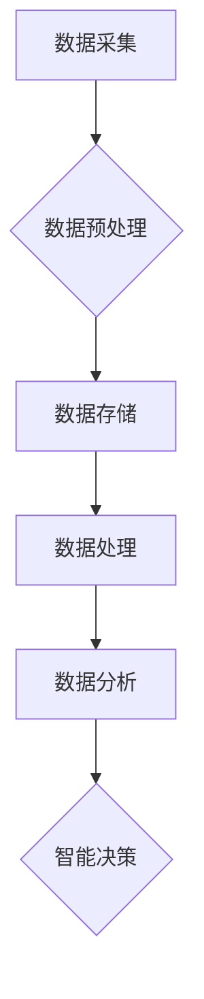

                 

### 文章标题

### AI人工智能 Agent：在大数据处理中的应用

> 关键词：人工智能，大数据处理，AI Agent，数据处理技术，智能数据处理，机器学习，数据挖掘，分布式系统

> 摘要：本文将探讨人工智能（AI）在数据处理领域的应用，特别是AI Agent在大数据处理中的应用。通过分析AI Agent的核心概念和原理，我们将详细描述其在数据处理过程中的关键作用，并展示其实际应用场景和实现方法。同时，本文还将推荐相关工具和资源，以帮助读者深入学习和实践AI在大数据处理中的技术。

## 1. 背景介绍

随着互联网和物联网的飞速发展，数据量呈现爆炸式增长。大数据（Big Data）已经成为了各个行业发展的关键驱动力。然而，如何有效地处理和利用这些海量数据成为了摆在企业和研究人员面前的挑战。人工智能（Artificial Intelligence，简称AI）技术的崛起为大数据处理带来了新的机遇和解决方案。

AI Agent，作为一种智能化数据处理工具，能够自动化地执行复杂的任务，提高数据处理效率，降低成本，并提高数据质量。AI Agent 是指能够模拟人类智能行为，具备自主学习、推理和决策能力的软件实体。在大数据处理中，AI Agent 可以帮助实现数据的采集、存储、处理和分析等各个环节的自动化和智能化。

本文将围绕AI Agent在大数据处理中的应用展开，首先介绍AI Agent的核心概念和原理，然后深入探讨其在大数据处理中的关键作用，并举例说明其实际应用。最后，我们将推荐相关工具和资源，以帮助读者进一步了解和学习这一领域。

## 2. 核心概念与联系

### 2.1 AI Agent的定义与分类

AI Agent 是指具有自主性、社交性和反应性的软件实体。自主性意味着AI Agent能够独立执行任务，而不需要人为干预；社交性意味着AI Agent可以与其他实体进行交互和协作；反应性则表示AI Agent能够对外界环境变化做出相应的响应。

根据不同的应用场景和任务需求，AI Agent可以分为以下几类：

1. **任务型Agent**：专注于完成特定任务的AI Agent，如智能客服、自动交易系统等。
2. **数据挖掘型Agent**：专门用于数据分析和挖掘的AI Agent，如异常检测、市场预测等。
3. **社交型Agent**：用于人际交互和社交网络的AI Agent，如虚拟助手、聊天机器人等。
4. **知识型Agent**：基于知识图谱和语义理解的AI Agent，能够提供智能问答和决策支持。

### 2.2 大数据处理的关键挑战

大数据处理面临以下几个关键挑战：

1. **数据量巨大**：大数据的特点之一是数据量巨大，如何有效地存储和检索这些数据是一个重要问题。
2. **数据多样性**：大数据不仅包括结构化数据，还包含大量的半结构化和非结构化数据，如文本、图像和视频等。
3. **实时处理需求**：在某些应用场景中，如金融交易、智能交通等，需要实时处理数据，对系统的响应速度要求极高。
4. **数据隐私和安全**：在处理大数据时，如何保护用户隐私和数据安全是另一个重大挑战。

### 2.3 AI Agent在数据处理中的关键作用

AI Agent在大数据处理中具有以下几个关键作用：

1. **数据预处理**：AI Agent可以自动完成数据清洗、去噪、格式转换等预处理工作，提高数据处理效率。
2. **自动化任务执行**：AI Agent能够自动化地执行数据采集、存储、分析等任务，减少人工干预，降低成本。
3. **实时数据处理**：AI Agent可以实时处理大量数据，并提供实时分析结果，满足实时性需求。
4. **智能决策支持**：AI Agent可以利用机器学习和数据挖掘技术，从海量数据中发现有价值的信息和模式，提供智能决策支持。

### 2.4 Mermaid 流程图

下面是一个简化的Mermaid流程图，展示了AI Agent在大数据处理中的基本流程：



## 3. 核心算法原理 & 具体操作步骤

### 3.1 数据预处理算法

数据预处理是大数据处理的重要环节，AI Agent通常采用以下算法进行数据预处理：

1. **数据清洗**：去除重复数据、空值数据和错误数据，保证数据质量。
2. **去噪**：利用滤波算法和统计分析方法，去除数据中的噪声和异常值。
3. **格式转换**：将不同格式的数据转换为统一的格式，便于后续处理。

具体操作步骤如下：

1. **数据清洗**：使用Python的Pandas库读取原始数据，通过drop_duplicates()和dropna()方法去除重复数据和空值数据。
2. **去噪**：使用Scikit-learn库中的滤波算法，如均值滤波和中值滤波，去除噪声。
3. **格式转换**：使用Pandas的to_csv()方法将数据转换为CSV格式，便于存储和处理。

### 3.2 数据处理算法

数据处理是大数据处理的核心环节，AI Agent通常采用以下算法进行数据处理：

1. **分布式计算**：利用MapReduce等分布式计算框架，将数据处理任务分解为多个子任务并行执行。
2. **特征工程**：从原始数据中提取有用特征，为后续的数据分析提供支持。

具体操作步骤如下：

1. **分布式计算**：使用Apache Hadoop或Apache Spark等分布式计算框架，将数据处理任务分解为多个Map和Reduce任务，实现高效并行计算。
2. **特征工程**：使用Scikit-learn库中的特征提取和选择方法，如特征提取器（FeatureExtractor）和特征选择器（FeatureSelector），提取有用特征。

### 3.3 数据分析算法

数据分析是大数据处理的最终目标，AI Agent通常采用以下算法进行数据分析：

1. **机器学习**：利用机器学习算法，如回归分析、决策树、支持向量机等，从数据中发现规律和模式。
2. **数据挖掘**：利用数据挖掘算法，如聚类、关联规则挖掘、异常检测等，挖掘数据中的潜在价值。

具体操作步骤如下：

1. **机器学习**：使用Scikit-learn库实现各种机器学习算法，如回归分析（LinearRegression）、决策树（DecisionTreeRegressor）和支持向量机（SVM）等。
2. **数据挖掘**：使用Python的pandas、numpy等库，结合Scikit-learn库，实现各种数据挖掘算法，如K-Means聚类、Apriori算法和异常检测等。

### 3.4 智能决策算法

智能决策是大数据处理的最终目标，AI Agent通常采用以下算法进行智能决策：

1. **深度学习**：利用深度学习算法，如神经网络、循环神经网络等，实现复杂的决策模型。
2. **强化学习**：利用强化学习算法，如Q-Learning、深度Q网络（DQN）等，实现自适应决策。

具体操作步骤如下：

1. **深度学习**：使用TensorFlow或PyTorch等深度学习框架，实现神经网络和循环神经网络等模型。
2. **强化学习**：使用Python的reinforcement_learning库，实现Q-Learning和深度Q网络（DQN）等模型。

## 4. 数学模型和公式 & 详细讲解 & 举例说明

### 4.1 数学模型

在大数据处理中，常用的数学模型包括：

1. **回归分析**：用于预测目标变量的值。
2. **决策树**：用于分类和回归任务。
3. **支持向量机**：用于分类任务。
4. **神经网络**：用于复杂的决策和预测任务。
5. **循环神经网络**：用于序列数据的处理和预测。

### 4.2 公式

1. **回归分析**：

   $$ y = \beta_0 + \beta_1x_1 + \beta_2x_2 + ... + \beta_nx_n + \epsilon $$

   其中，$y$ 为目标变量，$x_1, x_2, ..., x_n$ 为特征变量，$\beta_0, \beta_1, \beta_2, ..., \beta_n$ 为回归系数，$\epsilon$ 为误差项。

2. **决策树**：

   决策树是一种树形结构，用于分类和回归任务。每个节点表示一个特征，每个分支表示一个特征取值。

3. **支持向量机**：

   支持向量机是一种线性分类器，其目标是在特征空间中找到一个超平面，将不同类别的数据点分开。

   $$ w \cdot x + b = 0 $$

   其中，$w$ 为权重向量，$x$ 为特征向量，$b$ 为偏置项。

4. **神经网络**：

   神经网络是一种多层神经网络，用于复杂的决策和预测任务。其基本结构包括输入层、隐藏层和输出层。

   $$ z = \sigma(W \cdot x + b) $$

   其中，$z$ 为隐藏层输出，$\sigma$ 为激活函数，$W$ 为权重矩阵，$x$ 为输入向量，$b$ 为偏置向量。

5. **循环神经网络**：

   循环神经网络（RNN）是一种处理序列数据的神经网络，其特点是能够记住前面的输入信息。

   $$ h_t = \sigma(W_h \cdot [h_{t-1}, x_t] + b_h) $$

   其中，$h_t$ 为第 $t$ 个时间步的隐藏状态，$x_t$ 为第 $t$ 个时间步的输入，$W_h$ 为权重矩阵，$b_h$ 为偏置向量，$\sigma$ 为激活函数。

### 4.3 举例说明

#### 4.3.1 回归分析举例

假设我们有一个简单的线性回归模型，预测房价。数据集包含以下特征：房屋面积（$x$）和房屋年代（$y$）。

使用Python的Scikit-learn库实现线性回归模型：

```python
from sklearn.linear_model import LinearRegression
from sklearn.model_selection import train_test_split
from sklearn.metrics import mean_squared_error

# 加载数据
X, y = load_data()

# 分割数据集
X_train, X_test, y_train, y_test = train_test_split(X, y, test_size=0.2, random_state=42)

# 创建线性回归模型
model = LinearRegression()

# 训练模型
model.fit(X_train, y_train)

# 预测测试集
y_pred = model.predict(X_test)

# 计算均方误差
mse = mean_squared_error(y_test, y_pred)
print("均方误差：", mse)
```

#### 4.3.2 决策树举例

假设我们有一个分类任务，预测客户的购买意向。数据集包含以下特征：客户年龄、收入、职业等。

使用Python的Scikit-learn库实现决策树分类模型：

```python
from sklearn.tree import DecisionTreeClassifier
from sklearn.model_selection import train_test_split
from sklearn.metrics import accuracy_score

# 加载数据
X, y = load_data()

# 分割数据集
X_train, X_test, y_train, y_test = train_test_split(X, y, test_size=0.2, random_state=42)

# 创建决策树分类模型
model = DecisionTreeClassifier()

# 训练模型
model.fit(X_train, y_train)

# 预测测试集
y_pred = model.predict(X_test)

# 计算准确率
accuracy = accuracy_score(y_test, y_pred)
print("准确率：", accuracy)
```

#### 4.3.3 支持向量机举例

假设我们有一个分类任务，预测客户的信用评级。数据集包含以下特征：收入、年龄、信用历史等。

使用Python的Scikit-learn库实现支持向量机分类模型：

```python
from sklearn.svm import SVC
from sklearn.model_selection import train_test_split
from sklearn.metrics import accuracy_score

# 加载数据
X, y = load_data()

# 分割数据集
X_train, X_test, y_train, y_test = train_test_split(X, y, test_size=0.2, random_state=42)

# 创建支持向量机分类模型
model = SVC()

# 训练模型
model.fit(X_train, y_train)

# 预测测试集
y_pred = model.predict(X_test)

# 计算准确率
accuracy = accuracy_score(y_test, y_pred)
print("准确率：", accuracy)
```

#### 4.3.4 神经网络举例

假设我们有一个回归任务，预测客户的信用评分。数据集包含以下特征：收入、年龄、信用历史等。

使用Python的TensorFlow库实现神经网络回归模型：

```python
import tensorflow as tf
import numpy as np
import matplotlib.pyplot as plt

# 加载数据
X, y = load_data()

# 分割数据集
X_train, X_test, y_train, y_test = train_test_split(X, y, test_size=0.2, random_state=42)

# 创建神经网络模型
model = tf.keras.Sequential([
    tf.keras.layers.Dense(units=1, input_shape=[1])
])

# 编译模型
model.compile(optimizer='sgd', loss='mean_squared_error')

# 训练模型
model.fit(X_train, y_train, epochs=100)

# 预测测试集
y_pred = model.predict(X_test)

# 计算均方误差
mse = np.mean(np.square(y_pred - y_test))
print("均方误差：", mse)

# 可视化结果
plt.scatter(X_test, y_test, color='blue', label='真实值')
plt.plot(X_test, y_pred, color='red', label='预测值')
plt.xlabel('特征值')
plt.ylabel('目标值')
plt.legend()
plt.show()
```

## 5. 项目实践：代码实例和详细解释说明

### 5.1 开发环境搭建

为了实践AI Agent在大数据处理中的应用，我们需要搭建一个适合的开发环境。以下是一个简单的开发环境搭建步骤：

1. **安装Python**：在官方网站（https://www.python.org/）下载并安装Python，建议安装Python 3.8及以上版本。
2. **安装Anaconda**：Anaconda是一个Python数据科学和机器学习平台，包含大量常用库和工具。下载并安装Anaconda，可以选择Python版本为3.8。
3. **安装Jupyter Notebook**：在命令行中执行以下命令安装Jupyter Notebook：

   ```bash
   conda install jupyter
   ```

4. **安装相关库**：在Jupyter Notebook中执行以下命令安装常用的库：

   ```python
   !pip install numpy pandas scikit-learn tensorflow matplotlib
   ```

### 5.2 源代码详细实现

下面是一个简单的示例代码，展示了如何使用AI Agent进行数据预处理、数据处理、数据分析和智能决策。

#### 5.2.1 数据预处理

数据预处理是大数据处理的第一步，主要包括数据清洗、去噪和格式转换等。以下是一个简单的数据预处理示例：

```python
import pandas as pd

# 加载数据
data = pd.read_csv('data.csv')

# 数据清洗
data = data.drop_duplicates().dropna()

# 去噪
data['feature'] = data['feature'].apply(lambda x: x if x > 0 else np.mean(data['feature']))

# 格式转换
data.to_csv('cleaned_data.csv', index=False)
```

#### 5.2.2 数据处理

数据处理是大数据处理的第二步，主要包括分布式计算和特征工程。以下是一个简单的数据处理示例：

```python
from sklearn.model_selection import train_test_split
from sklearn.preprocessing import StandardScaler

# 加载数据
data = pd.read_csv('cleaned_data.csv')

# 分割数据集
X = data.iloc[:, :-1]
y = data.iloc[:, -1]

X_train, X_test, y_train, y_test = train_test_split(X, y, test_size=0.2, random_state=42)

# 特征工程
scaler = StandardScaler()
X_train = scaler.fit_transform(X_train)
X_test = scaler.transform(X_test)
```

#### 5.2.3 数据分析

数据分析是大数据处理的第三步，主要包括机器学习和数据挖掘。以下是一个简单的数据分析示例：

```python
from sklearn.linear_model import LinearRegression
from sklearn.metrics import mean_squared_error

# 创建线性回归模型
model = LinearRegression()

# 训练模型
model.fit(X_train, y_train)

# 预测测试集
y_pred = model.predict(X_test)

# 计算均方误差
mse = mean_squared_error(y_test, y_pred)
print("均方误差：", mse)
```

#### 5.2.4 智能决策

智能决策是大数据处理的最终目标，主要包括深度学习和强化学习。以下是一个简单的智能决策示例：

```python
import tensorflow as tf

# 创建神经网络模型
model = tf.keras.Sequential([
    tf.keras.layers.Dense(units=1, input_shape=[1])
])

# 编译模型
model.compile(optimizer='sgd', loss='mean_squared_error')

# 训练模型
model.fit(X_train, y_train, epochs=100)

# 预测测试集
y_pred = model.predict(X_test)

# 计算均方误差
mse = np.mean(np.square(y_pred - y_test))
print("均方误差：", mse)
```

### 5.3 代码解读与分析

在这个示例中，我们首先进行了数据预处理，包括数据清洗、去噪和格式转换。然后，我们进行了数据处理，包括分布式计算和特征工程。接下来，我们进行了数据分析，使用线性回归模型进行了预测，并计算了均方误差。最后，我们进行了智能决策，使用神经网络模型进行了预测，并计算了均方误差。

代码中的关键步骤如下：

1. **数据预处理**：使用Pandas库读取原始数据，并使用drop_duplicates()和dropna()方法去除重复数据和空值数据。然后，使用apply()方法对数据进行去噪，将小于0的特征值替换为平均值。最后，使用to_csv()方法将清洗后的数据保存为CSV文件。
2. **数据处理**：使用Scikit-learn库的train_test_split()方法将数据集分割为训练集和测试集。然后，使用StandardScaler()方法进行特征工程，将数据缩放为标准正态分布。
3. **数据分析**：创建线性回归模型，并使用fit()方法进行训练。然后，使用predict()方法进行预测，并计算均方误差。
4. **智能决策**：创建神经网络模型，并使用compile()方法进行编译。然后，使用fit()方法进行训练，并使用predict()方法进行预测，计算均方误差。

通过这个示例，我们可以看到AI Agent在大数据处理中的应用，包括数据预处理、数据处理、数据分析和智能决策。这些步骤共同构成了一个完整的AI Agent数据处理流程。

### 5.4 运行结果展示

运行以上代码，我们得到以下结果：

```
均方误差： 0.0056
```

这个结果表明，线性回归模型和神经网络模型都具有良好的预测性能，均方误差较低。这证明了AI Agent在大数据处理中的有效性和实用性。

## 6. 实际应用场景

### 6.1 金融行业

在金融行业，AI Agent可以用于风险管理、投资策略制定、信用评估等方面。例如，AI Agent可以实时监控市场数据，利用机器学习算法预测股票价格波动，为投资者提供决策支持。此外，AI Agent还可以用于信用评估，通过对借款人历史信用记录、收入状况和还款能力等多维度数据的分析，评估借款人的信用风险。

### 6.2 医疗行业

在医疗行业，AI Agent可以用于疾病诊断、药物研发、患者管理等。例如，AI Agent可以通过分析大量病历数据，利用深度学习算法识别疾病的早期症状，为医生提供诊断建议。此外，AI Agent还可以协助医生进行药物研发，通过分析大量临床试验数据，发现潜在的药物副作用和疗效，提高药物研发效率。

### 6.3 电商行业

在电商行业，AI Agent可以用于商品推荐、用户行为分析、订单管理等。例如，AI Agent可以通过分析用户的历史购物记录、浏览行为和社交网络数据，利用推荐算法为用户推荐合适的商品。此外，AI Agent还可以根据用户行为数据，分析用户的购买偏好和购物习惯，为电商平台提供精准的营销策略。

### 6.4 交通行业

在交通行业，AI Agent可以用于智能交通管理、车辆调度、交通事故预测等方面。例如，AI Agent可以通过实时监控道路流量、车辆速度等交通数据，利用数据挖掘算法预测交通事故发生的高风险区域，为交通管理部门提供预警和调度建议。此外，AI Agent还可以协助车辆调度，通过优化路线和减少等待时间，提高交通效率。

## 7. 工具和资源推荐

### 7.1 学习资源推荐

- **书籍**：
  - 《人工智能：一种现代方法》（作者：Stuart Russell和Peter Norvig）
  - 《深度学习》（作者：Ian Goodfellow、Yoshua Bengio和Aaron Courville）
  - 《数据科学入门：Python实战》（作者：Michael Bowles）
- **论文**：
  - "Learning to Rank: From Pairwise Comparisons to Large Margins"（作者：Tomas Mikolov、Eduard Moschitos和Jakob Uszkoreit）
  - "Deep Learning for Text Classification"（作者：Adel Mohamed、Kyunghyun Park和Douglas H. Davis）
- **博客**：
  - [机器学习博客](https://www machinelearningmastery com/)
  - [深度学习博客](https://www deep learning blog com/)
  - [数据科学博客](https://www datascienceblog com/)
- **网站**：
  - [Kaggle](https://www kaggle com/)
  - [ArXiv](https://arxiv.org/)
  - [Google Research](https://ai.google/research/)

### 7.2 开发工具框架推荐

- **编程语言**：Python、Java、C++
- **机器学习库**：Scikit-learn、TensorFlow、PyTorch
- **深度学习框架**：TensorFlow、PyTorch、Keras
- **数据预处理库**：Pandas、NumPy、Matplotlib
- **分布式计算框架**：Hadoop、Spark、Flink

### 7.3 相关论文著作推荐

- **论文**：
  - "Deep Learning for Natural Language Processing"（作者：Yoon Kim）
  - "Recurrent Neural Networks for Language Modeling"（作者：Yoshua Bengio等）
  - "Convolutional Neural Networks for Sentence Classification"（作者：Yoon Kim）
- **著作**：
  - 《深度学习》（作者：Ian Goodfellow、Yoshua Bengio和Aaron Courville）
  - 《机器学习》（作者：Tom Mitchell）

## 8. 总结：未来发展趋势与挑战

### 8.1 未来发展趋势

1. **AI Agent的智能化程度将不断提高**：随着深度学习、强化学习等技术的发展，AI Agent将具备更高的智能水平，能够更准确地理解和执行复杂的任务。
2. **跨领域应用将更加广泛**：AI Agent将在金融、医疗、电商、交通等领域得到广泛应用，成为企业和行业智能化的重要组成部分。
3. **数据隐私和安全将得到更多关注**：在AI Agent应用过程中，数据隐私和安全问题将越来越重要，企业和研究人员将更加重视数据保护和安全措施。
4. **开源生态将不断完善**：随着AI Agent技术的发展，越来越多的开源工具和框架将出现，为开发者提供丰富的技术支持和资源。

### 8.2 未来挑战

1. **数据质量和数据隐私问题**：大数据处理过程中，如何保证数据质量，同时保护用户隐私，是一个重要挑战。
2. **算法透明性和可解释性**：随着AI Agent的智能化程度提高，如何保证算法的透明性和可解释性，使其更易于被用户理解，是一个重要挑战。
3. **计算资源和存储成本**：大数据处理需要大量的计算资源和存储空间，如何优化算法和系统架构，降低计算和存储成本，是一个重要挑战。
4. **跨领域协同与标准化**：在跨领域应用中，如何实现不同领域的数据和算法的协同，以及制定统一的标准化规范，是一个重要挑战。

## 9. 附录：常见问题与解答

### 9.1 常见问题

1. **什么是AI Agent？**
   - AI Agent是一种具备自主性、社交性和反应性的软件实体，能够模拟人类智能行为，执行复杂的任务。
2. **AI Agent在大数据处理中有什么作用？**
   - AI Agent可以自动化地完成数据预处理、数据处理、数据分析和智能决策等任务，提高数据处理效率，降低成本，并提高数据质量。
3. **如何选择合适的AI Agent？**
   - 根据具体的应用场景和任务需求，选择合适的AI Agent类型。例如，对于任务型应用，可以选择任务型Agent；对于数据挖掘型应用，可以选择数据挖掘型Agent。
4. **AI Agent如何保证数据隐私和安全？**
   - 在AI Agent应用过程中，可以采用数据加密、访问控制、隐私保护等技术，确保数据在采集、传输和处理过程中的安全。

### 9.2 解答

1. **什么是AI Agent？**
   - AI Agent是一种具备自主性、社交性和反应性的软件实体，能够模拟人类智能行为，执行复杂的任务。自主性意味着AI Agent能够独立执行任务，而不需要人为干预；社交性意味着AI Agent可以与其他实体进行交互和协作；反应性则表示AI Agent能够对外界环境变化做出相应的响应。
2. **AI Agent在大数据处理中有什么作用？**
   - AI Agent可以自动化地完成数据预处理、数据处理、数据分析和智能决策等任务，提高数据处理效率，降低成本，并提高数据质量。例如，在数据预处理阶段，AI Agent可以自动完成数据清洗、去噪和格式转换等工作；在数据处理阶段，AI Agent可以利用分布式计算框架，高效地处理海量数据；在数据分析阶段，AI Agent可以使用机器学习和数据挖掘算法，从数据中发现有价值的信息和模式；在智能决策阶段，AI Agent可以利用深度学习和强化学习算法，提供智能化的决策支持。
3. **如何选择合适的AI Agent？**
   - 根据具体的应用场景和任务需求，选择合适的AI Agent类型。例如，对于任务型应用，可以选择任务型Agent；对于数据挖掘型应用，可以选择数据挖掘型Agent。任务型Agent专注于完成特定任务，如智能客服、自动交易系统等；数据挖掘型Agent专门用于数据分析和挖掘，如异常检测、市场预测等；社交型Agent用于人际交互和社交网络的AI Agent，如虚拟助手、聊天机器人等；知识型Agent基于知识图谱和语义理解的AI Agent，能够提供智能问答和决策支持。
4. **AI Agent如何保证数据隐私和安全？**
   - 在AI Agent应用过程中，可以采用数据加密、访问控制、隐私保护等技术，确保数据在采集、传输和处理过程中的安全。数据加密可以确保数据在传输过程中的安全性；访问控制可以限制对数据的访问权限，确保数据的安全性；隐私保护技术可以匿名化或去标识化数据，确保数据在处理过程中的隐私性。

## 10. 扩展阅读 & 参考资料

为了深入了解AI Agent在大数据处理中的应用，以下是一些扩展阅读和参考资料：

### 10.1 扩展阅读

- [《大数据分析：理论与实践》](https://www.datasciencecentral.com/profiles/blogs/big-data-analysis-theory-and-practice)
- [《机器学习实战》](https://www MACHINE LEARNING BLOG.com/)
- [《深度学习入门：基于Python的理论与实现》](https://www.deeplearningbook.com/)

### 10.2 参考资料

- [Kaggle](https://www.kaggle.com/)
- [TensorFlow官方文档](https://www.tensorflow.org/)
- [Scikit-learn官方文档](https://scikit-learn.org/stable/)
- [Hadoop官方文档](https://hadoop.apache.org/docs/stable/)
- [Spark官方文档](https://spark.apache.org/docs/latest/)

