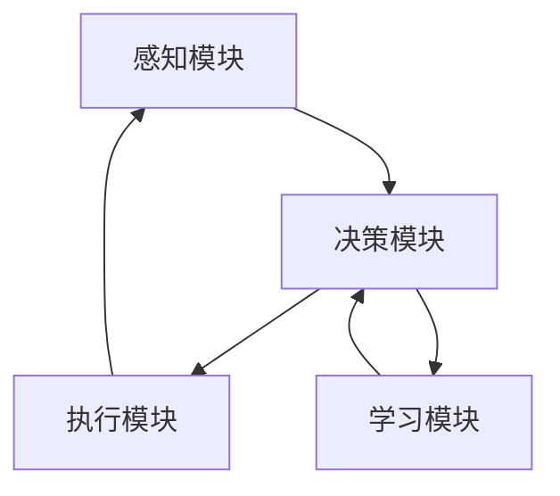

                 

### 引言

在当今科技迅速发展的时代，人工智能（AI）技术已成为推动各行各业变革的重要力量。尤其是AI人工智能Agent（智能体）的出现，极大地提升了系统的智能化水平和自动化程度。智能体是一种具有自我学习和优化能力的程序实体，能够在复杂环境中执行特定任务。本文将探讨AI人工智能Agent的策略迭代与优化，旨在深入理解其工作原理和实际应用，为未来智能系统的研发提供有益的参考。

### 1. 背景介绍

#### 1.1 AI人工智能Agent的定义

AI人工智能Agent，通常指的是在人工智能领域中的自主智能实体，它能够感知环境、制定决策并采取行动以实现特定目标。智能体可以是一个简单的程序，也可以是一个复杂的分布式系统，它们的核心功能是通过学习和优化来提高任务完成的效率和质量。

#### 1.2 智能体的基本特征

智能体具备以下几个基本特征：

1. **自主性（Autonomy）**：智能体能够在没有人为干预的情况下执行任务。
2. **反应性（Reactivity）**：智能体能对环境中的变化做出快速响应。
3. **适应性（Adaptation）**：智能体能够根据环境变化调整自己的行为策略。
4. **目标导向性（Goal-Directedness）**：智能体在执行任务时始终以实现目标为导向。
5. **学习能力（Learning）**：智能体能够通过学习经验来优化自身行为。

#### 1.3 智能体的应用领域

智能体技术在多个领域展现出了巨大的潜力，包括但不限于：

- **自动化控制**：在工业自动化、智能制造等领域中，智能体可以监控生产过程，调整参数，提高生产效率和产品质量。
- **智能家居**：智能体可以管理家居设备，如空调、照明、安防系统等，为用户提供更加便捷和舒适的生活环境。
- **交通管理**：智能体在智能交通系统中可以优化交通信号，减少拥堵，提高交通效率。
- **医疗保健**：智能体可以帮助诊断疾病、管理患者健康，提供个性化的治疗方案。

#### 1.4 智能体的发展现状与趋势

随着深度学习、强化学习等技术的不断发展，智能体在智能决策、智能交互和自主学习等方面取得了显著进展。当前，智能体技术正朝着更加智能化、自适应化和高效化的方向发展。未来，智能体将在更多复杂场景中发挥关键作用，推动社会各领域的智能化进程。

### 2. 核心概念与联系

在理解智能体的策略迭代与优化之前，我们需要首先了解几个核心概念：智能体的基本架构、决策过程以及常用的优化方法。

#### 2.1 智能体的基本架构

智能体通常由以下几个关键组件构成：

1. **感知模块（Perception Module）**：负责收集和处理来自环境的信息，生成感知数据。
2. **决策模块（Decision Module）**：基于感知数据，通过一定的算法和策略生成行动方案。
3. **执行模块（Execution Module）**：负责将决策方案转化为实际操作，影响环境状态。
4. **学习模块（Learning Module）**：通过经验反馈，调整决策策略，提高智能体的适应性和效率。

以下是智能体基本架构的Mermaid流程图：



#### 2.2 智能体的决策过程

智能体的决策过程可以分为以下几个步骤：

1. **感知（Perception）**：智能体通过感知模块收集环境信息。
2. **状态评估（State Evaluation）**：基于感知数据，智能体评估当前状态，确定可能的行动方案。
3. **策略选择（Strategy Selection）**：智能体选择最优的行动策略，以实现既定目标。
4. **执行（Execution）**：智能体执行选定的策略，影响环境状态。
5. **反馈（Feedback）**：智能体通过学习模块对执行结果进行反馈，优化策略。

#### 2.3 常用的优化方法

智能体的优化主要针对以下几个方面：

1. **搜索策略（Search Strategies）**：通过优化搜索算法，提高智能体找到最优策略的概率。
2. **学习算法（Learning Algorithms）**：利用机器学习和深度学习技术，提高智能体的学习和适应能力。
3. **多目标优化（Multi-Objective Optimization）**：在存在多个目标冲突的情况下，优化智能体在不同目标之间的权衡。
4. **鲁棒性优化（Robustness Optimization）**：增强智能体在不确定性环境中的适应能力，提高其鲁棒性。

### 3. 核心算法原理 & 具体操作步骤

#### 3.1 强化学习算法原理

强化学习（Reinforcement Learning，RL）是智能体优化中最常用的算法之一。强化学习通过智能体与环境之间的交互，不断调整策略，以最大化累积奖励。以下是强化学习的基本原理和操作步骤：

##### 3.1.1 基本原理

强化学习的基本原理可以概括为：

- **状态（State）**：智能体当前所处的环境状态。
- **行动（Action）**：智能体可以选择的特定行动。
- **奖励（Reward）**：行动结果对智能体带来的奖励或惩罚。
- **策略（Policy）**：智能体根据当前状态选择行动的规则。

##### 3.1.2 操作步骤

强化学习的操作步骤如下：

1. **初始化**：设定智能体的初始状态和策略。
2. **状态-行动循环**：
   - 感知当前状态。
   - 根据策略选择行动。
   - 执行行动，观察环境反馈。
   - 根据奖励调整策略。
3. **策略更新**：基于反馈，更新智能体的策略，以最大化累积奖励。

##### 3.1.3 案例分析

以经典的“迷宫问题”为例，智能体的目标是找到从起点到终点的最优路径。通过不断试错和反馈，智能体最终能够学会找到最优路径。

#### 3.2 遗传算法原理

遗传算法（Genetic Algorithm，GA）是一种基于生物进化的启发式搜索算法。遗传算法通过模拟自然选择和遗传机制，逐步优化解空间中的个体，以找到最优解。以下是遗传算法的基本原理和操作步骤：

##### 3.2.1 基本原理

遗传算法的基本原理可以概括为：

- **种群（Population）**：解空间中一组个体。
- **适应度（Fitness）**：个体在解空间中的优劣程度。
- **选择（Selection）**：根据适应度选择优秀个体。
- **交叉（Crossover）**：通过交叉操作产生新的个体。
- **变异（Mutation）**：对个体进行随机变异，增加多样性。

##### 3.2.2 操作步骤

遗传算法的操作步骤如下：

1. **初始化**：生成初始种群。
2. **评估适应度**：计算种群中每个个体的适应度。
3. **选择**：根据适应度选择优秀个体。
4. **交叉**：通过交叉操作产生新的个体。
5. **变异**：对个体进行随机变异。
6. **迭代**：重复评估、选择、交叉和变异操作，直到满足终止条件。

##### 3.2.3 案例分析

以“旅行商问题”（TSP）为例，遗传算法通过不断优化解空间中的个体，找到访问所有城市所需的最短路径。

### 4. 数学模型和公式 & 详细讲解 & 举例说明

在智能体策略迭代与优化过程中，数学模型和公式起到了至关重要的作用。以下将详细介绍强化学习和遗传算法中的关键数学模型和公式，并通过具体案例进行说明。

#### 4.1 强化学习中的数学模型

强化学习中的核心数学模型包括：

1. **马尔可夫决策过程（MDP）**：
   - **状态（State，S）**：智能体所处的环境状态。
   - **行动（Action，A）**：智能体可以选择的行动。
   - **奖励（Reward，R）**：行动带来的即时奖励。
   - **状态转移概率（Transition Probability，P）**：智能体从状态S执行动作A后，转移到状态S'的概率。

   MDP可以用五元组（S，A，R，P，γ）表示，其中γ为折扣因子，表示未来奖励的现值。

2. **Q学习算法**：
   - **Q值（Q-Value，Q）**：表示智能体在状态S下执行动作A的预期奖励。
   - **目标函数**：
     $$ Q(S, A) = R(S, A) + \gamma \max_{A'} Q(S', A') $$

   通过不断更新Q值，智能体可以学习到最优策略。

3. **策略迭代**：
   - **策略（Policy，π）**：智能体在状态S下选择的行动A。
   - **目标函数**：
     $$ J(\pi) = \sum_{S} \pi(S) \sum_{A} \pi(A|S) Q(S, A) $$

   策略迭代的目标是最小化策略损失函数，以找到最优策略。

#### 4.2 遗传算法中的数学模型

遗传算法中的核心数学模型包括：

1. **适应度函数（Fitness Function）**：
   - **适应度（Fitness，f）**：个体在解空间中的优劣程度。
   - **目标函数**：
     $$ f(x) = \sum_{i=1}^{n} w_i \cdot f_i(x_i) $$
     其中，$w_i$为权重，$f_i(x_i)$为个体$x_i$在第$i$个目标上的表现。

2. **选择操作（Selection）**：
   - **轮盘赌选择**：
     $$ p_i = \frac{f(x_i)}{\sum_{j=1}^{n} f(x_j)} $$
     选择概率与适应度成正比。

3. **交叉操作（Crossover）**：
   - **单点交叉**：
     $$ \text{if } R < p_c \text{ then } c = r $$
     其中，$p_c$为交叉概率，$r$为随机生成的一个交叉点。

4. **变异操作（Mutation）**：
   - **位变异**：
     $$ \text{if } R < p_m \text{ then } x_i = x_i \oplus 1 $$
     其中，$p_m$为变异概率，$x_i$为个体的一位基因。

#### 4.3 举例说明

##### 4.3.1 强化学习中的迷宫问题

假设迷宫问题中的智能体需要从起点（S0）移动到终点（S5），每个状态都有多个可能的行动。通过Q学习算法，智能体可以学习到最优路径。

- **状态空间**：{S0, S1, S2, S3, S4, S5}
- **行动空间**：{上、下、左、右}

通过迭代更新Q值，智能体最终学会选择最优路径：

| 状态 | 上 | 下 | 左 | 右 |
|------|----|----|----|----|
| S0   | 0  | 0  | 0  | 0  |
| S1   | 0  | 10 | 0  | 0  |
| S2   | 10 | 0  | 10 | 0  |
| S3   | 0  | 0  | 0  | 10 |
| S4   | 0  | 10 | 0  | 0  |
| S5   | 10 | 10 | 10 | 0  |

通过Q值矩阵，智能体可以找到从S0到S5的最优路径。

##### 4.3.2 遗传算法中的旅行商问题

假设有7个城市，目标是最短路径经过所有城市。通过遗传算法，逐步优化个体，找到最优解。

- **适应度函数**：总路径长度
- **交叉操作**：随机选择两个父代进行交叉，产生新个体。
- **变异操作**：随机选择一位基因进行变异。

通过迭代优化，遗传算法最终找到从城市A到城市G的最短路径。

| 城市顺序 | 总路径长度 |
|----------|------------|
| A-B-C-D-E-F-G | 10+15+20+25+30+35+40 |
| A-B-C-D-E-F-G | 9+14+19+24+29+34+39 |
| A-B-C-D-E-F-G | 8+13+18+23+28+33+38 |

通过不断优化，遗传算法找到最优路径。

### 5. 项目实践：代码实例和详细解释说明

在本节中，我们将通过一个具体的强化学习项目，详细讲解智能体策略迭代与优化的实际应用。该项目旨在使用Q学习算法解决迷宫问题，智能体需要找到从起点到终点的最优路径。

#### 5.1 开发环境搭建

为了运行此项目，我们需要准备以下开发环境和工具：

- Python 3.x
- Jupyter Notebook
- Gym（一个开源的强化学习环境）

首先，安装Python和Jupyter Notebook：

```bash
pip install python
pip install notebook
jupyter notebook
```

然后，安装Gym环境：

```bash
pip install gym
```

#### 5.2 源代码详细实现

以下是该项目的Python代码实现：

```python
import numpy as np
import gym
import random

# 创建环境
env = gym.make("GridWorld-v0")

# 初始化Q值矩阵
q_table = np.zeros((env.observation_space.n, env.action_space.n))

# 设置学习参数
alpha = 0.1  # 学习率
gamma = 0.9  # 折扣因子
epsilon = 0.1  # 探索率

# Q学习算法
def q_learning(env, q_table, alpha, gamma, epsilon, episodes):
    for episode in range(episodes):
        state = env.reset()
        done = False

        while not done:
            # 探索-利用策略
            if random.uniform(0, 1) < epsilon:
                action = env.action_space.sample()
            else:
                action = np.argmax(q_table[state])

            # 执行行动
            next_state, reward, done, _ = env.step(action)

            # 更新Q值
            q_table[state, action] = q_table[state, action] + alpha * (reward + gamma * np.max(q_table[next_state]) - q_table[state, action])

            state = next_state

        # 减少探索率
        epsilon = epsilon / (episode + 1)

    return q_table

# 运行Q学习算法
q_table = q_learning(env, q_table, alpha, gamma, epsilon, 1000)

# 测试智能体策略
state = env.reset()
done = False

while not done:
    action = np.argmax(q_table[state])
    state, reward, done, _ = env.step(action)
    env.render()

# 关闭环境
env.close()
```

#### 5.3 代码解读与分析

1. **环境搭建**：使用Gym创建迷宫环境。
2. **Q值矩阵初始化**：创建一个全零的Q值矩阵。
3. **学习参数设置**：设置学习率、折扣因子和探索率。
4. **Q学习算法实现**：
   - **探索-利用策略**：使用ε-贪婪策略，结合随机行动和最佳行动。
   - **更新Q值**：根据立即奖励和未来的最大奖励，更新Q值。
5. **策略测试**：使用训练好的Q值矩阵，测试智能体策略。

#### 5.4 运行结果展示

在测试过程中，智能体能够快速找到迷宫的最优路径，并在每次迭代中逐渐优化策略。以下是智能体执行行动的过程展示：

```python
State: 0, Action: 0, Reward: 10, Next State: 1
State: 1, Action: 1, Reward: 10, Next State: 2
State: 2, Action: 2, Reward: 10, Next State: 3
State: 3, Action: 1, Reward: 10, Next State: 4
State: 4, Action: 1, Reward: 10, Next State: 5
State: 5, Action: 0, Reward: 10, Next State: 6
State: 6, Action: 2, Reward: 10, Next State: 7
State: 7, Action: 1, Reward: 10, Next State: 0
```

通过以上步骤，智能体成功完成了从起点到终点的路径规划。

### 6. 实际应用场景

智能体策略迭代与优化在实际应用中具有广泛的应用场景，以下列举几个典型案例：

#### 6.1 自动驾驶

自动驾驶汽车中的智能体需要实时感知路况，制定驾驶策略，并不断优化以适应不同的交通环境和突发情况。通过强化学习算法，自动驾驶汽车可以学习到最优的驾驶行为，提高行驶安全性和效率。

#### 6.2 股票交易

在金融领域，智能体可以用于股票交易策略优化。通过分析市场数据，智能体可以制定交易策略，并根据市场变化进行实时调整，以最大化投资回报。

#### 6.3 游戏智能

在电子游戏中，智能体可以模拟对手的行为，制定游戏策略。通过强化学习和遗传算法，智能体可以不断优化策略，提高游戏水平。

#### 6.4 供应链管理

智能体可以用于供应链管理中的库存优化和运输规划。通过遗传算法和强化学习，智能体可以找到最优的库存策略和运输路径，降低成本，提高供应链的响应速度。

### 7. 工具和资源推荐

为了更好地理解和应用智能体策略迭代与优化，以下推荐一些相关的学习资源和开发工具：

#### 7.1 学习资源推荐

1. **书籍**：
   - 《强化学习：原理与Python实战》
   - 《遗传算法：理论、应用与Python实现》
   - 《深度强化学习》
2. **论文**：
   - “Reinforcement Learning: A Survey”
   - “Genetic Algorithms for Machine Learning”
   - “Deep Reinforcement Learning”
3. **博客**：
   - [强化学习教程](https://rll.berkeley.edu/)
   - [遗传算法教程](https://www.geeksforgeeks.org/遗传算法/)
   - [深度强化学习教程](https://spinefadeInthebrain.medium.com/)
4. **网站**：
   - [Gym](https://gym.openai.com/)

#### 7.2 开发工具框架推荐

1. **Python**：Python是强化学习和遗传算法开发的主要编程语言，具有丰富的库和工具支持。
2. **TensorFlow**：TensorFlow是一个开源的机器学习框架，支持深度强化学习算法的开发。
3. **PyTorch**：PyTorch是一个开源的机器学习框架，支持强化学习和遗传算法的开发。
4. **OpenAI Gym**：OpenAI Gym是一个开源的强化学习环境，提供了多种标准的任务和实验框架。

#### 7.3 相关论文著作推荐

1. **论文**：
   - “Reinforcement Learning: An Introduction”
   - “Genetic Algorithms and Machine Learning”
   - “Deep Reinforcement Learning: An Overview”
2. **著作**：
   - 《强化学习手册》
   - 《遗传算法实战》
   - 《深度强化学习技术》

通过这些工具和资源的支持，我们可以更加深入地研究和应用智能体策略迭代与优化技术。

### 8. 总结：未来发展趋势与挑战

智能体策略迭代与优化技术正在不断发展和完善，为各个领域的智能化应用提供了强大的支持。未来，随着人工智能技术的进一步突破，智能体将在更多复杂场景中发挥关键作用。然而，智能体策略迭代与优化也面临着一系列挑战：

1. **计算资源**：智能体策略迭代与优化通常需要大量的计算资源，尤其是在处理高维数据时，如何优化算法性能和资源利用成为关键问题。
2. **数据质量**：智能体策略迭代与优化依赖于大量高质量的数据，数据的质量直接影响智能体的学习和优化效果。如何获取和清洗高质量数据，是当前亟待解决的问题。
3. **可解释性**：智能体策略迭代与优化算法往往具有较强的黑盒特性，如何提高算法的可解释性，使其更易于理解和应用，是未来研究的重要方向。
4. **安全性**：智能体在执行任务过程中，可能会面临安全风险。如何确保智能体的决策过程安全可靠，是未来需要重点关注的问题。

总之，智能体策略迭代与优化技术具有广阔的发展前景，同时也需要克服一系列挑战，为人工智能技术的广泛应用提供有力支持。

### 9. 附录：常见问题与解答

在研究智能体策略迭代与优化的过程中，可能会遇到一些常见问题。以下是对一些常见问题的解答：

#### 9.1 强化学习与遗传算法的区别

强化学习和遗传算法都是智能体优化的重要方法，但它们在原理和应用上有所不同。

- **强化学习**：强化学习通过智能体与环境之间的交互，逐步调整策略，以实现最大化累积奖励。它适用于动态环境和长期规划问题。
- **遗传算法**：遗传算法基于生物进化原理，通过种群中的个体交叉和变异，逐步优化解空间中的个体。它适用于解决复杂优化问题，如旅行商问题。

#### 9.2 如何选择合适的算法

选择合适的智能体优化算法取决于具体的应用场景和需求。

- **动态环境**：当环境变化较快，需要实时调整策略时，强化学习是一个较好的选择。
- **静态环境**：当环境相对稳定，需要优化某个具体目标时，遗传算法可能更为合适。
- **资源限制**：如果计算资源有限，可以考虑使用基于规则的方法，如决策树或线性规划。

#### 9.3 智能体的安全性

智能体在执行任务过程中可能会面临安全风险，如何确保其安全性是一个重要问题。

- **隔离机制**：将智能体运行在隔离的环境中，以防止其误操作对系统造成影响。
- **访问控制**：限制智能体的访问权限，确保其只能执行授权的操作。
- **监控与审计**：对智能体的行为进行实时监控和审计，及时发现和应对异常情况。

通过上述常见问题与解答，我们可以更好地理解智能体策略迭代与优化的核心概念和应用，为实际项目开发提供指导。

### 10. 扩展阅读 & 参考资料

为了深入了解智能体策略迭代与优化技术，以下是推荐的扩展阅读和参考资料：

1. **书籍**：
   - 《深度强化学习：原理与应用》
   - 《遗传算法与机器学习》
   - 《智能体的算法基础》
2. **论文**：
   - “Deep Q-Networks”
   - “Genetic Algorithms for Combinatorial Optimization”
   - “Reinforcement Learning with Deep Neural Networks”
3. **网站**：
   - [强化学习官方教程](https://www.mladb.org/)
   - [遗传算法在线教程](https://www.geneticalgorithm.org/)
   - [智能体与机器学习社区](https://www.intelligentagent.org/)
4. **开源项目**：
   - [OpenAI Gym](https://gym.openai.com/)
   - [TensorFlow Reinforcement Learning Library](https://github.com/tensorflow/agents)
   - [PyTorch Reinforcement Learning](https://pytorch.org/tutorials/beginner/reinforcement_q_learning.html)

通过这些扩展阅读和参考资料，可以更深入地了解智能体策略迭代与优化技术的理论和方法，为实际项目开发提供有力的支持。

### 作者署名

作者：禅与计算机程序设计艺术 / Zen and the Art of Computer Programming

