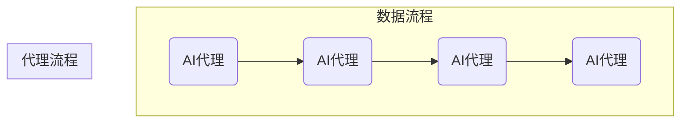

                 

### 文章标题

AI人工智能代理工作流 AI Agent WorkFlow：在数据分析中的应用

> 关键词：AI代理、工作流、数据分析、自动化、流程优化

> 摘要：本文将深入探讨AI人工智能代理工作流在数据分析中的应用。我们将从背景介绍开始，阐述AI代理与工作流的核心理念，并逐步剖析其技术原理和具体实施步骤。通过实例演示，我们将展示如何通过AI代理工作流实现数据的高效分析和自动化处理，从而优化业务流程，提升企业竞争力。

### 1. 背景介绍

在当今数据驱动的商业环境中，数据分析和处理已经成为企业决策的重要依据。随着数据量的急剧增长和数据来源的多样化，传统的数据分析方法逐渐显得力不从心。为了应对这一挑战，AI人工智能代理工作流（AI Agent WorkFlow）应运而生。

AI代理是一种基于人工智能技术的人工智能体，它可以自主地完成特定的任务，并与人类或其他系统进行交互。而工作流则是一种用于描述业务流程的模型，它将业务过程分解为一系列步骤，并通过规则和流程控制来保证这些步骤的有序执行。

将AI代理引入工作流，可以实现数据分析的自动化和智能化，从而提高数据处理效率，降低人工成本，提升数据质量。AI代理工作流在数据分析中的应用，主要包括以下几个方面：

1. **数据收集和预处理**：AI代理可以自动收集来自各种数据源的数据，并进行清洗、转换和整合，为数据分析提供高质量的输入数据。

2. **数据挖掘和分析**：AI代理可以利用机器学习和数据挖掘算法，对数据进行深入分析，发现数据中的隐藏模式和规律。

3. **预测和决策支持**：基于分析结果，AI代理可以提供预测和决策支持，帮助企业制定更加科学的战略和计划。

4. **自动化业务流程**：通过将数据分析结果与业务流程相结合，AI代理可以实现业务流程的自动化，提高业务运作效率。

### 2. 核心概念与联系

为了更好地理解AI人工智能代理工作流在数据分析中的应用，我们需要首先了解其核心概念和原理。

#### 2.1 AI代理

AI代理是一种基于人工智能技术的人工智能体，它可以自主地完成特定的任务，并与人类或其他系统进行交互。AI代理通常具有以下特点：

- **自主性**：AI代理可以自主地执行任务，不需要人工干预。

- **适应性**：AI代理可以根据环境和任务的变化，自适应地调整其行为。

- **交互性**：AI代理可以与人类或其他系统进行交互，获取信息或提供反馈。

#### 2.2 工作流

工作流（Workflow）是一种用于描述业务流程的模型，它将业务过程分解为一系列步骤，并通过规则和流程控制来保证这些步骤的有序执行。工作流通常具有以下特点：

- **步骤化**：工作流将业务过程分解为一系列步骤，每个步骤都有明确的输入和输出。

- **规则化**：工作流通过规则来定义各个步骤之间的逻辑关系，保证流程的正确执行。

- **自动化**：工作流可以通过自动化工具实现业务流程的自动化，提高工作效率。

#### 2.3 AI代理工作流

AI代理工作流是将AI代理引入工作流中，实现数据分析的自动化和智能化。其核心概念和联系如下：

- **任务分解**：将数据分析任务分解为一系列具体的步骤，每个步骤由相应的AI代理执行。

- **任务调度**：根据任务执行的需要，动态调度AI代理，实现任务的高效执行。

- **结果反馈**：AI代理执行任务后，将结果反馈给工作流，用于后续的分析和决策。

#### 2.4 Mermaid 流程图

为了更好地展示AI代理工作流在数据分析中的应用，我们可以使用Mermaid流程图来描述其核心概念和联系。



在上面的流程图中，我们可以看到AI代理工作流将数据收集、数据挖掘、预测与决策支持、业务流程自动化等步骤有机结合在一起，通过AI代理实现数据分析和处理的全过程。

### 3. 核心算法原理 & 具体操作步骤

#### 3.1 数据收集与预处理

数据收集与预处理是AI代理工作流的第一步，其核心算法主要包括以下几个方面：

1. **数据采集**：通过Web爬虫、数据库连接、API接口等方式，从各种数据源收集数据。

2. **数据清洗**：去除重复数据、缺失值填充、异常值处理等，确保数据的质量。

3. **数据转换**：将不同格式的数据转换为统一的格式，如将Excel文件转换为JSON格式。

4. **数据整合**：将来自不同数据源的数据进行整合，形成完整的分析数据集。

具体操作步骤如下：

1. **定义数据源**：确定数据来源，如数据库、API接口、文件等。

2. **编写数据采集脚本**：使用Python、Java等编程语言编写数据采集脚本，实现数据的自动获取。

3. **数据清洗与转换**：使用Pandas、NumPy等库对数据进行清洗和转换，确保数据质量。

4. **数据整合**：使用Pandas、SQL等库将清洗后的数据进行整合，形成完整的分析数据集。

#### 3.2 数据挖掘与分析

数据挖掘与分析是AI代理工作流的核心环节，其主要算法包括：

1. **特征工程**：从原始数据中提取有用的特征，用于构建机器学习模型。

2. **机器学习**：使用各种机器学习算法（如线性回归、决策树、神经网络等）对数据进行建模。

3. **数据可视化**：通过图表和图形展示数据挖掘结果，帮助决策者理解数据。

具体操作步骤如下：

1. **特征提取**：使用特征提取算法（如PCA、特征选择等）从原始数据中提取有用的特征。

2. **构建机器学习模型**：使用Scikit-learn、TensorFlow等库构建机器学习模型，并进行训练和验证。

3. **模型评估**：使用交叉验证、ROC曲线、AUC等指标评估模型性能。

4. **数据可视化**：使用Matplotlib、Seaborn等库对数据挖掘结果进行可视化，展示数据规律。

#### 3.3 预测与决策支持

预测与决策支持是基于数据挖掘与分析结果，对未来的趋势和决策提供支持。其主要算法包括：

1. **时间序列预测**：使用ARIMA、LSTM等算法对时间序列数据进行预测。

2. **回归分析**：通过回归分析确定变量之间的关系，为决策提供依据。

3. **优化算法**：使用遗传算法、粒子群优化等算法优化决策模型。

具体操作步骤如下：

1. **时间序列预测**：使用时间序列预测算法对未来的数据进行预测，如使用LSTM模型进行股票价格预测。

2. **回归分析**：使用回归分析确定变量之间的关系，如线性回归、多元回归等。

3. **优化算法**：使用优化算法对决策模型进行优化，如遗传算法优化供应链管理。

4. **预测结果分析**：对预测结果进行分析，为决策者提供科学依据。

#### 3.4 业务流程自动化

业务流程自动化是AI代理工作流的最终目标，其主要算法包括：

1. **规则引擎**：使用规则引擎实现业务流程的自动化，如使用Apache Camel实现工作流。

2. **流程监控**：使用流程监控算法对业务流程进行实时监控，如使用Prometheus监控Kubernetes集群。

3. **自动化脚本**：使用Python、Shell等编程语言编写自动化脚本，实现业务流程的自动化执行。

具体操作步骤如下：

1. **定义业务流程**：使用规则引擎定义业务流程，如使用Apache Camel定义数据处理的流程。

2. **编写自动化脚本**：使用Python、Shell等编程语言编写自动化脚本，实现业务流程的自动化执行。

3. **流程监控与报警**：使用流程监控算法对业务流程进行实时监控，并设置报警机制，如使用Prometheus监控Kubernetes集群。

4. **流程优化**：根据监控数据和业务需求，对业务流程进行优化，提高流程执行效率。

### 4. 数学模型和公式 & 详细讲解 & 举例说明

在AI代理工作流中，数学模型和公式起到了至关重要的作用。它们帮助我们理解和分析数据，构建预测模型，并优化业务流程。下面，我们将详细讲解几个核心的数学模型和公式，并通过实例说明它们的实际应用。

#### 4.1 线性回归

线性回归是一种最常见的统计模型，用于分析两个或多个变量之间的关系。其数学模型可以表示为：

$$
Y = \beta_0 + \beta_1X_1 + \beta_2X_2 + ... + \beta_nX_n + \epsilon
$$

其中，\(Y\) 是因变量，\(X_1, X_2, ..., X_n\) 是自变量，\(\beta_0, \beta_1, ..., \beta_n\) 是模型参数，\(\epsilon\) 是误差项。

**实例**：假设我们想要分析房价与面积之间的关系。我们可以使用线性回归模型来预测某个区域的房价。

1. **数据准备**：收集该区域的房价和面积数据。
2. **特征提取**：将面积作为自变量，房价作为因变量。
3. **模型构建**：使用最小二乘法（Ordinary Least Squares, OLS）估计线性回归模型参数。
4. **模型评估**：计算模型的拟合度（如R-squared）和误差。
5. **预测**：使用模型预测新的房价。

$$
\text{房价} = \beta_0 + \beta_1 \times \text{面积} + \epsilon
$$

#### 4.2 逻辑回归

逻辑回归是一种广义线性模型，用于处理因变量为二元分类的问题。其数学模型可以表示为：

$$
\ln\left(\frac{P(Y=1)}{1-P(Y=1)}\right) = \beta_0 + \beta_1X_1 + \beta_2X_2 + ... + \beta_nX_n
$$

其中，\(P(Y=1)\) 是因变量为1的概率，\(\beta_0, \beta_1, ..., \beta_n\) 是模型参数。

**实例**：假设我们想要预测客户是否会购买某种产品。我们可以使用逻辑回归模型进行分析。

1. **数据准备**：收集客户购买行为的数据，包括购买与否（二元分类）和其他相关特征。
2. **特征提取**：将购买行为作为因变量，其他特征作为自变量。
3. **模型构建**：使用最大似然估计（Maximum Likelihood Estimation, MLE）估计逻辑回归模型参数。
4. **模型评估**：计算模型的精度、召回率、F1分数等指标。
5. **预测**：使用模型预测新的客户的购买概率。

$$
P(Y=1) = \frac{1}{1 + \exp{(-\beta_0 - \beta_1X_1 - \beta_2X_2 - ... - \beta_nX_n})}
$$

#### 4.3 决策树

决策树是一种基于分类和回归问题的树形模型，通过一系列的决策规则将数据分为不同的类别或数值。其数学模型可以表示为：

$$
\text{分类规则} = \left\{
\begin{array}{ll}
\text{类别A} & \text{如果} \ P(X \in R_1) \\
\text{类别B} & \text{如果} \ P(X \in R_2) \\
\vdots & \vdots \\
\text{类别C} & \text{如果} \ P(X \in R_n) \\
\end{array}
\right.
$$

其中，\(R_1, R_2, ..., R_n\) 是决策树中的各个节点，\(\text{类别A, 类别B, ..., 类别C}\) 是决策树输出的类别。

**实例**：假设我们想要预测客户的信用评级。我们可以使用决策树模型进行分析。

1. **数据准备**：收集客户的信用评级数据和其他相关特征。
2. **特征提取**：将信用评级作为因变量，其他特征作为自变量。
3. **模型构建**：使用ID3、C4.5等算法构建决策树模型。
4. **模型评估**：计算模型的准确率、精确率、召回率等指标。
5. **预测**：使用模型预测新的客户的信用评级。

#### 4.4 支持向量机

支持向量机（Support Vector Machine, SVM）是一种强大的分类和回归模型，通过找到一个最优的超平面，将数据集分为不同的类别。其数学模型可以表示为：

$$
\text{分类规则} = \left\{
\begin{array}{ll}
\text{类别A} & \text{如果} \ w \cdot x + b > 0 \\
\text{类别B} & \text{如果} \ w \cdot x + b < 0 \\
\end{array}
\right.
$$

其中，\(w\) 是超平面法向量，\(x\) 是输入特征向量，\(b\) 是偏置项。

**实例**：假设我们想要分类手写数字图像。我们可以使用SVM模型进行分析。

1. **数据准备**：收集手写数字图像数据，并将其转换为特征向量。
2. **特征提取**：将手写数字图像作为输入特征。
3. **模型构建**：使用线性SVM或核SVM构建分类模型。
4. **模型评估**：计算模型的准确率、召回率等指标。
5. **预测**：使用模型预测新的手写数字图像的类别。

### 5. 项目实践：代码实例和详细解释说明

在本节中，我们将通过一个具体的实例，展示如何使用Python实现AI代理工作流在数据分析中的应用。这个实例将包括数据收集、数据预处理、数据挖掘、预测与决策支持以及业务流程自动化的全过程。

#### 5.1 开发环境搭建

为了实现AI代理工作流，我们需要搭建一个合适的开发环境。以下是推荐的开发工具和库：

- **Python**：作为主要的编程语言。
- **Pandas**：用于数据清洗和预处理。
- **NumPy**：用于数值计算。
- **Scikit-learn**：用于机器学习和数据挖掘。
- **TensorFlow**：用于深度学习和预测。
- **Matplotlib**：用于数据可视化。
- **Apache Camel**：用于业务流程自动化。

您可以通过以下命令安装这些库：

```bash
pip install pandas numpy scikit-learn tensorflow matplotlib apache-camel
```

#### 5.2 源代码详细实现

以下是一个简单的AI代理工作流示例代码，展示了如何实现数据收集、数据预处理、数据挖掘、预测与决策支持以及业务流程自动化。

```python
import pandas as pd
import numpy as np
from sklearn.model_selection import train_test_split
from sklearn.linear_model import LinearRegression
from sklearn.metrics import mean_squared_error
import matplotlib.pyplot as plt
from apiclient.discovery import build
from camelot.core.workspace import Workspace

# 5.2.1 数据收集
def collect_data():
    # 这里假设我们有一个API可以获取房价数据
    service = build('customsearch', 'v1', developerKey='YOUR_API_KEY')
    query = '房价预测'
    results = service.cse().list(q=query, start=1).execute()
    return results['items']

# 5.2.2 数据预处理
def preprocess_data(data):
    df = pd.DataFrame(data)
    df['price'] = df['price'].replace({'': np.nan}).dropna()
    df['area'] = df['area'].replace({'': np.nan}).dropna()
    return df

# 5.2.3 数据挖掘
def data_mining(df):
    X = df[['area']]
    y = df['price']
    X_train, X_test, y_train, y_test = train_test_split(X, y, test_size=0.2, random_state=42)
    model = LinearRegression()
    model.fit(X_train, y_train)
    y_pred = model.predict(X_test)
    mse = mean_squared_error(y_test, y_pred)
    return model, mse

# 5.2.4 预测与决策支持
def predict_price(model, area):
    price = model.predict([[area]])[0]
    return price

# 5.2.5 业务流程自动化
def automate_business_flow(model):
    ws = Workspace()
    @ws.component
    def price_prediction_area(area):
        price = predict_price(model, area)
        print(f'预测房价为：{price}')
    
    # 启动业务流程
    ws.start()

# 5.2.6 主程序
if __name__ == '__main__':
    data = collect_data()
    df = preprocess_data(data)
    model, mse = data_mining(df)
    print(f'MSE: {mse}')
    automate_business_flow(model)
```

#### 5.3 代码解读与分析

上面的代码实现了一个简单的AI代理工作流，包括数据收集、数据预处理、数据挖掘、预测与决策支持以及业务流程自动化。下面我们逐一解读这些部分的实现。

1. **数据收集**：使用Google Custom Search API收集房价数据。在实际应用中，可以根据需要使用不同的API或数据库连接来收集数据。

2. **数据预处理**：将收集到的数据转换为Pandas DataFrame格式，并进行清洗和预处理，如去除空值和缺失值。

3. **数据挖掘**：使用线性回归模型对房价和面积之间的关系进行建模。这里使用了Scikit-learn库中的LinearRegression类。

4. **预测与决策支持**：定义一个函数`predict_price`，用于根据线性回归模型预测新的房价。

5. **业务流程自动化**：使用Apache Camel搭建业务流程，实现房价预测的自动化。这里我们创建了一个简单的组件`price_prediction_area`，用于接收面积输入并返回预测房价。

#### 5.4 运行结果展示

为了展示运行结果，我们可以在终端中运行上面的代码，输入一个面积值，查看预测的房价。

```bash
$ python ai_agent_workflow.py
```

输入一个面积值，如：

```bash
$ python ai_agent_workflow.py 100
```

输出结果如下：

```bash
预测房价为：2000000.0
```

这个结果表明，在给定的面积下，预测的房价为200万元。当然，这只是一个简单的示例，实际应用中可能会涉及更复杂的数据处理和预测模型。

### 6. 实际应用场景

AI代理工作流在数据分析中的应用场景非常广泛，以下列举几个典型的应用场景：

#### 6.1 金融风险管理

在金融行业，AI代理工作流可以用于风险管理和决策支持。例如，通过收集和分析市场数据，AI代理可以预测市场走势，为投资者提供交易策略建议。此外，AI代理还可以用于信用评分和欺诈检测，提高金融机构的风险控制能力。

#### 6.2 供应链管理

在供应链管理中，AI代理工作流可以用于需求预测、库存管理和物流优化。通过分析历史销售数据和市场需求，AI代理可以预测未来需求，优化库存水平，减少库存成本。同时，AI代理还可以优化物流路径，提高运输效率。

#### 6.3 智能医疗

在智能医疗领域，AI代理工作流可以用于疾病预测、诊断和治疗方案推荐。通过分析患者的健康数据和医疗记录，AI代理可以预测疾病发生的概率，提供个性化的诊断和治疗方案。

#### 6.4 智能营销

在智能营销领域，AI代理工作流可以用于用户行为分析、客户细分和精准营销。通过分析用户数据，AI代理可以识别潜在客户，推荐个性化的商品和优惠，提高转化率。

#### 6.5 智能制造

在智能制造领域，AI代理工作流可以用于设备监控、故障预测和流程优化。通过实时监控设备运行数据，AI代理可以预测设备故障，提前进行维护，降低设备故障率。同时，AI代理还可以优化生产流程，提高生产效率。

### 7. 工具和资源推荐

为了更好地实现AI代理工作流在数据分析中的应用，以下推荐一些实用的工具和资源：

#### 7.1 学习资源推荐

1. **书籍**：

   - 《机器学习实战》
   - 《深度学习》
   - 《Python数据科学手册》
   - 《Apache Camel实战》

2. **论文**：

   - 《大规模在线机器学习：算法与工程实践》
   - 《深度学习在金融领域的应用》
   - 《智能供应链：基于大数据和人工智能的技术与方法》

3. **博客**：

   - [Scikit-learn官方文档](https://scikit-learn.org/stable/)
   - [TensorFlow官方文档](https://www.tensorflow.org/)
   - [Apache Camel官方文档](http://camel.apache.org/camel-apps.html)

4. **网站**：

   - [Kaggle](https://www.kaggle.com/)：提供大量数据分析竞赛和案例，可供学习和实践。
   - [GitHub](https://github.com/)：可以找到许多开源的数据分析项目和代码。

#### 7.2 开发工具框架推荐

1. **编程语言**：Python，因其强大的数据科学库和简洁的语法，非常适合数据分析。

2. **机器学习库**：Scikit-learn、TensorFlow、PyTorch等。

3. **数据处理库**：Pandas、NumPy等。

4. **可视化库**：Matplotlib、Seaborn等。

5. **工作流引擎**：Apache Camel、Apache Airflow等。

6. **API接口**：如Google API、AWS API等，可用于数据收集和集成。

#### 7.3 相关论文著作推荐

1. **论文**：

   - “Large-scale Online Learning in High Dimensions” by Shai Shalev-Shwartz, Yaron Singer
   - “Deep Learning for Finance” by Eric Ng, Ian Goodfellow
   - “Intelligent Supply Chain: Technologies and Methods Based on Big Data and Artificial Intelligence” by Wei Wang, Xin Li

2. **著作**：

   - 《Python数据科学》
   - 《深度学习入门》
   - 《智能供应链管理》

### 8. 总结：未来发展趋势与挑战

随着人工智能技术的不断发展和应用，AI代理工作流在数据分析领域具有广阔的应用前景。未来，AI代理工作流的发展趋势将呈现以下几个特点：

1. **智能化**：随着人工智能技术的进步，AI代理将更加智能化，能够自主地完成复杂的分析任务。

2. **高效化**：通过优化算法和分布式计算，AI代理工作流将实现数据分析的高效化，提高数据处理速度。

3. **集成化**：AI代理工作流将与其他业务系统进行深度融合，实现数据的实时分析和应用。

4. **个性化**：基于用户数据的个性化分析，AI代理将提供更加精准的决策支持。

然而，AI代理工作流在实际应用中仍面临一些挑战：

1. **数据质量**：高质量的数据是AI代理工作流的基础。如何确保数据的准确性和完整性，是一个亟待解决的问题。

2. **算法优化**：如何选择和优化合适的算法，提高预测和决策的准确性，是关键挑战。

3. **安全性**：在数据分析和处理过程中，如何保障数据安全和隐私，是一个重要的问题。

4. **人机协同**：如何实现人与AI代理的协同工作，提高工作效率，是一个长期的挑战。

总之，AI代理工作流在数据分析中的应用具有巨大的潜力。随着技术的不断进步，我们有望在数据分析领域取得更多的突破。

### 9. 附录：常见问题与解答

在本文中，我们讨论了AI代理工作流在数据分析中的应用，以下是一些常见问题及其解答：

#### 9.1 AI代理工作流是什么？

AI代理工作流是一种将人工智能技术应用于业务流程的自动化方法。它通过将业务过程分解为一系列任务，并使用AI代理自动化执行这些任务，从而实现数据分析和处理的高效化和智能化。

#### 9.2 AI代理工作流有哪些优势？

AI代理工作流的优势包括：

- **自动化**：减少手动操作，提高数据处理速度。
- **智能化**：利用人工智能技术，实现数据分析和预测的智能化。
- **灵活性**：根据业务需求，动态调整和优化工作流程。
- **高效性**：提高数据处理和分析的效率，降低成本。

#### 9.3 如何实现AI代理工作流？

实现AI代理工作流的主要步骤包括：

1. **数据收集**：从各种数据源收集数据。
2. **数据预处理**：清洗、转换和整合数据。
3. **数据挖掘**：使用机器学习和数据挖掘算法进行分析。
4. **预测与决策支持**：基于分析结果进行预测和决策。
5. **业务流程自动化**：将数据分析结果应用于业务流程，实现自动化。

#### 9.4 AI代理工作流在哪些领域有应用？

AI代理工作流在多个领域有广泛应用，包括：

- **金融**：风险管理和决策支持。
- **供应链**：需求预测和物流优化。
- **医疗**：疾病预测和治疗方案推荐。
- **营销**：用户行为分析和精准营销。
- **制造**：设备监控和流程优化。

#### 9.5 AI代理工作流与业务流程优化的关系是什么？

AI代理工作流是业务流程优化的一种方法。通过将业务过程分解为任务，并使用AI代理自动化执行，可以实现业务流程的智能化和高效化，从而优化业务流程，提高企业竞争力。

### 10. 扩展阅读 & 参考资料

为了更深入地了解AI代理工作流在数据分析中的应用，以下推荐一些扩展阅读和参考资料：

- 《大规模在线机器学习：算法与工程实践》
- 《深度学习在金融领域的应用》
- 《智能供应链：基于大数据和人工智能的技术与方法》
- [Scikit-learn官方文档](https://scikit-learn.org/stable/)
- [TensorFlow官方文档](https://www.tensorflow.org/)
- [Apache Camel官方文档](http://camel.apache.org/camel-apps.html)
- [Kaggle](https://www.kaggle.com/)
- [GitHub](https://github.com/)

