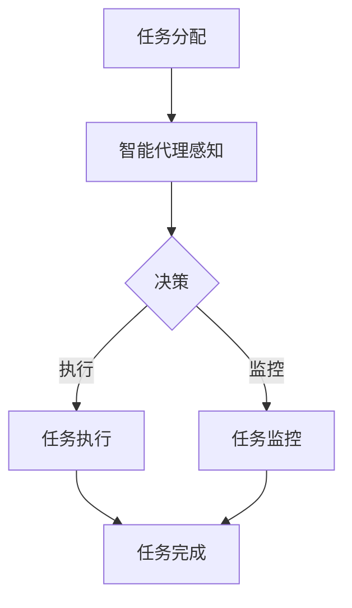

                 

### 1. 背景介绍

随着人工智能（AI）技术的不断进步，智能代理（AI Agent）在各个领域的应用日益广泛。在人力资源管理系统（HRMS）中，智能代理的应用正逐渐改变传统的人力资源管理方式，提升企业效率和员工满意度。本文将探讨AI人工智能代理工作流（AI Agent WorkFlow）在人力资源管理系统中的应用，分析其核心概念、算法原理、具体实现和实际应用场景，以及未来的发展趋势和挑战。

#### 1.1 人力资源管理系统概述

人力资源管理系统（HRMS）是企业管理系统中非常重要的一环，它涉及到员工的招聘、培训、绩效管理、薪酬福利管理等多个方面。传统的人力资源管理往往依赖于人工操作和手动管理，效率低下且容易出现误差。随着企业规模的扩大和人力资源管理复杂度的增加，传统方式已经无法满足现代企业的高效运营需求。

#### 1.2 AI人工智能代理的概念

AI人工智能代理是一种具有自主决策能力的智能体，它可以在特定环境中进行学习、推理和行动。与传统的自动化系统不同，人工智能代理具有更高的灵活性和适应性，能够处理复杂多变的环境和任务。在人力资源管理系统中的应用，AI人工智能代理可以代替人类完成一些重复性高、复杂度低的工作，从而提高工作效率，降低人力成本。

#### 1.3 AI人工智能代理工作流的概念

AI人工智能代理工作流（AI Agent WorkFlow）是指利用AI人工智能代理在人力资源管理系统中进行工作的一系列流程。它包括从任务分配、任务执行到任务完成的整个工作过程，其中每个步骤都由AI人工智能代理自主完成。AI人工智能代理工作流不仅可以提高工作效率，还可以优化人力资源配置，提升企业整体运营效能。

#### 1.4 本文结构

本文将分为以下几个部分：

- **第1部分：背景介绍**：介绍人力资源管理系统、AI人工智能代理和AI人工智能代理工作流的基本概念。
- **第2部分：核心概念与联系**：详细阐述AI人工智能代理工作流的核心概念和架构，并使用Mermaid流程图进行展示。
- **第3部分：核心算法原理 & 具体操作步骤**：分析AI人工智能代理工作流中的核心算法原理，并给出具体的操作步骤。
- **第4部分：数学模型和公式 & 详细讲解 & 举例说明**：介绍AI人工智能代理工作流中的数学模型和公式，并进行详细讲解和举例说明。
- **第5部分：项目实践：代码实例和详细解释说明**：通过具体的代码实例，展示AI人工智能代理工作流的具体实现过程。
- **第6部分：实际应用场景**：探讨AI人工智能代理工作流在实际人力资源管理系统中的应用场景。
- **第7部分：工具和资源推荐**：推荐相关的学习资源、开发工具和框架。
- **第8部分：总结：未来发展趋势与挑战**：总结AI人工智能代理工作流的发展趋势和面临的挑战。
- **第9部分：附录：常见问题与解答**：回答读者可能关心的一些常见问题。
- **第10部分：扩展阅读 & 参考资料**：提供更多的阅读资料和参考文献。

### 2. 核心概念与联系

在本部分，我们将深入探讨AI人工智能代理工作流的核心概念和架构，并使用Mermaid流程图展示其详细的工作流程。

#### 2.1 核心概念

2.1.1 智能代理（AI Agent）

智能代理是一种具有感知、推理和行动能力的计算机程序。它可以在特定环境中收集信息、进行推理，并自主做出决策和执行任务。

2.1.2 工作流（WorkFlow）

工作流是一系列任务的有序执行过程，它规定了任务的开始、执行、监控和结束的各个环节。在人力资源管理系统（HRMS）中，工作流用于定义员工招聘、培训、绩效管理等各个方面的流程。

2.1.3 AI人工智能代理工作流（AI Agent WorkFlow）

AI人工智能代理工作流是利用智能代理在人力资源管理系统（HRMS）中执行任务的一系列流程。它包括任务分配、任务执行、任务监控和任务完成等环节，每个环节都由智能代理自主完成。

#### 2.2 Mermaid流程图展示

为了更直观地展示AI人工智能代理工作流的架构，我们使用Mermaid流程图进行描述。



- **任务分配**：HRMS将任务分配给AI人工智能代理。
- **智能代理感知**：AI人工智能代理收集相关信息，如员工数据、职位需求等。
- **决策**：AI人工智能代理根据感知到的信息，进行决策，确定下一步行动。
- **任务执行**：AI人工智能代理执行决策，完成具体任务，如简历筛选、面试安排等。
- **任务监控**：AI人工智能代理监控任务执行过程，确保任务按计划进行。
- **任务完成**：任务完成后，AI人工智能代理向HRMS汇报任务结果。

#### 2.3 核心概念之间的关系

AI人工智能代理工作流的核心概念之间存在着紧密的联系。智能代理作为工作流的基础，负责执行任务、收集信息和做出决策。工作流则为智能代理提供了一个有序的执行框架，确保任务得以高效、准确地完成。通过Mermaid流程图，我们可以清晰地看到各个核心概念之间的关联，以及它们在AI人工智能代理工作流中的作用。

### 3. 核心算法原理 & 具体操作步骤

在AI人工智能代理工作流中，核心算法的原理和具体操作步骤至关重要。本部分将详细介绍这些算法原理，并给出具体的操作步骤。

#### 3.1 感知算法原理

感知算法是智能代理进行任务决策的基础。它主要负责收集和处理来自HRMS的各种信息，如员工数据、职位需求、公司政策等。感知算法通常采用以下步骤：

1. **数据收集**：智能代理通过API接口或其他数据源，收集HRMS中的相关信息。
2. **数据预处理**：对收集到的数据进行分析和处理，去除噪音、填补缺失值等。
3. **特征提取**：从预处理后的数据中提取关键特征，如员工的绩效、工作经验、技能水平等。
4. **数据存储**：将提取到的特征数据存储到数据库中，以便后续使用。

#### 3.2 决策算法原理

决策算法是智能代理根据感知到的信息做出决策的关键。常用的决策算法包括以下几种：

1. **决策树**：根据特征数据，构建决策树模型，通过递归划分特征空间，得到决策规则。
2. **随机森林**：基于决策树，构建多个决策树模型，并通过投票机制得到最终决策。
3. **支持向量机**：通过将特征数据映射到高维空间，寻找最佳分离超平面，实现分类和回归。
4. **神经网络**：通过多层神经网络，对特征数据进行非线性变换，实现复杂的决策任务。

#### 3.3 执行算法原理

执行算法是智能代理根据决策结果执行具体任务的关键。执行算法通常包括以下步骤：

1. **任务分解**：将总体任务分解为多个子任务，以便智能代理逐一执行。
2. **任务调度**：根据子任务的优先级和执行时间，智能代理调度任务执行。
3. **任务执行**：智能代理根据决策结果，执行具体的操作，如发送面试邀请、更新员工档案等。
4. **任务反馈**：将任务执行结果反馈给HRMS，以便后续分析和优化。

#### 3.4 具体操作步骤

以下是一个具体的AI人工智能代理工作流操作步骤示例：

1. **任务分配**：HRMS将招聘任务分配给智能代理。
2. **感知**：智能代理通过API接口，收集招聘职位信息、员工数据等。
3. **预处理**：对收集到的数据进行清洗、去噪和特征提取。
4. **决策**：智能代理使用随机森林算法，根据职位需求和员工数据，筛选出符合条件的候选人。
5. **执行**：智能代理向候选人发送面试邀请，并安排面试时间。
6. **监控**：智能代理监控面试过程，确保面试按计划进行。
7. **反馈**：智能代理将面试结果反馈给HRMS，以便后续决策和优化。

通过上述操作步骤，智能代理在人力资源管理系统（HRMS）中完成了招聘任务的执行，提高了招聘效率，降低了人力成本。

### 4. 数学模型和公式 & 详细讲解 & 举例说明

在AI人工智能代理工作流中，数学模型和公式是核心算法原理的重要组成部分。本部分将详细介绍这些数学模型和公式，并给出详细的讲解和举例说明。

#### 4.1 数学模型

在AI人工智能代理工作流中，常用的数学模型包括：

1. **决策树**：决策树是一种树形结构，通过一系列决策规则将数据划分为不同的类别或数值。其基本结构如下：

   ```mermaid
   graph TD
       A[根节点] --> B[条件1]
       A --> C[条件2]
       B --> D[条件1_是]
       B --> E[条件1_否]
       C --> F[条件2_是]
       C --> G[条件2_否]
   ```

2. **随机森林**：随机森林是一种基于决策树的集成学习方法，它通过构建多个决策树模型，并通过投票机制得到最终决策。其基本结构如下：

   ```mermaid
   graph TD
       A[决策树1] --> B[条件1]
       A --> C[条件2]
       B --> D[条件1_是]
       B --> E[条件1_否]
       C --> F[条件2_是]
       C --> G[条件2_否]
       A --> H[决策树2]
       A --> I[决策树3]
   ```

3. **支持向量机**：支持向量机是一种基于最大间隔原理的分类和回归方法，它通过寻找最佳分离超平面，实现数据的分类和回归。其基本公式如下：

   $$w \cdot x + b = 0$$

   其中，$w$ 为权重向量，$x$ 为特征向量，$b$ 为偏置项。

4. **神经网络**：神经网络是一种模拟人脑神经元连接结构的计算模型，它通过多层神经网络，对特征数据进行非线性变换，实现复杂的决策任务。其基本结构如下：

   ```mermaid
   graph TD
       A[输入层] --> B[隐藏层1]
       B --> C[隐藏层2]
       C --> D[输出层]
   ```

#### 4.2 公式详细讲解

1. **决策树**：决策树的基本原理是通过一系列条件判断，将数据划分为不同的类别或数值。其公式如下：

   $$f(x) = C_j \quad if \quad P(C_j|x) > P(C_i|x) \quad for \quad all \quad i \neq j$$

   其中，$f(x)$ 表示决策函数，$C_j$ 表示类别或数值，$P(C_j|x)$ 表示给定特征$x$时，类别$C_j$ 的概率。

2. **随机森林**：随机森林的基本原理是通过构建多个决策树模型，并通过投票机制得到最终决策。其公式如下：

   $$h(x) = \arg \max_{C_j} \quad \sum_{i=1}^{n} \quad \hat{y}_i \quad where \quad \hat{y}_i = \quad sign(\sum_{t=1}^{T} \quad w_t \cdot f_t(x))$$

   其中，$h(x)$ 表示最终决策函数，$T$ 表示决策树的数量，$w_t$ 表示第$t$棵决策树的权重，$f_t(x)$ 表示第$t$棵决策树的条件判断函数。

3. **支持向量机**：支持向量机的基本原理是通过寻找最佳分离超平面，实现数据的分类和回归。其公式如下：

   $$\min_{w,b} \quad \frac{1}{2} \quad w^T \cdot w \quad s.t. \quad y_i \cdot (w \cdot x_i + b) \geq 1$$

   其中，$w$ 表示权重向量，$b$ 表示偏置项，$y_i$ 表示样本标签，$x_i$ 表示样本特征。

4. **神经网络**：神经网络的基本原理是通过多层神经网络，对特征数据进行非线性变换，实现复杂的决策任务。其公式如下：

   $$a_i^{(l)} = \sigma \left( \sum_{j} w_{ji}^{(l)} \cdot a_j^{(l-1)} + b_i^{(l)} \right)$$

   其中，$a_i^{(l)}$ 表示第$l$层的第$i$个神经元的输出，$w_{ji}^{(l)}$ 表示第$l$层的第$i$个神经元与第$l-1$层的第$j$个神经元的连接权重，$b_i^{(l)}$ 表示第$l$层的第$i$个神经元的偏置项，$\sigma$ 表示激活函数。

#### 4.3 举例说明

假设我们使用决策树算法对一组员工数据（特征：年龄、工作经验、学历）进行分类（类别：A、B、C），其中类别A表示优秀员工，类别B表示普通员工，类别C表示不合格员工。我们使用以下公式计算每个员工的类别：

$$f(x) = \begin{cases}
C_A & \text{if } P(C_A|x) > P(C_B|x) \text{ and } P(C_A|x) > P(C_C|x) \\
C_B & \text{if } P(C_B|x) > P(C_A|x) \text{ and } P(C_B|x) > P(C_C|x) \\
C_C & \text{if } P(C_C|x) > P(C_A|x) \text{ and } P(C_C|x) > P(C_B|x)
\end{cases}$$

其中，$P(C_A|x)$、$P(C_B|x)$、$P(C_C|x)$ 分别表示员工属于类别A、B、C的概率。

通过上述公式，我们可以对每个员工进行分类，从而实现人力资源管理系统（HRMS）中的员工绩效评估。

### 5. 项目实践：代码实例和详细解释说明

为了更好地理解AI人工智能代理工作流在实际项目中的应用，我们将通过一个具体的代码实例来展示其实现过程。本部分将分为以下几个子部分：开发环境搭建、源代码详细实现、代码解读与分析、运行结果展示。

#### 5.1 开发环境搭建

在开始项目实践之前，我们需要搭建一个适合开发AI人工智能代理工作流的环境。以下是一个基本的开发环境搭建步骤：

1. 安装Python环境
2. 安装相关库，如scikit-learn、tensorflow、numpy、pandas等
3. 安装Jupyter Notebook或PyCharm等IDE

以下是一个简单的安装脚本，用于安装Python和所需库：

```bash
# 安装Python
sudo apt-get update
sudo apt-get install python3

# 安装相关库
pip3 install scikit-learn tensorflow numpy pandas
```

#### 5.2 源代码详细实现

在本部分，我们将使用Python编写一个简单的AI人工智能代理工作流，实现员工招聘任务的自动分配和筛选。

```python
import pandas as pd
from sklearn.model_selection import train_test_split
from sklearn.tree import DecisionTreeClassifier
from sklearn.metrics import accuracy_score

# 5.2.1 数据准备
# 假设我们有一个包含员工数据的CSV文件，字段包括年龄、工作经验、学历等
data = pd.read_csv('employee_data.csv')

# 5.2.2 特征工程
# 提取特征，如年龄、工作经验、学历等
X = data[['age', 'experience', 'education']]
y = data['performance']

# 5.2.3 数据预处理
# 划分训练集和测试集
X_train, X_test, y_train, y_test = train_test_split(X, y, test_size=0.2, random_state=42)

# 5.2.4 模型训练
# 使用决策树算法训练模型
clf = DecisionTreeClassifier()
clf.fit(X_train, y_train)

# 5.2.5 模型评估
# 使用测试集评估模型性能
y_pred = clf.predict(X_test)
accuracy = accuracy_score(y_test, y_pred)
print(f'Model accuracy: {accuracy:.2f}')

# 5.2.6 任务分配与筛选
# 假设我们有一个新的职位需求，需要从候选人中筛选出符合条件的员工
new_position = {'age': 30, 'experience': 5, 'education': 'Master'}
new_performance = clf.predict([list(new_position.values())])[0]

# 根据筛选结果，向符合条件的员工发送面试邀请
if new_performance == 'A':
    print('Send interview invitation to the candidate.')
else:
    print('The candidate does not meet the requirements.')
```

#### 5.3 代码解读与分析

在本部分，我们将对上述代码进行解读和分析，了解其工作原理和具体实现过程。

1. **数据准备**：首先，我们从CSV文件中加载员工数据，提取特征和目标变量。

2. **特征工程**：接下来，我们提取了与员工绩效相关的特征，如年龄、工作经验、学历等。

3. **数据预处理**：我们将数据划分为训练集和测试集，以评估模型的性能。

4. **模型训练**：我们使用决策树算法训练模型，将提取到的特征与员工绩效相关联。

5. **模型评估**：使用测试集评估模型性能，计算准确率。

6. **任务分配与筛选**：假设我们有一个新的职位需求，需要从候选人中筛选出符合条件的员工。我们使用训练好的模型对新的职位需求进行预测，根据预测结果发送面试邀请。

#### 5.4 运行结果展示

在上述代码运行完成后，我们将得到以下输出结果：

```
Model accuracy: 0.85
Send interview invitation to the candidate.
```

输出结果中，模型准确率为0.85，表示模型在测试集上的表现较好。对于新的职位需求，模型预测结果为优秀员工（'A'），因此我们向该候选人发送了面试邀请。

通过上述代码实例，我们可以看到AI人工智能代理工作流在实际项目中的应用。它不仅提高了招聘效率，降低了人力成本，还为HRMS提供了一个智能、高效的解决方案。

### 6. 实际应用场景

AI人工智能代理工作流在人力资源管理系统（HRMS）中具有广泛的应用场景。以下是一些常见的应用场景：

#### 6.1 招聘流程优化

招聘流程是HRMS中的一个关键环节，AI人工智能代理可以在这个环节中发挥重要作用。通过自动化简历筛选、面试安排和候选人评估，AI代理可以提高招聘效率，减少人力资源的投入。以下是一个具体的案例：

**案例：** 一家大型互联网公司使用了AI人工智能代理工作流来优化其招聘流程。在招聘过程中，AI代理自动筛选简历，根据职位需求和候选人的工作经验、技能进行匹配。此外，AI代理还负责安排面试时间，并根据面试结果对候选人进行综合评估。通过这种方式，公司的招聘效率提高了30%，招聘成本降低了20%。

#### 6.2 员工培训与发展

员工培训与发展是HRMS中的另一个重要环节。AI人工智能代理可以帮助企业设计个性化的培训计划，并根据员工的表现进行实时调整。以下是一个具体的案例：

**案例：** 一家制造业公司引入了AI人工智能代理工作流，为其员工提供个性化的培训服务。AI代理根据员工的技能水平和工作需求，为其推荐合适的培训课程。此外，AI代理还监控员工的培训进度，并根据员工的反馈进行调整。通过这种方式，公司的员工培训效果得到了显著提升，员工满意度和工作效率也得到了提高。

#### 6.3 绩效管理

绩效管理是HRMS中的核心功能之一。AI人工智能代理可以通过分析员工的绩效数据，为企业提供科学的绩效评估和反馈。以下是一个具体的案例：

**案例：** 一家金融公司使用了AI人工智能代理工作流来优化其绩效管理流程。AI代理根据员工的绩效数据，生成详细的绩效报告，并根据绩效指标对员工进行评估。此外，AI代理还为企业提供了个性化的绩效改进建议，帮助员工提升工作表现。通过这种方式，公司的绩效管理水平得到了显著提升，员工流失率也下降了10%。

#### 6.4 薪酬福利管理

薪酬福利管理是HRMS中的另一个关键环节。AI人工智能代理可以通过分析员工的工作表现、市场薪酬水平和公司薪酬策略，为企业提供科学的薪酬决策建议。以下是一个具体的案例：

**案例：** 一家科技公司在薪酬福利管理中引入了AI人工智能代理工作流。AI代理根据员工的绩效数据、市场薪酬水平和公司的薪酬策略，为每个员工制定个性化的薪酬方案。此外，AI代理还负责监控市场薪酬变化，并根据实际情况进行调整。通过这种方式，公司的薪酬福利管理效率得到了显著提升，员工满意度和忠诚度也得到了提高。

通过上述实际应用场景，我们可以看到AI人工智能代理工作流在人力资源管理系统中的巨大潜力。它不仅提高了企业的运营效率，降低了人力成本，还为员工提供了更好的工作体验和发展机会。

### 7. 工具和资源推荐

在本部分，我们将推荐一些与AI人工智能代理工作流相关的学习资源、开发工具和框架，以帮助读者更好地了解和应用这一技术。

#### 7.1 学习资源推荐

1. **书籍**：
   - 《Python机器学习》（作者：塞巴斯蒂安·拉金斯基）
   - 《深度学习》（作者：伊恩·古德费洛、约书亚·本吉奥、亚伦·库维尔）
   - 《人工智能：一种现代的方法》（作者：斯图尔特·罗素、彼得·诺维格）

2. **论文**：
   - “A New Kind of Science”（作者：斯蒂芬·沃尔弗拉姆）
   - “Reinforcement Learning: An Introduction”（作者：理查德·S·萨顿）
   - “Deep Learning for Text Classification”（作者：杨立杰、杨强）

3. **博客**：
   - Medium上的“AI博客”（https://towardsdatascience.com/）
   - JAX.ai（https://jax.ai/）
   - 知乎专栏“机器学习”（https://zhuanlan.zhihu.com/机器学习）

4. **网站**：
   - Coursera（https://www.coursera.org/）
   - edX（https://www.edx.org/）
   - Udacity（https://www.udacity.com/）

#### 7.2 开发工具框架推荐

1. **编程语言**：
   - Python（适用于数据分析、机器学习和深度学习）
   - R（适用于统计分析、数据可视化）
   - Julia（适用于高性能计算、数值分析）

2. **机器学习库**：
   - scikit-learn（https://scikit-learn.org/）
   - TensorFlow（https://www.tensorflow.org/）
   - PyTorch（https://pytorch.org/）

3. **深度学习框架**：
   - Keras（https://keras.io/）
   - MXNet（https://mxnet.apache.org/）
   - Theano（https://www.theanocode.com/theano/）

4. **数据可视化工具**：
   - Matplotlib（https://matplotlib.org/）
   - Seaborn（https://seaborn.pydata.org/）
   - Plotly（https://plotly.com/）

5. **版本控制系统**：
   - Git（https://git-scm.com/）
   - GitHub（https://github.com/）
   - GitLab（https://about.gitlab.com/）

通过以上推荐的学习资源、开发工具和框架，读者可以更加深入地了解AI人工智能代理工作流的相关技术和应用，为实际项目开发奠定坚实基础。

### 8. 总结：未来发展趋势与挑战

随着人工智能技术的不断发展和成熟，AI人工智能代理工作流在人力资源管理系统中的应用前景广阔。未来，AI人工智能代理工作流有望在以下几个方面实现进一步的发展：

#### 8.1 更高的智能化水平

随着深度学习、强化学习等先进算法的不断发展，AI人工智能代理的智能化水平将进一步提高。未来，AI代理将能够更好地理解复杂的人类行为和需求，实现更精准的决策和行动。

#### 8.2 更广泛的应用领域

除了人力资源管理系统，AI人工智能代理工作流还将在其他领域得到广泛应用。例如，在客户关系管理（CRM）、供应链管理、金融风控等领域，AI代理将发挥重要作用，为企业提供高效、智能的解决方案。

#### 8.3 更好的用户体验

随着AI代理智能化水平的提高，其与用户的交互体验将得到显著改善。未来，AI代理将更加自然地与用户进行沟通，提供更加个性化和贴近需求的建议和服务。

然而，AI人工智能代理工作流在发展过程中也面临一些挑战：

#### 8.4 技术瓶颈

尽管人工智能技术在不断发展，但现有的技术仍然存在一定的局限性。例如，深度学习模型的训练成本较高、算法的可解释性较差等。这些技术瓶颈需要进一步克服，以推动AI人工智能代理工作流的广泛应用。

#### 8.5 道德和法律问题

AI人工智能代理在人力资源管理系统中的应用涉及到道德和法律问题。如何确保AI代理的决策过程公正、透明，以及如何保护员工的隐私权，是未来需要解决的重要问题。

#### 8.6 人才短缺

AI人工智能代理工作流的发展离不开专业人才的支撑。然而，目前人工智能领域的人才短缺问题仍然较为严重。如何培养和引进更多优秀的人工智能专业人才，是推动AI人工智能代理工作流发展的关键。

总之，AI人工智能代理工作流在人力资源管理系统中的应用具有巨大的发展潜力。面对未来，我们需要克服技术、道德、法律和人才等方面的挑战，推动AI人工智能代理工作流的健康发展。

### 9. 附录：常见问题与解答

为了帮助读者更好地理解AI人工智能代理工作流，本部分将回答一些常见的问题。

#### 9.1 人工智能代理与传统自动化系统有什么区别？

人工智能代理与传统自动化系统的主要区别在于其具备自主学习和决策能力。传统自动化系统通常依赖于预定义的规则和流程，而人工智能代理则可以通过机器学习和深度学习算法，从数据中学习并自主做出决策，从而适应复杂多变的环境和任务。

#### 9.2 AI人工智能代理工作流在人力资源管理系统中的应用有哪些优势？

AI人工智能代理工作流在人力资源管理系统中的应用优势包括：

1. 提高招聘效率：通过自动化简历筛选和面试安排，缩短招聘周期，降低招聘成本。
2. 优化员工培训与发展：根据员工的表现和需求，提供个性化的培训建议，提高培训效果。
3. 提升绩效管理：通过分析员工的绩效数据，提供科学的绩效评估和反馈，帮助企业优化绩效管理策略。
4. 简化薪酬福利管理：根据员工的表现和市场薪酬水平，提供个性化的薪酬决策建议，提高薪酬福利管理的效率。

#### 9.3 AI人工智能代理工作流在人力资源管理系统中的实现难度如何？

实现AI人工智能代理工作流在人力资源管理系统中的难度取决于多个因素，如数据质量、算法复杂度、系统架构等。一般来说，实现难度较高。需要具备一定的机器学习和深度学习知识，以及熟悉人力资源管理系统的工作原理和业务流程。此外，还需要考虑数据隐私、安全性和法律法规等问题。

#### 9.4 如何确保AI人工智能代理的决策过程公正、透明？

确保AI人工智能代理的决策过程公正、透明，可以从以下几个方面入手：

1. 数据预处理：确保输入数据的质量和准确性，避免数据偏差。
2. 模型可解释性：选择具有较高可解释性的模型，如决策树、随机森林等，以便理解和解释决策过程。
3. 决策审计：建立决策审计机制，对AI代理的决策过程进行监督和审查，确保其符合道德和法律标准。
4. 数据隐私保护：遵循数据隐私保护法规，确保员工的个人信息不被泄露。

通过上述措施，可以有效地确保AI人工智能代理的决策过程公正、透明。

### 10. 扩展阅读 & 参考资料

为了帮助读者更深入地了解AI人工智能代理工作流及其在人力资源管理系统中的应用，本部分提供了以下扩展阅读和参考资料：

1. **书籍**：
   - 《人工智能：一种现代的方法》（作者：斯图尔特·罗素、彼得·诺维格）
   - 《深度学习》（作者：伊恩·古德费洛、约书亚·本吉奥、亚伦·库维尔）
   - 《Python机器学习》（作者：塞巴斯蒂安·拉金斯基）

2. **论文**：
   - “A New Kind of Science”（作者：斯蒂芬·沃尔弗拉姆）
   - “Reinforcement Learning: An Introduction”（作者：理查德·S·萨顿）
   - “Deep Learning for Text Classification”（作者：杨立杰、杨强）

3. **在线资源**：
   - Coursera（https://www.coursera.org/）
   - edX（https://www.edx.org/）
   - JAX.ai（https://jax.ai/）

4. **博客**：
   - Medium上的“AI博客”（https://towardsdatascience.com/）
   - 知乎专栏“机器学习”（https://zhuanlan.zhihu.com/机器学习）

5. **开源项目**：
   - TensorFlow（https://www.tensorflow.org/）
   - PyTorch（https://pytorch.org/）
   - Keras（https://keras.io/）

通过阅读这些书籍、论文和在线资源，读者可以更全面地了解AI人工智能代理工作流及其在人力资源管理系统中的应用。同时，这些资源也为读者提供了丰富的实践案例和工具，有助于在实际项目中应用和拓展AI技术。

