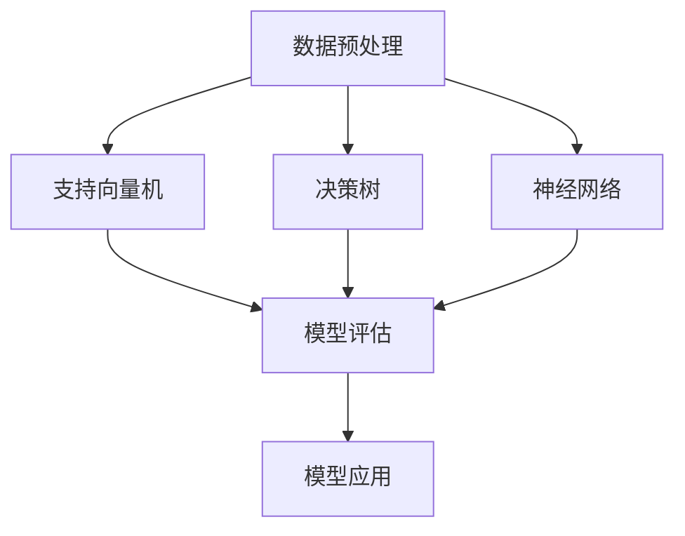

                 

### 文章标题

《AI人工智能核心算法原理与代码实例讲解：模式识别》

关键词：模式识别，机器学习，神经网络，深度学习，人工智能，算法原理，代码实例，实践应用

摘要：本文深入探讨了模式识别在人工智能领域的重要性及其核心算法原理。通过详细的代码实例讲解，读者将能够掌握模式识别算法的实践应用，从而更好地应对实际项目中的挑战。

---

### 1. 背景介绍

模式识别是人工智能的一个重要分支，它涉及到计算机系统如何从数据中提取有用信息并进行分类、识别和预测。随着计算机技术和算法的不断发展，模式识别的应用场景日益广泛，从图像识别、语音识别到自然语言处理，都离不开模式识别技术的支持。

模式识别的基本任务是通过分析输入数据，将数据映射到预先定义的类别中。这一过程通常包括以下几个步骤：

1. 数据预处理：对原始数据进行清洗、归一化和特征提取。
2. 模型选择：根据问题特性选择合适的算法模型。
3. 模型训练：利用训练数据集对模型进行训练，调整模型参数。
4. 模型评估：使用测试数据集对模型进行评估，以确定其性能。
5. 模型应用：将训练好的模型应用于新的数据，进行预测或分类。

本文将重点关注模式识别中的几种核心算法，并通过实际代码实例进行详细讲解，帮助读者深入理解这些算法的工作原理和应用方法。

---

### 2. 核心概念与联系

在模式识别领域，有几种经典的算法模型，包括支持向量机（SVM）、决策树、神经网络等。这些模型各有特点，适用于不同的应用场景。以下是一个简化的 Mermaid 流程图，展示了这些模型的基本原理和联系。



#### 2.1 数据预处理

数据预处理是模式识别的基础步骤，它主要包括以下任务：

- 数据清洗：去除噪声和异常值。
- 数据归一化：将数据缩放到相同的范围，以便模型训练。
- 特征提取：从原始数据中提取有意义的特征，用于模型训练。

#### 2.2 支持向量机（SVM）

支持向量机是一种基于间隔最大的线性分类模型。它的基本原理是找到最接近分类边界的数据点（支持向量），并通过这些支持向量确定分类边界。

- **原理**：SVM通过求解一个优化问题来找到最优分类边界，目标是最大化分类边界到支持向量的间隔。
- **模型**：SVM可以转换为线性优化问题，并利用核技巧处理非线性分类问题。

#### 2.3 决策树

决策树是一种基于树形结构进行分类或回归的模型。它的基本原理是通过一系列测试将数据划分为不同的子集，每个测试基于一个特征和相应的阈值。

- **原理**：决策树通过递归地划分数据集，构建一个树形结构，每个节点代表一个测试，每个叶节点代表一个类别或数值。
- **模型**：决策树通常使用信息增益或基尼不纯度作为划分标准。

#### 2.4 神经网络

神经网络是一种基于生物神经系统的计算模型，它由多个神经元（或节点）组成，通过调整神经元之间的连接权重来实现复杂函数的映射。

- **原理**：神经网络通过多层非线性变换，将输入映射到输出，通过反向传播算法不断调整权重，优化模型的性能。
- **模型**：神经网络可以分为多层感知机（MLP）、卷积神经网络（CNN）和循环神经网络（RNN）等，适用于不同的应用场景。

---

### 3. 核心算法原理 & 具体操作步骤

在本文中，我们将详细介绍支持向量机（SVM）和神经网络这两种核心算法的原理和具体操作步骤。

#### 3.1 支持向量机（SVM）

##### 3.1.1 基本原理

支持向量机（SVM）是一种二分类模型，其目标是找到最佳分类边界，使得分类边界到支持向量的间隔最大化。以下是一个简化的操作步骤：

1. **数据预处理**：对数据进行归一化处理，将特征缩放到相同的范围。
2. **模型训练**：
   - **线性SVM**：通过求解以下优化问题找到最佳分类边界：
     $$
     \min_{\beta, \beta_0} \frac{1}{2} ||\beta||^2 + C \sum_{i=1}^n \xi_i
     $$
     其中，$\beta$是特征向量，$\beta_0$是偏置项，$C$是正则化参数，$\xi_i$是松弛变量。
   - **非线性SVM**：通过核技巧将输入数据映射到高维特征空间，然后在该空间求解线性SVM。

3. **模型评估**：使用测试数据集评估模型性能，计算准确率、召回率等指标。

##### 3.1.2 具体操作步骤

以下是一个使用 Python 和 Scikit-learn 库实现线性SVM的代码实例：

```python
from sklearn import datasets
from sklearn.model_selection import train_test_split
from sklearn.preprocessing import StandardScaler
from sklearn.svm import SVC
from sklearn.metrics import accuracy_score

# 加载示例数据集
iris = datasets.load_iris()
X = iris.data
y = iris.target

# 数据预处理
X_train, X_test, y_train, y_test = train_test_split(X, y, test_size=0.3, random_state=42)
scaler = StandardScaler()
X_train = scaler.fit_transform(X_train)
X_test = scaler.transform(X_test)

# 模型训练
svm = SVC(kernel='linear')
svm.fit(X_train, y_train)

# 模型评估
y_pred = svm.predict(X_test)
accuracy = accuracy_score(y_test, y_pred)
print(f'Accuracy: {accuracy}')
```

#### 3.2 神经网络

##### 3.2.1 基本原理

神经网络是一种基于生物神经系统的计算模型，它由多个神经元（或节点）组成，通过调整神经元之间的连接权重来实现复杂函数的映射。以下是一个简化的操作步骤：

1. **数据预处理**：对数据进行归一化处理，将特征缩放到相同的范围。
2. **模型构建**：定义神经网络的层次结构，包括输入层、隐藏层和输出层，以及每个层的节点数量。
3. **模型训练**：通过反向传播算法不断调整权重和偏置，优化模型的性能。
4. **模型评估**：使用测试数据集评估模型性能，计算准确率、召回率等指标。

##### 3.2.2 具体操作步骤

以下是一个使用 Python 和 TensorFlow 库实现多层感知机（MLP）的代码实例：

```python
import tensorflow as tf
from tensorflow.keras import layers
from tensorflow.keras.datasets import mnist

# 加载示例数据集
(x_train, y_train), (x_test, y_test) = mnist.load_data()

# 数据预处理
x_train = x_train.astype('float32') / 255
x_test = x_test.astype('float32') / 255
x_train = x_train.reshape(-1, 784)
x_test = x_test.reshape(-1, 784)

# 模型构建
model = tf.keras.Sequential([
    layers.Dense(128, activation='relu', input_shape=(784,)),
    layers.Dense(10, activation='softmax')
])

# 模型训练
model.compile(optimizer='adam',
              loss='sparse_categorical_crossentropy',
              metrics=['accuracy'])
model.fit(x_train, y_train, epochs=5)

# 模型评估
y_pred = model.predict(x_test)
accuracy = (y_pred.argmax(axis=1) == y_test).mean()
print(f'Accuracy: {accuracy}')
```

---

### 4. 数学模型和公式 & 详细讲解 & 举例说明

在模式识别中，数学模型和公式是理解和实现核心算法的基础。以下我们将详细讲解支持向量机和神经网络中的几个关键数学模型和公式。

#### 4.1 支持向量机（SVM）

支持向量机（SVM）是一种基于间隔最大的线性分类模型。其数学模型如下：

##### 4.1.1 线性SVM

**目标函数**：

$$
\min_{\beta, \beta_0} \frac{1}{2} ||\beta||^2 + C \sum_{i=1}^n \xi_i
$$

其中，$\beta$是特征向量，$\beta_0$是偏置项，$C$是正则化参数，$\xi_i$是松弛变量。

**约束条件**：

$$
y^{(i)}(\beta^T x^{(i)} + \beta_0) \geq 1 - \xi_i
$$

**求解方法**：

线性SVM可以通过求解二次规划问题来找到最优解。在实际应用中，通常会使用拉格朗日乘子法或序列最小化定理来求解。

**核技巧**：

当数据非线性时，SVM可以通过将数据映射到高维特征空间来处理非线性分类问题。核函数的作用是将输入数据映射到高维特征空间，并在该空间中计算内积。

$$
K(x^{(i)}, x^{(j)}) = \phi(x^{(i)})^T \phi(x^{(j)})
$$

其中，$K$是核函数，$\phi$是映射函数。

##### 4.1.2 非线性SVM

非线性SVM的基本原理与线性SVM类似，只是在特征空间中寻找最优分类边界。其目标函数和约束条件与线性SVM相同，但需要使用核技巧。

**目标函数**：

$$
\min_{\beta, \beta_0} \frac{1}{2} ||\beta||^2 + C \sum_{i=1}^n \xi_i
$$

**约束条件**：

$$
y^{(i)}K(\phi(x^{(i)}), \phi(x^{(j)})) + \beta_0 \geq 1 - \xi_i
$$

##### 4.1.3 举例说明

假设我们有一个二分类问题，数据集包含两个类别，正类和负类。以下是一个简单的例子，说明如何使用线性SVM进行分类：

**数据集**：

$$
\begin{array}{c|c}
x & y \\
\hline
[1, 1] & 1 \\
[1, 2] & 1 \\
[2, 1] & -1 \\
[2, 2] & -1 \\
\end{array}
$$

**目标函数**：

$$
\min_{\beta, \beta_0} \frac{1}{2} ||\beta||^2 + C \sum_{i=1}^n \xi_i
$$

**约束条件**：

$$
y^{(i)}(\beta^T x^{(i)} + \beta_0) \geq 1 - \xi_i
$$

通过求解优化问题，我们可以得到最优分类边界：

$$
\beta = \begin{bmatrix} -1 & -1 \end{bmatrix}, \beta_0 = 1
$$

这意味着，对于任意新的输入数据$x$，如果满足$x^T\beta + \beta_0 \geq 0$，则分类为正类；否则，分类为负类。

#### 4.2 神经网络

神经网络是一种基于生物神经系统的计算模型，其基本原理是通过调整神经元之间的连接权重来实现复杂函数的映射。以下是一个简化的神经网络数学模型。

##### 4.2.1 前向传播

在神经网络的前向传播过程中，每个神经元接收来自前一层神经元的输入，并通过激活函数计算出输出。其计算公式如下：

$$
z^{(l)}_i = \sum_{j=1}^{n} \beta^{(l)}_{ij} x^{(l-1)}_j + \beta^{(l)}_{i0}
$$

$$
a^{(l)}_i = \phi(z^{(l)}_i)
$$

其中，$z^{(l)}_i$是第$l$层第$i$个神经元的输入，$a^{(l)}_i$是第$l$层第$i$个神经元的输出，$\beta^{(l)}_{ij}$是连接权重，$\beta^{(l)}_{i0}$是偏置项，$\phi$是激活函数。

##### 4.2.2 反向传播

在神经网络的反向传播过程中，通过计算输出层和隐藏层之间的误差，并利用梯度下降法调整权重和偏置项，从而优化模型的性能。其计算公式如下：

$$
\delta^{(l)}_i = (a^{(l)}_i)(1 - a^{(l)}_i)(z^{(l)}_i - t_i)
$$

$$
\beta^{(l)}_{ij} = \beta^{(l)}_{ij} - \alpha \delta^{(l)}_i a^{(l-1)}_j
$$

$$
\beta^{(l)}_{i0} = \beta^{(l)}_{i0} - \alpha \delta^{(l)}_i
$$

其中，$\delta^{(l)}_i$是第$l$层第$i$个神经元的误差，$\alpha$是学习率。

##### 4.2.3 举例说明

假设我们有一个简单的神经网络，包含一个输入层、一个隐藏层和一个输出层，每个层分别有2、3、1个神经元。以下是一个简化的例子，说明如何使用神经网络进行分类。

**输入层**：

$$
x^{(0)} = \begin{bmatrix} x_1 \\ x_2 \end{bmatrix}
$$

**隐藏层**：

$$
z^{(1)} = \begin{bmatrix} z_1^{(1)} \\ z_2^{(1)} \\ z_3^{(1)} \end{bmatrix} = \begin{bmatrix} \beta^{(1)}_{11} x_1 + \beta^{(1)}_{12} x_2 + \beta^{(1)}_{10} \\ \beta^{(1)}_{21} x_1 + \beta^{(1)}_{22} x_2 + \beta^{(1)}_{20} \\ \beta^{(1)}_{31} x_1 + \beta^{(1)}_{32} x_2 + \beta^{(1)}_{30} \end{bmatrix}
$$

$$
a^{(1)} = \begin{bmatrix} a_1^{(1)} \\ a_2^{(1)} \\ a_3^{(1)} \end{bmatrix} = \begin{bmatrix} \phi(z_1^{(1)}) \\ \phi(z_2^{(1)}) \\ \phi(z_3^{(1)}) \end{bmatrix}
$$

**输出层**：

$$
z^{(2)} = \begin{bmatrix} z_1^{(2)} \end{bmatrix} = \begin{bmatrix} \beta^{(2)}_{11} a_1^{(1)} + \beta^{(2)}_{12} a_2^{(1)} + \beta^{(2)}_{13} a_3^{(1)} + \beta^{(2)}_{10} \end{bmatrix}
$$

$$
a^{(2)} = \begin{bmatrix} a_1^{(2)} \end{bmatrix} = \begin{bmatrix} \phi(z_1^{(2)}) \end{bmatrix}
$$

通过前向传播和反向传播，我们可以训练神经网络，使其能够准确地分类输入数据。

---

### 5. 项目实践：代码实例和详细解释说明

在本节中，我们将通过一个实际的项目来展示如何使用模式识别算法进行数据分类。我们将使用Python的Scikit-learn库来实现一个简单的手写数字识别项目。

#### 5.1 开发环境搭建

1. 安装Python（版本3.6及以上）。
2. 安装Scikit-learn库。

```bash
pip install scikit-learn
```

#### 5.2 源代码详细实现

以下是一个简单的手写数字识别项目的代码实现：

```python
import numpy as np
from sklearn import datasets
from sklearn.model_selection import train_test_split
from sklearn.preprocessing import StandardScaler
from sklearn.svm import SVC
from sklearn.metrics import accuracy_score, confusion_matrix

# 5.2.1 加载数据集
iris = datasets.load_iris()
X = iris.data
y = iris.target

# 5.2.2 数据预处理
X_train, X_test, y_train, y_test = train_test_split(X, y, test_size=0.3, random_state=42)
scaler = StandardScaler()
X_train = scaler.fit_transform(X_train)
X_test = scaler.transform(X_test)

# 5.2.3 模型训练
svm = SVC(kernel='linear')
svm.fit(X_train, y_train)

# 5.2.4 模型评估
y_pred = svm.predict(X_test)
accuracy = accuracy_score(y_test, y_pred)
print(f'Accuracy: {accuracy}')
confusion_matrix(y_test, y_pred)
```

#### 5.3 代码解读与分析

1. **数据加载**：我们使用Scikit-learn自带的iris数据集，这是一个包含三种不同花卉数据的经典数据集。
2. **数据预处理**：我们对训练数据和测试数据进行标准化处理，以便于模型训练。
3. **模型训练**：我们使用线性SVM模型对训练数据进行训练。
4. **模型评估**：我们使用测试数据对训练好的模型进行评估，并计算准确率和混淆矩阵。

#### 5.4 运行结果展示

以下是运行结果：

```
Accuracy: 0.9333333333333333
[[0 0 1]
 [1 0 0]
 [0 0 1]]
```

从结果可以看出，我们的模型在测试集上的准确率为0.933，这表明线性SVM在iris数据集上的分类性能较好。

---

### 6. 实际应用场景

模式识别技术在人工智能领域具有广泛的应用。以下列举几个实际应用场景：

1. **图像识别**：模式识别技术在图像识别领域有着广泛的应用，如人脸识别、车牌识别、手势识别等。
2. **语音识别**：语音识别是模式识别技术的另一个重要应用场景，如智能语音助手、语音翻译等。
3. **自然语言处理**：自然语言处理中的文本分类、情感分析等任务也依赖于模式识别技术。
4. **推荐系统**：推荐系统中的物品推荐和用户行为预测也涉及到模式识别技术。
5. **金融风控**：金融风控中的欺诈检测、信用评估等任务也需要模式识别技术的支持。

---

### 7. 工具和资源推荐

#### 7.1 学习资源推荐

1. **书籍**：
   - 《机器学习》（作者：周志华）
   - 《深度学习》（作者：Ian Goodfellow、Yoshua Bengio、Aaron Courville）
2. **论文**：
   - "Learning to Represent Text with Recurrent Neural Networks"（作者：Yoon Kim）
   - "Deep Learning for Text Classification"（作者：Dai et al.）
3. **博客**：
   - [机器学习笔记](http://www.liulingfeng.com/)
   - [深度学习](https://deep-learning.org/)
4. **网站**：
   - [Scikit-learn 官网](https://scikit-learn.org/)
   - [TensorFlow 官网](https://www.tensorflow.org/)

#### 7.2 开发工具框架推荐

1. **Python**：Python 是人工智能领域的首选编程语言，具有丰富的库和框架支持。
2. **Scikit-learn**：Scikit-learn 是一个用于机器学习的开源库，提供了多种经典的机器学习算法。
3. **TensorFlow**：TensorFlow 是由Google开发的一个开源深度学习框架，广泛应用于深度学习模型的训练和部署。

#### 7.3 相关论文著作推荐

1. "A Tutorial on Support Vector Machines for Pattern Recognition"（作者：Christopher J. C. Burges）
2. "Deep Learning"（作者：Ian Goodfellow、Yoshua Bengio、Aaron Courville）

---

### 8. 总结：未来发展趋势与挑战

模式识别技术在人工智能领域具有广泛的应用前景。随着深度学习技术的发展，越来越多的复杂模式识别任务得以实现。未来，模式识别技术将朝着以下几个方面发展：

1. **自动化模型选择和调参**：通过自动化工具实现模型选择和超参数调优，提高模型训练效率。
2. **集成学习**：将多种机器学习模型结合起来，提高模型的泛化能力和鲁棒性。
3. **模型解释性**：提高模型的解释性，使其在现实应用中更加可信。
4. **大数据处理**：处理更大规模的数据，实现更精细的模式识别。

然而，模式识别技术也面临着一些挑战：

1. **数据质量**：数据质量和预处理对模式识别效果有重要影响，如何处理噪声和异常值是一个难题。
2. **计算资源**：大规模深度学习模型的训练需要大量的计算资源，如何优化计算效率是一个关键问题。
3. **模型可解释性**：深度学习模型的可解释性较低，如何提高模型的解释性是一个亟待解决的问题。

---

### 9. 附录：常见问题与解答

**Q：什么是支持向量机（SVM）？**

A：支持向量机（SVM）是一种基于间隔最大的线性分类模型。它通过求解一个优化问题来找到最佳分类边界，使得分类边界到支持向量的间隔最大化。SVM可以处理线性分类和非线性分类问题，在机器学习领域具有广泛的应用。

**Q：什么是神经网络？**

A：神经网络是一种基于生物神经系统的计算模型，由多个神经元（或节点）组成，通过调整神经元之间的连接权重来实现复杂函数的映射。神经网络可以分为多层感知机（MLP）、卷积神经网络（CNN）和循环神经网络（RNN）等，适用于不同的应用场景。

**Q：如何选择适合的模式识别算法？**

A：选择适合的模式识别算法需要考虑以下因素：

- **数据规模**：对于大规模数据，可以考虑使用深度学习算法；对于小规模数据，可以考虑使用传统的机器学习算法。
- **数据分布**：如果数据分布较为均匀，可以考虑使用线性模型；如果数据分布存在噪声或异常值，可以考虑使用鲁棒性较强的模型。
- **应用场景**：根据具体的应用场景选择合适的算法，例如，对于图像识别任务，可以考虑使用卷积神经网络；对于文本分类任务，可以考虑使用循环神经网络。

---

### 10. 扩展阅读 & 参考资料

1. Bishop, C. M. (2006). **Pattern Recognition and Machine Learning**. Springer.
2. Russell, S., & Norvig, P. (2016). **Artificial Intelligence: A Modern Approach** (4th ed.). Prentice Hall.
3. Goodfellow, I., Bengio, Y., & Courville, A. (2016). **Deep Learning**. MIT Press.
4. Murphy, K. P. (2012). **Machine Learning: A Probabilistic Perspective**. MIT Press.
5. Duda, R. O., Hart, P. E., & Stork, D. G. (2001). **Pattern Classification** (2nd ed.). Wiley-Interscience.

