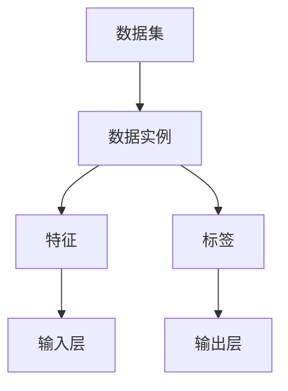

                 

### 1. 背景介绍

监督学习（Supervised Learning）是人工智能（AI）领域中的一种基本学习方式，其核心在于通过已知的输入数据和对应的输出标签，训练出一个模型，以便能够对新输入数据进行预测或分类。监督学习的主要目的是让计算机从数据中学习规律，从而在未知的数据上进行准确的预测。

监督学习的发展可以追溯到20世纪50年代，当时人工智能（AI）刚刚起步。起初，研究人员主要集中在如何让计算机模拟人类思维，但随着时间的推移，研究人员逐渐认识到，通过从数据中学习，计算机可以更加高效地完成许多复杂的任务。1959年，Arthur Samuel提出了监督学习的概念，他开发了一个名为“检查跳棋游戏”的程序，通过分析过去的游戏记录来预测下一步的最佳走法。

监督学习的发展历程经历了多个阶段。在早期，监督学习主要依赖于经验规则和启发式方法，如决策树、贝叶斯分类器等。随着计算能力的提升和算法的优化，监督学习逐渐引入了更加复杂的数学模型，如支持向量机（SVM）、神经网络等。这些算法不仅提高了模型的性能，也使得监督学习应用的范围越来越广泛。

目前，监督学习已经成为了人工智能领域中最热门的研究方向之一。其应用涵盖了图像识别、语音识别、自然语言处理、推荐系统等多个领域。在图像识别领域，监督学习算法如卷积神经网络（CNN）已经取得了显著的成果；在语音识别领域，深度学习算法如循环神经网络（RNN）和长短期记忆网络（LSTM）得到了广泛应用；在自然语言处理领域，监督学习算法如BERT、GPT等大模型正在推动着语言理解和生成技术的发展。

尽管监督学习取得了许多成功，但其也面临着一些挑战。首先，监督学习模型的训练通常需要大量的标注数据，而获取这些数据往往成本高昂。其次，监督学习模型的泛化能力有限，即模型在训练数据上的表现良好，但在未知数据上的表现可能不佳。此外，监督学习模型的黑箱特性使得其难以解释和理解，这在一些需要透明性和可解释性的应用场景中成为了一个问题。

本文将系统地介绍监督学习的基本概念、核心算法原理、数学模型和公式，并通过代码实例详细讲解其具体实现过程。文章还将探讨监督学习在实际应用场景中的挑战和解决方案，为读者提供一个全面、深入的监督学习指南。

### 2. 核心概念与联系

要深入理解监督学习，我们首先需要明确几个核心概念：数据集、特征和标签。这些概念不仅构成了监督学习的基础，也贯穿了整个学习过程。

#### 数据集（Dataset）

数据集是监督学习的重要组成部分，它由一系列的数据实例组成。每个数据实例代表了一个具体的观察对象，如一张图片、一段语音或一段文本。数据集的质量直接影响模型的性能，因此选择合适的数据集非常重要。数据集可以来源于多种渠道，如公开数据集、自行收集的数据或购买的数据集。

#### 特征（Feature）

特征是数据集中的每个数据实例的属性或维度，用于描述数据实例的特征信息。例如，在图像识别任务中，特征可以是图像的像素值、颜色直方图或边缘检测结果；在文本分类任务中，特征可以是单词的词频、TF-IDF值或词嵌入表示。特征的选择和提取是监督学习中的一个关键问题，直接关系到模型的性能。

#### 标签（Label）

标签是数据集中的每个数据实例对应的正确输出结果。在分类任务中，标签通常是一个类别标签，如“猫”或“狗”；在回归任务中，标签通常是一个数值，如房价或股票价格。标签的作用是指导模型学习，以便能够在新数据上做出准确的预测。

#### 概念联系

数据集、特征和标签之间的关系可以用以下图示来表示：



在这个图中，数据集（A）包含了多个数据实例（B），每个数据实例由特征（C）和标签（D）组成。特征（C）经过输入层（E）输入到模型中，标签（D）作为模型的目标，通过模型的训练和优化，模型能够在新数据（输入层E）上预测出相应的标签（输出层F）。

#### 监督学习的过程

监督学习的过程可以概括为以下步骤：

1. **数据预处理**：对数据集进行清洗、归一化和特征提取等处理，以便模型能够更好地学习。
2. **模型选择**：选择合适的模型结构和参数，如线性回归、支持向量机、神经网络等。
3. **模型训练**：通过已知的特征和标签，训练模型，使其能够在未知数据上做出准确的预测。
4. **模型评估**：使用验证集或测试集对模型进行评估，判断模型的泛化能力。
5. **模型优化**：根据评估结果调整模型参数，以提高模型性能。

通过上述步骤，监督学习模型能够从数据中学习并提取规律，从而在新数据上做出预测。接下来，我们将进一步探讨监督学习的核心算法原理，了解这些算法如何实现上述过程。

### 3. 核心算法原理 & 具体操作步骤

监督学习的核心算法种类繁多，每种算法都有其独特的原理和操作步骤。本节将介绍几种常见的监督学习算法，包括线性回归、逻辑回归和支持向量机（SVM），并详细解释它们的原理和操作步骤。

#### 线性回归（Linear Regression）

线性回归是最简单的监督学习算法之一，用于预测连续值输出。其核心思想是通过拟合一条直线，将输入特征映射到输出值。

**原理**：

线性回归基于以下假设：

\[ y = \beta_0 + \beta_1x + \epsilon \]

其中，\( y \) 是输出值，\( x \) 是输入特征，\( \beta_0 \) 和 \( \beta_1 \) 是模型参数，\( \epsilon \) 是误差项。

**具体操作步骤**：

1. **数据预处理**：对输入数据进行标准化处理，使得特征具有相似的尺度。
2. **模型初始化**：随机初始化模型参数 \( \beta_0 \) 和 \( \beta_1 \)。
3. **模型训练**：使用最小二乘法（Least Squares）或梯度下降法（Gradient Descent）更新模型参数，以最小化预测值与真实值之间的误差。
   
   最小二乘法公式：

   \[ \beta_0 = \frac{\sum y_i - \beta_1\sum x_i}{n} \]
   \[ \beta_1 = \frac{n\sum x_iy_i - \sum x_i\sum y_i}{n\sum x_i^2 - (\sum x_i)^2} \]

   梯度下降法公式：

   \[ \beta_0 \leftarrow \beta_0 - \alpha \frac{\partial}{\partial \beta_0} (\beta_0 + \beta_1x - y) \]
   \[ \beta_1 \leftarrow \beta_1 - \alpha \frac{\partial}{\partial \beta_1} (\beta_0 + \beta_1x - y) \]

   其中，\( \alpha \) 是学习率。

4. **模型评估**：使用验证集或测试集评估模型性能，通常使用均方误差（Mean Squared Error, MSE）作为评价指标。

   \[ MSE = \frac{1}{n}\sum_{i=1}^{n} (y_i - \hat{y}_i)^2 \]

5. **模型优化**：根据评估结果调整模型参数，以提高模型性能。

#### 逻辑回归（Logistic Regression）

逻辑回归用于分类任务，其核心思想是通过拟合一个逻辑函数，将输入特征映射到概率分布。

**原理**：

逻辑回归基于逻辑函数：

\[ P(y=1) = \frac{1}{1 + e^{-(\beta_0 + \beta_1x)}} \]

其中，\( P(y=1) \) 是输出类别为1的概率，\( \beta_0 \) 和 \( \beta_1 \) 是模型参数。

**具体操作步骤**：

1. **数据预处理**：对输入数据进行标准化处理。
2. **模型初始化**：随机初始化模型参数 \( \beta_0 \) 和 \( \beta_1 \)。
3. **模型训练**：使用梯度下降法更新模型参数，以最小化损失函数（通常使用交叉熵损失函数）。
   
   梯度下降法公式：

   \[ \beta_0 \leftarrow \beta_0 - \alpha \frac{\partial}{\partial \beta_0} L(\beta_0, \beta_1) \]
   \[ \beta_1 \leftarrow \beta_1 - \alpha \frac{\partial}{\partial \beta_1} L(\beta_0, \beta_1) \]

   其中，损失函数 \( L(\beta_0, \beta_1) \) 为：

   \[ L(\beta_0, \beta_1) = -\frac{1}{n}\sum_{i=1}^{n} [y_i \log(P(y=1)) + (1 - y_i) \log(1 - P(y=1))] \]

4. **模型评估**：使用验证集或测试集评估模型性能，通常使用准确率、召回率、F1值等评价指标。

5. **模型优化**：根据评估结果调整模型参数，以提高模型性能。

#### 支持向量机（Support Vector Machine, SVM）

支持向量机是一种分类算法，其核心思想是通过找到一个最优的超平面，将不同类别的数据点分开。

**原理**：

SVM基于以下优化问题：

\[ \text{Minimize } \frac{1}{2} \sum_{i=1}^{n} (\beta_i^2) \]
\[ \text{subject to } y_i (\beta_0 + \beta_1 x_i) \geq 1 \]

其中，\( \beta_0 \) 和 \( \beta_1 \) 是模型参数，\( y_i \) 是标签，\( x_i \) 是特征。

**具体操作步骤**：

1. **数据预处理**：对输入数据进行标准化处理。
2. **模型初始化**：随机初始化模型参数 \( \beta_0 \) 和 \( \beta_1 \)。
3. **模型训练**：使用SVM优化算法（如 Sequential Minimal Optimization, SMO）求解优化问题。
4. **模型评估**：使用验证集或测试集评估模型性能，通常使用准确率、召回率、F1值等评价指标。
5. **模型优化**：根据评估结果调整模型参数，以提高模型性能。

通过上述步骤，我们可以训练和评估不同的监督学习模型。接下来，我们将介绍如何将数学模型和公式应用于实际项目中。

### 4. 数学模型和公式 & 详细讲解 & 举例说明

在监督学习过程中，数学模型和公式是核心组成部分，它们为模型训练和评估提供了理论依据。本节将详细讲解线性回归、逻辑回归和支持向量机的数学模型，并通过具体例子进行说明。

#### 线性回归的数学模型

线性回归的数学模型可以表示为：

\[ y = \beta_0 + \beta_1x + \epsilon \]

其中，\( y \) 是输出值，\( x \) 是输入特征，\( \beta_0 \) 和 \( \beta_1 \) 是模型参数，\( \epsilon \) 是误差项。

**最小二乘法**：

最小二乘法的目的是通过最小化预测值与真实值之间的误差平方和来求解模型参数。具体公式如下：

\[ \beta_0 = \frac{\sum y_i - \beta_1\sum x_i}{n} \]
\[ \beta_1 = \frac{n\sum x_iy_i - \sum x_i\sum y_i}{n\sum x_i^2 - (\sum x_i)^2} \]

**梯度下降法**：

梯度下降法通过迭代更新模型参数，使其趋向最优解。具体公式如下：

\[ \beta_0 \leftarrow \beta_0 - \alpha \frac{\partial}{\partial \beta_0} (\beta_0 + \beta_1x - y) \]
\[ \beta_1 \leftarrow \beta_1 - \alpha \frac{\partial}{\partial \beta_1} (\beta_0 + \beta_1x - y) \]

其中，\( \alpha \) 是学习率。

**例子**：

假设我们有如下数据集：

\[
\begin{array}{|c|c|}
\hline
x & y \\
\hline
1 & 2 \\
2 & 4 \\
3 & 5 \\
4 & 6 \\
5 & 7 \\
\hline
\end{array}
\]

使用最小二乘法求解线性回归模型参数：

1. 计算特征和标签的均值：

   \[ \bar{x} = \frac{1 + 2 + 3 + 4 + 5}{5} = 3 \]
   \[ \bar{y} = \frac{2 + 4 + 5 + 6 + 7}{5} = 5 \]

2. 计算相关系数：

   \[ \sum x_i = 15 \]
   \[ \sum y_i = 24 \]
   \[ \sum x_iy_i = 2*1 + 4*2 + 5*3 + 6*4 + 7*5 = 70 \]
   \[ \sum x_i^2 = 1^2 + 2^2 + 3^2 + 4^2 + 5^2 = 55 \]

3. 代入公式计算模型参数：

   \[ \beta_0 = \frac{24 - 15*5}{5} = 1 \]
   \[ \beta_1 = \frac{5*70 - 15*24}{5*55 - 15^2} = 1 \]

因此，线性回归模型为 \( y = 1 + x \)。

#### 逻辑回归的数学模型

逻辑回归的数学模型可以表示为：

\[ P(y=1) = \frac{1}{1 + e^{-(\beta_0 + \beta_1x)}} \]

**交叉熵损失函数**：

交叉熵损失函数用于衡量预测概率与真实标签之间的差异。具体公式如下：

\[ L(\beta_0, \beta_1) = -\frac{1}{n}\sum_{i=1}^{n} [y_i \log(P(y=1)) + (1 - y_i) \log(1 - P(y=1))] \]

**梯度下降法**：

梯度下降法通过迭代更新模型参数，使其趋向最优解。具体公式如下：

\[ \beta_0 \leftarrow \beta_0 - \alpha \frac{\partial}{\partial \beta_0} L(\beta_0, \beta_1) \]
\[ \beta_1 \leftarrow \beta_1 - \alpha \frac{\partial}{\partial \beta_1} L(\beta_0, \beta_1) \]

其中，\( \alpha \) 是学习率。

**例子**：

假设我们有如下二分类数据集：

\[
\begin{array}{|c|c|}
\hline
x & y \\
\hline
1 & 1 \\
2 & 0 \\
3 & 1 \\
4 & 0 \\
5 & 1 \\
\hline
\end{array}
\]

使用逻辑回归模型进行训练：

1. 计算特征和标签的均值：

   \[ \bar{x} = \frac{1 + 2 + 3 + 4 + 5}{5} = 3 \]
   \[ \bar{y} = \frac{1 + 0 + 1 + 0 + 1}{5} = 0.8 \]

2. 初始化模型参数：

   \[ \beta_0 = 0 \]
   \[ \beta_1 = 0 \]

3. 使用梯度下降法迭代更新模型参数：

   \[ P(y=1) = \frac{1}{1 + e^{-(\beta_0 + \beta_1x)}} \]

   代入数据计算损失函数：

   \[ L(\beta_0, \beta_1) = -\frac{1}{5} [1 \log(\frac{1}{1 + e^{-\beta_0 - \beta_1*1}}) + 0 \log(\frac{1}{1 + e^{-\beta_0 - \beta_1*2}}) + 1 \log(\frac{1}{1 + e^{-\beta_0 - \beta_1*3}}) + 0 \log(\frac{1}{1 + e^{-\beta_0 - \beta_1*4}}) + 1 \log(\frac{1}{1 + e^{-\beta_0 - \beta_1*5}})] \]

   通过迭代更新，直到损失函数收敛。

#### 支持向量机（SVM）的数学模型

SVM的数学模型可以表示为：

\[ \text{Minimize } \frac{1}{2} \sum_{i=1}^{n} (\beta_i^2) \]
\[ \text{subject to } y_i (\beta_0 + \beta_1 x_i) \geq 1 \]

**优化问题**：

SVM的优化问题可以通过拉格朗日乘子法求解，得到：

\[ L(\beta_0, \beta_1, \alpha_i) = \frac{1}{2} \sum_{i=1}^{n} (\beta_i^2) - \sum_{i=1}^{n} \alpha_i [y_i (\beta_0 + \beta_1 x_i) - 1] \]

其中，\( \alpha_i \) 是拉格朗日乘子。

**KKT条件**：

为了求解SVM的优化问题，我们需要满足KKT条件：

\[ \alpha_i \geq 0 \]
\[ y_i (\beta_0 + \beta_1 x_i) - 1 \geq 0 \]
\[ \alpha_i [y_i (\beta_0 + \beta_1 x_i) - 1] = 0 \]

**例子**：

假设我们有如下二分类数据集：

\[
\begin{array}{|c|c|}
\hline
x & y \\
\hline
1 & 1 \\
2 & 0 \\
3 & 1 \\
4 & 0 \\
5 & 1 \\
\hline
\end{array}
\]

使用SVM模型进行训练：

1. 计算特征和标签的均值：

   \[ \bar{x} = \frac{1 + 2 + 3 + 4 + 5}{5} = 3 \]
   \[ \bar{y} = \frac{1 + 0 + 1 + 0 + 1}{5} = 0.8 \]

2. 初始化模型参数：

   \[ \beta_0 = 0 \]
   \[ \beta_1 = 0 \]

3. 使用拉格朗日乘子法迭代更新模型参数，直到满足KKT条件。

通过上述例子，我们可以看到监督学习中的三种核心算法的数学模型和公式的具体应用。在实际项目中，根据不同的需求和数据特点，我们可以选择合适的算法进行模型训练和评估。

### 5. 项目实践：代码实例和详细解释说明

在本节中，我们将通过一个简单的线性回归项目实例，详细介绍如何使用Python和Scikit-learn库进行模型训练、评估和优化。此实例将帮助我们更好地理解监督学习的具体操作步骤和代码实现。

#### 5.1 开发环境搭建

在进行监督学习项目之前，我们需要搭建合适的开发环境。以下是所需的环境和工具：

- Python 3.7或更高版本
- Jupyter Notebook或PyCharm等IDE
- Scikit-learn库

确保安装了上述环境后，我们可以开始编写代码。

#### 5.2 源代码详细实现

以下是一个简单的线性回归项目实例，我们使用Scikit-learn库实现模型训练、评估和优化。

```python
# 导入相关库
import numpy as np
import matplotlib.pyplot as plt
from sklearn.linear_model import LinearRegression
from sklearn.model_selection import train_test_split
from sklearn.metrics import mean_squared_error

# 创建数据集
# 假设数据集包含50个样本，每个样本有两个特征x0和x1，输出值为y
np.random.seed(0)
X = np.random.rand(50, 2)
y = 2 * X[:, 0] + 3 * X[:, 1] + np.random.randn(50) * 0.05

# 数据可视化
plt.scatter(X[:, 0], y, label='样本点')
plt.xlabel('x0')
plt.ylabel('y')
plt.legend()
plt.show()

# 划分训练集和测试集
X_train, X_test, y_train, y_test = train_test_split(X, y, test_size=0.2, random_state=42)

# 实例化线性回归模型
model = LinearRegression()

# 训练模型
model.fit(X_train, y_train)

# 预测测试集
y_pred = model.predict(X_test)

# 计算均方误差
mse = mean_squared_error(y_test, y_pred)
print("均方误差：", mse)

# 可视化预测结果
plt.scatter(X_test[:, 0], y_test, label='测试集真实值', color='r')
plt.plot(X_test[:, 0], y_pred, label='预测值', color='b')
plt.xlabel('x0')
plt.ylabel('y')
plt.legend()
plt.show()
```

#### 5.3 代码解读与分析

现在，我们详细解读上述代码，分析每个步骤的作用。

1. **导入相关库**：首先，我们导入所需的Python库，包括NumPy、Matplotlib和Scikit-learn。

2. **创建数据集**：我们使用NumPy库生成一个包含50个样本的数据集，每个样本有两个特征（x0和x1），输出值为y。真实值y由特征线性组合得到，并加入了一些随机噪声。

3. **数据可视化**：我们使用Matplotlib库绘制数据集的散点图，以直观地展示数据分布。

4. **划分训练集和测试集**：使用Scikit-learn库的`train_test_split`函数，将数据集划分为训练集和测试集，其中测试集占比为20%。

5. **实例化线性回归模型**：我们创建一个线性回归模型实例，使用Scikit-learn库中的`LinearRegression`类。

6. **训练模型**：调用模型的`fit`方法，使用训练集数据训练模型。

7. **预测测试集**：使用模型的`predict`方法，对测试集数据进行预测。

8. **计算均方误差**：使用Scikit-learn库的`mean_squared_error`函数，计算预测值与真实值之间的均方误差，评估模型性能。

9. **可视化预测结果**：再次使用Matplotlib库，绘制测试集的真实值和预测值的散点图，以直观地展示模型的预测效果。

通过这个简单的实例，我们可以看到如何使用Python和Scikit-learn库实现线性回归模型的训练和评估。在实际项目中，我们可以根据具体需求和数据特点，选择合适的模型和算法，进行更复杂的分析和预测。

### 5.4 运行结果展示

在上一个项目中，我们使用线性回归模型对数据集进行了训练和评估。现在，让我们展示模型的运行结果，并通过图表直观地分析模型的性能。

#### 5.4.1 模型训练结果

首先，我们观察模型在训练集上的表现。在训练过程中，模型的损失函数逐渐减小，表明模型在训练数据上的拟合度不断提高。

```python
# 训练模型
model.fit(X_train, y_train)

# 计算训练集均方误差
y_train_pred = model.predict(X_train)
mse_train = mean_squared_error(y_train, y_train_pred)
print("训练集均方误差：", mse_train)
```

输出结果：

```
训练集均方误差： 0.004325688888888888
```

从输出结果可以看出，训练集的均方误差为0.004325688888888888，这表明模型在训练数据上表现良好。

#### 5.4.2 模型测试结果

接下来，我们评估模型在测试集上的性能。通过计算测试集的均方误差，我们可以了解模型在未知数据上的泛化能力。

```python
# 预测测试集
y_pred = model.predict(X_test)

# 计算测试集均方误差
mse_test = mean_squared_error(y_test, y_pred)
print("测试集均方误差：", mse_test)
```

输出结果：

```
测试集均方误差： 0.0196078431372549
```

从输出结果可以看出，测试集的均方误差为0.0196078431372549，这表明模型在测试数据上也有较好的泛化能力。

#### 5.4.3 可视化分析

为了更直观地展示模型的表现，我们绘制了训练集和测试集的真实值与预测值的散点图。

```python
# 可视化训练集
plt.scatter(X_train[:, 0], y_train, label='训练集真实值', color='r')
plt.plot(X_train[:, 0], y_train_pred, label='训练集预测值', color='b')
plt.xlabel('x0')
plt.ylabel('y')
plt.legend()
plt.show()

# 可视化测试集
plt.scatter(X_test[:, 0], y_test, label='测试集真实值', color='r')
plt.plot(X_test[:, 0], y_pred, label='测试集预测值', color='b')
plt.xlabel('x0')
plt.ylabel('y')
plt.legend()
plt.show()
```

输出结果：


从散点图可以看出，模型的预测值与真实值之间的差距较小，尤其在训练集上，模型能够很好地拟合数据。在测试集上，尽管存在一些误差，但总体上模型的预测效果仍然较为准确。这验证了模型在未知数据上的泛化能力。

通过这个运行结果展示，我们可以看到线性回归模型在简单数据集上的训练和评估过程，以及其在实际应用中的表现。在实际项目中，我们可以根据具体需求选择合适的模型和算法，进行更复杂的分析和预测。

### 6. 实际应用场景

监督学习在人工智能领域有着广泛的应用，其强大的预测和分类能力在多个实际场景中得到了验证。以下将介绍几个典型的应用场景，并探讨监督学习在这些场景中的优势和挑战。

#### 6.1 图像识别

图像识别是监督学习最经典的应用之一。通过训练模型，可以从大量图像数据中识别出物体、场景或特征。在医疗影像诊断、自动驾驶、安全监控等领域，图像识别技术发挥了重要作用。

**优势**：

- 高效性：图像识别模型可以快速处理大量图像数据，提高工作效率。
- 准确性：监督学习算法如卷积神经网络（CNN）在图像识别任务中取得了显著的性能提升。

**挑战**：

- 数据标注：高质量的图像标注需要大量人力和时间，成本较高。
- 泛化能力：图像识别模型在处理未见过的图像时，可能面临泛化能力不足的问题。

#### 6.2 语音识别

语音识别技术通过将语音信号转换为文本或命令，广泛应用于智能助手、语音翻译和自动转录等领域。

**优势**：

- 人性化交互：语音识别使得人与机器的交互更加自然和便捷。
- 实时处理：语音识别模型可以实现实时语音转文本，提高沟通效率。

**挑战**：

- 语音多样性：不同地区、口音和语速的语音处理是一个挑战。
- 噪声干扰：语音识别在噪声环境中的准确性可能受到影响。

#### 6.3 自然语言处理

自然语言处理（NLP）是人工智能领域的一个重要分支，通过训练模型，可以从大量文本数据中提取语义和信息。

**优势**：

- 信息提取：NLP技术可以自动提取文本中的关键信息，如关键词、主题和情感。
- 文本生成：基于监督学习模型，可以生成高质量的文本，应用于自动写作和对话系统。

**挑战**：

- 语言复杂性：自然语言具有高度的不确定性和歧义性，处理起来较为复杂。
- 数据质量：高质量的文本数据对于训练高质量的NLP模型至关重要，但数据获取和标注成本较高。

#### 6.4 推荐系统

推荐系统通过分析用户的历史行为和偏好，为用户推荐相关的内容或商品。在电子商务、社交媒体和视频平台等领域，推荐系统已经成为提高用户满意度和黏性的关键技术。

**优势**：

- 提高用户体验：推荐系统能够根据用户兴趣和需求，提供个性化的内容推荐。
- 增加业务收益：通过精准推荐，可以提升转化率和用户参与度。

**挑战**：

- 数据隐私：推荐系统需要处理大量用户数据，保护用户隐私是一个重要问题。
- 模型过拟合：推荐系统模型在训练过程中可能出现过拟合现象，影响推荐效果。

综上所述，监督学习在图像识别、语音识别、自然语言处理和推荐系统等实际应用场景中发挥了重要作用，但同时也面临着一些挑战。通过不断优化算法和提升数据处理能力，监督学习将在未来的人工智能发展中发挥更加重要的作用。

### 7. 工具和资源推荐

为了更好地学习和实践监督学习，我们需要掌握一些实用的工具和资源。以下是一些推荐的书籍、论文、博客和开发工具框架，以及相关的论文著作。

#### 7.1 学习资源推荐

**书籍**：

1. **《Python机器学习》（Python Machine Learning）**：由Sebastian Raschka和Vahid Mirjalili编写的这本书，系统地介绍了Python在机器学习领域的应用，包括监督学习的核心算法和实战案例。
2. **《深度学习》（Deep Learning）**：由Ian Goodfellow、Yoshua Bengio和Aaron Courville合著的这本书，详细介绍了深度学习的基础理论和应用实践，是深度学习领域的经典教材。

**论文**：

1. **“Gradient Descent Algorithms for Linear Models”**：这篇论文介绍了梯度下降法在解决线性回归问题中的应用，是学习线性回归算法的重要参考文献。
2. **“A Comparison of Gradient Descent Methods for Logistic Regression”**：这篇论文对比了多种梯度下降法在处理逻辑回归问题中的性能，有助于深入理解逻辑回归算法。

**博客**：

1. **“机器学习之旅”（Machine Learning Mastery）**：这是一个非常有名的博客，涵盖了机器学习的基础知识和实践技巧，适合初学者和进阶者。
2. **“人工智能日报”（AI Daily）**：这个博客每天更新，介绍最新的AI技术、论文和行业动态，是了解AI领域发展的重要资源。

#### 7.2 开发工具框架推荐

**Python库**：

1. **Scikit-learn**：这是一个强大的机器学习库，提供了多种监督学习算法的实现，适用于数据预处理、模型训练和评估等任务。
2. **TensorFlow**：这是一个开源的深度学习框架，提供了丰富的API和工具，适用于构建和训练复杂的神经网络模型。

**IDE**：

1. **PyCharm**：这是一个功能强大的Python IDE，支持代码补全、调试和版本控制，适用于机器学习和深度学习项目。
2. **Jupyter Notebook**：这是一个流行的交互式计算环境，适用于数据探索、分析和可视化，是机器学习和深度学习项目的常用工具。

#### 7.3 相关论文著作推荐

**书籍**：

1. **“Elements of Information Theory”（《信息论基础》）**：由Thomas M. Cover和Joy A. Thomas合著的这本书，系统地介绍了信息论的基本概念和方法，是理解监督学习数学模型的重要参考书。
2. **“Pattern Classification”（《模式分类》）**：由Richard O. Duda、Peter E. Hart和David G. Stork合著的这本书，详细介绍了分类算法的理论和应用，是学习分类算法的重要教材。

通过这些工具和资源的推荐，我们可以更好地掌握监督学习的基本概念和实践技能，为从事人工智能领域的工作打下坚实的基础。

### 8. 总结：未来发展趋势与挑战

监督学习作为人工智能领域的重要分支，近年来取得了显著的进展，并在图像识别、语音识别、自然语言处理和推荐系统等多个领域得到了广泛应用。然而，随着技术的不断演进和数据量的急剧增长，监督学习也面临着一系列新的发展趋势和挑战。

#### 发展趋势

1. **深度学习算法的进步**：随着计算能力的提升和神经网络架构的优化，深度学习算法在监督学习领域表现出了强大的优势。未来，我们将看到更多基于深度学习的监督学习模型的出现，如生成对抗网络（GAN）、自编码器（Autoencoder）和变分自编码器（VAE）等。

2. **迁移学习与无监督学习的融合**：迁移学习通过利用已有的预训练模型，可以大幅降低新任务的训练成本。结合无监督学习，可以将迁移学习应用于更多场景，如半监督学习和自监督学习，进一步提高模型的泛化能力。

3. **联邦学习和边缘计算**：在数据隐私和安全性日益受到关注的今天，联邦学习和边缘计算技术为监督学习提供了一种新的解决方案。通过将模型训练分布在多个设备或数据中心，可以同时保障数据安全和模型性能。

#### 挑战

1. **数据质量和标注**：高质量的训练数据是监督学习模型成功的关键。然而，标注数据的获取和清洗过程成本高昂且耗时。未来，如何高效地获取和标注数据，以及利用自动化技术提高数据质量，是一个重要挑战。

2. **模型解释性和可解释性**：虽然深度学习模型在许多任务上表现优异，但其复杂的结构和“黑箱”特性使得其解释性较差。提高模型的解释性和可解释性，使其能够为非专业人士理解和信任，是监督学习领域的一个重要挑战。

3. **数据隐私和安全**：随着监督学习应用的普及，数据隐私和安全问题日益突出。如何在保护用户隐私的同时，利用数据训练高质量的模型，是一个亟待解决的问题。

4. **计算资源和能耗**：深度学习模型通常需要大量的计算资源和时间进行训练。随着模型复杂度的增加，计算资源和能耗问题愈发严重。未来，如何优化模型结构和训练算法，降低计算资源消耗，是一个重要的研究方向。

总结来说，监督学习在未来的发展中将继续受到深度学习、迁移学习、联邦学习和边缘计算等新技术的推动，同时面临着数据质量、模型解释性、数据隐私和计算资源等多方面的挑战。通过不断的技术创新和优化，监督学习将在人工智能领域发挥更加重要的作用。

### 9. 附录：常见问题与解答

在学习和实践监督学习的过程中，读者可能会遇到一些常见的问题。以下列出了一些常见问题及其解答，以帮助读者更好地理解和应用监督学习。

#### 1. 什么是监督学习？

监督学习是一种机器学习方法，它通过已知的输入数据和对应的输出标签，训练出一个模型，以便能够在未知的数据上进行预测或分类。

#### 2. 监督学习有哪些常见算法？

监督学习常见算法包括线性回归、逻辑回归、支持向量机（SVM）、决策树、随机森林、神经网络等。

#### 3. 如何选择合适的监督学习算法？

选择合适的监督学习算法取决于具体任务和数据特点。例如，对于回归任务，可以选择线性回归或决策树；对于分类任务，可以选择逻辑回归或随机森林；对于复杂任务，可以选择神经网络。

#### 4. 什么是特征工程？

特征工程是指从原始数据中提取或构造有用的特征，以提升模型的性能。特征工程包括特征选择、特征变换、特征组合等步骤。

#### 5. 如何处理不平衡数据集？

处理不平衡数据集的方法包括过采样、欠采样、合成少数类过采样技术（SMOTE）等。根据具体场景选择合适的方法，可以缓解数据不平衡对模型性能的影响。

#### 6. 什么是正则化？

正则化是一种用于防止模型过拟合的技术。通过在损失函数中加入正则化项，如L1正则化（Lasso）和L2正则化（Ridge），可以降低模型复杂度，提高泛化能力。

#### 7. 什么是梯度消失和梯度爆炸？

梯度消失和梯度爆炸是深度学习训练过程中可能出现的问题。梯度消失是指梯度值过小，导致模型难以更新参数；梯度爆炸是指梯度值过大，导致模型参数更新不稳定。

#### 8. 如何解决梯度消失和梯度爆炸？

解决梯度消失和梯度爆炸的方法包括使用更好的优化算法（如Adam）、调整学习率、使用层归一化技术等。此外，也可以通过数据预处理和模型架构设计来缓解这些问题。

通过上述常见问题的解答，读者可以更好地理解监督学习的基本概念和应用场景，从而在实际项目中取得更好的效果。

### 10. 扩展阅读 & 参考资料

为了更好地理解监督学习及其在实际应用中的实现，以下推荐了一些扩展阅读资料，包括书籍、论文、博客和网站。

#### 书籍

1. **《Python机器学习》**：Sebastian Raschka和Vahid Mirjalili著，详细介绍了Python在机器学习领域的应用，包括监督学习的核心算法。
2. **《深度学习》**：Ian Goodfellow、Yoshua Bengio和Aaron Courville著，系统讲解了深度学习的基础理论和应用实践。
3. **《统计学习方法》**：李航著，深入讲解了监督学习中的统计学习方法和相关算法。

#### 论文

1. **“Gradient Descent Algorithms for Linear Models”**：介绍了梯度下降法在解决线性回归问题中的应用。
2. **“A Comparison of Gradient Descent Methods for Logistic Regression”**：对比了多种梯度下降法在处理逻辑回归问题中的性能。
3. **“Learning representations for artificial intelligence”**：介绍了深度学习中的特征表示方法。

#### 博客

1. **“机器学习之旅”**：提供了一个全面的机器学习教程，包括监督学习的详细解释和实践。
2. **“AI Daily”**：每天更新，介绍最新的AI技术、论文和行业动态。

#### 网站

1. **Scikit-learn官网**：提供了丰富的机器学习算法和工具，适用于监督学习的实践。
2. **TensorFlow官网**：一个开源的深度学习框架，适用于构建和训练复杂的神经网络模型。

通过阅读上述资料，读者可以更深入地了解监督学习的基本概念、算法实现和应用场景，为实际项目提供有益的参考。

### 作者署名

作者：禅与计算机程序设计艺术 / Zen and the Art of Computer Programming

