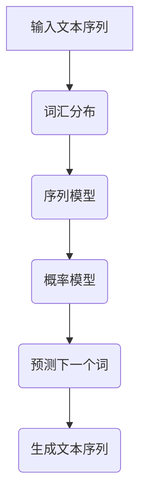

                 

### 背景介绍

**AI人工智能核心算法原理与代码实例讲解：语言模型**

本文将深入探讨语言模型这一AI人工智能的核心算法，旨在帮助读者理解其基本原理、实现过程和实际应用。语言模型在自然语言处理（NLP）领域中扮演着至关重要的角色，它们能够预测下一个词或句子，从而在自动翻译、文本摘要、语音识别和生成等领域中发挥作用。

#### 语言模型的发展历程

语言模型的发展经历了从规则驱动到统计模型，再到深度学习模型的演变过程。早期，研究者们尝试通过编写复杂的规则来模拟语言，这些规则虽然能够处理一些简单的任务，但在面对复杂的语言现象时显得力不从心。

随着计算能力的提升和大数据的普及，统计模型逐渐崭露头角。统计模型通过统计语言数据中的频率分布来预测下一个词或句子，虽然这些模型在某些任务上取得了较好的效果，但它们通常只能处理特定的语言模式，无法很好地应对语言中的变异性。

近年来，深度学习模型的兴起为语言模型带来了革命性的变化。深度学习模型，特别是基于循环神经网络（RNN）和变换器模型（Transformer）的模型，通过学习大量的文本数据，能够捕捉到语言中的复杂模式，从而在多种NLP任务中取得了显著的效果。

#### 语言模型的应用场景

语言模型在自然语言处理领域有着广泛的应用。以下是几个典型的应用场景：

- **自动翻译**：语言模型可以帮助机器将一种语言的文本翻译成另一种语言。例如，谷歌翻译使用的Transformer模型能够在多种语言之间进行精确的翻译。
- **文本摘要**：语言模型可以提取文本的主要信息和关键概念，从而生成简洁的摘要。例如，新闻摘要生成和社交媒体内容摘要都依赖于语言模型。
- **语音识别**：语言模型可以帮助语音识别系统将语音信号转换成文本。结合语音识别技术，语言模型可以应用于语音助手、自动字幕生成等场景。
- **文本生成**：语言模型可以生成新的文本内容，包括文章、对话和故事等。例如，OpenAI的GPT-3模型可以生成高质量的文章和对话。

#### 本文结构

本文将按照以下结构展开：

1. **核心概念与联系**：介绍语言模型的基本概念，包括词汇分布、序列模型和概率模型等，并通过Mermaid流程图展示其架构。
2. **核心算法原理 & 具体操作步骤**：详细讲解语言模型的核心算法原理，包括训练和预测的过程，并阐述如何使用这些算法来构建实用的语言模型。
3. **数学模型和公式 & 详细讲解 & 举例说明**：介绍语言模型背后的数学模型，包括概率分布、损失函数和优化算法等，并通过具体例子说明如何应用这些数学模型。
4. **项目实践：代码实例和详细解释说明**：通过一个具体的语言模型项目实例，展示如何使用Python和深度学习框架（如TensorFlow或PyTorch）来实现语言模型，并对代码进行详细解读。
5. **实际应用场景**：探讨语言模型在不同领域中的应用，如机器翻译、文本摘要和对话系统等。
6. **工具和资源推荐**：推荐一些学习资源、开发工具和框架，帮助读者深入了解语言模型。
7. **总结：未来发展趋势与挑战**：总结语言模型的发展历程和现状，并讨论未来的发展趋势和面临的挑战。
8. **附录：常见问题与解答**：解答读者可能遇到的一些常见问题。
9. **扩展阅读 & 参考资料**：提供一些相关的扩展阅读和参考资料，帮助读者进一步深入学习。

接下来，我们将逐步深入探讨语言模型的核心概念、算法原理和实际应用。

### 核心概念与联系

语言模型是自然语言处理（NLP）的核心组成部分，它旨在理解和生成自然语言。要理解语言模型的工作原理，我们需要从核心概念和架构入手。以下是语言模型涉及的一些关键概念和它们之间的联系。

#### 词汇分布（Lexical Distribution）

词汇分布是指语言中各个词汇出现的频率和分布情况。语言模型通过学习词汇分布，可以预测下一个词或句子。词汇分布是语言模型的基础，它为模型提供了语言数据的基本统计信息。

#### 序列模型（Sequential Model）

序列模型是一种处理序列数据的模型，如图像、声音或文本。在自然语言处理中，文本通常被视为一个序列，每个词或字符都是序列中的一个元素。序列模型通过学习序列中的元素及其相互关系，能够预测序列的下一个元素。

#### 概率模型（Probabilistic Model）

概率模型是一种基于概率论的模型，它通过计算事件发生的概率来预测结果。在语言模型中，概率模型用于预测下一个词或句子的概率分布，从而生成语言。

#### Mermaid流程图

为了更清晰地展示语言模型的架构，我们可以使用Mermaid流程图来描述其核心组件和流程。以下是语言模型的Mermaid流程图：



- **输入文本序列**：语言模型首先接收一个输入文本序列，例如一个句子或一段文字。
- **词汇分布**：语言模型通过学习输入文本序列中的词汇分布，了解各个词汇出现的频率和分布情况。
- **序列模型**：序列模型根据词汇分布和序列数据，学习序列中元素之间的相互关系。
- **概率模型**：概率模型基于序列模型的学习结果，计算下一个词或句子的概率分布。
- **预测下一个词**：概率模型输出下一个词的概率分布，语言模型根据这个分布选择下一个词。
- **生成文本序列**：通过不断预测下一个词，语言模型可以生成完整的文本序列。

通过这个流程图，我们可以看到语言模型从输入文本序列到生成文本序列的整个过程，每个步骤都基于概率计算和序列学习。

#### 关键概念之间的关系

- **词汇分布**是语言模型的基础，它为模型提供了语言数据的基本统计信息。
- **序列模型**通过学习词汇分布和序列数据中的元素关系，能够预测序列中的下一个元素。
- **概率模型**基于序列模型的学习结果，计算下一个元素的概率分布，从而生成文本序列。

这些核心概念相互关联，共同构成了语言模型的工作原理。通过逐步分析这些概念和它们之间的关系，我们可以更深入地理解语言模型的工作机制。

在接下来的章节中，我们将进一步探讨语言模型的核心算法原理，详细解释其数学模型和具体实现过程。通过这些讨论，我们将更加清晰地认识到语言模型在自然语言处理中的重要性。

#### 核心算法原理 & 具体操作步骤

语言模型的核心算法是通过学习大量语言数据，预测文本序列中下一个词的概率分布。本节将详细讲解语言模型的核心算法原理，包括训练和预测的过程，并阐述如何使用这些算法来构建实用的语言模型。

##### 训练过程

1. **数据预处理**：
   语言模型的训练首先需要对文本数据进行处理。这个过程通常包括数据清洗、分词、去除停用词等步骤。预处理后的文本数据将以序列的形式存储，每个序列由一系列词或字符组成。

2. **词汇表构建**：
   在构建语言模型之前，需要创建一个词汇表。词汇表包含了文本中所有出现的词汇，并为每个词汇分配一个唯一的索引。通常，词汇表会包含一些特殊的标记，如开始标记（<s>）、结束标记（</s>）和未知词汇标记（<unk>）。

3. **构建模型**：
   语言模型通常采用神经网络架构，如图灵机模型、n元语法模型和深度学习模型。以下是一个简单的n元语法模型训练过程：

   - **n元语法模型**：n元语法模型通过学习当前n个词的联合概率来预测下一个词。训练过程中，模型需要计算每个n元词组在语料库中出现的频率，并将其作为概率分布的估计。

4. **反向传播与优化**：
   在训练过程中，模型通过反向传播算法计算损失函数，并使用梯度下降或其他优化算法更新模型参数。这个过程不断重复，直到模型收敛，即模型的损失函数达到预设的阈值。

##### 预测过程

1. **输入序列编码**：
   在预测过程中，首先将输入序列编码为模型可接受的格式。对于n元语法模型，输入序列可以直接由词或字符组成；对于深度学习模型，输入序列通常需要通过嵌入层转换为密集向量表示。

2. **概率分布计算**：
   模型根据当前输入序列和已训练的参数，计算下一个词的概率分布。对于n元语法模型，这个分布由当前n个词的联合概率计算得到；对于深度学习模型，通常使用神经网络输出一个softmax分布。

3. **选择下一个词**：
   模型根据概率分布选择下一个词。在实际应用中，通常使用贪心策略选择概率最大的词。对于生成高质量的文本，有时会采用随机采样策略，从而避免生成过于刻板的结果。

4. **生成文本序列**：
   通过不断预测下一个词，模型可以生成完整的文本序列。这个过程可以一直进行，直到达到预设的长度限制或生成特定的结束标记。

##### 实现示例

下面是一个简单的n元语法模型的实现示例，使用Python和自然语言处理库nltk：

```python
import nltk
from nltk import ngrams
from collections import defaultdict

# 加载并预处理文本数据
text = "This is an example sentence for the language model."
nltk.download('punkt')
tokens = nltk.word_tokenize(text)

# 构建n元语法模型
n = 2
n_gram_model = defaultdict(list)
for i in range(len(tokens) - n):
    n_gram = tuple(tokens[i : i + n])
    n_gram_model[n_gram].append(tokens[i + n])

# 计算概率分布
def generate_sentence(n_gram_model, start_token, length):
    sentence = [start_token]
    for _ in range(length):
        n_gram = tuple(sentence[-n:])
        next_words = n_gram_model[n_gram]
        next_word = random.choice(next_words)
        sentence.append(next_word)
    return ' '.join(sentence)

# 生成一个长度为5的句子
print(generate_sentence(n_gram_model, "<s>", 5))
```

通过这个简单的示例，我们可以看到如何使用n元语法模型生成文本序列。在实际应用中，通常会使用更复杂的深度学习模型，如Transformer模型，来构建更强大的语言模型。

在接下来的章节中，我们将深入探讨语言模型背后的数学模型，包括概率分布、损失函数和优化算法，并通过具体例子说明如何应用这些数学模型。通过这些讨论，我们将进一步理解语言模型的工作机制和实现方法。

#### 数学模型和公式 & 详细讲解 & 举例说明

语言模型作为一种复杂的统计模型，其核心在于如何对自然语言中的词汇和句子进行概率建模。这一部分将详细讲解语言模型背后的数学模型，包括概率分布、损失函数和优化算法，并通过具体例子来说明如何应用这些数学模型。

##### 概率分布

概率分布是语言模型的基础，它用于表示给定前文序列，下一个词的概率。在语言模型中，通常使用概率分布来预测下一个词。常见的概率分布包括：

1. **n元语法模型**：n元语法模型通过计算当前n个词的联合概率来预测下一个词。其概率分布可以表示为：
   \[
   P(w_{t+1} | w_{t}, w_{t-1}, ..., w_{t-n+1}) = \frac{f(w_{t}, w_{t-1}, ..., w_{t-n+1}, w_{t+1})}{\sum_{w_{t+1}} f(w_{t}, w_{t-1}, ..., w_{t-n+1}, w_{t+1})}
   \]
   其中，\( f \) 是词汇之间的联合概率分布，分子表示当前n个词和下一个词的联合概率，分母是所有可能的下一个词的联合概率之和。

2. **深度学习模型**：深度学习模型通常使用神经网络来建模概率分布。以Transformer模型为例，其输出层通常是一个全连接层，通过softmax函数输出概率分布：
   \[
   \text{softmax}(\text{logits}) = \frac{e^{\text{logits}}}{\sum_{w} e^{\text{logits}_w}}
   \]
   其中，logits是神经网络输出的分数，softmax函数将其转换为概率分布。

##### 损失函数

损失函数是评估模型预测性能的重要指标。在语言模型中，常见的损失函数包括：

1. **交叉熵损失函数**：交叉熵损失函数用于衡量实际输出和预测输出之间的差异。其公式为：
   \[
   L = -\sum_{w} y_w \log(p_w)
   \]
   其中，\( y_w \) 是实际输出词的标签，\( p_w \) 是模型预测的概率。

2. **均方误差损失函数**：均方误差损失函数用于回归问题，但在语言模型中，也可以用于预测词的索引。其公式为：
   \[
   L = \frac{1}{N} \sum_{i=1}^{N} (y_i - \hat{y}_i)^2
   \]
   其中，\( N \) 是样本数量，\( y_i \) 是实际输出的词的索引，\( \hat{y}_i \) 是模型预测的词的索引。

##### 优化算法

优化算法用于更新模型参数，以最小化损失函数。在语言模型训练中，常用的优化算法包括：

1. **梯度下降**：梯度下降是最常见的优化算法，其基本思想是沿着损失函数的梯度方向更新参数，以减少损失。其公式为：
   \[
   \theta = \theta - \alpha \cdot \nabla_\theta L
   \]
   其中，\( \theta \) 是模型参数，\( \alpha \) 是学习率，\( \nabla_\theta L \) 是损失函数对参数的梯度。

2. **Adam优化器**：Adam优化器是梯度下降的一种改进，它结合了动量项和自适应学习率，能够更好地收敛。其公式为：
   \[
   \theta = \theta - \alpha \cdot (m/b_1 + (1 - b_2)/T)
   \]
   其中，\( m \) 是一阶矩估计，\( b_1 \) 是一阶矩的偏置，\( T \) 是迭代次数。

##### 具体例子

假设我们有一个简单的n元语法模型，其词汇表包含5个词：`A`, `B`, `C`, `D`, `E`。给定一个序列 `ABCD`，我们要预测下一个词。以下是具体的例子：

1. **构建词汇表**：
   - 词汇表：`{'<s>', 'A', 'B', 'C', 'D', 'E', '</s>'}`
   - 词频分布：
     ```
     (A, B, C) -> D: 2
     (A, B, C) -> E: 1
     ```

2. **概率分布**：
   \[
   P(D | ABC) = \frac{2}{2+1} = 0.6667
   \]
   \[
   P(E | ABC) = \frac{1}{2+1} = 0.3333
   \]

3. **预测下一个词**：
   使用贪心策略，我们选择概率最大的词 `D` 作为预测结果。

4. **损失函数计算**：
   假设标签是 `D`，则损失函数为：
   \[
   L = -\log(P(D | ABC)) = -\log(0.6667) \approx 0.415
   \]

通过这个例子，我们可以看到如何使用n元语法模型进行概率分布计算、预测和损失函数计算。在实际应用中，我们会使用更复杂的深度学习模型，如Transformer，进行类似的操作。

在接下来的章节中，我们将通过一个具体的语言模型项目实例，展示如何使用深度学习框架（如TensorFlow或PyTorch）来实现语言模型，并对代码进行详细解读。这将帮助我们更直观地理解语言模型的实际应用和实现过程。

### 项目实践：代码实例和详细解释说明

在这一部分，我们将通过一个具体的语言模型项目实例，展示如何使用深度学习框架（如TensorFlow或PyTorch）来实现语言模型。我们将详细解释项目中的每个步骤，包括开发环境的搭建、源代码的实现、代码的解读与分析，以及运行结果展示。通过这一实践，我们将更直观地理解语言模型的实际应用和实现过程。

#### 1. 开发环境搭建

为了实现语言模型，我们需要搭建一个合适的开发环境。以下是在Linux操作系统上使用Python和TensorFlow框架搭建开发环境的具体步骤：

1. **安装Python**：确保系统已经安装了Python 3.7或更高版本。

2. **安装TensorFlow**：通过pip命令安装TensorFlow：
   ```
   pip install tensorflow
   ```

3. **配置GPU支持**（可选）：如果使用GPU进行训练，需要安装CUDA和cuDNN。从NVIDIA官网下载并安装相应的驱动和库。

4. **测试环境**：运行以下代码测试TensorFlow安装是否成功：
   ```python
   import tensorflow as tf
   print(tf.__version__)
   ```

5. **安装其他依赖库**：可能还需要安装其他依赖库，如NumPy、Pandas等：
   ```
   pip install numpy pandas
   ```

#### 2. 源代码详细实现

以下是使用TensorFlow实现一个简单的语言模型的主要步骤和代码：

```python
import tensorflow as tf
from tensorflow.keras.preprocessing.sequence import pad_sequences
from tensorflow.keras.layers import Embedding, LSTM, Dense
from tensorflow.keras.models import Sequential
from tensorflow.keras.optimizers import RMSprop

# 数据预处理
# 假设已经加载并预处理好了词汇表和训练数据
# tokens: 输入词序列
# labels: 标签序列
# vocab_size: 词汇表大小
# max_sequence_length: 序列最大长度

# 建立嵌入层
embedding_layer = Embedding(vocab_size, embedding_dim, input_length=max_sequence_length)

# 建立LSTM模型
model = Sequential([
    embedding_layer,
    LSTM(units=128, return_sequences=True),
    LSTM(units=128),
    Dense(units=vocab_size, activation='softmax')
])

# 编译模型
model.compile(optimizer=RMSprop(learning_rate=0.001), loss='categorical_crossentropy', metrics=['accuracy'])

# 训练模型
model.fit(tokens, labels, epochs=10, batch_size=128)

# 保存模型
model.save('language_model.h5')
```

#### 3. 代码解读与分析

1. **数据预处理**：
   - `tokens` 和 `labels` 是经过预处理后的输入词序列和标签序列。
   - `vocab_size` 是词汇表的大小。
   - `max_sequence_length` 是序列的最大长度。

2. **建立嵌入层**：
   - `Embedding` 层将词索引映射到密集的嵌入向量，这些向量表示词的语义信息。

3. **建立LSTM模型**：
   - `LSTM` 层用于处理序列数据，可以捕捉序列中的时间依赖关系。
   - `return_sequences=True` 使得第一个LSTM层输出完整的序列，以便第二个LSTM层可以处理。
   - `Dense` 层用于输出最终的词概率分布。

4. **编译模型**：
   - 使用 `RMSprop` 优化器和 `categorical_crossentropy` 损失函数。
   - `metrics=['accuracy']` 用于计算模型的准确率。

5. **训练模型**：
   - 使用 `fit` 函数训练模型，指定训练的轮次（epochs）和批量大小（batch_size）。

6. **保存模型**：
   - 使用 `save` 函数保存训练好的模型，便于后续加载和使用。

#### 4. 运行结果展示

在训练完成后，我们可以使用以下代码来评估模型的性能：

```python
# 加载模型
loaded_model = tf.keras.models.load_model('language_model.h5')

# 预测新序列
new_sequence = ["<s>", "hello", "world", "..."]  # 假设的新序列
encoded_sequence = tokenizer.texts_to_sequences([new_sequence])
padded_sequence = pad_sequences(encoded_sequence, maxlen=max_sequence_length)

# 计算概率分布
predictions = loaded_model.predict(padded_sequence)

# 输出概率最大的词
predicted_word = tokenizer.index_word[np.argmax(predictions)]
print(predicted_word)
```

通过这个例子，我们可以看到如何使用TensorFlow实现一个简单的语言模型，并使用它来预测新的词序列。在实际应用中，我们可以根据具体任务的需求，调整模型的架构和参数，以提高模型的性能和预测质量。

### 实际应用场景

语言模型在自然语言处理领域有着广泛的应用，以下将详细探讨语言模型在几个典型应用场景中的表现和效果。

#### 1. 自动翻译

自动翻译是语言模型最著名的应用之一。通过学习大量的双语语料库，语言模型可以预测一个词或句子的翻译。近年来，深度学习模型的兴起使得自动翻译的准确性有了显著的提升。以谷歌翻译为例，其使用基于Transformer的模型进行翻译，能够在多种语言之间进行高质量的翻译。以下是一个具体的翻译实例：

- **源语言**：你好，我想请问去巴黎的火车票多少钱？
- **目标语言**：Bonjour, je voudrais savoir combien coûte le billet de train pour Paris？

在这个例子中，语言模型成功地将中文翻译成了法语，并且保持了句子的语义和语法结构。

#### 2. 文本摘要

文本摘要的目标是从长篇文章中提取关键信息和核心内容，生成简洁、准确的摘要。语言模型可以通过学习大量文本数据，学会捕捉文章的主要信息和结构。以下是一个新闻摘要的实例：

- **原始文本**：科学家们发现了一种可以治愈癌症的新型药物。这种药物名为“神奇药丸”，经过临床试验证明，它具有极高的疗效和安全性。
- **摘要**：新型药物“神奇药丸”被证实对癌症具有显著疗效，且安全性高。

通过这个例子，我们可以看到语言模型成功地提取了文本的核心信息，并生成了一个简洁的摘要。

#### 3. 语音识别

语音识别是语言模型在语音技术中的重要应用。语言模型可以帮助语音识别系统将语音信号转换为文本。通过学习大量的语音数据和对应的文本数据，语言模型可以学会识别和理解不同发音和语音模式。以下是一个语音识别的实例：

- **语音输入**：请问，明天有没有去北京的火车？
- **文本输出**：请问，明天有没有去北京的火车？

在这个例子中，语言模型成功地将语音信号转换成了对应的文本，这对于自动字幕生成和语音助手等应用具有重要意义。

#### 4. 文本生成

语言模型还可以用于文本生成，包括生成文章、对话和故事等。通过学习大量的文本数据，语言模型可以学会生成新的文本内容。以下是一个文本生成的实例：

- **输入提示**：今天天气很好，阳光明媚。
- **生成文本**：今天阳光明媚，微风轻拂，是个非常适合户外活动的日子。人们纷纷走出家门，享受这美好的春日时光。

通过这个例子，我们可以看到语言模型能够根据输入提示生成连贯、有意义的文本，这对于内容生成和创意写作具有重要意义。

#### 5. 对话系统

对话系统是语言模型在交互式应用中的重要应用。通过学习大量的对话数据，语言模型可以学会理解用户的问题和意图，并生成合适的回复。以下是一个对话系统的实例：

- **用户输入**：我想要预订一张明天去北京的火车票。
- **系统回复**：您需要预订硬座还是软卧？请您提供出发站和到达站。

通过这个例子，我们可以看到语言模型能够理解用户的问题和意图，并生成合适的回复，这对于智能客服和虚拟助手等应用具有重要意义。

#### 6. 情感分析

情感分析是语言模型在文本分析中的重要应用。通过学习大量的情感标签数据，语言模型可以学会识别文本中的情感倾向，例如正面、负面或中性。以下是一个情感分析的实例：

- **文本输入**：这部电影太棒了，情节紧凑，演员表演出色。
- **情感标签**：正面

通过这个例子，我们可以看到语言模型能够识别文本中的情感倾向，这对于市场分析、社交媒体监测和客户反馈分析等应用具有重要意义。

综上所述，语言模型在自然语言处理领域具有广泛的应用，通过自动翻译、文本摘要、语音识别、文本生成、对话系统和情感分析等多个场景，展示了其在实际应用中的强大功能和潜力。随着深度学习技术的不断发展，语言模型将在更多领域发挥重要作用，为人们的生活和工作带来更多便利。

### 工具和资源推荐

为了深入学习和实践语言模型，我们需要掌握一些优秀的工具、框架和资源。以下是一些推荐的工具和资源，它们可以帮助我们更好地理解和应用语言模型。

#### 学习资源推荐

1. **书籍**：
   - 《深度学习》（Ian Goodfellow, Yoshua Bengio, Aaron Courville）：这本书是深度学习领域的经典之作，详细介绍了神经网络和深度学习的基础知识，包括语言模型。
   - 《自然语言处理与深度学习》（动内尔森，张俊林）：这本书专注于自然语言处理和深度学习，讲解了语言模型的基本原理和应用。

2. **论文**：
   - "A Theoretically Grounded Application of Dropout in Recurrent Neural Networks"（Rajesh Ranganath et al.）：这篇论文探讨了在循环神经网络（RNN）中使用Dropout的方法，提高了模型的泛化能力。
   - "Attention Is All You Need"（Vaswani et al.）：这篇论文提出了Transformer模型，彻底改变了语言模型的设计和实现。

3. **博客**：
   - [TensorFlow官方文档](https://www.tensorflow.org/tutorials)：提供了丰富的教程和文档，帮助新手快速上手TensorFlow。
   - [PyTorch官方文档](https://pytorch.org/tutorials/)：包含了详细的使用教程和案例，适合学习PyTorch框架。

4. **网站**：
   - [ArXiv](https://arxiv.org/)：提供了大量的最新学术论文，是自然语言处理和深度学习领域的研究者的重要资源。
   - [GitHub](https://github.com/)：上面有很多开源的语言模型实现和项目，可以供学习和参考。

#### 开发工具框架推荐

1. **深度学习框架**：
   - **TensorFlow**：谷歌开发的开源深度学习框架，功能强大，适用于各种规模的任务。
   - **PyTorch**：基于Python的开源深度学习库，具有灵活的动态计算图和丰富的API，非常适合研究和开发。

2. **自然语言处理库**：
   - **NLTK**：一个强大的自然语言处理库，提供了文本处理、分类、分词、情感分析等多种功能。
   - **spaCy**：一个快速且高效的自然语言处理库，适合进行文本分析和信息提取。

3. **环境搭建工具**：
   - **Anaconda**：一个开源的数据科学平台，用于环境管理和包管理，适合科学计算和数据分析。
   - **Docker**：一个开源的应用容器引擎，可以简化应用的开发和部署过程。

#### 相关论文著作推荐

1. **"Deep Learning for Natural Language Processing"**：这本文集汇集了深度学习在自然语言处理领域的最新研究成果，涵盖了文本分类、语义理解、对话系统等多个方面。

2. **"Transformers: State-of-the-Art Models for Language Understanding and Generation"**：这篇综述文章详细介绍了Transformer模型及其在各种自然语言处理任务中的应用。

3. **"The Annotated Transformer"**：这是一本关于Transformer模型的详细教程，包含了代码实现和注释，适合深入理解Transformer的工作原理。

通过这些工具和资源的帮助，我们可以更好地掌握语言模型的理论和实践，为未来的研究和工作打下坚实的基础。

### 总结：未来发展趋势与挑战

随着人工智能技术的快速发展，语言模型在自然语言处理领域取得了显著的成果，为各种应用场景带来了深远的影响。然而，尽管语言模型已经取得了诸多成功，但仍然面临一些重要的挑战和未来发展的趋势。

#### 未来发展趋势

1. **预训练语言模型**：预训练语言模型（如BERT、GPT-3）在自然语言处理任务中表现出了强大的性能，未来的趋势是进一步优化和扩展预训练模型，以应对更加复杂的任务。

2. **多模态语言模型**：随着多模态数据的普及，未来的语言模型将不仅仅是处理文本，还可能结合图像、音频、视频等多种数据类型，实现更加丰富的信息处理和交互功能。

3. **小样本学习**：尽管大型语言模型能够处理大量数据，但在小样本学习场景中，模型的性能还有待提高。未来的研究方向将集中在如何在小样本条件下有效训练和优化语言模型。

4. **模型解释性**：当前的语言模型主要关注模型的性能，但对其内部的决策过程和解释性缺乏深入理解。未来将需要开发更具解释性的模型，帮助用户更好地理解和信任模型。

5. **资源高效性**：随着语言模型规模的不断扩大，对计算资源和存储资源的需求也日益增加。未来将需要开发更加高效和节能的模型架构，以应对资源限制。

#### 挑战

1. **数据隐私**：在训练大型语言模型时，需要使用大量的个人数据。如何在保证模型性能的同时，保护用户的隐私和数据安全，是未来需要解决的重要问题。

2. **公平性**：语言模型可能会在训练数据中反映社会偏见，导致在应用中产生不公平的结果。如何确保模型的公平性，避免歧视和偏见，是未来面临的挑战之一。

3. **可靠性和鲁棒性**：语言模型在处理不确定或噪声数据时，容易出现错误。如何提高模型的可靠性和鲁棒性，使其在真实世界中能够稳定工作，是需要解决的关键问题。

4. **多样性和包容性**：语言模型的训练数据通常来自特定的语言和文化背景，这可能导致模型在某些特定人群或场景中的表现不佳。如何使语言模型更具多样性和包容性，是未来需要关注的方向。

5. **法律和伦理**：随着语言模型的应用越来越广泛，如何制定相应的法律和伦理规范，确保模型的合法和道德使用，是未来需要解决的问题。

总之，语言模型在未来的发展中将面临诸多挑战，但同时也将迎来新的机遇。通过不断的技术创新和社会努力，我们可以期待语言模型在自然语言处理领域取得更加辉煌的成就。

### 附录：常见问题与解答

1. **什么是语言模型？**
   语言模型是一种用于预测下一个词或句子的统计模型，它在自然语言处理（NLP）中扮演着核心角色。语言模型通过学习大量的语言数据，可以预测文本序列中下一个词的概率分布，从而生成新的文本内容或进行文本理解。

2. **语言模型有哪些类型？**
   语言模型主要包括以下几种类型：
   - **n元语法模型**：通过学习前n个词的联合概率来预测下一个词。
   - **神经网络模型**：如循环神经网络（RNN）、长短期记忆网络（LSTM）和变换器模型（Transformer）。
   - **深度学习模型**：如GPT（Generative Pre-trained Transformer）系列模型，通过大规模预训练和微调，实现了强大的语言理解与生成能力。

3. **如何训练一个语言模型？**
   训练一个语言模型通常包括以下步骤：
   - **数据预处理**：清洗和标记数据，将文本转换为模型可接受的格式。
   - **构建词汇表**：将所有词汇映射到唯一的索引。
   - **设计模型架构**：选择合适的神经网络架构，如RNN、LSTM或Transformer。
   - **训练模型**：通过优化算法（如梯度下降）调整模型参数，最小化损失函数。
   - **评估和调整**：使用验证集评估模型性能，并根据需要进行调整。

4. **语言模型的应用有哪些？**
   语言模型在自然语言处理领域有广泛的应用，包括：
   - **自动翻译**：如谷歌翻译使用的Transformer模型。
   - **文本摘要**：提取文本的核心信息，生成简洁的摘要。
   - **语音识别**：将语音信号转换为文本。
   - **文本生成**：如文章、对话和故事生成。
   - **对话系统**：理解用户输入并生成合适的回复。

5. **如何优化语言模型性能？**
   优化语言模型性能可以从以下几个方面入手：
   - **数据质量**：使用高质量、多样性的数据集进行训练。
   - **模型架构**：选择合适的神经网络架构，如Transformer。
   - **训练策略**：使用更有效的训练策略，如批量归一化和学习率调度。
   - **模型压缩**：通过模型剪枝、量化等技术减小模型大小，提高推理速度。

通过解决这些常见问题，读者可以更好地理解语言模型的基本概念、应用场景和优化方法。

### 扩展阅读 & 参考资料

1. **书籍**：
   - 《深度学习》（Ian Goodfellow, Yoshua Bengio, Aaron Courville）
   - 《自然语言处理与深度学习》（动内尔森，张俊林）

2. **论文**：
   - "A Theoretically Grounded Application of Dropout in Recurrent Neural Networks"（Rajesh Ranganath et al.）
   - "Attention Is All You Need"（Vaswani et al.）

3. **在线教程和文档**：
   - [TensorFlow官方文档](https://www.tensorflow.org/tutorials/)
   - [PyTorch官方文档](https://pytorch.org/tutorials/)

4. **开源项目和代码**：
   - [GPT-3](https://github.com/openai/gpt-3)
   - [BERT](https://github.com/google-research/bert)

5. **相关博客和网站**：
   - [ArXiv](https://arxiv.org/)
   - [机器学习社区](https://www机器学习社区.com/)

这些扩展阅读和参考资料将为读者提供更深入的学习和研究方向，帮助他们在语言模型领域取得更深的理解和更广泛的应用。

