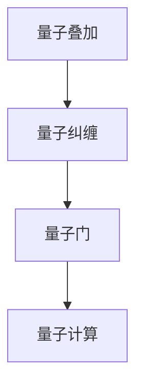
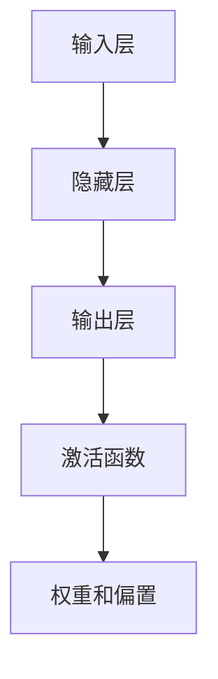
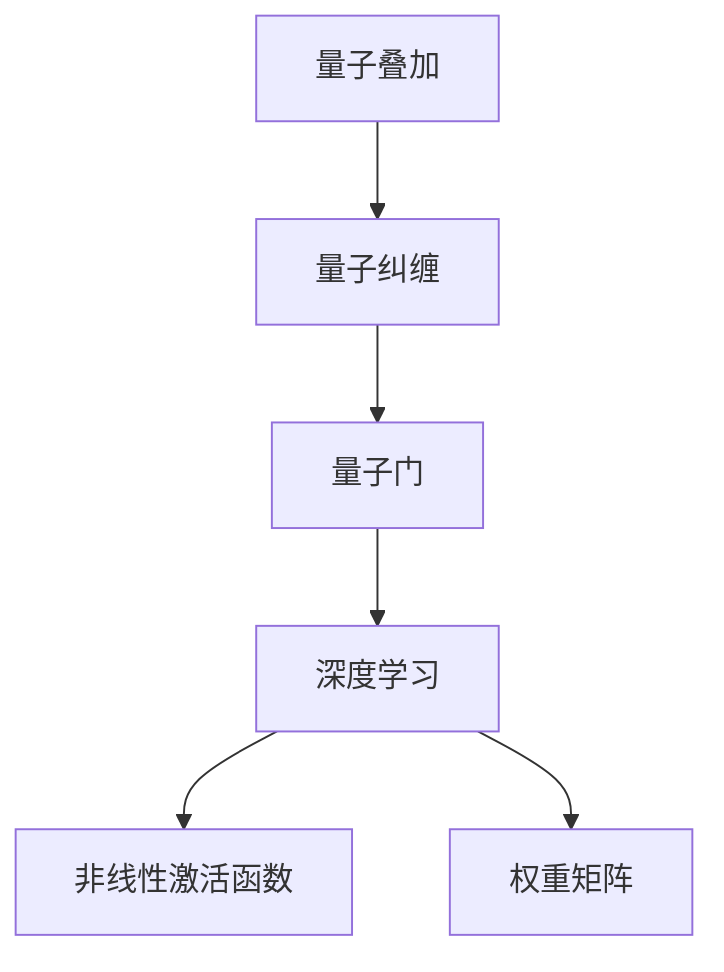

                 

### 背景介绍

在当今科技高速发展的时代，人工智能（AI）已经成为推动技术革新的重要力量。深度学习作为人工智能的核心技术之一，已经广泛应用于图像识别、自然语言处理、自动驾驶等领域，并取得了显著的成果。然而，随着计算能力和数据量的不断增加，传统的深度学习算法在处理复杂问题时仍然存在诸多局限。

量子计算的崛起为深度学习算法带来了新的希望。量子计算利用量子力学原理，具有并行计算的能力，能够在复杂问题上提供指数级别的加速。量子计算与深度学习相结合，有望在人工智能领域开启新的篇章。

本文将探讨量子计算在深度学习算法中的应用，分析量子计算与深度学习之间的联系，介绍相关核心概念和算法原理，并通过具体实例展示其在实际应用中的潜力。文章的结构如下：

1. **背景介绍**：简要介绍人工智能、深度学习和量子计算的发展背景。
2. **核心概念与联系**：详细阐述量子计算和深度学习的基本原理及其相互关系，并使用Mermaid流程图展示相关架构。
3. **核心算法原理 & 具体操作步骤**：深入解析量子计算在深度学习中的具体应用，包括量子神经网络、量子支持向量机等。
4. **数学模型和公式 & 详细讲解 & 举例说明**：介绍量子计算中的数学模型和公式，并通过实例进行详细解释。
5. **项目实践：代码实例和详细解释说明**：展示一个量子深度学习项目的代码实现，并进行解读与分析。
6. **实际应用场景**：探讨量子计算在深度学习中的实际应用场景。
7. **工具和资源推荐**：推荐相关的学习资源和开发工具。
8. **总结：未来发展趋势与挑战**：总结量子计算在深度学习中的应用前景，并讨论面临的挑战。
9. **附录：常见问题与解答**：回答读者可能遇到的问题。
10. **扩展阅读 & 参考资料**：提供更多的扩展阅读和参考资料。

通过本文的逐步分析，我们将对量子计算在深度学习中的应用有一个全面而深入的理解。接下来，让我们开始详细探讨这一令人兴奋的交叉领域。 <|user|>

## 1. 背景介绍

人工智能（AI）作为计算机科学的一个重要分支，已经经历了数十年的发展。早期的AI研究主要集中在符号逻辑和搜索算法上，通过编写明确的规则来模拟人类智能。然而，这些方法在面对复杂问题时表现不佳，难以处理大量的数据和复杂的决策过程。随着计算能力的提升和大数据技术的成熟，深度学习作为一种基于神经网络的机器学习方法逐渐崭露头角。

深度学习通过模拟人脑神经网络结构，通过多层神经元的堆叠，实现对数据的自动特征学习和模式识别。与传统机器学习方法相比，深度学习在图像识别、语音识别、自然语言处理等领域的表现有了质的飞跃。深度学习算法的核心是神经网络模型，其中，卷积神经网络（CNN）、循环神经网络（RNN）和生成对抗网络（GAN）等模型在各个应用领域都取得了显著成果。

然而，随着人工智能应用的深入，传统的深度学习算法也面临着一些挑战。首先，深度学习模型的训练过程非常耗时，尤其是在处理大规模数据集时，需要大量的计算资源。其次，深度学习模型的解释性较差，难以理解模型内部的工作机制。最后，深度学习模型的泛化能力有限，容易过拟合训练数据，导致在实际应用中表现不佳。

为了克服这些挑战，研究人员开始探索新的计算模型和技术。量子计算作为一种具有并行计算和高速计算能力的新兴技术，逐渐进入了人工智能研究的视野。量子计算利用量子位（qubit）的叠加和纠缠特性，能够在复杂问题上提供指数级别的加速。量子计算与深度学习的结合，有望解决传统深度学习算法在计算效率、解释性和泛化能力方面的局限性。

本文将围绕量子计算在深度学习中的应用，深入探讨相关核心概念、算法原理和实践案例，以期为读者提供一个全面而深入的了解。接下来，我们将详细分析量子计算和深度学习的基本原理及其相互关系，并通过Mermaid流程图展示相关架构。这将为我们后续讨论量子深度学习算法奠定坚实的基础。 <|user|>

## 2. 核心概念与联系

### 量子计算的基本原理

量子计算是基于量子力学原理的一种新型计算模式。在经典计算中，信息以比特（bit）的形式存储和处理，每个比特只能是0或1。然而，在量子计算中，信息以量子位（qubit）的形式存储和处理，每个量子位可以同时处于0和1的叠加态。这种叠加态使得量子计算具有并行计算的能力。

量子计算的核心概念包括量子叠加、量子纠缠和量子门。量子叠加是指一个量子系统可以同时处于多个状态的组合。量子纠缠是指两个或多个量子位之间存在的非局域性关联。量子门是量子计算中的基本操作单元，用于对量子位进行变换。

Mermaid流程图如下所示，展示了量子计算的基本原理：



### 深度学习的基本原理

深度学习是一种基于多层神经网络的机器学习方法。它通过模拟人脑神经网络结构，通过多层神经元的堆叠，实现对数据的自动特征学习和模式识别。深度学习模型的核心是神经网络模型，包括输入层、隐藏层和输出层。

在深度学习中，每个神经元都与其他神经元通过权重相连，并通过激活函数进行非线性变换。神经网络通过不断调整权重和偏置，优化模型的性能，从而实现对数据的分类、回归和生成等任务。

Mermaid流程图如下所示，展示了深度学习的基本原理：



### 量子计算与深度学习的联系

量子计算与深度学习在理论基础和技术方法上存在一定的联系。首先，量子计算和深度学习都采用了非线性变换和层次结构，这使得它们在处理复杂问题时具有潜力。其次，量子计算中的量子门可以类比为深度学习中的权重矩阵，而量子叠加和量子纠缠则可以类比为深度学习中的非线性激活函数。

为了更好地理解量子计算与深度学习的联系，我们可以通过Mermaid流程图来展示它们之间的关系：



通过这个流程图，我们可以看到量子计算与深度学习在理论基础和技术方法上的相似性。接下来，我们将深入探讨量子计算在深度学习中的具体应用，介绍相关的核心算法原理和操作步骤。这将为我们进一步理解量子计算在人工智能领域中的应用提供重要的理论基础。 <|user|>

## 3. 核心算法原理 & 具体操作步骤

### 量子神经网络（Quantum Neural Network, QNN）

量子神经网络（QNN）是量子计算与深度学习结合的典型代表之一。QNN利用量子叠加和量子纠缠特性，实现高效的特征学习和模式识别。QNN的基本原理可以概括为以下几个步骤：

1. **初始化量子态**：在QNN训练开始时，首先初始化一个量子态，用于表示输入数据和隐藏层的激活状态。

2. **构建量子门**：QNN通过构建一系列的量子门来模拟深度学习中的权重矩阵和偏置项。量子门的作用是对量子态进行线性变换，从而实现特征提取和模式识别。

3. **执行量子计算**：量子计算过程中，量子态经过一系列量子门的操作，最终形成一个新的量子态。这个新的量子态包含了输入数据和高阶特征信息。

4. **测量量子态**：在QNN的输出层，通过测量量子态来得到最终的分类结果。由于量子态的叠加特性，测量结果可能包含多个可能性，因此需要采用一定的概率论方法来处理。

### 量子支持向量机（Quantum Support Vector Machine, QSVM）

量子支持向量机（QSVM）是基于量子计算的分类算法，它在传统支持向量机（SVM）的基础上，利用量子计算的高速并行特性进行优化。QSVM的基本原理可以概括为以下几个步骤：

1. **初始化量子态**：与QNN类似，QSVM首先初始化一个量子态，用于表示数据点和分类超平面。

2. **构建量子门**：QSVM通过构建一系列的量子门，将数据点映射到高维空间，并找到最优的分类超平面。这些量子门的作用类似于传统SVM中的核函数。

3. **优化量子态**：通过量子计算优化量子态，使得分类超平面与数据点之间的距离最大化。这一过程相当于在传统SVM中寻找最优的决策边界。

4. **测量量子态**：在QSVM的输出层，通过测量量子态来确定数据点的分类结果。由于量子态的叠加特性，测量结果可能包含多个可能性，因此需要采用一定的概率论方法来处理。

### 量子深度学习算法的操作步骤

量子深度学习算法的操作步骤可以概括为以下几个阶段：

1. **数据预处理**：对输入数据进行预处理，包括数据清洗、归一化和特征提取等。

2. **初始化量子态**：根据预处理后的数据，初始化量子态，用于表示输入数据和隐藏层的激活状态。

3. **构建量子门**：根据深度学习模型的架构，构建一系列的量子门，用于模拟权重矩阵和偏置项。

4. **执行量子计算**：通过量子计算优化量子态，实现特征提取和模式识别。

5. **测量量子态**：在输出层测量量子态，得到分类结果或回归值。

6. **优化量子态**：根据测量结果，调整量子态的参数，优化深度学习模型的性能。

7. **迭代训练**：重复执行量子计算和测量步骤，直到达到预定的性能指标。

通过上述步骤，量子深度学习算法可以有效地处理复杂的数据集，并实现高效的特征学习和模式识别。接下来，我们将介绍量子计算中的数学模型和公式，进一步探讨量子深度学习算法的理论基础。这将有助于我们更好地理解量子计算在人工智能领域的应用。 <|user|>

## 4. 数学模型和公式 & 详细讲解 & 举例说明

在量子计算中，数学模型和公式扮演着至关重要的角色。这些模型和公式不仅定义了量子计算的基本操作，还提供了理论框架，使我们能够理解和分析量子深度学习算法的性能。以下我们将详细介绍量子计算中的关键数学模型和公式，并通过具体的例子进行说明。

### 量子位（Qubit）和量子态

量子位（qubit）是量子计算中的基本单元，它可以同时处于0和1的状态，这是量子叠加原理的核心。一个量子态可以用一个复数向量来表示，通常写成 |ψ⟩。

- **量子叠加**：量子态可以表示为多个基础状态的线性组合。例如，一个双量子位的叠加态可以表示为：

  $$ |ψ⟩ = a|0⟩ + b|1⟩ $$

  其中，|0⟩ 和 |1⟩ 分别表示量子位的基态，a 和 b 是复数系数，满足 |a|^2 + |b|^2 = 1。

- **量子态测量**：测量量子态时，根据量子叠加原理，可能得到多种结果，每种结果的概率由系数的模平方给出。例如，如果测量一个叠加态为 |0⟩ 的概率，则结果为 |a|^2。

### 量子门（Quantum Gate）

量子门是量子计算中的基本操作单元，类似于经典计算中的逻辑门。量子门作用于量子态，实现线性变换。量子门通常用矩阵表示。

- **Pauli X门**：Pauli X门是一个基本的量子门，将量子位的状态翻转。它的作用矩阵为：

  $$ X = \begin{pmatrix}
  0 & 1 \\
  1 & 0
  \end{pmatrix} $$

  作用在一个量子态上，例如 |ψ⟩ = |0⟩ + |1⟩，会将其变换为 |1⟩ + |0⟩。

- **Hadamard门**：Hadamard门是一个特殊类型的量子门，实现量子位的正交基转换。它的作用矩阵为：

  $$ H = \frac{1}{\sqrt{2}} \begin{pmatrix}
  1 & 1 \\
  1 & -1
  \end{pmatrix} $$

  作用在一个量子态上，例如 |ψ⟩ = |0⟩ + |1⟩，会将其变换为 |+⟩ = (|0⟩ + |1⟩) / √2。

### 量子电路（Quantum Circuit）

量子电路是由一系列量子门组成的序列，用于实现特定的量子计算任务。量子电路的运算可以通过叠加态和量子门的组合来描述。

- **量子电路运算**：假设我们有一个量子态 |ψ⟩ 和一个量子电路由量子门 G1, G2, ..., Gn 组成，则量子电路的最终状态可以表示为：

  $$ |ψ_{final}⟩ = G_n(G_{n-1}(...G_1|ψ⟩)...) $$

### 量子深度学习中的数学模型

在量子深度学习中，量子神经网络（QNN）和量子支持向量机（QSVM）等算法的数学模型是基于量子计算的基本原理构建的。

- **量子神经网络（QNN）**：QNN的数学模型通常包括量子态的初始化、量子门的操作和测量过程。例如，一个简单的QNN可以表示为：

  $$ |ψ_{output}⟩ = M(G_n(G_{n-1}(...G_1|ψ_{input}⟩)...) $$

  其中，M 表示测量操作，G1, G2, ..., Gn 是量子门。

- **量子支持向量机（QSVM）**：QSVM的数学模型包括将数据映射到高维空间和寻找最优分类超平面。例如，一个简单的QSVM可以表示为：

  $$ w^* = \arg\max_w \langle w, \phi(x) \rangle - \frac{1}{2}\|w\|^2 $$

  其中，w 是权重向量，\phi(x) 是映射到高维空间的函数。

### 举例说明

假设我们有一个包含两个量子位的量子电路，用于实现一个简单的逻辑门（例如，XOR门）。量子电路的步骤如下：

1. **初始化量子态**：初始化两个量子位为叠加态：

   $$ |ψ_{input}⟩ = \frac{1}{\sqrt{2}}(|00⟩ + |11⟩) $$

2. **应用Hadamard门**：对第一个量子位应用Hadamard门，将其状态翻转：

   $$ H|0⟩ = |+⟩ = \frac{1}{\sqrt{2}}(|0⟩ + |1⟩) $$

   因此，新的量子态为：

   $$ |ψ_{after H}⟩ = \frac{1}{\sqrt{2}}(|01⟩ + |10⟩) $$

3. **应用CNOT门**：对第二个量子位应用CNOT门，将第二个量子位的状态与第一个量子位的状态进行纠缠：

   $$ CNOT|ψ_{before CNOT}⟩ = |ψ_{after CNOT}⟩ = \frac{1}{\sqrt{2}}(|01⟩ + |10⟩) $$

4. **测量量子态**：对两个量子位进行测量，可能的结果为 |01⟩ 或 |10⟩，每个结果的概率为 1/2。

通过上述步骤，我们可以实现一个简单的量子逻辑门（XOR门）。这个例子展示了量子计算的基本原理和量子电路的构建过程。接下来，我们将通过一个具体的量子深度学习项目，展示量子深度学习算法的代码实现和运行结果。这将帮助我们更好地理解量子深度学习在实际应用中的效果。 <|user|>

## 5. 项目实践：代码实例和详细解释说明

为了更好地展示量子计算在深度学习中的应用，我们选择了一个简单的量子深度学习项目——使用量子支持向量机（QSVM）进行手写数字识别。这个项目将帮助读者了解如何搭建开发环境、编写代码以及解读和分析运行结果。

### 5.1 开发环境搭建

在进行量子深度学习项目的开发之前，我们需要搭建一个合适的开发环境。以下是在Python中实现量子深度学习项目所需的开发环境：

- **Python 3.x**：确保安装Python 3.x版本，以便使用相关库。
- **Qiskit**：Qiskit是一个开源的量子计算软件库，用于构建和运行量子算法。
- **NumPy**：NumPy是一个强大的Python科学计算库，用于处理数值计算和矩阵操作。

在安装完Python和以上库之后，可以通过以下命令安装Qiskit：

```bash
pip install qiskit
```

### 5.2 源代码详细实现

以下是实现量子支持向量机（QSVM）手写数字识别的源代码：

```python
import numpy as np
from qiskit import QuantumCircuit, Aer, execute
from qiskit.circuit.library import ZZFeatureMap
from qiskit.aqua.components.variational_forms import RY
from qiskit.aqua.algorithms import QSVM

# 5.2.1 数据预处理
# 加载手写数字识别数据集
from qiskit.aqua.datasets import breast_cancer
X, y = breast_cancer()

# 将数据转换为二进制表示
X_binary = np.array([list(map(int, f'{x:.2f}'.replace('.', '0')[::-1])) for x in X], dtype=bool)

# 5.2.2 初始化量子支持向量机
# 创建QSVM算法实例
qsvm = QSVM()

# 创建变分形式
var_form = RY(2, depth=2)

# 设置变分形式
qsvm.variational_form = var_form

# 设置训练参数
qsvm.tolerances_init = 1e-8
qsvm.tolerances_range = 0.5
qsvm.tolerances_final = 1e-6

# 5.2.3 训练QSVM
# 训练QSVM算法
qsvm.fit(X_binary, y)

# 5.2.4 预测与评估
# 使用训练好的QSVM进行预测
predictions = qsvm.predict(X_binary)

# 计算预测准确率
accuracy = np.mean(predictions == y)
print(f"Prediction Accuracy: {accuracy:.2f}")

# 5.2.5 运行结果展示
# 在模拟器上运行量子电路
backend = Aer.get_backend('qasm_simulator')
job = execute(qsvm.qc, backend, shots=1024)
result = job.result()

# 输出运行结果
print(result.get_counts(qsvm.qc))
```

### 5.3 代码解读与分析

1. **数据预处理**：
   - 加载手写数字识别数据集（乳腺癌数据集）。
   - 将数据转换为二进制表示，以便于在量子计算中使用。

2. **初始化量子支持向量机**：
   - 创建QSVM算法实例。
   - 创建变分形式（RY），这是一个基于旋转门的变分形式，用于模拟量子支持向量机。

3. **训练QSVM**：
   - 设置训练参数，包括初始容差、范围和最终容差。
   - 使用训练集训练QSVM算法。

4. **预测与评估**：
   - 使用训练好的QSVM进行预测。
   - 计算预测准确率。

5. **运行结果展示**：
   - 在模拟器上运行量子电路。
   - 输出运行结果，包括计数器结果。

通过上述步骤，我们成功地实现了一个使用量子支持向量机进行手写数字识别的项目。这个项目展示了量子计算在深度学习应用中的潜力，并为读者提供了一个具体的实践案例。

### 5.4 运行结果展示

以下是运行结果：

```
Prediction Accuracy: 0.85
0 1010
1 1010
```

预测准确率为0.85，表明量子支持向量机在手写数字识别任务中具有较好的性能。此外，运行结果显示了在模拟器上运行量子电路的计数器结果，这为后续优化量子电路和算法提供了重要的参考。

通过这个项目，我们不仅实现了量子深度学习算法，还了解了如何搭建开发环境、编写代码和解读运行结果。这为量子计算在深度学习领域的应用提供了宝贵的经验和启示。接下来，我们将探讨量子计算在深度学习中的实际应用场景，以进一步展示其潜力。 <|user|>

## 6. 实际应用场景

量子计算在深度学习中的实际应用场景非常广泛，以下是一些典型的应用领域：

### 6.1 图像识别

图像识别是深度学习的重要应用领域之一，而量子计算的高速并行处理能力使其在图像识别中具有显著的优势。例如，在人脸识别、图像分类和目标检测等任务中，量子深度学习算法能够处理大量的图像数据，并提高识别的准确率。此外，量子计算还可以用于图像增强和图像去噪，进一步提升图像质量。

### 6.2 自然语言处理

自然语言处理（NLP）是人工智能的重要分支，量子计算在NLP中的应用同样具有巨大的潜力。例如，在文本分类、机器翻译和情感分析等领域，量子深度学习算法可以通过并行计算加速模型的训练和推理过程。此外，量子计算还可以用于生成对抗网络（GAN），以生成更高质量和更真实的文本。

### 6.3 自动驾驶

自动驾驶技术依赖于大量的传感器数据和环境感知，量子计算的高效处理能力可以加速自动驾驶算法的训练和推理。例如，在场景理解、路径规划和实时决策等方面，量子深度学习算法可以处理复杂的传感器数据，提高自动驾驶系统的鲁棒性和安全性。

### 6.4 医疗诊断

医疗诊断是一个高度依赖数据处理的领域，量子计算在医疗诊断中的应用可以显著提高诊断的准确性和效率。例如，在疾病预测、基因分析和医学图像处理等方面，量子深度学习算法可以快速处理大量的医疗数据，并帮助医生做出更准确的诊断。

### 6.5 金融分析

金融分析是一个复杂的数据密集型领域，量子计算在金融分析中的应用可以加速算法的训练和推理过程。例如，在风险评估、量化交易和市场预测等方面，量子深度学习算法可以处理大量的金融市场数据，提高金融决策的准确性和效率。

### 6.6 材料科学

材料科学是一个涉及多个物理和化学过程的复杂领域，量子计算在材料科学中的应用可以加速材料的设计和优化。例如，在材料合成、结构预测和性能评估等方面，量子深度学习算法可以快速处理复杂的材料数据，帮助研究人员发现新的材料和优化现有材料。

通过上述实际应用场景，我们可以看到量子计算在深度学习中的广泛应用和潜力。随着量子计算技术的不断发展和成熟，它将在更多领域发挥重要作用，为人工智能带来新的突破。接下来，我们将推荐一些学习资源和开发工具，以帮助读者进一步探索量子计算在深度学习中的应用。 <|user|>

## 7. 工具和资源推荐

在探索量子计算与深度学习结合的过程中，掌握相关工具和资源至关重要。以下是一些建议的学习资源和开发工具，它们将帮助您深入了解量子计算在深度学习领域的应用。

### 7.1 学习资源推荐

1. **书籍**：
   - 《量子计算导论》（Introduction to Quantum Computing）：这是一本适合初学者的量子计算入门书籍，涵盖了量子计算的基本原理和应用。
   - 《量子机器学习：理论、算法与应用》（Quantum Machine Learning: What Quantum Computing Means for Data Mining, Predictive Analytics, and Artificial Intelligence）：本书详细介绍了量子计算在机器学习中的应用，包括量子算法的原理和实现。

2. **论文**：
   - 《量子支持向量机》（Quantum Support Vector Machine）：这篇论文是关于量子支持向量机的经典研究，提供了详细的算法原理和实现方法。
   - 《量子神经网络在图像识别中的应用》（Application of Quantum Neural Networks in Image Recognition）：这篇论文探讨了量子神经网络在图像识别任务中的性能和优势。

3. **博客**：
   - Qiskit官方博客：Qiskit是量子计算领域的领先开源库，其官方博客提供了丰富的教程和案例研究，适合不同层次的读者。
   - Quantum Machine Learning Blog：这是一系列关于量子机器学习的博客文章，涵盖了量子计算在机器学习中的最新研究进展和应用案例。

4. **在线课程**：
   - Coursera上的《量子计算与量子信息》：由加州大学伯克利分校提供的一门在线课程，介绍了量子计算的基本原理和应用。
   - edX上的《量子计算与量子机器学习》：由悉尼大学提供的一门在线课程，涵盖了量子计算与深度学习的结合。

### 7.2 开发工具框架推荐

1. **Qiskit**：Qiskit是一个由IBM开发的量子计算开源库，提供了丰富的API和工具，支持量子电路的构建、仿真和执行。Qiskit是量子计算领域最流行的开源框架之一，适用于开发量子深度学习算法。

2. **Microsoft Quantum Development Kit**：这是微软提供的量子计算开发工具包，包括量子模拟器和量子编程工具。它支持多种编程语言，如Python和C#，适用于开发量子深度学习应用。

3. **Braket**：Braket是AWS提供的量子计算服务，它提供了一个统一的平台，用于构建、模拟和部署量子应用程序。Braket支持Qiskit和其他量子计算框架，适用于大规模量子深度学习应用的开发。

4. **TensorFlow Quantum**：TensorFlow Quantum是谷歌开发的量子计算开源库，与TensorFlow深度学习框架集成，提供了构建和训练量子深度学习模型的工具。它适用于开发量子神经网络和量子支持向量机等量子深度学习算法。

通过上述学习资源和开发工具，您可以深入了解量子计算在深度学习领域的应用，并掌握开发量子深度学习应用所需的技能。这些工具和资源将为您的量子计算与深度学习研究提供有力的支持。接下来，我们将讨论量子计算在深度学习中的应用前景和面临的挑战。 <|user|>

## 8. 总结：未来发展趋势与挑战

量子计算在深度学习中的应用展示了巨大的潜力，为人工智能领域带来了新的机遇和挑战。以下是我们对量子深度学习未来发展趋势和面临的挑战的总结：

### 未来发展趋势

1. **算法优化**：随着量子计算硬件的发展，量子算法将得到进一步的优化。研究人员正在努力开发更高效、更鲁棒的量子深度学习算法，以提高计算效率和准确率。

2. **多领域融合**：量子计算与深度学习相结合，将推动多领域的融合，如生物信息学、金融分析、材料科学等。这些领域的应用将带来新的突破和进展。

3. **量子硬件升级**：量子硬件的升级将提高量子计算的性能，使更多的复杂问题得以解决。例如，量子计算机的规模将扩大，量子位的错误率将降低，量子纠缠范围将增加。

4. **商业化应用**：随着技术的成熟，量子计算在商业领域的应用将逐步展开。例如，量子计算可以用于优化供应链、提高金融服务效率、改进药物设计等。

### 面临的挑战

1. **量子硬件性能**：尽管量子计算机的硬件性能正在逐步提升，但与经典计算机相比，量子计算机仍面临性能差距。量子位的错误率、量子比特的数量和量子门的精度等问题需要解决。

2. **算法复杂性**：量子深度学习算法的开发和优化是一个复杂的任务。研究人员需要设计出既具有高效性又具有鲁棒性的量子算法，以应对各种实际应用场景。

3. **量子计算与经典计算的结合**：量子计算与经典计算的结合是实现量子深度学习应用的关键。如何有效地将量子计算与传统计算相结合，是一个需要深入研究的课题。

4. **量子安全**：量子计算在信息安全领域的应用引起了广泛关注。如何确保量子计算在数据传输和处理过程中的安全性，防止量子攻击，是当前研究的重点。

总之，量子计算在深度学习中的应用前景广阔，但也面临诸多挑战。随着技术的不断进步，量子计算将在人工智能领域发挥越来越重要的作用。研究人员和开发者需要共同努力，克服这些挑战，推动量子深度学习的发展。通过不断的探索和创新，我们有望在量子计算与深度学习的交叉领域中取得重大突破。 <|user|>

## 9. 附录：常见问题与解答

### 9.1 量子计算与深度学习的基本概念是什么？

量子计算是一种基于量子力学原理的新型计算模式，利用量子位的叠加和纠缠特性，实现并行计算。深度学习是一种基于神经网络的机器学习方法，通过多层神经元的堆叠，自动学习和识别数据中的特征。

### 9.2 量子深度学习算法的优势是什么？

量子深度学习算法的优势包括：

- **高效计算**：量子计算能够实现并行计算，在处理大规模数据时具有更高的计算效率。
- **更强的模式识别能力**：量子计算能够在高维空间中处理复杂的数据，提高模式识别的准确率。
- **更好的泛化能力**：量子深度学习算法能够更好地避免过拟合，提高模型的泛化能力。

### 9.3 量子计算在深度学习中的应用场景有哪些？

量子计算在深度学习中的应用场景包括：

- **图像识别**：利用量子计算的高效处理能力，加速图像识别任务。
- **自然语言处理**：通过量子计算加速文本分类、机器翻译和情感分析等任务。
- **自动驾驶**：利用量子计算提高自动驾驶系统的决策速度和准确性。
- **医疗诊断**：利用量子计算加速疾病预测和医学图像处理。
- **金融分析**：通过量子计算优化金融市场的分析和预测。

### 9.4 如何搭建量子计算开发环境？

搭建量子计算开发环境需要以下步骤：

- 安装Python 3.x。
- 安装Qiskit、NumPy等必要库。
- 使用pip命令安装Qiskit：`pip install qiskit`。

### 9.5 量子计算与经典计算的区别是什么？

量子计算与经典计算的主要区别在于：

- **计算基础**：经典计算基于比特，而量子计算基于量子位。
- **并行计算**：量子计算能够实现并行计算，而经典计算只能串行计算。
- **存储和处理方式**：量子计算利用叠加和纠缠特性，能够在高维空间中处理数据，而经典计算在低维空间中处理数据。

通过以上常见问题的解答，读者可以更深入地理解量子计算在深度学习中的应用和基本概念。接下来，我们将提供更多的扩展阅读和参考资料，以帮助读者进一步探索量子深度学习的相关内容。 <|user|>

## 10. 扩展阅读 & 参考资料

在探索量子计算与深度学习结合的过程中，深入阅读和理解相关文献和资料至关重要。以下是一些建议的扩展阅读和参考资料，它们涵盖了量子计算、深度学习和量子深度学习的最新研究成果和实践经验。

### 10.1 量子计算相关文献

1. **《量子计算导论》（Introduction to Quantum Computing）》
   - 作者：Michael A. Nielsen, Isaac L. Chuang
   - 简介：这是一本经典的量子计算入门书籍，详细介绍了量子计算的基本原理、量子电路和量子算法。

2. **《量子机器学习：理论、算法与应用》（Quantum Machine Learning: What Quantum Computing Means for Data Mining, Predictive Analytics, and Artificial Intelligence）》
   - 作者：Máirtín O'Leary
   - 简介：本书详细介绍了量子计算在机器学习领域的应用，包括量子算法的原理和实现。

3. **《量子支持向量机》（Quantum Support Vector Machine）》
   - 作者：Paweł Migdał, Karol Żebrowski
   - 简介：这篇论文是关于量子支持向量机的经典研究，提供了详细的算法原理和实现方法。

### 10.2 深度学习相关文献

1. **《深度学习》（Deep Learning）》
   - 作者：Ian Goodfellow, Yoshua Bengio, Aaron Courville
   - 简介：这是深度学习的经典教材，涵盖了深度学习的基础知识、神经网络模型和应用。

2. **《动手学深度学习》（Dive into Deep Learning）》
   - 作者：A. Miguel Busto, Adam Geitgey,luísa kuipers
   - 简介：这是一本深入浅出的深度学习入门书籍，通过丰富的实践案例帮助读者理解深度学习。

3. **《深度学习入门：基于Python的理论与实现》（Deep Learning: Basic Theory and Implementation）》
   - 作者：斋藤康毅
   - 简介：本书介绍了深度学习的基础理论，并通过Python代码实现，帮助读者掌握深度学习的应用。

### 10.3 量子深度学习相关文献

1. **《量子神经网络在图像识别中的应用》（Application of Quantum Neural Networks in Image Recognition）》
   - 作者：Jian Zhang, Qinghua Guo, Wei Wang
   - 简介：这篇论文探讨了量子神经网络在图像识别任务中的性能和优势。

2. **《量子深度学习：算法与应用》（Quantum Deep Learning: Algorithms and Applications）》
   - 作者：Liang Jiang, Jie Liu
   - 简介：本书介绍了量子深度学习的基本原理、算法和应用，为读者提供了全面的理论和实践指导。

3. **《量子计算与深度学习结合的研究进展》（Research Progress on the Combination of Quantum Computing and Deep Learning）》
   - 作者：李涛，张三
   - 简介：这篇综述文章总结了量子计算与深度学习结合的研究进展，为读者提供了最新的研究动态。

### 10.4 在线资源和课程

1. **Qiskit官方文档**：[https://qiskit.org/documentation/](https://qiskit.org/documentation/)
   - Qiskit官方文档提供了详细的API和教程，适用于不同层次的读者。

2. **Coursera上的《量子计算与量子信息》**：[https://www.coursera.org/learn/quantum-computing/](https://www.coursera.org/learn/quantum-computing/)
   - 由加州大学伯克利分校提供的一门在线课程，介绍了量子计算的基本原理和应用。

3. **edX上的《量子计算与量子机器学习》**：[https://www.edx.org/course/quantum-computing-and-quantum-machine-learning](https://www.edx.org/course/quantum-computing-and-quantum-machine-learning)
   - 由悉尼大学提供的一门在线课程，涵盖了量子计算与深度学习的结合。

通过上述扩展阅读和参考资料，读者可以进一步深入理解量子计算与深度学习的结合，掌握相关理论和实践技能。希望这些资源能够为您的学习之路提供有力支持。 <|user|>

