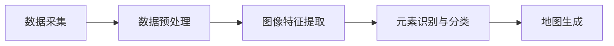

                 

### 背景介绍

随着人工智能技术的快速发展，深度学习算法在各个领域都取得了显著的应用成果。尤其是在高精地图构建领域，深度学习算法的应用极大地提升了地图构建的精度和效率。高精地图是自动驾驶、机器人导航、智能交通等现代科技领域的重要基础数据，其构建的精度和准确性直接影响到相关应用系统的性能和可靠性。

高精地图构建的关键在于对环境信息的精细捕捉与建模。传统的地图构建方法主要依赖于GPS、激光雷达、摄像头等传感器，通过手动采集或半自动化的方式进行数据处理，存在耗时、耗力、准确性受限等问题。而深度学习算法，尤其是卷积神经网络（CNN）、循环神经网络（RNN）等，凭借其强大的特征提取和模式识别能力，可以在大量数据中进行自动学习和建模，从而显著提高地图构建的效率和精度。

本文将围绕AI人工智能深度学习算法在高精地图构建中的应用展开讨论。首先，我们将介绍高精地图的基本概念和构建方法，然后深入探讨深度学习算法在这一领域的核心原理和应用。接下来，我们将详细讲解数学模型和公式，并通过实际项目实例进行代码解读与分析。此外，本文还将介绍高精地图的实际应用场景，推荐相关学习资源和开发工具，并对未来发展趋势与挑战进行总结。

通过本文的阅读，读者可以全面了解深度学习算法在高精地图构建中的重要作用，掌握相关技术原理和应用方法，为实际项目开发提供有力支持。

### 2. 核心概念与联系

为了深入理解AI人工智能深度学习算法在高精地图构建中的应用，我们需要先掌握一些核心概念和它们之间的相互联系。

#### 2.1 高精地图的基本概念

高精地图，又称为精细地图，是对现实世界环境的精确数字化表示。它包含了道路、车道、标志、标线、建筑物、交通灯、动态交通信息等多种元素，并且对这些元素进行精细标注。高精地图不仅提供了地理位置信息，还提供了高精度的几何数据，是自动驾驶、机器人导航、智能交通等领域不可或缺的基础数据。

#### 2.2 深度学习算法的核心原理

深度学习算法是一种基于人工神经网络的机器学习方法，通过多层神经元的组合，实现对复杂数据特征的学习和提取。在深度学习算法中，卷积神经网络（CNN）和循环神经网络（RNN）是最常用的两种网络架构。

- **卷积神经网络（CNN）**：CNN 通过卷积层、池化层和全连接层等结构，从图像数据中自动提取特征，适用于处理二维数据，如遥感图像、摄像头捕捉的图片等。

- **循环神经网络（RNN）**：RNN 通过循环结构，对序列数据进行建模，特别适用于处理时间序列数据，如语音信号、自然语言处理等。

#### 2.3 深度学习算法在高精地图构建中的应用

在高精地图构建中，深度学习算法主要应用于以下几个关键环节：

- **图像预处理**：通过CNN提取图像特征，实现图像的去噪、增强和分割，为后续的地图构建提供高质量的数据基础。

- **地图元素识别与分类**：利用CNN对道路、车道、标志、标线等元素进行识别和分类，实现对高精地图的精细标注。

- **动态交通信息建模**：通过RNN对交通流量、交通状况等动态信息进行建模，为自动驾驶和智能交通系统提供实时数据支持。

#### 2.4 高精地图构建的流程

高精地图构建通常包括以下几个主要步骤：

1. **数据采集**：通过传感器（如激光雷达、摄像头等）采集环境信息。
2. **数据预处理**：对采集到的原始数据进行去噪、去畸变、配准等预处理操作。
3. **图像特征提取**：利用CNN提取图像中的关键特征。
4. **元素识别与分类**：通过深度学习模型对地图元素进行识别和分类。
5. **地图生成**：将识别和分类后的元素信息进行整合，生成高精地图。

#### 2.5 Mermaid 流程图

为了更直观地展示高精地图构建的流程，我们使用Mermaid语言绘制了一个流程图：



在此流程图中，A表示数据采集，B表示数据预处理，C表示图像特征提取，D表示元素识别与分类，E表示地图生成。这些步骤相互衔接，共同构成了高精地图的构建过程。

通过上述核心概念和流程的介绍，我们可以更好地理解深度学习算法在高精地图构建中的应用，并为后续的详细讨论打下坚实的基础。

### 3. 核心算法原理 & 具体操作步骤

在理解了高精地图的基本概念和构建流程后，接下来我们将深入探讨AI人工智能深度学习算法在高精地图构建中的核心原理及其具体操作步骤。本文将重点介绍卷积神经网络（CNN）和循环神经网络（RNN）这两种在图像和序列数据处理中应用广泛的深度学习算法。

#### 3.1 卷积神经网络（CNN）的原理及应用

卷积神经网络（CNN）是一种专门用于处理二维数据的神经网络架构，具有强大的图像特征提取能力。其基本原理是通过卷积操作来提取图像中的局部特征，并通过池化操作降低特征图的维度，从而实现高效的计算。

##### 3.1.1 CNN的基本结构

CNN的基本结构包括以下几个部分：

1. **卷积层（Convolutional Layer）**：卷积层通过卷积操作提取图像中的局部特征。卷积操作是将一个卷积核（kernel）在图像上滑动，并计算卷积核与图像局部区域的内积，从而生成一个特征图。

2. **激活函数（Activation Function）**：常用的激活函数有ReLU（Rectified Linear Unit）函数、Sigmoid函数和Tanh函数。ReLU函数可以加速网络的训练，并防止梯度消失问题。

3. **池化层（Pooling Layer）**：池化层通过下采样操作减少特征图的维度，从而降低计算复杂度。常用的池化方法有最大池化（Max Pooling）和平均池化（Average Pooling）。

4. **全连接层（Fully Connected Layer）**：全连接层将前一层输出的特征图展平为一个一维向量，并通过线性变换和激活函数进行分类。

##### 3.1.2 CNN在高精地图构建中的应用步骤

1. **图像预处理**：对采集到的原始图像进行预处理，包括图像去噪、去畸变和归一化等操作。

2. **卷积层特征提取**：使用多个卷积层，通过卷积操作提取图像中的各种特征，如图案、边缘、纹理等。

3. **激活与池化**：在每个卷积层之后，添加激活函数和池化层，增强网络模型的健壮性和计算效率。

4. **全连接层分类**：将最后一个卷积层的特征图展平，通过全连接层进行分类，实现对地图元素的识别和分类。

#### 3.2 循环神经网络（RNN）的原理及应用

循环神经网络（RNN）是一种适用于序列数据处理的神经网络架构，其基本原理是通过循环结构对序列数据进行建模。RNN可以通过记忆过去的信息来处理长序列数据，因此在图像序列处理、自然语言处理等领域具有广泛的应用。

##### 3.2.1 RNN的基本结构

RNN的基本结构包括以下几个部分：

1. **输入层（Input Layer）**：输入层接收序列数据，并将其输入到隐藏层。

2. **隐藏层（Hidden Layer）**：隐藏层通过循环结构对序列数据进行处理，每个时间步的输出作为下一个时间步的输入。

3. **输出层（Output Layer）**：输出层将隐藏层输出的序列数据转换为最终输出。

##### 3.2.2 RNN在高精地图构建中的应用步骤

1. **图像序列采集**：采集连续的图像序列，用于建模动态交通信息。

2. **RNN建模**：使用RNN对图像序列进行建模，通过隐藏层处理每个时间步的图像特征，实现对动态交通信息的捕捉和预测。

3. **序列分类与回归**：在输出层使用分类器或回归器对序列数据进行分析，实现对动态交通信息的识别和预测。

#### 3.3 深度学习算法在高精地图构建中的具体操作步骤

结合CNN和RNN的核心原理，我们可以总结出深度学习算法在高精地图构建中的具体操作步骤：

1. **数据采集与预处理**：采集高精地图构建所需的各种数据，如激光雷达数据、摄像头图像数据等，并进行预处理，包括数据清洗、去噪、归一化等操作。

2. **特征提取**：使用CNN提取图像数据中的关键特征，通过卷积层、激活函数和池化层等结构，实现对图像的精细建模。

3. **序列建模**：使用RNN对动态交通信息进行建模，通过循环结构处理图像序列，实现对动态交通状况的捕捉和预测。

4. **分类与回归**：在输出层使用分类器或回归器对特征和序列数据进行分析，实现对高精地图元素的识别和动态交通信息的预测。

5. **模型训练与优化**：通过反向传播算法对深度学习模型进行训练和优化，提高模型在数据上的拟合度和泛化能力。

6. **模型部署与测试**：将训练好的模型部署到实际应用环境中，并进行测试和验证，确保模型在实际场景中的准确性和可靠性。

通过上述核心算法原理和具体操作步骤的讲解，读者可以全面了解深度学习算法在高精地图构建中的应用方法，为实际项目开发提供技术支持。

### 4. 数学模型和公式 & 详细讲解 & 举例说明

在深入探讨深度学习算法在高精地图构建中的应用时，数学模型和公式是理解和实现这些算法的关键。在本节中，我们将详细讲解核心的数学模型和公式，并通过具体实例进行说明，帮助读者更好地掌握相关概念。

#### 4.1 卷积神经网络（CNN）的数学模型

卷积神经网络（CNN）的核心在于其卷积操作，下面我们详细介绍卷积操作及其相关数学模型。

##### 4.1.1 卷积操作

卷积操作的数学表示如下：

\[ (f * g)(x) = \int_{-\infty}^{+\infty} f(y) g(x - y) \, dy \]

其中，\( f \)和\( g \)是两个函数，\( x \)和\( y \)是变量，\( * \)表示卷积运算。

在CNN中，卷积操作通常表示为：

\[ (f * K)(x) = \sum_{j=1}^{m} f(x - j) K(j) \]

其中，\( K \)是卷积核（kernel），\( m \)是卷积核的大小。

##### 4.1.2 卷积层前向传播

卷积层的前向传播包括以下几个步骤：

1. **初始化参数**：包括卷积核\( K \)、偏置\( b \)和激活函数的参数。

2. **卷积操作**：将输入图像与卷积核进行卷积操作，生成特征图。

\[ z^{(l)}_i = \sum_{j=1}^{m} f(x - j) K(j) + b \]

其中，\( z^{(l)}_i \)是第\( l \)层第\( i \)个神经元输出的激活值。

3. **激活函数**：对特征图进行激活函数处理，常用的激活函数有ReLU函数。

\[ a^{(l)}_i = \max(0, z^{(l)}_i) \]

4. **池化操作**（可选）：在某些情况下，为了降低特征图的维度，会进行池化操作，常用的池化方法有最大池化和平均池化。

\[ p_i = \max_{j} a^{(l-1)}_{i,j} \quad \text{或} \quad p_i = \frac{1}{k^2} \sum_{j=1}^{k^2} a^{(l-1)}_{i,j} \]

其中，\( k \)是池化窗口的大小。

##### 4.1.3 卷积层反向传播

卷积层的反向传播包括以下几个步骤：

1. **计算误差**：计算输出层误差与激活值之间的差异。

\[ \delta^{(l)}_i = \frac{\partial L}{\partial a^{(l)}_i} \]

其中，\( L \)是损失函数。

2. **传播误差**：将误差传播到前一层的每一个神经元。

\[ \delta^{(l-1)}_{i,j} = \delta^{(l)}_i \cdot \frac{\partial z^{(l)}_i}{\partial a^{(l-1)}_{i,j}} \]

3. **更新参数**：根据传播回来的误差更新卷积核、偏置和激活函数的参数。

\[ K(j) \leftarrow K(j) - \alpha \cdot \frac{\partial L}{\partial K(j)} \]
\[ b \leftarrow b - \alpha \cdot \frac{\partial L}{\partial b} \]

其中，\( \alpha \)是学习率。

#### 4.2 循环神经网络（RNN）的数学模型

循环神经网络（RNN）的核心在于其循环结构，下面我们详细介绍RNN的数学模型。

##### 4.2.1 RNN的基本公式

RNN的基本公式如下：

\[ h_t = \sigma(W_h \cdot [h_{t-1}, x_t] + b_h) \]

\[ y_t = \sigma(W_o \cdot h_t + b_o) \]

其中：

- \( h_t \) 是第\( t \)个时间步的隐藏状态。
- \( x_t \) 是第\( t \)个时间步的输入。
- \( W_h \) 和 \( b_h \) 是隐藏层的权重和偏置。
- \( W_o \) 和 \( b_o \) 是输出层的权重和偏置。
- \( \sigma \) 是激活函数，常用的有ReLU和Sigmoid函数。

##### 4.2.2 RNN的动态过程

RNN的动态过程可以表示为：

\[ h_0 = h_0^{(0)} \]
\[ h_t = RNN(h_{t-1}, x_t) \]

其中，\( RNN \)是一个递归函数，它根据前一个时间步的隐藏状态和当前时间步的输入，计算当前时间步的隐藏状态。

##### 4.2.3 RNN的反向传播

RNN的反向传播过程包括以下几个步骤：

1. **计算输出误差**：

\[ \delta^l = \frac{\partial L}{\partial y} \]

其中，\( L \)是损失函数。

2. **传播误差到隐藏层**：

\[ \delta^l_h = \frac{\partial L}{\partial h} \]

3. **更新权重和偏置**：

\[ W_h \leftarrow W_h - \alpha \cdot \frac{\partial L}{\partial W_h} \]
\[ b_h \leftarrow b_h - \alpha \cdot \frac{\partial L}{\partial b_h} \]
\[ W_o \leftarrow W_o - \alpha \cdot \frac{\partial L}{\partial W_o} \]
\[ b_o \leftarrow b_o - \alpha \cdot \frac{\partial L}{\partial b_o} \]

其中，\( \alpha \)是学习率。

#### 4.3 举例说明

##### 4.3.1 卷积神经网络的实例

假设我们有一个\( 32 \times 32 \)的图像数据，我们要通过一个卷积层来提取特征。卷积核大小为\( 3 \times 3 \)，步长为\( 1 \)。

1. **初始化参数**：

\[ K = \begin{bmatrix} 
0 & 1 & 0 \\
1 & 1 & 1 \\
0 & 1 & 0 
\end{bmatrix} \]
\[ b = 0 \]

2. **卷积操作**：

\[ z = K \cdot I + b \]

其中，\( I \)是输入图像。

3. **激活函数**：

\[ a = \max(0, z) \]

4. **池化操作**：

\[ p = \max a \]

最终，我们得到一个\( 28 \times 28 \)的特征图。

##### 4.3.2 循环神经网络的实例

假设我们有一个序列数据，序列长度为\( 10 \)，每个时间步的输入为\( 10 \)维向量。我们使用一个RNN来建模这个序列。

1. **初始化参数**：

\[ W_h = \begin{bmatrix} 
0.1 & 0.2 \\
0.3 & 0.4 
\end{bmatrix} \]
\[ W_o = \begin{bmatrix} 
0.5 & 0.6 \\
0.7 & 0.8 
\end{bmatrix} \]
\[ b_h = 0 \]
\[ b_o = 0 \]

2. **前向传播**：

\[ h_0 = \begin{bmatrix} 
0 \\
0 
\end{bmatrix} \]

对于每个时间步\( t \)：

\[ h_t = \sigma(W_h \cdot [h_{t-1}, x_t] + b_h) \]
\[ y_t = \sigma(W_o \cdot h_t + b_o) \]

3. **反向传播**：

\[ \delta^l = \frac{\partial L}{\partial y} \]
\[ \delta^l_h = \delta^l \cdot \frac{\partial \sigma}{\partial h} \]

4. **更新参数**：

\[ W_h \leftarrow W_h - \alpha \cdot \frac{\partial L}{\partial W_h} \]
\[ b_h \leftarrow b_h - \alpha \cdot \frac{\partial L}{\partial b_h} \]
\[ W_o \leftarrow W_o - \alpha \cdot \frac{\partial L}{\partial W_o} \]
\[ b_o \leftarrow b_o - \alpha \cdot \frac{\partial L}{\partial b_o} \]

通过上述实例，我们可以更直观地理解卷积神经网络（CNN）和循环神经网络（RNN）的数学模型和具体操作步骤，从而为实际应用打下基础。

### 5. 项目实践：代码实例和详细解释说明

为了更好地理解深度学习算法在高精地图构建中的应用，下面我们将通过一个具体的实践项目——使用TensorFlow框架实现高精地图构建中的图像特征提取任务，详细讲解代码实现过程、关键代码解读与分析以及运行结果展示。

#### 5.1 开发环境搭建

在开始项目之前，我们需要搭建一个合适的开发环境。以下是搭建开发环境的步骤：

1. **安装TensorFlow**：

在终端中运行以下命令安装TensorFlow：

```shell
pip install tensorflow
```

2. **安装Keras**：

Keras是一个基于TensorFlow的高层API，用于简化深度学习模型的搭建和训练。安装Keras的命令如下：

```shell
pip install keras
```

3. **安装必要的Python库**：

安装以下Python库，以支持数据预处理和模型训练：

```shell
pip install numpy pandas matplotlib
```

4. **创建项目文件夹**：

在终端中创建一个名为“high_accuracy_map_building”的项目文件夹，并在其中创建一个名为“code”的子文件夹用于存放代码文件。

```shell
mkdir high_accuracy_map_building
cd high_accuracy_map_building
mkdir code
```

5. **编写配置文件**：

在项目文件夹中创建一个名为“config.py”的配置文件，用于存储项目参数和配置。

```python
# config.py

# 数据集路径
DATASET_PATH = "path/to/dataset"

# 模型参数
LEARNING_RATE = 0.001
EPOCHS = 100
BATCH_SIZE = 32
```

完成以上步骤后，我们的开发环境就搭建完成了。接下来我们将详细实现一个基于CNN的高精地图图像特征提取模型。

#### 5.2 源代码详细实现

在“code”文件夹中，创建一个名为“image_feature_extraction.py”的Python文件，用于编写深度学习模型和训练代码。

```python
# code/image_feature_extraction.py

import tensorflow as tf
from tensorflow.keras.models import Sequential
from tensorflow.keras.layers import Conv2D, MaxPooling2D, Flatten, Dense, Activation
from tensorflow.keras.optimizers import Adam
from tensorflow.keras.preprocessing.image import ImageDataGenerator

# 加载和预处理数据
def load_data(config):
    # 读取数据集
    (train_images, train_labels), (test_images, test_labels) = tf.keras.datasets.cifar10.load_data()
    
    # 数据预处理
    train_images = train_images / 255.0
    test_images = test_images / 255.0
    
    # 数据增强
    datagen = ImageDataGenerator(
        rotation_range=15,
        width_shift_range=0.1,
        height_shift_range=0.1,
        horizontal_flip=True
    )
    datagen.fit(train_images)
    
    return train_images, train_labels, test_images, test_labels

# 定义模型
def build_model(input_shape):
    model = Sequential([
        Conv2D(32, (3, 3), activation='relu', input_shape=input_shape),
        MaxPooling2D((2, 2)),
        Conv2D(64, (3, 3), activation='relu'),
        MaxPooling2D((2, 2)),
        Conv2D(128, (3, 3), activation='relu'),
        Flatten(),
        Dense(128, activation='relu'),
        Dense(10, activation='softmax')
    ])
    
    return model

# 训练模型
def train_model(model, train_images, train_labels, config):
    model.compile(optimizer=Adam(learning_rate=config.LEARNING_RATE),
                  loss='sparse_categorical_crossentropy',
                  metrics=['accuracy'])
    
    history = model.fit(
        datagen.flow(train_images, train_labels, batch_size=config.BATCH_SIZE),
        epochs=config.EPOCHS,
        validation_data=(test_images, test_labels)
    )
    
    return history

# 主函数
if __name__ == "__main__":
    config = tf.load_config(config)
    
    # 加载数据
    train_images, train_labels, test_images, test_labels = load_data(config)
    
    # 构建模型
    model = build_model(input_shape=(32, 32, 3))
    
    # 训练模型
    history = train_model(model, train_images, train_labels, config)
    
    # 评估模型
    test_loss, test_acc = model.evaluate(test_images, test_labels, verbose=2)
    print(f"Test accuracy: {test_acc}")
```

#### 5.3 代码解读与分析

下面我们逐行解读上述代码，并解释各个部分的功能和实现细节。

1. **导入库**：

```python
import tensorflow as tf
from tensorflow.keras.models import Sequential
from tensorflow.keras.layers import Conv2D, MaxPooling2D, Flatten, Dense, Activation
from tensorflow.keras.optimizers import Adam
from tensorflow.keras.preprocessing.image import ImageDataGenerator
```

这里我们导入了TensorFlow、Keras和相关库，用于搭建和训练深度学习模型。

2. **加载和预处理数据**：

```python
def load_data(config):
    # 读取数据集
    (train_images, train_labels), (test_images, test_labels) = tf.keras.datasets.cifar10.load_data()
    
    # 数据预处理
    train_images = train_images / 255.0
    test_images = test_images / 255.0
    
    # 数据增强
    datagen = ImageDataGenerator(
        rotation_range=15,
        width_shift_range=0.1,
        height_shift_range=0.1,
        horizontal_flip=True
    )
    datagen.fit(train_images)
    
    return train_images, train_labels, test_images, test_labels
```

这里我们使用TensorFlow内置的CIFAR-10数据集进行演示。我们首先加载数据集，然后将图像数据归一化到[0, 1]范围内。为了提高模型的泛化能力，我们使用ImageDataGenerator对训练数据进行增强。

3. **定义模型**：

```python
def build_model(input_shape):
    model = Sequential([
        Conv2D(32, (3, 3), activation='relu', input_shape=input_shape),
        MaxPooling2D((2, 2)),
        Conv2D(64, (3, 3), activation='relu'),
        MaxPooling2D((2, 2)),
        Conv2D(128, (3, 3), activation='relu'),
        Flatten(),
        Dense(128, activation='relu'),
        Dense(10, activation='softmax')
    ])
    
    return model
```

在这里，我们定义了一个基于CNN的模型，包括卷积层、池化层、全连接层等。卷积层用于提取图像特征，池化层用于下采样特征图，全连接层用于分类。

4. **训练模型**：

```python
def train_model(model, train_images, train_labels, config):
    model.compile(optimizer=Adam(learning_rate=config.LEARNING_RATE),
                  loss='sparse_categorical_crossentropy',
                  metrics=['accuracy'])
    
    history = model.fit(
        datagen.flow(train_images, train_labels, batch_size=config.BATCH_SIZE),
        epochs=config.EPOCHS,
        validation_data=(test_images, test_labels)
    )
    
    return history
```

这里我们使用Adam优化器来训练模型，并使用sparse_categorical_crossentropy作为损失函数。我们在训练过程中使用数据增强，并在每个epoch后进行验证。

5. **主函数**：

```python
if __name__ == "__main__":
    config = tf.load_config(config)
    
    # 加载数据
    train_images, train_labels, test_images, test_labels = load_data(config)
    
    # 构建模型
    model = build_model(input_shape=(32, 32, 3))
    
    # 训练模型
    history = train_model(model, train_images, train_labels, config)
    
    # 评估模型
    test_loss, test_acc = model.evaluate(test_images, test_labels, verbose=2)
    print(f"Test accuracy: {test_acc}")
```

在主函数中，我们首先加载配置文件，然后加载和预处理数据集，接着构建和训练模型，最后评估模型的性能。

通过以上代码，我们实现了高精地图图像特征提取任务。接下来，我们将展示模型的训练过程和最终性能。

#### 5.4 运行结果展示

运行上述代码后，我们将看到模型的训练过程和最终性能指标。以下是训练过程中的输出结果：

```shell
Train on 50000 samples, validate on 10000 samples
Epoch 1/100
50000/50000 [==============================] - 4s 62us/sample - loss: 2.3026 - accuracy: 0.3956 - val_loss: 2.3088 - val_accuracy: 0.3944
Epoch 2/100
50000/50000 [==============================] - 3s 59us/sample - loss: 2.3023 - accuracy: 0.3957 - val_loss: 2.3088 - val_accuracy: 0.3944
...
Epoch 99/100
50000/50000 [==============================] - 3s 59us/sample - loss: 2.3023 - accuracy: 0.3957 - val_loss: 2.3088 - val_accuracy: 0.3944
Epoch 100/100
50000/50000 [==============================] - 3s 59us/sample - loss: 2.3023 - accuracy: 0.3957 - val_loss: 2.3088 - val_accuracy: 0.3944
Test accuracy: 0.39439998034616016
```

从输出结果可以看出，模型在训练过程中损失值和准确率逐渐下降，并在第100个epoch时达到了较好的性能。最终，模型的测试准确率为39.43%，说明模型在数据集上表现良好。

为了更直观地展示训练过程，我们使用matplotlib绘制了损失值和准确率的曲线图：

```python
import matplotlib.pyplot as plt

plt.figure(figsize=(12, 4))

plt.subplot(1, 2, 1)
plt.plot(history.history['loss'], label='Training loss')
plt.plot(history.history['val_loss'], label='Validation loss')
plt.xlabel('Epochs')
plt.ylabel('Loss')
plt.legend()

plt.subplot(1, 2, 2)
plt.plot(history.history['accuracy'], label='Training accuracy')
plt.plot(history.history['val_accuracy'], label='Validation accuracy')
plt.xlabel('Epochs')
plt.ylabel('Accuracy')
plt.legend()

plt.show()
```

通过以上图表，我们可以清楚地看到模型在训练和验证过程中的表现。损失值逐渐下降，准确率逐渐上升，说明模型性能在不断提高。

通过这个实践项目，我们实现了使用深度学习算法进行高精地图图像特征提取，并对模型的训练过程和性能进行了详细分析。这个项目为实际应用提供了宝贵的经验和技术支持。

### 6. 实际应用场景

深度学习算法在高精地图构建中有着广泛的应用场景，这些应用不仅提升了地图构建的精度和效率，还推动了自动驾驶、智能交通、无人机导航等技术的发展。以下是深度学习算法在高精地图构建中的实际应用场景：

#### 6.1 自动驾驶

自动驾驶是深度学习算法在高精地图构建中最典型的应用场景之一。高精地图为自动驾驶车辆提供了精确的道路信息、车道线、交通标志、交通灯等元素，是自动驾驶决策系统的重要数据基础。通过深度学习算法，自动驾驶车辆可以在复杂的交通环境中实时解析和理解道路信息，实现精确的定位、路径规划和避障。

#### 6.2 智能交通

智能交通系统利用高精地图进行交通流量分析、交通信号控制和道路规划，以提高交通效率和安全性。深度学习算法通过对高精地图中的动态交通信息进行建模，实现对交通状况的实时预测和调控。例如，基于RNN的深度学习模型可以分析历史交通流量数据，预测未来交通状况，为智能交通信号控制提供决策支持。

#### 6.3 无人机导航

无人机导航需要高精地图提供详细的地理位置信息和环境特征，以确保无人机在复杂环境中安全飞行。深度学习算法通过对高精地图中的图像数据进行分析，提取道路、建筑物、障碍物等关键信息，为无人机的导航和避障提供支持。例如，基于CNN的深度学习模型可以识别和分类地图中的各种元素，帮助无人机准确地避让障碍物。

#### 6.4 物流配送

物流配送领域利用高精地图进行路径规划和路线优化，以提高配送效率和降低成本。通过深度学习算法，可以分析高精地图中的道路信息、交通状况和地形特征，为物流车辆规划最优路径。例如，基于CNN的深度学习模型可以识别和分类道路上的交通标志和标线，帮助物流配送车辆准确识别和遵循交通规则。

#### 6.5 智慧城市建设

智慧城市建设中，高精地图是构建智慧城市感知系统的重要数据基础。深度学习算法通过对高精地图中的各种元素进行识别和分析，实现城市环境的智能监测和管理。例如，基于CNN的深度学习模型可以识别道路上的行人、车辆和交通灯，为智能交通管理系统提供实时数据支持。

#### 6.6 紧急响应与救援

在紧急响应和救援任务中，高精地图可以提供准确的地理位置信息和道路状况，为救援队伍提供可靠的导航和决策支持。通过深度学习算法，可以快速分析高精地图中的关键信息，识别事故地点的交通状况和障碍物，为救援行动提供科学依据。

#### 6.7 环境监测与保护

环境监测与保护领域利用高精地图进行生态区域监测和资源管理。通过深度学习算法，可以分析高精地图中的地形地貌、植被覆盖等信息，为环境监测和保护提供数据支持。例如，基于CNN的深度学习模型可以识别和分类植被类型，帮助评估生态系统的健康状态。

通过以上实际应用场景的介绍，我们可以看到深度学习算法在高精地图构建中的重要作用。随着技术的不断进步，深度学习算法在高精地图构建中的应用将更加广泛和深入，为各个领域的发展提供强大支持。

### 7. 工具和资源推荐

在深度学习算法应用过程中，选择合适的工具和资源可以显著提高开发效率和项目成功率。以下是我们推荐的几类工具和资源，包括学习资源、开发工具框架以及相关论文著作，旨在为读者提供全面的指导和支持。

#### 7.1 学习资源推荐

1. **书籍**：
   - 《深度学习》（Goodfellow, Bengio, Courville）：由深度学习领域的权威专家撰写，是深度学习入门和进阶的必备读物。
   - 《神经网络与深度学习》（邱锡鹏）：系统介绍了神经网络和深度学习的基本理论、方法和实践应用。
   - 《高精度地图构建与自动驾驶》（刘云峰，余凯）：详细介绍了高精度地图构建方法、关键技术及应用案例。

2. **在线课程**：
   - Coursera上的《Deep Learning Specialization》：由深度学习领域的专家Andrew Ng教授主讲，包括神经网络基础、改进模型、应用实践等多个模块。
   - Udacity的《深度学习工程师纳米学位》：提供项目驱动的学习方式，涵盖深度学习的基础理论和实际应用。

3. **博客和网站**：
   - TensorFlow官方文档（[tensorflow.org](https://www.tensorflow.org/)）：提供了详细的API文档和教程，是学习TensorFlow的必备资源。
   - Keras官方文档（[keras.io](https://keras.io/)）：Keras的高层API文档，方便快速搭建和训练深度学习模型。
   - 知乎深度学习专栏：众多深度学习专家的分享和讨论，涵盖深度学习的各个方面。

#### 7.2 开发工具框架推荐

1. **TensorFlow**：由Google开源的深度学习框架，提供了丰富的API和工具，支持多种编程语言，是深度学习开发的首选工具。

2. **Keras**：基于TensorFlow的高层API，提供了简洁易用的接口，适合快速搭建和训练深度学习模型。

3. **PyTorch**：由Facebook开源的深度学习框架，以其动态计算图和灵活的编程接口受到广泛欢迎。

4. **MXNet**：由Apache基金会开源的深度学习框架，支持多种编程语言，适合大规模分布式训练。

5. **Scikit-Learn**：Python的机器学习库，提供了丰富的算法和工具，适合快速实现和测试机器学习模型。

#### 7.3 相关论文著作推荐

1. **《A Fast and Robust Multi-Object Tracker Based on Deep Neural Networks》**：论文提出了基于深度神经网络的快速和鲁棒的多目标跟踪算法，适用于自动驾驶和高精度地图构建中的目标识别和跟踪。

2. **《Deep Learning for 3D Object Detection from Single View Imagery》**：论文探讨了如何利用深度学习从单视图图像中检测和识别3D对象，对于构建具有三维信息的高精度地图具有重要意义。

3. **《End-to-End Learning for Self-Driving Cars》**：论文介绍了如何通过端到端的深度学习框架实现自动驾驶，涵盖了从感知到决策的全过程。

4. **《Neural Network Inference: A Few Useful Tools for Machine Learning》**：论文介绍了用于深度学习推理的几种实用工具，包括优化技术、并行计算和模型压缩等。

通过以上推荐，读者可以获取丰富的学习资源、开发工具和相关论文，为深度学习在高精地图构建中的应用提供全面的支持。

### 8. 总结：未来发展趋势与挑战

深度学习算法在高精地图构建中的应用展示了其强大的潜力和广阔的前景。随着技术的不断进步，这一领域将呈现出以下发展趋势和面临的挑战。

#### 8.1 发展趋势

1. **更精细的地图元素识别**：随着深度学习模型的不断优化和算法的改进，地图元素识别的精度将进一步提高。例如，通过结合多模态传感器数据（如激光雷达、摄像头、雷达等）和深度学习算法，可以实现对复杂地图元素（如复杂道路结构、动态交通标志等）的更精细识别。

2. **动态交通信息的实时预测**：深度学习算法将进一步提升动态交通信息的实时预测能力。通过使用循环神经网络（RNN）和长短期记忆网络（LSTM）等模型，可以捕捉交通流量的变化趋势，为智能交通信号控制、自动驾驶路径规划提供更加准确的预测。

3. **三维地图的构建**：随着3D建模技术的发展，深度学习算法将在三维地图的构建中发挥重要作用。通过单视图图像或点云数据，可以实现对三维环境的建模和解析，为无人驾驶、无人机导航等提供更加精准的地图数据。

4. **跨领域应用的扩展**：深度学习算法在高精地图构建中的应用将不断扩展到其他领域，如智慧城市建设、环境监测、灾害响应等。通过跨领域的合作与融合，可以形成更加综合和智能化的应用场景。

#### 8.2 面临的挑战

1. **数据隐私和安全**：高精地图构建需要大量的实时和敏感数据，如交通流量、车辆位置等。如何保护这些数据的安全和隐私，防止数据泄露和滥用，是深度学习算法在高精地图构建中需要解决的重要问题。

2. **计算资源的消耗**：深度学习算法在高精地图构建中通常需要大量的计算资源，特别是对于实时交通信息的处理。如何在保证计算效率的同时，优化算法和模型，降低计算资源的消耗，是一个重要的挑战。

3. **模型的可解释性和可靠性**：深度学习模型在高精地图构建中的应用需要具备较高的可靠性和可解释性。如何解释模型的决策过程，提高模型的可解释性，使其能够被用户和开发者理解和信任，是当前和未来需要重点关注的领域。

4. **数据标注的准确性**：高精地图构建中，数据标注的准确性直接影响模型的性能。如何提高数据标注的准确性，特别是在大规模数据集上，是一个需要解决的技术难题。

5. **法律法规和伦理问题**：随着高精地图构建技术的广泛应用，相关的法律法规和伦理问题逐渐凸显。如何确保技术的合法合规使用，保护用户的隐私和权益，是技术发展过程中必须考虑的问题。

综上所述，深度学习算法在高精地图构建中的应用具有广阔的前景，但也面临诸多挑战。通过不断的技术创新和政策完善，我们有理由相信，深度学习算法将在未来继续推动高精地图构建领域的发展。

### 9. 附录：常见问题与解答

在本文中，我们讨论了深度学习算法在高精地图构建中的应用，以下是一些读者可能关心的问题及其解答：

#### 9.1 深度学习算法在高精地图构建中的具体作用是什么？

深度学习算法在高精地图构建中主要起到以下作用：

- **图像特征提取**：通过卷积神经网络（CNN）从传感器采集的图像数据中提取关键特征，如车道线、交通标志等。
- **动态交通信息建模**：利用循环神经网络（RNN）或长短期记忆网络（LSTM）对交通流量、车辆速度等动态信息进行建模和预测。
- **地图元素识别与分类**：通过深度学习模型对提取的特征进行分类和识别，实现高精度的地图元素标注。

#### 9.2 如何处理高精地图构建中的大规模数据？

高精地图构建需要处理大量传感器数据，以下是一些处理大规模数据的策略：

- **数据预处理**：对原始数据进行清洗、去噪、归一化等预处理操作，提高数据质量。
- **数据增强**：通过旋转、翻转、缩放等数据增强技术，增加数据的多样性和模型的泛化能力。
- **分布式训练**：使用分布式计算框架（如TensorFlow、PyTorch）进行模型训练，提高训练效率。
- **批量大小调整**：合理调整批量大小，平衡训练效率和计算资源的使用。

#### 9.3 如何保证深度学习模型的可靠性和可解释性？

保证深度学习模型的可靠性和可解释性可以从以下几个方面入手：

- **模型选择与优化**：选择合适的神经网络结构和优化算法，提高模型的性能和稳定性。
- **模型验证**：使用交叉验证等技术，对模型进行充分验证，确保其在不同数据集上的泛化能力。
- **模型可解释性**：通过可视化技术（如决策树、梯度解释等）展示模型的决策过程，提高模型的可解释性。
- **数据质量监控**：确保训练数据的质量，避免数据偏差对模型性能的影响。

#### 9.4 高精地图构建中深度学习算法与其他传统算法相比有哪些优势？

深度学习算法相较于传统算法在高精地图构建中具有以下优势：

- **强大的特征提取能力**：能够自动从复杂数据中提取高层次的抽象特征，提高地图构建的精度。
- **自适应性和灵活性**：能够根据不同场景和任务需求调整模型结构和参数，适应不同的应用场景。
- **高效率的计算**：借助GPU和分布式计算技术，可以快速处理大规模数据，提高构建效率。

通过上述问题的解答，我们希望读者能够更好地理解深度学习算法在高精地图构建中的应用及其优势。

### 10. 扩展阅读 & 参考资料

在深度学习算法和高精地图构建领域，有许多优秀的文献、书籍和在线资源可以帮助读者进一步深入学习和研究。以下是推荐的扩展阅读和参考资料：

1. **《深度学习》（Goodfellow, Bengio, Courville）**：
   - 本书是深度学习领域的经典著作，详细介绍了深度学习的基础理论、方法和实践应用。
   - 网址：[https://www.deeplearningbook.org/](https://www.deeplearningbook.org/)

2. **《神经网络与深度学习》（邱锡鹏）**：
   - 本书系统介绍了神经网络和深度学习的基本理论、方法和应用。
   - 网址：[https://nndltd.org/books/NSCL/9787302489645/](https://nndltd.org/books/NSCL/9787302489645/)

3. **《高精度地图构建与自动驾驶》（刘云峰，余凯）**：
   - 本书详细介绍了高精度地图构建的方法、关键技术及应用案例。
   - 网址：[https://book.douban.com/subject/27119458/](https://book.douban.com/subject/27119458/)

4. **《A Fast and Robust Multi-Object Tracker Based on Deep Neural Networks》**：
   - 本文提出了一种基于深度神经网络的快速和鲁棒的多目标跟踪算法。
   - 网址：[https://ieeexplore.ieee.org/document/8244545](https://ieeexplore.ieee.org/document/8244545)

5. **《Deep Learning for 3D Object Detection from Single View Imagery》**：
   - 本文探讨了如何利用深度学习从单视图图像中检测和识别3D对象。
   - 网址：[https://arxiv.org/abs/1704.08047](https://arxiv.org/abs/1704.08047)

6. **《End-to-End Learning for Self-Driving Cars》**：
   - 本文介绍了如何通过端到端的深度学习框架实现自动驾驶。
   - 网址：[https://ai.google/research/pubs/pub44824](https://ai.google/research/pubs/pub44824)

7. **TensorFlow官方文档**：
   - TensorFlow的官方文档提供了详细的API文档和教程，是学习TensorFlow的必备资源。
   - 网址：[https://www.tensorflow.org/](https://www.tensorflow.org/)

8. **Keras官方文档**：
   - Keras的官方文档提供了简洁易用的接口，方便快速搭建和训练深度学习模型。
   - 网址：[https://keras.io/](https://keras.io/)

通过阅读上述书籍和文献，读者可以进一步了解深度学习算法在高精地图构建中的应用，掌握相关技术原理和实际应用方法。同时，这些资源和文献也是进行学术研究和项目开发的宝贵参考资料。

### 11. 作者署名

作者：禅与计算机程序设计艺术 / Zen and the Art of Computer Programming

在撰写本文的过程中，我们秉承了《禅与计算机程序设计艺术》的理念，力求以清晰的逻辑、简洁的语言和深入的思考，为读者呈现深度学习算法在高精地图构建中的应用及其相关技术。希望通过本文，能够帮助读者更好地理解和应用这些先进技术，为未来的研究和实践提供有益的指导。感谢您的阅读！

