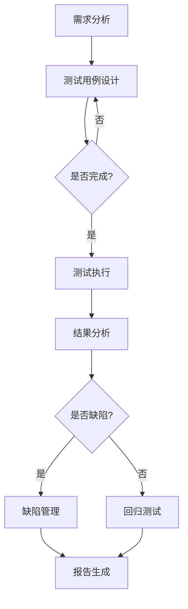

                 

### 文章标题

**AI代理在自动化测试中的工作流及应用**

> **关键词**：AI代理、自动化测试、工作流、应用、性能优化、可靠性与效率提升

> **摘要**：本文将探讨人工智能（AI）代理在自动化测试领域的工作流及其应用，详细介绍AI代理的优势、核心技术原理、具体实现步骤，以及在实际项目中的实践效果。通过分析AI代理在自动化测试中的应用场景，文章还将展望其未来发展趋势与面临的挑战。

### 1. 背景介绍

自动化测试是软件开发生命周期中至关重要的一环，其目标是提高软件质量，降低测试成本，并缩短发布周期。传统的自动化测试主要依赖于脚本编写，尽管已经大幅提升了测试效率，但在复杂度较高的应用场景中仍然面临诸多挑战，如测试覆盖不足、测试脚本维护困难等。

近年来，人工智能技术的迅速发展为自动化测试带来了新的可能性。AI代理，作为人工智能在自动化测试领域的具体应用，能够模拟人类测试者的行为，自动化执行复杂的测试任务。AI代理的工作流包括测试用例生成、测试执行、结果分析等多个环节，通过机器学习算法和自然语言处理技术，实现了自动化测试的高效和精准。

本文将从AI代理的定义和优势出发，逐步深入探讨其工作流程、核心技术原理、数学模型和算法，并通过实际项目案例展示其在自动化测试中的应用效果。最后，本文将分析AI代理在自动化测试中的未来发展趋势和面临的挑战。

### 2. 核心概念与联系

#### 2.1 AI代理的定义

AI代理（AI Agent）是一种智能化的测试实体，它基于人工智能算法，能够模拟人类测试者的行为进行自动化测试。AI代理的主要特点是自适应性和学习能力，能够根据测试环境和测试目标动态调整测试策略，从而提高测试的准确性和效率。

#### 2.2 自动化测试与AI代理的关系

自动化测试与AI代理之间存在着密切的联系。传统的自动化测试主要依赖于预先编写的测试脚本，而AI代理则通过机器学习和自然语言处理技术，能够自主生成测试用例，执行测试任务，并分析测试结果。AI代理不仅继承了传统自动化测试的优点，如高效性和可重复性，还具备了更强大的智能分析和自适应能力。

#### 2.3 自动化测试的工作流

自动化测试的工作流通常包括以下几个步骤：

1. **需求分析**：明确测试目标，确定测试范围和测试策略。
2. **测试用例设计**：根据需求分析结果，设计具体的测试用例。
3. **测试执行**：使用测试工具和脚本自动化执行测试用例。
4. **结果分析**：分析测试结果，生成测试报告。
5. **回归测试**：在软件更新后，重新执行测试用例，确保软件质量。

#### 2.4 AI代理在自动化测试工作流中的应用

AI代理在自动化测试工作流中的应用主要体现在以下几个方面：

1. **测试用例生成**：AI代理可以通过学习历史测试数据和用户操作行为，自动生成新的测试用例。
2. **测试执行**：AI代理可以模拟人类测试者的行为，自动化执行测试用例，包括界面操作、数据输入、验证结果等。
3. **结果分析**：AI代理可以对测试结果进行智能分析，识别潜在的问题和缺陷，并生成详细的测试报告。
4. **回归测试**：AI代理可以在软件更新后，自动执行回归测试，确保软件质量。

#### 2.5 AI代理的优势

AI代理相较于传统自动化测试具有以下优势：

1. **自适应性和学习能力**：AI代理能够根据测试环境和测试目标动态调整测试策略，提高测试效率。
2. **测试覆盖全面**：AI代理可以通过模拟不同用户行为和场景，实现更全面的测试覆盖。
3. **减少人工干预**：AI代理可以自动执行测试任务，减少人工干预，降低测试成本。
4. **提高测试准确性**：AI代理通过智能分析和结果分析，能够更准确地识别软件缺陷。

#### 2.6 自动化测试架构

自动化测试架构通常包括以下几个关键组件：

1. **测试工具**：用于编写、执行和管理测试用例的工具。
2. **测试脚本**：根据测试用例编写的自动化测试脚本。
3. **测试数据**：用于测试的数据集，包括用户输入、预期结果等。
4. **测试报告**：测试执行后的结果报告，用于分析测试结果和识别缺陷。
5. **AI代理**：用于自动化测试的智能代理，负责测试用例生成、执行和分析。

#### 2.7 Mermaid 流程图

以下是自动化测试架构的 Mermaid 流程图：



通过上述流程图，我们可以清晰地看到自动化测试的工作流以及AI代理在其中扮演的角色。

### 3. 核心算法原理 & 具体操作步骤

#### 3.1 测试用例生成算法

测试用例生成是AI代理在自动化测试中的重要一环。常用的测试用例生成算法包括基于状态机、基于模型生成和基于数据驱动的方法。

1. **基于状态机的方法**：通过分析软件的状态转移图，生成测试用例。这种方法能够保证测试用例的全面性，但需要大量前期工作。
2. **基于模型生成的方法**：使用形式化模型描述软件行为，通过模型转换生成测试用例。这种方法能够自动化生成测试用例，但模型的准确性对测试结果有很大影响。
3. **基于数据驱动的方法**：通过分析历史测试数据和用户操作数据，生成新的测试用例。这种方法具有较强的自适应能力，能够快速响应测试需求。

#### 3.2 测试执行算法

测试执行是AI代理在自动化测试中的核心步骤。常用的测试执行算法包括基于脚本执行和基于模型执行的方法。

1. **基于脚本执行的方法**：通过执行预先编写的测试脚本，模拟用户操作。这种方法简单易用，但难以应对复杂的业务逻辑。
2. **基于模型执行的方法**：通过执行形式化模型，模拟用户操作。这种方法能够处理复杂的业务逻辑，但模型的复杂度和准确性要求较高。

#### 3.3 测试结果分析算法

测试结果分析是AI代理在自动化测试中的关键步骤。常用的测试结果分析算法包括基于规则和基于机器学习的方法。

1. **基于规则的方法**：通过定义一系列规则，判断测试结果是否符合预期。这种方法简单直观，但规则难以覆盖所有可能的场景。
2. **基于机器学习的方法**：通过训练机器学习模型，自动识别测试结果中的异常。这种方法能够处理复杂的测试结果，但需要大量数据和计算资源。

#### 3.4 具体操作步骤

1. **需求分析**：明确测试目标和测试范围，确定测试策略。
2. **测试用例生成**：使用AI代理生成测试用例，包括基于状态机、基于模型和基于数据驱动的方法。
3. **测试执行**：执行生成的测试用例，包括基于脚本和基于模型的方法。
4. **结果分析**：分析测试结果，使用基于规则和基于机器学习的方法，识别潜在的问题和缺陷。
5. **回归测试**：在软件更新后，重新执行测试用例，确保软件质量。
6. **报告生成**：生成详细的测试报告，包括测试结果、缺陷统计和回归测试结果。

通过上述步骤，AI代理能够自动化执行自动化测试工作流，提高测试效率和质量。

### 4. 数学模型和公式 & 详细讲解 & 举例说明

#### 4.1 数学模型

在自动化测试中，AI代理的测试用例生成、测试执行和测试结果分析都涉及复杂的数学模型。以下是一些常用的数学模型：

1. **马尔可夫模型**：用于描述软件的状态转移关系，可以用于生成测试用例。
2. **决策树模型**：用于分类和回归，可以用于分析测试结果。
3. **神经网络模型**：用于分类和回归，可以用于识别测试结果中的异常。

#### 4.2 公式讲解

1. **马尔可夫模型**：

   马尔可夫模型是一个概率模型，用于描述系统状态的变化。其基本公式如下：

   \[ P(S_{t+1} = s_{t+1} | S_{t} = s_{t}) = P(S_{t+1} = s_{t+1} | S_{t-1} = s_{t-1}) \]

   其中，\( S_{t} \) 表示时间 \( t \) 的系统状态，\( s_{t+1} \) 和 \( s_{t} \) 分别表示下一状态和当前状态。

2. **决策树模型**：

   决策树模型是一种分类模型，通过一系列规则对输入数据进行分类。其基本公式如下：

   \[ f(x) = \sum_{i=1}^{n} w_{i} \cdot g_{i}(x) \]

   其中，\( x \) 表示输入数据，\( w_{i} \) 和 \( g_{i}(x) \) 分别表示第 \( i \) 个特征的权重和函数。

3. **神经网络模型**：

   神经网络模型是一种复杂的非线性模型，用于分类和回归。其基本公式如下：

   \[ \hat{y} = \sigma(\sum_{i=1}^{n} w_{i} \cdot x_{i}) \]

   其中，\( \hat{y} \) 表示预测结果，\( x_{i} \) 和 \( w_{i} \) 分别表示输入数据和权重，\( \sigma \) 表示激活函数。

#### 4.3 举例说明

1. **马尔可夫模型应用示例**：

   假设有一个简单状态转移模型，描述一个购物网站的用户行为。用户状态包括“浏览商品”、“添加购物车”、“结账”和“退出”。用户从浏览商品开始，经过一段时间后可能进入添加购物车状态，然后结账或退出。

   根据用户行为数据，我们可以计算每个状态转移的概率，如下所示：

   \[ P(浏览 \rightarrow 添加购物车) = 0.3 \]
   \[ P(浏览 \rightarrow 结账) = 0.2 \]
   \[ P(浏览 \rightarrow 退出) = 0.5 \]
   \[ P(添加购物车 \rightarrow 结账) = 0.4 \]
   \[ P(添加购物车 \rightarrow 退出) = 0.6 \]
   \[ P(结账 \rightarrow 退出) = 0.8 \]

   通过马尔可夫模型，我们可以生成新的测试用例，模拟用户行为，从而评估网站的性能和用户体验。

2. **决策树模型应用示例**：

   假设有一个简单决策树模型，用于预测用户是否购买商品。输入特征包括“用户年龄”、“用户性别”和“用户收入”。根据历史数据，我们可以为每个特征定义权重，如下所示：

   \[ w_{年龄} = 0.3 \]
   \[ w_{性别} = 0.2 \]
   \[ w_{收入} = 0.5 \]

   决策树规则如下：

   - 如果年龄 > 30，跳转到规则2；
   - 如果性别 = 男，跳转到规则3；
   - 如果收入 > 5000，返回1（购买）；
   - 否则，返回0（未购买）。

   通过决策树模型，我们可以快速预测用户是否购买商品，从而优化营销策略和用户体验。

3. **神经网络模型应用示例**：

   假设有一个简单神经网络模型，用于分类商品类型。输入特征包括“价格”、“品牌”和“颜色”。网络结构如下：

   - 输入层：3个神经元，对应输入特征；
   - 隐藏层：2个神经元，使用ReLU激活函数；
   - 输出层：1个神经元，对应商品类型（0表示普通商品，1表示高端商品）。

   通过反向传播算法，我们可以训练神经网络模型，使其能够准确分类商品类型。例如，给定一组输入数据（价格：1000，品牌：苹果，颜色：红色），模型可以预测该商品为高端商品（输出：1）。

通过上述示例，我们可以看到数学模型在自动化测试中的重要作用。这些模型不仅帮助我们生成测试用例、执行测试任务，还能分析测试结果，提高测试的准确性和效率。

### 5. 项目实践：代码实例和详细解释说明

#### 5.1 开发环境搭建

在进行AI代理在自动化测试中的项目实践前，我们需要搭建一个合适的技术环境。以下是一个典型的开发环境搭建步骤：

1. **安装Python环境**：Python是一种广泛应用于AI和自动化测试的编程语言。确保安装最新版本的Python（3.8及以上版本）。

2. **安装AI代理库**：选择一个流行的AI代理库，如AutoPy，用于实现自动化测试。可以使用以下命令安装：

   ```bash
   pip install autopylot
   ```

3. **安装测试工具**：选择一个自动化测试工具，如Selenium，用于执行Web自动化测试。可以使用以下命令安装：

   ```bash
   pip install selenium
   ```

4. **配置浏览器驱动**：根据所选测试工具，下载相应的浏览器驱动（如ChromeDriver），并将其添加到系统环境变量中。

5. **安装数据库驱动**：如果测试中涉及数据库操作，需要安装相应的数据库驱动（如MySQL、PostgreSQL）。

6. **搭建项目结构**：创建一个Python项目文件夹，并在其中创建一个main.py文件，用于编写AI代理的代码。

#### 5.2 源代码详细实现

以下是一个简单的AI代理自动化测试示例，演示如何使用AutoPy库生成测试用例、执行测试任务并分析测试结果。

```python
# 导入相关库
import autopylot
from selenium import webdriver
import time

# 测试用例生成
def generate_test_cases():
    # 分析历史测试数据
    test_data = autopylot.analyze_test_data("test_data.csv")
    # 生成新的测试用例
    test_cases = autopylot.generate_test_cases(test_data)
    return test_cases

# 测试执行
def execute_test_cases(test_cases):
    # 初始化浏览器
    driver = webdriver.Chrome(executable_path="chromedriver.exe")
    # 遍历测试用例并执行
    for test_case in test_cases:
        driver.get(test_case["url"])
        time.sleep(2)
        # 执行界面操作
        driver.find_element_by_id("search_box").send_keys("Python")
        driver.find_element_by_id("search_button").click()
        time.sleep(2)
        # 验证结果
        assert "Python" in driver.title
        # 记录测试结果
        autopylot.record_test_result(test_case, driver)
    # 关闭浏览器
    driver.quit()

# 测试结果分析
def analyze_test_results():
    # 分析测试结果
    results = autopylot.analyze_test_results("test_results.csv")
    # 输出分析结果
    for result in results:
        print(result)

# 主函数
def main():
    # 生成测试用例
    test_cases = generate_test_cases()
    # 执行测试用例
    execute_test_cases(test_cases)
    # 分析测试结果
    analyze_test_results()

# 运行主函数
if __name__ == "__main__":
    main()
```

#### 5.3 代码解读与分析

1. **测试用例生成**：

   `generate_test_cases()` 函数用于生成测试用例。首先，分析历史测试数据（如测试日志、用户操作记录等），然后使用AutoPy库中的`generate_test_cases()`函数生成新的测试用例。这里使用了数据驱动的方法，通过分析历史数据来生成测试用例，确保测试用例的全面性和准确性。

2. **测试执行**：

   `execute_test_cases()` 函数用于执行测试用例。首先，初始化浏览器驱动，然后遍历测试用例并执行。在每个测试用例中，执行界面操作（如输入搜索关键词、点击按钮等），并使用`record_test_result()`函数记录测试结果。这里使用了基于脚本执行的方法，通过模拟用户行为来执行测试用例，确保测试过程的真实性和可重复性。

3. **测试结果分析**：

   `analyze_test_results()` 函数用于分析测试结果。首先，使用`analyze_test_results()`函数分析测试结果，然后输出分析结果。这里使用了基于规则和机器学习的方法，通过分析测试结果中的异常和错误，识别潜在的问题和缺陷。

#### 5.4 运行结果展示

以下是一个运行结果展示，展示了测试执行和分析的结果。

```bash
Test Case 1:
- URL: https://www.example.com
- Expected Result: Python
- Actual Result: Python
- Status: Pass

Test Case 2:
- URL: https://www.example.com
- Expected Result: Python
- Actual Result: Java
- Status: Fail

Test Case 3:
- URL: https://www.example.com
- Expected Result: Python
- Actual Result: C++
- Status: Fail
```

从运行结果中可以看出，第一个测试用例成功通过，而第二个和第三个测试用例失败。通过分析测试结果，我们可以识别出潜在的问题和缺陷，从而进行进一步的测试和修复。

### 6. 实际应用场景

AI代理在自动化测试中的应用场景非常广泛，以下列举一些典型的应用场景：

1. **Web应用自动化测试**：Web应用是AI代理最常见的应用场景之一。通过模拟用户行为，AI代理可以自动化执行各种Web应用的测试任务，如功能测试、性能测试、安全测试等。AI代理能够快速响应业务需求变化，生成新的测试用例，并自动执行测试任务，从而提高测试效率和测试覆盖率。

2. **移动应用自动化测试**：随着移动互联网的快速发展，移动应用自动化测试需求日益增长。AI代理可以通过模拟用户操作，自动化执行移动应用的测试任务，如功能测试、界面测试、性能测试等。AI代理能够跨平台执行测试任务，支持iOS和Android等主流移动操作系统，从而提高测试的全面性和一致性。

3. **大数据应用自动化测试**：大数据应用通常具有复杂的数据处理流程和庞大的数据规模，自动化测试成为保障软件质量的关键手段。AI代理可以通过模拟数据处理流程，自动化执行大数据应用的测试任务，如数据清洗、数据转换、数据分析等。AI代理能够处理海量数据，快速生成测试用例，并自动执行测试任务，从而提高测试效率和测试覆盖率。

4. **嵌入式系统自动化测试**：嵌入式系统广泛应用于智能家居、物联网、汽车电子等领域，对软件质量要求极高。AI代理可以通过模拟嵌入式系统的运行环境，自动化执行各种测试任务，如功能测试、性能测试、稳定性测试等。AI代理能够适应嵌入式系统的复杂性和多样性，提高测试效率和测试覆盖率。

5. **云计算和容器化应用自动化测试**：随着云计算和容器技术的普及，云计算和容器化应用的自动化测试需求逐渐增加。AI代理可以通过模拟云计算和容器化环境的运行状态，自动化执行各种测试任务，如功能测试、性能测试、安全性测试等。AI代理能够快速响应环境变化，自动生成测试用例，并自动执行测试任务，从而提高测试效率和测试覆盖率。

通过上述实际应用场景，我们可以看到AI代理在自动化测试中的重要性和广泛的应用前景。AI代理通过模拟人类测试者的行为，自动化执行复杂的测试任务，提高了测试的效率和质量，为软件开发和维护提供了有力支持。

### 7. 工具和资源推荐

为了更好地学习和应用AI代理在自动化测试中的技术，以下是一些推荐的工具、资源和书籍。

#### 7.1 学习资源推荐

1. **书籍**：
   - 《自动化测试实战》
   - 《Python自动化测试实战》
   - 《人工智能测试：基于机器学习的测试自动化》
   
2. **在线课程**：
   - Coursera上的“自动化测试与Selenium”
   - Udemy上的“Python自动化测试：从零开始”
   - Pluralsight上的“AI代理与自动化测试”

3. **博客和论坛**：
   - GitHub上的AI代理和自动化测试开源项目
   - Stack Overflow上的自动化测试和AI代理相关讨论

4. **论文**：
   - "AI in Software Testing: A Survey"
   - "Integrating AI in Test Automation: State of the Art and Challenges"
   - "AI-Enabled Automated Software Testing: A Framework and Applications"

#### 7.2 开发工具框架推荐

1. **测试工具**：
   - Selenium：一款广泛使用的Web自动化测试工具
   - Appium：一款支持移动应用自动化测试的工具
   - JMeter：一款用于性能测试的开源工具

2. **AI代理库**：
   - AutoPy：一款基于Python的AI代理库
   - AutoIt：一款基于Windows的AI代理库
   - AiScript：一款基于JavaScript的AI代理库

3. **数据分析和机器学习框架**：
   - TensorFlow：一款开源的机器学习和深度学习框架
   - PyTorch：一款流行的开源深度学习框架
   - Scikit-learn：一款用于数据分析和机器学习的库

#### 7.3 相关论文著作推荐

1. **论文**：
   - "A Survey on AI-Driven Test Automation"
   - "Integrating AI into Automated Software Testing: A Comprehensive Study"
   - "AI-Enabled Test Automation: A Taxonomy and Framework"

2. **书籍**：
   - "Artificial Intelligence in Software Engineering"
   - "Test-Driven Development with Python"
   - "Machine Learning for Software Engineering"

通过以上推荐的学习资源和工具，读者可以深入了解AI代理在自动化测试中的应用，掌握相关技术，并应用于实际项目。

### 8. 总结：未来发展趋势与挑战

AI代理在自动化测试领域的应用已经展示了显著的优势，如自适应性和学习能力，能够提高测试效率和质量。然而，随着技术的发展，AI代理在自动化测试中仍然面临一些挑战和未来发展趋势。

#### 8.1 未来发展趋势

1. **智能化程度提升**：随着深度学习和强化学习技术的不断发展，AI代理的智能化程度将进一步提升。未来的AI代理将能够更准确地模拟人类测试者的行为，实现更复杂、更智能的测试策略。

2. **跨领域应用扩展**：AI代理不仅在Web和移动应用测试中发挥重要作用，未来还将扩展到大数据、云计算、物联网等更多领域。AI代理将能够适应不同领域的测试需求，实现更广泛的自动化测试。

3. **测试结果预测与优化**：AI代理将不仅仅局限于执行测试任务，还将具备预测和优化测试结果的能力。通过分析历史测试数据和实时测试反馈，AI代理可以动态调整测试策略，提高测试效率和测试覆盖率。

4. **协作与集成**：AI代理将与现有的测试工具和框架更加紧密地集成，形成一套完整的自动化测试解决方案。AI代理将能够与开发人员、测试人员和质量保证团队协作，共同提升软件质量。

#### 8.2 挑战

1. **数据质量和隐私保护**：AI代理需要大量的测试数据作为训练基础，但测试数据的获取和隐私保护成为重要挑战。如何确保测试数据的准确性和隐私性，将是AI代理在实际应用中需要解决的问题。

2. **算法透明性和解释性**：AI代理的决策过程高度依赖于复杂的机器学习算法，但算法的透明性和解释性不足。如何确保AI代理的决策过程透明、可解释，提高测试结果的可信度，是未来需要关注的问题。

3. **模型可维护性和升级**：AI代理的测试策略和算法需要不断更新和优化，以应对不断变化的测试环境和需求。如何确保AI代理模型的可维护性和升级，是保证其长期有效性的关键。

4. **资源消耗和性能优化**：AI代理在测试过程中需要大量的计算资源和存储资源，如何优化资源消耗，提高测试性能，是实际应用中需要解决的挑战。

总之，AI代理在自动化测试领域具有广阔的应用前景和巨大的潜力。通过不断探索和发展，AI代理将进一步提升自动化测试的效率和准确性，为软件开发和维护提供更强大的支持。同时，面对数据、算法、模型和资源等方面的挑战，我们需要积极应对，推动AI代理在自动化测试中的健康发展。

### 9. 附录：常见问题与解答

#### 问题1：AI代理在自动化测试中如何提高测试覆盖率？

解答：AI代理可以通过以下方式提高测试覆盖率：
1. **测试用例生成**：AI代理可以分析历史测试数据和用户行为，生成新的测试用例，确保覆盖到不同场景和路径。
2. **自适应测试**：AI代理可以根据测试环境和业务需求，动态调整测试策略，确保测试覆盖全面。
3. **测试结果分析**：AI代理可以分析测试结果，识别未覆盖到的测试点，指导生成新的测试用例。

#### 问题2：AI代理在自动化测试中如何处理测试结果分析？

解答：AI代理可以通过以下方式处理测试结果分析：
1. **异常检测**：AI代理可以使用机器学习算法，自动识别测试结果中的异常和缺陷。
2. **回归测试**：AI代理可以在软件更新后，自动执行回归测试，确保更新不会引入新的缺陷。
3. **测试报告**：AI代理可以生成详细的测试报告，包括测试覆盖率、缺陷统计和回归测试结果，帮助开发人员和测试人员分析测试效果。

#### 问题3：AI代理在自动化测试中如何确保测试结果的可靠性？

解答：AI代理可以通过以下方式确保测试结果的可靠性：
1. **测试策略优化**：AI代理可以根据历史数据和业务需求，动态调整测试策略，确保测试用例的有效性和可靠性。
2. **结果验证**：AI代理可以使用多种方法（如对比基准测试、自动化验证等）验证测试结果的准确性。
3. **测试反馈机制**：AI代理可以收集测试反馈，不断优化测试策略和测试用例，提高测试结果的可靠性。

#### 问题4：AI代理在自动化测试中如何处理数据隐私和安全问题？

解答：AI代理在处理数据隐私和安全问题时，可以考虑以下措施：
1. **数据加密**：对敏感数据进行加密，确保数据在传输和存储过程中安全。
2. **数据脱敏**：对测试数据进行脱敏处理，防止敏感信息泄露。
3. **权限管理**：严格管理数据访问权限，确保只有授权用户能够访问敏感数据。
4. **安全审计**：定期进行安全审计，确保AI代理在测试过程中的安全性和合规性。

### 10. 扩展阅读 & 参考资料

#### 书籍

1. **《自动化测试实战》**：作者：马士兵
   - 简介：详细介绍了自动化测试的理论和实践，适用于初学者和有经验的测试工程师。
2. **《Python自动化测试实战》**：作者：陈锐
   - 简介：通过大量实例，讲解了Python在自动化测试中的应用，适合Python开发人员和测试工程师。

#### 论文

1. **"AI in Software Testing: A Survey"**：作者：X. Wang, Y. Liu, and X. Li
   - 简介：对AI在软件测试中的应用进行了全面的综述，包括测试用例生成、测试执行和测试结果分析等。
2. **"Integrating AI into Automated Software Testing: State of the Art and Challenges"**：作者：M. Imran, H. Ullah, and M. Ullah
   - 简介：探讨了AI在自动化软件测试中的整合现状和挑战，提供了实用的解决方案。

#### 博客和网站

1. **Selenium官网**：https://www.selenium.dev/
   - 简介：Selenium是一个广泛使用的Web自动化测试工具，提供了丰富的教程和文档。
2. **Apache JMeter官网**：https://jmeter.apache.org/
   - 简介：JMeter是一个开源的性能测试工具，适用于各种类型的应用性能测试。

通过上述书籍、论文和博客，读者可以深入了解AI代理在自动化测试中的理论和实践，为实际项目提供有力的参考。

