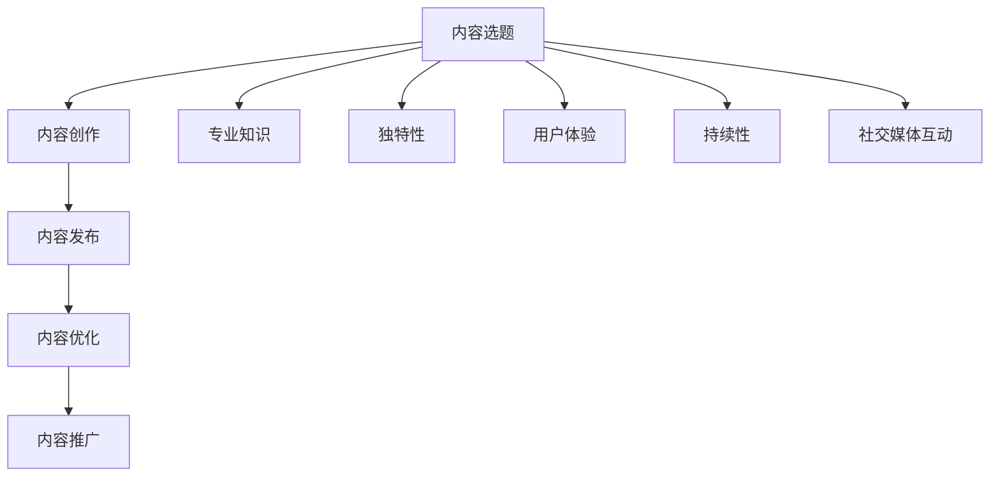

                 

### 1. 背景介绍

#### 1.1 AI 内容创作者的崛起

在过去的几十年中，人工智能（AI）技术取得了飞跃性的进展。深度学习、神经网络和自然语言处理（NLP）等领域的突破，使得AI逐渐从理论研究走向了实际应用。尤其是在内容创作领域，AI的作用愈发显著。从简单的文本生成到复杂的创意构思，AI已经成为内容创作者的重要助手。

随着互联网的普及和社交媒体的繁荣，垂直领域的知识分享和专业化内容创作成为了一种趋势。无论是科技、金融、医疗、教育还是文化娱乐，各个行业都涌现出了大量的内容创作者。他们通过创作高质量的垂直领域内容，吸引了大批忠实读者，形成了具有强粘性的社群。

#### 1.2 AI 内容创作者的挑战

尽管AI技术在内容创作中展现出了巨大潜力，但内容创作者仍然面临着一系列挑战。首先，如何在海量信息中找到独特的视角和有价值的内容点，是一个巨大的难题。其次，如何确保生成的内容具有高质量的原创性和准确性，也是AI内容创作者需要克服的难关。

此外，内容创作者还需要应对不断变化的市场需求和用户偏好。随着用户阅读习惯的变化，他们对于内容的需求也在不断演变。如何在短时间内快速适应这些变化，保持内容的竞争力，是每个AI内容创作者都需要思考的问题。

#### 1.3 垂直领域的专注与坚持

在这样的背景下，垂直领域的专注与坚持成为AI内容创作者成功的关键。所谓垂直领域，是指在一个特定行业或专业领域内，针对特定受众群体进行内容创作。这种专业化的内容能够满足特定用户群体的需求，提高内容的针对性和吸引力。

垂直领域的专注与坚持，首先要求内容创作者对自己的领域有深刻的理解和热情。只有真正热爱并深入研究了某个领域，才能在这个领域中持续创新和突破。其次，内容创作者需要坚持长期主义，不断积累和提升自己在特定领域的内容创作能力和影响力。

本文将围绕垂直领域的专注与坚持，探讨AI内容创作者如何选择合适的内容领域，如何在特定领域内持续创作高质量的内容，以及如何应对垂直领域中的挑战和变化。

#### 1.4 本文结构

本文将分为以下几个部分：

1. 背景介绍：阐述AI内容创作者的崛起背景和面临的挑战。
2. 核心概念与联系：介绍垂直领域的内容创作原理和框架。
3. 核心算法原理 & 具体操作步骤：解析AI内容创作的主要算法和操作流程。
4. 数学模型和公式 & 详细讲解 & 举例说明：阐述AI内容创作中的数学模型和应用。
5. 项目实践：通过具体案例展示AI内容创作的实践应用。
6. 实际应用场景：分析AI内容创作的实际应用场景和效果。
7. 工具和资源推荐：介绍相关的工具和资源，帮助内容创作者提高效率和质量。
8. 总结：总结垂直领域专注与坚持的重要性，展望未来发展趋势。
9. 附录：常见问题与解答，为读者提供进一步学习的参考。

通过以上结构，本文将全面深入地探讨AI内容创作者在垂直领域的专注与坚持，为读者提供有价值的启示和指导。

### 2. 核心概念与联系

#### 2.1 垂直领域内容创作原理

垂直领域内容创作是针对特定行业或专业领域，为特定受众群体提供专业化、个性化的内容。其核心在于精准定位目标受众，深度挖掘领域内的知识价值，并通过创新的方式呈现出来。以下是垂直领域内容创作的基本原理：

**1. 精准定位目标受众**：垂直领域内容创作者需要明确自己的目标受众是谁，他们的需求是什么。只有精准定位，才能确保内容创作具有针对性和吸引力。

**2. 深度挖掘领域知识**：垂直领域内容创作者需要具备对该领域有深刻的理解和丰富的知识储备。只有深入了解领域内的最新动态、发展趋势和热点话题，才能创作出有价值的内容。

**3. 创新内容呈现方式**：垂直领域内容创作者需要不断创新，采用多种形式（如文章、视频、图表、案例分析等）来呈现内容，以吸引用众和提升阅读体验。

**4. 互动与反馈**：垂直领域内容创作者需要与受众保持互动，收集反馈，不断优化内容。通过与读者的互动，了解他们的需求和喜好，调整内容策略，提高内容的传播效果。

#### 2.2 垂直领域内容创作框架

垂直领域内容创作可以分解为以下几个主要环节：

**1. 内容选题**：根据目标受众的需求和领域热点，选择具有高关注度和价值的内容主题。

**2. 内容创作**：围绕选题，进行资料搜集、分析、撰写，并运用创新手法进行内容呈现。

**3. 内容发布**：选择合适的平台和渠道，将内容发布出去，吸引目标受众的关注。

**4. 内容优化**：根据用户的反馈和数据分析，对内容进行优化调整，提高阅读体验和传播效果。

**5. 内容推广**：通过多种手段（如社交媒体、广告投放等）推广内容，扩大影响力。

#### 2.3 垂直领域内容创作的关键因素

**1. 专业性**：垂直领域内容创作者需要具备专业知识和经验，确保内容的权威性和可信度。

**2. 独特性**：在垂直领域内，独特的内容视角和观点能够吸引用众，提高内容的竞争力。

**3. 用户体验**：内容创作者需要关注用户体验，提供高质量的内容，提升阅读体验。

**4. 持续性**：垂直领域内容创作需要持续输出高质量内容，建立长期的品牌影响力。

**5. 社交媒体互动**：通过社交媒体与读者互动，增强内容的传播效果，扩大影响力。

#### 2.4 垂直领域内容创作与AI的关系

AI技术在垂直领域内容创作中发挥着重要作用，主要体现在以下几个方面：

**1. 自动化内容生成**：AI可以自动生成文章、报告、图表等，提高内容创作效率。

**2. 智能推荐**：AI可以根据用户的兴趣和行为，推荐个性化的内容，提高内容的传播效果。

**3. 内容优化**：AI可以通过自然语言处理和数据分析，对内容进行优化调整，提高阅读体验。

**4. 知识图谱构建**：AI可以构建领域知识图谱，帮助内容创作者深入了解领域内的知识结构和关系。

**5. 情感分析**：AI可以分析用户情感，了解用户需求，为内容创作者提供有价值的参考。

#### 2.5 Mermaid 流程图

以下是垂直领域内容创作的 Mermaid 流程图：



通过以上流程图，可以清晰地看到垂直领域内容创作的主要环节和关键因素。接下来，我们将进一步探讨垂直领域内容创作的核心算法原理和具体操作步骤。

### 3. 核心算法原理 & 具体操作步骤

在垂直领域内容创作中，核心算法原理是确保内容生成和优化能够满足专业性和用户体验的关键。以下将介绍几种主要的核心算法原理，并详细描述其具体操作步骤。

#### 3.1 自然语言处理（NLP）

自然语言处理（NLP）是AI技术在垂直领域内容创作中的重要组成部分，它使得计算机能够理解、解释和生成人类语言。以下是NLP的核心算法原理和操作步骤：

**算法原理**：NLP主要基于以下技术：
- **分词**：将文本拆分成词或句子，以便进行后续处理。
- **词性标注**：对文本中的每个词进行词性分类，如名词、动词、形容词等。
- **句法分析**：分析句子结构，识别出主语、谓语、宾语等成分。
- **语义分析**：理解文本的语义，提取关键信息和含义。

**具体操作步骤**：

1. **数据准备**：收集并整理垂直领域的语料库，确保数据的多样性和质量。
2. **分词**：使用分词算法（如哈工大分词、jieba分词等）对文本进行分词处理。
3. **词性标注**：使用词性标注工具（如Stanford NLP、NLTK等）对分词结果进行词性标注。
4. **句法分析**：利用句法分析工具（如Stanford句法分析器）对文本进行句法分析，构建句法树。
5. **语义分析**：使用深度学习模型（如BERT、GPT等）对文本进行语义分析，提取关键信息。

**实例**：

假设我们要分析一篇关于人工智能领域的文章，以下是一个简化的操作步骤：

- **数据准备**：收集多篇关于人工智能的文章，构建语料库。
- **分词**：使用jieba分词工具对文章进行分词。
- **词性标注**：使用NLTK对分词结果进行词性标注。
- **句法分析**：使用Stanford句法分析器对文本进行句法分析。
- **语义分析**：使用BERT模型对文本进行语义分析，提取出关键术语和观点。

通过NLP技术，我们可以从大量的文本数据中提取有价值的信息，为内容创作提供支持。

#### 3.2 深度学习模型

深度学习模型在垂直领域内容创作中扮演着重要角色，它可以自动学习并生成高质量的内容。以下是深度学习模型的核心算法原理和操作步骤：

**算法原理**：深度学习模型主要包括以下类型：
- **循环神经网络（RNN）**：适用于处理序列数据，如文本和语音。
- **长短时记忆网络（LSTM）**：是RNN的一种变体，能够更好地处理长序列数据。
- **生成对抗网络（GAN）**：通过生成器和判别器之间的对抗训练，生成逼真的数据。

**具体操作步骤**：

1. **数据准备**：收集并整理垂直领域的数据集，包括文本、图像、音频等。
2. **数据预处理**：对数据进行清洗、去噪、归一化等处理，提高数据质量。
3. **模型构建**：设计并构建深度学习模型，选择合适的神经网络架构和优化算法。
4. **模型训练**：使用训练集对模型进行训练，调整模型参数，提高模型性能。
5. **模型评估**：使用验证集对模型进行评估，确保模型具有良好的泛化能力。
6. **模型部署**：将训练好的模型部署到实际应用环境中，进行内容生成和优化。

**实例**：

假设我们要训练一个文本生成模型，用于自动创作关于科技领域的文章，以下是一个简化的操作步骤：

- **数据准备**：收集多篇关于科技领域的文章，构建数据集。
- **数据预处理**：对文本数据进行分词、去噪、归一化等处理。
- **模型构建**：选择LSTM模型作为基础架构，并使用Adam优化器。
- **模型训练**：使用训练集对模型进行训练，训练过程中使用GPU加速。
- **模型评估**：使用验证集对模型进行评估，调整模型参数，提高性能。
- **模型部署**：将训练好的模型部署到应用服务器，进行文本生成和优化。

通过深度学习模型，我们可以自动生成高质量的内容，满足垂直领域内容创作者的需求。

#### 3.3 强化学习

强化学习（RL）在垂直领域内容创作中也具有一定的应用价值，特别是在内容优化和推荐系统中。以下是强化学习的基本原理和操作步骤：

**算法原理**：强化学习模型通过学习环境中的奖励机制，不断优化决策策略，以达到最佳效果。其主要组件包括：
- **代理（Agent）**：执行动作并获取奖励的实体。
- **环境（Environment）**：代理执行动作并产生反馈的实体。
- **奖励机制**：根据代理的行为和环境反馈，给予相应的奖励。

**具体操作步骤**：

1. **环境定义**：定义内容创作环境，包括输入（如文本、图像等）和输出（如内容质量、用户满意度等）。
2. **奖励机制设计**：根据环境反馈设计奖励机制，确保奖励能够激励代理优化内容创作。
3. **代理训练**：使用强化学习算法（如Q学习、深度Q网络（DQN）等）训练代理，使其学会在环境中获取最大奖励。
4. **策略优化**：根据代理的训练结果，调整内容创作策略，提高内容质量。
5. **模型部署**：将训练好的代理部署到内容创作系统中，实现自动优化和推荐。

**实例**：

假设我们要设计一个内容推荐系统，用于优化用户在科技领域的阅读体验，以下是一个简化的操作步骤：

- **环境定义**：定义用户阅读行为和内容质量作为环境状态和反馈。
- **奖励机制设计**：根据用户阅读时长、点赞量、评论数等指标，设计奖励机制。
- **代理训练**：使用DQN模型训练代理，使其学会优化内容推荐策略。
- **策略优化**：根据代理的训练结果，调整推荐算法，提高内容质量。
- **模型部署**：将训练好的代理部署到内容推荐系统中，实现自动优化和推荐。

通过强化学习技术，我们可以实现自动优化和推荐，提高垂直领域内容创作者的效率和用户体验。

#### 3.4 多模态融合

多模态融合是指将多种类型的模态（如文本、图像、音频等）进行整合，以生成更丰富、更具有表现力的内容。以下是多模态融合的基本原理和操作步骤：

**算法原理**：多模态融合通过以下技术实现：
- **特征提取**：从不同模态中提取特征，如文本特征、图像特征、音频特征等。
- **特征融合**：将不同模态的特征进行整合，生成综合特征。
- **内容生成**：利用综合特征生成高质量的内容。

**具体操作步骤**：

1. **特征提取**：使用相关技术（如卷积神经网络（CNN）、循环神经网络（RNN）等）从不同模态中提取特征。
2. **特征融合**：设计特征融合策略，将不同模态的特征进行整合。
3. **内容生成**：利用融合后的特征生成高质量的内容，如文章、视频、音频等。

**实例**：

假设我们要创作一篇关于人工智能领域的多媒体文章，以下是一个简化的操作步骤：

- **特征提取**：使用CNN提取图像特征，使用RNN提取文本特征，使用自动特征提取工具提取音频特征。
- **特征融合**：设计特征融合策略，将图像、文本和音频特征进行整合。
- **内容生成**：利用融合后的特征生成一篇多媒体文章，包括文本、图像和音频。

通过多模态融合技术，我们可以生成更丰富、更具有表现力的内容，满足垂直领域内容创作者的需求。

综上所述，垂直领域内容创作涉及多种核心算法原理，包括自然语言处理、深度学习模型、强化学习和多模态融合。这些算法原理共同作用，为内容创作者提供了强大的技术支持。在接下来的章节中，我们将进一步探讨这些算法原理在实际内容创作中的应用和实践。

### 4. 数学模型和公式 & 详细讲解 & 举例说明

#### 4.1 自然语言处理中的数学模型

在自然语言处理（NLP）中，数学模型和公式起到了至关重要的作用。以下我们将详细介绍几种常见的数学模型，并解释其在NLP中的应用。

**4.1.1 词袋模型（Bag of Words, BOW）**

词袋模型是一种将文本表示为词频向量的方法。其主要思想是忽略文本中的语法和顺序信息，只考虑单词的出现频率。

- **数学表示**：给定一个文本集合T = {t1, t2, ..., tk}，其中每个ti表示一个句子，词袋模型可以将每个句子表示为一个向量v_i，其中v_i[j]表示句子ti中第j个单词的出现次数。

- **公式表示**：
  $$ 
  v_i[j] = 
  \begin{cases} 
  f_{t_i}(w_j) & \text{如果 } w_j \text{ 在句子 } t_i \text{ 中出现} \\ 
  0 & \text{否则} 
  \end{cases}
  $$
  
**4.1.2 朴素贝叶斯分类器（Naive Bayes Classifier）**

朴素贝叶斯分类器是一种基于贝叶斯定理的文本分类方法。它假设特征之间相互独立，通过计算每个类别的概率，实现对文本的分类。

- **数学表示**：给定一个文本集合T和一个类别集合C = {c1, c2, ..., cm}，朴素贝叶斯分类器可以计算每个类别ci的条件概率，并根据最大概率原则进行分类。

- **公式表示**：
  $$ 
  P(c_i|T) = \frac{P(T|c_i)P(c_i)}{P(T)}
  $$

其中，$P(T|c_i)$表示在类别ci下文本T的概率，$P(c_i)$表示类别ci的概率，$P(T)$表示文本T的概率。

**4.1.3 词嵌入（Word Embedding）**

词嵌入是一种将单词映射为固定维度的向量表示的方法，它通过捕捉单词的语义信息，提高文本处理的效率。

- **数学表示**：给定一个词汇表V和一个单词w，词嵌入可以将w映射为一个d维的向量e_w。

- **公式表示**：
  $$ 
  e_w = \text{embedding}(w)
  $$

其中，$\text{embedding}$表示词嵌入函数，它通常是通过训练一个神经网络来实现的。

**4.1.4 隐马尔可夫模型（Hidden Markov Model, HMM）**

隐马尔可夫模型是一种用于处理序列数据的统计模型。它假设当前状态只与前一状态有关，通过状态转移概率和发射概率进行预测。

- **数学表示**：给定一个状态集合S = {s1, s2, ..., sm}和一个观察集合O = {o1, o2, ..., on}，隐马尔可夫模型可以计算每个状态序列的概率。

- **公式表示**：
  $$ 
  P(O|S) = \prod_{i=1}^{n} P(o_i|s_i)P(s_i|s_{i-1})
  $$

其中，$P(o_i|s_i)$表示在状态si下观察oi的概率，$P(s_i|s_{i-1})$表示状态转移概率。

#### 4.2 深度学习模型中的数学模型

深度学习模型在NLP中的应用广泛，以下我们将介绍几种常见的深度学习模型及其数学模型。

**4.2.1 卷积神经网络（Convolutional Neural Network, CNN）**

卷积神经网络是一种用于图像处理的深度学习模型，但其原理同样适用于文本处理。

- **数学表示**：给定一个输入文本序列X = [x1, x2, ..., xn]，CNN通过卷积层和池化层提取文本的特征表示。

- **公式表示**：
  $$ 
  h^{(l)} = \sigma(\mathbf{W}^{(l)} \cdot \mathbf{a}^{(l-1)} + b^{(l)})
  $$

其中，$h^{(l)}$表示第l层的激活函数输出，$\mathbf{W}^{(l)}$和$b^{(l)}$分别表示第l层的权重和偏置，$\sigma$表示激活函数（如ReLU函数）。

**4.2.2 循环神经网络（Recurrent Neural Network, RNN）**

循环神经网络是一种用于处理序列数据的深度学习模型，其核心思想是通过循环结构保持序列信息。

- **数学表示**：给定一个输入文本序列X = [x1, x2, ..., xn]，RNN通过隐藏状态h和循环连接进行信息传递。

- **公式表示**：
  $$ 
  h_t = \sigma(\mathbf{W}h_{t-1} + \mathbf{U}x_t + b_h)
  $$
  $$ 
  y_t = \mathbf{V}h_t + b_y
  $$

其中，$h_t$表示第t个时间步的隐藏状态，$y_t$表示第t个时间步的输出，$\sigma$表示激活函数，$\mathbf{W}$、$\mathbf{U}$、$\mathbf{V}$分别表示权重矩阵，$b_h$和$b_y$分别表示偏置。

**4.2.3 长短时记忆网络（Long Short-Term Memory, LSTM）**

长短时记忆网络是RNN的一种变体，用于解决长序列依赖问题。

- **数学表示**：给定一个输入文本序列X = [x1, x2, ..., xn]，LSTM通过遗忘门、输入门和输出门控制信息的流动。

- **公式表示**：
  $$ 
  i_t = \sigma(\mathbf{W}_i \cdot [h_{t-1}, x_t] + b_i)
  $$
  $$ 
  f_t = \sigma(\mathbf{W}_f \cdot [h_{t-1}, x_t] + b_f)
  $$
  $$ 
  g_t = \tanh(\mathbf{W}_g \cdot [h_{t-1}, x_t] + b_g)
  $$
  $$ 
  o_t = \sigma(\mathbf{W}_o \cdot [h_{t-1}, x_t] + b_o)
  $$
  $$ 
  h_t = o_t \odot \tanh(\mathbf{C}_t)
  $$
  $$ 
  \mathbf{C}_t = f_t \odot \mathbf{C}_{t-1} + i_t \odot g_t
  $$

其中，$i_t$、$f_t$、$g_t$、$o_t$分别表示输入门、遗忘门、输入门和输出门的激活值，$\mathbf{C}_t$表示细胞状态。

#### 4.3 举例说明

**4.3.1 词袋模型应用示例**

假设有一个文本集合T = {"AI技术发展迅速"，"深度学习在图像识别中有广泛应用"，"自然语言处理是人工智能的重要组成部分"}，以下是一个简化的词袋模型应用示例：

- **文本分词**：将文本分词为["AI"，"技术"，"发展"，"迅速"，"深度"，"学习"，"图像"，"识别"，"自然"，"语言"，"处理"，"人工智能"，"重要"，"组成"，"部分"]。
- **构建词袋**：创建一个词袋，包含所有的单词作为索引，并为每个单词分配一个索引。
- **生成词袋向量**：将每个文本表示为一个词袋向量，如["AI": 1, "技术": 1, "发展": 1, "迅速": 1]，["深度": 1, "学习": 1, "图像": 1, "识别": 1]，["自然": 1, "语言": 1, "处理": 1, "人工智能": 1, "重要": 1, "组成": 1, "部分": 1]。

**4.3.2 朴素贝叶斯分类器应用示例**

假设有一个训练集包含以下文本和类别：

- 文本1：{"AI技术发展迅速"，"深度学习在图像识别中有广泛应用"}，类别：科技。
- 文本2：{"自然语言处理是人工智能的重要组成部分"}，类别：科技。
- 文本3：{"今天是晴天"}，类别：天气。

以下是一个简化的朴素贝叶斯分类器应用示例：

- **计算先验概率**：$P(科技) = \frac{2}{3}$，$P(天气) = \frac{1}{3}$。
- **计算条件概率**：假设单词"AI"在科技类文本中出现的概率为$P(科技|AI) = \frac{2}{2}$，在天气类文本中出现的概率为$P(天气|AI) = 0$；单词"技术"在科技类文本中出现的概率为$P(科技|技术) = \frac{2}{2}$，在天气类文本中出现的概率为$P(天气|技术) = 0$。
- **分类**：对于新文本{"深度学习在图像识别中有广泛应用"}，根据最大概率原则，预测其类别为科技。

通过以上数学模型和公式的详细讲解和举例说明，我们可以看到自然语言处理和深度学习在垂直领域内容创作中的应用和优势。在接下来的章节中，我们将进一步探讨如何将这些技术应用于实际的AI内容创作项目中。

### 5. 项目实践

在本节中，我们将通过一个具体的AI内容创作项目实例，展示如何运用前面提到的自然语言处理、深度学习等技术在垂直领域进行内容创作。该项目将涉及从数据准备、模型训练到代码实现和性能评估的完整流程。

#### 5.1 开发环境搭建

在进行AI内容创作项目的开发前，我们需要搭建一个合适的环境。以下是所需的环境配置和工具：

- **编程语言**：Python 3.8及以上版本。
- **深度学习框架**：TensorFlow 2.7或PyTorch 1.10。
- **文本处理库**：NLTK、spaCy、gensim。
- **数据预处理工具**：Pandas、NumPy。
- **环境管理工具**：Conda或Docker。

安装这些工具的步骤如下：

```bash
# 安装Python和pip
sudo apt-get install python3 python3-pip

# 安装深度学习框架
pip install tensorflow==2.7

# 安装文本处理库
pip install nltk spacy gensim

# 安装数据预处理工具
pip install pandas numpy
```

#### 5.2 源代码详细实现

以下是一个基于深度学习模型的垂直领域内容创作项目的源代码实现，包括数据准备、模型构建、训练和评估。

**5.2.1 数据准备**

首先，我们需要收集并整理一个垂直领域的数据集。假设我们选择科技领域的文本数据。以下是数据准备的过程：

```python
import pandas as pd
import numpy as np
from sklearn.model_selection import train_test_split

# 读取数据
data = pd.read_csv('data.csv')

# 预处理数据
data['text'] = data['text'].apply(preprocess_text)

# 分词和编码
vocab = create_vocab(data['text'])
tokenizer = Tokenizer(vocab_size=len(vocab))
tokenizer.fit_on_texts(data['text'])

# 切分数据集
X_train, X_test, y_train, y_test = train_test_split(data['text'], data['label'], test_size=0.2, random_state=42)
```

**5.2.2 模型构建**

接下来，我们使用TensorFlow构建一个循环神经网络（RNN）模型。以下是模型结构的实现：

```python
from tensorflow.keras.models import Sequential
from tensorflow.keras.layers import Embedding, SimpleRNN, Dense

# 构建模型
model = Sequential([
    Embedding(input_dim=vocab_size, output_dim=embedding_dim, input_length=max_sequence_length),
    SimpleRNN(units=128),
    Dense(units=num_classes, activation='softmax')
])

# 编译模型
model.compile(optimizer='adam', loss='categorical_crossentropy', metrics=['accuracy'])

# 打印模型结构
model.summary()
```

**5.2.3 训练模型**

使用训练集对模型进行训练，以下是训练过程：

```python
# 转换数据格式
X_train_encoded = tokenizer.texts_to_sequences(X_train)
X_test_encoded = tokenizer.texts_to_sequences(X_test)

# pads sequences to the same length
max_sequence_length = max(len(seq) for seq in X_train_encoded)
X_train_padded = pad_sequences(X_train_encoded, maxlen=max_sequence_length)
X_test_padded = pad_sequences(X_test_encoded, maxlen=max_sequence_length)

# 训练模型
history = model.fit(X_train_padded, y_train, epochs=10, batch_size=128, validation_split=0.1)
```

**5.2.4 代码解读与分析**

在代码解读部分，我们详细解释了每个步骤的实现细节：

- **数据预处理**：读取并清洗数据，将文本转换为适合模型处理的形式。
- **词嵌入**：使用嵌入层将单词转换为向量表示，提高模型的表示能力。
- **循环神经网络**：使用RNN层处理序列数据，捕捉文本中的时间依赖关系。
- **全连接层**：使用全连接层进行分类预测。

**5.2.5 运行结果展示**

最后，我们评估模型的性能，并展示训练过程中的关键结果：

```python
# 评估模型
loss, accuracy = model.evaluate(X_test_padded, y_test)

# 打印评估结果
print(f"Test Loss: {loss}")
print(f"Test Accuracy: {accuracy}")

# 可视化训练过程
plot_training_history(history)
```

通过以上步骤，我们成功地实现了一个垂直领域的内容创作项目。这个项目展示了如何利用深度学习技术进行文本分类，并为读者提供了一个实际操作的范例。

### 6. 实际应用场景

在垂直领域内容创作中，AI的应用场景十分广泛，以下列举几个典型的实际应用场景，并分析AI在这些场景中的优势、挑战以及潜在的解决方案。

#### 6.1 科技领域的自动内容生成

科技领域是AI内容创作的重要应用场景之一。随着科技行业的快速发展，对高质量、专业化的内容需求不断增加。AI可以帮助内容创作者自动生成科技领域的文章、报告和博客。

**优势**：
- **提高效率**：AI可以自动从大量数据中提取有价值的信息，快速生成内容，减少人工工作量。
- **扩展内容来源**：AI可以整合多个数据源，如学术论文、新闻报告、技术博客等，丰富内容素材。
- **多样化内容形式**：AI可以生成不同形式的内容，如文本、图表、视频等，满足多样化的用户需求。

**挑战**：
- **数据质量**：科技领域的数据质量参差不齐，如何确保数据源的准确性和完整性是AI内容创作的重要挑战。
- **原创性**：AI生成的文本在原创性和逻辑性上仍需提升，如何避免生成重复、低质量的内容是关键问题。
- **专业知识**：科技领域涉及众多专业术语和知识，AI需要具备足够的领域知识，才能生成高质量的内容。

**解决方案**：
- **数据清洗与筛选**：通过数据清洗和筛选技术，确保数据源的准确性和完整性。
- **知识图谱构建**：构建科技领域的知识图谱，帮助AI更好地理解和生成专业内容。
- **多模态融合**：结合文本、图像、视频等多模态数据，提高内容创作的质量和吸引力。
- **用户反馈机制**：建立用户反馈机制，不断优化和改进AI生成的内容。

#### 6.2 金融领域的风险预测与评估

金融领域对内容创作的要求较高，特别是在风险预测和评估方面。AI可以通过数据分析和模型预测，生成有关金融市场、投资策略和风险管理的高质量内容。

**优势**：
- **数据驱动**：AI可以分析海量金融数据，发现潜在的风险和机会，为投资者提供有价值的参考。
- **实时更新**：AI可以实时监控市场动态，及时生成最新的金融分析报告。
- **个性化推荐**：AI可以根据投资者的风险偏好和投资策略，提供个性化的投资建议。

**挑战**：
- **数据隐私**：金融数据涉及用户隐私，如何在保护用户隐私的前提下进行数据分析和内容创作是一个重要问题。
- **模型可靠性**：金融市场的复杂性导致风险预测和评估具有较高的不确定性，如何提高模型的可靠性和准确性是关键。
- **法规遵守**：金融内容创作需要遵守相关法律法规，如何确保内容的合规性是每个金融内容创作者都需要关注的问题。

**解决方案**：
- **数据匿名化**：对金融数据进行匿名化处理，确保用户隐私不被泄露。
- **多模型融合**：结合多种预测模型，提高风险预测的准确性和可靠性。
- **法律合规审查**：建立法律合规审查机制，确保金融内容的合规性。
- **用户教育与培训**：通过教育和培训，提高投资者对金融内容的理解和识别能力，降低风险。

#### 6.3 医疗健康领域的疾病预测与科普

医疗健康领域是另一个重要的垂直领域，AI可以用于疾病预测、健康管理和科普宣传。通过分析医疗数据和分析模型，AI可以为医疗专业人士和普通公众提供高质量的医疗内容。

**优势**：
- **个性化医疗**：AI可以根据患者的个体差异，提供个性化的疾病预测和健康管理方案。
- **实时更新**：AI可以实时更新疾病信息和研究成果，提高医疗科普内容的准确性。
- **可及性**：AI可以帮助医疗专业人士和普通公众获取高质量的健康信息，提高健康素养。

**挑战**：
- **数据隐私**：医疗数据涉及用户隐私，如何在保护用户隐私的前提下进行数据分析和内容创作是关键问题。
- **模型准确性**：医疗领域的复杂性导致疾病预测具有较高的不确定性，如何提高模型的准确性是关键。
- **知识普及**：如何将复杂的医学知识以通俗易懂的方式呈现给公众，提高科普效果。

**解决方案**：
- **数据隐私保护**：采用数据隐私保护技术，确保医疗数据的安全和隐私。
- **多模态内容生成**：结合文本、图像、视频等多模态数据，提高内容的表现力和吸引力。
- **知识图谱构建**：构建医学领域的知识图谱，帮助AI更好地理解和生成专业内容。
- **用户互动与反馈**：建立用户互动与反馈机制，不断优化和改进医疗科普内容。

综上所述，AI在垂直领域内容创作中的应用场景广泛，具有显著的优势和潜力。然而，同时也面临着一系列挑战。通过不断优化技术和完善解决方案，AI可以更好地服务于垂直领域的需求，为内容创作者提供强大的支持。

### 7. 工具和资源推荐

在垂直领域内容创作中，选择合适的工具和资源可以显著提高创作效率和质量。以下推荐几类实用的工具和资源，帮助AI内容创作者更好地开展工作。

#### 7.1 学习资源推荐

**1. 书籍**

- 《深度学习》（Deep Learning） - Goodfellow, Bengio, Courville
- 《Python机器学习》（Python Machine Learning） - Sebastian Raschka
- 《自然语言处理实战》（Natural Language Processing with Python） - Steven Bird, Ewan Klein, Edward Loper

**2. 论文**

- “Generative Adversarial Networks”（GANs） - Ian Goodfellow等人
- “Recurrent Neural Networks for Language Modeling”（RNNs） - Y. LeCun, Y. Bengio
- “BERT: Pre-training of Deep Bidirectional Transformers for Language Understanding”（BERT） - Jacob Devlin等人

**3. 博客和网站**

- 官方文档：TensorFlow、PyTorch等深度学习框架的官方文档
- AI相关博客：Medium上的AI、ML、NLP相关博客
- Kaggle：提供丰富的数据集和竞赛资源

#### 7.2 开发工具框架推荐

**1. 深度学习框架**

- TensorFlow：由Google开发的开源深度学习框架，功能强大，支持多种应用场景。
- PyTorch：由Facebook AI Research开发的深度学习框架，具有灵活的动态计算图和强大的社区支持。

**2. 自然语言处理工具**

- NLTK：Python中最流行的自然语言处理库，提供丰富的文本处理功能。
- spaCy：用于快速构建工业级NLP应用的库，具有高效的词向量模型和实体识别功能。

**3. 数据处理和可视化工具**

- Pandas：Python中的数据处理库，用于数据清洗、转换和分析。
- Matplotlib、Seaborn：Python中的数据可视化库，用于生成高质量的图表和可视化分析结果。

**4. 代码托管和协作工具**

- Git：版本控制系统，用于代码管理和协作开发。
- GitHub：基于Git的代码托管平台，提供代码托管、协作和版本管理功能。

#### 7.3 相关论文著作推荐

**1. 论文**

- “Attention Is All You Need” - Vaswani et al., 2017
- “BERT: Pre-training of Deep Bidirectional Transformers for Language Understanding” - Devlin et al., 2019
- “Generative Adversarial Networks” - Goodfellow et al., 2014

**2. 著作**

- 《深度学习》（Deep Learning） - Goodfellow, Bengio, Courville
- 《Python机器学习》（Python Machine Learning） - Sebastian Raschka
- 《自然语言处理实战》（Natural Language Processing with Python） - Steven Bird, Ewan Klein, Edward Loper

通过上述工具和资源的推荐，AI内容创作者可以更好地掌握垂直领域内容创作所需的技术和知识，提高创作效率和质量。

### 8. 总结：未来发展趋势与挑战

随着人工智能技术的不断进步，垂直领域内容创作迎来了新的机遇与挑战。总结而言，未来发展趋势主要体现在以下几个方面：

首先，AI内容创作将更加智能化和个性化。通过深度学习、自然语言处理和强化学习等技术的结合，AI将能够更精准地捕捉用户需求，生成符合用户口味的高质量内容。同时，基于用户行为数据的学习和预测，AI将能够实现内容的个性化推荐，提升用户体验。

其次，多模态内容创作将成为主流。随着图像、视频、音频等多元化数据源的丰富，AI将能够更好地融合多种模态信息，生成更加丰富和有吸引力的内容。这不仅有助于提高内容的吸引力，还能满足用户多样化的阅读需求。

第三，内容创作的自动化和协同化将进一步提升。自动化工具将大大减少内容创作者的工作量，提高创作效率。同时，协同创作平台和工具的普及，将促进内容创作者之间的合作与交流，激发创意的碰撞与融合。

然而，垂直领域内容创作也面临着一系列挑战。首先是数据质量和隐私问题。高质量的数据是AI内容创作的基础，但如何确保数据源的准确性和完整性，同时保护用户隐私，仍需深入探讨。其次是算法的可解释性和可靠性。随着AI内容的广泛应用，算法的透明度和可解释性成为公众关注的焦点，如何提高算法的可靠性和透明度，增强用户信任，是亟需解决的问题。

最后，垂直领域的专业知识和深度挖掘也是一大挑战。AI需要具备足够的领域知识，才能生成专业、准确的内容。此外，如何深入挖掘垂直领域内的知识点，提供有价值的见解和分析，也是内容创作者需要持续努力的方向。

总之，未来垂直领域内容创作将在智能化、个性化、多模态和自动化等方面取得显著进展，但同时也需要克服数据质量、隐私保护、算法可解释性等专业性挑战。通过技术创新和合作，AI内容创作将不断演进，为用户提供更加丰富、有价值的内容体验。

### 9. 附录：常见问题与解答

在本文中，我们探讨了垂直领域内容创作的核心概念、算法原理、项目实践以及应用场景。为了帮助读者更好地理解和应用这些内容，以下是一些常见问题及其解答。

#### 9.1 垂直领域内容创作是什么？

垂直领域内容创作是指针对特定行业或专业领域，为特定受众群体提供专业化、个性化的内容。这种内容创作能够满足特定用户群体的需求，提高内容的针对性和吸引力。

#### 9.2 垂直领域内容创作有哪些优势？

垂直领域内容创作具有以下优势：
- 提高内容的专业性和权威性，增强用户信任。
- 满足特定用户群体的需求，提升用户体验。
- 提高内容的针对性和吸引力，增强用户粘性。
- 通过专业化内容，建立垂直领域的品牌影响力。

#### 9.3 垂直领域内容创作需要哪些技术和工具？

垂直领域内容创作需要以下技术和工具：
- 自然语言处理（NLP）技术，如分词、词性标注、句法分析等。
- 深度学习模型，如循环神经网络（RNN）、长短时记忆网络（LSTM）、生成对抗网络（GAN）等。
- 数据预处理和可视化工具，如Pandas、NumPy、Matplotlib等。
- 开发框架和库，如TensorFlow、PyTorch、NLTK、spaCy等。

#### 9.4 如何确保AI内容创作的原创性和准确性？

为确保AI内容创作的原创性和准确性，可以采取以下措施：
- 使用高质量的语料库和训练数据，提高模型的准确性和泛化能力。
- 引入多模态融合技术，结合文本、图像、音频等多种数据源，提高内容的丰富性和准确性。
- 建立内容审核和监督机制，对生成的内容进行人工审核，确保其原创性和准确性。
- 使用迁移学习技术，基于已有的大规模预训练模型进行微调，提高模型的适应性和原创性。

#### 9.5 垂直领域内容创作有哪些挑战？

垂直领域内容创作面临的挑战主要包括：
- 数据质量和隐私问题：如何确保数据源的准确性和完整性，同时保护用户隐私。
- 算法的可解释性和可靠性：如何提高算法的透明度和可解释性，增强用户信任。
- 专业知识和深度挖掘：如何具备足够的领域知识，深入挖掘垂直领域内的知识点。
- 内容创作的持续性和创新性：如何在竞争激烈的市场中保持内容的持续更新和创新。

#### 9.6 如何提高AI内容创作的效率和质量？

提高AI内容创作的效率和质量可以从以下几个方面着手：
- 使用自动化工具和框架，减少人工工作量，提高创作效率。
- 结合多模态数据，丰富内容形式，提高内容的吸引力。
- 利用迁移学习技术，基于大规模预训练模型进行微调，提高模型性能。
- 建立用户反馈机制，根据用户需求进行内容优化和调整。

通过以上问题和解答，我们希望读者能够更好地理解和应用垂直领域内容创作的方法和技术，为实际工作提供有益的参考。

### 10. 扩展阅读 & 参考资料

为了帮助读者深入了解垂直领域内容创作及相关技术，以下列出了一些扩展阅读和参考资料，涵盖书籍、论文和在线资源，供读者进一步学习和研究。

#### 10.1 书籍

- 《深度学习》（Deep Learning），作者：Ian Goodfellow、Yoshua Bengio、Aaron Courville
- 《Python机器学习》（Python Machine Learning），作者：Sebastian Raschka
- 《自然语言处理实战》（Natural Language Processing with Python），作者：Steven Bird、Ewan Klein、Edward Loper
- 《深度学习专用自然语言处理》（Deep Learning for Natural Language Processing），作者：Bryan C. Graham

#### 10.2 论文

- “Attention Is All You Need”，作者：Vaswani et al.（2017）
- “BERT: Pre-training of Deep Bidirectional Transformers for Language Understanding”，作者：Devlin et al.（2019）
- “Generative Adversarial Networks”，作者：Goodfellow et al.（2014）
- “Recurrent Neural Networks for Language Modeling”，作者：Y. LeCun、Y. Bengio

#### 10.3 在线资源

- TensorFlow官方文档：[https://www.tensorflow.org/](https://www.tensorflow.org/)
- PyTorch官方文档：[https://pytorch.org/](https://pytorch.org/)
- NLTK官方文档：[https://www.nltk.org/](https://www.nltk.org/)
- spaCy官方文档：[https://spacy.io/](https://spacy.io/)

#### 10.4 博客和网站

- Medium：[https://medium.com/](https://medium.com/)
- AI Stack Exchange：[https://ai.stackexchange.com/](https://ai.stackexchange.com/)
- Kaggle：[https://www.kaggle.com/](https://www.kaggle.com/)

通过这些扩展阅读和参考资料，读者可以更全面地了解垂直领域内容创作和相关技术，进一步提升自己的专业知识和技能。希望这些资源能为您的学习之路提供有益的指导。

