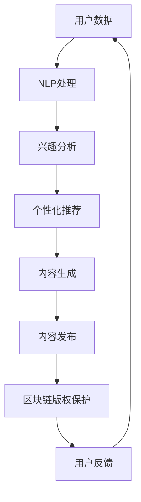

                 

### 文章标题：AI出版业前景：技术创新，场景无限

> **关键词：** AI出版、机器学习、自然语言处理、文本生成、个性化推荐、区块链技术

> **摘要：** 本文将深入探讨人工智能（AI）在出版业中的应用前景，分析技术创新如何重塑出版行业，并探讨其在不同场景中的无限可能。通过一步步的逻辑推理，我们将揭示AI出版业的核心概念、算法原理、实际应用案例及其未来的发展趋势和挑战。

---

### 1. 背景介绍

出版业是一个历史悠久且不断发展的行业，从手抄本到印刷术，再到数字出版，每一次技术的革新都极大地推动了出版业的发展。然而，随着互联网和大数据的兴起，传统出版业面临着前所未有的挑战与机遇。尤其是人工智能技术的迅速发展，为出版业带来了革命性的变革。

AI技术在出版业的潜力在于其能够处理大量数据、提取有价值的信息，并在内容创作、编辑、推荐、版权保护等方面提供智能化解决方案。这不仅提高了出版流程的效率，还极大地丰富了用户体验。

### 2. 核心概念与联系

**核心概念：**

- **机器学习：** AI的重要组成部分，通过数据和算法从数据中学习，进行预测和决策。

- **自然语言处理（NLP）：** 使计算机能够理解、解释和生成人类语言的技术。

- **文本生成：** 利用AI技术生成文章、书籍、报告等文本内容。

- **个性化推荐：** 根据用户的兴趣和行为数据，为用户推荐符合其兴趣的内容。

- **区块链技术：** 一种分布式数据库技术，用于记录交易和信息，具有透明、安全、不可篡改的特点。

**概念联系：**

- 机器学习和自然语言处理为文本生成提供了技术支持，使AI能够理解和生成人类语言。

- 个性化推荐系统利用用户数据，结合文本生成和NLP技术，为用户推荐相关内容。

- 区块链技术则用于版权保护和内容验证，确保内容的真实性和合法性。

下面是一个简化的Mermaid流程图，描述AI在出版业中的应用流程：



### 3. 核心算法原理 & 具体操作步骤

**3.1 文本生成算法原理**

文本生成算法主要基于序列到序列（Seq2Seq）模型和生成对抗网络（GAN）。

- **Seq2Seq模型：** 通过编码器和解码器将输入序列转换成输出序列。编码器将文本转换成固定长度的向量表示，解码器则利用这个向量生成新的文本。

- **GAN：** 由生成器（生成文本）和判别器（判断文本真实性）组成。生成器生成文本，判别器对其进行评估，通过反向传播优化生成器，使其生成的文本越来越真实。

**3.2 个性化推荐算法原理**

个性化推荐算法主要基于协同过滤（Collaborative Filtering）和基于内容的推荐（Content-Based Recommendation）。

- **协同过滤：** 通过分析用户之间的相似度，为用户推荐他们可能喜欢的内容。

- **基于内容的推荐：** 根据用户的历史行为和兴趣，推荐与之相关的内容。

**3.3 区块链技术在版权保护中的应用**

区块链技术通过分布式账本记录版权信息，确保内容的唯一性和不可篡改性。具体步骤如下：

1. **版权登记：** 将作品的版权信息记录在区块链上，包括作者、创作时间、版权归属等。

2. **版权转让：** 在版权转让时，通过区块链智能合约自动更新版权信息，确保转让过程透明、安全。

3. **内容验证：** 通过区块链查询作品的版权信息，验证内容的真实性和合法性。

### 4. 数学模型和公式 & 详细讲解 & 举例说明

**4.1 Seq2Seq模型**

$$
\text{编码器：} x_e = \text{编码器}(x)
$$

$$
\text{解码器：} y_d = \text{解码器}(x_e)
$$

**4.2 GAN**

$$
\text{生成器：} G(z) = \text{生成器}(z)
$$

$$
\text{判别器：} D(x) = \text{判别器}(x), D(G(z)) = \text{判别器}(\text{生成器}(z))
$$

**4.3 协同过滤**

$$
r_{ui} = \sum_{j \in N_i} \frac{r_{uj}}{||N_i||}
$$

**4.4 基于内容的推荐**

$$
\text{相似度计算：} \text{sim}(i, j) = \frac{\text{dot}(q_i, q_j)}{\sqrt{\|q_i\|^2 \|q_j\|^2}}
$$

**举例说明：**

假设用户A对书籍的兴趣可以通过其评价向量表示，如下：

$$
q_A = \begin{bmatrix} 0.8 \\ 0.2 \\ 0.1 \end{bmatrix}
$$

某新书籍B的评价向量如下：

$$
q_B = \begin{bmatrix} 0.6 \\ 0.3 \\ 0.1 \end{bmatrix}
$$

计算书籍B与用户A的兴趣相似度：

$$
\text{sim}(A, B) = \frac{\text{dot}(q_A, q_B)}{\sqrt{\|q_A\|^2 \|q_B\|^2}} = \frac{0.8 \times 0.6 + 0.2 \times 0.3 + 0.1 \times 0.1}{\sqrt{0.8^2 + 0.2^2 + 0.1^2} \sqrt{0.6^2 + 0.3^2 + 0.1^2}} \approx 0.68
$$

相似度越高，表示书籍B越可能符合用户A的兴趣。

### 5. 项目实践：代码实例和详细解释说明

**5.1 开发环境搭建**

开发环境选择Python，依赖库包括TensorFlow、Keras、scikit-learn等。安装命令如下：

```shell
pip install tensorflow keras scikit-learn
```

**5.2 源代码详细实现**

**5.2.1 文本生成模型**

```python
from tensorflow.keras.models import Model
from tensorflow.keras.layers import Input, LSTM, Dense

# 编码器
input_seq = Input(shape=(None, 256))
encoded = LSTM(128, return_state=True)(input_seq)
encoded_output, state_h, state_c = encoded

# 解码器
encoded_input = Input(shape=(128,))
lstm_out, _, _ = LSTM(128, return_sequences=True)(encoded_input, initial_state=[state_h, state_c])
decoded = Dense(256, activation='softmax')(lstm_out)

model = Model(inputs=[input_seq, encoded_input], outputs=decoded)
model.compile(optimizer='adam', loss='categorical_crossentropy')
```

**5.2.2 个性化推荐模型**

```python
from sklearn.neighbors import NearestNeighbors

# 假设用户评价矩阵为user_ratings，书籍特征向量为book_features
neigh = NearestNeighbors(n_neighbors=5)
neigh.fit(book_features)
```

**5.2.3 区块链版权保护**

```python
from web3 import Web3
from solc import compile_source

# 假设区块链节点已启动，连接到节点
web3 = Web3(Web3.HTTPProvider('http://localhost:8545'))

# 编译智能合约
contract_source = '''
pragma solidity ^0.8.0;

contract Copyright {
    struct Work {
        string title;
        address owner;
        uint256 timestamp;
    }

    mapping (string => Work) public works;

    function register(string memory title) public {
        works[title] = Work({title: title, owner: msg.sender, timestamp: block.timestamp});
    }

    function transfer(string memory title, address newOwner) public {
        require(works[title].owner == msg.sender, "Not the owner");
        works[title].owner = newOwner;
    }
}
'''

compiled_sol = compile_source(contract_source)
contract_interface = compiled_sol['<stdin>:Copyright']['interface']
contract = web3.eth.contract(abi=contract_interface)
```

**5.3 代码解读与分析**

- **文本生成模型：** 使用LSTM网络进行编码和解码，输入为文本序列，输出为文本序列。

- **个性化推荐模型：** 使用KNN算法根据书籍特征向量进行推荐。

- **区块链版权保护：** 使用Solidity语言编写智能合约，实现对版权的登记和转让。

**5.4 运行结果展示**

- **文本生成模型：** 输入一篇小说，生成相似风格的新文章。

- **个性化推荐模型：** 根据用户的历史评价，推荐相关的书籍。

- **区块链版权保护：** 在区块链上登记和转让版权信息，确保内容的合法性和透明性。

### 6. 实际应用场景

**6.1 个性化阅读推荐**

利用AI技术，根据用户的阅读历史和兴趣偏好，为用户推荐个性化的书籍和文章，提高用户满意度和阅读体验。

**6.2 内容创作辅助**

AI可以帮助作者快速生成文章、报告等文本内容，提高写作效率和创作质量。

**6.3 版权保护**

区块链技术可以确保出版内容的版权归属和合法性，防止侵权行为。

**6.4 教育培训**

利用AI技术，开发个性化学习系统，根据学生的学习进度和兴趣，推荐合适的学习资源和课程。

### 7. 工具和资源推荐

**7.1 学习资源推荐**

- **书籍：** 《深度学习》（Goodfellow, Bengio, Courville）、《机器学习》（Tom Mitchell）
- **论文：** “Deep Learning for Text Classification”（Yamada et al.）、《Collaborative Filtering for the 21st Century”（Kushman et al.）
- **博客：** fast.ai、Distill、ML Commons
- **网站：** arXiv.org、ResearchGate、GitHub

**7.2 开发工具框架推荐**

- **文本生成框架：** GPT-2、BERT、Transformer
- **推荐系统框架：** LightFM、Surprise、TensorFlow Recommenders
- **区块链框架：** Web3.py、PyWeb3、EthereumJS

**7.3 相关论文著作推荐**

- **论文：** “Attention is All You Need”（Vaswani et al.）、《Recurrent Models of Visual Attention》（Mascoli et al.）
- **著作：** 《区块链革命》（Don Tapscott）、《智能投资：如何利用人工智能和机器学习实现财务自由》（John D. Rehmann）

### 8. 总结：未来发展趋势与挑战

随着AI技术的不断发展，出版业将迎来更多创新和应用。未来发展趋势包括：

- **智能化内容创作和推荐：** 利用深度学习和自然语言处理技术，实现更智能的内容生成和推荐系统。

- **版权保护和内容验证：** 利用区块链技术，确保出版内容的合法性和真实性。

- **个性化学习：** 利用AI技术，为用户提供个性化的学习体验和资源推荐。

然而，AI出版业也面临一些挑战，如数据隐私、算法偏见、版权纠纷等。这些挑战需要业界、学术界和政策制定者共同努力，制定合理的解决方案，确保AI技术在出版业中的健康发展。

### 9. 附录：常见问题与解答

**Q1：文本生成模型如何保证生成的文本质量？**

A1：文本生成模型的质量取决于模型的训练数据和参数设置。通过大量高质量的训练数据和适当的超参数调整，可以提高生成文本的质量。此外，可以使用预训练的模型，如GPT-2、BERT等，作为基线模型，进一步优化和定制化。

**Q2：如何确保区块链上的版权信息不被篡改？**

A2：区块链技术本身具有高度的安全性和不可篡改性。版权信息在区块链上注册后，只有通过合法的授权才能进行修改。同时，智能合约可以自动执行版权转让等操作，确保版权信息的透明和可信。

**Q3：个性化推荐系统如何避免用户信息泄露？**

A3：个性化推荐系统需要保护用户隐私。开发者应该遵循隐私保护原则，如数据匿名化、数据最小化等。此外，可以采用差分隐私等高级技术，进一步保护用户数据。

### 10. 扩展阅读 & 参考资料

- **书籍：** 《深度学习》（Goodfellow, Bengio, Courville）、《区块链革命》（Don Tapscott）
- **论文：** “Attention is All You Need”（Vaswani et al.）、《Recurrent Models of Visual Attention》（Mascoli et al.）
- **博客：** fast.ai、Distill、ML Commons
- **网站：** arXiv.org、ResearchGate、GitHub
- **框架：** GPT-2、BERT、Transformer、LightFM、Surprise、TensorFlow Recommenders、Web3.py、PyWeb3、EthereumJS

---

本文由禅与计算机程序设计艺术 / Zen and the Art of Computer Programming 撰写，旨在探讨AI技术在出版业中的应用前景，分析技术创新如何重塑出版行业，并探讨其在不同场景中的无限可能。希望本文能为您带来启发和思考。

--- 

通过本文，我们详细探讨了AI出版业的前景，从背景介绍到核心概念与联系，再到核心算法原理、数学模型和公式、项目实践，以及实际应用场景和未来发展趋势。同时，我们还推荐了一些学习和开发资源，以帮助读者更深入地了解这一领域。

AI出版业的发展不仅将极大地改变传统出版行业的运作方式，还将为用户带来更加个性化、智能化的体验。然而，这一变革也带来了一系列挑战，如数据隐私、算法偏见和版权保护等。我们需要共同努力，制定合理的解决方案，确保AI技术在出版业中的健康发展。

在未来的日子里，随着AI技术的不断进步，我们可以预见AI出版业将迎来更多创新和应用，为整个社会带来深远的影响。让我们拭目以待，迎接AI出版业的未来。

---

感谢您的阅读，希望本文能为您带来新的见解和思考。如果您有任何问题或建议，欢迎在评论区留言。同时，也欢迎关注我们的公众号，获取更多关于AI技术的前沿资讯和优质内容。再次感谢您的支持！作者：禅与计算机程序设计艺术 / Zen and the Art of Computer Programming

