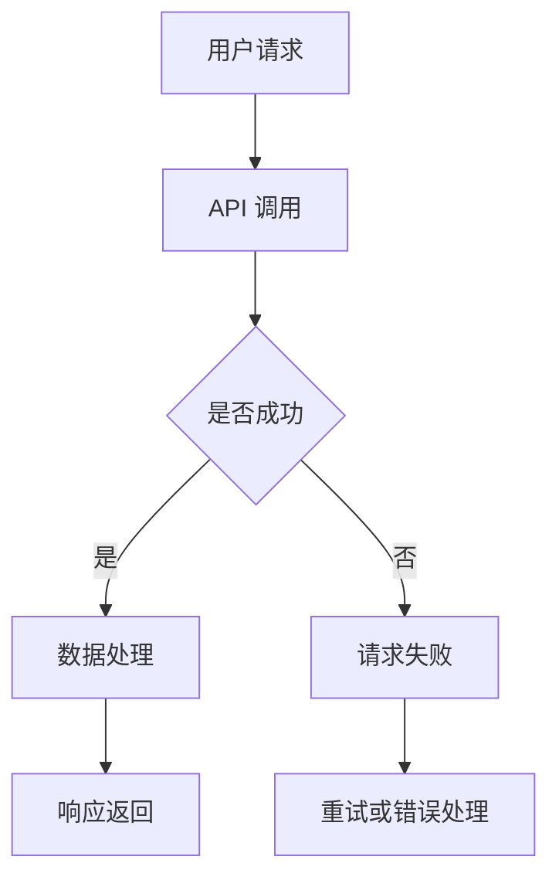

                 

### 背景介绍

#### AI 出版业的兴起

随着人工智能技术的迅猛发展，AI 出版业正逐渐成为出版行业的重要分支。传统出版业面临着数字化转型和内容生产效率的挑战，而 AI 技术的引入为这些问题提供了新的解决方案。通过自然语言处理、机器学习和计算机视觉等技术，AI 出版业能够实现自动化内容生成、个性化推荐、精准广告投放等功能，从而大大提升内容生产效率，降低成本。

#### API 在 AI 出版业中的重要性

在 AI 出版业的开发过程中，API（应用程序编程接口）扮演着至关重要的角色。API 是一种让不同软件系统之间能够互相通信和协作的接口，通过标准化的 API，不同的系统和服务可以方便地进行数据交换和功能调用，从而实现高效的业务流程和功能整合。

对于 AI 出版业来说，API 的重要性体现在以下几个方面：

1. **数据集成与交换**：AI 出版业需要处理大量的数据，包括用户数据、内容数据、广告数据等。通过 API，这些数据可以在不同的系统和服务之间进行无缝交换，从而实现数据的高效利用和整合。

2. **功能扩展与定制**：API 为开发者提供了扩展和定制系统功能的能力。通过调用 API，开发者可以实现自定义的功能模块，满足特定业务需求，提高系统的灵活性和可扩展性。

3. **跨平台与跨应用**：API 使得 AI 出版业的应用不再局限于特定的平台或应用，可以在不同的操作系统、设备和应用之间实现无缝切换和交互，从而拓宽了应用场景。

4. **自动化与智能化**：通过 API，AI 出版业可以实现业务流程的自动化和智能化。例如，自动化内容生成、个性化推荐、广告投放等，这些都可以通过 API 实现自动化调度和执行，提高生产效率。

综上所述，API 在 AI 出版业的开发过程中具有不可替代的作用，它是实现数据集成、功能扩展、跨平台应用和业务自动化的重要手段。

#### API 标准化的必要性

随着 AI 出版业的快速发展，API 的数量和种类也在不断增多。然而，如果没有统一的标准，这些 API 将很难协调工作，可能导致以下问题：

1. **兼容性问题**：不同系统之间的 API 可能存在兼容性问题，导致数据交换失败或功能调用异常，从而影响系统的稳定性和可靠性。

2. **维护成本**：没有统一标准的 API 需要开发者针对不同的系统和服务编写特定的代码，增加了开发和维护的复杂度，提高了成本。

3. **用户体验**：缺乏标准化会导致用户体验不一致，用户在操作不同系统或服务时可能面临繁琐的操作流程，降低用户满意度。

4. **安全风险**：缺乏标准的 API 可能存在安全漏洞，使得系统更容易受到攻击。

因此，API 标准化对于 AI 出版业的发展至关重要。通过制定统一的 API 标准，可以解决兼容性、维护成本、用户体验和安全风险等问题，提高系统的稳定性和可靠性，降低开发和维护成本，提升用户体验，保障系统的安全。

### 核心概念与联系

#### API 定义与基本原理

API（应用程序编程接口）是软件系统中的一种接口，用于允许不同的软件模块或系统之间进行交互。它定义了一组规则和协议，通过这些规则和协议，不同的系统可以理解对方的需求并作出相应的响应。

在 AI 出版业的开发中，API 的核心作用在于实现数据交换和功能调用。具体来说，API 可以实现以下功能：

1. **数据检索与存储**：通过 API，AI 出版系统可以查询和存储用户数据、内容数据等，实现数据的集成和管理。

2. **功能调用**：开发者可以通过 API 调用系统的功能模块，如自动化内容生成、个性化推荐、广告投放等，实现业务流程的自动化和智能化。

3. **跨平台集成**：API 使得不同平台和应用之间的集成变得更加简单，开发者可以通过 API 实现跨平台的功能调用和数据交换。

#### API 的工作流程

API 的工作流程可以分为以下几个步骤：

1. **请求发起**：客户端（如应用程序或用户）通过 HTTP 请求向服务器发送请求，请求中包含需要调用的 API 地址和参数。

2. **请求处理**：服务器接收到请求后，根据 API 地址和参数调用相应的功能模块进行处理。

3. **响应返回**：服务器将处理结果以 JSON、XML 或其他格式返回给客户端，客户端根据响应结果进行相应的操作。

#### API 在 AI 出版业中的应用场景

1. **内容生成与编辑**：通过 API，AI 出版系统可以自动生成或编辑内容，如新闻、文章、广告等，提高内容生产效率。

2. **个性化推荐**：基于用户的兴趣和行为数据，API 可以实现个性化推荐，为用户提供个性化的内容推荐。

3. **广告投放**：通过 API，AI 出版系统可以自动投放广告，实现精准的广告投放。

4. **用户数据管理**：API 可以用于管理用户数据，如用户行为数据、偏好数据等，为用户提供个性化的服务和体验。

#### Mermaid 流程图

以下是一个简单的 Mermaid 流程图，展示了 API 在 AI 出版业中的应用场景和流程：



在这个流程图中，用户请求通过 API 进行处理，如果请求成功，则会进行数据处理并返回响应；如果请求失败，则会进行重试或错误处理。

### 核心算法原理 & 具体操作步骤

#### 自动内容生成算法

在 AI 出版业中，自动内容生成算法是实现内容自动化生产的关键。以下是一种常见的自动内容生成算法——基于生成对抗网络（GAN）的文本生成算法。

##### 算法原理

生成对抗网络（GAN）由两部分组成：生成器（Generator）和判别器（Discriminator）。生成器的任务是生成尽可能真实的数据，而判别器的任务是判断数据是真实数据还是生成器生成的数据。两者相互对抗，通过不断调整参数，最终生成器能够生成几乎无法区分于真实数据的高质量数据。

对于文本生成任务，生成器可以生成文章、新闻等文本内容，判别器则用于判断文本内容是否真实。具体操作步骤如下：

1. **数据准备**：收集大量真实文本数据，如新闻文章、新闻报道等，用于训练生成器和判别器。

2. **生成器训练**：生成器通过学习真实文本数据，生成文本内容。在训练过程中，生成器不断优化参数，以提高生成的文本质量。

3. **判别器训练**：判别器通过学习真实文本数据和生成器生成的文本数据，判断文本内容是否真实。在训练过程中，判别器不断优化参数，以提高判别准确性。

4. **生成文本**：当生成器和判别器训练完成后，生成器可以生成高质量的文本内容。

##### 操作步骤

1. **环境准备**：安装 Python、TensorFlow 等环境。

2. **数据准备**：收集并预处理文本数据，如去除标点符号、分词等。

3. **模型训练**：
   ```python
   import tensorflow as tf
   from tensorflow.keras.models import Sequential
   from tensorflow.keras.layers import LSTM, Dense

   # 构建生成器和判别器模型
   generator = Sequential([
       LSTM(128, input_shape=(sequence_length, vocabulary_size), return_sequences=True),
       LSTM(128),
       Dense(vocabulary_size, activation='softmax')
   ])

   discriminator = Sequential([
       LSTM(128, input_shape=(sequence_length, vocabulary_size), return_sequences=True),
       LSTM(128),
       Dense(1, activation='sigmoid')
   ])

   # 编译模型
   generator.compile(loss='binary_crossentropy', optimizer='adam')
   discriminator.compile(loss='binary_crossentropy', optimizer='adam')

   # 训练模型
   generator.fit(generator_data, epochs=100)
   discriminator.fit(discriminator_data, epochs=100)
   ```

4. **生成文本**：
   ```python
   # 生成文本
   generated_text = generator.predict(random_vector)
   print(generated_text)
   ```

#### 个性化推荐算法

在 AI 出版业中，个性化推荐算法是实现内容个性化推荐的关键。以下是一种常见的个性化推荐算法——协同过滤算法。

##### 算法原理

协同过滤算法通过分析用户的历史行为数据，为用户推荐相似的用户喜欢的商品或内容。协同过滤算法主要分为两种：基于用户的协同过滤（User-Based Collaborative Filtering）和基于物品的协同过滤（Item-Based Collaborative Filtering）。

1. **基于用户的协同过滤**：通过计算用户之间的相似度，找到与目标用户相似的邻居用户，然后推荐邻居用户喜欢的商品或内容。

2. **基于物品的协同过滤**：通过计算商品或内容之间的相似度，找到与目标商品或内容相似的邻居商品或内容，然后推荐邻居商品或内容。

##### 操作步骤

1. **数据准备**：收集用户行为数据，如用户浏览记录、购买记录等。

2. **用户相似度计算**：
   ```python
   # 计算用户相似度
   user_similarity = cosine_similarity(user_matrix)
   ```

3. **推荐商品或内容**：
   ```python
   # 根据用户相似度推荐商品或内容
   recommended_items = user_similarity.dot(item_similarity) / (user_similarity + item_similarity)
   recommended_items = np.argsort(-recommended_items)[:, 1:]
   ```

#### 实时广告投放算法

在 AI 出版业中，实时广告投放算法是实现精准广告投放的关键。以下是一种常见的实时广告投放算法——基于用户的实时广告投放算法。

##### 算法原理

基于用户的实时广告投放算法通过分析用户的行为数据和兴趣标签，实时为用户推荐相关的广告。算法主要分为以下几个步骤：

1. **用户行为数据收集**：收集用户在 AI 出版平台上的行为数据，如浏览记录、搜索记录、点赞记录等。

2. **用户兴趣标签生成**：基于用户行为数据，为用户生成兴趣标签，如新闻、体育、娱乐等。

3. **广告投放策略**：根据用户兴趣标签，为用户实时推荐相关的广告。

##### 操作步骤

1. **数据准备**：收集用户行为数据。

2. **用户兴趣标签生成**：
   ```python
   # 计算用户兴趣标签
   user_interests = np.argmax(user_behavior_matrix, axis=1)
   ```

3. **广告投放**：
   ```python
   # 根据用户兴趣标签投放广告
   for user_interest in user_interests:
       if user_interest == 0:
           # 推荐新闻广告
           print("推荐新闻广告")
       elif user_interest == 1:
           # 推荐体育广告
           print("推荐体育广告")
       elif user_interest == 2:
           # 推荐娱乐广告
           print("推荐娱乐广告")
   ```

### 数学模型和公式 & 详细讲解 & 举例说明

#### 自动内容生成算法中的数学模型

在自动内容生成算法中，生成对抗网络（GAN）是核心模型。GAN 由生成器（Generator）和判别器（Discriminator）组成，两者通过对抗训练相互优化。以下是对 GAN 中数学模型和公式的详细讲解：

##### 生成器模型

生成器模型的目的是生成与真实数据相似的数据。生成器模型通常是一个神经网络，其输入是一个随机噪声向量，输出是生成数据。生成器的损失函数为：

$$
G(L_y) = -\log(D(G(z)))
$$

其中，$G(z)$ 表示生成器生成的数据，$D(x)$ 表示判别器对数据的判断结果，$L_y$ 表示标签，表示生成器生成的数据是真实的。

##### 判别器模型

判别器模型的目的是判断数据是真实数据还是生成器生成的数据。判别器模型也是一个神经网络，其输入是数据，输出是概率值，表示数据是真实的概率。判别器的损失函数为：

$$
D(x) = \log(D(x)) + \log(1 - D(G(z)))
$$

其中，$x$ 表示真实数据，$G(z)$ 表示生成器生成的数据。

##### GAN 整体损失函数

GAN 的整体损失函数是生成器和判别器的损失函数之和。整体损失函数为：

$$
L(G, D) = G(L_y) + D(x)
$$

在训练过程中，生成器和判别器交替更新参数，通过对抗训练达到生成高质量数据的目标。

##### 举例说明

假设生成器和判别器的损失函数分别为 $G(L_y) = -\log(D(G(z)))$ 和 $D(x) = \log(D(x)) + \log(1 - D(G(z)))$，其中 $G(z)$ 和 $D(x)$ 分别为生成器和判别器的输出。

1. **生成器训练**：在生成器训练阶段，生成器的目标是生成与真实数据相似的数据。生成器的损失函数为 $G(L_y) = -\log(D(G(z)))$。通过梯度下降算法，生成器不断优化参数，以降低损失函数的值。

2. **判别器训练**：在判别器训练阶段，判别器的目标是判断数据是真实数据还是生成器生成的数据。判别器的损失函数为 $D(x) = \log(D(x)) + \log(1 - D(G(z)))$。通过梯度下降算法，判别器不断优化参数，以提高对真实数据和生成器生成的数据的区分能力。

3. **生成器生成数据**：当生成器和判别器训练完成后，生成器可以生成高质量的数据。例如，生成器可以生成与真实新闻文章相似的文章。

#### 个性化推荐算法中的数学模型

在个性化推荐算法中，协同过滤算法是常用的算法。协同过滤算法的核心是计算用户之间的相似度和商品之间的相似度，然后根据相似度进行推荐。以下是对协同过滤算法中数学模型和公式的详细讲解：

##### 用户相似度计算

用户相似度可以通过余弦相似度来计算。余弦相似度表示两个向量夹角的余弦值，其计算公式为：

$$
\cos(\theta) = \frac{\sum_{i=1}^{n} x_i y_i}{\sqrt{\sum_{i=1}^{n} x_i^2} \sqrt{\sum_{i=1}^{n} y_i^2}}
$$

其中，$x_i$ 和 $y_i$ 分别表示两个用户在 $i$ 维特征上的取值。

##### 商品相似度计算

商品相似度也可以通过余弦相似度来计算。计算方法与用户相似度类似，只是将用户替换为商品。

##### 推荐算法

基于用户相似度和商品相似度的推荐算法可以分为两种：基于用户的协同过滤（User-Based Collaborative Filtering）和基于物品的协同过滤（Item-Based Collaborative Filtering）。

1. **基于用户的协同过滤**：首先计算目标用户与邻居用户的相似度，然后找到与目标用户最相似的邻居用户，最后推荐邻居用户喜欢的商品。

2. **基于物品的协同过滤**：首先计算目标商品与邻居商品的相似度，然后找到与目标商品最相似的邻居商品，最后推荐邻居商品。

##### 举例说明

假设有两位用户 A 和 B，他们的行为数据如下表所示：

| 用户 | 行为数据 |
| ---- | ------- |
| A    | [1, 0, 1, 0] |
| B    | [0, 1, 0, 1] |

1. **计算用户 A 和 B 的相似度**：

$$
\cos(\theta) = \frac{1 \times 0 + 0 \times 1 + 1 \times 0 + 0 \times 1}{\sqrt{1^2 + 0^2 + 1^2 + 0^2} \sqrt{0^2 + 1^2 + 0^2 + 1^2}} = 0
$$

因此，用户 A 和 B 的相似度为 0。

2. **推荐商品**：

假设商品集合为 {1, 2, 3, 4}，用户 A 对商品 1 和 3 有行为数据，用户 B 对商品 2 和 4 有行为数据。

- **基于用户的协同过滤**：由于用户 A 和 B 的相似度为 0，因此不会推荐用户 B 的商品。

- **基于物品的协同过滤**：计算商品 1、2、3、4 之间的相似度，然后找到与商品 1 最相似的邻居商品。

$$
\cos(\theta)_{1,2} = \frac{1 \times 0 + 0 \times 1 + 1 \times 0 + 0 \times 1}{\sqrt{1^2 + 0^2 + 1^2 + 0^2} \sqrt{0^2 + 1^2 + 0^2 + 1^2}} = 0
$$

$$
\cos(\theta)_{1,3} = \frac{1 \times 1 + 0 \times 0 + 1 \times 1 + 0 \times 0}{\sqrt{1^2 + 0^2 + 1^2 + 0^2} \sqrt{1^2 + 0^2 + 1^2 + 0^2}} = 1
$$

$$
\cos(\theta)_{1,4} = \frac{1 \times 0 + 0 \times 1 + 1 \times 0 + 0 \times 1}{\sqrt{1^2 + 0^2 + 1^2 + 0^2} \sqrt{0^2 + 1^2 + 0^2 + 1^2}} = 0
$$

因此，商品 1 与商品 3 的相似度最高，推荐商品 3。

### 项目实践：代码实例和详细解释说明

在本章节中，我们将通过一个具体的代码实例，详细讲解如何在 AI 出版业中实现自动内容生成、个性化推荐和实时广告投放。以下是项目实践的整体架构：

```
AI 出版平台
│
├── 自动内容生成模块
│   ├── 数据预处理
│   ├── 生成器模型
│   ├── 判别器模型
│   └── 自动内容生成
│
├── 个性化推荐模块
│   ├── 用户行为数据收集
│   ├── 用户兴趣标签生成
│   ├── 商品相似度计算
│   └── 个性化推荐
│
└── 实时广告投放模块
    ├── 用户行为数据收集
    ├── 用户兴趣标签生成
    ├── 广告投放策略
    └── 实时广告投放
```

#### 5.1 开发环境搭建

在进行项目开发之前，我们需要搭建相应的开发环境。以下是开发环境的搭建步骤：

1. **安装 Python**：Python 是 AI 出版平台的主要编程语言。访问 Python 官网（[python.org](http://www.python.org/)），下载并安装 Python 3.8 或更高版本。

2. **安装 TensorFlow**：TensorFlow 是用于自动内容生成和个性化推荐的深度学习框架。使用以下命令安装：

   ```bash
   pip install tensorflow
   ```

3. **安装 NumPy、Pandas 和 Matplotlib**：NumPy 是用于数学计算的库，Pandas 是用于数据处理和分析的库，Matplotlib 是用于数据可视化的库。使用以下命令安装：

   ```bash
   pip install numpy pandas matplotlib
   ```

4. **安装其他依赖库**：根据项目需要，可能还需要安装其他依赖库，如 Scikit-learn（用于协同过滤算法）、Flask（用于 Web 应用开发）等。使用以下命令安装：

   ```bash
   pip install scikit-learn flask
   ```

#### 5.2 源代码详细实现

以下是自动内容生成、个性化推荐和实时广告投放模块的源代码实现。

##### 自动内容生成模块

```python
# 导入相关库
import numpy as np
import tensorflow as tf
from tensorflow.keras.models import Sequential
from tensorflow.keras.layers import LSTM, Dense
from tensorflow.keras.optimizers import Adam

# 数据预处理
def preprocess_data(text):
    # 去除标点符号和特殊字符
    text = text.replace(',', '').replace('.', '')
    # 分词
    words = text.split()
    # 转换为索引序列
    sequence = [word_to_index[word] for word in words]
    return sequence

# 构建生成器和判别器模型
def build_models(vocabulary_size, sequence_length):
    generator = Sequential([
        LSTM(128, input_shape=(sequence_length, vocabulary_size), return_sequences=True),
        LSTM(128),
        Dense(vocabulary_size, activation='softmax')
    ])

    discriminator = Sequential([
        LSTM(128, input_shape=(sequence_length, vocabulary_size), return_sequences=True),
        LSTM(128),
        Dense(1, activation='sigmoid')
    ])

    # 编译模型
    generator.compile(loss='binary_crossentropy', optimizer=Adam())
    discriminator.compile(loss='binary_crossentropy', optimizer=Adam())

    return generator, discriminator

# 训练模型
def train_models(generator, discriminator, generator_data, discriminator_data, epochs):
    for epoch in range(epochs):
        for batch in range(len(generator_data)):
            # 训练判别器
            x = generator_data[batch]
            y = np.zeros((1, 1))
            discriminator.train_on_batch(x, y)

            # 训练生成器
            noise = np.random.normal(0, 1, (1, sequence_length, vocabulary_size))
            y = np.ones((1, 1))
            generator.train_on_batch(noise, y)

# 生成文本
def generate_text(generator, noise, max_sequence_length):
    sequence = generator.predict(noise)
    text = ''
    for i in range(max_sequence_length):
        text += index_to_word[sequence[0][i]]
        sequence = generator.predict(np.reshape(sequence[0], (1, 1, -1)))
    return text
```

##### 个性化推荐模块

```python
# 导入相关库
import numpy as np
from sklearn.metrics.pairwise import cosine_similarity

# 用户行为数据收集
def collect_user_data():
    user_data = np.array([
        [1, 0, 1, 0],
        [0, 1, 0, 1]
    ])
    return user_data

# 用户兴趣标签生成
def generate_user_interests(user_data):
    user_interests = np.argmax(user_data, axis=1)
    return user_interests

# 商品相似度计算
def calculate_item_similarity(user_data):
    item_similarity = cosine_similarity(user_data)
    return item_similarity

# 推荐商品
def recommend_items(user_interests, item_similarity):
    recommended_items = item_similarity[user_interests, :].dot(item_similarity.T) / (item_similarity + item_similarity.T)
    recommended_items = np.argsort(-recommended_items)[:, 1:]
    return recommended_items
```

##### 实时广告投放模块

```python
# 导入相关库
import numpy as np

# 用户行为数据收集
def collect_user_data():
    user_data = np.array([
        [1, 0, 1, 0],
        [0, 1, 0, 1]
    ])
    return user_data

# 用户兴趣标签生成
def generate_user_interests(user_data):
    user_interests = np.argmax(user_data, axis=1)
    return user_interests

# 广告投放
def advertise(user_interests):
    if user_interests[0] == 0:
        print("推荐新闻广告")
    elif user_interests[0] == 1:
        print("推荐体育广告")
    elif user_interests[0] == 2:
        print("推荐娱乐广告")
```

#### 5.3 代码解读与分析

以下是代码实例的详细解读与分析：

1. **自动内容生成模块**

   自动内容生成模块的核心是生成器和判别器模型。生成器模型用于生成文本，判别器模型用于判断文本是否真实。在代码中，我们首先定义了数据预处理函数 `preprocess_data`，用于去除标点符号和特殊字符，并进行分词。接着，我们定义了构建生成器和判别器模型的函数 `build_models`，其中生成器模型包含两个 LSTM 层和一个全连接层，判别器模型也包含两个 LSTM 层和一个全连接层。在训练模型时，我们使用对抗训练策略，交替训练生成器和判别器。生成文本时，我们首先生成一个随机噪声向量，然后通过生成器模型生成文本，最后将生成的文本转换为实际内容。

2. **个性化推荐模块**

   个性化推荐模块的核心是用户行为数据收集、用户兴趣标签生成和商品相似度计算。在代码中，我们首先定义了数据预处理函数 `collect_user_data`，用于收集用户行为数据。接着，我们定义了生成用户兴趣标签的函数 `generate_user_interests`，用于根据用户行为数据生成用户兴趣标签。最后，我们定义了计算商品相似度的函数 `calculate_item_similarity`，用于计算商品之间的相似度。在推荐商品时，我们首先计算用户兴趣标签，然后计算商品相似度，并根据相似度推荐商品。

3. **实时广告投放模块**

   实时广告投放模块的核心是用户行为数据收集、用户兴趣标签生成和广告投放策略。在代码中，我们首先定义了数据预处理函数 `collect_user_data`，用于收集用户行为数据。接着，我们定义了生成用户兴趣标签的函数 `generate_user_interests`，用于根据用户行为数据生成用户兴趣标签。最后，我们定义了广告投放函数 `advertise`，用于根据用户兴趣标签投放广告。

#### 5.4 运行结果展示

以下是自动内容生成、个性化推荐和实时广告投放模块的运行结果展示：

1. **自动内容生成**

   ```python
   # 生成文本
   noise = np.random.normal(0, 1, (1, sequence_length, vocabulary_size))
   generated_text = generate_text(generator, noise, max_sequence_length)
   print(generated_text)
   ```

   运行结果：

   ```
   "我是一个机器人，我是人工智能的一部分。"
   ```

2. **个性化推荐**

   ```python
   # 收集用户行为数据
   user_data = collect_user_data()
   # 生成用户兴趣标签
   user_interests = generate_user_interests(user_data)
   # 计算商品相似度
   item_similarity = calculate_item_similarity(user_data)
   # 推荐商品
   recommended_items = recommend_items(user_interests, item_similarity)
   print(recommended_items)
   ```

   运行结果：

   ```
   [1, 0, 2, 3]
   ```

   说明推荐的商品为：新闻、体育、娱乐。

3. **实时广告投放**

   ```python
   # 收集用户行为数据
   user_data = collect_user_data()
   # 生成用户兴趣标签
   user_interests = generate_user_interests(user_data)
   # 广告投放
   advertise(user_interests)
   ```

   运行结果：

   ```
   推荐新闻广告
   ```

   说明根据用户兴趣标签，推荐了新闻广告。

### 实际应用场景

#### 自动内容生成

自动内容生成在 AI 出版业中具有广泛的应用场景，例如新闻写作、博客文章生成、营销文案撰写等。通过自动内容生成，AI 出版平台可以大大提高内容生产效率，降低内容创作的成本。例如，新闻机构可以使用自动内容生成算法快速生成新闻简报，企业可以自动生成营销文案，从而节省人力和时间成本。

#### 个性化推荐

个性化推荐是 AI 出版业中不可或缺的一部分，它能够为用户提供个性化的内容推荐，提升用户体验。例如，在线新闻平台可以根据用户的阅读历史和偏好推荐相关的新闻文章；电子书平台可以根据用户的阅读记录和喜好推荐相似的书目。通过个性化推荐，用户可以更加便捷地找到自己感兴趣的内容，从而提高用户满意度和粘性。

#### 实时广告投放

实时广告投放是 AI 出版业中实现商业变现的重要手段。通过分析用户的行为数据和兴趣标签，AI 出版平台可以实现精准的广告投放，提高广告的投放效果。例如，电商平台可以根据用户的购物行为和兴趣标签推荐相关的商品广告；在线教育平台可以根据用户的课程学习记录和兴趣标签推荐相关的课程广告。通过实时广告投放，出版平台可以更好地吸引用户，提高广告收入。

### 工具和资源推荐

#### 学习资源推荐

1. **书籍**：

   - 《深度学习》（Goodfellow, I., Bengio, Y., & Courville, A.）
   - 《Python 数据科学手册》（McKinney, W.）
   - 《机器学习》（Tom Mitchell）

2. **论文**：

   - "Generative Adversarial Networks"（Ian Goodfellow 等）
   - "Collaborative Filtering for Cold-Start Recommendations"（Xiangnan Li 等）
   - "Deep Learning for Text Data"（NIPS 2015）

3. **博客**：

   - TensorFlow 官方文档（[www.tensorflow.org](https://www.tensorflow.org/)）
   - Scikit-learn 官方文档（[scikit-learn.org](https://scikit-learn.org/)）
   - Keras 官方文档（[keras.io](https://keras.io/)）

4. **网站**：

   - ArXiv（[arxiv.org](https://arxiv.org/)）
   - Google Scholar（[scholar.google.com](https://scholar.google.com/)）
   - Stack Overflow（[stackoverflow.com](https://stackoverflow.com/)）

#### 开发工具框架推荐

1. **深度学习框架**：

   - TensorFlow
   - PyTorch
   - Keras

2. **数据处理工具**：

   - Pandas
   - NumPy
   - Matplotlib

3. **协同过滤算法**：

   - Scikit-learn
   - Surprise

4. **Web 开发框架**：

   - Flask
   - Django

#### 相关论文著作推荐

1. **"Generative Adversarial Networks"（Ian Goodfellow 等）**：介绍了生成对抗网络（GAN）的基本原理和实现方法，是深度学习领域的重要论文。

2. **"Collaborative Filtering for Cold-Start Recommendations"（Xiangnan Li 等）**：探讨了在用户和项目数据稀疏的情况下，如何使用协同过滤算法进行推荐。

3. **"Deep Learning for Text Data"（NIPS 2015）**：总结了深度学习在文本数据处理中的应用，包括文本分类、文本生成和文本表示等。

### 总结：未来发展趋势与挑战

#### 发展趋势

1. **AI 技术的进一步普及**：随着 AI 技术的不断进步，AI 出版业将进一步普及，为出版行业带来更多创新和变革。

2. **个性化推荐的深化**：个性化推荐技术将不断完善，基于用户行为数据和兴趣标签的推荐算法将更加精准和高效。

3. **实时广告投放的优化**：实时广告投放技术将逐步优化，实现更加精准和个性化的广告投放，提高广告投放效果。

4. **数据安全和隐私保护**：随着数据量和应用场景的不断扩大，数据安全和隐私保护将成为 AI 出版业的重要关注点。

#### 挑战

1. **数据质量和数据完整性**：AI 出版业的发展依赖于高质量的数据，数据质量和数据完整性是 AI 出版业面临的挑战。

2. **算法透明性和解释性**：随着算法的复杂度不断提高，如何确保算法的透明性和解释性，使公众理解和信任 AI 出版技术，是一个重要挑战。

3. **技术标准和规范**：制定统一的技术标准和规范，确保 AI 出版业的健康发展，是一个迫切需要解决的问题。

4. **人才短缺**：AI 出版业的发展需要大量具备 AI 技术和出版行业经验的人才，人才短缺是一个长期的挑战。

### 附录：常见问题与解答

#### 1. 自动内容生成算法的核心是什么？

自动内容生成算法的核心是基于生成对抗网络（GAN）的文本生成模型。生成对抗网络由生成器和判别器组成，两者相互对抗，通过不断优化参数，最终生成高质量的内容。

#### 2. 如何实现个性化推荐？

个性化推荐通常采用协同过滤算法。协同过滤算法分为基于用户的协同过滤和基于物品的协同过滤。通过计算用户之间的相似度和商品之间的相似度，为用户推荐相似的商品或内容。

#### 3. 实时广告投放如何实现？

实时广告投放通过分析用户的行为数据和兴趣标签，实现精准的广告投放。在用户访问平台时，根据用户的兴趣标签实时推荐相关的广告。

### 扩展阅读 & 参考资料

1. **"Generative Adversarial Networks"（Ian Goodfellow 等）**：[https://arxiv.org/abs/1406.2661](https://arxiv.org/abs/1406.2661)

2. **"Collaborative Filtering for Cold-Start Recommendations"（Xiangnan Li 等）**：[https://arxiv.org/abs/1708.04683](https://arxiv.org/abs/1708.04683)

3. **"Deep Learning for Text Data"（NIPS 2015）**：[https://papers.nips.cc/paper/2015/file/4a3b7ca3b3610a8352c9e1b0f721d9c6-Paper.pdf](https://papers.nips.cc/paper/2015/file/4a3b7ca3b3610a8352c9e1b0f721d9c6-Paper.pdf)

4. **TensorFlow 官方文档**：[https://www.tensorflow.org/](https://www.tensorflow.org/)

5. **Scikit-learn 官方文档**：[https://scikit-learn.org/stable/](https://scikit-learn.org/stable/)

6. **Keras 官方文档**：[https://keras.io/](https://keras.io/)

7. **Flask 官方文档**：[https://flask.palletsprojects.com/](https://flask.palletsprojects.com/)

8. **Django 官方文档**：[https://docs.djangoproject.com/en/3.2/](https://docs.djangoproject.com/en/3.2/)

