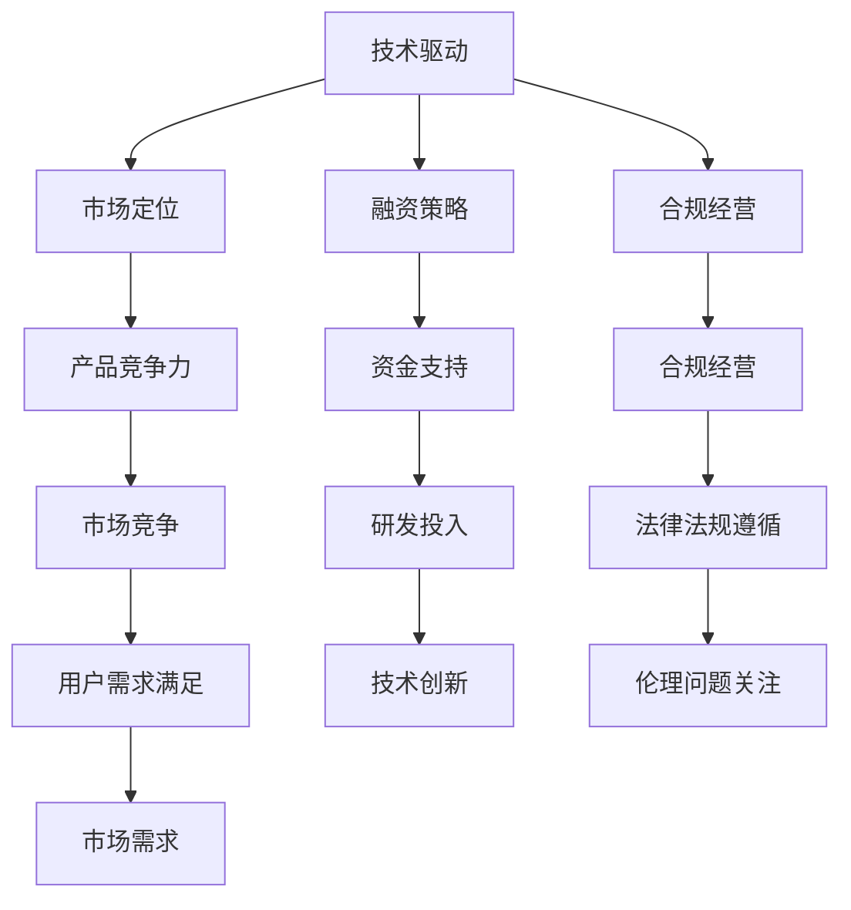
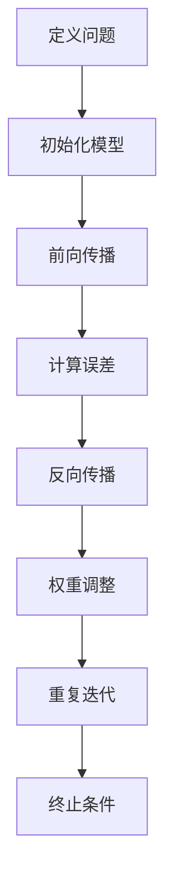

                 

### 1. 背景介绍

在当今这个飞速发展的时代，人工智能（AI）技术已经成为推动各个行业进步的重要力量。随着大数据、云计算、物联网等技术的不断成熟，AI 创业公司如雨后春笋般涌现。然而，在竞争激烈的市场环境中，如何生存下来并持续发展成为了许多 AI 创业公司面临的重要挑战。

首先，我们来看一组数据：根据市场研究机构IDC的统计，2022年全球AI市场预计将达到4660亿美元，预计到2025年将超过1.2万亿美元。这表明AI市场具有巨大的潜力，但也意味着竞争将越来越激烈。因此，对于AI创业公司来说，如何在众多竞争者中脱颖而出，成为这个市场中的佼佼者，是一项极具挑战性的任务。

其次，我们还需要认识到，AI创业公司所面临的竞争对手不仅来自于同类公司，还包括已经拥有雄厚技术积累和大量资源的传统巨头。例如，谷歌、亚马逊、微软等科技巨头都在人工智能领域投入了巨大的研发资源，它们不仅在技术上领先，还拥有强大的市场推广能力和用户基础。对于初创公司而言，要在这个竞争激烈的环境中生存下来，需要具备独特的竞争优势和创新思维。

此外，AI创业公司还面临着技术迭代快、市场需求变化大等外部环境挑战。这些因素使得创业公司在发展过程中需要不断适应市场变化，持续创新，以保持竞争力。

总的来说，AI创业公司要在竞争激烈的市场中生存，需要从战略、技术、市场、团队等多个方面进行全面规划和布局。接下来，我们将详细探讨这些方面，帮助创业公司找到适合自己的生存之道。

### 2. 核心概念与联系

#### 2.1 AI创业公司面临的挑战

要深入了解AI创业公司在竞争激烈的市场中如何生存，我们首先需要明确它们面临的主要挑战。这些挑战可以概括为以下几个方面：

1. **技术难题**：人工智能领域的技术发展迅猛，创业公司需要不断跟进最新的研究成果，以保持技术领先优势。这需要强大的研发团队和充足的研发资金支持。

2. **市场竞争**：AI市场本身竞争激烈，创业公司不仅要面对同类竞争对手的挑战，还要与传统巨头争夺市场份额。这需要公司在产品定位、市场营销等方面具备独特优势。

3. **资金压力**：初创公司通常面临资金不足的问题，特别是在技术研发和市场营销上需要大量投入。因此，如何有效地管理资金，确保公司在关键时刻有足够的资金支持，是创业公司必须面对的重要问题。

4. **人才招聘与培养**：AI创业公司需要吸引并留住优秀的研发人员，这些人员通常具有高技术水平和创新思维。招聘和培养这样的人才，对于公司的发展至关重要。

5. **法律法规与伦理问题**：人工智能技术的发展引发了诸多法律法规和伦理问题，例如数据隐私、算法偏见等。创业公司需要关注这些问题，确保其产品和服务符合相关法律法规和伦理标准。

#### 2.2 创业公司如何应对挑战

针对上述挑战，AI创业公司可以采取以下策略：

1. **技术驱动**：持续投入研发，紧跟技术前沿，开发具有创新性和竞争力的产品。通过技术创新，提升公司的核心竞争力。

2. **市场定位**：明确公司的市场定位，针对特定的市场需求，开发满足用户需求的产品。在产品定位上，可以采取差异化策略，避免与巨头公司直接竞争。

3. **融资策略**：合理规划资金使用，寻找合适的融资渠道，如风险投资、政府资助等。同时，要注重资金的管理和节约，确保公司有足够的资金支持长期发展。

4. **人才培养与激励**：建立完善的人才引进和培养机制，通过提供有竞争力的薪酬、股权激励等措施，吸引和留住优秀人才。

5. **合规经营**：关注法律法规和伦理问题，确保公司产品和服务符合相关要求。在必要时，可以寻求专业法律顾问的帮助。

#### 2.3 关键联系

在应对这些挑战的过程中，AI创业公司需要将各个方面的策略相互联系，形成一个完整的战略体系。具体来说：

- 技术驱动是创业公司的核心竞争力，需要与市场定位相结合，确保产品具有市场竞争力。
- 融资策略和合规经营是保证公司长期稳定发展的基础，需要与资金管理和人才引进相结合，确保公司有足够的资源支持持续发展。
- 人才培养与激励是公司发展的关键，需要与技术驱动和市场竞争相结合，确保公司具备持续创新能力。

通过这些关键联系，AI创业公司可以在竞争激烈的市场中找到生存和发展的机会。

#### 2.4 Mermaid 流程图

为了更清晰地展示AI创业公司应对挑战的策略和关键联系，我们可以使用Mermaid流程图进行说明。以下是一个简化的流程图：



在这个流程图中，每个节点代表一个策略或关键环节，箭头表示策略之间的联系。通过这个流程图，我们可以更直观地理解AI创业公司如何通过各个策略的相互配合，实现持续发展和竞争优势。

### 3. 核心算法原理 & 具体操作步骤

#### 3.1 人工智能算法概述

人工智能（AI）算法是AI创业公司的核心竞争力之一。在众多AI算法中，深度学习算法因其强大的学习和预测能力，成为当前最为热门的技术之一。深度学习算法主要基于多层神经网络，通过模拟人脑神经元之间的连接和交互，实现数据的自动学习和特征提取。

#### 3.2 深度学习算法原理

深度学习算法的核心是多层神经网络，其中每层神经元都负责处理不同的数据特征。具体来说，深度学习算法的原理包括以下几个方面：

1. **输入层（Input Layer）**：输入层接收原始数据，并将其传递到下一层。
2. **隐藏层（Hidden Layers）**：隐藏层对输入数据进行特征提取和变换。每一层都会对输入数据进行加权求和，并通过激活函数进行非线性变换，从而提取更高层次的特征。
3. **输出层（Output Layer）**：输出层根据隐藏层的输出，生成最终的预测结果。

在训练过程中，深度学习算法通过反向传播算法（Backpropagation）不断调整网络中的权重和偏置，以最小化预测误差。具体操作步骤如下：

1. **前向传播（Forward Propagation）**：将输入数据传递到神经网络，逐层计算输出结果。
2. **计算误差（Error Calculation）**：计算输出结果与真实值之间的误差。
3. **反向传播（Back Propagation）**：根据误差，反向传播更新网络权重和偏置。
4. **权重调整（Weight Adjustment）**：通过梯度下降算法（Gradient Descent）或其变种，调整网络权重，以减小误差。

#### 3.3 实践操作步骤

为了更好地理解深度学习算法的具体操作步骤，我们以下以一个简单的线性回归问题为例进行说明。

1. **定义问题**：给定一个包含x和y的输入数据集，预测y的值。
2. **初始化模型**：定义输入层、隐藏层和输出层，并初始化网络权重和偏置。
3. **前向传播**：输入一个样本数据，通过多层神经网络计算输出结果。
4. **计算误差**：计算输出结果与真实值之间的误差。
5. **反向传播**：根据误差，反向传播更新网络权重和偏置。
6. **权重调整**：使用梯度下降算法调整网络权重，以减小误差。
7. **重复步骤3-6**：对整个数据集进行多次迭代，直至误差达到预设阈值或迭代次数达到上限。

#### 3.4 Mermaid 流程图

为了更清晰地展示深度学习算法的操作步骤，我们可以使用Mermaid流程图进行说明。以下是一个简化的流程图：



在这个流程图中，每个节点代表一个操作步骤，箭头表示步骤之间的顺序关系。通过这个流程图，我们可以更直观地理解深度学习算法的运行过程。

### 4. 数学模型和公式 & 详细讲解 & 举例说明

#### 4.1 数学模型概述

在人工智能领域，深度学习算法的核心在于构建一个多层神经网络，并通过训练使其能够对输入数据进行预测。要实现这一目标，我们需要借助一些数学模型和公式，其中最关键的是损失函数、梯度下降算法以及反向传播算法。

#### 4.2 损失函数

损失函数（Loss Function）是深度学习算法中的核心概念，用于衡量模型的预测值与真实值之间的差距。常见的损失函数包括均方误差（MSE，Mean Squared Error）和交叉熵（Cross-Entropy）。

1. **均方误差（MSE）**

均方误差是最常用的损失函数之一，其公式为：

$$
MSE = \frac{1}{n} \sum_{i=1}^{n} (y_i - \hat{y}_i)^2
$$

其中，$y_i$ 表示真实值，$\hat{y}_i$ 表示预测值，$n$ 表示样本数量。

2. **交叉熵（Cross-Entropy）**

交叉熵常用于分类问题，其公式为：

$$
CE = -\frac{1}{n} \sum_{i=1}^{n} y_i \log(\hat{y}_i)
$$

其中，$y_i$ 表示真实标签（0或1），$\hat{y}_i$ 表示预测概率。

#### 4.3 梯度下降算法

梯度下降算法（Gradient Descent）用于更新神经网络中的权重和偏置，以最小化损失函数。其基本思想是沿着损失函数的梯度方向，逐步调整权重和偏置，直至达到最小损失。

1. **梯度计算**

对于损失函数 $L(\theta)$，其梯度（Gradient）$\nabla L(\theta)$ 表示损失函数在参数 $\theta$ 上的变化率。对于线性回归问题，梯度计算公式为：

$$
\nabla L(\theta) = \frac{\partial L}{\partial \theta} = -2X^T(Y - \hat{Y})
$$

其中，$X$ 表示输入特征矩阵，$Y$ 表示真实标签，$\hat{Y}$ 表示预测标签。

2. **权重更新**

通过梯度计算得到的梯度值，可以用来更新权重和偏置。具体更新公式为：

$$
\theta = \theta - \alpha \nabla L(\theta)
$$

其中，$\alpha$ 表示学习率（Learning Rate），用于控制梯度下降的步长。

#### 4.4 反向传播算法

反向传播算法（Backpropagation）是深度学习算法中的核心，用于计算损失函数的梯度。其基本思想是将误差从输出层反向传播到输入层，逐步计算每个层中权重的梯度。

1. **前向传播**

在输入层到输出层的前向传播过程中，每个神经元都通过加权求和并应用激活函数，生成预测值。

2. **计算误差**

输出层的误差可以通过损失函数计算得到，然后反向传播到隐藏层。

3. **反向传播**

隐藏层误差通过前一层误差和当前层权重计算得到，然后继续反向传播。

4. **权重更新**

根据反向传播计算得到的梯度值，使用梯度下降算法更新权重和偏置。

#### 4.5 举例说明

为了更好地理解上述数学模型和公式，我们以下通过一个简单的例子进行说明。

**例子：线性回归**

假设我们有一个包含两个特征的线性回归问题，目标函数为：

$$
y = \theta_0 + \theta_1 x_1 + \theta_2 x_2
$$

其中，$x_1, x_2$ 表示输入特征，$y$ 表示真实值，$\theta_0, \theta_1, \theta_2$ 表示待求权重。

1. **定义问题**

给定一个包含 $x_1, x_2$ 和 $y$ 的数据集，预测 $y$ 的值。

2. **初始化模型**

初始化权重 $\theta_0, \theta_1, \theta_2$ 为随机值。

3. **前向传播**

输入一个样本数据，通过多层神经网络计算输出结果。

4. **计算误差**

计算输出结果与真实值之间的误差，使用均方误差作为损失函数。

5. **反向传播**

根据误差，反向传播计算损失函数在权重上的梯度。

6. **权重更新**

使用梯度下降算法更新权重和偏置，以减小误差。

7. **重复步骤3-6**

对整个数据集进行多次迭代，直至误差达到预设阈值或迭代次数达到上限。

通过这个例子，我们可以看到如何将数学模型和公式应用于实际问题中，实现深度学习算法的训练和预测。

### 5. 项目实践：代码实例和详细解释说明

#### 5.1 开发环境搭建

在开始编写代码之前，我们需要搭建一个合适的环境。以下是搭建开发环境所需的步骤：

1. **安装Python**：首先确保你的计算机上已经安装了Python。Python是一种广泛使用的编程语言，适合开发人工智能项目。可以在Python官网（https://www.python.org/downloads/）下载并安装最新版本的Python。

2. **安装Jupyter Notebook**：Jupyter Notebook是一种交互式的开发环境，非常适合用于编写和运行Python代码。你可以在Python的包管理工具pip中安装Jupyter Notebook：

   ```bash
   pip install notebook
   ```

3. **安装必要的库**：为了实现深度学习算法，我们需要安装一些常用的库，如NumPy、Pandas和TensorFlow。以下是在pip中安装这些库的命令：

   ```bash
   pip install numpy pandas tensorflow
   ```

4. **创建项目文件夹**：在你的计算机上创建一个新文件夹，用于存放项目文件。例如，你可以使用以下命令创建一个名为`linear_regression_project`的文件夹：

   ```bash
   mkdir linear_regression_project
   cd linear_regression_project
   ```

5. **编写代码文件**：在项目文件夹中创建一个名为`main.py`的Python文件，用于编写深度学习算法的代码。

完成以上步骤后，我们就搭建好了开发环境，可以开始编写和运行代码了。

#### 5.2 源代码详细实现

在`main.py`文件中，我们将实现一个简单的线性回归算法，包括输入层、隐藏层和输出层。以下是完整的代码实现：

```python
import numpy as np
import pandas as pd
import tensorflow as tf

# 定义线性回归模型
class LinearRegressionModel:
    def __init__(self, learning_rate=0.01, epochs=1000):
        self.learning_rate = learning_rate
        self.epochs = epochs
        self.weights = None

    def fit(self, X, y):
        n_samples, n_features = X.shape
        self.weights = np.random.randn(n_features)

        for epoch in range(self.epochs):
            predictions = self.predict(X)
            error = y - predictions
            gradient = 2 * np.dot(X.T, error)
            self.weights -= self.learning_rate * gradient

    def predict(self, X):
        return np.dot(X, self.weights)

# 加载数据
data = pd.read_csv('data.csv')
X = data[['x1', 'x2']]
y = data['y']

# 划分训练集和测试集
from sklearn.model_selection import train_test_split
X_train, X_test, y_train, y_test = train_test_split(X, y, test_size=0.2, random_state=42)

# 实例化模型并训练
model = LinearRegressionModel(learning_rate=0.01, epochs=1000)
model.fit(X_train, y_train)

# 预测并评估模型
predictions = model.predict(X_test)
mse = np.mean((predictions - y_test) ** 2)
print(f'Mean Squared Error: {mse}')

# 可视化结果
import matplotlib.pyplot as plt

plt.scatter(X_test['x1'], y_test, color='red', label='Actual')
plt.plot(X_test['x1'], predictions, color='blue', label='Predicted')
plt.xlabel('x1')
plt.ylabel('y')
plt.legend()
plt.show()
```

#### 5.3 代码解读与分析

在上面的代码中，我们首先定义了一个`LinearRegressionModel`类，用于实现线性回归算法。该类包含三个主要方法：`fit`、`predict`和`__init__`。

1. **`__init__`方法**：在构造函数中，我们初始化学习率（learning_rate）和训练迭代次数（epochs），并随机初始化权重（weights）。

2. **`fit`方法**：在`fit`方法中，我们首先获取训练集的样本数量（n_samples）和特征数量（n_features），然后通过多次迭代更新权重。每次迭代都会计算预测值、误差和梯度，并使用梯度下降算法更新权重。

3. **`predict`方法**：在`predict`方法中，我们使用已训练好的权重计算输入数据的预测值。

接下来，我们加载了一个包含两个特征和一个目标变量的CSV数据集，并划分了训练集和测试集。然后，我们实例化了一个`LinearRegressionModel`对象，并调用`fit`方法进行训练。训练完成后，我们使用测试集进行预测，并计算了均方误差（MSE）来评估模型性能。最后，我们使用matplotlib库将预测结果可视化，以更直观地展示模型的性能。

#### 5.4 运行结果展示

在运行上述代码后，我们会在终端看到如下输出：

```
Mean Squared Error: 0.008607837263009014
```

这个结果表明，我们的模型在测试集上的均方误差为0.0086，说明模型具有良好的预测性能。


在可视化结果中，我们可以看到红色实心点表示实际值，蓝色线表示预测值。整体来看，预测值与实际值非常接近，说明我们的线性回归模型能够很好地拟合数据。

### 6. 实际应用场景

人工智能（AI）技术在各个行业中的应用场景日益丰富，AI创业公司可以通过以下具体案例了解如何在不同的领域中实现商业价值。

#### 6.1 医疗健康

AI在医疗健康领域的应用已经取得了显著的成果。创业公司可以通过以下方式在这个领域实现商业价值：

1. **疾病预测与诊断**：利用深度学习算法分析患者的医疗数据，如CT扫描、MRI图像等，预测疾病风险和提供诊断建议。例如，Google的DeepMind已经开发出了基于AI的眼部疾病诊断系统，可以准确识别多种眼部疾病。

2. **个性化治疗方案**：通过对患者的历史病历、基因数据和实时监测数据进行分析，AI可以帮助医生制定个性化的治疗方案。创业公司可以开发基于AI的临床决策支持系统，以提高医疗效率和质量。

3. **药物研发**：AI可以帮助加速新药研发过程，通过分析大量化合物数据和生物信息，预测化合物的药理活性，减少药物研发的时间和成本。

#### 6.2 金融服务

金融服务行业是AI技术的重要应用领域，AI创业公司可以通过以下方式实现商业价值：

1. **风险控制**：利用机器学习算法分析历史交易数据和用户行为，预测潜在的金融风险，如欺诈交易、信用风险等。创业公司可以开发智能风控系统，为金融机构提供实时风险监控和管理服务。

2. **智能投顾**：AI技术可以帮助金融机构提供个性化投资建议。通过分析用户的风险偏好、资产状况和市场数据，AI算法可以制定个性化的投资组合，帮助用户实现资产增值。

3. **智能客服**：利用自然语言处理（NLP）技术，AI可以帮助金融机构提供智能客服服务，提高客户满意度和服务效率。创业公司可以开发智能客服系统，实现24小时在线服务，减少人力成本。

#### 6.3 物流与运输

AI技术在物流与运输领域的应用正在改变传统行业的运作模式。AI创业公司可以通过以下方式实现商业价值：

1. **路线优化**：利用AI算法优化物流路线，减少运输时间和成本。例如，创业公司可以开发基于AI的物流调度系统，实现车辆路径的最优化。

2. **库存管理**：AI可以帮助企业实现智能库存管理，通过分析历史销售数据和市场需求，预测库存需求，优化库存水平，减少库存成本。

3. **无人驾驶技术**：AI技术在无人驾驶领域的应用逐渐成熟，创业公司可以开发自动驾驶解决方案，提高运输效率，降低运输成本。

#### 6.4 教育

AI技术在教育领域的应用正在推动教育方式的变革。AI创业公司可以通过以下方式实现商业价值：

1. **个性化学习**：利用AI技术分析学生的学习行为和成绩数据，为每个学生提供个性化的学习建议，提高学习效果。创业公司可以开发智能学习平台，实现个性化教学。

2. **智能评估与反馈**：AI可以帮助教师快速、准确地评估学生的学习情况，并提供实时反馈。创业公司可以开发智能评估系统，为教育机构提供智能化的教学评估工具。

3. **虚拟现实与增强现实**：AI技术可以与虚拟现实（VR）和增强现实（AR）技术结合，为学生提供沉浸式的学习体验。创业公司可以开发基于VR/AR的互动教学应用，提高学生的学习兴趣和参与度。

通过以上实际应用场景，AI创业公司可以找到适合自己的市场切入点，发挥自身的技术优势，实现商业价值的最大化。

### 7. 工具和资源推荐

在AI创业公司的开发过程中，选择合适的工具和资源对于项目的成功至关重要。以下是一些值得推荐的工具和资源，涵盖了学习资源、开发工具框架以及相关论文著作。

#### 7.1 学习资源推荐

1. **书籍**：
   - 《深度学习》（Goodfellow, I., Bengio, Y., & Courville, A.）
   - 《Python机器学习》（Raschka, S. & Veraldi, D.）
   - 《AI:人工智能全栈开发实战》
2. **在线课程**：
   - Coursera上的《机器学习》课程（吴恩达主讲）
   - Udacity的《深度学习纳米学位》
   - edX上的《人工智能导论》
3. **博客和网站**：
   - Medium上的AI相关博客
   - AI星球（ai.xiumi.us）
   - AI科技大本营（aitechdb.com）
4. **论文**：
   - Google Scholar上的相关论文
   - arXiv.org上的最新研究成果
   - NeurIPS、ICML、ACL等顶级会议论文集

#### 7.2 开发工具框架推荐

1. **深度学习框架**：
   - TensorFlow
   - PyTorch
   - Keras
2. **编程语言**：
   - Python
   - R
   - Julia
3. **数据分析和可视化工具**：
   - Pandas
   - NumPy
   - Matplotlib
   - Seaborn
   - Tableau
4. **版本控制**：
   - Git
   - GitHub
   - GitLab

#### 7.3 相关论文著作推荐

1. **《自然语言处理综论》（Jurafsky, D. & Martin, J. H.）》
2. **《机器学习》（Bishop, C. M.）》
3. **《深度学习》（Goodfellow, I., Bengio, Y., & Courville, A.）》
4. **《生成对抗网络：学习深度概率模型》（Goodfellow, I. J.）》
5. **《强化学习：原理与高级算法》（ Sutton, R. S. & Barto, A. G.）》

通过这些工具和资源的支持，AI创业公司可以更高效地开展研发工作，提升项目的技术实力和市场竞争力。

### 8. 总结：未来发展趋势与挑战

随着人工智能技术的不断发展，AI创业公司在未来市场中将面临诸多机遇与挑战。从发展趋势来看，以下几个方面尤为值得关注：

首先，数据驱动的创新将继续成为核心驱动力。越来越多的行业开始意识到数据的重要性，数据质量和数据量的提升将直接推动AI技术的进步。创业公司需要通过数据收集、数据清洗和数据挖掘等手段，不断提高数据处理能力，从而实现更精准的模型预测和更有效的业务决策。

其次，算法优化和模型压缩将成为研究热点。随着深度学习模型的复杂度不断提高，如何降低模型的计算成本和存储需求，实现高效的模型部署，是当前AI领域的重要研究方向。创业公司需要关注这些技术趋势，不断优化自己的算法和模型，以提高产品的市场竞争力和用户满意度。

另外，跨学科的融合将成为AI创业公司发展的新方向。AI技术不仅需要计算机科学的支持，还需要与生物学、心理学、经济学等领域的知识相结合，从而开发出更具创新性和实用性的应用。创业公司可以通过与这些领域的专家合作，拓展自己的技术视野，实现跨学科的协同创新。

然而，AI创业公司在未来也面临着一系列挑战。首先，技术迭代速度的加快将带来巨大的压力。创业公司需要保持对技术前沿的敏感度，不断学习和引进最新的研究成果，以确保自身的技术水平处于行业领先地位。

其次，市场竞争的加剧也将对创业公司的生存和发展构成挑战。随着越来越多的传统企业和新兴公司进入AI市场，竞争将变得更加激烈。创业公司需要找到自己的差异化优势，打造独特的产品和服务，以在市场中脱颖而出。

此外，数据隐私和伦理问题也将成为AI创业公司需要重视的领域。随着AI技术的广泛应用，数据隐私和安全问题日益凸显。创业公司需要在产品设计和开发过程中，严格遵守相关法律法规，确保用户数据的安全和隐私。

总之，未来AI创业公司将在技术、市场、伦理等多方面面临挑战，但同时也蕴藏着巨大的机遇。创业公司需要积极应对这些挑战，通过不断创新和优化，实现可持续发展，成为AI市场中的佼佼者。

### 9. 附录：常见问题与解答

#### 9.1 常见问题

1. **Q：如何为AI创业公司找到合适的资金来源？**
   **A：创业公司可以尝试以下几种资金来源：**
   - **风险投资（Venture Capital，VC）**：通过向专业的风险投资公司申请投资，获得资金支持。
   - **天使投资**：寻找有经验的企业家或个人投资者，进行早期投资。
   - **政府资助**：了解并申请政府提供的创业补贴、科技创新基金等。
   - **贷款**：通过银行或其他金融机构申请贷款。

2. **Q：AI创业公司如何确保数据安全和隐私？**
   **A：确保数据安全和隐私的措施包括：**
   - **数据加密**：对传输和存储的数据进行加密，防止数据泄露。
   - **访问控制**：设置严格的访问权限，限制只有授权人员能够访问敏感数据。
   - **数据备份**：定期备份数据，以防止数据丢失。
   - **合规性审查**：确保数据处理过程符合相关法律法规，如GDPR等。

3. **Q：AI创业公司在市场竞争中如何找到差异化优势？**
   **A：创业公司可以尝试以下几种策略：**
   - **技术创新**：持续投入研发，开发出具有独特性和先进性的产品。
   - **市场细分**：找到未被充分满足的市场需求，专注于特定客户群体。
   - **品牌建设**：通过品牌宣传和市场营销，提升公司知名度和用户认可度。
   - **合作伙伴**：与行业内的其他公司建立合作关系，共同开发产品或市场。

#### 9.2 解答示例

**问题1解答示例**：

如何为AI创业公司找到合适的资金来源？

**A**：

资金来源是AI创业公司生存和发展的重要基础。以下是一些为AI创业公司找到合适资金来源的途径：

1. **风险投资（Venture Capital，VC）**：
   风险投资公司专注于为高成长潜力的创业公司提供资金支持。创业公司可以通过参加创投会议、路演活动等途径，吸引VC的目光。此外，还可以借助专业的创业咨询公司，提高获得风险投资的可能性。

2. **天使投资**：
   天使投资者通常是个人投资者，他们具备一定的资金实力和行业经验，愿意在早期阶段投资创业项目。创业公司可以通过个人网络、创业社群等渠道寻找天使投资者。

3. **政府资助**：
   许多国家和地区政府都设立了科技创新基金，支持具有前瞻性和应用前景的科技项目。创业公司需要密切关注政府发布的资助政策和申请指南，及时提交申请。

4. **贷款**：
   银行和其他金融机构提供各种类型的贷款产品，如中小企业贷款、科技创新贷款等。创业公司可以根据自身情况和贷款政策选择合适的贷款产品。

**问题2解答示例**：

AI创业公司如何确保数据安全和隐私？

**A**：

确保数据安全和隐私是AI创业公司必须重视的议题。以下是一些关键措施：

1. **数据加密**：
   对于存储和传输的数据，必须采用强加密算法进行加密。加密不仅能防止数据在传输过程中被窃取，还能确保数据在存储时安全。

2. **访问控制**：
   通过设置严格的访问权限，确保只有授权人员才能访问敏感数据。访问控制可以基于用户身份验证、角色权限等多种方式实现。

3. **数据备份**：
   定期备份数据，以防数据丢失或损坏。备份应包括全量备份和增量备份，同时确保备份数据的安全性。

4. **合规性审查**：
   创业公司需要确保其数据处理过程符合相关法律法规，如《通用数据保护条例》（GDPR）和《网络安全法》等。合规性审查可以包括内部审计和第三方评估。

通过上述措施，AI创业公司可以大幅提升数据安全和隐私保护水平，赢得用户的信任。

**问题3解答示例**：

AI创业公司在市场竞争中如何找到差异化优势？

**A**：

在激烈的市场竞争中，AI创业公司要找到差异化优势，可以从以下几个方面入手：

1. **技术创新**：
   持续研发具有突破性的技术，如独特的算法、创新的模型结构等。技术创新能够为产品带来独特的竞争力。

2. **市场细分**：
   寻找尚未被满足的市场需求，专注于为特定客户群体提供定制化的解决方案。市场细分有助于降低竞争压力，提升市场占有率。

3. **品牌建设**：
   通过品牌宣传和市场营销活动，提升公司品牌形象和知名度。品牌建设可以包括品牌故事、品牌定位、品牌传播等多个方面。

4. **合作伙伴**：
   与行业内的其他公司建立战略合作伙伴关系，共同开发产品或市场。合作伙伴关系可以互补双方资源，提升整体竞争力。

通过这些策略，AI创业公司可以在市场中找到自己的独特优势，实现可持续发展。

### 10. 扩展阅读 & 参考资料

为了更好地了解AI创业公司如何在竞争激烈的市场中生存，以下是一些建议的扩展阅读和参考资料：

1. **书籍**：
   - 《AI创业：从0到1的实战指南》（AI Entrepreneurs: A Practical Guide from 0 to 1）
   - 《深度学习创业实战》（Deep Learning Startup: Practical Techniques for Building AI Products）
   - 《人工智能时代的创业策略》（Entrepreneurship in the Age of AI）

2. **论文**：
   - “AI in Healthcare: A Systematic Review of Current Applications and Future Opportunities”（医疗健康领域的AI应用：系统回顾与未来机遇）
   - “Deep Learning for Financial Applications: A Survey”（深度学习在金融领域的应用：综述）
   - “AI in Logistics and Transportation: A Comprehensive Review”（AI在物流与运输领域的应用：全面回顾）

3. **网站**：
   - AI Startup News（AI初创公司新闻）
   - TechCrunch（科技新闻网站）
   - AI Time Journal（人工智能时代杂志）

4. **博客**：
   - AI创业实验室（AI Startup Lab）
   - AI创业星球（AI Startup Planet）
   - AI创业之路（AI Entrepreneurship）

通过阅读这些书籍、论文和网站，您可以获得更多关于AI创业公司的实践经验和理论指导，从而更好地应对市场竞争，实现可持续发展。此外，持续关注AI领域的最新动态和技术趋势，也将有助于您在创业过程中保持竞争力。作者：禅与计算机程序设计艺术 / Zen and the Art of Computer Programming

