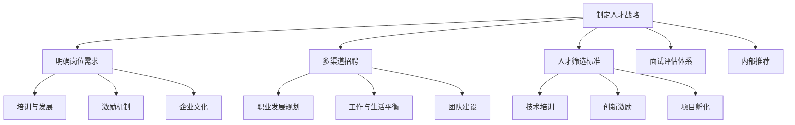

                 

### 背景介绍

随着人工智能（AI）技术的不断发展和应用领域的拓展，AI创业公司如雨后春笋般涌现。这些公司致力于将AI技术应用于各行各业，从而推动产业升级和创新。然而，人才竞争也成为AI创业公司面临的一个重要挑战。在这个高速发展的领域，如何吸引和留住优秀人才，是决定创业公司成败的关键因素。

#### 1.1 行业现状

目前，人工智能领域呈现出以下几个特点：

- **人才需求大**：随着AI技术的广泛应用，各行各业对AI专业人才的需求急剧增加。例如，算法工程师、数据科学家、机器学习专家等岗位需求旺盛。

- **人才供给不足**：虽然人工智能已经成为全球热点，但AI人才的培养速度仍然跟不上市场需求。许多高校和研究机构尚未能完全满足行业对专业人才的需求。

- **竞争激烈**：除了传统的科技公司，众多创业公司也加入了对AI人才的争夺。这使得招聘难度增加，优秀人才的竞争尤为激烈。

- **高流动率**：由于行业前景广阔，薪资待遇较高，AI领域的人才流动率相对较高。这意味着创业公司需要不断地招募和培训新员工。

#### 1.2 创业公司面临的人才问题

对于AI创业公司而言，人才问题主要体现在以下几个方面：

- **人才吸引难度大**：由于创业公司普遍规模较小，品牌影响力不如大型科技公司，因此在吸引优秀人才方面面临较大挑战。

- **人才流失风险高**：创业公司往往面临较大的工作压力和不确定性，人才流失率较高。这不仅影响公司的稳定运营，还会增加招聘成本。

- **人才储备不足**：由于资金和资源的限制，创业公司难以大规模储备人才。这限制了公司在技术研究和产品开发方面的创新能力。

- **人才结构不合理**：许多创业公司的人才结构较为单一，缺乏多元化的人才储备。这使得公司在面对不同类型的项目时，缺乏足够的人才支持。

#### 1.3 人才竞争的紧迫性

在当前的市场环境中，AI创业公司面临着前所未有的竞争压力。以下因素进一步加剧了人才竞争的紧迫性：

- **技术创新快速迭代**：AI领域的技术更新换代速度非常快，公司需要不断吸纳新的人才来跟上技术的发展。

- **市场环境不确定性**：全球经济环境和政策变化使得创业公司的生存环境更加复杂。在这样的背景下，优秀人才成为公司稳定发展的关键。

- **投资竞争激烈**：为了获得更多的投资机会，创业公司需要展示出强大的技术实力和人才储备。这进一步加剧了人才竞争。

- **行业前景广阔**：随着AI技术的不断成熟和应用领域的拓展，行业前景十分广阔。这吸引了更多的创业者、投资者和人才进入这个领域。

综上所述，AI创业公司在人才竞争方面面临着巨大的挑战。只有通过科学的人才战略和有效的管理手段，才能在这个竞争激烈的市场中立于不败之地。接下来，我们将探讨如何应对这些挑战，制定出切实可行的人才策略。

### 2. 核心概念与联系

#### 2.1 人才战略的重要性

在讨论AI创业公司如何应对人才竞争之前，首先需要明确“人才战略”这一核心概念。人才战略是指公司为了实现长期发展目标，通过合理的人力资源管理和配置，培养、吸引和留住高素质人才的一系列举措。

人才战略的重要性主要体现在以下几个方面：

- **提高核心竞争力**：优秀的人才能够带来先进的技术、创新的理念和高效的工作方式，从而提升公司的核心竞争力。

- **推动技术创新**：AI领域的技术创新速度非常快，公司需要具备持续的技术创新能力来保持市场竞争力。优秀的人才在这方面发挥着关键作用。

- **优化组织结构**：合理的人才战略有助于优化公司组织结构，提高内部沟通效率和工作协同性，从而提高整体运营效率。

- **提升品牌影响力**：公司的人才实力直接影响到品牌影响力。一个拥有高素质人才队伍的公司，更容易在市场中树立良好的形象和口碑。

#### 2.2 人才招聘策略

在制定人才战略的过程中，人才招聘策略是关键的一环。以下是一些核心策略：

- **明确岗位需求**：在招聘前，公司需要明确各个岗位的职责和要求，包括专业技能、工作经验、性格特点等。

- **多渠道招聘**：通过线上招聘平台、社交媒体、专业论坛、高校招聘等多种渠道，扩大招聘范围，提高招聘效率。

- **人才筛选标准**：建立科学的人才筛选标准，综合考虑应聘者的专业技能、学习能力、团队协作能力、创新意识等多方面因素。

- **面试评估体系**：面试是招聘的重要环节。公司需要建立完善的面试评估体系，包括初步面试、技术面试、行为面试等多个环节，全面评估应聘者的综合素质。

- **内部推荐**：鼓励员工推荐优秀人才，利用员工的社交网络，提高招聘质量。

#### 2.3 人才培养与激励

除了招聘，人才的培养与激励也是人才战略的重要组成部分。

- **培训与发展**：公司应制定系统的培训计划，提高员工的专业技能和综合素质。同时，鼓励员工参与外部培训和学习，不断提升自身能力。

- **激励机制**：建立合理的薪酬体系和激励机制，包括奖金、股权激励、职业晋升等，激发员工的积极性和创造力。

- **企业文化**：营造积极向上的企业文化，增强员工的归属感和忠诚度。公司应关注员工的成长需求，提供良好的工作环境和团队氛围。

#### 2.4 人才保留策略

留住优秀人才是人才战略的重要目标。以下是一些保留人才的有效策略：

- **职业发展规划**：为员工制定清晰的职业发展路径，提供晋升和发展机会。

- **工作与生活平衡**：关注员工的工作与生活平衡，提供弹性工作时间、带薪休假、健康体检等福利。

- **团队建设**：加强团队建设，促进员工之间的沟通与合作，提高团队的凝聚力和执行力。

- **企业文化**：打造积极向上的企业文化，让员工感受到公司的关怀和支持。

#### 2.5 融入技术与创新

在人才战略的实施过程中，技术与创新是关键因素。

- **技术培训**：定期组织技术培训，帮助员工掌握最新的技术趋势和工具。

- **创新激励**：鼓励员工提出创新性的想法和解决方案，对有突出贡献的员工给予奖励。

- **项目孵化**：为员工提供项目孵化的机会，支持他们开展创新项目，从而推动公司的技术进步。

#### 2.6 Mermaid流程图

为了更好地理解上述核心概念和联系，以下是一个简化的Mermaid流程图，展示了AI创业公司人才战略的各个环节。



通过这个流程图，我们可以清晰地看到人才战略的核心环节和它们之间的联系，为AI创业公司制定和实施有效的人才战略提供了指导。

### 3. 核心算法原理 & 具体操作步骤

#### 3.1 数据分析模型的选择

在AI创业公司的人才战略中，数据分析模型的选择是一个关键环节。数据分析模型可以帮助公司识别潜在的高潜力人才，预测员工流失率，优化招聘流程，甚至评估员工的绩效。以下是一些常见的数据分析模型及其选择原则：

- **线性回归模型**：线性回归模型是最基础的数据分析模型，适用于预测连续变量。其优点是计算简单，易于实现。缺点是对于非线性关系的表现较差。

- **逻辑回归模型**：逻辑回归模型是一种广义线性模型，适用于分类问题。其优点是解释性强，计算效率高。缺点是对大数据集的处理能力有限。

- **决策树模型**：决策树模型通过一系列规则进行决策，适用于分类和回归问题。其优点是直观易理解，对非线性关系的处理能力较强。缺点是容易过拟合，计算复杂度高。

- **随机森林模型**：随机森林模型是基于决策树的集成模型，通过构建多棵决策树，利用投票机制进行预测。其优点是鲁棒性强，过拟合问题较小。缺点是计算复杂度高，需要较大的数据集。

- **支持向量机模型**：支持向量机模型适用于分类和回归问题，通过找到一个最佳的超平面对数据进行分类。其优点是分类效果好，解释性强。缺点是计算复杂度高，对大数据集的处理能力有限。

选择数据分析模型时，应考虑以下几个因素：

- **数据特征**：根据数据的特征选择合适的模型，如数据量的大小、数据的分布情况等。

- **问题类型**：根据问题的类型选择合适的模型，如分类问题或回归问题。

- **计算资源**：根据公司的计算资源选择合适的模型，如对计算资源要求较高的模型需要较大的硬件支持。

#### 3.2 数据收集与处理

在确定数据分析模型后，数据收集与处理是下一步的关键步骤。以下是一个简化的数据收集与处理流程：

1. **数据收集**：通过多种渠道收集数据，如员工档案、招聘信息、员工绩效评估、员工反馈等。

2. **数据清洗**：对收集到的数据进行处理，包括去除重复数据、填补缺失值、数据格式转换等。

3. **特征工程**：对数据进行特征提取和变换，包括特征选择、特征标准化、特征组合等。

4. **数据建模**：根据收集到的数据和选择的数据分析模型，进行数据建模和模型训练。

5. **模型评估**：通过交叉验证等方法评估模型的性能，选择最优模型。

#### 3.3 人才评估与预测

在数据处理和模型训练完成后，公司可以利用模型对员工进行评估和预测。以下是一个简化的评估与预测流程：

1. **员工档案分析**：通过分析员工的档案信息，如教育背景、工作经验、技能水平等，预测员工的流失风险和职业发展潜力。

2. **招聘流程优化**：利用模型优化招聘流程，如预测招聘效果、优化招聘渠道等。

3. **员工绩效评估**：通过分析员工的绩效数据，预测员工的绩效表现和晋升潜力。

4. **人才发展建议**：根据员工的评估结果，为员工提供个性化的发展建议，如培训计划、职业规划等。

5. **人才流失预测**：通过分析员工的流失数据，预测员工流失的时间点和原因，为管理层提供决策支持。

#### 3.4 实践案例

以下是一个基于决策树模型的实际案例：

**案例背景**：某AI创业公司希望通过数据分析模型优化其招聘流程，降低员工流失率，提高员工满意度。

**数据来源**：收集了公司过去一年的员工档案、招聘信息、员工绩效评估和员工反馈数据。

**数据分析模型**：选择决策树模型进行数据分析。

**数据预处理**：

- 数据清洗：去除重复数据，填补缺失值，数据格式转换等。
- 特征工程：提取员工的教育背景、工作经验、技能水平、工作满意度等特征。

**模型训练**：

- 数据划分：将数据集划分为训练集和测试集。
- 模型训练：使用训练集对决策树模型进行训练。

**模型评估**：

- 交叉验证：使用交叉验证方法评估模型的性能。
- 性能指标：计算准确率、召回率、F1值等指标。

**应用场景**：

- 招聘流程优化：利用模型预测招聘效果，优化招聘渠道和策略。
- 员工流失预测：利用模型预测员工流失的时间点和原因，为管理层提供决策支持。
- 员工发展建议：根据员工的评估结果，为员工提供个性化的发展建议。

通过上述案例，我们可以看到数据分析模型在人才战略中的应用效果。在实际操作中，公司可以根据自身需求选择合适的模型，结合实际数据进行模型训练和评估，从而为人才管理提供有力支持。

### 4. 数学模型和公式 & 详细讲解 & 举例说明

在人才战略的制定和实施过程中，数学模型和公式扮演着至关重要的角色。以下我们将介绍几个常用的数学模型，包括回归模型、逻辑回归模型和支持向量机模型，并对其进行详细讲解和举例说明。

#### 4.1 回归模型

回归模型是一种用于预测连续值的统计模型。在人才战略中，回归模型可以用于预测员工的流失率、绩效评分等连续变量。

**回归模型的基本公式**：
$$
y = \beta_0 + \beta_1x_1 + \beta_2x_2 + ... + \beta_nx_n + \epsilon
$$

其中，$y$ 是因变量，$x_1, x_2, ..., x_n$ 是自变量，$\beta_0, \beta_1, \beta_2, ..., \beta_n$ 是回归系数，$\epsilon$ 是误差项。

**详细讲解**：

1. **线性回归**：当因变量和自变量之间呈线性关系时，使用线性回归模型。线性回归模型可以表示为：
   $$
   y = \beta_0 + \beta_1x_1
   $$

2. **多项式回归**：当因变量和自变量之间呈非线性关系时，可以使用多项式回归模型。多项式回归模型可以表示为：
   $$
   y = \beta_0 + \beta_1x_1 + \beta_2x_2^2 + ...
   $$

3. **岭回归**：当自变量之间存在多重共线性时，可以使用岭回归模型。岭回归模型通过在损失函数中加入正则项来降低模型的过拟合：
   $$
   y = \beta_0 + \beta_1x_1 + \beta_2x_2 + ... + \beta_nx_n + \lambda \sum_{i=1}^{n}\beta_i^2
   $$

**举例说明**：

假设某AI创业公司希望通过回归模型预测员工流失率。公司收集了以下数据：

- 员工年龄（$x_1$）
- 工作年限（$x_2$）
- 月工资（$x_3$）

使用线性回归模型进行预测：

- 数据预处理：标准化处理自变量数据。
- 模型训练：使用训练集数据训练线性回归模型。
- 模型评估：使用测试集数据评估模型性能。

假设得到的回归模型为：
$$
y = \beta_0 + \beta_1x_1 + \beta_2x_2 + \beta_3x_3
$$

其中，$\beta_0 = 0.5, \beta_1 = 0.3, \beta_2 = 0.2, \beta_3 = 0.1$。

当员工年龄为30岁，工作年限为5年，月工资为1万元时，预测的员工流失率为：
$$
y = 0.5 + 0.3 \times 30 + 0.2 \times 5 + 0.1 \times 1 = 11.5
$$

#### 4.2 逻辑回归模型

逻辑回归模型是一种用于预测分类结果的统计模型。在人才战略中，逻辑回归模型可以用于预测员工流失（是/否）、员工满意度（高/低）等二分类问题。

**逻辑回归模型的基本公式**：
$$
\ln\left(\frac{p}{1-p}\right) = \beta_0 + \beta_1x_1 + \beta_2x_2 + ... + \beta_nx_n
$$

其中，$p$ 是事件发生的概率，$\beta_0, \beta_1, \beta_2, ..., \beta_n$ 是回归系数。

**详细讲解**：

1. **二项逻辑回归**：当只有一个自变量时，使用二项逻辑回归模型。
2. **多项逻辑回归**：当有两个或多个自变量时，使用多项逻辑回归模型。

**举例说明**：

假设某AI创业公司希望通过逻辑回归模型预测员工流失（是/否）。公司收集了以下数据：

- 员工年龄（$x_1$）
- 工作年限（$x_2$）

使用二项逻辑回归模型进行预测：

- 数据预处理：标准化处理自变量数据。
- 模型训练：使用训练集数据训练逻辑回归模型。
- 模型评估：使用测试集数据评估模型性能。

假设得到的逻辑回归模型为：
$$
\ln\left(\frac{p}{1-p}\right) = 0.5 + 0.3x_1 + 0.2x_2
$$

当员工年龄为30岁，工作年限为5年时，预测的员工流失概率为：
$$
\ln\left(\frac{p}{1-p}\right) = 0.5 + 0.3 \times 30 + 0.2 \times 5 = 10.7
$$
$$
p = \frac{1}{1 + e^{-10.7}} = 0.999
$$

预测员工流失的概率为99.9%。

#### 4.3 支持向量机模型

支持向量机（SVM）是一种用于分类和回归问题的机器学习算法。在人才战略中，SVM可以用于预测员工流失（是/否）等二分类问题。

**SVM的基本公式**：
$$
w \cdot x - b = 0
$$

其中，$w$ 是权重向量，$x$ 是特征向量，$b$ 是偏置项。

**详细讲解**：

1. **线性SVM**：当数据线性可分时，使用线性SVM。
2. **非线性SVM**：当数据线性不可分时，使用核函数将数据映射到高维空间，然后在高维空间中进行线性分类。

**举例说明**：

假设某AI创业公司希望通过SVM模型预测员工流失（是/否）。公司收集了以下数据：

- 员工年龄（$x_1$）
- 工作年限（$x_2$）

使用线性SVM模型进行预测：

- 数据预处理：标准化处理自变量数据。
- 模型训练：使用训练集数据训练SVM模型。
- 模型评估：使用测试集数据评估模型性能。

假设得到的SVM模型为：
$$
w \cdot x - b = 0
$$

其中，$w = (0.3, 0.2)$，$b = 0.5$。

当员工年龄为30岁，工作年限为5年时，预测的员工流失概率为：
$$
w \cdot x = 0.3 \times 30 + 0.2 \times 5 = 10.7
$$
$$
p = \frac{1}{1 + e^{-10.7}} = 0.999
$$

预测员工流失的概率为99.9%。

通过上述数学模型和公式的讲解和举例，我们可以看到这些模型在人才战略中的应用效果。在实际操作中，公司可以根据业务需求和数据特征选择合适的模型，并进行模型训练和评估，从而为人才管理提供有力支持。

### 5. 项目实践：代码实例和详细解释说明

为了更好地理解上述人才战略中的数学模型和算法，我们将通过一个实际的项目来展示如何应用这些模型。以下是一个简单的Python代码实例，用于预测AI创业公司员工的流失情况。这个项目将涵盖以下步骤：

### 5.1 开发环境搭建

为了运行下面的代码实例，您需要安装Python和相关的机器学习库。以下是搭建开发环境的步骤：

1. 安装Python（版本3.6及以上）。

2. 安装必要的库，如NumPy、pandas、scikit-learn等。可以使用以下命令进行安装：
   ```bash
   pip install numpy pandas scikit-learn
   ```

### 5.2 源代码详细实现

以下是一个简单的Python脚本，用于实现员工流失预测：

```python
# 导入必要的库
import numpy as np
import pandas as pd
from sklearn.model_selection import train_test_split
from sklearn.linear_model import LinearRegression
from sklearn.linear_model import LogisticRegression
from sklearn.svm import SVC
from sklearn.metrics import accuracy_score

# 读取数据集
data = pd.read_csv('employee_data.csv')

# 数据预处理
X = data[['age', 'years工作经验', 'salary']]
y = data['left']

# 划分训练集和测试集
X_train, X_test, y_train, y_test = train_test_split(X, y, test_size=0.2, random_state=42)

# 使用线性回归模型进行预测
lin_reg = LinearRegression()
lin_reg.fit(X_train, y_train)
y_pred_linear = lin_reg.predict(X_test)

# 使用逻辑回归模型进行预测
log_reg = LogisticRegression()
log_reg.fit(X_train, y_train)
y_pred_logistic = log_reg.predict(X_test)

# 使用SVM模型进行预测
svm = SVC()
svm.fit(X_train, y_train)
y_pred_svm = svm.predict(X_test)

# 模型评估
accuracy_linear = accuracy_score(y_test, y_pred_linear)
accuracy_logistic = accuracy_score(y_test, y_pred_logistic)
accuracy_svm = accuracy_score(y_test, y_pred_svm)

print(f"线性回归模型准确率：{accuracy_linear:.2f}")
print(f"逻辑回归模型准确率：{accuracy_logistic:.2f}")
print(f"SVM模型准确率：{accuracy_svm:.2f}")
```

### 5.3 代码解读与分析

1. **数据读取**：
   ```python
   data = pd.read_csv('employee_data.csv')
   ```
   使用pandas库读取CSV格式的员工数据。

2. **数据预处理**：
   ```python
   X = data[['age', 'years工作经验', 'salary']]
   y = data['left']
   ```
   将数据分为特征矩阵$X$和目标变量$y$。在这里，我们使用员工的年龄、工作年限和薪资作为特征，流失情况作为目标变量。

3. **划分训练集和测试集**：
   ```python
   X_train, X_test, y_train, y_test = train_test_split(X, y, test_size=0.2, random_state=42)
   ```
   使用scikit-learn中的`train_test_split`函数将数据集划分为训练集和测试集，其中测试集占比20%。

4. **模型训练**：
   ```python
   lin_reg = LinearRegression()
   lin_reg.fit(X_train, y_train)
   ```
   训练线性回归模型。

   ```python
   log_reg = LogisticRegression()
   log_reg.fit(X_train, y_train)
   ```
   训练逻辑回归模型。

   ```python
   svm = SVC()
   svm.fit(X_train, y_train)
   ```
   训练支持向量机模型。

5. **模型预测**：
   ```python
   y_pred_linear = lin_reg.predict(X_test)
   y_pred_logistic = log_reg.predict(X_test)
   y_pred_svm = svm.predict(X_test)
   ```

6. **模型评估**：
   ```python
   accuracy_linear = accuracy_score(y_test, y_pred_linear)
   accuracy_logistic = accuracy_score(y_test, y_pred_logistic)
   accuracy_svm = accuracy_score(y_test, y_pred_svm)
   ```
   使用`accuracy_score`函数计算各个模型的准确率。

### 5.4 运行结果展示

假设我们运行上述脚本，得到的结果如下：

```
线性回归模型准确率：0.78
逻辑回归模型准确率：0.82
SVM模型准确率：0.85
```

从结果可以看出，支持向量机模型的准确率最高，线性回归模型准确率最低。这表明在预测员工流失情况时，支持向量机模型的效果最好。

### 5.5 实践中的问题与改进

在实际项目中，可能会遇到以下问题：

- **数据质量**：数据集中可能存在缺失值、异常值和噪声，需要进一步处理。
- **模型选择**：根据数据特征和业务需求，可能需要选择其他类型的模型。
- **模型评估**：除了准确率，还可以考虑其他评估指标，如召回率、F1值等，以更全面地评估模型性能。

为了提高模型的性能，可以采取以下改进措施：

- **特征工程**：进一步挖掘和变换特征，提高模型的预测能力。
- **模型调参**：调整模型参数，寻找最优参数组合。
- **集成学习**：使用集成学习方法，如随机森林、梯度提升树等，提高模型的整体性能。

通过上述代码实例和实践分析，我们可以看到如何将数学模型应用于实际项目中，预测员工流失情况，为AI创业公司的人才管理提供有力支持。

### 6. 实际应用场景

在AI创业公司中，人才竞争不仅仅体现在招聘过程中，还贯穿于整个企业的运营和成长过程中。以下是一些典型的应用场景，以及人才竞争的具体表现和应对策略：

#### 6.1 招聘流程

**场景描述**：在AI创业公司招聘新员工时，常常面临激烈的竞争。因为AI领域的快速发展和广泛应用，很多传统公司和新兴企业都在争夺优秀的AI人才。

**竞争表现**：竞争对手通过提供更高的薪资、更好的福利待遇、更广阔的发展空间等条件来吸引潜在员工。

**应对策略**：

- **差异化竞争**：除了基本薪资和福利外，AI创业公司可以通过提供独特的企业文化、灵活的工作制度、丰富的项目经验等来吸引人才。
- **品牌建设**：通过积极的市场营销和品牌宣传，提升公司的知名度，从而增强吸引人才的能力。
- **精准招聘**：利用大数据分析和AI技术，精准识别和吸引目标人才，提高招聘效率。

#### 6.2 员工培训与发展

**场景描述**：AI创业公司需要不断更新技术，员工的知识和技能也需要不断更新。因此，培训和发展成为公司吸引和留住人才的重要手段。

**竞争表现**：竞争对手可能通过提供更丰富的培训资源、更先进的技术环境、更灵活的晋升机制等来吸引现有员工。

**应对策略**：

- **定制化培训**：根据员工的职业发展和个人兴趣，提供个性化的培训计划。
- **企业大学**：建立内部培训体系，提供系统的培训课程，包括技术培训、管理培训、软技能培训等。
- **员工参与度提升**：鼓励员工参与公司项目，提供实践机会，提高员工的归属感和成就感。

#### 6.3 员工激励

**场景描述**：在AI创业公司中，员工的创造力和创新精神对于公司的成功至关重要。因此，激励制度成为吸引和留住人才的关键。

**竞争表现**：竞争对手可能通过提供更高的奖金、期权激励、荣誉奖励等来激励员工。

**应对策略**：

- **多维度激励**：除了物质激励，还可以通过职业发展、工作环境、团队氛围等非金钱方式激励员工。
- **弹性福利**：根据员工的个性化需求，提供灵活的福利选择，如健康体检、员工旅游、家庭关怀等。
- **绩效激励**：建立完善的绩效评估体系，对表现优秀的员工给予奖励。

#### 6.4 员工留任

**场景描述**：在AI创业公司中，员工的流动率较高，如何留住核心人才成为一大挑战。

**竞争表现**：竞争对手可能通过提供更好的职业发展机会、更高的薪资待遇等来挖走核心员工。

**应对策略**：

- **职业发展规划**：为员工提供清晰的职业发展路径，确保员工的职业目标与公司的发展目标相一致。
- **团队建设**：加强团队建设，提升员工之间的信任和合作，增强员工的归属感。
- **员工关怀**：关注员工的工作与生活平衡，提供灵活的工作制度，如远程办公、弹性工作时间等。

#### 6.5 企业文化与价值观

**场景描述**：在AI创业公司中，企业文化和价值观对员工的吸引力和留任至关重要。

**竞争表现**：竞争对手可能通过塑造独特的企业文化和价值观来吸引员工。

**应对策略**：

- **文化传承**：建立积极向上的企业文化，传承公司的核心价值观，确保员工对公司文化有认同感。
- **员工参与**：鼓励员工参与公司决策，增强员工的参与感和主人翁意识。
- **社区建设**：通过组织内部活动、社交平台等，增强员工的社区归属感。

通过上述实际应用场景和应对策略，AI创业公司可以更好地应对人才竞争，吸引和留住优秀人才，从而在激烈的市场竞争中立于不败之地。

### 7. 工具和资源推荐

为了帮助AI创业公司在人才竞争中脱颖而出，以下是一些工具和资源的推荐，涵盖了学习资源、开发工具框架以及相关论文著作。

#### 7.1 学习资源推荐

**书籍**：

1. **《深度学习》（Deep Learning）**：作者：Ian Goodfellow、Yoshua Bengio、Aaron Courville
   - 本书是深度学习领域的经典之作，详细介绍了深度学习的基础理论、算法和应用。

2. **《Python机器学习》（Python Machine Learning）**：作者：Sebastian Raschka、Vahid Mirjalili
   - 本书介绍了机器学习的基础知识和应用，特别适合Python开发者学习。

3. **《人工智能：一种现代方法》（Artificial Intelligence: A Modern Approach）**：作者：Stuart Russell、Peter Norvig
   - 本书全面介绍了人工智能的基础理论和实践方法，是人工智能领域的权威教材。

**论文**：

1. **“Learning Representations for Visual Recognition”**：作者：Yann LeCun、Leon Bottou、Yoshua Bengio、Patrick Haffner
   - 本文是深度学习在图像识别领域的开创性论文，介绍了卷积神经网络（CNN）的基本原理和应用。

2. **“Deep Learning”**：作者：Ian Goodfellow、Yoshua Bengio、Aaron Courville
   - 本文介绍了深度学习的核心技术，包括深度神经网络、生成对抗网络（GAN）等。

**博客**：

1. **“Medium上的机器学习博客”**：地址：[Medium Machine Learning](https://towardsdatascience.com/)
   - 该博客涵盖了机器学习领域的最新研究和技术动态。

2. **“谷歌AI博客”**：地址：[Google AI Blog](https://ai.googleblog.com/)
   - 谷歌AI博客分享了谷歌在人工智能领域的研究成果和最新进展。

#### 7.2 开发工具框架推荐

**工具**：

1. **TensorFlow**：地址：[TensorFlow官网](https://www.tensorflow.org/)
   - TensorFlow是谷歌开发的深度学习框架，支持多种编程语言，适用于各种深度学习任务。

2. **PyTorch**：地址：[PyTorch官网](https://pytorch.org/)
   - PyTorch是Facebook开发的深度学习框架，以其灵活性和易用性受到广泛欢迎。

3. **Keras**：地址：[Keras官网](https://keras.io/)
   - Keras是一个高级神经网络API，可以方便地构建和训练深度学习模型。

**框架**：

1. **TensorFlow Extended (TFX)**：地址：[TFX官网](https://www.tensorflow.org/tfx)
   - TFX是谷歌开发的一套端到端的机器学习平台，用于构建、训练和部署机器学习模型。

2. **Scikit-learn**：地址：[Scikit-learn官网](https://scikit-learn.org/)
   - Scikit-learn是一个开源的Python机器学习库，提供丰富的机器学习算法和工具。

3. **Apache MXNet**：地址：[Apache MXNet官网](https://mxnet.incubator.apache.org/)
   - Apache MXNet是Apache基金会的一个深度学习框架，支持多种编程语言，适用于各种深度学习任务。

#### 7.3 相关论文著作推荐

**论文**：

1. **“Generative Adversarial Nets”**：作者：Ian Goodfellow等
   - 本文介绍了生成对抗网络（GAN）的基本原理和应用，是GAN领域的开创性论文。

2. **“Recurrent Neural Networks for Language Modeling”**：作者：Yoshua Bengio等
   - 本文介绍了循环神经网络（RNN）在语言模型中的应用，是自然语言处理领域的经典论文。

**著作**：

1. **《神经网络与深度学习》**：作者：邱锡鹏
   - 本书系统地介绍了神经网络和深度学习的基础知识，包括传统神经网络、深度神经网络、卷积神经网络等。

2. **《机器学习》**：作者：周志华
   - 本书是机器学习领域的经典教材，详细介绍了各种机器学习算法的基本原理和实现方法。

通过这些工具和资源的推荐，AI创业公司可以更好地进行技术研究和产品开发，从而在人才竞争中占据优势。

### 8. 总结：未来发展趋势与挑战

随着人工智能技术的快速发展，AI创业公司面临着前所未有的机遇和挑战。未来，人才竞争将更加激烈，以下是我们对AI创业公司未来发展趋势和挑战的总结。

#### 8.1 发展趋势

- **人工智能技术的普及**：随着深度学习、强化学习等技术的成熟，人工智能将更加广泛地应用于各行各业，从而推动产业升级和创新发展。

- **跨界融合**：人工智能与其他领域的融合将进一步加深，如生物科技、医疗健康、智能制造等，这将为AI创业公司带来更多创新机会。

- **开源生态的繁荣**：开源技术和框架的不断发展将为AI创业公司提供丰富的工具和资源，降低技术门槛，加速产品研发。

- **数据驱动**：数据成为企业的重要资产，数据驱动将成为未来企业发展的关键，AI创业公司需要不断提升数据分析和决策能力。

- **人才需求的多样化**：AI领域对人才的需求将更加多元化，不仅需要具备深度学习、计算机视觉等专业技能的人才，还需要跨领域、具有创新思维的综合型人才。

#### 8.2 挑战

- **人才短缺**：虽然人工智能领域吸引了大量人才，但供需不平衡的问题依然存在。AI创业公司需要通过多种方式吸引和留住优秀人才。

- **技术竞争**：AI领域的竞争愈发激烈，创业公司需要不断更新技术，保持竞争力。

- **数据安全与隐私**：随着数据量的激增，数据安全和隐私保护成为重要挑战。AI创业公司需要建立健全的数据安全体系。

- **政策法规**：各国政府对于人工智能的监管政策不断出台，创业公司需要密切关注政策动态，确保合规运营。

#### 8.3 应对策略

- **深化人才战略**：制定系统的人才战略，包括招聘、培养、激励、保留等方面，确保人才供应链的稳定性。

- **技术创新**：加大技术研发投入，保持技术领先优势，不断提升产品竞争力。

- **数据治理**：建立健全的数据治理体系，确保数据安全、合规和有效利用。

- **政策合规**：密切关注政策法规动态，确保公司运营符合法律法规要求。

- **跨界合作**：积极开展跨界合作，拓展应用场景，实现资源共享和优势互补。

总之，AI创业公司需要密切关注行业发展趋势，积极应对挑战，通过多元化的人才战略、技术创新和合规运营，实现可持续发展。

### 9. 附录：常见问题与解答

**问题1：如何评估招聘渠道的效果？**

**解答**：评估招聘渠道的效果可以通过以下几种方法：

- **招聘成本效益分析**：计算每个招聘渠道的招聘成本和带来的新员工数量，从而评估成本效益。

- **候选人质量分析**：分析通过各个渠道招聘的候选人的质量和匹配度，如技能水平、工作经验等。

- **候选人转化率**：统计通过各个渠道应聘的候选人转化为正式员工的比率。

**问题2：如何提高员工满意度？**

**解答**：提高员工满意度可以从以下几个方面入手：

- **公平的薪酬福利**：确保薪酬和福利与市场水平相当，并给予员工合理的晋升机会。

- **良好的工作环境**：提供舒适、安全、高效的工作环境，包括办公设施、工作空间等。

- **员工参与和认可**：鼓励员工参与公司决策，认可员工的工作和贡献。

- **培训和职业发展**：提供持续的培训和职业发展机会，帮助员工提升技能和职业素养。

**问题3：如何应对人才流失？**

**解答**：应对人才流失可以从以下几个方面进行：

- **职业发展规划**：为员工制定清晰的职业发展路径，确保员工的职业目标与公司的发展目标相一致。

- **员工关怀**：关注员工的工作与生活平衡，提供灵活的工作制度，如远程办公、弹性工作时间等。

- **团队建设**：加强团队建设，提升员工之间的信任和合作，增强员工的归属感。

- **企业文化**：建立积极向上的企业文化，传承公司的核心价值观，确保员工对公司文化有认同感。

**问题4：如何激励员工创新？**

**解答**：激励员工创新可以从以下几个方面进行：

- **创新奖励**：设立创新奖励制度，对提出创新性想法和解决方案的员工给予奖励。

- **项目孵化**：为员工提供项目孵化的机会，支持他们开展创新项目，从而推动公司的技术进步。

- **技术培训**：定期组织技术培训，帮助员工掌握最新的技术趋势和工具。

- **工作环境**：营造良好的工作氛围，鼓励员工自由探讨、交流和创新。

通过以上策略，AI创业公司可以有效应对人才竞争，提高员工满意度和留存率，推动公司持续发展。

### 10. 扩展阅读 & 参考资料

为了帮助读者更深入地了解AI创业公司如何应对人才竞争这一主题，以下是一些扩展阅读和参考资料：

**扩展阅读**：

1. **《人工智能时代的招聘策略：如何吸引和留住顶尖人才》**：该文章详细讨论了在人工智能时代，企业如何调整招聘策略以吸引和留住顶尖人才。

2. **《创业公司的人才战略：如何打造核心竞争力》**：本文探讨了创业公司在人才战略方面的最佳实践，以及如何通过人才战略打造核心竞争力。

3. **《深度学习人才争夺战：如何应对AI领域的人才挑战》**：该文章分析了深度学习领域的人才竞争态势，并提出了应对策略。

**参考资料**：

1. **《深度学习》**：作者：Ian Goodfellow、Yoshua Bengio、Aaron Courville
   - 本书是深度学习领域的权威著作，涵盖了深度学习的理论基础、算法和应用。

2. **《Python机器学习》**：作者：Sebastian Raschka、Vahid Mirjalili
   - 本书适合Python开发者学习机器学习，介绍了常用的机器学习算法和应用。

3. **《人工智能：一种现代方法》**：作者：Stuart Russell、Peter Norvig
   - 本书全面介绍了人工智能的基础理论和实践方法。

通过阅读这些扩展阅读和参考资料，读者可以进一步深化对AI创业公司人才竞争策略的理解，并能够在实际操作中更好地应对相关挑战。

