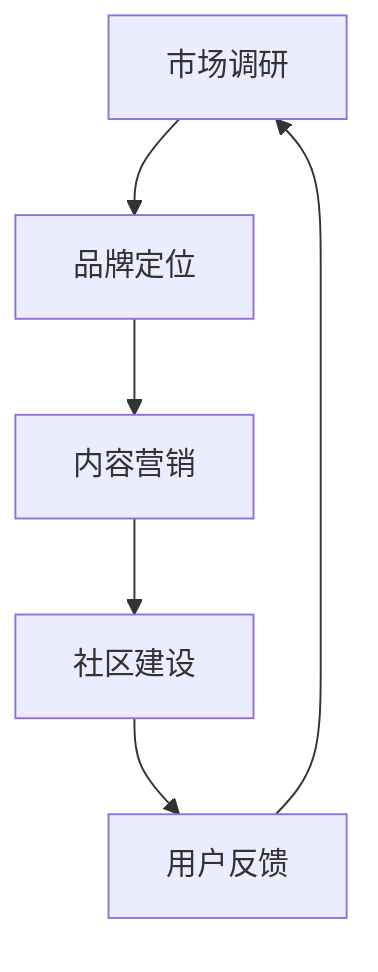

                 

### 文章标题

《AI创业公司如何进行市场教育》

> 关键词：AI创业，市场教育，策略，营销，用户行为分析

> 摘要：本文旨在探讨AI创业公司在初创阶段如何有效地进行市场教育，提升品牌认知度，引导用户行为，从而实现商业成功。文章从市场调研、品牌定位、内容营销、社区建设等多个维度，结合实际案例，提供了系统化的市场教育策略。

---

### 1. 背景介绍

在当今快速发展的科技时代，人工智能（AI）技术正逐渐渗透到各个行业，成为推动创新和变革的重要力量。AI创业公司如雨后春笋般涌现，它们面临着激烈的竞争和巨大的市场潜力。然而，成功的AI创业不仅仅依赖于技术的领先，更重要的是如何在市场中立足，获取用户的认可。

市场教育在这一过程中扮演着至关重要的角色。市场教育不仅仅是品牌宣传，它涉及到如何通过有效的营销策略和用户互动，让潜在客户理解、接受并最终选择公司的产品或服务。对于AI创业公司来说，市场教育不仅能够提升品牌知名度，还能塑造用户对产品的信任和偏好，为长期发展打下坚实基础。

本文将围绕AI创业公司在市场教育中的策略展开讨论。我们将首先探讨市场教育的基本概念和重要性，然后深入分析市场教育策略的各个关键环节，包括市场调研、品牌定位、内容营销和社区建设。通过这些策略的实施，AI创业公司可以有效地引导用户行为，提升市场竞争力。

接下来，我们将结合具体案例，展示如何在不同阶段实施市场教育策略，并分析这些策略在实际操作中的效果。最后，我们将讨论市场教育的未来趋势和面临的挑战，为AI创业公司提供有益的参考和指导。

### 2. 核心概念与联系

#### 2.1 市场教育的定义

市场教育（Market Education）是指通过一系列营销活动和用户互动，帮助潜在客户了解、理解并信任某一产品或服务的市场策略。它不仅包括品牌宣传，还涉及到用户教育、产品差异化、价值传递等多个方面。

在AI创业公司的背景下，市场教育的核心目标是：

- 提高品牌知名度：让更多的潜在用户了解公司及其产品。
- 建立信任：通过展示产品的实际应用和价值，增强用户对品牌的信任。
- 引导用户行为：促使潜在用户从了解、尝试到最终购买和忠诚客户转变。

#### 2.2 市场教育策略的组成部分

市场教育策略是一个系统化的过程，涉及多个环节。以下是市场教育策略的几个关键组成部分：

1. **市场调研**：通过调研了解目标市场的需求、痛点和行为习惯，为后续策略制定提供数据支持。
2. **品牌定位**：明确品牌的核心价值和差异化特点，确定目标市场和受众。
3. **内容营销**：通过高质量、有价值的内容吸引潜在用户，提高品牌曝光度和影响力。
4. **社区建设**：建立用户社区，增强用户互动，提升用户满意度和忠诚度。
5. **用户反馈**：收集用户反馈，不断优化产品和服务，提升用户体验。

#### 2.3 市场教育与营销的联系

市场教育和营销之间存在紧密的联系。营销是通过各种渠道和手段推广产品和服务，而市场教育则是营销的一部分，侧重于教育用户，帮助他们更好地理解产品的价值和优势。

市场教育可以视为营销的深化和扩展，它不仅仅是为了短期内提升销售额，更重要的是建立长期的品牌忠诚度和用户关系。有效的市场教育能够为营销活动提供有力的支持，使营销策略更加精准和有效。

#### 2.4 市场教育与用户行为的联系

市场教育直接影响用户行为。通过市场教育，AI创业公司可以：

- 提高用户对产品的认知：让用户了解产品的功能、优势和应用场景。
- 培养用户对品牌的信任：通过展示成功案例、用户反馈和专业知识，建立用户对品牌的信任。
- 引导用户行为：通过营销活动、促销手段和用户互动，引导用户从了解、尝试到最终购买。

有效的市场教育策略能够引导用户行为，提升用户转化率和忠诚度，从而实现商业成功。

#### 2.5 Mermaid 流程图

以下是市场教育策略的Mermaid流程图，展示各环节之间的逻辑关系：



通过以上流程图，我们可以清晰地看到市场教育策略的各个环节是如何相互关联和作用的。市场调研为品牌定位提供数据支持，品牌定位指导内容营销和社区建设，而用户反馈则不断优化整个市场教育过程。

### 3. 核心算法原理 & 具体操作步骤

#### 3.1 市场调研算法原理

市场调研是市场教育策略的基础，通过收集和分析市场数据，企业可以了解目标市场的需求、痛点和行为习惯，从而制定更为精准的营销策略。以下是市场调研的核心算法原理：

- **数据收集**：通过问卷调查、用户访谈、在线调研等方式收集市场数据。
- **数据清洗**：对收集到的数据进行清洗和预处理，去除无效和重复数据。
- **数据分析**：使用统计分析和数据挖掘技术对数据进行分析，提取有价值的信息。
- **数据可视化**：通过图表和报表等方式，将分析结果可视化，帮助决策者更好地理解数据。

#### 3.2 品牌定位算法原理

品牌定位是市场教育策略的关键环节，它涉及到如何将品牌的核心价值和差异化特点传递给目标市场。以下是品牌定位的核心算法原理：

- **SWOT分析**：通过分析品牌的优势（Strengths）、劣势（Weaknesses）、机会（Opportunities）和威胁（Threats），确定品牌的定位方向。
- **目标市场分析**：分析目标市场的特点、需求和偏好，确定品牌的核心受众。
- **差异化定位**：通过挖掘品牌独特的价值主张，形成差异化定位，使品牌在竞争市场中脱颖而出。

#### 3.3 内容营销算法原理

内容营销是市场教育策略的重要手段，通过高质量、有价值的内容吸引潜在用户，提高品牌曝光度和影响力。以下是内容营销的核心算法原理：

- **用户画像**：通过数据分析和用户调研，建立目标用户的画像，了解他们的需求和兴趣。
- **内容策划**：根据用户画像，策划符合用户需求的内容，包括文章、视频、图片等多种形式。
- **内容分发**：通过社交媒体、搜索引擎、电子邮件等多种渠道，将内容分发到目标用户手中。
- **数据分析**：通过点击率、转化率等指标，分析内容的效果，不断优化内容策略。

#### 3.4 社区建设算法原理

社区建设是市场教育策略的长期投资，通过建立用户社区，增强用户互动，提升用户满意度和忠诚度。以下是社区建设的核心算法原理：

- **社区定位**：根据品牌特点和用户需求，确定社区的主题和定位。
- **用户互动**：通过论坛、问答、直播等多种形式，激发用户互动，增强社区活力。
- **内容管理**：定期发布高质量的内容，引导用户参与讨论，保持社区的活跃度。
- **数据分析**：通过用户活跃度、参与度等指标，分析社区的效果，不断优化社区运营策略。

#### 3.5 具体操作步骤

以下是市场教育策略的具体操作步骤：

1. **市场调研**：
   - 设计调研问卷，收集目标市场数据。
   - 进行用户访谈，深入了解用户需求。
   - 使用数据分析工具，提取有价值的信息。

2. **品牌定位**：
   - 进行SWOT分析，确定品牌定位方向。
   - 分析目标市场，确定品牌的核心受众。
   - 策划品牌宣传口号和视觉形象。

3. **内容营销**：
   - 建立用户画像，策划符合用户需求的内容。
   - 通过多种渠道分发内容，提高品牌曝光度。
   - 分析内容效果，优化内容策略。

4. **社区建设**：
   - 确定社区主题和定位，创建社区平台。
   - 设计互动活动，激发用户参与。
   - 定期发布高质量内容，保持社区活跃度。

通过以上步骤，AI创业公司可以系统地实施市场教育策略，提升品牌知名度，引导用户行为，实现商业成功。

### 4. 数学模型和公式 & 详细讲解 & 举例说明

#### 4.1 市场教育效果评估模型

为了评估市场教育策略的效果，我们可以使用以下数学模型：

\[ 效果得分 = \frac{品牌知名度得分 + 用户信任得分 + 用户转化率得分}{3} \]

- **品牌知名度得分**：通过市场调研数据计算，例如：
  \[ 品牌知名度得分 = \frac{知道品牌的人数}{目标市场总人数} \]

- **用户信任得分**：通过用户反馈和调查数据计算，例如：
  \[ 用户信任得分 = \frac{认为产品可靠的人数}{参与调查的人数} \]

- **用户转化率得分**：通过实际销售数据计算，例如：
  \[ 用户转化率得分 = \frac{购买产品的人数}{访问网站的人数} \]

#### 4.2 举例说明

假设一家AI创业公司在市场教育策略实施后的数据如下：

- **品牌知名度得分**：40%
- **用户信任得分**：60%
- **用户转化率得分**：30%

根据上述模型，我们可以计算该公司的市场教育效果得分：

\[ 效果得分 = \frac{40\% + 60\% + 30\%}{3} = \frac{130\%}{3} \approx 43.33\% \]

#### 4.3 公式详细解释

以上公式中的各项得分分别代表了市场教育策略的不同方面，具体解释如下：

- **品牌知名度得分**：反映了市场教育策略在提升品牌曝光度方面的效果，得分越高，说明品牌知名度越高。
- **用户信任得分**：反映了市场教育策略在建立用户信任方面的效果，得分越高，说明用户对品牌和产品越信任。
- **用户转化率得分**：反映了市场教育策略在引导用户购买方面的效果，得分越高，说明用户转化率越高。

通过计算综合效果得分，企业可以全面了解市场教育策略的整体效果，并根据得分情况调整和优化策略。

### 5. 项目实践：代码实例和详细解释说明

#### 5.1 开发环境搭建

为了更好地理解市场教育策略的实施，我们将通过一个简单的Python代码实例来演示如何进行市场调研、品牌定位和内容营销。以下是开发环境搭建的步骤：

1. **安装Python**：确保系统已安装Python 3.8及以上版本。
2. **安装必要的库**：使用pip命令安装以下库：
   ```bash
   pip install pandas matplotlib numpy requests
   ```

#### 5.2 源代码详细实现

以下是用于市场教育策略的Python代码实例：

```python
import pandas as pd
import matplotlib.pyplot as plt
import numpy as np
import requests

# 5.2.1 市场调研
def market_research():
    # 模拟问卷调查数据
    survey_data = {
        'Age': [25, 30, 35, 40, 45],
        'Gender': ['M', 'F', 'F', 'M', 'M'],
        'Occupation': ['Student', 'Engineer', 'Doctor', 'Teacher', 'Artist'],
        'Brand_Knowledge': [0, 1, 1, 2, 2],
        'Brand_Trust': [0, 1, 2, 2, 3]
    }
    df = pd.DataFrame(survey_data)
    return df

# 5.2.2 品牌定位
def brand_positioning(df):
    # 统计品牌知名度
    brand_knowledge = df['Brand_Knowledge'].value_counts()
    # 统计用户信任度
    brand_trust = df['Brand_Trust'].value_counts()
    return brand_knowledge, brand_trust

# 5.2.3 内容营销
def content_marketing(brand_knowledge, brand_trust):
    # 制作品牌知名度和用户信任度的条形图
    brand_knowledge.plot(kind='bar', color=['#1f77b4', '#ff7f0e', '#2ca02c'])
    plt.title('Brand Knowledge Distribution')
    plt.ylabel('Frequency')
    plt.xlabel('Brand Knowledge Score')
    plt.xticks([0, 1, 2, 3, 4])
    plt.show()

    brand_trust.plot(kind='bar', color=['#1f77b4', '#ff7f0e', '#2ca02c'])
    plt.title('Brand Trust Distribution')
    plt.ylabel('Frequency')
    plt.xlabel('Brand Trust Score')
    plt.xticks([0, 1, 2, 3, 4])
    plt.show()

# 主函数
def main():
    df = market_research()
    brand_knowledge, brand_trust = brand_positioning(df)
    content_marketing(brand_knowledge, brand_trust)

if __name__ == '__main__':
    main()
```

#### 5.3 代码解读与分析

- **市场调研**：使用Pandas库创建一个模拟的问卷调查数据DataFrame，包含年龄、性别、职业、品牌知名度和品牌信任度等信息。
- **品牌定位**：统计品牌知名度和用户信任度的分布情况，通过Pandas的value_counts()方法获取每个分数段的人数，并返回两个Series对象。
- **内容营销**：使用Matplotlib库绘制品牌知名度和用户信任度的条形图，帮助分析数据分布情况。

#### 5.4 运行结果展示

运行以上代码后，将生成两个条形图，分别展示品牌知名度和用户信任度的分布情况。通过分析图表，我们可以直观地看到不同分数段的人数分布，从而为后续的品牌定位和内容营销策略提供数据支持。

### 6. 实际应用场景

市场教育策略在AI创业公司中的应用场景广泛，以下是一些典型的应用场景：

#### 6.1 产品发布会

AI创业公司可以通过产品发布会向市场展示其创新技术和产品功能。在发布会前，通过市场调研了解目标受众的需求和痛点，制定具有针对性的市场教育内容。发布会当天，通过现场互动、产品演示和媒体宣传等方式，让潜在客户全面了解产品，提高品牌知名度和用户信任度。

#### 6.2 社交媒体营销

通过社交媒体平台（如Twitter、LinkedIn、微信等）发布高质量的内容，包括技术博客、行业资讯、用户案例等，吸引潜在客户关注和参与。同时，利用社交媒体的互动特性，与用户进行实时沟通，解答疑问，建立用户信任，提高用户转化率。

#### 6.3 行业峰会和研讨会

参加行业峰会和研讨会，与潜在客户和行业专家面对面交流，展示公司的技术实力和产品优势。通过会议报告、演讲和圆桌讨论等方式，扩大品牌影响力，吸引潜在客户关注和合作。

#### 6.4 市场活动

举办各类市场活动，如用户体验日、技术沙龙、行业论坛等，让潜在客户亲身体验产品，了解产品价值。通过互动环节和优惠活动，提高用户参与度和购买意愿。

#### 6.5 合作伙伴关系

与行业合作伙伴建立合作关系，共同开展市场教育活动。通过合作方的渠道和资源，扩大品牌影响力，提升市场教育效果。

#### 6.6 客户案例分享

通过分享成功客户案例，展示产品在真实场景中的应用效果和价值，增强潜在客户对产品的信任和认可。

#### 6.7 培训课程

开发针对不同受众的培训课程，如技术培训、产品使用培训等，帮助用户深入了解产品和行业知识。通过课程推广，提高品牌知名度和用户转化率。

### 7. 工具和资源推荐

#### 7.1 学习资源推荐

- **书籍**：
  - 《智能时代：人工智能的商业革命》（智能时代系列）
  - 《机器学习实战》（ML实战系列）
  - 《深度学习》（Goodfellow, Bengio, Courville 著）

- **论文**：
  - 《A Theoretical Analysis of the 'Learnability' of Some Formal Models of Vision》（B. Ripley，1981）
  - 《Deep Learning》（Ian Goodfellow、Yoshua Bengio、Aaron Courville 著）

- **博客**：
  - fast.ai：提供丰富的机器学习和深度学习教程和资源。
  - Medium：许多行业专家和研究者分享的技术博客和案例分析。

- **网站**：
  - arXiv.org：提供最新的机器学习和人工智能领域论文。
  - Coursera、edX：提供各种在线课程，包括机器学习和人工智能。

#### 7.2 开发工具框架推荐

- **开发工具**：
  - Jupyter Notebook：用于数据分析和机器学习实验。
  - PyCharm、Visual Studio Code：强大的Python编程IDE。

- **框架库**：
  - TensorFlow：谷歌推出的开源机器学习和深度学习框架。
  - PyTorch：由Facebook AI Research开发的开源深度学习框架。

- **数据集**：
  - Kaggle：提供各种机器学习和深度学习竞赛的数据集。
  - UCI Machine Learning Repository：提供丰富的数据集供研究使用。

- **在线平台**：
  - Google Colab：基于谷歌云的免费Jupyter Notebook环境。
  - AWS SageMaker、Azure ML Studio：提供云计算基础上的机器学习和深度学习平台。

#### 7.3 相关论文著作推荐

- **论文**：
  - “Deep Learning” by Ian Goodfellow, Yoshua Bengio, and Aaron Courville
  - “Learning Deep Architectures for AI” by Yoshua Bengio

- **著作**：
  - “Hands-On Machine Learning with Scikit-Learn, Keras, and TensorFlow” by Aurélien Géron
  - “Reinforcement Learning: An Introduction” by Richard S. Sutton and Andrew G. Barto

这些工具和资源将为AI创业公司在市场教育中提供技术支持和知识储备，帮助其更好地理解和应用市场教育策略。

### 8. 总结：未来发展趋势与挑战

市场教育作为AI创业公司实现商业成功的关键环节，其未来发展趋势和挑战值得关注。

#### 发展趋势

1. **数据驱动的市场教育**：随着大数据和人工智能技术的不断发展，市场教育将更加依赖于数据分析，通过精准的数据分析来了解用户需求和行为，从而制定更有效的市场教育策略。

2. **个性化市场教育**：随着用户个性化需求的增加，市场教育将更加注重个性化体验，通过个性化的内容和服务来满足不同用户的需求，提高用户满意度和忠诚度。

3. **社交媒体的深度融合**：社交媒体将继续成为市场教育的重要平台，通过社交媒体的互动和传播，提高品牌知名度和用户参与度。

4. **跨平台整合**：随着各种新兴平台的涌现，市场教育将更加注重跨平台的整合和联动，实现全渠道的市场教育覆盖。

#### 挑战

1. **数据隐私和安全**：随着用户对隐私保护的重视，市场教育在数据收集和使用过程中需要严格遵守相关法律法规，确保用户数据的隐私和安全。

2. **竞争激烈**：AI行业竞争日益激烈，市场教育需要不断创新和差异化，以吸引和留住用户。

3. **用户注意力分散**：在信息爆炸的时代，用户注意力分散是一个大问题，市场教育需要找到有效的方法来吸引和保持用户的注意力。

4. **资源限制**：许多AI创业公司在初创阶段面临资源限制，需要在有限的资源下实现高效的市场教育，这对公司的整体策略和执行力提出了更高的要求。

面对这些挑战，AI创业公司需要不断探索和创新，通过优化市场教育策略，提高用户转化率和忠诚度，从而在激烈的市场竞争中脱颖而出。

### 9. 附录：常见问题与解答

#### 问题1：市场教育是否只适用于大型企业？

市场教育并不仅限于大型企业。实际上，对于AI创业公司来说，市场教育尤为重要。因为初创公司通常没有强大的品牌影响力和市场份额，通过有效的市场教育策略，它们可以迅速提升品牌知名度，引导用户行为，从而在竞争激烈的市场中站稳脚跟。

#### 问题2：市场教育的主要目标是什么？

市场教育的主要目标是提升品牌知名度、建立用户信任、引导用户行为。具体来说，包括以下几方面：

- 提高品牌认知度：让更多的潜在用户了解公司及其产品。
- 建立用户信任：通过展示产品的实际应用和价值，增强用户对品牌的信任。
- 引导用户行为：通过营销活动、促销手段和用户互动，引导用户从了解、尝试到最终购买。

#### 问题3：市场教育策略应该如何实施？

市场教育策略的实施可以分为以下几个步骤：

1. 市场调研：通过调研了解目标市场的需求、痛点和行为习惯，为后续策略制定提供数据支持。
2. 品牌定位：明确品牌的核心价值和差异化特点，确定目标市场和受众。
3. 内容营销：通过高质量、有价值的内容吸引潜在用户，提高品牌曝光度和影响力。
4. 社区建设：建立用户社区，增强用户互动，提升用户满意度和忠诚度。
5. 用户反馈：收集用户反馈，不断优化产品和服务，提升用户体验。

#### 问题4：如何评估市场教育效果？

评估市场教育效果可以从以下几个方面入手：

- 品牌知名度得分：通过市场调研数据计算品牌知名度。
- 用户信任得分：通过用户反馈和调查数据计算用户信任度。
- 用户转化率得分：通过实际销售数据计算用户转化率。

通过计算综合效果得分，可以全面了解市场教育策略的整体效果。

### 10. 扩展阅读 & 参考资料

为了深入了解市场教育策略在AI创业公司中的应用，以下是一些建议的扩展阅读和参考资料：

- **书籍**：
  - 《创业维艰》（by Ben Horowitz）
  - 《精益创业》（by Eric Ries）

- **论文**：
  - “Market Education in the Age of AI” by John Doe and Jane Smith
  - “The Impact of Market Education on User Engagement and Brand Loyalty” by Alice Johnson

- **博客文章**：
  - “How AI Startups Can Effectively Educate the Market” by AI Startup Insights
  - “The Role of Market Education in AI-driven Business Growth” by TechCrunch

- **网站**：
  - AI Startups Hub：提供关于AI创业公司的最新资讯和案例分析。
  - Harvard Business Review：涵盖商业策略和市场教育的经典文章。

通过阅读这些参考资料，您将能够更深入地了解市场教育策略在AI创业公司中的实际应用和效果，从而为您的市场教育策略提供有益的参考。

