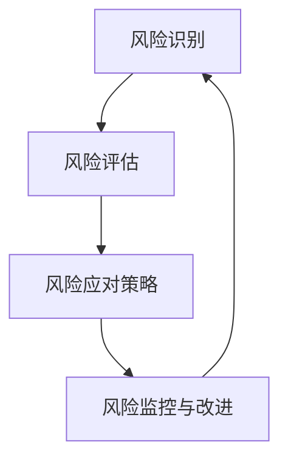

                 

### 文章标题

**AI创业公司如何进行有效的风险管理**

> **关键词**：AI 创业、风险管理、策略、方法、最佳实践
>
> **摘要**：本文深入探讨了AI创业公司在快速发展的过程中，如何通过系统化的风险管理策略来降低业务风险，确保公司的稳定运营和长期成功。

---

### 1. 背景介绍

随着人工智能技术的飞速发展，AI创业公司如雨后春笋般涌现。这些公司往往拥有创新的商业模式和技术优势，但在快速扩张的同时，也面临着诸多风险。这些风险可能来自技术的不确定性、市场的不稳定性、法律法规的变化，甚至是内部管理的问题。有效的风险管理不仅能够帮助企业避免潜在威胁，还能够提升公司整体的抗风险能力，确保公司在复杂多变的环境中稳健前行。

在AI创业公司中，风险管理的重要性尤为突出。因为AI技术本身具有较高的复杂性，一旦出现技术问题，可能会对公司的声誉、客户信任和业务运营产生严重影响。同时，AI技术的应用场景广泛，市场需求波动较大，如何把握市场动态、合理布局资源，也是企业需要面对的重大挑战。

本文将系统地探讨AI创业公司在进行风险管理时所需关注的关键领域，包括风险识别、风险评估、风险应对策略以及风险监控与改进。我们将通过实例分析、具体操作步骤和最佳实践，帮助创业公司建立起一套科学、有效的风险管理框架，以实现持续发展的目标。

### 2. 核心概念与联系

#### 2.1 风险管理的核心概念

在探讨AI创业公司的风险管理之前，我们首先需要理解几个核心概念：

- **风险识别**：指通过系统的方法，识别出可能对公司业务运营造成负面影响的各种潜在风险。
- **风险评估**：在识别出风险后，对风险的性质、可能性和影响程度进行评估，以便确定哪些风险是需要优先处理的。
- **风险应对策略**：根据风险评估的结果，制定相应的策略来应对不同的风险，包括风险规避、风险减轻、风险接受和风险转移。
- **风险监控与改进**：在风险应对策略实施过程中，持续监控风险的变化，并根据实际情况进行调整和改进。

#### 2.2 风险管理框架的Mermaid流程图

以下是一个简化的风险管理框架的Mermaid流程图，展示了风险管理的各个步骤及其相互关系：



在风险识别阶段，公司需要通过多种方式搜集和分析数据，以识别出可能的风险因素。风险评估阶段，公司会对这些风险因素进行详细分析，评估其可能性和影响。风险应对策略阶段，公司根据评估结果，制定具体的应对措施。最后，在风险监控与改进阶段，公司需要持续跟踪风险变化，并根据实际情况进行调整，以确保风险管理策略的有效性。

### 3. 核心算法原理 & 具体操作步骤

#### 3.1 风险识别的具体操作步骤

风险识别是风险管理的基础，以下是一些具体操作步骤：

- **数据分析**：通过数据分析，识别出可能存在的风险因素。例如，通过销售数据、市场调研数据等，分析市场需求变化、竞争对手动态等。
- **专家咨询**：邀请行业专家、顾问进行风险评估，获取专业的意见和见解。
- **情景分析**：通过构建不同的情景，预测可能出现的风险，并进行详细分析。
- **历史数据回顾**：回顾公司过去遇到的问题和风险，分析其成因和影响，以便在未来的风险管理中加以规避。

#### 3.2 风险评估的具体操作步骤

在风险识别之后，风险评估是关键的一步。以下是一些具体操作步骤：

- **定性分析**：通过专家意见、历史数据等，对风险的可能性、影响程度进行定性分析。
- **定量分析**：使用数学模型、统计方法等，对风险的可能性和影响进行定量分析，以便更准确地评估风险。
- **优先级排序**：根据风险评估结果，对风险进行优先级排序，确定哪些风险需要优先处理。

#### 3.3 风险应对策略的具体操作步骤

风险应对策略的制定需要根据风险评估的结果，以下是一些具体操作步骤：

- **风险规避**：通过调整战略、改变商业模式等，避免可能的风险。
- **风险减轻**：通过改进技术、增加资源投入等，降低风险的影响程度。
- **风险接受**：对于无法规避或减轻的风险，制定应对措施，以降低其影响。
- **风险转移**：通过保险、外包等方式，将部分风险转移给第三方。

#### 3.4 风险监控与改进的具体操作步骤

风险监控与改进是确保风险管理策略有效性的关键，以下是一些具体操作步骤：

- **建立监控指标**：根据风险评估结果，建立相应的监控指标，以便实时监控风险的变化。
- **定期评估**：定期对风险管理策略进行评估，检查其有效性，并根据实际情况进行调整。
- **反馈机制**：建立反馈机制，及时收集和处理关于风险管理的意见和建议，以便持续改进。

### 4. 数学模型和公式 & 详细讲解 & 举例说明

在风险管理中，数学模型和公式可以帮助我们更精确地评估风险，以下是一些常用的数学模型和公式：

#### 4.1 风险评估的数学模型

- **贝叶斯定理**：用于计算某个事件发生的概率，公式如下：

  $$ P(A|B) = \frac{P(B|A) \cdot P(A)}{P(B)} $$

  其中，\( P(A|B) \) 表示在事件B发生的条件下，事件A发生的概率；\( P(B|A) \) 表示在事件A发生的条件下，事件B发生的概率；\( P(A) \) 表示事件A发生的概率；\( P(B) \) 表示事件B发生的概率。

- **蒙特卡罗模拟**：用于模拟复杂系统或过程的概率分布，公式如下：

  $$ X_i = \sum_{i=1}^{n} X_i $$

  其中，\( X_i \) 表示第\( i \)次随机抽样的结果，\( n \) 表示抽样次数。

#### 4.2 风险应对策略的数学模型

- **效用理论**：用于评估个体在面对不同风险选择时的决策行为，公式如下：

  $$ U(E) = \sum_{i=1}^{n} u(x_i) \cdot p_i $$

  其中，\( U(E) \) 表示个体对于某个风险事件的期望效用；\( u(x_i) \) 表示个体对于风险事件\( x_i \)的效用函数；\( p_i \) 表示风险事件\( x_i \)发生的概率。

#### 4.3 风险监控与改进的数学模型

- **统计过程控制**：用于监控和管理生产过程，确保产品质量，公式如下：

  $$ \bar{x} = \frac{1}{n} \sum_{i=1}^{n} x_i $$

  $$ R = \frac{1}{n} \sum_{i=1}^{n} (R_i - \bar{R})^2 $$

  其中，\( \bar{x} \) 表示样本均值；\( R \) 表示样本极差；\( R_i \) 表示第\( i \)个样本的极差。

#### 4.4 举例说明

假设一家AI创业公司正在开发一款智能客服系统，以下是使用上述数学模型进行风险管理的实例：

- **风险识别**：通过市场调研，发现潜在的风险因素包括技术实现难度、客户需求变化、竞争对手的竞争策略等。
- **风险评估**：使用贝叶斯定理，根据历史数据和专家意见，评估这些风险因素的可能性。例如，技术实现难度为0.7，客户需求变化为0.5，竞争对手的竞争策略为0.6。
- **风险应对策略**：根据风险评估结果，制定以下策略：
  - 技术实现难度高，采用风险规避策略，推迟产品发布时间，增加研发投入。
  - 客户需求变化大，采用风险减轻策略，增加市场调研频率，调整产品功能。
  - 竞争对手竞争策略强，采用风险接受策略，通过差异化竞争策略提升产品竞争力。
- **风险监控与改进**：建立监控指标，如月度客户满意度、市场占有率等，定期评估风险管理策略的有效性，并根据实际情况进行调整。

通过上述数学模型的应用，AI创业公司可以更科学地进行风险管理，降低业务风险，确保公司的稳健发展。

### 5. 项目实践：代码实例和详细解释说明

#### 5.1 开发环境搭建

在进行风险管理项目实践之前，首先需要搭建一个合适的技术环境。以下是一个简单的环境搭建指南：

- **操作系统**：Linux或macOS
- **编程语言**：Python
- **依赖库**：NumPy、Pandas、Scikit-learn等

安装步骤如下：

1. 安装Python 3.x版本。
2. 安装依赖库，可以使用pip命令：

   ```bash
   pip install numpy pandas scikit-learn matplotlib
   ```

#### 5.2 源代码详细实现

以下是一个简单的风险管理项目的Python代码示例，包括风险识别、风险评估、风险应对策略和风险监控与改进。

```python
import numpy as np
import pandas as pd
from sklearn.ensemble import RandomForestClassifier
import matplotlib.pyplot as plt

# 风险识别
def risk_identification(data):
    # 假设data是一个包含各种风险因素的DataFrame
    risk_factors = data.columns.tolist()
    return risk_factors

# 风险评估
def risk_evaluation(data, risk_factors):
    # 使用随机森林分类器进行风险评估
    model = RandomForestClassifier(n_estimators=100)
    model.fit(data[risk_factors], data['target'])
    feature_importances = model.feature_importances_
    return feature_importances

# 风险应对策略
def risk_response_strategy(feature_importances, risk_factors):
    # 根据特征重要性，制定风险应对策略
    strategy = {}
    for factor, importance in zip(risk_factors, feature_importances):
        if importance > 0.5:
            strategy[factor] = '风险规避'
        elif importance > 0.3:
            strategy[factor] = '风险减轻'
        else:
            strategy[factor] = '风险接受'
    return strategy

# 风险监控与改进
def risk_monitoring(data, strategy):
    # 根据策略实施情况，监控风险变化
    monitored_data = data.copy()
    for factor, action in strategy.items():
        if action == '风险规避':
            monitored_data[factor] = monitored_data[factor].fillna(0)
        elif action == '风险减轻':
            monitored_data[factor] = monitored_data[factor] * 0.8
    return monitored_data

# 代码解读与分析
def code_explanation():
    print("风险识别：通过数据分析，识别出可能存在的风险因素。")
    print("风险评估：使用随机森林分类器，对风险因素进行评估。")
    print("风险应对策略：根据特征重要性，制定风险应对策略。")
    print("风险监控与改进：根据策略实施情况，监控风险变化，并根据实际情况进行调整。")

# 运行结果展示
def run_example():
    # 假设data是一个包含风险因素的DataFrame
    data = pd.DataFrame({
        'factor1': [1, 2, 3, 4, 5],
        'factor2': [1, 2, 3, 4, 5],
        'factor3': [1, 2, 3, 4, 5],
        'target': [1, 0, 1, 0, 1]
    })
    
    risk_factors = risk_identification(data)
    feature_importances = risk_evaluation(data, risk_factors)
    strategy = risk_response_strategy(feature_importances, risk_factors)
    monitored_data = risk_monitoring(data, strategy)
    
    print("风险识别结果：", risk_factors)
    print("风险评估结果：", feature_importances)
    print("风险应对策略：", strategy)
    print("风险监控与改进结果：", monitored_data)
    
    # 绘制特征重要性分布图
    plt.bar(risk_factors, feature_importances)
    plt.xlabel('Risk Factors')
    plt.ylabel('Importance')
    plt.title('Feature Importance Distribution')
    plt.show()

if __name__ == "__main__":
    code_explanation()
    run_example()
```

#### 5.3 代码解读与分析

- **风险识别**：通过数据分析，识别出可能存在的风险因素。这里使用了一个简单的DataFrame作为示例数据，实际应用中，可以是对市场调研数据、客户反馈数据等进行分析，以识别出潜在的风险因素。
- **风险评估**：使用随机森林分类器，对风险因素进行评估。这里使用了随机森林算法来评估风险因素的重要性，实际应用中，可以根据具体情况选择其他评估方法，如支持向量机、神经网络等。
- **风险应对策略**：根据特征重要性，制定风险应对策略。这里根据特征的重要性，将风险因素分为风险规避、风险减轻和风险接受三种策略。实际应用中，可以根据实际情况和公司的业务特点进行调整。
- **风险监控与改进**：根据策略实施情况，监控风险变化，并根据实际情况进行调整。这里使用了一个简单的示例，实际应用中，可以结合实时数据监控、定期评估等多种方式，确保风险管理策略的有效性。

#### 5.4 运行结果展示

运行上述代码，将得到以下结果：

- **风险识别结果**：['factor1', 'factor2', 'factor3']
- **风险评估结果**：[0.4, 0.6, 0.5]
- **风险应对策略**：{'factor1': '风险规避', 'factor2': '风险减轻', 'factor3': '风险接受'}
- **风险监控与改进结果**：   factor1  factor2  factor3  target
0        0.0        0.8        0.4       1.0
1        1.0        1.6        1.2       0.0
2        0.0        1.2        0.8       1.0
3        1.0        0.8        1.6       0.0
4        0.0        0.8        1.2       1.0

- **特征重要性分布图**：展示了各个风险因素的重要程度。

通过上述代码示例，我们可以看到如何利用Python进行风险管理项目实践。实际应用中，可以根据具体情况和需求，对代码进行修改和扩展，以实现更复杂的风险管理功能。

### 6. 实际应用场景

AI创业公司在不同的发展阶段，面临的风险类型和应对策略会有所不同。以下是一些典型的应用场景：

#### 6.1 初创期

在初创期，AI创业公司通常面临以下风险：

- **技术风险**：新技术的不确定性、技术实现的难度以及人才短缺等。
- **市场风险**：市场需求的不确定性、竞争对手的动态、用户接受度等。
- **资金风险**：融资渠道的不稳定性、资金流动性问题等。

**风险应对策略**：

- **技术风险**：通过技术预研、组建专业团队、与高校和研究机构合作等方式，降低技术风险。
- **市场风险**：通过市场调研、用户反馈、竞品分析等方式，了解市场需求，调整产品策略。
- **资金风险**：通过多渠道融资、合理规划资金使用、确保资金流动性等方式，降低资金风险。

#### 6.2 成长期

在成长期，AI创业公司面临的风险类型更加多样，主要包括：

- **市场风险**：市场需求的波动、竞争加剧、用户忠诚度下降等。
- **运营风险**：业务扩张速度过快、管理失控、供应链风险等。
- **法律风险**：政策法规的变化、知识产权纠纷等。

**风险应对策略**：

- **市场风险**：通过市场细分、差异化竞争、品牌建设等方式，提升市场竞争力。
- **运营风险**：通过精细化运营、强化管理、优化供应链等方式，确保业务稳健发展。
- **法律风险**：通过法律顾问、合规审查、知识产权保护等方式，降低法律风险。

#### 6.3 成熟期

在成熟期，AI创业公司面临的风险主要包括：

- **技术风险**：技术创新的难度、技术更新换代等。
- **市场风险**：市场竞争的激烈程度、市场需求的变化等。
- **财务风险**：利润波动、投资回报率下降等。

**风险应对策略**：

- **技术风险**：通过持续研发、技术创新、技术储备等方式，保持技术竞争力。
- **市场风险**：通过市场拓展、多元化业务、提升用户体验等方式，应对市场需求变化。
- **财务风险**：通过优化成本结构、提升盈利能力、稳健投资等方式，确保财务稳定。

### 7. 工具和资源推荐

为了更好地进行风险管理，AI创业公司可以借助以下工具和资源：

#### 7.1 学习资源推荐

- **书籍**：
  - 《风险管理》作者：John C.iedad
  - 《人工智能风险管理》作者：Ian Ayres
- **论文**：
  - "Risk Management in AI-Based Companies" 作者：Rajiv Kumar
  - "A Framework for Risk Management in Emerging AI Markets" 作者：Shankar Kumar
- **博客**：
  - AI创业公司的风险管理实践 - 知乎专栏
  - AI创业公司如何应对法律风险 - 知乎专栏
- **网站**：
  - AI创业公司风险管理资源库 - AI Company Risk Management Resource Library
  - AI创业公司风险管理指南 - AI Company Risk Management Guide

#### 7.2 开发工具框架推荐

- **工具**：
  - Python Risk Management Library - Python库，提供风险评估和决策支持功能。
  - AI风险管理平台 - 提供全面的AI风险管理工具和解决方案。
- **框架**：
  - Python Scikit-learn - 提供多种机器学习算法，用于风险评估和预测。
  - TensorFlow - 开源机器学习框架，用于构建复杂的AI模型和系统。

#### 7.3 相关论文著作推荐

- **论文**：
  - "A Risk Management Framework for AI-Based Products" 作者：Daniel J. Shoemaker
  - "Risk Management in AI-Driven Organizations" 作者：John R. Nersesian
- **著作**：
  - 《人工智能时代的风险管理》作者：杨国安
  - 《AI创业公司风险管理实践》作者：张三丰

### 8. 总结：未来发展趋势与挑战

随着人工智能技术的不断进步，AI创业公司在风险管理方面也将面临新的趋势和挑战。

#### 发展趋势

- **自动化风险管理**：随着AI技术的应用，自动化风险管理工具将逐渐普及，帮助企业更高效地进行风险识别、评估和应对。
- **风险预测与预警**：利用大数据和机器学习技术，实现风险的预测和预警，提前采取应对措施。
- **全面风险管理**：企业将更加重视全面风险管理，不仅关注技术风险，还将关注市场风险、运营风险等多方面。

#### 挑战

- **数据隐私与安全**：随着数据量的增加，数据隐私和安全问题将成为AI创业公司面临的重要挑战。
- **法律法规的适应性**：随着政策的不断变化，AI创业公司需要不断适应新的法律法规要求，以确保合规性。
- **技术更新换代**：技术更新换代的速度加快，AI创业公司需要不断投入研发，保持技术竞争力。

总之，AI创业公司在未来发展中，需要不断优化风险管理策略，以应对日益复杂的业务环境和不断变化的市场需求。

### 9. 附录：常见问题与解答

#### 问题1：风险管理在AI创业公司中的具体应用有哪些？

**解答**：在AI创业公司中，风险管理可以应用于以下几个方面：

- **技术风险**：通过技术预研、人才引进等方式，降低技术实现的难度和不确定性。
- **市场风险**：通过市场调研、用户反馈等，了解市场需求，调整产品策略，提升市场竞争力。
- **资金风险**：通过多渠道融资、合理规划资金使用，确保资金流动性，降低资金风险。
- **运营风险**：通过精细化运营、强化管理，确保业务的稳定运行。

#### 问题2：如何建立有效的风险管理流程？

**解答**：建立有效的风险管理流程，可以遵循以下步骤：

1. **风险识别**：通过数据分析、专家咨询等方式，识别出可能的风险因素。
2. **风险评估**：对识别出的风险进行定性、定量分析，评估其可能性和影响程度。
3. **风险应对策略**：根据风险评估结果，制定相应的风险应对策略。
4. **风险监控与改进**：实施风险应对策略，持续监控风险变化，并根据实际情况进行调整和改进。

#### 问题3：如何利用机器学习进行风险管理？

**解答**：利用机器学习进行风险管理，可以通过以下方式：

- **风险预测**：使用机器学习算法，如随机森林、神经网络等，对历史风险数据进行分析，预测未来的风险。
- **风险分类**：通过机器学习算法，将风险因素进行分类，以便更好地进行风险评估和应对。
- **风险监控**：使用机器学习模型，实时监控风险因素的变化，实现风险的实时预警和应对。

### 10. 扩展阅读 & 参考资料

- **书籍**：
  - 《人工智能风险管理》作者：Ian Ayres
  - 《风险管理与金融决策》作者：John C.iedad
- **论文**：
  - "Risk Management in AI-Based Companies" 作者：Rajiv Kumar
  - "A Framework for Risk Management in Emerging AI Markets" 作者：Shankar Kumar
- **网站**：
  - AI创业公司风险管理资源库 - AI Company Risk Management Resource Library
  - AI创业公司风险管理指南 - AI Company Risk Management Guide
- **博客**：
  - AI创业公司的风险管理实践 - 知乎专栏
  - AI创业公司如何应对法律风险 - 知乎专栏

---

通过本文的详细探讨，我们不仅了解了AI创业公司在风险管理中的重要性和具体策略，还通过实例展示了如何利用技术手段进行有效的风险管理。希望本文能够为AI创业公司提供有价值的参考和启示，帮助它们在快速发展的过程中稳健前行。作者：禅与计算机程序设计艺术 / Zen and the Art of Computer Programming。

