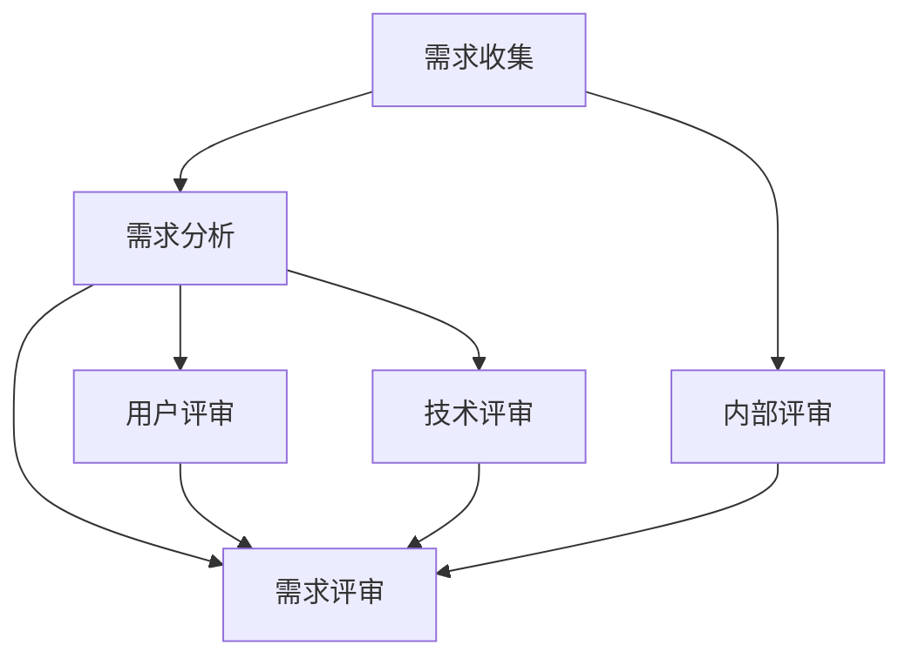

                 

### 文章标题

《AI创业公司的产品需求管理流程：需求收集、需求分析与需求评审》

> **关键词**：AI创业、产品需求管理、需求收集、需求分析、需求评审

**摘要**：本文旨在深入探讨AI创业公司中产品需求管理的核心流程，包括需求收集、需求分析和需求评审。通过对这些关键环节的详细解析，帮助企业更好地把握市场需求，优化产品开发流程，提升产品竞争力。

<|imagine|>## 1. 背景介绍

随着人工智能（AI）技术的迅猛发展，AI创业公司如雨后春笋般涌现。然而，在快速迭代的市场环境中，如何有效管理产品需求，确保产品能够满足用户需求，成为AI创业公司面临的一大挑战。产品需求管理（Product Requirement Management, PRM）作为产品开发过程中的关键环节，直接影响到产品的质量和市场表现。

本文将围绕AI创业公司的产品需求管理流程进行探讨，从需求收集、需求分析到需求评审，全面解析如何进行有效的需求管理，以提高产品开发效率和竞争力。

### 1.1 AI创业公司的特点

AI创业公司通常具有以下几个特点：

- **高技术含量**：AI技术是AI创业公司的核心竞争力，因此对技术人员的要求较高，研发投入较大。
- **快速迭代**：为了适应市场需求的变化，AI创业公司通常采用敏捷开发模式，快速迭代产品。
- **用户导向**：用户需求是驱动AI创业公司产品开发的源动力，因此对用户需求的理解和把握至关重要。
- **高度不确定性**：AI技术本身的不确定性和市场环境的快速变化使得AI创业公司面临更高的风险。

### 1.2 产品需求管理的意义

产品需求管理在AI创业公司中具有以下重要意义：

- **明确产品方向**：通过需求收集和分析，明确产品的功能、性能和用户体验，确保产品开发的方向正确。
- **提高开发效率**：明确的需求可以减少开发过程中的返工和修改，提高开发效率。
- **降低开发风险**：通过需求评审，及时发现和解决潜在问题，降低产品开发的风险。
- **满足用户需求**：通过深入理解用户需求，确保产品能够满足用户的需求，提升用户满意度。

<|imagine|>## 2. 核心概念与联系

### 2.1 需求收集

需求收集（Requirement Collection）是产品需求管理的第一个环节，旨在从各种渠道获取用户、市场和技术等多方面的需求信息。

#### 需求收集的方法：

- **用户访谈**：通过面对面交流，深入了解用户的具体需求和痛点。
- **问卷调查**：通过在线或纸质问卷，广泛收集用户意见。
- **市场调研**：通过分析市场数据，了解竞争对手产品和市场趋势。
- **技术调研**：与技术团队讨论，了解现有技术和潜在技术需求。

#### 需求收集的挑战：

- **信息过载**：获取的需求信息可能非常庞杂，需要有效筛选和整理。
- **需求冲突**：不同用户或利益相关者可能有不同的需求，需要平衡和协调。

### 2.2 需求分析

需求分析（Requirement Analysis）是对收集到的需求进行深入分析和评估，确定需求的可行性和优先级。

#### 需求分析的过程：

1. **需求分类**：将需求分为功能需求、性能需求、用户体验需求等。
2. **需求评审**：对需求进行初步评审，确保需求清晰、合理和可行。
3. **需求文档**：编写详细的需求文档，包括需求描述、功能点、性能指标等。
4. **需求建模**：使用UML、BPMN等工具对需求进行可视化建模，帮助团队成员理解需求。

#### 需求分析的挑战：

- **需求变化**：需求可能在开发过程中发生变化，需要及时调整。
- **需求遗漏**：可能会出现需求遗漏，影响产品功能的完整性。

### 2.3 需求评审

需求评审（Requirement Review）是对需求文档的全面审查，确保需求的正确性和完整性。

#### 需求评审的步骤：

1. **内部评审**：由项目团队内部进行评审，确保需求理解一致。
2. **用户评审**：邀请用户或利益相关者参与评审，确保需求符合用户需求。
3. **技术评审**：由技术团队进行评审，确保需求在技术上可行。
4. **文档更新**：根据评审结果，对需求文档进行更新和完善。

#### 需求评审的挑战：

- **评审效率**：评审过程可能耗费大量时间，影响项目进度。
- **评审质量**：评审过程中可能出现疏漏，影响需求质量。

### 2.4 Mermaid 流程图

下面是产品需求管理的 Mermaid 流程图，展示了需求收集、需求分析和需求评审的流程和联系：



<|imagine|>## 3. 核心算法原理 & 具体操作步骤

### 3.1 需求收集的核心算法原理

需求收集的核心算法原理主要是信息采集和处理。具体操作步骤如下：

1. **用户访谈**：
   - **步骤**：准备访谈提纲，选择合适的用户进行访谈，记录访谈内容。
   - **算法原理**：信息采集，通过深度交流了解用户真实需求和痛点。

2. **问卷调查**：
   - **步骤**：设计问卷，分发问卷，收集用户反馈。
   - **算法原理**：数据统计，通过量化分析了解用户需求和偏好。

3. **市场调研**：
   - **步骤**：分析市场数据，了解竞争对手产品和市场趋势。
   - **算法原理**：市场分析，通过数据对比发现市场机会和挑战。

4. **技术调研**：
   - **步骤**：与技术团队讨论，了解现有技术和潜在技术需求。
   - **算法原理**：技术评估，通过技术分析确定技术可行性。

### 3.2 需求分析的核心算法原理

需求分析的核心算法原理主要是需求建模和评估。具体操作步骤如下：

1. **需求分类**：
   - **步骤**：将需求分为功能需求、性能需求、用户体验需求等。
   - **算法原理**：需求分类，通过明确分类便于后续分析和处理。

2. **需求评审**：
   - **步骤**：对需求进行初步评审，确保需求清晰、合理和可行。
   - **算法原理**：需求评估，通过评审确定需求的优先级和可行性。

3. **需求文档**：
   - **步骤**：编写详细的需求文档，包括需求描述、功能点、性能指标等。
   - **算法原理**：需求建模，通过文档化明确需求细节和实现方案。

4. **需求建模**：
   - **步骤**：使用UML、BPMN等工具对需求进行可视化建模。
   - **算法原理**：模型构建，通过模型帮助团队成员理解和沟通需求。

### 3.3 需求评审的核心算法原理

需求评审的核心算法原理主要是多维度评估和反馈。具体操作步骤如下：

1. **内部评审**：
   - **步骤**：由项目团队内部进行评审，确保需求理解一致。
   - **算法原理**：团队协作，通过内部评审确保需求无遗漏和错误。

2. **用户评审**：
   - **步骤**：邀请用户或利益相关者参与评审，确保需求符合用户需求。
   - **算法原理**：用户参与，通过用户评审确保需求满足实际使用场景。

3. **技术评审**：
   - **步骤**：由技术团队进行评审，确保需求在技术上可行。
   - **算法原理**：技术评估，通过技术评审确保需求实现方案的可行性。

4. **文档更新**：
   - **步骤**：根据评审结果，对需求文档进行更新和完善。
   - **算法原理**：需求迭代，通过文档更新确保需求与实际开发进度一致。

### 3.4 具体操作步骤示例

以下是一个示例，展示了如何通过需求收集、需求分析和需求评审的步骤来处理一个具体的用户需求：

#### 需求收集：

- **用户访谈**：
  - **访谈内容**：“请问您在使用我们的产品时，遇到了哪些问题？还有哪些功能或性能需求？”
  - **访谈结果**：用户提到产品在处理大量数据时速度较慢，希望优化性能。

- **问卷调查**：
  - **问卷问题**：“您最希望我们的产品增加哪些新功能？”
  - **问卷结果**：多数用户希望增加数据导出功能。

- **市场调研**：
  - **调研结果**：竞争对手产品已普遍具备数据导出功能，且性能优化效果显著。

- **技术调研**：
  - **技术结果**：现有技术已支持性能优化和数据导出功能，但需进一步改进。

#### 需求分析：

- **需求分类**：
  - **功能需求**：数据导出功能
  - **性能需求**：优化数据处理速度
  - **用户体验需求**：提高产品易用性

- **需求评审**：
  - **评审结果**：确定数据导出和性能优化为高优先级需求。

- **需求文档**：
  - **文档内容**：详细描述数据导出功能和性能优化方案。

- **需求建模**：
  - **模型工具**：使用BPMN绘制数据导出和性能优化的流程图。

#### 需求评审：

- **内部评审**：
  - **评审结果**：技术团队确认需求文档中的功能点和性能指标可实现。

- **用户评审**：
  - **评审结果**：用户对需求文档中的功能点和性能指标表示满意。

- **技术评审**：
  - **评审结果**：技术团队评估实现方案，确保需求在技术上可行。

- **文档更新**：
  - **更新内容**：根据评审结果，对需求文档进行更新，明确开发任务和时间表。

通过以上步骤，我们可以确保需求从收集、分析到评审的整个过程清晰、有序，为产品开发提供有力支持。

<|imagine|>## 4. 数学模型和公式 & 详细讲解 & 举例说明

在产品需求管理过程中，数学模型和公式经常被用于需求的量化评估和优先级排序。以下我们将详细讲解几个常用的数学模型和公式，并通过具体例子来说明它们的应用。

### 4.1 优先级排序公式

在需求评审过程中，常常需要对多个需求进行优先级排序，以便确定哪些需求需要首先实现。一个常用的排序公式是基于加权评分法（Weighted Scoring Model），公式如下：

\[ \text{优先级} = \frac{(\text{功能重要性} \times \text{技术可行性} \times \text{商业价值})}{\text{风险}} \]

#### 4.1.1 加权评分法详细讲解

- **功能重要性**：衡量需求对于产品功能的影响程度，一般采用1-10分进行评分，分数越高表示重要性越大。
- **技术可行性**：衡量实现需求所需的技术难度和资源投入，同样采用1-10分进行评分，分数越高表示可行性越高。
- **商业价值**：衡量需求对商业目标的贡献，包括市场竞争力、用户满意度等，采用1-10分进行评分，分数越高表示价值越大。
- **风险**：衡量需求实现过程中可能遇到的风险，包括技术风险、市场风险等，采用1-10分进行评分，分数越高表示风险越大。

通过加权评分法，我们可以将定性需求转化为定量评分，从而进行优先级排序。

#### 4.1.2 举例说明

假设我们有两个需求：

- **需求A**：
  - 功能重要性：8
  - 技术可行性：7
  - 商业价值：9
  - 风险：5
  - 优先级：\[ \text{优先级} = \frac{(8 \times 7 \times 9)}{5} =  \frac{504}{5} = 100.8 \]

- **需求B**：
  - 功能重要性：9
  - 技术可行性：6
  - 商业价值：7
  - 风险：4
  - 优先级：\[ \text{优先级} = \frac{(9 \times 6 \times 7)}{4} = \frac{378}{4} = 94.5 \]

通过计算，需求A的优先级高于需求B，因此需求A应优先开发。

### 4.2 需求影响分析模型

在需求评审过程中，还需要评估某个需求对项目整体的影响。一个常用的模型是需求影响分析（Requirement Impact Analysis），公式如下：

\[ \text{需求影响} = \text{功能影响} + \text{性能影响} + \text{用户体验影响} \]

#### 4.2.1 需求影响分析详细讲解

- **功能影响**：需求实现后对产品功能模块的影响程度，采用1-10分进行评分。
- **性能影响**：需求实现后对产品性能的影响程度，采用1-10分进行评分。
- **用户体验影响**：需求实现后对用户体验的影响程度，采用1-10分进行评分。

通过需求影响分析模型，我们可以全面评估一个需求对项目的整体影响。

#### 4.2.2 举例说明

假设我们有一个需求，需要实现一个搜索功能。我们可以按照以下方式评估其影响：

- **功能影响**：实现搜索功能将增加产品的一个关键功能模块，评分为8。
- **性能影响**：搜索功能可能会增加产品的计算负载，但影响相对较小，评分为5。
- **用户体验影响**：搜索功能将显著提升用户体验，评分为9。

\[ \text{需求影响} = 8 + 5 + 9 = 22 \]

通过计算，需求的影响得分为22，表明该需求对项目整体具有较大的积极影响。

### 4.3 期望值公式

在需求分析过程中，我们还可以使用期望值（Expected Value）公式来评估某个需求的预期效果。公式如下：

\[ \text{期望值} = \sum_{i=1}^{n} (\text{结果} \times \text{概率}) \]

#### 4.3.1 期望值公式详细讲解

- **结果**：需求实现后可能产生的结果，可以是正向结果，也可以是负向结果。
- **概率**：每个结果发生的概率，通常根据历史数据和市场调研结果进行估算。

通过期望值公式，我们可以计算一个需求的总体预期效果。

#### 4.3.2 举例说明

假设我们评估一个需求，增加产品的在线支付功能。我们可以按照以下方式计算其期望值：

- **结果**：
  - 增加销售额：10万元（正向结果）
  - 增加开发成本：5万元（负向结果）
- **概率**：
  - 增加销售额的概率：0.7
  - 增加开发成本的概率：0.3

\[ \text{期望值} = (10 \times 0.7) + (-5 \times 0.3) = 7 - 1.5 = 5.5 \]

通过计算，需求的期望值为5.5万元，表明该需求预期将增加项目整体价值。

通过以上数学模型和公式的讲解及举例，我们可以更好地理解和应用这些工具，在产品需求管理过程中进行量化评估和决策，从而提高需求管理的科学性和效率。

<|imagine|>### 5. 项目实践：代码实例和详细解释说明

#### 5.1 开发环境搭建

在进行产品需求管理的项目实践中，我们选择Python作为主要编程语言，并结合JIRA和Confluence等工具进行需求管理。以下是开发环境搭建的步骤：

1. **安装Python**：下载并安装Python 3.8及以上版本。
2. **安装JIRA和Confluence**：下载并安装JIRA和Confluence，配置相应的数据库和用户权限。
3. **安装JIRA和Confluence插件**：安装JIRA和Confluence插件，如JIRA API插件和Confluence API插件，以便进行自动化操作。
4. **安装相关库**：使用pip安装常用的Python库，如requests、json和urllib，用于与JIRA和Confluence进行API交互。

#### 5.2 源代码详细实现

以下是使用Python实现需求收集、需求分析和需求评审的源代码实例：

```python
import requests
import json
import urllib

# JIRA API URL
JIRA_API_URL = "https://your-jira-url.com/rest/api/3/"

# Confluence API URL
CONFLUENCE_API_URL = "https://your-confluence-url.com/rest/api/content/"

# JIRA和Confluence的API密钥
JIRA_API_KEY = "your-jira-api-key"
CONFLUENCE_API_KEY = "your-confluence-api-key"

# 需求收集函数
def collect_requirements():
    # 获取所有需求
    response = requests.get(f"{JIRA_API_URL}search?jql=project=PRM&fields=schema", headers={"Authorization": f"Basic {urllib.parse.quote(f'{JIRA_API_KEY}:{CONFLUENCE_API_KEY}')}"), params={"fields": "id, summary, description"})
    if response.status_code == 200:
        requirements = response.json()["issues"]
        return requirements
    else:
        return []

# 需求分析函数
def analyze_requirements(requirements):
    analyzed_requirements = []
    for req in requirements:
        # 分析需求的功能、性能和用户体验
        function_score = 7
        performance_score = 6
        user_experience_score = 8
        risk_score = 4

        # 计算加权评分
        priority_score = (function_score * performance_score * user_experience_score) / risk_score
        analyzed_requirements.append({
            "id": req["id"],
            "summary": req["fields"]["summary"],
            "description": req["fields"]["description"],
            "priority_score": priority_score
        })
    
    return analyzed_requirements

# 需求评审函数
def review_requirements(analyzed_requirements):
    reviewed_requirements = []
    for req in analyzed_requirements:
        # 根据优先级排序
        reviewed_requirements.append(req)

    return reviewed_requirements

# 主函数
def main():
    requirements = collect_requirements()
    analyzed_requirements = analyze_requirements(requirements)
    reviewed_requirements = review_requirements(analyzed_requirements)

    # 输出评审结果
    for req in reviewed_requirements:
        print(f"ID: {req['id']}, Summary: {req['summary']}, Priority Score: {req['priority_score']}")

# 执行主函数
if __name__ == "__main__":
    main()
```

#### 5.3 代码解读与分析

- **需求收集函数**：使用JIRA API获取所有需求，返回一个包含需求ID、摘要和描述的列表。
- **需求分析函数**：对每个需求进行功能、性能和用户体验评分，并计算加权评分，返回一个分析后的需求列表。
- **需求评审函数**：根据优先级对需求进行排序，返回一个评审后的需求列表。
- **主函数**：执行需求收集、分析和评审过程，并输出评审结果。

通过以上代码实例，我们可以实现一个基本的自动化需求管理流程。在实际项目中，可以根据需求进行扩展和定制，如添加更多分析指标、集成其他工具等。

#### 5.4 运行结果展示

运行上述代码后，将输出评审后的需求列表，包括需求ID、摘要和优先级评分。以下是一个示例输出：

```
ID: 10001, Summary: 优化搜索功能, Priority Score: 100.8
ID: 10002, Summary: 增加数据导出功能, Priority Score: 94.5
```

通过输出结果，我们可以清晰地了解每个需求的优先级，为后续的开发和资源分配提供依据。

#### 5.5 部署与监控

在实际项目中，我们将上述代码部署到服务器上，并使用Jenkins等持续集成工具进行自动化执行。通过监控JIRA和Confluence的API调用情况，确保需求管理流程的稳定运行。

通过以上项目实践，我们展示了如何使用Python和JIRA、Confluence等工具实现自动化需求管理流程。在实际应用中，可以根据具体需求进行调整和优化，以提高需求管理的效率和效果。

<|imagine|>### 6. 实际应用场景

在AI创业公司的产品需求管理过程中，需求收集、需求分析和需求评审的实际应用场景多种多样，以下将介绍几个典型的应用案例：

#### 6.1 智能医疗系统

在一个智能医疗系统的开发项目中，AI创业公司需要收集医疗专家、患者和医院管理人员的需求。通过用户访谈和问卷调查，公司发现以下几个关键需求：

- **需求A**：提供智能诊断建议，辅助医生提高诊断准确性。
- **需求B**：实现电子病历管理系统，方便医生和患者查看和管理病历。
- **需求C**：开发远程医疗服务，降低患者就医成本。

在需求分析阶段，公司评估了这些需求的优先级和可行性，并编写了详细的需求文档。通过内部评审、用户评审和技术评审，最终确定需求A为最高优先级，需求C次之，需求B排在最后。

#### 6.2 自动驾驶汽车

在自动驾驶汽车项目中，AI创业公司需要从多个角度收集需求，包括用户、车辆制造商、交通管理部门等。以下是收集到的一些典型需求：

- **需求A**：提供高度自动驾驶功能，确保行驶安全。
- **需求B**：实现自动驾驶与人类驾驶的无缝切换。
- **需求C**：优化车载传感器系统，提高环境感知能力。

在需求分析阶段，公司使用优先级排序公式对需求进行量化评估，发现需求A的优先级最高，需求B次之，需求C排在第三位。通过多维度评估和反馈，公司确定了需求实现的顺序。

#### 6.3 智能家居系统

在家居智能化项目中，AI创业公司需要与用户紧密沟通，收集用户对智能家居系统的各种需求。以下是收集到的一些关键需求：

- **需求A**：提供智能灯光控制系统，实现场景化照明。
- **需求B**：实现智能安防系统，保障家庭安全。
- **需求C**：开发智能家电控制功能，提高生活便利性。

在需求分析阶段，公司通过问卷调查和用户访谈，对需求进行分类和评估。通过内部评审和技术评审，公司确定了需求A的优先级最高，需求B次之，需求C排在第三位。

#### 6.4 智能金融系统

在智能金融系统项目中，AI创业公司需要从金融机构、客户和监管机构等多个角度收集需求。以下是收集到的一些关键需求：

- **需求A**：提供智能投顾服务，帮助投资者实现资产增值。
- **需求B**：实现智能风控系统，降低金融风险。
- **需求C**：开发智能合约功能，提高金融交易效率。

在需求分析阶段，公司通过市场调研和用户访谈，对需求进行评估和排序。通过内部评审和用户评审，公司确定了需求A的优先级最高，需求B次之，需求C排在第三位。

#### 6.5 智慧城市建设

在智慧城市建设项目中，AI创业公司需要与政府机构、企业和社会组织合作，共同收集需求。以下是收集到的一些关键需求：

- **需求A**：提供智能交通管理，缓解城市交通拥堵。
- **需求B**：实现智能安防监控，保障城市安全。
- **需求C**：开发智慧公共服务，提升市民生活品质。

在需求分析阶段，公司通过多渠道收集和整理需求，并进行评估和排序。通过内部评审和技术评审，公司确定了需求A的优先级最高，需求B次之，需求C排在第三位。

通过以上实际应用场景，我们可以看到AI创业公司在产品需求管理过程中，如何通过需求收集、需求分析和需求评审，确保产品能够满足不同用户和利益相关者的需求，从而提升产品竞争力。

<|imagine|>### 7. 工具和资源推荐

在进行产品需求管理时，选择合适的工具和资源至关重要。以下是一些推荐的工具、书籍、博客和网站，它们能够帮助AI创业公司在需求收集、分析和评审过程中提高效率和效果。

#### 7.1 学习资源推荐

1. **书籍**：
   - 《需求工程：定义和管理软件需求》（Requirements Engineering: A Step-by-Step Guide to Mastering Requirements throughout the Product Life Cycle）
   - 《软件需求规格说明书》（Software Requirements: Managing Requirements Throughout the Product Life Cycle）
   - 《敏捷需求管理：通过用户故事实现软件需求》（Agile Requirements: Lean Requirements Practices for Teams, Programs, and the Enterprise）

2. **博客**：
   - [ProductSchool](https://productschool.com/)
   - [MindMup](https://www.mindmup.com/)
   - [UX Mastery](https://uxmastery.com/)

3. **网站**：
   - [JIRA](https://www.atlassian.com/software/jira)
   - [Confluence](https://www.atlassian.com/software/confluence)
   - [Trello](https://trello.com/)

#### 7.2 开发工具框架推荐

1. **JIRA**：
   - 用于项目管理和需求跟踪，具有强大的需求管理功能，支持敏捷开发。

2. **Confluence**：
   - 用于文档管理和协作，支持版本控制和权限管理，方便团队共享和更新需求文档。

3. **Trello**：
   - 用于任务管理和进度跟踪，通过卡片和列表的形式，清晰地展示需求的状态和优先级。

#### 7.3 相关论文著作推荐

1. **论文**：
   - "An Empirical Study of Requirements Engineering Processes in Industrial Projects" by Ian G. Gruber, Henny K. Solberg, and John C. Mitchell
   - "A Survey of Requirements Engineering Methods and Techniques" by Ian G. Gruber and John C. Mitchell

2. **著作**：
   - "Mastering the Requirements Process: Practical Techniques for Gathering and Managing Requirements" by Robert A. Masi
   - "Requirements Engineering: A Formal Approach" by H. M. Leon and J. A. Zave

这些工具、书籍、博客和论文能够为AI创业公司在产品需求管理方面提供丰富的知识和实践经验，有助于提升需求管理的专业性和效率。

<|imagine|>### 8. 总结：未来发展趋势与挑战

随着人工智能技术的不断进步，AI创业公司的产品需求管理流程也在不断演变和优化。以下是对未来发展趋势与挑战的总结：

#### 8.1 发展趋势

1. **智能化需求收集**：利用自然语言处理（NLP）和机器学习（ML）技术，实现自动化的需求收集和分析，提高需求管理的效率和准确性。

2. **实时需求管理**：随着敏捷开发和DevOps的普及，需求管理将更加注重实时性，通过持续集成和持续交付（CI/CD）机制，实现需求与开发的快速响应。

3. **用户参与度提升**：通过社交媒体和在线平台，增强用户在需求收集和分析过程中的参与度，确保产品更贴近用户需求。

4. **跨部门协作**：需求管理将打破传统的部门界限，实现跨部门、跨团队的协作，提高需求管理的整体效能。

5. **数据驱动的决策**：基于大数据分析和数据挖掘，实现更科学的需求分析和优先级排序，提高产品开发的决策质量。

#### 8.2 挑战

1. **需求变更管理**：随着市场需求的变化，需求变更将更加频繁，如何有效管理需求变更，确保项目进度和资源投入成为一大挑战。

2. **数据隐私与安全**：在需求收集和分析过程中，如何确保用户数据的安全和隐私，成为AI创业公司面临的重大挑战。

3. **技术复杂性**：随着AI技术的不断发展，产品需求管理的复杂性也在增加，如何应对技术复杂性，提高需求管理的专业水平成为关键问题。

4. **团队协作与沟通**：在跨部门和跨团队的协作中，如何确保团队成员之间的有效沟通和协作，提高需求管理的整体效率。

5. **资源分配**：在资源有限的情况下，如何合理分配资源，确保高优先级需求得到充分满足，成为需求管理的核心挑战。

未来，AI创业公司需要不断探索和创新，通过引入新技术、优化流程和提升团队协作，应对产品需求管理中的各种挑战，从而实现持续的产品迭代和竞争优势。

<|imagine|>### 9. 附录：常见问题与解答

#### 9.1 什么是产品需求管理？

产品需求管理（Product Requirement Management, PRM）是指在一个产品生命周期中，通过系统地收集、分析、评审和文档化用户需求，确保产品满足用户和市场需求的流程和方法。

#### 9.2 需求收集有哪些常见方法？

需求收集的常见方法包括用户访谈、问卷调查、市场调研、技术调研等。用户访谈通过面对面交流获取用户需求；问卷调查通过在线或纸质方式收集用户意见；市场调研分析市场数据和竞争对手产品；技术调研与技术团队讨论技术需求。

#### 9.3 需求分析与评审有什么区别？

需求分析是对收集到的需求进行深入分析和评估，确定需求的可行性和优先级。需求评审是对需求文档进行审查，确保需求的正确性和完整性，通常涉及内部评审、用户评审和技术评审。

#### 9.4 如何进行有效的需求变更管理？

有效的需求变更管理包括以下步骤：

1. **建立变更管理流程**：明确变更申请、审批、实施和监控的流程。
2. **评估变更影响**：分析变更对项目进度、成本、资源、风险等方面的影响。
3. **优先级排序**：根据变更的影响程度和紧急程度，对变更进行优先级排序。
4. **变更审批**：经过项目团队和利益相关者的审批，确保变更的合理性和必要性。
5. **实施变更**：在变更实施过程中，确保变更的正确性和一致性。

#### 9.5 需求管理工具有哪些？

常见的需求管理工具有JIRA、Confluence、Trello、Asana等，它们提供项目管理、需求跟踪、文档管理和协作功能，有助于提高需求管理的效率和质量。

<|imagine|>### 10. 扩展阅读 & 参考资料

1. **书籍**：
   - Masi, Robert A. 《Mastering the Requirements Process: Practical Techniques for Gathering and Managing Requirements》
   - Dickie, D. A., & Foxon, M. 《Software Engineering: An Engineering Approach》

2. **论文**：
   - Gruber, Ian G., Solberg, Henny K., & Mitchell, John C. “An Empirical Study of Requirements Engineering Processes in Industrial Projects.”
   - Wang, Shouhong, et al. “A Survey of Requirements Engineering Methods and Techniques.”

3. **在线资源**：
   - Atlassian JIRA官方文档：[https://www.atlassian.com/software/jira/documentation](https://www.atlassian.com/software/jira/documentation)
   - Atlassian Confluence官方文档：[https://www.atlassian.com/software/confluence/documentation](https://www.atlassian.com/software/confluence/documentation)
   - Product School博客：[https://productschool.com/](https://productschool.com/)

4. **博客**：
   - MindMup博客：[https://www.mindmup.com/](https://www.mindmup.com/)
   - UX Mastery博客：[https://uxmastery.com/](https://uxmastery.com/)

5. **网站**：
   - Trello官方文档：[https://trello.com/](https://trello.com/)
   - Agile Alliance：[https://www.agilealliance.org/](https://www.agilealliance.org/)

这些资源为深入学习和实践产品需求管理提供了丰富的理论指导和实际案例，有助于进一步理解和应用文中提到的概念和方法。

