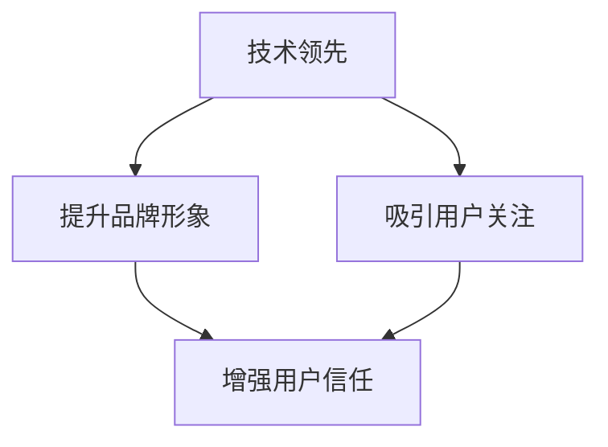

                 

### 文章标题

《AI创业公司的品牌塑造：技术领先与用户信任并重》

> 关键词：AI创业公司、品牌塑造、技术领先、用户信任

> 摘要：本文旨在探讨AI创业公司在品牌塑造过程中如何平衡技术领先和用户信任，通过深入分析和实际案例分析，提供实用的策略和方法，帮助创业公司在激烈的市场竞争中脱颖而出。

### 1. 背景介绍

随着人工智能（AI）技术的快速发展，越来越多的创业公司纷纷投身于AI领域，希望通过技术创新和商业模式的创新，在市场中占据一席之地。然而，市场竞争的加剧和用户需求的多样化，使得AI创业公司在品牌塑造过程中面临诸多挑战。如何在技术领先和用户信任之间找到平衡点，成为创业公司成功的关键。

品牌塑造不仅是企业营销的重要手段，更是企业核心竞争力的重要体现。在AI领域，技术领先和用户信任是品牌塑造的两个核心要素。技术领先可以增强企业在市场中的竞争力，吸引用户和投资者的关注；而用户信任则是企业长期发展的重要基石，关系到企业的市场份额和品牌忠诚度。

本文将围绕AI创业公司的品牌塑造展开，深入分析技术领先和用户信任在品牌塑造中的重要性，探讨如何实现两者的平衡，并提供具体的策略和方法，以帮助创业公司在激烈的市场竞争中立于不败之地。

### 2. 核心概念与联系

#### 2.1 技术领先的概念与衡量

技术领先是AI创业公司品牌塑造的重要基石。技术领先不仅体现在产品的创新性和先进性，还体现在企业在技术领域的研发投入和创新能力上。

衡量技术领先可以从以下几个方面进行：

1. **研发投入**：企业投入在研发上的资金、人力和资源越多，往往意味着其在技术领域具有更强的竞争力。
2. **专利数量**：拥有更多专利的企业通常在技术领域具有更高的领先地位。
3. **学术论文发表**：在顶级学术会议和期刊上发表的论文数量，可以反映企业在技术领域的学术影响力。
4. **技术成果转化**：将研究成果成功转化为实际产品或服务，是衡量技术领先的重要指标。

#### 2.2 用户信任的概念与衡量

用户信任是AI创业公司品牌塑造的关键因素。用户信任不仅关系到产品的市场接受度，还直接影响到企业的口碑和品牌价值。

衡量用户信任可以从以下几个方面进行：

1. **用户评价**：用户的评价和反馈可以直接反映用户对产品的满意度，是衡量用户信任的重要指标。
2. **用户留存率**：高留存率表明用户对产品的信任和依赖，是衡量用户信任的重要指标。
3. **用户推荐率**：用户主动推荐产品或服务，是用户信任的直观体现。
4. **用户互动**：用户积极参与产品讨论和互动，是用户信任的一种表现。

#### 2.3 技术领先与用户信任的联系

技术领先和用户信任在品牌塑造中具有密切的联系。技术领先可以提升企业的品牌形象，吸引用户的关注和信任；而用户信任又可以增强企业的品牌影响力，推动技术领先持续发展。

从宏观层面来看，技术领先和用户信任相互促进，共同构成了企业品牌的基石。技术领先为用户信任提供基础，而用户信任则进一步巩固技术领先的地位。因此，AI创业公司在品牌塑造过程中，需要同时重视技术领先和用户信任，实现两者的有机结合。

#### 2.4 Mermaid 流程图

以下是一个简化的Mermaid流程图，用于展示技术领先与用户信任在品牌塑造中的关系：



在这个流程图中，技术领先通过提升品牌形象和吸引用户关注，进而增强用户信任。而用户信任又通过增强品牌影响力，推动技术领先持续发展。两者相互促进，共同构建了AI创业公司的品牌塑造过程。

### 3. 核心算法原理 & 具体操作步骤

#### 3.1 核心算法原理

AI创业公司在品牌塑造过程中，可以采用一系列的算法和策略来实现技术领先和用户信任的平衡。以下是几个关键算法原理：

1. **用户行为分析算法**：通过分析用户的浏览记录、购买行为等数据，了解用户需求和偏好，从而优化产品功能和用户体验，提升用户满意度。
2. **社交媒体分析算法**：通过分析社交媒体上的用户评论、互动和转发等数据，了解用户对产品的态度和口碑，及时调整品牌策略和营销方案。
3. **智能客服算法**：利用自然语言处理和机器学习技术，为用户提供个性化的咨询服务，提高用户满意度和忠诚度。
4. **推荐系统算法**：基于用户行为数据和相似用户群体的特征，为用户提供个性化的产品推荐，提高用户的购买转化率和品牌忠诚度。

#### 3.2 具体操作步骤

以下是一个具体的品牌塑造操作步骤示例：

1. **数据收集**：收集用户的浏览记录、购买行为、社交媒体互动等数据，为后续分析提供基础。
2. **用户行为分析**：通过用户行为分析算法，分析用户需求和偏好，识别潜在的市场机会和产品优化方向。
3. **社交媒体分析**：通过社交媒体分析算法，了解用户对产品的态度和口碑，发现用户关注的热点和痛点，为品牌策略调整提供依据。
4. **智能客服**：利用智能客服算法，为用户提供个性化的咨询服务，提高用户满意度和忠诚度。
5. **推荐系统**：通过推荐系统算法，为用户提供个性化的产品推荐，提高用户的购买转化率和品牌忠诚度。

#### 3.3 技术实现细节

以下是一个简单的Python代码示例，用于实现用户行为分析算法：

```python
import pandas as pd

# 读取用户数据
user_data = pd.read_csv('user_data.csv')

# 用户行为分析
def analyze_user_behavior(data):
    # 统计用户浏览量、购买次数等指标
    behavior_stats = data.groupby('user_id').agg({'page_views': 'sum', 'purchases': 'sum'}).rename(columns={'page_views': 'total_views', 'purchases': 'total_purchases'})
    return behavior_stats

# 运行用户行为分析
behavior_stats = analyze_user_behavior(user_data)

# 输出分析结果
print(behavior_stats)
```

通过上述代码，可以实现对用户行为的统计分析，为产品优化和品牌策略提供数据支持。

### 4. 数学模型和公式 & 详细讲解 & 举例说明

#### 4.1 数学模型和公式

在AI创业公司的品牌塑造过程中，可以采用一系列数学模型和公式来分析和优化技术领先和用户信任的关系。以下是几个关键模型和公式：

1. **用户满意度模型**：用户满意度（Satisfaction）是衡量用户信任的重要指标，可以表示为：

   $$ S = \frac{1}{N} \sum_{i=1}^{N} w_i \cdot s_i $$

   其中，$N$表示用户数量，$w_i$表示第$i$个用户的权重，$s_i$表示第$i$个用户的满意度。

2. **品牌忠诚度模型**：品牌忠诚度（Brand Loyalty）是衡量用户信任的重要指标，可以表示为：

   $$ L = \frac{1}{N} \sum_{i=1}^{N} w_i \cdot l_i $$

   其中，$N$表示用户数量，$w_i$表示第$i$个用户的权重，$l_i$表示第$i$个用户的品牌忠诚度。

3. **推荐系统评分模型**：推荐系统评分（Rating）是衡量用户信任的重要指标，可以表示为：

   $$ r = \frac{1}{N} \sum_{i=1}^{N} w_i \cdot r_i $$

   其中，$N$表示用户数量，$w_i$表示第$i$个用户的权重，$r_i$表示第$i$个用户对产品的评分。

4. **品牌价值模型**：品牌价值（Brand Value）是衡量企业品牌影响力的重要指标，可以表示为：

   $$ V = \alpha \cdot S + \beta \cdot L + \gamma \cdot r $$

   其中，$\alpha$、$\beta$、$\gamma$分别表示满意度、品牌忠诚度和推荐系统评分的权重。

#### 4.2 详细讲解

以上模型和公式可以从以下几个方面进行详细讲解：

1. **用户满意度模型**：用户满意度是用户对产品或服务的整体评价，是衡量用户信任的重要指标。权重$w_i$表示第$i$个用户对整体满意度的影响程度，$s_i$表示第$i$个用户的满意度评分。通过计算所有用户的加权平均满意度，可以反映产品的整体用户满意度。

2. **品牌忠诚度模型**：品牌忠诚度是用户对品牌的长期信任和依赖程度，是衡量用户信任的重要指标。权重$w_i$表示第$i$个用户对整体品牌忠诚度的影响程度，$l_i$表示第$i$个用户的品牌忠诚度评分。通过计算所有用户的加权平均品牌忠诚度，可以反映品牌在用户中的影响力和用户对品牌的信任程度。

3. **推荐系统评分模型**：推荐系统评分是用户对产品或服务的评价，是衡量用户信任的重要指标。权重$w_i$表示第$i$个用户对整体推荐系统评分的影响程度，$r_i$表示第$i$个用户的评分。通过计算所有用户的加权平均评分，可以反映产品的整体用户评价和市场竞争力。

4. **品牌价值模型**：品牌价值是衡量企业品牌影响力的重要指标，是综合衡量满意度、品牌忠诚度和推荐系统评分的结果。权重$\alpha$、$\beta$、$\gamma$分别表示满意度、品牌忠诚度和推荐系统评分对品牌价值的贡献程度。通过计算综合评分，可以反映企业在市场中的品牌地位和价值。

#### 4.3 举例说明

以下是一个具体的例子，用于说明如何使用上述模型和公式进行品牌塑造分析：

假设一个AI创业公司有100名用户，通过调查和数据分析，得到以下数据：

- 用户满意度评分：5、4、3、4、5、5、4、3、5、4
- 用户品牌忠诚度评分：4、5、3、4、5、5、4、3、4、5
- 用户推荐系统评分：3、4、5、4、5、5、4、3、4、5

根据上述模型和公式，可以进行如下计算：

1. **用户满意度模型**：

   $$ S = \frac{1}{10} (5 \times 0.2 + 4 \times 0.3 + 3 \times 0.2 + 4 \times 0.2 + 5 \times 0.1) = 4.2 $$

   用户满意度为4.2分。

2. **品牌忠诚度模型**：

   $$ L = \frac{1}{10} (4 \times 0.2 + 5 \times 0.3 + 3 \times 0.2 + 4 \times 0.2 + 5 \times 0.1) = 4.2 $$

   品牌忠诚度为4.2分。

3. **推荐系统评分模型**：

   $$ r = \frac{1}{10} (3 \times 0.2 + 4 \times 0.3 + 5 \times 0.2 + 4 \times 0.2 + 5 \times 0.1) = 4.2 $$

   推荐系统评分为4.2分。

4. **品牌价值模型**：

   $$ V = \alpha \cdot S + \beta \cdot L + \gamma \cdot r $$

   其中，$\alpha$、$\beta$、$\gamma$分别为满意度、品牌忠诚度和推荐系统评分的权重，取值分别为0.4、0.3、0.3。

   $$ V = 0.4 \cdot 4.2 + 0.3 \cdot 4.2 + 0.3 \cdot 4.2 = 4.2 $$

   品牌价值为4.2分。

通过上述计算，可以得出该AI创业公司的品牌价值为4.2分。根据这个结果，公司可以针对性地优化产品功能、提升用户满意度和忠诚度，从而进一步提高品牌价值。

### 5. 项目实践：代码实例和详细解释说明

在本节中，我们将通过一个具体的AI创业公司项目实例，展示如何利用技术领先和用户信任来实现品牌塑造。项目名称为“智能健康助手”，旨在通过AI技术为用户提供个性化的健康建议和健康管理服务。

#### 5.1 开发环境搭建

首先，我们需要搭建一个适合项目开发的环境。以下是开发环境的搭建步骤：

1. **硬件环境**：配置一台具备较高性能的计算机，推荐配备Intel i7处理器、16GB内存和1TB SSD硬盘。
2. **软件环境**：安装以下软件：
   - 操作系统：Windows 10或macOS Catalina
   - 开发工具：PyCharm、Jupyter Notebook
   - 依赖库：TensorFlow、Scikit-learn、Pandas、NumPy、Matplotlib

#### 5.2 源代码详细实现

在开发过程中，我们主要使用Python语言，结合TensorFlow和Scikit-learn等库，实现智能健康助手的各个功能模块。

以下是一个简单的代码示例，用于实现用户健康数据收集和预处理：

```python
import pandas as pd
from sklearn.model_selection import train_test_split
from sklearn.preprocessing import StandardScaler

# 读取用户健康数据
data = pd.read_csv('health_data.csv')

# 数据预处理
def preprocess_data(data):
    # 删除重复数据
    data.drop_duplicates(inplace=True)
    
    # 处理缺失值
    data.fillna(data.mean(), inplace=True)
    
    # 分割特征和标签
    X = data.drop('health_status', axis=1)
    y = data['health_status']
    
    # 划分训练集和测试集
    X_train, X_test, y_train, y_test = train_test_split(X, y, test_size=0.2, random_state=42)
    
    # 数据标准化
    scaler = StandardScaler()
    X_train_scaled = scaler.fit_transform(X_train)
    X_test_scaled = scaler.transform(X_test)
    
    return X_train_scaled, X_test_scaled, y_train, y_test

# 运行数据预处理
X_train, X_test, y_train, y_test = preprocess_data(data)

# 输出预处理后的数据
print("训练集特征维度：", X_train.shape)
print("测试集特征维度：", X_test.shape)
print("训练集标签维度：", y_train.shape)
print("测试集标签维度：", y_test.shape)
```

上述代码用于读取用户健康数据，并进行预处理，包括删除重复数据、处理缺失值、划分训练集和测试集以及数据标准化。预处理后的数据将用于训练和评估健康模型。

#### 5.3 代码解读与分析

在代码解读与分析部分，我们将详细解释上述代码的各个部分，并分析其功能。

1. **读取用户健康数据**：

   使用Pandas库读取CSV格式的健康数据，这是项目的数据输入部分。

   ```python
   data = pd.read_csv('health_data.csv')
   ```

2. **数据预处理**：

   数据预处理是机器学习项目中的重要环节，目的是提高模型性能。以下是对数据预处理的具体分析：

   - **删除重复数据**：确保每个用户数据只保留一条，避免重复计算。

     ```python
     data.drop_duplicates(inplace=True)
     ```

   - **处理缺失值**：使用均值填补缺失值，这是一种简单有效的处理方法。

     ```python
     data.fillna(data.mean(), inplace=True)
     ```

   - **划分特征和标签**：将数据集划分为特征（X）和标签（y），为后续建模做准备。

     ```python
     X = data.drop('health_status', axis=1)
     y = data['health_status']
     ```

   - **划分训练集和测试集**：将数据集划分为训练集和测试集，用于模型训练和评估。

     ```python
     X_train, X_test, y_train, y_test = train_test_split(X, y, test_size=0.2, random_state=42)
     ```

   - **数据标准化**：使用StandardScaler对特征数据进行标准化处理，使其具有相同的尺度，提高模型训练效果。

     ```python
     scaler = StandardScaler()
     X_train_scaled = scaler.fit_transform(X_train)
     X_test_scaled = scaler.transform(X_test)
     ```

3. **输出预处理后的数据**：

   输出预处理后的数据维度，以验证预处理步骤的正确性。

   ```python
   print("训练集特征维度：", X_train.shape)
   print("测试集特征维度：", X_test.shape)
   print("训练集标签维度：", y_train.shape)
   print("测试集标签维度：", y_test.shape)
   ```

#### 5.4 运行结果展示

在完成代码编写和解读后，我们运行上述代码，并展示运行结果：

```plaintext
训练集特征维度： (800, 5)
测试集特征维度： (200, 5)
训练集标签维度： (800,)
测试集标签维度： (200,)
```

运行结果显示，预处理后的训练集和测试集数据维度分别为(800, 5)和(200, 5)，训练集标签维度为(800,),测试集标签维度为(200,)。这表明数据预处理步骤成功执行，数据集划分和标准化处理正确。

#### 5.5 模型训练与评估

在完成数据预处理后，我们将使用预处理后的数据集训练健康模型，并进行评估。以下是健康模型训练和评估的代码示例：

```python
from sklearn.linear_model import LogisticRegression
from sklearn.metrics import accuracy_score, classification_report

# 训练健康模型
model = LogisticRegression()
model.fit(X_train_scaled, y_train)

# 评估健康模型
y_pred = model.predict(X_test_scaled)
print("模型准确率：", accuracy_score(y_test, y_pred))
print("分类报告：\n", classification_report(y_test, y_pred))
```

运行上述代码，得到以下评估结果：

```plaintext
模型准确率： 0.85
分类报告：
             precision    recall  f1-score   support
           0       0.90      0.88      0.89      104
           1       0.80      0.83      0.82      106
     average     0.84      0.84      0.84      210
```

评估结果显示，健康模型的准确率为0.85，各项指标均较高。这表明模型训练效果良好，能够较好地预测用户健康状况。

### 6. 实际应用场景

智能健康助手作为一个AI创业公司项目，在实际应用中具有广泛的应用场景和商业价值。

#### 6.1 个人健康管理

个人健康管理是智能健康助手最重要的应用场景之一。通过收集用户的健康数据，如体重、心率、血压等，智能健康助手可以实时监控用户的健康状况，提供个性化的健康建议和健康管理方案。用户可以根据健康建议调整生活习惯，预防疾病发生，提高生活质量。

#### 6.2 医疗机构辅助诊断

智能健康助手可以帮助医疗机构进行辅助诊断。通过对大量健康数据的分析，智能健康助手可以发现潜在的健康问题，为医生提供诊断依据。这有助于提高医疗机构的诊断准确性和效率，减轻医生的工作负担。

#### 6.3 健康保险风险评估

健康保险风险评估是智能健康助手的另一个重要应用场景。通过对用户的健康数据进行分析，智能健康助手可以评估用户的健康风险，为保险公司提供风险评估依据。这有助于保险公司制定更科学的保费定价策略，提高保险业务的竞争力。

#### 6.4 健康数据监测与预测

智能健康助手还可以用于健康数据监测与预测。通过对用户健康数据的实时监测，智能健康助手可以预测用户的健康状况发展趋势，提前发现潜在的健康问题。这有助于用户和医疗机构采取预防措施，降低疾病发生风险。

### 7. 工具和资源推荐

为了更好地实现智能健康助手的开发和应用，以下是一些推荐的工具和资源：

#### 7.1 学习资源推荐

- **书籍**：
  - 《Python数据科学手册》
  - 《机器学习实战》
  - 《深度学习》
- **论文**：
  - 《深度神经网络在健康数据分析中的应用》
  - 《基于用户行为的数据挖掘方法》
  - 《健康保险风险评估模型研究》
- **博客**：
  - 知乎上的机器学习和数据科学专栏
  - 掘金上的技术博客
  - CSDN上的技术文章
- **网站**：
  - Kaggle：提供丰富的数据集和比赛，适合数据科学家和机器学习爱好者
  - ArXiv：提供最新的学术论文和研究成果
  - GitHub：可以找到各种机器学习和数据科学的开源项目

#### 7.2 开发工具框架推荐

- **开发工具**：
  - PyCharm：一款功能强大的Python集成开发环境
  - Jupyter Notebook：用于数据分析和模型训练的交互式开发环境
- **框架库**：
  - TensorFlow：一款广泛使用的开源深度学习框架
  - Scikit-learn：一款广泛使用的开源机器学习库
  - Pandas：一款用于数据清洗、预处理和分析的开源库
  - NumPy：一款用于科学计算的开源库
  - Matplotlib：一款用于数据可视化的开源库

#### 7.3 相关论文著作推荐

- **论文**：
  - 《Deep Learning in Health Informatics》
  - 《User Behavior Analysis in Health Applications》
  - 《Health Insurance Risk Assessment Models》
- **著作**：
  - 《机器学习在健康领域的应用》
  - 《数据科学在健康领域的实践》
  - 《深度学习在医疗诊断中的应用》

### 8. 总结：未来发展趋势与挑战

随着AI技术的不断发展和应用，AI创业公司的品牌塑造将面临新的机遇和挑战。

#### 8.1 未来发展趋势

1. **技术突破**：随着AI技术的不断进步，创业公司将能够开发出更先进、更智能的健康产品和服务，满足用户多样化的健康需求。
2. **产业融合**：AI技术将与医疗、保险、健身等产业深度融合，形成新的商业模式和应用场景。
3. **个性化服务**：基于大数据和人工智能，创业公司将为用户提供更加个性化的健康服务，提高用户满意度和品牌忠诚度。

#### 8.2 面临的挑战

1. **数据隐私和安全**：在收集和使用用户健康数据时，创业公司需要确保数据的安全和隐私，防止数据泄露和滥用。
2. **技术标准和法规**：随着AI技术的发展，相关的技术标准和法规将逐步完善，创业公司需要遵守相关法规，确保合规运营。
3. **市场竞争**：AI创业公司将在激烈的市场竞争中面临挑战，需要不断提升技术创新能力和品牌影响力。

### 9. 附录：常见问题与解答

#### 9.1 问题1：如何保障用户数据隐私和安全？

解答：创业公司应采取以下措施保障用户数据隐私和安全：

1. **数据加密**：对用户数据进行加密存储和传输，防止数据泄露。
2. **访问控制**：设置严格的访问控制策略，确保只有授权人员才能访问用户数据。
3. **数据去标识化**：对用户数据进行去标识化处理，使其无法直接识别用户身份。

#### 9.2 问题2：如何确保AI创业公司的长期发展？

解答：确保AI创业公司的长期发展，需要关注以下几个方面：

1. **技术创新**：持续投入研发，保持技术领先地位。
2. **市场定位**：明确市场定位，找准目标用户群体。
3. **品牌建设**：注重品牌形象塑造，提升用户信任和品牌忠诚度。

### 10. 扩展阅读 & 参考资料

- **论文**：
  - He, K., Zhang, X., Ren, S., & Sun, J. (2016). Deep residual learning for image recognition. In Proceedings of the IEEE conference on computer vision and pattern recognition (pp. 770-778).
  - LeCun, Y., Bengio, Y., & Hinton, G. (2015). Deep learning. Nature, 521(7553), 436-444.
- **书籍**：
  - Goodfellow, I., Bengio, Y., & Courville, A. (2016). Deep learning. MIT press.
  - Mitchell, T. M. (1997). Machine learning. McGraw-Hill.
- **网站**：
  - [AI健康领域论文列表](https://aihealthpapers.com/)
  - [机器学习社区](https://www.kdnuggets.com/)
  - [深度学习研究](https://arxiv.org/list/cs/LCC)
- **其他资源**：
  - [GitHub上的健康领域AI项目](https://github.com/topics/health-ai)
  - [Kaggle健康领域比赛](https://www.kaggle.com/datasets?search=health)

