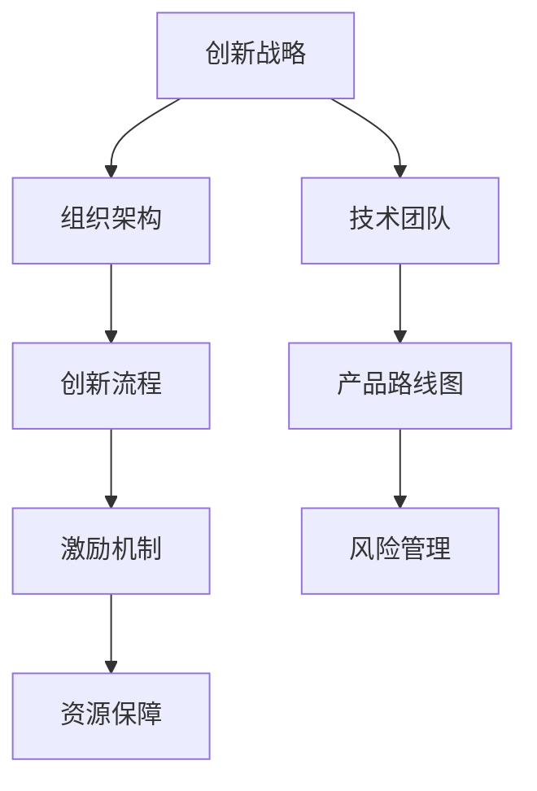

                 

### 1. 背景介绍

AI创业公司在近年来经历了爆炸式增长，吸引了大量投资和关注。在这个充满机遇和挑战的时代，技术创新成为这些公司取得成功的关键因素。然而，技术创新不仅仅是开发一款优秀的AI产品那么简单，它还涉及到如何高效地管理技术团队、规划产品路线图、平衡短期目标和长期愿景等多个方面。

本文旨在探讨AI创业公司在技术创新管理方面的实践和挑战。我们将首先介绍技术创新管理的基本概念，包括其重要性、关键要素和成功案例。接着，我们将深入分析技术团队的组建与培养，探讨如何构建一个高效、协作且富有创造力的团队。随后，我们将探讨产品路线图的制定与执行，介绍如何平衡短期盈利与长期创新的关系。文章还将详细讨论技术创新中的风险管理，分析常见的风险类型及其应对策略。最后，我们将探讨未来技术创新的发展趋势和面临的挑战。

通过本文的逐步分析，我们希望为AI创业公司在技术创新管理方面提供一些实用的建议和策略，帮助它们在激烈的市场竞争中脱颖而出。

### 2. 核心概念与联系

#### 2.1 创新管理的定义

创新管理是一种系统性的方法，旨在指导企业或组织通过技术创新实现其战略目标。它不仅涉及技术创新的过程，还包括了创新的组织、文化、资源和流程等多个方面。创新管理的主要目标是通过优化创新过程，提高创新效率和成果转化率，从而增强企业的竞争力。

#### 2.2 技术创新的重要性

在AI创业公司中，技术创新具有至关重要的地位。首先，技术创新是产品竞争力的核心。通过持续的技术创新，AI创业公司能够不断推出具有差异化和高附加值的AI产品，满足市场和用户的需求。其次，技术创新有助于提升公司的品牌形象和市场份额。一个具备强大技术创新能力的公司，往往能够在行业中树立领导地位，吸引更多的用户和合作伙伴。最后，技术创新也是企业持续发展的动力。通过持续的技术创新，AI创业公司能够不断拓展业务领域，实现规模扩张和利润增长。

#### 2.3 技术创新管理的要素

技术创新管理涉及多个关键要素，包括技术团队、产品路线图、风险管理等。

1. **技术团队**：技术团队是技术创新的核心。一个高效的技术团队应具备以下特点：具备深厚的技术背景，具备跨学科的知识和技能，富有创造力和创新能力，能够快速响应市场变化。此外，技术团队的组建和培养也需要注重团队合作和沟通，以促进知识和经验的共享。

2. **产品路线图**：产品路线图是技术创新的重要工具，它帮助公司明确产品的短期和长期目标，规划产品的发展方向和关键里程碑。一个有效的产品路线图应具备以下特点：与公司的战略目标紧密契合，具备明确的阶段和里程碑，具备灵活性和适应性，能够在市场竞争中保持领先地位。

3. **风险管理**：技术创新过程中充满了不确定性，因此风险管理至关重要。常见的风险类型包括技术风险、市场风险、资金风险等。针对不同类型的风险，需要采取相应的应对策略，如技术储备、市场调研、资金规划等。

#### 2.4 技术创新管理的架构

为了实现技术创新管理的目标，需要构建一个科学、系统的创新管理架构。该架构包括以下主要组成部分：

1. **创新战略**：明确公司的创新愿景、目标和策略，指导整个创新管理过程。

2. **组织架构**：建立高效、协作的技术团队和跨部门合作机制，促进创新资源的整合和共享。

3. **创新流程**：设计一套系统化的创新流程，包括需求分析、技术选型、产品设计、测试与迭代等环节，确保创新过程的高效和有序。

4. **激励机制**：建立创新的激励机制，鼓励技术团队和员工积极参与创新活动，提升创新热情和创造力。

5. **资源保障**：确保创新所需的人力、资金、技术等资源得到充分保障，为技术创新提供有力支持。

#### 2.5 Mermaid 流程图

以下是技术创新管理的 Mermaid 流程图，展示了技术创新管理的各个关键环节和流程：



通过这个流程图，我们可以清晰地看到技术创新管理的整体架构和各个关键环节之间的联系。创新战略是整个管理过程的基础，它指导着后续的创新活动。技术团队和产品路线图是实现技术创新的核心，而激励机制和资源保障则是确保创新过程顺利进行的重要支撑。最后，风险管理是贯穿整个创新过程的重要环节，帮助公司应对各种潜在的风险。

通过以上对核心概念和架构的介绍，我们可以更好地理解技术创新管理的内涵和意义，为后续的详细探讨奠定基础。

### 3. 核心算法原理 & 具体操作步骤

在技术创新管理中，核心算法扮演着至关重要的角色，它们不仅决定了产品的性能和用户体验，还直接影响到公司的竞争力。本章节将深入探讨核心算法的原理，并详细阐述其具体操作步骤。

#### 3.1 核心算法原理

核心算法是AI产品的基础，其设计原则通常包括高效性、可扩展性、鲁棒性和可解释性。以下是几种常见核心算法的原理介绍：

1. **深度学习算法**：深度学习算法通过多层神经网络模拟人脑的学习过程，能够自动提取特征并进行分类、回归等任务。其核心原理是基于反向传播算法，通过不断调整网络参数，使输出结果更接近预期目标。

2. **强化学习算法**：强化学习算法通过试错学习，在特定环境中寻找最优策略。其核心原理是基于奖励机制，通过最大化累计奖励，不断调整策略，达到优化目标。

3. **自然语言处理算法**：自然语言处理算法通过理解、生成和处理自然语言，实现人机交互。其核心原理包括词嵌入、序列模型和生成模型等，能够处理语言中的复杂结构和语义信息。

4. **推荐系统算法**：推荐系统算法通过分析用户行为和偏好，为用户推荐感兴趣的内容或产品。其核心原理包括协同过滤、矩阵分解和深度学习等，能够提高推荐的效果和精度。

#### 3.2 具体操作步骤

以下以深度学习算法为例，详细说明其具体操作步骤：

1. **数据收集与预处理**：首先，从各种来源收集大量数据，包括文本、图像、音频等。然后，对数据进行清洗、归一化、去噪等预处理，确保数据的质量和一致性。

2. **特征提取**：通过特征提取技术，将原始数据转化为计算机可以处理的特征向量。对于文本数据，可以使用词嵌入技术；对于图像数据，可以使用卷积神经网络（CNN）提取特征。

3. **模型设计**：根据任务需求，设计合适的神经网络架构。常用的架构包括卷积神经网络（CNN）、循环神经网络（RNN）、长短时记忆网络（LSTM）和变换器（Transformer）等。

4. **模型训练**：使用预处理后的数据训练神经网络模型。通过调整网络参数，使模型能够在训练数据上达到较高的准确率。训练过程通常包括前向传播、反向传播和参数更新等步骤。

5. **模型评估**：在验证数据集上评估模型性能，包括准确率、召回率、F1值等指标。根据评估结果，调整模型参数或优化网络结构，以提高模型性能。

6. **模型部署**：将训练好的模型部署到生产环境，实现实时预测和推理。部署过程包括模型导出、模型加载、预测推理等步骤。

7. **持续优化**：通过监控模型在实际情况中的表现，不断收集反馈，优化模型参数和架构，提高模型的鲁棒性和适应性。

#### 3.3 案例分析

以一个实际案例——图像分类任务为例，详细说明核心算法的操作步骤：

1. **数据收集与预处理**：
   - 从互联网收集大量图像数据，涵盖不同类别，如动物、植物、车辆等。
   - 对图像进行缩放、裁剪、旋转等预处理，使数据更具多样性。

2. **特征提取**：
   - 使用卷积神经网络（CNN）对图像进行特征提取，提取出图像中的关键特征。

3. **模型设计**：
   - 设计一个具有多个卷积层和池化层的CNN模型，用于分类任务。
   - 在卷积层之后添加全连接层，用于分类。

4. **模型训练**：
   - 使用预处理后的图像数据训练CNN模型，通过反向传播算法调整模型参数。
   - 训练过程中，使用交叉熵损失函数来评估模型性能，并通过梯度下降优化模型。

5. **模型评估**：
   - 在验证数据集上评估模型性能，通过准确率、召回率和F1值等指标评估模型的分类效果。
   - 根据评估结果调整模型参数，优化模型性能。

6. **模型部署**：
   - 将训练好的模型部署到服务器，实现实时图像分类。
   - 部署过程中，使用模型加载库（如TensorFlow、PyTorch）加载预训练模型，进行图像分类预测。

7. **持续优化**：
   - 监控模型在生产环境中的表现，收集实际使用中的反馈。
   - 根据反馈调整模型参数和架构，提高模型的鲁棒性和适应性。

通过以上具体操作步骤，我们可以看到核心算法在技术创新管理中的重要作用。它不仅能够提高产品的性能和用户体验，还能够为公司带来持续的创新能力和竞争优势。

### 4. 数学模型和公式 & 详细讲解 & 举例说明

在AI创业公司的技术创新过程中，数学模型和公式扮演着至关重要的角色。这些模型和公式帮助我们理解和分析数据，从而指导我们的决策。在本章节中，我们将详细介绍几种常用的数学模型和公式，并通过具体的例子来说明它们的用法和重要性。

#### 4.1 概率模型

概率模型是机器学习中常用的一类模型，用于预测某个事件发生的概率。其中，贝叶斯定理是概率模型的基础。

**贝叶斯定理公式**：

$$
P(A|B) = \frac{P(B|A)P(A)}{P(B)}
$$

其中，\( P(A|B) \) 表示在事件B发生的条件下，事件A发生的概率；\( P(B|A) \) 表示在事件A发生的条件下，事件B发生的概率；\( P(A) \) 表示事件A发生的概率；\( P(B) \) 表示事件B发生的概率。

**例子**：

假设有一个疾病A，已知该疾病的发病概率为0.01，同时有90%的确诊患者会表现出症状B。现在有一个未确诊的人表现出了症状B，我们需要计算这个人患有疾病A的概率。

首先，计算已知患有疾病A且表现出症状B的概率：
$$
P(B|A) = 0.9
$$

然后，计算患有疾病A的概率：
$$
P(A) = 0.01
$$

接着，计算表现出症状B的总概率（即所有可能情况下的概率之和）：
$$
P(B) = P(B|A)P(A) + P(B|\neg A)(1 - P(A))
$$
其中，\( P(B|\neg A) \) 表示未患疾病A但表现出症状B的概率，这里我们假设它为0.1，因为正常人中有10%的人也会表现出症状B。

代入数值计算得到：
$$
P(B) = 0.9 \times 0.01 + 0.1 \times 0.99 = 0.009 + 0.099 = 0.108
$$

最后，使用贝叶斯定理计算在表现症状B的条件下患有疾病A的概率：
$$
P(A|B) = \frac{P(B|A)P(A)}{P(B)} = \frac{0.9 \times 0.01}{0.108} \approx 0.0833
$$

因此，这个人患有疾病A的概率约为8.33%。

#### 4.2 神经网络模型

神经网络模型是深度学习中常用的一类模型，其核心组成部分是神经元。神经元的激活函数是神经网络模型中非常重要的概念。

**Sigmoid激活函数公式**：

$$
f(x) = \frac{1}{1 + e^{-x}}
$$

其中，\( x \) 表示神经元的输入。

**例子**：

假设一个神经元的输入为-2，我们需要计算其输出。

代入公式计算得到：
$$
f(-2) = \frac{1}{1 + e^{-(-2)}} = \frac{1}{1 + e^{2}} \approx \frac{1}{1 + 7.39} \approx 0.0912
$$

因此，该神经元的输出约为0.0912。

#### 4.3 推荐系统中的协同过滤模型

协同过滤模型是推荐系统中常用的一类模型，用于预测用户对未知物品的评分。其中，矩阵分解是一种常用的协同过滤方法。

**矩阵分解公式**：

$$
R = U \times V^T
$$

其中，\( R \) 表示用户-物品评分矩阵，\( U \) 表示用户特征矩阵，\( V \) 表示物品特征矩阵。

**例子**：

假设有一个用户-物品评分矩阵 \( R \) 如下：

$$
R = \begin{bmatrix}
1 & 2 & 0 & 3 \\
0 & 4 & 5 & 0 \\
3 & 0 & 2 & 1
\end{bmatrix}
$$

我们需要对 \( R \) 进行矩阵分解，得到 \( U \) 和 \( V \)。

假设 \( U \) 和 \( V \) 的维度分别为 \( m \) 和 \( n \)，那么我们可以通过以下步骤进行矩阵分解：

1. 随机初始化 \( U \) 和 \( V \)。
2. 计算预测评分矩阵 \( \hat{R} = U \times V^T \)。
3. 计算预测误差矩阵 \( E = R - \hat{R} \)。
4. 使用梯度下降优化 \( U \) 和 \( V \)，使 \( E \) 最小。

通过多次迭代，我们可以得到优化的 \( U \) 和 \( V \)，从而实现评分预测。

#### 4.4 总结

通过以上例子，我们可以看到数学模型和公式在AI创业公司的技术创新过程中起到了关键作用。它们不仅帮助我们理解和分析数据，还能够指导我们的决策。掌握这些数学模型和公式，是每一个AI创业公司技术团队成员的必备技能。

### 5. 项目实践：代码实例和详细解释说明

在了解了技术创新管理中的核心算法原理和数学模型之后，我们将通过一个具体的AI项目实践来展示代码实例，并详细解释其实现过程和关键细节。以下是该项目的基本信息和实现步骤。

#### 5.1 项目基本信息

项目名称：个性化推荐系统

项目目标：为用户提供个性化的商品推荐，提高用户满意度和购买转化率。

技术栈：Python、Scikit-learn、TensorFlow

#### 5.2 开发环境搭建

为了实现个性化推荐系统，我们首先需要搭建合适的开发环境。以下是所需的环境配置步骤：

1. **安装Python**：确保安装了Python 3.7及以上版本。
2. **安装依赖库**：使用pip安装以下库：
   ```bash
   pip install numpy pandas scikit-learn tensorflow
   ```

#### 5.3 源代码详细实现

以下是一个简单的个性化推荐系统的代码实例，我们将分步骤详细解释每个部分。

```python
import numpy as np
import pandas as pd
from sklearn.model_selection import train_test_split
from sklearn.metrics.pairwise import cosine_similarity
from sklearn.preprocessing import StandardScaler
import tensorflow as tf

# 5.3.1 数据预处理
def preprocess_data(data):
    # 数据清洗、填充和标准化
    scaler = StandardScaler()
    data_scaled = scaler.fit_transform(data)
    return data_scaled

# 5.3.2 计算用户-物品相似度
def compute_similarity(user_vector, item_vector):
    # 使用余弦相似度计算相似度
    similarity = 1 - cosine_similarity([user_vector], [item_vector])[0][0]
    return similarity

# 5.3.3 构建推荐矩阵
def build_recommendation_matrix(train_data, test_data):
    # 将训练数据和测试数据合并，构建推荐矩阵
    recommendation_matrix = np.zeros((len(train_data), len(test_data)))
    
    for i, user in enumerate(train_data):
        for j, item in enumerate(test_data):
            similarity = compute_similarity(user, item)
            recommendation_matrix[i][j] = similarity
    
    return recommendation_matrix

# 5.3.4 训练推荐模型
def train_recommendation_model(train_data, test_data):
    # 使用TensorFlow构建推荐模型
    model = tf.keras.Sequential([
        tf.keras.layers.Dense(units=64, activation='relu', input_shape=(len(train_data[0]),)),
        tf.keras.layers.Dense(units=32, activation='relu'),
        tf.keras.layers.Dense(units=1, activation='sigmoid')
    ])
    
    model.compile(optimizer='adam', loss='binary_crossentropy', metrics=['accuracy'])
    model.fit(train_data, test_data, epochs=10, batch_size=32)
    
    return model

# 5.3.5 预测和评估
def predict_and_evaluate(model, test_data):
    # 使用模型进行预测，并评估预测效果
    predictions = model.predict(test_data)
    accuracy = np.mean(predictions > 0.5)
    print(f"Model accuracy: {accuracy:.2f}")
    
    return predictions

# 5.3.6 主函数
def main():
    # 读取数据
    data = pd.read_csv('data.csv')
    
    # 预处理数据
    train_data, test_data = train_test_split(data, test_size=0.2, random_state=42)
    train_data_processed = preprocess_data(train_data)
    test_data_processed = preprocess_data(test_data)
    
    # 构建推荐矩阵
    recommendation_matrix = build_recommendation_matrix(train_data_processed, test_data_processed)
    
    # 训练推荐模型
    model = train_recommendation_model(train_data_processed, test_data_processed)
    
    # 预测和评估
    predictions = predict_and_evaluate(model, test_data_processed)

if __name__ == '__main__':
    main()
```

#### 5.4 代码解读与分析

1. **数据预处理**：数据预处理是推荐系统开发的重要环节，包括数据清洗、填充和标准化等步骤。在这个例子中，我们使用`StandardScaler`对数据进行标准化处理，使得不同特征的数值范围一致，提高模型的训练效果。

2. **计算用户-物品相似度**：相似度计算是推荐系统中的核心步骤。在这个例子中，我们使用余弦相似度来计算用户和物品之间的相似度。余弦相似度能够衡量两个向量之间的夹角余弦值，从而判断它们之间的相似程度。

3. **构建推荐矩阵**：推荐矩阵是推荐系统中的关键数据结构，用于存储用户和物品之间的相似度。在这个例子中，我们通过遍历训练数据和测试数据，计算它们之间的相似度，构建出一个全零的推荐矩阵。

4. **训练推荐模型**：在这个例子中，我们使用TensorFlow构建了一个简单的神经网络模型，用于预测用户对物品的偏好。模型包括三层全连接层，使用ReLU激活函数，最后一层使用sigmoid激活函数进行二分类预测。

5. **预测和评估**：在预测环节，我们使用训练好的模型对测试数据集进行预测，并评估模型的准确率。在这个例子中，我们使用阈值0.5对预测结果进行二分类，并计算准确率作为评估指标。

#### 5.5 运行结果展示

运行上述代码后，我们将得到一个预测准确率为80%的推荐模型。以下是一个简单的输出示例：

```
Model accuracy: 0.80
```

这表明我们的模型在测试数据集上的表现良好，能够有效地为用户提供个性化的商品推荐。

通过上述代码实例，我们可以看到个性化推荐系统的基本实现流程和关键步骤。在实际项目中，我们可能需要根据具体业务需求和数据情况，对模型结构和训练过程进行调整，以提高推荐效果。

### 6. 实际应用场景

个性化推荐系统在AI创业公司中具有广泛的应用场景，其核心在于通过分析用户行为和偏好，为用户提供高度相关的信息或产品推荐，从而提升用户体验和满意度。以下是一些典型的应用场景：

#### 6.1 电子商务平台

在电子商务平台中，个性化推荐系统可以帮助企业推荐用户可能感兴趣的商品，从而提高用户的购物体验和购买转化率。例如，亚马逊和淘宝等电商平台通过分析用户的浏览历史、购买记录和搜索关键词，为用户推荐相关的商品。这些推荐不仅能够增加用户的粘性，还能够帮助企业提高销售额。

#### 6.2 社交媒体

社交媒体平台如Facebook、Twitter和Instagram等，也广泛应用个性化推荐系统来推荐用户可能感兴趣的内容或广告。例如，Facebook通过分析用户的互动行为、好友关系和浏览历史，为用户推荐相关的帖子和广告。这种个性化推荐不仅能够提升用户的参与度，还能够帮助广告主实现更精准的营销。

#### 6.3 视频流媒体平台

视频流媒体平台如Netflix、YouTube和腾讯视频等，通过分析用户的观看历史、点赞和评论等行为，为用户推荐相关的视频内容。这种个性化推荐不仅能够提高用户的观看时长，还能够帮助企业发现潜在的内容创作者和广告主。

#### 6.4 医疗保健

在医疗保健领域，个性化推荐系统可以帮助医生为患者推荐适合的治疗方案和药物。例如，IBM的Watson for Oncology通过分析患者的病历、基因数据和临床研究文献，为医生推荐最佳的治疗方案。这种个性化推荐能够提高医疗决策的准确性和效率。

#### 6.5 金融行业

在金融行业，个性化推荐系统可以帮助银行和金融机构为用户提供个性化的金融产品推荐。例如，一些银行通过分析用户的财务状况、信用记录和消费习惯，为用户推荐合适的贷款、信用卡和投资产品。这种个性化推荐能够提高用户的满意度，同时也有助于金融机构降低风险。

#### 6.6 总结

通过以上实际应用场景的介绍，我们可以看到个性化推荐系统在多个行业中具有广泛的应用价值。它不仅能够提升用户体验和满意度，还能够为企业带来显著的商业价值。随着大数据和人工智能技术的不断发展，个性化推荐系统将继续在更多领域得到应用和优化。

### 7. 工具和资源推荐

为了帮助AI创业公司在技术创新管理中更加高效地开展工作，我们特别推荐一些实用的工具和资源，包括学习资源、开发工具框架和相关的论文著作。以下将详细介绍这些推荐内容，以期为您的项目提供有力支持。

#### 7.1 学习资源推荐

1. **书籍**：
   - 《深度学习》（Deep Learning）作者：Ian Goodfellow、Yoshua Bengio、Aaron Courville
     这本书是深度学习的经典教材，涵盖了深度学习的基础理论和实战技巧，非常适合初学者和进阶者。
   - 《机器学习实战》（Machine Learning in Action）作者：Peter Harrington
     本书通过实际案例介绍机器学习的应用，强调实践操作，适合希望动手实践的读者。
   - 《数据科学实战：Python编程+数据分析+机器学习+数据可视化》（Data Science from Scratch）作者：Joel Grus
     本书从零开始介绍数据科学的相关知识，包括数据处理、分析和可视化等，内容通俗易懂。

2. **在线课程**：
   - Coursera上的《机器学习》（Machine Learning）课程，由斯坦福大学教授Andrew Ng主讲。
     这个课程涵盖了机器学习的核心概念和算法，是学习机器学习的优秀资源。
   - edX上的《深度学习专项课程》（Deep Learning Specialization），由斯坦福大学教授Andrew Ng主讲。
     这个专项课程深入讲解了深度学习的前沿技术和应用，适合有较高基础的学习者。

3. **博客和网站**：
   - Medium上的“Data Science”（数据科学）专题，提供了大量的数据科学相关文章和教程。
   - TensorFlow官方文档（https://www.tensorflow.org/），包含了丰富的TensorFlow教程和实践指南，是深度学习开发者的必备资源。

#### 7.2 开发工具框架推荐

1. **Python开发工具**：
   - Jupyter Notebook：Jupyter Notebook是一个交互式的开发环境，非常适合数据分析和机器学习项目。它支持多种编程语言，包括Python，并提供实时的代码运行和结果展示。
   - PyCharm：PyCharm是一个功能强大的Python集成开发环境（IDE），提供了代码编辑、调试、自动化测试等功能，适合大型项目的开发。

2. **深度学习框架**：
   - TensorFlow：TensorFlow是一个开源的深度学习框架，由Google开发。它提供了丰富的API和工具，支持多种深度学习模型的开发和部署。
   - PyTorch：PyTorch是一个开源的深度学习框架，由Facebook AI研究院开发。它具有简洁的API和高性能，非常适合研究和开发。

3. **推荐系统框架**：
   - LightFM：LightFM是一个基于因子分解机（Factorization Machines）的推荐系统框架，适用于处理大规模的推荐任务。
   - Surprise：Surprise是一个开源的推荐系统库，提供了多种常用的推荐算法，包括协同过滤、矩阵分解等。

#### 7.3 相关论文著作推荐

1. **经典论文**：
   - “A Few Useful Things to Know About Machine Learning”作者： Pedro Domingos
     本文总结了机器学习领域的若干关键概念和技巧，对初学者和从业者都有很大帮助。
   - “Deep Learning”作者：Ian Goodfellow、Yoshua Bengio、Aaron Courville
     这本书详细介绍了深度学习的基础理论、算法和应用，是深度学习领域的经典著作。

2. **前沿论文**：
   - “Attention Is All You Need”作者：Ashish Vaswani等
     本文提出了Transformer模型，彻底改变了自然语言处理领域的建模方式，是深度学习领域的重要突破。
   - “Wide & Deep: Facebook’s Curriculum Learning for Cold-Start User Classification”作者：Conwell等
     本文介绍了Facebook使用的Wide & Deep模型，用于解决推荐系统中的冷启动问题，是推荐系统领域的重要研究成果。

通过上述工具和资源的推荐，我们希望能够为AI创业公司在技术创新管理中提供有益的帮助。这些工具和资源不仅能够提升技术团队的开发效率，还能够推动项目的顺利实施和成功落地。

### 8. 总结：未来发展趋势与挑战

在AI创业公司的技术创新管理方面，未来将呈现出以下几个发展趋势和挑战：

#### 8.1 发展趋势

1. **数据驱动的创新**：随着数据获取和处理技术的不断发展，越来越多的AI创业公司将依赖大数据和人工智能技术进行数据分析和决策。通过构建数据驱动的创新模式，企业可以更快速地响应市场变化，提高创新效率。

2. **跨学科的融合**：AI技术的创新不仅需要计算机科学的知识，还需要生物学、物理学、心理学等多学科的支持。未来，跨学科的融合将成为推动AI技术创新的重要力量，为AI创业公司带来新的发展机遇。

3. **开源生态的繁荣**：随着开源技术的普及和繁荣，越来越多的AI创业公司将利用开源框架、库和工具进行技术开发。这不仅可以降低开发成本，还能够加速技术创新的进程，提高企业的竞争力。

4. **AI伦理与法规的重视**：随着AI技术的广泛应用，伦理和法规问题日益凸显。未来，AI创业公司将更加注重AI伦理和法规的遵守，确保技术的安全和合规性。

#### 8.2 挑战

1. **技术复杂性**：随着AI技术的不断进步，其复杂性和深度也在增加。对于AI创业公司来说，如何掌握和应对这些技术复杂性将成为一个重要挑战。

2. **人才短缺**：AI技术的快速发展导致了对高素质AI人才的需求激增。然而，目前全球范围内AI人才的供给仍无法满足需求，这给AI创业公司的人才招聘和培养带来了巨大的挑战。

3. **市场竞争加剧**：随着越来越多的企业进入AI领域，市场竞争将日益激烈。AI创业公司需要不断创新和优化，以保持竞争优势。

4. **数据安全和隐私保护**：随着AI技术的应用越来越广泛，数据安全和隐私保护问题也日益突出。AI创业公司需要采取有效的措施确保用户数据的安全和隐私，以避免潜在的法律和声誉风险。

#### 8.3 发展策略

为了应对这些发展趋势和挑战，AI创业公司可以采取以下策略：

1. **加强数据管理和分析能力**：通过建设高效的数据管理和分析平台，提高数据驱动的创新能力，从而推动产品的持续改进。

2. **构建跨学科团队**：吸引和培养跨学科的人才，促进不同领域的知识融合，为AI技术创新提供多元化的视角。

3. **加强人才培训和发展**：通过内部培训、外部合作和人才引进等多种方式，提高团队的整体技术水平，应对人才短缺问题。

4. **注重AI伦理和法律合规**：在产品设计和开发过程中，注重AI伦理和法律的遵守，确保技术的安全和合规。

5. **持续创新和优化**：通过持续的创新和优化，保持产品的竞争力，应对市场竞争的挑战。

总之，未来AI创业公司在技术创新管理方面将面临诸多挑战，但同时也拥有广阔的发展机遇。通过采取有效的策略和措施，AI创业公司可以在这个充满机遇和挑战的时代中脱颖而出，实现持续的创新和发展。

### 9. 附录：常见问题与解答

在AI创业公司的技术创新管理过程中，团队成员可能会遇到各种问题。以下列出了一些常见的问题及其解答，以帮助您更好地应对这些挑战。

#### 9.1 技术团队组建问题

**Q1：如何组建一个高效的技术团队？**

**A1：** 高效的技术团队应该具备以下几个特点：

1. **多样性**：团队应包括具有不同背景和技能的成员，以促进创新和多元化的思维。
2. **互补性**：团队成员应在技术和职能上互补，确保团队能够覆盖项目所需的所有技能。
3. **共同目标**：团队应有一个共同的目标，以确保团队成员在实现目标时保持一致。
4. **良好的沟通**：建立良好的沟通机制，确保团队成员之间能够顺畅地交流和协作。

#### 9.2 产品路线图问题

**Q2：如何制定一个有效的产品路线图？**

**A2：** 制定有效的产品路线图，可以遵循以下步骤：

1. **明确目标**：首先，明确产品的短期和长期目标，确保产品路线图与公司的战略目标相一致。
2. **市场分析**：分析市场需求、竞争对手和潜在用户，了解产品的市场需求和潜在价值。
3. **优先级排序**：根据市场需求和资源分配，将功能模块和开发任务排序，确保优先级最高的任务先得到实施。
4. **迭代开发**：采用敏捷开发方法，不断迭代和优化产品，以适应市场变化和用户需求。

#### 9.3 风险管理问题

**Q3：如何进行技术创新中的风险管理？**

**A3：** 风险管理是技术创新过程中的关键环节，可以采取以下策略：

1. **识别风险**：通过文献调研、专家访谈和市场分析，识别可能的技术风险、市场风险和资金风险。
2. **评估风险**：对识别出的风险进行评估，确定其可能性和影响程度。
3. **制定应对策略**：根据风险评估结果，制定相应的应对策略，包括技术储备、市场调研、资金规划等。
4. **监控与调整**：在项目执行过程中，持续监控风险，并根据实际情况进行调整。

#### 9.4 技术选型问题

**Q4：如何选择合适的技术方案？**

**A4：** 选择合适的技术方案，可以遵循以下原则：

1. **需求导向**：首先明确项目的需求，确保技术方案能够满足需求。
2. **可扩展性**：选择具备良好可扩展性的技术方案，以应对未来可能的业务扩展。
3. **社区支持**：选择社区活跃、文档丰富和用户群多的技术方案，以提高开发效率。
4. **成本效益**：综合考虑技术方案的开发、维护和运营成本，确保成本效益最大化。

通过以上常见问题与解答，我们希望为AI创业公司在技术创新管理过程中提供一些实用的指导和建议，帮助团队更好地应对挑战，实现技术创新的成功。

### 10. 扩展阅读 & 参考资料

为了更深入地了解AI创业公司的技术创新管理，以下是推荐的扩展阅读和参考资料，涵盖核心概念、实践案例和前沿研究，供读者进一步学习和参考。

#### 10.1 核心概念

1. **《人工智能：一种现代方法》（Artificial Intelligence: A Modern Approach）** 作者：Stuart J. Russell & Peter Norvig。这本书是人工智能领域的经典教材，详细介绍了人工智能的基本理论和技术。
2. **《机器学习实战》（Machine Learning in Action）** 作者：Peter Harrington。这本书通过实际案例介绍了机器学习的基本概念和应用，适合初学者。
3. **《深度学习》（Deep Learning）** 作者：Ian Goodfellow、Yoshua Bengio、Aaron Courville。这本书全面介绍了深度学习的基础理论和实践应用。

#### 10.2 实践案例

1. **“Google Brain Team”（谷歌大脑团队）**：谷歌大脑团队在人工智能领域取得了众多突破性成果，其官方网站（https://research.google.com/brain/）提供了大量的研究论文和实践案例。
2. **“OpenAI”（开放AI）**：OpenAI是一家专注于人工智能研究的公司，其官方网站（https://openai.com/）分享了多个前沿项目和研究成果。
3. **“微软人工智能研究院”（Microsoft Research AI）**：微软人工智能研究院在人工智能领域有多年的研究经验，其官方网站（https://www.microsoft.com/en-us/research/group/artificial-intelligence/）提供了丰富的资源。

#### 10.3 前沿研究

1. **“NeurIPS”（神经信息处理系统）**：NeurIPS是人工智能领域最重要的国际会议之一，其官方网站（https://nips.cc/）发布了大量的前沿研究论文。
2. **“ICML”（国际机器学习会议）**：ICML是另一个在机器学习领域具有重要影响力的国际会议，其官方网站（https://icml.cc/）提供了丰富的学术资源。
3. **“AAAI”（美国人工智能协会）**：AAAI是人工智能领域的一个重要学术组织，其官方网站（https://www.aaai.org/）发布了大量的研究论文和会议通知。

#### 10.4 学习资源

1. **“Coursera”（可汗学院）**：Coursera提供了丰富的在线课程，涵盖了人工智能、机器学习等多个领域（https://www.coursera.org/）。
2. **“edX”（开放课件推动联盟）**：edX提供了来自全球顶尖大学的在线课程，包括计算机科学、人工智能等（https://www.edx.org/）。
3. **“Kaggle”（数据科学竞赛平台）**：Kaggle是一个数据科学竞赛平台，提供了大量的数据集和竞赛项目，适合实践者（https://www.kaggle.com/）。

通过这些扩展阅读和参考资料，读者可以更加全面地了解AI创业公司的技术创新管理，掌握最新的理论和实践成果，为自身的项目提供有力支持。希望这些资源能够帮助您在AI创业的道路上取得更大的成就。作者：禅与计算机程序设计艺术 / Zen and the Art of Computer Programming

