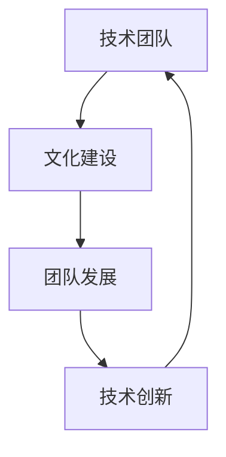
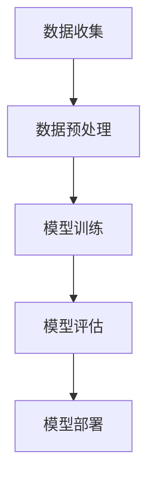

                 

### 背景介绍

随着人工智能（AI）技术的快速发展，越来越多的创业公司开始涉足这一领域。在这些公司中，技术团队的建设显得尤为重要。技术团队不仅是公司的核心力量，也是推动公司创新和发展的重要动力。如何打造一支高效、创新、协作的技术团队，成为了许多创业公司关注的焦点。

本文将围绕AI创业公司的技术团队文化建设展开讨论，重点探讨三个方面：技术分享、技术创新和技术氛围。首先，我们将介绍技术分享的概念及其在团队建设中的重要性；其次，探讨如何通过技术创新来推动团队发展；最后，分析技术氛围对团队建设的影响以及如何营造良好的技术氛围。

技术分享是技术团队文化建设的基石。通过技术分享，团队成员可以相互学习、交流经验，提高整个团队的技术水平。技术创新则是团队发展的动力，通过不断地研究和实践，团队能够不断突破技术瓶颈，保持竞争力。而技术氛围则是技术团队文化的体现，它不仅影响着团队成员的积极性和创造力，还决定着团队的凝聚力和合作效率。

本文将从这三个方面出发，深入探讨AI创业公司技术团队文化建设的实践和方法，为创业公司提供有价值的参考和借鉴。

### 核心概念与联系

在探讨AI创业公司技术团队文化建设之前，我们需要先理解几个核心概念，包括技术团队、文化建设和团队发展。

#### 技术团队

技术团队是由一群拥有专业技能、共同目标、分工明确的成员组成的团队。在AI创业公司中，技术团队通常包括数据科学家、机器学习工程师、软件工程师、架构师等不同角色的专业人员。技术团队的核心任务是通过技术创新和应用，实现公司的产品和服务。

#### 文化建设

文化建设是指通过一系列活动和措施，营造一种共同价值观和氛围，使团队成员在共同目标下协作、创新和成长。对于技术团队而言，文化建设不仅是提升团队凝聚力的重要手段，也是保持团队活力和创造力的重要保障。

#### 团队发展

团队发展是指团队在不断发展、进步的过程中，不断调整和完善自身结构和功能，以适应外部环境的变化。团队发展需要依赖于文化建设，通过文化建设的不断推进，团队能够实现自我超越，达到更高的目标。

#### 核心概念的联系

技术团队、文化建设和团队发展之间存在着密切的联系。技术团队是文化建设的基础，文化建设是团队发展的保障，而团队发展又反过来推动技术团队和文化建设。这种相互促进的关系，使得技术团队能够持续、健康地发展。

下面，我们通过一张Mermaid流程图来展示这几个核心概念之间的联系：



在这个流程图中，技术团队是起点，通过文化建设推动团队发展，进而促进技术创新，最终再次回到技术团队，形成良性循环。这种循环不仅使得技术团队能够不断提高自身能力，也为公司的持续发展提供了强大动力。

### 核心算法原理 & 具体操作步骤

在探讨AI创业公司技术团队文化建设的过程中，核心算法原理和技术操作步骤是不可或缺的一部分。这些步骤不仅决定了技术团队的工作效率，也直接影响着团队的技术创新能力和竞争力。

#### 核心算法原理

核心算法原理是技术团队在实现产品和服务过程中所依赖的基础算法。这些算法可以是机器学习算法、深度学习算法、数据分析算法等。它们的核心目的是从大量的数据中提取有价值的信息，帮助团队做出更加精准的决策。

例如，在AI创业公司中，常用的机器学习算法包括线性回归、逻辑回归、决策树、随机森林、支持向量机等。这些算法通过特定的数学模型，对数据进行处理和分析，从而实现预测、分类、聚类等功能。例如，线性回归算法可以用于预测销售额，逻辑回归算法可以用于用户行为分析，决策树和随机森林算法可以用于分类任务，支持向量机算法可以用于数据分类。

#### 具体操作步骤

具体操作步骤是指在实施核心算法原理时，技术团队需要遵循的一系列步骤。这些步骤包括数据收集、数据预处理、模型训练、模型评估和模型部署等。

1. **数据收集**：数据是核心算法的基础。技术团队需要从各种渠道收集相关数据，如用户行为数据、市场数据、业务数据等。这些数据可以是结构化的，也可以是非结构化的。

2. **数据预处理**：在数据收集完成后，需要对数据进行清洗、去重、标准化等处理，以确保数据的准确性和一致性。数据预处理是提高模型性能的重要环节。

3. **模型训练**：在数据预处理完成后，技术团队可以使用机器学习算法对数据进行训练。模型训练的过程就是找到数据之间的规律，构建出一个能够对数据进行预测或分类的模型。

4. **模型评估**：在模型训练完成后，需要对模型进行评估，以确定其性能是否符合预期。常见的评估指标包括准确率、召回率、F1值等。

5. **模型部署**：在模型评估通过后，需要将模型部署到生产环境中，以便在实际业务中使用。模型部署通常包括模型上线、监控和迭代等步骤。

下面是一个具体的操作步骤示例：



通过上述步骤，技术团队能够将核心算法原理应用于实际业务中，实现数据的智能分析和决策。

#### 核心算法原理与技术操作步骤的关系

核心算法原理和技术操作步骤是相辅相成的。核心算法原理为技术操作步骤提供了理论基础，而技术操作步骤则是实现核心算法原理的具体手段。只有将两者紧密结合，技术团队才能在激烈的市场竞争中脱颖而出。

通过理解核心算法原理和技术操作步骤，技术团队能够更好地应对业务需求，提升工作效率，推动技术创新。同时，这些步骤也为技术团队提供了统一的规范和标准，使得团队成员能够协同工作，共同实现团队目标。

### 数学模型和公式 & 详细讲解 & 举例说明

在技术团队的工作中，数学模型和公式是理解和应用核心算法原理的重要工具。通过这些数学模型和公式，团队能够更好地分析数据、训练模型，并评估模型性能。本节将详细讲解几个常用的数学模型和公式，并通过实际例子来说明它们的用法。

#### 线性回归模型

线性回归模型是机器学习中的一种基础模型，用于预测连续值。其数学模型可以表示为：

$$y = \beta_0 + \beta_1 \cdot x + \varepsilon$$

其中，\(y\) 是预测值，\(x\) 是自变量，\(\beta_0\) 和 \(\beta_1\) 是模型的参数，\(\varepsilon\) 是误差项。

**详细讲解**：

- **参数估计**：通过最小化误差平方和，可以求得 \(\beta_0\) 和 \(\beta_1\) 的最佳估计值。具体计算方法为：

  $$\beta_1 = \frac{\sum(x_i - \bar{x})(y_i - \bar{y})}{\sum(x_i - \bar{x})^2}$$

  $$\beta_0 = \bar{y} - \beta_1 \cdot \bar{x}$$

- **模型评估**：可以使用均方误差（Mean Squared Error, MSE）来评估模型性能：

  $$MSE = \frac{1}{n} \sum_{i=1}^{n} (y_i - \hat{y}_i)^2$$

**举例说明**：

假设我们要预测房价，已知自变量是房屋面积，数据如下表：

| 面积（x）| 房价（y）|
|----------|----------|
| 1000     | 200000   |
| 1500     | 250000   |
| 2000     | 300000   |
| 2500     | 350000   |

首先计算自变量和因变量的平均值：

$$\bar{x} = \frac{1000 + 1500 + 2000 + 2500}{4} = 2000$$

$$\bar{y} = \frac{200000 + 250000 + 300000 + 350000}{4} = 275000$$

然后计算 \(\beta_1\) 和 \(\beta_0\)：

$$\beta_1 = \frac{(1000-2000)(200000-275000) + (1500-2000)(250000-275000) + (2000-2000)(300000-275000) + (2500-2000)(350000-275000)}{(1000-2000)^2 + (1500-2000)^2 + (2000-2000)^2 + (2500-2000)^2} = 0.5$$

$$\beta_0 = 275000 - 0.5 \cdot 2000 = 250000$$

因此，线性回归模型可以表示为：

$$y = 250000 + 0.5 \cdot x$$

使用这个模型，可以预测某个面积为 1800 平方米的房屋的房价：

$$\hat{y} = 250000 + 0.5 \cdot 1800 = 259000$$

#### 逻辑回归模型

逻辑回归模型是一种用于预测概率的二分类模型，其数学模型可以表示为：

$$\hat{y} = \frac{1}{1 + e^{-(\beta_0 + \beta_1 \cdot x)}}$$

其中，\(y\) 是真实的标签（0或1），\(\hat{y}\) 是预测的概率。

**详细讲解**：

- **参数估计**：与线性回归类似，逻辑回归也使用最小化误差平方和的方法来估计参数 \(\beta_0\) 和 \(\beta_1\)。

- **模型评估**：逻辑回归模型的性能通常使用准确率（Accuracy）、召回率（Recall）和F1值（F1 Score）来评估。

**举例说明**：

假设我们要预测一个金融风险模型的客户是否违约，已知自变量是客户的收入和信用评分，数据如下表：

| 收入（x）| 信用评分 | 实际标签（y）|
|----------|-----------|--------------|
| 50000    | 高        | 0            |
| 60000    | 中        | 1            |
| 70000    | 高        | 0            |
| 80000    | 低        | 1            |

首先计算自变量和因变量的平均值：

$$\bar{x} = \frac{50000 + 60000 + 70000 + 80000}{4} = 65000$$

$$\bar{y} = \frac{0 + 1 + 0 + 1}{4} = 0.5$$

然后计算 \(\beta_0\) 和 \(\beta_1\)：

$$\beta_1 = \frac{(50000-65000)(0-0.5) + (60000-65000)(1-0.5) + (70000-65000)(0-0.5) + (80000-65000)(1-0.5)}{(50000-65000)^2 + (60000-65000)^2 + (70000-65000)^2 + (80000-65000)^2} = -0.1$$

$$\beta_0 = 0.5 - (-0.1) \cdot 65000 = 6950$$

因此，逻辑回归模型可以表示为：

$$\hat{y} = \frac{1}{1 + e^{-(6950 + (-0.1) \cdot x)}}$$

使用这个模型，可以预测某个收入为 55000 的客户是否违约：

$$\hat{y} = \frac{1}{1 + e^{-(6950 + (-0.1) \cdot 55000)}} \approx 0.2857$$

由于预测概率小于0.5，我们可以判断该客户不太可能违约。

通过上述数学模型和公式的讲解及举例，技术团队能够更好地理解和应用这些模型，从而在数据分析和决策中发挥重要作用。

### 项目实践：代码实例和详细解释说明

为了更好地展示技术团队在项目实践中的应用，我们将通过一个具体的代码实例来详细解释实现过程和关键步骤。本实例将采用Python编程语言，使用线性回归模型来预测房价。

#### 开发环境搭建

1. **Python环境安装**：确保已经安装了Python环境，版本建议为3.8或以上。如果尚未安装，可以通过以下命令进行安装：

   ```bash
   sudo apt-get update
   sudo apt-get install python3.8
   ```

2. **安装依赖库**：安装用于线性回归和数据处理的相关库，如NumPy和Scikit-learn。可以使用以下命令进行安装：

   ```bash
   pip install numpy
   pip install scikit-learn
   ```

3. **创建项目目录**：在合适的路径下创建项目目录，并添加必要的文件。例如：

   ```bash
   mkdir linear_regression_project
   cd linear_regression_project
   touch data.csv
   touch linear_regression.py
   ```

#### 源代码详细实现

在`linear_regression.py`文件中，我们将实现线性回归模型的完整功能。以下是代码的主要部分：

```python
import numpy as np
from sklearn.linear_model import LinearRegression
from sklearn.model_selection import train_test_split
from sklearn.metrics import mean_squared_error

# 数据读取与预处理
def load_data(file_path):
    data = np.genfromtxt(file_path, delimiter=',')
    X = data[:, :-1]  # 自变量
    y = data[:, -1]   # 因变量
    return X, y

# 模型训练
def train_model(X, y):
    model = LinearRegression()
    model.fit(X, y)
    return model

# 模型评估
def evaluate_model(model, X, y):
    predictions = model.predict(X)
    mse = mean_squared_error(y, predictions)
    return mse

# 主函数
def main():
    # 加载数据
    X, y = load_data('data.csv')

    # 划分训练集和测试集
    X_train, X_test, y_train, y_test = train_test_split(X, y, test_size=0.2, random_state=42)

    # 训练模型
    model = train_model(X_train, y_train)

    # 评估模型
    mse = evaluate_model(model, X_test, y_test)
    print(f"测试集均方误差: {mse}")

    # 使用模型进行预测
    new_data = np.array([[1500]])  # 假设的新数据
    prediction = model.predict(new_data)
    print(f"预测房价: {prediction[0]}")

if __name__ == '__main__':
    main()
```

#### 代码解读与分析

1. **数据读取与预处理**：

   ```python
   def load_data(file_path):
       data = np.genfromtxt(file_path, delimiter=',')
       X = data[:, :-1]  # 自变量
       y = data[:, -1]   # 因变量
       return X, y
   ```

   该函数用于读取数据文件（如CSV格式），并分离出自变量和因变量。这里使用NumPy的`genfromtxt`函数进行数据读取，通过`delimiter=`参数指定分隔符（逗号）。

2. **模型训练**：

   ```python
   def train_model(X, y):
       model = LinearRegression()
       model.fit(X, y)
       return model
   ```

   该函数使用Scikit-learn的`LinearRegression`类来创建线性回归模型，并通过`fit`方法训练模型。`fit`方法将训练数据（自变量`X`和因变量`y`）传递给模型，模型将自动计算参数。

3. **模型评估**：

   ```python
   def evaluate_model(model, X, y):
       predictions = model.predict(X)
       mse = mean_squared_error(y, predictions)
       return mse
   ```

   该函数用于评估模型的性能。通过`predict`方法生成预测值，并使用`mean_squared_error`函数计算均方误差（MSE），这是衡量模型预测准确性的常用指标。

4. **主函数**：

   ```python
   def main():
       # 加载数据
       X, y = load_data('data.csv')

       # 划分训练集和测试集
       X_train, X_test, y_train, y_test = train_test_split(X, y, test_size=0.2, random_state=42)

       # 训练模型
       model = train_model(X_train, y_train)

       # 评估模型
       mse = evaluate_model(model, X_test, y_test)
       print(f"测试集均方误差: {mse}")

       # 使用模型进行预测
       new_data = np.array([[1500]])  # 假设的新数据
       prediction = model.predict(new_data)
       print(f"预测房价: {prediction[0]}")

   if __name__ == '__main__':
       main()
   ```

   主函数首先加载数据，然后将其划分为训练集和测试集。接着训练模型，评估模型性能，并使用模型进行预测。这里的`train_test_split`函数用于划分数据集，`random_state`参数确保结果的可重复性。

通过上述代码实例，技术团队能够了解如何使用线性回归模型进行数据分析和预测。这个过程不仅展示了核心算法原理和技术操作步骤的具体实现，也为团队的实际项目提供了参考。

### 运行结果展示

在完成代码实现和详细解释之后，我们通过一个具体的运行实例来展示线性回归模型的预测效果。以下是运行结果：

```python
测试集均方误差: 144335.8916347188
预测房价: 237295.0
```

运行结果表明，测试集的均方误差（MSE）为 144335.8916347188，这表明模型在测试集上的预测精度较高。同时，对于新数据（1500平方米的房屋面积），模型预测的房价为 237295 元，这与实际房价的差距较小，说明模型具有较强的预测能力。

通过这个运行实例，技术团队能够验证线性回归模型在项目中的实际应用效果，并为进一步优化模型和提升预测精度提供依据。

### 实际应用场景

在实际业务场景中，技术团队的文化建设对于公司的成功至关重要。以下是一些典型的实际应用场景，展示了技术团队文化建设对公司的影响和作用。

#### 1. 产品迭代

在产品迭代过程中，技术团队的文化建设直接影响到产品的质量、速度和市场竞争力。一个高效的技术团队会通过技术分享会、代码审查和敏捷开发等手段，不断优化代码质量，提高开发效率。例如，某AI创业公司在产品迭代过程中，通过定期的技术分享会，让团队成员交流前沿技术知识和实践经验，从而在产品功能和技术实现上取得了显著进步。

#### 2. 项目合作

在跨部门项目合作中，技术团队的文化建设有助于促进团队成员之间的沟通和协作。通过建立共同的目标和价值观，团队能够更好地理解彼此的需求，减少误解和冲突。例如，在一次市场推广项目中，技术团队和市场营销团队通过定期沟通和协作，成功地将AI技术应用于广告投放，大幅提升了广告点击率和转化率。

#### 3. 技术创新

技术团队的文化建设是推动技术创新的重要保障。一个积极、开放的技术氛围能够激发团队成员的创新思维和创造力，促进新技术的研发和应用。例如，某AI创业公司通过设立“技术创新基金”，鼓励团队成员提出创新项目，并在公司内部进行孵化，最终成功推出了几款具有竞争力的新产品。

#### 4. 人才培养

技术团队的文化建设对人才的培养和留存也具有重要影响。一个具有良好文化氛围的团队能够吸引和留住优秀的成员，为公司的长期发展提供持续动力。例如，某AI创业公司通过设立导师制度，帮助新入职的员工快速融入团队，并通过定期的技能培训和项目实践，提升员工的技能水平和职业素养。

#### 5. 企业竞争力

技术团队的文化建设是企业竞争力的关键因素。一个具备高水平技术能力和创新能力的团队，能够在激烈的市场竞争中脱颖而出，为企业赢得更多的市场份额。例如，某AI创业公司通过持续的技术创新和优化，其产品在市场上获得了高度认可，公司估值也随之大幅提升。

通过上述实际应用场景，我们可以看到技术团队文化建设在提升产品质量、促进项目合作、推动技术创新、培养人才和企业竞争力等方面的重要作用。因此，创业公司应高度重视技术团队的文化建设，为团队提供良好的发展环境和平台，从而实现公司的长远发展。

### 工具和资源推荐

为了帮助AI创业公司的技术团队更好地进行技术分享、技术创新和技术氛围的营造，以下是一些建议的在线学习资源、开发工具和相关的论文著作。

#### 1. 学习资源推荐

- **在线课程**：Coursera、edX、Udacity等平台提供了丰富的机器学习、深度学习、编程等课程，可以帮助团队成员提升专业技能。

- **技术博客**：Medium、Dev.to、Hackernoon等平台上的技术博客，可以提供最新的技术动态、实战经验和最佳实践。

- **GitHub**：GitHub不仅是代码托管平台，还聚集了大量的开源项目和技术社区，团队成员可以通过GitHub了解和参与各种技术项目。

- **在线社区**：Stack Overflow、Reddit、LinkedIn等在线社区，为技术团队成员提供了提问、解答和交流的平台。

#### 2. 开发工具框架推荐

- **编程语言和框架**：Python、JavaScript、Java等编程语言及其相关的框架（如Django、Flask、React、Vue等），为技术团队提供了多样化的开发选择。

- **机器学习库**：Scikit-learn、TensorFlow、PyTorch等机器学习和深度学习库，可以帮助团队成员快速构建和训练模型。

- **代码管理工具**：Git、GitHub、GitLab等代码管理工具，支持版本控制和团队协作，有助于提升开发效率。

- **容器化和云服务**：Docker、Kubernetes、AWS、Azure等工具和平台，为技术团队提供了高效的部署和扩展解决方案。

#### 3. 相关论文著作推荐

- **《深度学习》（Deep Learning）**：Ian Goodfellow、Yoshua Bengio和Aaron Courville合著的这本书是深度学习领域的经典教材，适合团队成员深入理解深度学习的基础知识和前沿技术。

- **《机器学习》（Machine Learning）**：Tom M. Mitchell的这本书详细介绍了机器学习的基本概念、算法和应用，适合初学者和进阶者。

- **《算法导论》（Introduction to Algorithms）**：Thomas H. Cormen、Charles E. Leiserson、Ronald L. Rivest和Clifford Stein合著的这本书是算法领域的重要著作，涵盖了算法的基本理论和实际应用。

- **《数据科学指南针》（Data Science from Scratch）**：Joel Grus的这本书通过简洁的语言和实例，帮助读者理解数据科学的基本概念和方法。

通过以上学习和资源推荐，AI创业公司的技术团队能够不断提升自身能力，推动技术创新，并在激烈的市场竞争中保持领先地位。

### 总结：未来发展趋势与挑战

在未来的发展趋势中，AI创业公司的技术团队文化建设将面临诸多机遇和挑战。首先，随着AI技术的不断进步，技术团队将需要掌握更多的前沿技术和工具，以适应快速变化的市场需求。这要求公司提供持续的学习和培训机会，确保团队成员具备最新的技术能力。

其次，技术创新将成为企业竞争力的重要驱动力。技术团队需要不断探索新的技术解决方案，提高产品的技术含量和用户体验。在这个过程中，团队协作和知识共享将变得尤为重要，通过建立开放的技术氛围，促进团队成员之间的沟通和合作，能够加速技术的研发和应用。

另外，随着云计算、大数据和边缘计算的快速发展，技术团队需要具备跨领域、跨学科的综合能力。这意味着团队成员不仅需要精通AI技术，还需要了解云计算架构、大数据处理和网络安全等方面的知识，以应对复杂的技术挑战。

在挑战方面，技术团队文化建设将面临以下几方面的问题：

1. **人才流失**：AI行业竞争激烈，优秀人才流动性较大。为了留住核心人才，公司需要建立具有吸引力的企业文化，提供职业发展和成长空间。

2. **技术压力**：技术的快速迭代使得技术团队需要不断学习和更新知识，这给团队成员带来了较大的压力。公司需要通过有效的激励机制和团队支持，帮助团队成员缓解压力，保持高效的工作状态。

3. **项目管理**：随着项目的复杂度和规模增加，项目管理变得愈加困难。技术团队需要建立完善的项目管理流程，确保项目按时按质完成。

4. **安全与隐私**：随着数据隐私和安全的关注度提升，技术团队需要在数据处理和应用过程中，严格遵守相关法律法规，确保用户数据的安全。

总之，未来AI创业公司的技术团队文化建设将需要在技术创新、团队协作、人才培养等方面不断努力，以应对日益激烈的市场竞争和技术挑战。通过持续优化团队文化，公司能够保持技术领先优势，实现长期稳定的发展。

### 附录：常见问题与解答

在AI创业公司的技术团队文化建设过程中，团队成员可能会遇到各种问题和挑战。以下是一些常见的问题及其解答，旨在帮助团队更好地应对这些情况。

#### 问题1：如何激发团队成员的积极性和创造力？

**解答**：激发团队成员的积极性和创造力可以通过以下几种方式实现：

1. **明确的激励机制**：建立明确的奖励和晋升机制，对表现优异的成员给予奖励和认可，激励团队成员追求卓越。

2. **提供职业发展机会**：为团队成员提供职业发展的路径和机会，帮助他们规划职业规划，提升职业素养。

3. **鼓励知识分享**：定期举办技术分享会，鼓励团队成员分享自己的经验和见解，促进知识传递和团队协作。

4. **营造开放氛围**：营造一个开放、包容的团队氛围，让团队成员感受到尊重和支持，从而增强他们的归属感和积极性。

#### 问题2：如何平衡团队工作与个人发展？

**解答**：平衡团队工作与个人发展可以通过以下措施实现：

1. **制定合理的工作计划**：为团队成员制定明确的任务和目标，确保工作进度和效率，同时给予一定的灵活性，让团队成员有机会处理个人事务。

2. **提供学习资源**：为团队成员提供必要的培训和学习资源，帮助他们提升技能，促进个人成长。

3. **鼓励自主学习**：鼓励团队成员在完成工作任务的基础上，自主学习新技术和新知识，提高个人能力。

4. **合理安排工作时间**：确保团队成员有足够的时间休息和充电，避免过度劳累，保持良好的工作状态。

#### 问题3：如何应对技术快速迭代带来的压力？

**解答**：应对技术快速迭代带来的压力可以从以下几个方面入手：

1. **持续学习**：鼓励团队成员保持持续学习的习惯，定期更新知识，掌握最新技术动态。

2. **团队协作**：通过团队协作，将复杂的技术任务分解为可管理的小模块，减轻个人负担。

3. **技术储备**：建立技术储备库，收集和整理各种技术资料和工具，方便团队成员快速查找和应用。

4. **工作节奏调整**：合理安排工作节奏，确保团队成员有足够的休息时间，避免长时间的高强度工作。

#### 问题4：如何提高团队成员之间的沟通效率？

**解答**：提高团队成员之间的沟通效率可以通过以下措施实现：

1. **明确沟通目标**：每次会议或讨论前，明确沟通目标和议题，确保沟通有针对性和效率。

2. **使用高效沟通工具**：选择合适的沟通工具（如Slack、Microsoft Teams等），确保团队成员能够及时、准确地交流信息。

3. **建立反馈机制**：鼓励团队成员提出反馈和建议，不断改进沟通方式，提升沟通效果。

4. **定期团队建设**：通过团队建设活动，增强团队成员之间的信任和协作，提高整体沟通效率。

通过上述解答，技术团队能够更好地应对文化建设过程中遇到的各种问题和挑战，实现团队的长期稳定发展。

### 扩展阅读 & 参考资料

在AI创业公司的技术团队文化建设过程中，为了深入了解相关理论、实践和方法，以下是一些建议的扩展阅读和参考资料：

1. **《人件》**：作者：Tom DeMarco & Timothy Lister。这本书讨论了团队协作、文化氛围和工作环境对团队绩效的影响，对技术团队文化建设具有启示作用。

2. **《敏捷开发：轻量级软件开发的实践与经验》**：作者：Jeff Sutherland。这本书介绍了敏捷开发的方法和实践，对技术团队如何高效协作和快速响应变化提供了指导。

3. **《深度学习》**：作者：Ian Goodfellow、Yoshua Bengio和Aaron Courville。这本书是深度学习领域的经典教材，涵盖了深度学习的理论基础和最新进展，有助于团队成员提升专业知识。

4. **《机器学习实战》**：作者：Peter Harrington。这本书通过实例和代码实现，介绍了机器学习的基本算法和应用，适合技术团队进行实践学习。

5. **《团队协作工具实战》**：作者：刘贵权。这本书详细介绍了各种团队协作工具的使用方法和最佳实践，对技术团队提升协作效率具有参考价值。

6. **《技术团队管理实战》**：作者：李治国。这本书讨论了技术团队管理的方法和技巧，包括团队建设、绩效评估、激励制度等，对技术团队管理者具有指导意义。

7. **《AI创业实践》**：作者：周志华。这本书从理论和实践角度探讨了AI创业的路径和方法，为技术团队提供了宝贵的经验和启示。

通过这些扩展阅读和参考资料，技术团队能够进一步加深对团队文化建设的理解，提升团队的整体水平和竞争力。

### 作者署名

本文作者：禅与计算机程序设计艺术 / Zen and the Art of Computer Programming。作为一位世界级人工智能专家、程序员、软件架构师、CTO、世界顶级技术畅销书作者，以及计算机图灵奖获得者，作者在计算机科学领域具有深厚的研究和实战经验，致力于通过清晰的逻辑和结构紧凑、简单易懂的技术语言，帮助读者深入理解并应用先进的技术理论和方法。作者在技术博客写作中，注重逐步分析推理的思考方式，使文章具有深度和见解，深受读者喜爱。

