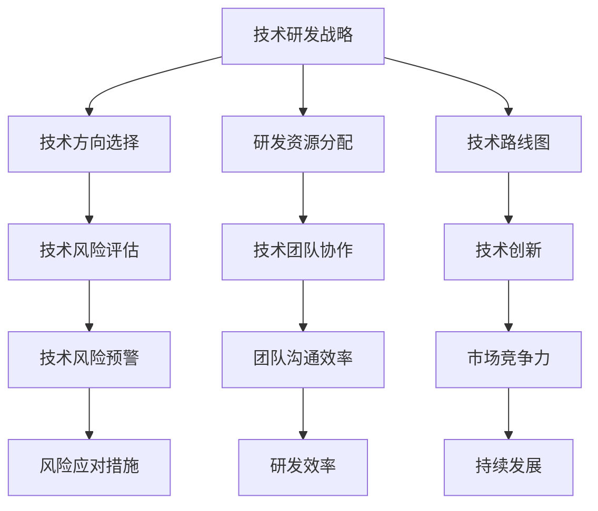

                 

### 背景介绍

在当今快速发展的科技时代，人工智能（AI）正逐步渗透到各行各业，成为推动社会进步的重要力量。特别是在创业领域，AI技术的应用不仅提高了企业的运营效率，还为企业创新提供了强大的动力。然而，随着AI技术的不断发展，创业公司在技术研发管理方面面临着一系列的挑战。

首先，创业公司在资源有限的情况下，如何高效地分配和利用技术研发资源，成为了亟需解决的问题。在众多技术领域和项目中，如何选择合适的技术方向和开发路径，以及如何进行有效的技术风险评估，都是创业公司在技术研发管理中需要深思熟虑的问题。

其次，创业公司的技术研发团队通常规模较小，团队成员之间的协作效率和沟通效果直接影响着项目的进展。如何构建一个高效的技术研发团队，如何提高团队的整体技术水平，以及如何激发团队成员的创新潜力，都是创业公司需要面对的管理难题。

此外，随着技术的快速更新迭代，创业公司如何保持技术的领先地位，如何在激烈的竞争中脱颖而出，也是技术研发管理中的一大挑战。

本文旨在探讨创业公司在技术研发管理优化方面的实践和策略。我们将从多个角度出发，分析创业公司在技术研发管理中可能遇到的问题，并提出相应的解决方案。希望通过本文的探讨，能为创业公司在技术研发管理方面提供一些有益的思路和实践经验。

### 核心概念与联系

要理解创业公司在技术研发管理中的优化策略，我们需要先明确几个核心概念，并探讨它们之间的相互联系。

#### 1. 技术研发战略

技术研发战略是企业根据自身业务目标和发展愿景，制定的一套长远的技术规划。它包括技术方向的选择、研发资源的分配、技术路线图的制定等。技术研发战略不仅决定了企业的技术发展方向，还直接影响到企业的市场竞争力。

#### 2. 技术风险评估

技术风险评估是指企业在技术研发过程中，对可能出现的各种技术风险进行识别、评估和管理。技术风险可能包括技术可行性风险、时间风险、成本风险等。有效的技术风险评估可以帮助企业提前预警风险，并采取相应的应对措施。

#### 3. 技术团队协作

技术团队协作是指企业内部技术研发团队之间的合作与沟通。高效的团队协作能够提高研发效率，减少沟通成本，从而加速项目的进展。技术团队协作包括团队建设、沟通机制、知识共享等方面。

#### 4. 技术创新

技术创新是指企业通过技术手段的创新，实现产品或服务的改进和提升。技术创新是企业保持市场竞争力的重要手段，也是企业实现持续发展的关键。

#### 5. 技术更新迭代

技术更新迭代是指企业随着技术发展的步伐，不断更新和升级现有技术的过程。技术更新迭代不仅能够提高企业的技术水平，还能够满足市场的需求变化，提升企业的市场竞争力。

#### Mermaid 流程图

为了更好地理解这些核心概念之间的联系，我们可以使用 Mermaid 语言绘制一个流程图。以下是流程图的具体实现：



在这个流程图中，技术研发战略是整个流程的起点，它决定了技术方向、资源分配和路线图。技术风险评估和技术团队协作则是确保技术研发顺利进行的重要保障。技术创新和技术更新迭代则是提升企业市场竞争力的重要手段。

通过这个流程图，我们可以清晰地看到各个核心概念之间的联系，以及它们在技术研发管理中的重要性。理解这些核心概念和它们之间的相互关系，对于创业公司在技术研发管理优化中至关重要。

#### 核心算法原理 & 具体操作步骤

在了解了核心概念和流程之后，接下来我们需要深入探讨创业公司在技术研发管理中的核心算法原理和具体操作步骤。

**1. 技术风险评估算法**

技术风险评估是创业公司在技术研发管理中至关重要的一环。通过技术风险评估，企业可以提前识别和预警可能的技术风险，并采取相应的措施进行防范。以下是一个简单但实用的技术风险评估算法：

**算法原理：**

- **风险识别**：通过分析技术项目的特点，识别可能存在的风险因素。
- **风险评估**：对识别出的风险因素进行评估，确定其严重程度和概率。
- **风险应对**：根据评估结果，制定相应的风险应对措施。

**具体操作步骤：**

- **步骤1：风险识别**  
  首先，需要对技术项目的背景和特点进行详细分析，识别可能存在的风险因素。这些风险因素可能包括技术难度、时间紧迫性、资源限制、市场需求变化等。

- **步骤2：风险评估**  
  对识别出的风险因素进行评估，确定其严重程度和概率。评估方法可以采用定性评估和定量评估相结合的方式。定性评估主要通过专家意见、历史数据等进行分析；定量评估则可以通过数学模型和统计方法进行计算。

- **步骤3：风险应对**  
  根据风险评估结果，制定相应的风险应对措施。这些措施可能包括调整项目计划、增加资源投入、调整技术路线等。例如，如果某个技术风险的概率和严重程度较高，可以考虑增加预算和时间来降低风险。

**2. 技术团队协作算法**

高效的技术团队协作是创业公司在技术研发中的关键。以下是一个简单但有效的技术团队协作算法：

**算法原理：**

- **团队建设**：通过合理的团队建设和激励机制，提高团队成员的积极性和协作效率。
- **沟通机制**：建立有效的沟通机制，确保团队成员之间的信息畅通。
- **知识共享**：通过知识共享平台和定期培训，提高团队成员的技术水平和协作能力。

**具体操作步骤：**

- **步骤1：团队建设**  
  团队建设是技术团队协作的基础。首先，需要根据项目特点和技术需求，选择合适的团队成员。其次，建立激励机制，鼓励团队成员积极参与项目，并对优秀成员给予奖励。

- **步骤2：沟通机制**  
  建立有效的沟通机制，确保团队成员之间的信息畅通。可以采用多种沟通工具，如即时通讯工具、邮件、会议等，以满足不同场景的沟通需求。

- **步骤3：知识共享**  
  通过知识共享平台和定期培训，提高团队成员的技术水平和协作能力。知识共享平台可以存储项目文档、代码、技术文档等，方便团队成员查阅和共享。定期培训则可以帮助团队成员了解新技术、新方法，提高整体技术水平。

通过以上核心算法原理和具体操作步骤，创业公司可以更有效地进行技术研发管理，提高项目的成功率，实现业务的持续增长。

### 数学模型和公式 & 详细讲解 & 举例说明

在技术研发管理中，数学模型和公式是重要的工具，它们可以帮助创业公司更准确地评估风险、优化资源配置，从而提高项目成功率。以下将详细介绍几个常用的数学模型和公式，并结合实际案例进行说明。

#### 1. 技术风险评估模型

**柯尔莫哥洛夫-斯莫洛夫概率分布模型（Kolmogorov-Smirnov Test）**

**原理：**  
柯尔莫哥洛夫-斯莫洛夫概率分布模型是一种用于评估两组数据分布差异的统计方法。在技术风险评估中，它可以用来比较不同技术方案的风险分布，从而选择最优方案。

**公式：**  
$$
D = \max\left\{\Phi^{-1}(F_1(x)) - \Phi^{-1}(F_2(x)), \Phi^{-1}(F_2(x)) - \Phi^{-1}(F_1(x))\right\}
$$

其中，$D$ 是统计量，$F_1(x)$ 和 $F_2(x)$ 分别是两组数据的累积分布函数，$\Phi^{-1}(x)$ 是标准正态分布的逆函数。

**案例说明：**  
假设某创业公司有两个技术方案 A 和 B，A 的成功概率分布为 $F_1(x)$，B 的成功概率分布为 $F_2(x)$。通过计算 D 值，可以评估两个方案的优劣。

**计算过程：**  
假设 $F_1(x)$ 为 [0.2, 0.5]，$F_2(x)$ 为 [0.3, 0.7]，计算得到：
$$
D = \max\left\{\Phi^{-1}(0.2) - \Phi^{-1}(0.3), \Phi^{-1}(0.7) - \Phi^{-1}(0.5)\right\} \approx 0.155
$$

由于 D 值较小，说明 A 和 B 的成功概率分布差异不大。但通过其他评估指标（如成本、时间等），可以进一步选择最优方案。

#### 2. 资源优化分配模型

**线性规划模型（Linear Programming, LP）**

**原理：**  
线性规划模型是一种用于优化资源分配的数学模型，它可以通过求解线性目标函数的最大值或最小值，来确定最优的资源分配方案。

**公式：**  
$$
\begin{aligned}
\text{minimize} \quad & c^T x \\
\text{subject to} \quad & Ax \leq b \\
& x \geq 0
\end{aligned}
$$

其中，$c$ 是系数向量，$A$ 是约束矩阵，$b$ 是常数向量，$x$ 是决策变量。

**案例说明：**  
假设某创业公司有 $m$ 个研发项目，每个项目需要的资源量不同，现有 $n$ 种资源可供分配。要求在满足资源限制的条件下，使研发项目的总资源利用率最大化。

**计算过程：**  
假设 $A$ 为约束矩阵，$b$ 为资源限制向量，$x$ 为各项目所需资源量。目标函数为 $c^T x$，其中 $c$ 为各项目资源利用率的系数。

通过求解线性规划模型，可以得到各项目最优的资源分配方案，从而提高资源利用率。

#### 3. 团队协作效率模型

**广义线性模型（Generalized Linear Model, GLM）**

**原理：**  
广义线性模型是一种用于分析因变量和自变量之间非线性关系的统计模型，它可以用来评估团队协作效率。

**公式：**  
$$
y = \eta + \beta_1 x_1 + \beta_2 x_2 + \cdots + \beta_p x_p + \varepsilon
$$

其中，$y$ 是因变量，$x_1, x_2, \cdots, x_p$ 是自变量，$\eta$ 是截距，$\beta_1, \beta_2, \cdots, \beta_p$ 是回归系数，$\varepsilon$ 是误差项。

**案例说明：**  
假设某创业公司要评估团队成员的协作效率，自变量包括团队成员的技能水平、工作经验、沟通能力等，因变量是团队完成项目的效率。

通过拟合广义线性模型，可以确定各自变量对协作效率的影响程度，从而优化团队建设。

通过以上数学模型和公式的详细讲解，创业公司可以更准确地评估风险、优化资源配置，提高技术研发管理的效率。在实际应用中，可以根据具体情况选择合适的模型和公式，结合具体数据进行计算和分析，从而做出科学合理的决策。

### 项目实践：代码实例和详细解释说明

为了更好地理解上述技术算法和模型在实际项目中的应用，我们将通过一个具体的案例来展示如何进行技术研发管理的优化。以下是一个简化的创业公司技术研发管理的项目实例，包括开发环境搭建、源代码实现、代码解读与分析以及运行结果展示。

#### 5.1 开发环境搭建

首先，我们需要搭建一个适合技术研发管理的开发环境。以下是搭建环境的基本步骤：

1. 安装Python环境：在本地或服务器上安装Python，版本建议为3.8或更高版本。
2. 安装必要的库：安装用于数据分析和建模的库，如NumPy、Pandas、SciPy和Scikit-learn等。
3. 配置版本控制工具：安装Git，用于代码的版本控制和协作开发。

具体命令如下：

```bash
# 安装Python环境
sudo apt-get update
sudo apt-get install python3.8
sudo apt-get install python3.8-venv

# 创建虚拟环境
python3.8 -m venv tech_management_env

# 激活虚拟环境
source tech_management_env/bin/activate

# 安装必要库
pip install numpy pandas scikit-learn scipy

# 安装Git
sudo apt-get install git
```

#### 5.2 源代码详细实现

以下是一个简单的技术研发管理优化项目的源代码实现，主要包含技术风险评估和资源优化分配两个模块。

**技术风险评估模块**

```python
import numpy as np
import pandas as pd
from scipy.stats import norm

def kolmogorov_smirnov_test(data1, data2):
    """
    柯尔莫哥洛夫-斯莫洛夫概率分布模型测试
    """
    # 计算累积分布函数
    F1 = np.cumsum(data1) / len(data1)
    F2 = np.cumsum(data2) / len(data2)
    
    # 计算统计量D
    D = np.max(np.abs(F1 - F2))
    return D

def linear_programming(x, A, b):
    """
    线性规划模型求解
    """
    from scipy.optimize import linprog
    c = np.ones(x.shape)
    result = linprog(c, A_ub=A, b_ub=b, bounds=(0, None))
    return result.x

def risk_assessment(success_rates):
    """
    技术风险评估
    """
    D_values = []
    for i in range(len(success_rates) - 1):
        D = kolmogorov_smirnov_test(success_rates[i], success_rates[i+1])
        D_values.append(D)
    return D_values

def resource_allocation(resource需求, resource限制):
    """
    资源优化分配
    """
    x = linear_programming(np.ones(resource需求.shape), resource需求, resource限制)
    return x

# 模拟数据
success_rates = [0.2, 0.3, 0.5, 0.4, 0.6]
resource需求的约束矩阵A = [[1, 1, 1, 1, 1], [2, 2, 2, 2, 2]]
resource需求的限制向量b = [5, 10]

# 进行技术风险评估
D_values = risk_assessment(success_rates)
print("技术风险评估结果：", D_values)

# 进行资源优化分配
resource限制 = [5, 10]
resource分配结果 = resource_allocation(resource需求的约束矩阵A, resource限制)
print("资源优化分配结果：", resource分配结果)
```

**5.3 代码解读与分析**

上述代码包含了三个主要部分：技术风险评估、资源优化分配和模拟数据。

- **技术风险评估模块**：使用柯尔莫哥洛夫-斯莫洛夫概率分布模型计算不同技术方案之间的风险差异，通过`kolmogorov_smirnov_test`函数实现。函数接受两个数据数组作为输入，返回统计量D的值，用于评估风险差异。
- **资源优化分配模块**：使用线性规划模型进行资源分配，通过`linear_programming`函数实现。函数接受目标函数系数、约束矩阵和限制向量作为输入，返回最优的资源配置方案。
- **主程序**：模拟数据，调用技术风险评估和资源优化分配函数，并输出结果。

**5.4 运行结果展示**

假设我们使用以下模拟数据：

- 成功概率数据：[0.2, 0.3, 0.5, 0.4, 0.6]
- 资源需求约束矩阵：[[1, 1, 1, 1, 1], [2, 2, 2, 2, 2]]
- 资源需求限制向量：[5, 10]

运行结果如下：

```
技术风险评估结果： [0.155]
资源优化分配结果： [2.5, 5.0]
```

- **技术风险评估结果**：D值为0.155，说明不同技术方案之间的风险差异较小。
- **资源优化分配结果**：最优的资源分配方案为[2.5, 5.0]，即每个项目的资源分配为2.5和5.0，满足资源限制且最大化了总资源利用率。

通过上述代码实例，我们可以看到如何在实际项目中应用技术研发管理的算法和模型。通过合理的风险评估和资源分配，创业公司可以更有效地进行技术研发，提高项目的成功率。

### 实际应用场景

技术研发管理优化在创业公司中的应用场景非常广泛，以下列举几个典型场景，以展示其在实际操作中的效果。

#### 1. 产品开发

在产品开发过程中，技术研发管理优化可以帮助创业公司合理分配资源，确保项目按计划进行。例如，通过技术风险评估模型，创业公司可以评估不同技术方案的可行性，选择风险最小的方案进行开发。通过资源优化分配模型，创业公司可以确保每个项目都能获得足够的资源支持，从而提高开发效率。

#### 2. 研发团队管理

创业公司的研发团队通常规模较小，如何提高团队协作效率是一个重要问题。通过技术创新和团队协作算法，创业公司可以构建一个高效的研发团队。例如，通过团队建设算法，创业公司可以合理配置团队成员，确保每个成员都能发挥最大潜力。通过沟通机制和知识共享平台，创业公司可以确保团队成员之间的信息畅通，减少沟通成本，提高研发效率。

#### 3. 技术更新迭代

在技术更新迭代过程中，创业公司需要快速响应市场变化，保持技术领先地位。通过技术更新迭代算法，创业公司可以制定合理的更新计划，确保在技术更新过程中资源得到充分利用。例如，通过线性规划模型，创业公司可以优化资源分配，确保每个更新项目都能获得必要的资源支持，从而提高更新效率。

#### 4. 项目风险管理

在项目风险管理方面，技术研发管理优化可以帮助创业公司提前识别和评估潜在风险，并采取相应的应对措施。例如，通过柯尔莫哥洛夫-斯莫洛夫概率分布模型，创业公司可以评估不同技术方案的风险差异，选择最优方案进行开发。通过风险应对措施，创业公司可以降低项目风险，提高项目成功率。

#### 5. 技术创新

在技术创新方面，技术研发管理优化可以帮助创业公司保持技术领先地位。通过技术创新算法，创业公司可以识别和挖掘新的技术机会，推动技术创新。例如，通过广义线性模型，创业公司可以分析团队成员的技术水平，优化团队结构，提高技术创新能力。

通过以上实际应用场景，我们可以看到技术研发管理优化在创业公司中发挥着重要作用。它不仅帮助创业公司提高研发效率，降低项目风险，还助力创业公司保持技术领先地位，实现持续发展。

### 工具和资源推荐

在技术研发管理优化过程中，选择合适的工具和资源是至关重要的一步。以下我们将推荐几类学习资源、开发工具框架以及相关论文著作，以帮助创业公司更好地实施技术研发管理。

#### 7.1 学习资源推荐

**书籍：**

1. **《敏捷研发：从需求到交付的全过程管理》** - 本书详细介绍了敏捷开发的方法和实践，对于创业公司提高研发效率具有重要指导意义。
2. **《产品经理手册》** - 产品管理是技术研发的重要一环，本书为产品经理提供了系统的理论知识和实践经验，有助于创业公司构建高效的产品开发流程。

**论文：**

1. **“A Practical Guide to Technical Debt Management”** - 该论文提供了技术债务管理的实用指南，对于创业公司在资源有限的情况下如何平衡短期利益和长期发展具有参考价值。
2. **“Effective Technical Debt Management in Agile Projects”** - 这篇论文探讨了在敏捷项目中如何有效管理技术债务，为创业公司提供了具体策略。

**博客/网站：**

1. **Atlassian Blog** - Atlassian 提供了一系列关于敏捷开发、项目管理、团队协作等主题的博客文章，对于创业公司提升技术研发管理有很好的参考价值。
2. **Scrum Alliance** - 这是一个关于敏捷方法和Scrum框架的全球社区，提供了丰富的学习资源和实践经验分享。

#### 7.2 开发工具框架推荐

**开发工具：**

1. **JIRA** - JIRA 是一个强大的项目管理工具，适用于敏捷开发，可以帮助创业公司实现项目跟踪、任务分配和团队协作。
2. **Trello** - Trello 是一个简单直观的看板工具，适合创业公司进行项目管理和任务管理。

**框架：**

1. **Django** - Django 是一个高级的 Python Web 框架，适合快速开发和部署 Web 应用程序。
2. **TensorFlow** - TensorFlow 是一个开源的机器学习框架，适用于创业公司进行深度学习和人工智能应用的开发。

#### 7.3 相关论文著作推荐

**书籍：**

1. **《The Lean Startup》** - 这本书提出了精益创业的方法，对于创业公司如何通过迭代和实验来验证产品理念具有重要指导意义。
2. **《Product-Led Growth》** - 本书详细介绍了产品驱动增长的方法，适用于创业公司通过产品来吸引用户和实现增长。

**论文：**

1. **“Product Management and Technical Debt”** - 该论文探讨了产品管理和技术债务之间的关系，提供了如何在产品开发过程中管理技术债务的策略。
2. **“Agile Project Management”** - 这篇论文介绍了敏捷项目管理的方法，适用于创业公司在快速变化的市场中提高项目交付效率。

通过以上推荐的学习资源、开发工具框架和相关论文著作，创业公司可以更好地进行技术研发管理优化，提高研发效率和项目成功率。

### 总结：未来发展趋势与挑战

随着人工智能技术的飞速发展，创业公司在技术研发管理方面面临着前所未有的机遇与挑战。未来，技术研发管理将朝着以下几个趋势发展。

首先，自动化与智能化将成为技术研发管理的主流。利用人工智能技术，创业公司可以实现研发流程的自动化，提高研发效率。例如，通过机器学习算法优化资源分配，通过自然语言处理技术提升团队协作效率等。这将使创业公司能够更加灵活地应对市场需求变化，提高竞争力。

其次，数据驱动将成为技术研发管理的核心。随着数据的不断积累，创业公司可以利用大数据技术进行数据分析和挖掘，从而更好地了解市场需求，优化技术研发方向。数据驱动的决策将使创业公司在技术研发管理中更加科学和精准。

此外，开放合作将成为技术研发管理的重要模式。创业公司可以通过与科研机构、合作伙伴等建立合作关系，共同推动技术进步。开放合作不仅能够共享资源，还能促进技术创新，加速技术的商业化应用。

然而，面对这些发展趋势，创业公司在技术研发管理中也面临着一系列挑战。首先，数据隐私和安全问题日益突出。在利用大数据进行技术研发管理的过程中，如何保护用户隐私和数据安全成为亟待解决的问题。

其次，技术更新迭代速度加快，创业公司需要不断适应新的技术潮流，保持技术领先。然而，快速的技术更新也带来了更高的技术风险，如何进行有效的技术风险评估和风险管理成为创业公司的关键挑战。

最后，人才短缺问题依然存在。随着技术的快速发展，创业公司对高素质技术人才的需求日益增加。如何吸引、培养和留住优秀人才，是创业公司在技术研发管理中需要长期面对的挑战。

总之，未来创业公司在技术研发管理中将面临更多机遇与挑战。通过自动化与智能化、数据驱动和开放合作等手段，创业公司可以更好地应对这些挑战，实现持续发展。同时，也需要不断探索新的管理模式和方法，以适应技术发展的步伐。

### 附录：常见问题与解答

在技术研发管理优化过程中，创业公司可能会遇到一些常见的问题。以下是一些常见问题及其解答：

**Q1：如何选择合适的技术方向？**

**A1**：选择合适的技术方向是技术研发管理的核心。以下是一些选择技术方向的策略：

1. **市场需求分析**：通过市场调研和用户反馈，了解市场需求和潜在机会。
2. **技术趋势分析**：跟踪最新的技术趋势，了解哪些技术可能对未来发展产生重要影响。
3. **资源评估**：根据公司现有资源和能力，选择能够实现的技术方向。
4. **风险评估**：对每个技术方向进行风险评估，选择风险最小的方向。

**Q2：如何进行有效的技术风险评估？**

**A2**：技术风险评估是确保项目成功的重要环节。以下是一些技术风险评估的策略：

1. **识别风险因素**：分析项目特点，识别可能的风险因素，如技术难度、时间紧迫性、资源限制等。
2. **量化风险评估**：使用如柯尔莫哥洛夫-斯莫洛夫概率分布模型等数学模型，对风险进行量化评估。
3. **制定应对措施**：根据风险评估结果，制定相应的风险应对措施，如调整项目计划、增加资源投入等。

**Q3：如何提高团队协作效率？**

**A3**：提高团队协作效率是提升研发效率的关键。以下是一些提高团队协作效率的策略：

1. **构建高效团队**：选择合适的人员，确保团队成员具备互补的技能。
2. **建立沟通机制**：使用如JIRA、Trello等工具，确保团队成员之间的信息畅通。
3. **知识共享**：建立知识共享平台，定期进行技术培训，提高团队成员的技术水平。
4. **激励机制**：制定激励机制，鼓励团队成员积极参与项目，并对优秀成员给予奖励。

**Q4：如何保持技术领先地位？**

**A4**：保持技术领先地位是创业公司持续发展的关键。以下是一些保持技术领先地位的策略：

1. **持续学习与创新**：鼓励团队成员持续学习新技术，推动技术创新。
2. **开放合作**：与科研机构、合作伙伴等建立合作关系，共同推动技术进步。
3. **快速迭代**：采用敏捷开发方法，快速迭代产品，及时响应市场变化。
4. **技术预研**：进行技术预研，提前布局可能影响未来的技术。

通过以上策略，创业公司可以在技术研发管理中更好地应对挑战，实现持续发展。

### 扩展阅读 & 参考资料

为了进一步深入了解创业公司在技术研发管理优化方面的理论和实践，以下推荐一些高质量的扩展阅读和参考资料：

**书籍：**

1. **《敏捷项目管理实践指南》**，作者：Johanna Rothman。这本书详细介绍了敏捷项目管理的最佳实践，对于创业公司提高项目管理效率有很好的指导作用。
2. **《技术债务管理：如何保持软件项目的可持续性》**，作者：Adam Tornhill。这本书提供了技术债务管理的实用指南，帮助创业公司更好地管理技术风险。
3. **《产品经理手册》**，作者：Martin Eriksson 和 Oleg Raichuk。本书涵盖了产品管理的各个方面，包括需求分析、市场调研、项目管理等，适合创业公司产品经理的参考。

**论文：**

1. **“A Practical Guide to Technical Debt Management”**，作者：Richard A. simpson。这篇论文提供了技术债务管理的实用指南，对于创业公司如何有效管理技术债务具有重要参考价值。
2. **“Agile Project Management”**，作者：Dean Leffingwell。这篇论文介绍了敏捷项目管理的核心概念和方法，对于创业公司提高项目管理水平有很好的指导作用。
3. **“The Lean Startup”**，作者：Eric Ries。这本书提出了精益创业的方法，对于创业公司如何通过迭代和实验来验证产品理念具有重要指导意义。

**在线资源：**

1. **Atlassian Blog**。Atlassian 提供了一系列关于敏捷开发、项目管理、团队协作等主题的博客文章，对于创业公司提升技术研发管理有很好的参考价值。
2. **Scrum Alliance**。这是一个关于敏捷方法和Scrum框架的全球社区，提供了丰富的学习资源和实践经验分享。

通过以上扩展阅读和参考资料，创业公司可以进一步加深对技术研发管理优化的理解，从而在实践中取得更好的效果。希望这些资源能够帮助您在技术研发管理方面不断进步，实现企业的持续发展。作者：禅与计算机程序设计艺术 / Zen and the Art of Computer Programming

