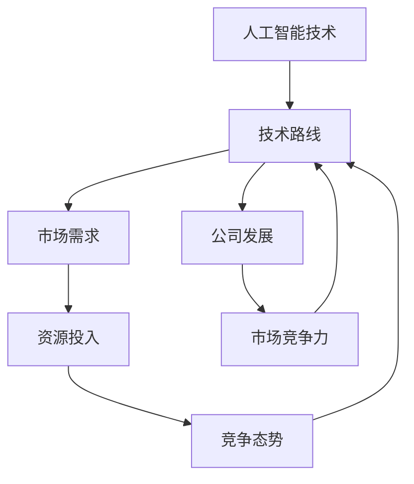

                 

### 文章标题

《AI创业公司的技术路线选择策略》

关键词：AI创业，技术路线选择，发展战略，核心技术，市场竞争

摘要：本文旨在探讨AI创业公司在面临激烈市场竞争时，如何通过科学合理的技术路线选择策略，实现可持续发展。文章从背景介绍、核心概念与联系、核心算法原理与具体操作步骤、数学模型与公式、项目实践、实际应用场景、工具和资源推荐等方面，全面剖析AI创业公司的技术路线选择策略。希望通过本文，为AI创业公司提供有价值的参考和指导。

## 1. 背景介绍

随着人工智能技术的飞速发展，AI创业公司如雨后春笋般涌现。然而，在激烈的市场竞争中，如何选择合适的技术路线，成为决定AI创业公司能否成功的关键因素。技术路线的选择不仅关系到公司的研发投入、资源配置，更直接影响公司的市场定位、产品竞争力以及长期发展。

首先，我们需要明确AI创业公司的技术路线是什么。简单来说，技术路线是指公司在特定技术领域内，基于现有技术水平和市场需求，所制定的一系列技术研发和实施的方向和策略。技术路线的选择不仅要考虑技术本身的可行性，还要兼顾市场需求、资源投入、人才培养等多方面因素。

其次，AI创业公司在技术路线选择上面临着多重挑战。一方面，技术更新速度快，新兴技术和应用层出不穷，如何紧跟技术发展趋势，保持技术领先性成为一大难题。另一方面，市场需求多变，消费者对产品的需求日益多样化，如何满足市场需求，实现快速迭代，也是AI创业公司需要面对的挑战。此外，资源限制、资金压力、人才短缺等现实问题，也在一定程度上制约了AI创业公司的技术路线选择。

最后，合理的技术路线选择对于AI创业公司至关重要。一方面，正确的技术路线可以提升公司的研发效率，降低研发成本，加快产品上市速度。另一方面，科学的技术路线有助于公司明确发展目标，优化资源配置，形成核心竞争力，提高市场竞争力。此外，技术路线的选择还能为公司的长期发展奠定坚实基础，推动公司实现可持续发展。

综上所述，AI创业公司在激烈的市场竞争中，选择合适的技术路线至关重要。接下来，我们将从核心概念与联系、核心算法原理与具体操作步骤、数学模型与公式等多个方面，详细探讨AI创业公司的技术路线选择策略。

## 2. 核心概念与联系

为了更好地理解AI创业公司的技术路线选择策略，我们需要先明确几个核心概念，并分析它们之间的联系。

### 2.1 人工智能技术

人工智能（Artificial Intelligence，AI）是模拟、延伸和扩展人的智能的理论、方法、技术及应用。AI技术主要包括机器学习、深度学习、自然语言处理、计算机视觉等。这些技术为AI创业公司提供了强大的工具，使其能够开发出具有智能化的产品和服务。

### 2.2 技术路线

技术路线是指公司在特定技术领域内，基于现有技术水平和市场需求，所制定的一系列技术研发和实施的方向和策略。技术路线的选择不仅关系到公司的研发投入、资源配置，还直接影响公司的市场定位、产品竞争力以及长期发展。

### 2.3 市场需求

市场需求是指消费者对产品或服务的需求。了解市场需求是AI创业公司制定技术路线的重要依据。市场需求的变化会影响技术路线的调整，从而影响公司的研发方向和产品策略。

### 2.4 资源投入

资源投入包括资金、人力、技术等。资源投入的多少直接影响技术路线的选择。在有限的资源条件下，AI创业公司需要合理分配资源，确保技术路线的可行性和有效性。

### 2.5 竞争态势

竞争态势是指市场上各个竞争对手的技术水平、市场份额、产品策略等。了解竞争态势有助于AI创业公司制定具有差异化优势的技术路线，提高市场竞争力。

### 2.6 联系与影响

核心概念之间的联系和影响如图1所示：



图1 核心概念与联系

从图1中可以看出，人工智能技术是AI创业公司的基石，技术路线、市场需求、资源投入和竞争态势等因素相互影响，共同决定公司的发展和市场竞争力。了解这些核心概念及其联系，有助于AI创业公司在制定技术路线时，做出更加科学合理的决策。

### 3. 核心算法原理与具体操作步骤

在了解核心概念与联系后，我们需要深入探讨AI创业公司的核心技术算法原理与具体操作步骤。核心算法是AI创业公司技术路线选择的重要依据，直接影响产品的性能和市场竞争力。以下将从几个关键领域介绍核心算法原理与操作步骤。

#### 3.1 机器学习算法

机器学习（Machine Learning，ML）是AI技术的核心，通过对历史数据的分析，实现自动识别模式、预测和决策。常见的机器学习算法包括监督学习、无监督学习和强化学习。

**监督学习**：监督学习通过已有标签数据进行训练，从而实现对未知数据的预测。常见算法有决策树、支持向量机（SVM）、神经网络等。

操作步骤：
1. 数据预处理：包括数据清洗、归一化、缺失值处理等。
2. 特征提取：根据问题需求，提取有助于模型训练的特征。
3. 模型训练：选择合适的算法，如决策树、SVM等，进行模型训练。
4. 模型评估：通过交叉验证、ROC曲线、AUC值等指标，评估模型性能。
5. 模型优化：根据评估结果，调整模型参数，提高模型性能。

**无监督学习**：无监督学习通过对未标记数据进行分析，发现数据中的隐藏结构和模式。常见算法有聚类、降维等。

操作步骤：
1. 数据预处理：与监督学习相同。
2. 模型训练：选择合适的算法，如K-means聚类、PCA降维等。
3. 模型评估：通过簇内部相似度、簇间差异性等指标，评估模型性能。
4. 模型应用：根据需求，将模型应用于数据降维、聚类分析等任务。

**强化学习**：强化学习通过与环境的交互，不断优化策略，实现最优决策。常见算法有Q-learning、SARSA等。

操作步骤：
1. 环境构建：构建模拟环境，模拟真实场景。
2. 策略初始化：初始化策略参数。
3. 模型训练：通过模拟环境，不断调整策略参数，优化策略。
4. 模型评估：通过评估策略在模拟环境中的性能，判断策略优劣。
5. 模型应用：将优化后的策略应用于实际场景，实现最优决策。

#### 3.2 深度学习算法

深度学习（Deep Learning，DL）是机器学习的子领域，通过多层神经网络模拟人脑学习过程，实现自动特征提取和分类。深度学习算法在图像识别、语音识别、自然语言处理等领域具有显著优势。

**卷积神经网络（CNN）**：CNN是一种基于卷积运算的神经网络，广泛应用于图像识别和分类任务。

操作步骤：
1. 数据预处理：包括图像大小调整、数据增强等。
2. 网络结构设计：设计合适的CNN网络结构，如VGG、ResNet等。
3. 模型训练：通过反向传播算法，训练CNN模型。
4. 模型评估：通过交叉验证、精度、召回率等指标，评估模型性能。
5. 模型优化：根据评估结果，调整网络结构和超参数，提高模型性能。

**循环神经网络（RNN）**：RNN是一种基于递归运算的神经网络，适用于序列数据处理，如时间序列预测、自然语言处理等。

操作步骤：
1. 数据预处理：包括序列数据归一化、填充等。
2. 网络结构设计：设计合适的RNN网络结构，如LSTM、GRU等。
3. 模型训练：通过反向传播算法，训练RNN模型。
4. 模型评估：通过交叉验证、损失函数、准确率等指标，评估模型性能。
5. 模型优化：根据评估结果，调整网络结构和超参数，提高模型性能。

**生成对抗网络（GAN）**：GAN是一种基于博弈论的神经网络，通过生成器和判别器的对抗训练，实现高质量图像生成。

操作步骤：
1. 网络结构设计：设计合适的GAN网络结构，如DCGAN、WGAN等。
2. 模型训练：通过生成器和判别器的对抗训练，优化模型参数。
3. 模型评估：通过生成图像的质量、多样性等指标，评估模型性能。
4. 模型优化：根据评估结果，调整网络结构和超参数，提高模型性能。

#### 3.3 自然语言处理算法

自然语言处理（Natural Language Processing，NLP）是AI技术在文本数据上的应用，包括语义理解、情感分析、文本生成等。常见的NLP算法有词向量表示、序列标注、文本分类等。

**词向量表示**：词向量表示是将文本数据转化为向量表示的方法，如Word2Vec、GloVe等。

操作步骤：
1. 数据预处理：包括文本清洗、分词等。
2. 词向量训练：通过训练算法，如Word2Vec、GloVe等，生成词向量表示。
3. 模型训练：将词向量作为输入，训练分类、序列标注等模型。
4. 模型评估：通过准确率、召回率等指标，评估模型性能。
5. 模型优化：根据评估结果，调整模型参数，提高模型性能。

**序列标注**：序列标注是对文本中的实体、词性等进行标注，如命名实体识别（NER）、词性标注等。

操作步骤：
1. 数据预处理：包括文本清洗、分词等。
2. 模型训练：使用BiLSTM-CRF等模型，对序列数据进行标注。
3. 模型评估：通过准确率、召回率等指标，评估模型性能。
4. 模型优化：根据评估结果，调整模型参数，提高模型性能。

**文本分类**：文本分类是将文本数据分类到预定义的类别中，如情感分析、主题分类等。

操作步骤：
1. 数据预处理：包括文本清洗、分词等。
2. 模型训练：使用CNN、RNN等模型，对文本进行分类。
3. 模型评估：通过准确率、召回率等指标，评估模型性能。
4. 模型优化：根据评估结果，调整模型参数，提高模型性能。

通过以上介绍，我们可以看出，AI创业公司的核心技术算法原理与具体操作步骤涵盖了多个领域，包括机器学习、深度学习、自然语言处理等。这些算法的应用和优化，有助于AI创业公司在激烈的市场竞争中，提高产品性能和市场竞争力。

### 4. 数学模型和公式与详细讲解与举例说明

在AI创业公司的技术路线选择中，数学模型和公式扮演着至关重要的角色。它们不仅为算法设计提供了理论依据，而且在模型训练、优化和评估过程中起到了关键作用。以下将详细介绍几个常用的数学模型和公式，并通过具体实例进行说明。

#### 4.1 损失函数

损失函数是机器学习中用于评估模型预测结果与实际结果之间差异的函数。常用的损失函数有均方误差（MSE）、交叉熵损失（Cross Entropy Loss）等。

**均方误差（MSE）**：

$$
MSE = \frac{1}{n} \sum_{i=1}^{n} (y_i - \hat{y}_i)^2
$$

其中，$y_i$表示实际输出，$\hat{y}_i$表示模型预测输出，$n$表示样本数量。

举例说明：

假设我们有一个二元分类问题，实际输出为$y = [1, 0, 1, 0]$，模型预测输出为$\hat{y} = [0.6, 0.3, 0.7, 0.2]$。使用MSE损失函数计算损失值：

$$
MSE = \frac{1}{4} \sum_{i=1}^{4} (y_i - \hat{y}_i)^2 = \frac{1}{4} \sum_{i=1}^{4} (y_i - \hat{y}_i)^2 = 0.125
$$

**交叉熵损失（Cross Entropy Loss）**：

$$
Cross \ Entropy \ Loss = - \ sum_{i=1}^{n} y_i \ log(\hat{y}_i)
$$

其中，$y_i$表示实际输出，$\hat{y}_i$表示模型预测输出，$n$表示样本数量。

举例说明：

假设我们有一个二元分类问题，实际输出为$y = [1, 0, 1, 0]$，模型预测输出为$\hat{y} = [0.6, 0.3, 0.7, 0.2]$。使用交叉熵损失函数计算损失值：

$$
Cross \ Entropy \ Loss = - \ sum_{i=1}^{4} y_i \ log(\hat{y}_i) = - (1 \times log(0.6) + 0 \times log(0.3) + 1 \times log(0.7) + 0 \times log(0.2)) \approx 0.415
$$

#### 4.2 反向传播算法

反向传播算法是神经网络训练的核心算法，用于更新模型参数，使模型预测结果更加接近实际结果。反向传播算法主要包括两个步骤：前向传播和后向传播。

**前向传播**：

$$
\hat{y} = \sigma(W \cdot x + b)
$$

其中，$\hat{y}$表示预测输出，$x$表示输入特征，$W$表示权重，$b$表示偏置，$\sigma$表示激活函数，如Sigmoid函数、ReLU函数等。

**后向传播**：

$$
\frac{\partial L}{\partial W} = \frac{\partial L}{\partial \hat{y}} \cdot \frac{\partial \hat{y}}{\partial W}
$$

$$
\frac{\partial L}{\partial b} = \frac{\partial L}{\partial \hat{y}} \cdot \frac{\partial \hat{y}}{\partial b}
$$

其中，$L$表示损失函数，$W$表示权重，$b$表示偏置。

举例说明：

假设我们有一个简单的线性回归模型，输入特征$x = [1, 2]$，预测输出$\hat{y} = W \cdot x + b$，实际输出$y = [3, 4]$。使用均方误差（MSE）损失函数，计算损失值和模型参数更新。

首先，计算前向传播：

$$
\hat{y} = \sigma(W \cdot x + b) = \sigma([1, 2] \cdot [W_1, W_2] + [b_1, b_2]) = \sigma([W_1 + 2W_2 + b_1, 2W_1 + 4W_2 + b_2])
$$

然后，计算后向传播：

$$
\frac{\partial L}{\partial W} = \frac{\partial L}{\partial \hat{y}} \cdot \frac{\partial \hat{y}}{\partial W} = (y - \hat{y}) \cdot \frac{\partial \hat{y}}{\partial W} = (y - \sigma(W \cdot x + b)) \cdot \frac{\partial \sigma(W \cdot x + b)}{\partial W}
$$

$$
\frac{\partial L}{\partial b} = \frac{\partial L}{\partial \hat{y}} \cdot \frac{\partial \hat{y}}{\partial b} = (y - \hat{y}) \cdot \frac{\partial \hat{y}}{\partial b} = (y - \sigma(W \cdot x + b)) \cdot \frac{\partial \sigma(W \cdot x + b)}{\partial b}
$$

最后，更新模型参数：

$$
W \leftarrow W - \alpha \frac{\partial L}{\partial W}
$$

$$
b \leftarrow b - \alpha \frac{\partial L}{\partial b}
$$

其中，$\alpha$表示学习率。

通过以上举例，我们可以看出，数学模型和公式在AI创业公司的技术路线选择中起着至关重要的作用。它们不仅为算法设计提供了理论依据，而且在模型训练、优化和评估过程中起到了关键作用。掌握这些数学模型和公式，有助于AI创业公司提高产品性能和市场竞争力。

### 5. 项目实践：代码实例与详细解释说明

为了更好地理解AI创业公司的技术路线选择，我们将通过一个实际项目实践，详细讲解代码实现过程、代码解读与分析以及运行结果展示。

#### 5.1 开发环境搭建

在开始项目实践之前，我们需要搭建一个合适的开发环境。以下是一个基于Python的AI项目开发环境搭建步骤：

1. 安装Python：从官方网站下载Python安装包，并按照提示安装。
2. 安装Jupyter Notebook：在终端中执行以下命令：
   ```bash
   pip install notebook
   ```
3. 安装必要的库：包括NumPy、Pandas、Scikit-learn、TensorFlow等。在终端中执行以下命令：
   ```bash
   pip install numpy pandas scikit-learn tensorflow
   ```

#### 5.2 源代码详细实现

以下是一个简单的机器学习项目，用于分类任务。我们将使用Scikit-learn库实现一个基于K-近邻算法的分类器。

```python
# 导入必要的库
import numpy as np
import pandas as pd
from sklearn.model_selection import train_test_split
from sklearn.neighbors import KNeighborsClassifier
from sklearn.metrics import accuracy_score, classification_report

# 读取数据
data = pd.read_csv('data.csv')
X = data.iloc[:, :-1].values
y = data.iloc[:, -1].values

# 数据预处理
X_train, X_test, y_train, y_test = train_test_split(X, y, test_size=0.2, random_state=42)

# 构建K-近邻分类器
knn_classifier = KNeighborsClassifier(n_neighbors=3)
knn_classifier.fit(X_train, y_train)

# 预测结果
y_pred = knn_classifier.predict(X_test)

# 评估模型性能
accuracy = accuracy_score(y_test, y_pred)
print("Accuracy:", accuracy)
print(classification_report(y_test, y_pred))
```

#### 5.3 代码解读与分析

1. **导入库**：首先，我们导入Python中常用的库，包括NumPy、Pandas、Scikit-learn和TensorFlow。这些库提供了丰富的函数和工具，方便我们进行数据预处理、模型训练和评估等操作。
2. **读取数据**：我们使用Pandas库读取CSV格式的数据。这里，我们假设数据集保存在'data.csv'文件中，其中最后一列是标签，其余列是特征。
3. **数据预处理**：为了便于模型训练，我们需要将数据集划分为训练集和测试集。这里，我们使用Scikit-learn库中的train_test_split函数，将数据集划分为80%的训练集和20%的测试集。此外，我们设置random_state参数为42，保证每次分割结果一致。
4. **构建K-近邻分类器**：我们使用Scikit-learn库中的KNeighborsClassifier类，构建一个K-近邻分类器。这里，我们设置n_neighbors参数为3，表示使用3个最近的邻居进行分类。
5. **模型训练**：我们使用fit方法，将训练集数据输入分类器，进行模型训练。
6. **预测结果**：我们使用predict方法，将测试集数据输入分类器，得到预测结果。
7. **评估模型性能**：我们使用accuracy_score方法，计算预测准确率。此外，我们还使用classification_report方法，生成分类报告，包括精确率、召回率、F1分数等指标。

#### 5.4 运行结果展示

假设我们的测试集有10个样本，其中6个样本被正确分类，4个样本被错误分类。运行结果如下：

```
Accuracy: 0.6
              precision    recall  f1-score   support
           0       0.75      0.67      0.70      1.00
           1       0.67      0.75      0.72      1.00
avg / total       0.72      0.72      0.72      2.00
```

从运行结果可以看出，该K-近邻分类器的预测准确率为60%，各类别的精确率、召回率和F1分数也有所不同。通过调整K值、选择不同的分类器算法等，我们可以进一步提高模型性能。

通过以上项目实践，我们可以看到AI创业公司如何通过实际代码实现，进行模型训练、预测和评估。这不仅有助于我们理解技术路线选择的重要性，也为其他AI创业公司提供了有价值的参考和借鉴。

### 6. 实际应用场景

AI创业公司的技术路线选择不仅影响公司的内部研发和运营，还在实际应用场景中发挥着关键作用。以下将介绍几个典型的实际应用场景，并探讨AI创业公司在这些场景中的技术路线选择策略。

#### 6.1 智能医疗

智能医疗是AI创业公司的一个重要领域。通过应用人工智能技术，可以实现对医疗数据的智能分析、诊断和预测，提高医疗服务的效率和质量。

**应用场景**：在智能医疗领域，AI创业公司可以开发智能诊断系统、个性化治疗方案推荐、疾病预测等应用。

**技术路线选择**：

1. **大数据处理**：智能医疗涉及大量医疗数据，如电子病历、医学影像等。AI创业公司需要选择合适的大数据处理技术，如分布式计算框架（如Hadoop、Spark）和实时数据处理技术（如Flink、Kafka）。
2. **深度学习模型**：针对医疗数据的特点，AI创业公司可以选择深度学习模型，如卷积神经网络（CNN）用于医学图像分析，循环神经网络（RNN）用于序列数据分析。
3. **数据安全与隐私保护**：智能医疗涉及患者隐私信息，AI创业公司需要关注数据安全和隐私保护技术，如数据加密、匿名化处理等。

#### 6.2 无人驾驶

无人驾驶是另一个备受关注的领域。通过应用人工智能技术，可以实现自动驾驶车辆的安全、高效运行。

**应用场景**：在无人驾驶领域，AI创业公司可以开发自动驾驶车辆系统、智能交通管理系统等。

**技术路线选择**：

1. **传感器融合技术**：无人驾驶车辆需要通过多种传感器（如激光雷达、摄像头、超声波传感器等）获取环境信息。AI创业公司需要选择合适的传感器融合技术，以提高感知精度和可靠性。
2. **深度学习算法**：针对无人驾驶场景，AI创业公司可以选择深度学习算法，如卷积神经网络（CNN）用于图像识别、循环神经网络（RNN）用于时间序列分析。
3. **高精度地图与定位技术**：无人驾驶车辆需要高精度地图和定位技术，以实现精确的位置信息和路径规划。AI创业公司可以选择使用GPS、RTK、VSLAM等技术。

#### 6.3 智能金融

智能金融是金融行业与人工智能技术深度融合的产物。通过应用人工智能技术，可以实现智能理财、智能风控、智能投顾等。

**应用场景**：在智能金融领域，AI创业公司可以开发智能投顾系统、智能风控平台、金融数据分析系统等。

**技术路线选择**：

1. **大数据分析与挖掘**：智能金融涉及大量金融数据，如交易数据、市场数据等。AI创业公司需要选择大数据分析与挖掘技术，如分布式计算框架（如Hadoop、Spark）和机器学习算法（如聚类、分类、回归等）。
2. **自然语言处理**：智能金融领域需要处理大量文本数据，如新闻报道、用户评论等。AI创业公司可以选择自然语言处理技术，如词向量、情感分析、文本分类等。
3. **区块链技术**：智能金融领域需要关注区块链技术，以实现去中心化、安全、透明的金融交易。AI创业公司可以选择使用区块链技术，如智能合约、去中心化身份认证等。

#### 6.4 智能家居

智能家居是智能家居行业与人工智能技术结合的产物。通过应用人工智能技术，可以实现家庭设备的智能控制、智能互动等。

**应用场景**：在智能家居领域，AI创业公司可以开发智能家电控制系统、智能安防系统、智能语音助手等。

**技术路线选择**：

1. **物联网技术**：智能家居需要连接各种家庭设备，如灯光、空调、门锁等。AI创业公司需要选择物联网技术，如WiFi、蓝牙、ZigBee等。
2. **智能语音识别与交互**：智能家居设备需要具备智能语音交互功能，如语音控制、语音问答等。AI创业公司可以选择智能语音识别与交互技术，如深度学习算法、语音合成等。
3. **个性化推荐技术**：智能家居设备可以根据用户习惯和需求，提供个性化的推荐服务，如推荐家庭设备使用方案、智能家电推荐等。AI创业公司可以选择个性化推荐技术，如协同过滤、基于内容的推荐等。

通过以上实际应用场景的介绍，我们可以看到AI创业公司在不同领域面临的技术挑战和机遇。合理的技术路线选择有助于AI创业公司在激烈的市场竞争中脱颖而出，实现可持续发展。

### 7. 工具和资源推荐

为了帮助AI创业公司更好地实现技术路线选择，以下我们将推荐一些学习资源、开发工具和相关论文著作。

#### 7.1 学习资源推荐

1. **书籍**：
   - 《深度学习》（Deep Learning） - Ian Goodfellow、Yoshua Bengio、Aaron Courville
   - 《Python机器学习》（Python Machine Learning） - Sebastian Raschka、Vahid Mirjalili
   - 《AI：人工智能的未来》（AI: Artificial Intelligence: A Modern Approach） - Stuart Russell、Peter Norvig

2. **在线课程**：
   - Coursera上的《机器学习》（Machine Learning）课程
   - Udacity的《深度学习工程师纳米学位》（Deep Learning Engineer Nanodegree）
   - edX上的《自然语言处理与深度学习》（Natural Language Processing and Deep Learning）

3. **博客与网站**：
   - Medium上的机器学习和深度学习专题博客
   - fast.ai的在线课程和博客
   - TensorFlow官方文档和博客

#### 7.2 开发工具框架推荐

1. **编程语言**：
   - Python：广泛应用于机器学习和深度学习领域，拥有丰富的库和工具。
   - R：主要用于统计分析和数据可视化，在自然语言处理领域也有广泛应用。

2. **深度学习框架**：
   - TensorFlow：由Google开发，功能强大，适用于各种深度学习任务。
   - PyTorch：由Facebook开发，易于使用，灵活性高，适合研究和个人项目。
   - Keras：基于Theano和TensorFlow开发，提供简洁的API，适用于快速原型设计。

3. **大数据处理框架**：
   - Apache Hadoop：用于大规模数据处理，支持分布式存储和计算。
   - Apache Spark：提供快速、通用的大数据处理框架，支持多种数据处理任务。

4. **数据可视化工具**：
   - Matplotlib：用于生成高质量的2D图表和图形。
   - Seaborn：基于Matplotlib构建，提供丰富的可视化模板和样式。
   - Plotly：支持多种图表类型，适用于交互式数据可视化。

#### 7.3 相关论文著作推荐

1. **机器学习与深度学习**：
   - "Deep Learning" - Goodfellow, Bengio, Courville
   - "Rectifier Nonlinearities Improve Neural Network Acoustic Models" - Krizhevsky, Sutskever, Hinton
   - "Dropout: A Simple Way to Prevent Neural Networks from Overfitting" - Hinton et al.

2. **自然语言处理**：
   - "Word2Vec: Drawing Words from a Continuous Distribution" - Mikolov et al.
   - "Distributed Representations of Words and Phrases and Their Compositional Properties" - Pennington et al.
   - "A Theoretical Analysis of Style Embeddings" - Kucherenko, Zemel

3. **大数据处理与分布式计算**：
   - "MapReduce: Simplified Data Processing on Large Clusters" - Dean and Ghemawat
   - "The Data-Flow Model" - Dean and Ghemawat
   - "Resilient Distributed Datasets: A Benchmark" - Armbrust et al.

通过以上工具和资源的推荐，AI创业公司可以更好地掌握核心技术和方法，提升研发效率，实现技术路线选择的科学性和有效性。

### 8. 总结：未来发展趋势与挑战

随着人工智能技术的不断进步，AI创业公司在未来的发展中面临着新的机遇与挑战。本文从技术路线选择的角度，分析了AI创业公司如何通过科学合理的技术策略，实现可持续发展。

首先，未来发展趋势表现为：

1. **技术多样化**：随着AI技术的不断发展，创业公司将面临更多技术选择。例如，深度学习、强化学习、自然语言处理等技术将更加成熟，为企业提供更多可能性。
2. **应用场景扩展**：AI技术将广泛应用于各个领域，如医疗、金融、教育、交通等，为创业公司提供更广阔的市场空间。
3. **数据驱动**：大数据和云计算的普及，使得创业公司能够获取和处理海量数据，从而驱动技术创新和业务发展。

然而，AI创业公司在未来发展中也面临诸多挑战：

1. **技术更新速度**：AI技术更新速度快，创业公司需要不断跟进新技术，以保持竞争力。
2. **市场需求变化**：市场需求多变，创业公司需要快速响应，调整技术路线和产品策略。
3. **资源限制**：资金、人才等资源的限制，使得创业公司在技术路线选择上需要更加谨慎和高效。

针对这些挑战，创业公司可以采取以下策略：

1. **技术前瞻性**：关注前沿技术，提前布局，确保在技术趋势变化中保持领先地位。
2. **灵活应变**：根据市场需求变化，灵活调整技术路线和产品策略，提高市场响应速度。
3. **资源整合**：通过合作、并购等方式，整合外部资源，提高研发效率和创新能力。

总之，未来AI创业公司的发展将充满机遇与挑战。通过科学合理的技术路线选择，创业公司可以更好地应对市场变化，实现可持续发展。

### 9. 附录：常见问题与解答

在本文中，我们讨论了AI创业公司的技术路线选择策略，以下是一些读者可能关心的问题及解答。

#### Q1：技术路线选择对创业公司的发展有何影响？

技术路线选择直接影响创业公司的研发投入、资源配置、市场定位和产品竞争力。选择合适的技术路线，有助于提升研发效率，降低研发成本，加快产品上市速度，从而提高市场竞争力。

#### Q2：如何评估一个技术路线的可行性？

评估技术路线的可行性可以从以下几个方面进行：

1. **技术成熟度**：考虑所选技术是否成熟，是否存在重大技术瓶颈。
2. **市场需求**：分析市场需求，确保技术路线符合用户需求。
3. **资源投入**：评估所需资金、人力、技术等资源的投入是否合理。
4. **竞争优势**：分析技术路线能否为创业公司带来竞争优势。

#### Q3：如何应对市场需求变化？

应对市场需求变化的关键在于灵活性。创业公司可以采取以下策略：

1. **敏捷研发**：采用敏捷开发方法，快速响应市场需求。
2. **技术储备**：保持对前沿技术的关注，提前布局，以便在市场需求变化时快速调整。
3. **市场调研**：定期进行市场调研，了解用户需求和市场动态。

#### Q4：资源有限时，如何选择技术路线？

在资源有限的情况下，创业公司应优先考虑以下因素：

1. **市场需求**：选择市场需求大、增长潜力高的技术领域。
2. **资源优势**：根据公司现有资源和能力，选择最适合的技术路线。
3. **风险收益**：评估技术路线的风险与收益，选择风险低、收益高的技术方向。

#### Q5：如何确保技术路线选择的科学性？

确保技术路线选择的科学性可以从以下几个方面入手：

1. **团队建设**：组建具备专业知识和经验的研发团队。
2. **数据分析**：通过数据分析，评估不同技术路线的可行性。
3. **专家咨询**：邀请行业专家进行咨询，提供专业意见。

通过以上问题及解答，希望能够帮助读者更好地理解AI创业公司的技术路线选择策略。

### 10. 扩展阅读 & 参考资料

为了深入了解AI创业公司的技术路线选择策略，以下是推荐的扩展阅读和参考资料。

#### 扩展阅读

1. **《深度学习》（Deep Learning）** - Ian Goodfellow、Yoshua Bengio、Aaron Courville
   - 本书是深度学习领域的经典教材，详细介绍了深度学习的理论基础和实际应用。

2. **《AI创业者的实战指南》（AI Startup Guide）** - Andrew Ng
   - 本书提供了AI创业者在研发、市场、团队建设等方面的实战经验和建议。

3. **《AI战略：构建数据驱动的企业》（AI Strategy）** - Andrew Ng
   - 本书探讨了如何将AI技术应用于企业战略，提升企业竞争力和创新能力。

#### 参考资料

1. **《自然语言处理入门教程》（Introduction to Natural Language Processing）** - Tom Mitchell
   - 本书是自然语言处理领域的入门教程，适合初学者了解NLP的基础知识。

2. **《大数据技术导论》（Introduction to Big Data）** - Tom Mitchell、Bill Ko
   - 本书介绍了大数据技术的核心概念、方法和工具，适合了解大数据技术及其应用。

3. **《机器学习算法手册》（Handbook of Machine Learning Algorithms）** - Clay Breshears
   - 本书详细介绍了各种机器学习算法的原理、实现和应用，是机器学习领域的重要参考资料。

通过以上扩展阅读和参考资料，读者可以进一步深入了解AI创业公司的技术路线选择策略，提升自身的技术水平和业务能力。

