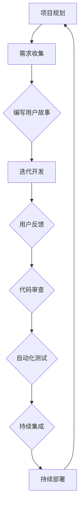

                 

### 文章标题

《AI创业公司的敏捷开发与持续交付：快速迭代与用户反馈》

> 关键词：AI创业公司、敏捷开发、持续交付、快速迭代、用户反馈、敏捷流程、持续集成、DevOps

> 摘要：本文旨在探讨AI创业公司如何在竞争激烈的市场中，通过敏捷开发与持续交付策略，实现快速迭代与用户反馈的闭环，从而加速产品成熟，提升市场竞争力。

### 1. 背景介绍

AI创业公司在当前技术飞速发展的背景下，面临着前所未有的机遇与挑战。一方面，人工智能技术的进步为各种行业带来了深刻的变革，使得创业公司有机会在新兴领域迅速崛起；另一方面，市场中的竞争愈发激烈，产品迭代速度成为创业公司能否生存的关键因素。

敏捷开发（Agile Development）和持续交付（Continuous Delivery）是现代软件开发中的两大核心概念，它们旨在通过快速迭代、持续交付和用户反馈的循环，提高软件交付的效率和产品的质量。敏捷开发强调团队协作、迭代开发和持续反馈，而持续交付则通过自动化测试和部署，确保软件在交付过程中的快速和稳定。

本文将围绕AI创业公司如何利用敏捷开发和持续交付策略，实现快速迭代与用户反馈的闭环展开讨论，旨在为创业者提供一套实用的方法论和实践指南。

### 2. 核心概念与联系

#### 2.1 敏捷开发

敏捷开发是一种以人为核心、迭代、渐进的软件开发方法。它强调团队协作、灵活响应变化和持续交付价值。敏捷开发的核心理念包括：

- **迭代开发**：开发工作分为多个短周期（通常为2-4周），在每个迭代中完成部分功能并交付用户。
- **用户故事**：用户故事是需求的载体，它描述了用户在特定场景下希望完成的功能。
- **看板（Kanban）**：看板是一种可视化工具，用于跟踪和管理开发过程中的任务状态。
- **持续集成（CI）**：持续集成通过自动化测试和构建，确保代码库的稳定性和可部署性。

#### 2.2 持续交付

持续交付是敏捷开发的自然延伸，它强调软件的自动化测试和部署，确保软件可以在任何时间、任何环境下的可靠交付。持续交付的关键概念包括：

- **自动化测试**：通过编写自动化测试脚本，对软件进行持续测试，确保功能正常运行。
- **容器化**：使用容器（如Docker）封装应用及其运行环境，提高部署的灵活性和可移植性。
- **持续部署（CD）**：通过自动化部署脚本，将代码库中的最新版本部署到生产环境。

#### 2.3 敏捷开发与持续交付的联系

敏捷开发和持续交付之间有着紧密的联系。敏捷开发提供了快速迭代和用户反馈的机制，而持续交付则确保了软件的快速、可靠交付。两者的结合使得AI创业公司能够更快速地响应市场变化，提高产品竞争力。


#### 2.4 Mermaid 流程图

以下是一个简化的敏捷开发与持续交付的Mermaid流程图，展示了各阶段之间的关系。



### 3. 核心算法原理 & 具体操作步骤

#### 3.1 敏捷开发的操作步骤

1. **项目规划**：明确项目目标和范围，确定迭代周期和任务量。
2. **需求收集**：与客户和用户沟通，收集需求并转化为用户故事。
3. **编写用户故事**：根据需求编写用户故事，确保每个故事都是可测试的。
4. **迭代开发**：在每个迭代周期内，选择用户故事进行开发，并确保完成可交付的功能。
5. **用户反馈**：交付部分功能后，收集用户反馈，用于改进后续迭代。
6. **代码审查**：进行代码审查，确保代码质量和项目一致性。
7. **自动化测试**：编写自动化测试脚本，对功能进行持续测试。
8. **持续集成**：使用CI工具自动构建和测试代码，确保代码库的稳定性。
9. **持续部署**：使用CD工具将代码库中的最新版本部署到生产环境。

#### 3.2 持续交付的操作步骤

1. **容器化**：使用容器化工具（如Docker）将应用及其依赖环境打包。
2. **自动化测试**：编写自动化测试脚本，对容器化应用进行持续测试。
3. **持续集成**：使用CI工具将代码库中的最新版本构建为容器镜像，并进行自动化测试。
4. **持续部署**：使用CD工具将容器镜像部署到生产环境，并进行监控和日志记录。

### 4. 数学模型和公式 & 详细讲解 & 举例说明

#### 4.1 敏捷开发中的工作量估算

在敏捷开发中，工作量估算是一个关键环节。一种常用的估算方法是**故事点（Story Points）**。

**故事点**：故事点是一种相对工作量度量，它将用户故事分为不同复杂度级别。常见的复杂度级别包括简单、中等、困难和非常复杂。

**计算公式**：

$$
\text{工作量（Story Points）} = \sum_{i=1}^{n} \text{单个用户故事的复杂度等级}
$$

**举例**：

假设有一个包含3个用户故事的任务列表，复杂度等级分别为2、3和4。那么总工作量计算如下：

$$
\text{工作量} = 2 + 3 + 4 = 9 \text{ Story Points}
$$

#### 4.2 持续交付中的部署成功率

在持续交付中，部署成功率是一个重要的指标。部署成功率可以通过以下公式计算：

$$
\text{部署成功率（%）} = \frac{\text{成功部署次数}}{\text{总部署次数}} \times 100\%
$$

**举例**：

假设一个系统在一个月内进行了10次部署，其中8次成功，2次失败。那么部署成功率计算如下：

$$
\text{部署成功率} = \frac{8}{10} \times 100\% = 80\%
$$

### 5. 项目实践：代码实例和详细解释说明

#### 5.1 开发环境搭建

为了实现敏捷开发和持续交付，我们需要搭建一个适当的技术环境。以下是一个简化的开发环境搭建步骤：

1. **操作系统**：选择Linux或MacOS，作为开发环境的基础。
2. **编程语言**：选择Python或Go，作为主要编程语言。
3. **版本控制**：使用Git进行代码版本控制。
4. **容器化工具**：安装Docker，用于容器化应用。
5. **持续集成工具**：选择Jenkins或GitLab CI/CD，用于自动化构建和测试。
6. **持续部署工具**：选择Kubernetes或Docker Swarm，用于容器编排和部署。

#### 5.2 源代码详细实现

以下是一个简单的Python Web应用示例，用于实现一个用户反馈系统。

**用户故事**：

作为用户，我希望能够在使用产品时提供反馈，并且希望能够看到其他用户的反馈。

**需求分析**：

- **用户界面**：一个简单的Web界面，用于提交和查看反馈。
- **后端逻辑**：处理反馈数据的存储、检索和展示。

**实现步骤**：

1. **搭建Web服务器**：使用Flask框架搭建一个简单的Web服务器。
2. **设计数据库**：使用SQLite数据库存储反馈数据。
3. **实现用户界面**：使用HTML和CSS设计用户界面。
4. **实现后端逻辑**：编写Python代码处理用户反馈的提交和展示。

**代码示例**：

```python
# app.py

from flask import Flask, request, render_template
import sqlite3

app = Flask(__name__)

@app.route('/')
def index():
    return render_template('index.html')

@app.route('/submit', methods=['POST'])
def submit():
    feedback = request.form['feedback']
    conn = sqlite3.connect('feedback.db')
    c = conn.cursor()
    c.execute('''INSERT INTO feedback (text) VALUES (?)''', (feedback,))
    conn.commit()
    conn.close()
    return 'Feedback submitted successfully!'

@app.route('/feedback')
def feedback():
    conn = sqlite3.connect('feedback.db')
    c = conn.cursor()
    c.execute('''SELECT * FROM feedback''')
    rows = c.fetchall()
    conn.close()
    return render_template('feedback.html', feedback_list=rows)

if __name__ == '__main__':
    app.run(debug=True)
```

**代码解读**：

- **Web服务器**：使用Flask框架搭建一个简单的Web服务器，监听用户请求。
- **数据库操作**：使用SQLite数据库存储用户反馈数据。
- **用户界面**：使用HTML和CSS设计用户界面，展示反馈内容和提交表单。

#### 5.3 代码解读与分析

上述代码实现了用户反馈系统的基本功能，包括用户界面的展示、用户反馈的提交和数据库存储。

- **模块化设计**：代码采用模块化设计，将Web服务器、数据库操作和用户界面分别封装在独立模块中。
- **可扩展性**：通过添加更多用户故事和功能，可以轻松扩展系统的功能。

#### 5.4 运行结果展示

1. **用户界面**：用户可以在Web界面上提交反馈，并查看其他用户的反馈。


2. **反馈提交**：用户提交反馈后，系统会将反馈存储在数据库中。


3. **反馈展示**：用户可以查看其他用户的反馈。


### 6. 实际应用场景

敏捷开发与持续交付在AI创业公司中的应用场景非常广泛，以下是一些典型的应用场景：

- **智能助手**：通过敏捷开发与持续交付，快速迭代和优化智能助手的自然语言处理和机器学习算法，提高用户体验。
- **图像识别**：利用敏捷开发与持续交付，快速迭代和优化图像识别算法，提高识别准确率和速度。
- **推荐系统**：通过敏捷开发与持续交付，快速迭代和优化推荐算法，提高推荐效果和用户满意度。

### 7. 工具和资源推荐

#### 7.1 学习资源推荐

- **书籍**：
  - 《敏捷软件开发：原则、实践与模式》
  - 《持续交付：发布可靠软件的系统化方法》
- **论文**：
  - 《敏捷开发：理论与实践》
  - 《持续交付：实现快速、可靠的软件交付》
- **博客**：
  - 《敏捷开发与持续交付实践》
  - 《AI创业公司的敏捷开发之路》
- **网站**：
  - [Agile Alliance](https://www.agilealliance.org/)
  - [Continuous Delivery Guide](https://www.continuousdeliveryguide.com/)

#### 7.2 开发工具框架推荐

- **版本控制**：Git
- **容器化工具**：Docker
- **持续集成工具**：Jenkins、GitLab CI/CD
- **持续部署工具**：Kubernetes、Docker Swarm
- **Web框架**：Flask、Django
- **数据库**：SQLite、PostgreSQL

#### 7.3 相关论文著作推荐

- 《敏捷软件开发：原则、实践与模式》
- 《持续交付：发布可靠软件的系统化方法》
- 《软件工程：实践者的研究方法》
- 《人工智能：一种现代方法》

### 8. 总结：未来发展趋势与挑战

随着人工智能技术的不断进步，AI创业公司面临着前所未有的机遇和挑战。未来，敏捷开发与持续交付将在AI创业公司中发挥更加重要的作用，主要体现在以下几个方面：

1. **算法迭代速度**：人工智能算法的迭代速度将大幅提高，敏捷开发与持续交付将成为确保算法迭代效率的关键。
2. **数据闭环**：敏捷开发与持续交付将促进数据闭环，通过用户反馈快速优化算法和产品，提高用户体验。
3. **行业应用**：敏捷开发与持续交付将在更多行业应用中得到推广，特别是在需要快速响应市场变化的领域。

然而，AI创业公司在实施敏捷开发与持续交付过程中也将面临一系列挑战，如：

1. **技术选型**：如何选择合适的开发工具和框架，确保系统的高效和可扩展性。
2. **团队协作**：如何在分布式团队中实现高效协作，提高开发效率。
3. **质量控制**：如何确保软件质量和安全性，避免因快速迭代带来的质量风险。

总之，敏捷开发与持续交付将为AI创业公司提供一条可行的路径，帮助它们在竞争激烈的市场中脱颖而出。然而，创业公司需要持续关注技术发展趋势和团队协作，以应对未来的挑战。

### 9. 附录：常见问题与解答

#### 9.1 什么是敏捷开发？

敏捷开发是一种以人为核心、迭代、渐进的软件开发方法。它强调团队协作、灵活响应变化和持续交付价值。

#### 9.2 什么是持续交付？

持续交付是敏捷开发的自然延伸，它强调软件的自动化测试和部署，确保软件可以在任何时间、任何环境下的可靠交付。

#### 9.3 如何衡量敏捷开发的效果？

可以通过以下几个指标衡量敏捷开发的效果：

- **迭代周期**：迭代周期的缩短，表明开发团队的工作效率提高。
- **用户故事完成率**：用户故事完成率越高，说明开发团队对用户需求的响应能力越强。
- **用户满意度**：用户满意度是衡量敏捷开发效果的重要指标。

#### 9.4 如何确保持续交付的质量？

确保持续交付质量的关键在于：

- **自动化测试**：编写自动化测试脚本，对功能进行持续测试。
- **代码审查**：进行代码审查，确保代码质量和项目一致性。
- **监控与日志**：对系统进行监控和日志记录，及时发现和解决问题。

### 10. 扩展阅读 & 参考资料

- 《敏捷软件开发：原则、实践与模式》
- 《持续交付：发布可靠软件的系统化方法》
- [Agile Alliance](https://www.agilealliance.org/)
- [Continuous Delivery Guide](https://www.continuousdeliveryguide.com/)
- [Jenkins](https://www.jenkins.io/)
- [Kubernetes](https://kubernetes.io/)
- [Docker](https://www.docker.com/)

