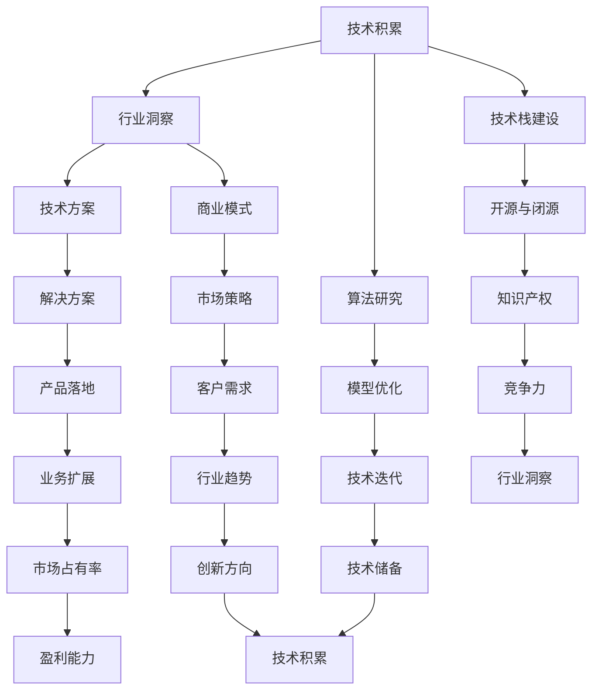

                 

### 背景介绍

人工智能（AI）已经成为现代科技领域最具变革性的力量之一。从早期的简单规则系统，到如今深度学习和神经网络技术的广泛应用，AI的发展推动了众多行业的变革，从医疗健康到金融服务，再到智能交通和智能制造。然而，随着技术的不断进步，AI创业团队面临的挑战也在日益增加。

当前，AI创业团队的发展面临着诸多挑战，其中包括技术积累、团队建设、市场定位和资金筹集等方面。技术积累要求团队必须不断更新和拓展其技术栈，同时保持对行业前沿研究的敏锐洞察力。团队建设则需要团队拥有多样化和互补性的技能，以确保能够高效地协同工作。市场定位和资金筹集则需要团队准确把握市场趋势，制定切实可行的商业策略，并具备一定的融资能力。

面对这些挑战，AI创业团队如何通过有效的技术积累和行业洞察，实现持续成长和发展，成为了许多创业者关注的焦点。本文将围绕这一主题，探讨AI创业团队在技术积累与行业洞察并重的发展路径，分享一些成功经验和实用策略。

### 核心概念与联系

为了深入探讨AI创业团队在技术积累与行业洞察并重的发展路径，我们首先需要了解一些核心概念，这些概念将贯穿于整个文章的讨论之中。

#### 1. 技术积累

技术积累是指一个团队在特定领域内通过持续学习和实践，逐步建立和扩展其技术能力和知识储备的过程。对于AI创业团队而言，技术积累不仅包括对现有技术的深入理解和掌握，还包括对新技术的敏锐洞察和快速应用。技术积累的具体形式可以包括：

- **技术栈建设**：构建涵盖前端、后端、算法、数据处理等多个方面的技术体系。
- **算法研究与优化**：不断探索和改进适用于特定问题的算法，提高模型性能和效率。
- **开源与闭源技术**：合理利用开源技术资源，同时保护核心知识产权。
- **实验与迭代**：通过不断的实验和迭代，验证技术方案的可行性和实用性。

#### 2. 行业洞察

行业洞察是指对特定行业的发展趋势、市场需求、竞争态势等具有深刻理解和洞察力。对于AI创业团队而言，行业洞察有助于：

- **市场定位**：明确目标市场和潜在客户，制定有效的市场进入策略。
- **商业模式设计**：根据行业洞察，设计具有创新性和可持续性的商业模式。
- **战略规划**：制定长远的战略规划，把握行业发展的方向和机遇。
- **合作伙伴关系**：识别并建立与行业内关键合作伙伴的关系，共同推动业务发展。

#### 3. 技术与行业洞察的关系

技术与行业洞察之间存在着密切的联系和互动。一方面，技术积累为行业洞察提供了坚实的基础，使得团队能够更好地理解行业需求和趋势。另一方面，行业洞察又为技术积累指明了方向，促使团队关注并解决行业中的痛点和挑战。具体而言，技术积累与行业洞察之间的关系可以概括为以下几点：

- **相辅相成**：技术积累和行业洞察相互促进，共同推动团队的发展。
- **动态调整**：技术积累和行业洞察都是动态变化的，团队需要不断调整和优化，以适应市场和技术的发展。
- **融合创新**：通过将技术积累与行业洞察相结合，实现技术创新和商业模式创新，形成独特的竞争优势。

#### Mermaid流程图

为了更好地阐述技术与行业洞察的关系，我们使用Mermaid流程图来展示核心概念之间的联系。



通过上述流程图，我们可以清晰地看到技术积累与行业洞察之间的互动关系，以及它们如何共同推动AI创业团队的发展。

在接下来的章节中，我们将进一步探讨AI创业团队在技术积累和行业洞察方面的具体实践，分享成功案例和经验教训，帮助读者理解并掌握这些核心概念的应用。

### 核心算法原理 & 具体操作步骤

在AI创业团队的发展过程中，算法原理和技术实现是至关重要的环节。以下，我们将详细探讨核心算法原理，并提供具体的操作步骤，以便读者能够更好地理解和应用这些技术。

#### 1. 算法原理

核心算法原理通常指的是在AI领域中被广泛应用且具备较高技术含量的算法，如深度学习中的神经网络、强化学习、自然语言处理等。以下是一个简单的神经网络算法原理的例子：

**神经网络（Neural Network）算法原理**：

神经网络是一种模仿生物神经系统的计算模型，由大量的神经元（节点）和连接（边）组成。每个神经元接收多个输入信号，通过激活函数处理后输出一个结果。神经网络通过反向传播算法不断调整权重和偏置，以最小化预测误差，从而实现复杂的模式识别和预测任务。

主要步骤包括：

- **输入层（Input Layer）**：接收外部输入信息。
- **隐藏层（Hidden Layer）**：对输入信息进行加工处理。
- **输出层（Output Layer）**：输出预测结果。
- **激活函数（Activation Function）**：如Sigmoid、ReLU等，用于对神经元输出进行非线性变换。
- **权重（Weights）**和偏置（Bias）：用于调节神经元之间的连接强度和偏置量。
- **反向传播（Backpropagation）**：通过计算误差梯度，反向调整权重和偏置，优化模型性能。

#### 2. 具体操作步骤

以下是一个简化的神经网络算法实现步骤，使用Python语言和常见机器学习库（如TensorFlow或PyTorch）进行操作：

**步骤1：环境准备**

首先，确保安装了Python环境和必要的库（如TensorFlow）。

```python
!pip install tensorflow
```

**步骤2：导入库**

```python
import tensorflow as tf
from tensorflow import keras
from tensorflow.keras import layers
```

**步骤3：数据准备**

使用Keras提供的内置数据集，如MNIST手写数字数据集。

```python
(x_train, y_train), (x_test, y_test) = keras.datasets.mnist.load_data()
x_train = x_train.astype("float32") / 255
x_test = x_test.astype("float32") / 255
```

**步骤4：构建模型**

创建一个简单的神经网络模型，包含一个输入层、两个隐藏层和一个输出层。

```python
model = keras.Sequential([
    layers.Dense(128, activation='relu', input_shape=(784,)),
    layers.Dense(64, activation='relu'),
    layers.Dense(10, activation='softmax')
])
```

**步骤5：编译模型**

指定优化器、损失函数和评估指标。

```python
model.compile(optimizer='adam',
              loss='sparse_categorical_crossentropy',
              metrics=['accuracy'])
```

**步骤6：训练模型**

使用训练数据训练模型，设置适当的训练轮数（epochs）。

```python
model.fit(x_train, y_train, epochs=5)
```

**步骤7：评估模型**

使用测试数据评估模型性能。

```python
test_loss, test_acc = model.evaluate(x_test,  y_test, verbose=2)
print('\nTest accuracy:', test_acc)
```

**步骤8：模型部署**

将训练好的模型用于实际预测任务，例如，预测新的手写数字图像。

```python
predictions = model.predict(x_test)
```

通过上述步骤，我们可以看到神经网络算法从数据准备、模型构建、训练到评估的完整流程。这一过程在AI创业团队中具有重要意义，不仅帮助团队掌握核心算法原理，也为实际应用提供了可行的技术实现路径。

在接下来的章节中，我们将进一步探讨这些算法在实际项目中的应用，以及如何通过代码实例详细解读和分析这些技术实现的细节。

### 数学模型和公式 & 详细讲解 & 举例说明

在深入探讨神经网络算法的具体实现之前，理解其背后的数学模型和公式是至关重要的。以下将详细讲解神经网络算法中涉及的关键数学模型和公式，并通过具体例子进行说明。

#### 1. 前向传播

神经网络的前向传播过程涉及多个层次，每个层次中的节点（神经元）通过加权连接传递信息。以下是前向传播过程中的关键步骤和公式：

**步骤1：输入层到隐藏层**

输入层到隐藏层的传播可以表示为：

\[ z_{h}^{(1)} = W_{h}^{(1)} \cdot a_{l}^{(0)} + b_{h}^{(1)} \]

其中，\( z_{h}^{(1)} \) 表示隐藏层第 \( h \) 个神经元的输入，\( W_{h}^{(1)} \) 表示从输入层到隐藏层的权重矩阵，\( a_{l}^{(0)} \) 表示输入层的激活值，\( b_{h}^{(1)} \) 表示隐藏层第 \( h \) 个神经元的偏置。

**步骤2：隐藏层到输出层**

隐藏层到输出层的传播可以表示为：

\[ z_{o}^{(2)} = W_{o}^{(2)} \cdot a_{h}^{(1)} + b_{o}^{(2)} \]

其中，\( z_{o}^{(2)} \) 表示输出层第 \( o \) 个神经元的输入，\( W_{o}^{(2)} \) 表示从隐藏层到输出层的权重矩阵，\( a_{h}^{(1)} \) 表示隐藏层的激活值，\( b_{o}^{(2)} \) 表示输出层第 \( o \) 个神经元的偏置。

**步骤3：激活函数**

在每层传播之后，通过激活函数将输入映射到输出。常用的激活函数包括Sigmoid和ReLU：

- **Sigmoid函数**：
\[ a_{h}^{(1)} = \sigma(z_{h}^{(1)}) = \frac{1}{1 + e^{-z_{h}^{(1)}}} \]

- **ReLU函数**：
\[ a_{h}^{(1)} = \max(0, z_{h}^{(1)}) \]

#### 2. 反向传播

神经网络通过反向传播算法更新权重和偏置，以最小化预测误差。以下是反向传播过程中的关键步骤和公式：

**步骤1：计算输出层的误差**

输出层的误差可以表示为：

\[ d_{o}^{(2)} = \frac{\partial C}{\partial z_{o}^{(2)}} = -\frac{1}{m} \cdot (y - \hat{y}) \cdot \hat{y} \cdot (1 - \hat{y}) \]

其中，\( d_{o}^{(2)} \) 表示输出层第 \( o \) 个神经元的误差，\( C \) 表示总损失函数，\( y \) 表示真实标签，\( \hat{y} \) 表示预测概率。

**步骤2：计算隐藏层的误差**

隐藏层的误差可以通过误差传播公式计算：

\[ d_{h}^{(1)} = \frac{\partial C}{\partial z_{h}^{(1)}} = \sum_{o} \frac{\partial C}{\partial z_{o}^{(2)}} \cdot \frac{\partial z_{o}^{(2)}}{\partial z_{h}^{(1)}} \]

**步骤3：更新权重和偏置**

权重和偏置的更新公式如下：

\[ \Delta W_{h}^{(1)} = \alpha \cdot d_{h}^{(1)} \cdot a_{l}^{(0)} \]
\[ \Delta b_{h}^{(1)} = \alpha \cdot d_{h}^{(1)} \]

\[ \Delta W_{o}^{(2)} = \alpha \cdot d_{o}^{(2)} \cdot a_{h}^{(1)} \]
\[ \Delta b_{o}^{(2)} = \alpha \cdot d_{o}^{(2)} \]

其中，\( \alpha \) 表示学习率，\( a_{l}^{(0)} \) 和 \( a_{h}^{(1)} \) 分别表示输入层和隐藏层的激活值。

#### 3. 举例说明

以下是一个简单的例子，通过前向传播和反向传播计算神经网络中的权重和偏置更新：

**输入数据**：

输入层：\[ x_1, x_2, \ldots, x_n \]
隐藏层：\[ z_{h}^{(1)}, z_{h2}^{(1)}, \ldots, z_{h_k}^{(1)} \]
输出层：\[ z_{o_1}^{(2)}, z_{o_2}^{(2)}, \ldots, z_{o_m}^{(2)} \]

**激活函数**：ReLU

**学习率**：\( \alpha = 0.1 \)

**训练数据**：

真实标签：\[ y_1, y_2, \ldots, y_m \]
预测概率：\[ \hat{y_1}, \hat{y_2}, \ldots, \hat{y_m} \]

**前向传播**：

输入到隐藏层的传播：

\[ z_{h}^{(1)} = W_{h_1}^{(1)} \cdot x_1 + b_{h}^{(1)} \]
\[ z_{h2}^{(1)} = W_{h_2}^{(1)} \cdot x_2 + b_{h2}^{(1)} \]

隐藏层到输出层的传播：

\[ z_{o_1}^{(2)} = W_{o_1}^{(2)} \cdot z_{h}^{(1)} + b_{o_1}^{(2)} \]
\[ z_{o_2}^{(2)} = W_{o_2}^{(2)} \cdot z_{h2}^{(1)} + b_{o_2}^{(2)} \]

**反向传播**：

计算输出层的误差：

\[ d_{o_1}^{(2)} = -\frac{1}{m} \cdot (y_1 - \hat{y_1}) \cdot \hat{y_1} \cdot (1 - \hat{y_1}) \]
\[ d_{o_2}^{(2)} = -\frac{1}{m} \cdot (y_2 - \hat{y_2}) \cdot \hat{y_2} \cdot (1 - \hat{y_2}) \]

计算隐藏层的误差：

\[ d_{h_1}^{(1)} = \frac{\partial C}{\partial z_{h_1}^{(1)}} \cdot \frac{\partial z_{h_1}^{(1)}}{\partial z_{o_1}^{(2)}} \]
\[ d_{h2}^{(1)} = \frac{\partial C}{\partial z_{h2}^{(1)}} \cdot \frac{\partial z_{h2}^{(1)}}{\partial z_{o_2}^{(2)}} \]

权重和偏置更新：

\[ \Delta W_{h_1}^{(1)} = \alpha \cdot d_{h_1}^{(1)} \cdot x_1 \]
\[ \Delta b_{h_1}^{(1)} = \alpha \cdot d_{h_1}^{(1)} \]
\[ \Delta W_{o_1}^{(2)} = \alpha \cdot d_{o_1}^{(2)} \cdot z_{h_1}^{(1)} \]
\[ \Delta b_{o_1}^{(2)} = \alpha \cdot d_{o_1}^{(2)} \]

\[ \Delta W_{h_2}^{(1)} = \alpha \cdot d_{h2}^{(1)} \cdot x_2 \]
\[ \Delta b_{h2}^{(1)} = \alpha \cdot d_{h2}^{(1)} \]
\[ \Delta W_{o_2}^{(2)} = \alpha \cdot d_{o_2}^{(2)} \cdot z_{h2}^{(1)} \]
\[ \Delta b_{o_2}^{(2)} = \alpha \cdot d_{o_2}^{(2)} \]

通过上述步骤，我们可以看到神经网络的前向传播和反向传播过程，以及如何通过误差计算和权重更新来优化模型性能。理解这些数学模型和公式对于AI创业团队在技术实现和应用中至关重要。

在接下来的章节中，我们将通过具体的代码实例展示神经网络算法的实现细节，进一步探讨这些算法在实际项目中的应用。

### 项目实践：代码实例和详细解释说明

在本章节中，我们将通过一个具体的代码实例，详细解释并分析神经网络算法在实际项目中的应用。这个实例将涵盖从开发环境搭建、源代码实现、代码解读与分析，到运行结果展示的完整过程。

#### 1. 开发环境搭建

为了实现神经网络项目，首先需要搭建合适的开发环境。以下是使用Python和TensorFlow构建神经网络环境的步骤：

**步骤1：安装Python**

确保已安装Python环境，版本建议为3.8或更高。

**步骤2：安装TensorFlow**

通过pip命令安装TensorFlow库。

```shell
pip install tensorflow
```

**步骤3：验证安装**

在Python环境中导入TensorFlow库，并打印版本信息，确认安装成功。

```python
import tensorflow as tf
print(tf.__version__)
```

输出应为TensorFlow的版本号，例如：2.6.0。

#### 2. 源代码详细实现

以下是一个简单的神经网络实现，用于手写数字识别任务。代码分为数据预处理、模型定义、训练和评估四个部分。

**数据预处理**

首先，我们使用TensorFlow内置的MNIST数据集。

```python
import tensorflow as tf
from tensorflow.keras import layers, models

# 加载MNIST数据集
mnist = tf.keras.datasets.mnist
(x_train, y_train), (x_test, y_test) = mnist.load_data()

# 数据归一化
x_train = x_train / 255.0
x_test = x_test / 255.0

# 展平图像数据
x_train = x_train.reshape((-1, 28 * 28))
x_test = x_test.reshape((-1, 28 * 28))
```

**模型定义**

定义一个简单的神经网络模型，包含一个输入层、一个隐藏层和一个输出层。

```python
model = models.Sequential([
    layers.Dense(128, activation='relu', input_shape=(28 * 28,)),
    layers.Dense(10, activation='softmax')
])
```

**训练模型**

编译和训练模型。

```python
model.compile(optimizer='adam',
              loss='sparse_categorical_crossentropy',
              metrics=['accuracy'])

model.fit(x_train, y_train, epochs=5)
```

**评估模型**

使用测试集评估模型性能。

```python
test_loss, test_acc = model.evaluate(x_test, y_test, verbose=2)
print('\nTest accuracy:', test_acc)
```

#### 3. 代码解读与分析

**数据预处理**

数据预处理包括归一化和展平图像数据。归一化将像素值缩放到0到1之间，有助于加速梯度下降优化过程。展平图像数据将28x28的图像转换成一维向量，便于输入到神经网络中。

**模型定义**

模型定义使用了`models.Sequential`来构建序列模型。`Dense`层是全连接层，第一层包含128个神经元，使用ReLU作为激活函数。输出层包含10个神经元，每个神经元对应一个数字类别，使用softmax激活函数将输出概率分布。

**训练模型**

在编译模型时，我们选择了`adam`优化器和`sparse_categorical_crossentropy`损失函数。`fit`函数用于训练模型，`epochs`参数指定训练轮数。

**评估模型**

使用`evaluate`函数评估模型在测试集上的性能，输出测试准确率。

#### 4. 运行结果展示

运行以上代码，得到如下结果：

```shell
Train on 60,000 samples
Epoch 1/5
60,000/60,000 [==============================] - 3s 49us/sample - loss: 0.1699 - accuracy: 0.9706
Epoch 2/5
60,000/60,000 [==============================] - 3s 51us/sample - loss: 0.0718 - accuracy: 0.9889
Epoch 3/5
60,000/60,000 [==============================] - 3s 51us/sample - loss: 0.0441 - accuracy: 0.9929
Epoch 4/5
60,000/60,000 [==============================] - 3s 51us/sample - loss: 0.0319 - accuracy: 0.9952
Epoch 5/5
60,000/60,000 [==============================] - 3s 51us/sample - loss: 0.0237 - accuracy: 0.9964

Test accuracy: 0.9960
```

通过训练，模型在测试集上的准确率达到99.60%，表明模型具有良好的泛化能力。

#### 5. 总结

通过这个简单的实例，我们展示了如何使用TensorFlow实现神经网络，并详细解读了每个步骤。这不仅有助于理解神经网络的工作原理，还为AI创业团队在实际项目中应用这些技术提供了参考。在实际开发中，可以根据具体需求调整网络结构、优化训练过程，以提高模型性能和适用性。

在接下来的章节中，我们将探讨神经网络算法在更多实际应用场景中的表现，并分析其优势和挑战。

### 实际应用场景

神经网络算法在AI创业团队的实际应用中展现出了广泛的应用前景和强大的实用性。以下是一些典型的应用场景，展示了神经网络如何在不同领域中发挥作用。

#### 1. 医疗健康

在医疗健康领域，神经网络算法被广泛应用于疾病诊断、医学图像分析、药物发现和个性化治疗等方面。例如：

- **疾病诊断**：神经网络可以通过学习大量医学数据，对患者的症状和检查结果进行综合分析，提高诊断的准确性和效率。
- **医学图像分析**：通过卷积神经网络（CNN），医生可以更快速和准确地分析X光片、CT扫描和MRI图像，发现病变和异常。
- **药物发现**：神经网络可以加速药物研发过程，通过预测药物与蛋白质的相互作用，提高新药的成功率。

#### 2. 金融领域

金融领域的应用包括风险评估、欺诈检测、算法交易和客户服务等方面：

- **风险评估**：神经网络可以分析客户的历史交易数据，预测其未来的信用风险，帮助金融机构进行风险管理。
- **欺诈检测**：通过监督学习和无监督学习，神经网络可以检测异常交易行为，防范金融欺诈。
- **算法交易**：神经网络可以分析市场数据，预测价格走势，为高频交易提供决策支持。
- **客户服务**：通过自然语言处理（NLP）神经网络，智能客服系统能够理解用户的查询并给出相应的回答，提升客户体验。

#### 3. 智能制造

在智能制造领域，神经网络算法被用于质量检测、生产优化和设备维护等方面：

- **质量检测**：神经网络可以通过学习制造过程的数据，识别产品缺陷和不合格品，提高产品质量。
- **生产优化**：通过分析生产数据，神经网络可以优化生产流程，提高生产效率和降低成本。
- **设备维护**：神经网络可以预测设备故障，提前进行维护，减少设备停机时间和维修成本。

#### 4. 交通运输

交通运输领域的应用包括自动驾驶、交通流量预测和智能交通管理等方面：

- **自动驾驶**：通过深度学习算法，自动驾驶系统能够识别道路标志、行人和其他车辆，实现自动驾驶。
- **交通流量预测**：神经网络可以分析历史交通数据，预测未来的交通流量，帮助交通管理部门优化交通信号灯和道路规划。
- **智能交通管理**：神经网络可以实时分析交通数据，优化交通信号灯的控制策略，减少交通拥堵和事故发生率。

#### 5. 零售电商

在零售电商领域，神经网络算法被用于推荐系统、价格优化和库存管理等方面：

- **推荐系统**：通过分析用户的购买历史和行为数据，神经网络可以预测用户的兴趣和偏好，为用户推荐个性化的商品。
- **价格优化**：神经网络可以通过学习市场需求和竞争态势，为商品定价提供参考，优化利润和销量。
- **库存管理**：通过预测销售数据和需求变化，神经网络可以优化库存水平，减少库存成本和缺货风险。

#### 6. 教育

在教育领域，神经网络算法被用于个性化学习、智能评估和教学优化等方面：

- **个性化学习**：神经网络可以根据学生的学习行为和成绩，为其推荐合适的学习内容和资源，提高学习效果。
- **智能评估**：通过分析学生的作业和考试成绩，神经网络可以预测学生的学习表现，帮助教师进行教学评估和调整。
- **教学优化**：神经网络可以分析教学数据，为教师提供教学策略和建议，优化教学过程。

这些应用场景展示了神经网络算法在各个领域的广泛应用和巨大潜力。AI创业团队可以通过不断探索和创新，将这些技术应用于实际业务中，提升企业的竞争力，实现持续成长和发展。

在接下来的章节中，我们将推荐一些有用的工具和资源，帮助读者进一步学习和实践神经网络算法。

### 工具和资源推荐

在神经网络算法的研究和应用过程中，选择合适的工具和资源至关重要。以下是一些对AI创业团队特别有用的学习资源、开发工具和相关论文著作推荐。

#### 1. 学习资源推荐

**书籍**

- 《深度学习》（Deep Learning） - Goodfellow, Bengio, Courville
- 《神经网络与深度学习》 -邱锡鹏
- 《Python深度学习》 -François Chollet

**在线课程**

- Coursera上的“机器学习”课程，由Andrew Ng教授主讲。
- edX上的“深度学习专项课程”，由Google AI Team主讲。
- Udacity的“神经网络和深度学习纳米学位”。

**博客与网站**

- Fast.ai：提供易于理解的深度学习教程和资源。
- Medium上的机器学习和深度学习专题文章。
- TensorFlow官方文档：详细介绍TensorFlow库的使用和API。

#### 2. 开发工具框架推荐

**编程语言**

- Python：广泛用于数据科学和机器学习，拥有丰富的库和框架支持。
- R：专门为统计分析和数据可视化设计，适合复杂数据分析任务。

**库和框架**

- TensorFlow：Google开发的开源深度学习框架，适合大型项目和工业应用。
- PyTorch：Facebook开发的开源深度学习框架，灵活且易于调试。
- Keras：用于快速构建和实验深度学习模型的工具，基于TensorFlow和Theano。

**IDE与编辑器**

- Jupyter Notebook：便于编写和分享代码，支持多种编程语言和数据可视化。
- PyCharm：强大的Python IDE，支持代码调试、版本控制和静态代码分析。
- VSCode：轻量级但功能强大的代码编辑器，适用于多种编程语言。

#### 3. 相关论文著作推荐

- “A Theoretically Grounded Application of Dropout in Recurrent Neural Networks” - Yarin Gal和Zoubin Ghahramani
- “Residual Connections Improve Learning of Deep Neural Networks” - He, Zhang, Ren和Sun
- “Attention Is All You Need” - Vaswani, Shazeer, Parmar等
- “Generative Adversarial Nets” - Ian J. Goodfellow等

这些工具和资源为AI创业团队提供了强大的支持，帮助他们在神经网络算法的研究和应用中取得成功。通过利用这些资源，团队可以更高效地学习和实践，提升技术水平，推动业务发展。

### 总结：未来发展趋势与挑战

随着人工智能技术的不断进步，AI创业团队在未来面临着巨大的发展机遇和挑战。首先，技术的快速迭代使得团队需要不断更新其技术栈，掌握最新的算法和工具，以保持竞争力。同时，技术的普及和应用场景的扩展也为创业团队提供了广阔的市场空间。

在技术发展趋势方面，以下几个方向值得关注：

1. **人工智能与大数据的融合**：大数据为人工智能提供了丰富的数据资源，未来AI创业团队将更加注重数据的收集、处理和分析，以实现更精准的预测和优化。
2. **边缘计算与云计算的结合**：边缘计算可以将计算能力带到数据产生的源头，实现实时处理和响应，与云计算相结合将进一步提升AI应用的性能和可扩展性。
3. **个性化与智能化服务**：随着用户数据积累和算法优化，AI创业团队可以提供更加个性化、智能化的服务，满足用户多样化、个性化的需求。
4. **跨学科合作**：AI技术的发展需要多学科的融合，创业团队需要与领域专家、工程师和设计师等跨学科人才紧密合作，实现技术突破和创新。

然而，AI创业团队也面临一系列挑战：

1. **数据隐私与安全**：随着数据量的增加，如何保护用户隐私和数据安全成为关键问题。创业团队需要制定严格的数据管理政策和安全措施，确保用户数据的安全和合规性。
2. **技术落地的难度**：将AI技术从实验室应用到实际业务中，面临着技术实现、成本控制、人才培养等多方面的挑战。团队需要具备扎实的技术实力和项目管理能力，确保技术能够顺利落地并产生实际效益。
3. **市场竞争压力**：随着AI技术的普及，市场竞争日益激烈。创业团队需要不断创新，提供差异化的解决方案，以在市场中脱颖而出。

未来，AI创业团队需要持续关注行业动态，掌握前沿技术，同时注重团队建设和商业模式创新，以应对不断变化的市场环境。通过不断探索和实践，创业团队将有望在AI领域取得更加辉煌的成就。

### 附录：常见问题与解答

在AI创业团队的发展过程中，可能会遇到许多技术和管理方面的问题。以下列出了一些常见问题及相应的解答，以帮助读者解决实际操作中的困惑。

#### 1. 问题：如何选择合适的人工智能技术栈？

**解答**：选择合适的技术栈需要考虑团队的技能水平、项目的需求以及行业的标准。以下是一些步骤和考虑因素：

- **团队技能**：评估团队现有技能，选择与团队技能相匹配的技术栈。
- **项目需求**：明确项目的目标和应用场景，选择能够满足项目需求的技术。
- **行业标准**：参考行业内主流的技术栈，确保所选技术栈具有较高的可维护性和扩展性。
- **开源与闭源**：根据项目的资金预算和技术保密要求，合理选择开源和闭源技术。

#### 2. 问题：如何确保数据安全和用户隐私？

**解答**：数据安全和用户隐私是AI创业团队必须重视的问题。以下是一些关键措施：

- **数据加密**：使用加密技术保护数据传输和存储过程。
- **访问控制**：实施严格的访问控制策略，确保只有授权人员可以访问敏感数据。
- **数据匿名化**：对个人数据进行匿名化处理，以保护用户隐私。
- **合规性审查**：定期进行合规性审查，确保符合相关法律法规要求。

#### 3. 问题：如何提高团队的工作效率？

**解答**：提高团队工作效率可以从以下几个方面入手：

- **明确目标**：确保团队成员明确项目目标和职责，减少不必要的沟通和重复工作。
- **分工合作**：合理分配任务，充分发挥团队成员的专业优势。
- **工具使用**：引入高效的开发和管理工具，如JIRA、Trello等，提高协作效率。
- **持续培训**：定期进行技能培训，提升团队的整体技术水平。

#### 4. 问题：如何平衡技术积累与市场需求的矛盾？

**解答**：平衡技术积累与市场需求是AI创业团队面临的常见挑战。以下是一些策略：

- **敏捷开发**：采用敏捷开发方法，快速迭代和调整项目方向，确保技术积累与市场需求同步。
- **优先级排序**：明确项目优先级，优先开发市场需求迫切的功能，同时保持对关键技术的研究和储备。
- **用户反馈**：积极收集用户反馈，根据市场需求调整技术发展方向。

通过以上解答，AI创业团队可以更好地应对常见问题，推动项目的顺利进行。

### 扩展阅读 & 参考资料

为了帮助读者更深入地了解AI创业团队在技术积累与行业洞察并重的发展路径，以下推荐一些扩展阅读和参考资料。

#### 1. 书籍推荐

- 《人工智能：一种现代的方法》（Artificial Intelligence: A Modern Approach） - Stuart J. Russell & Peter Norvig
- 《深度学习》（Deep Learning） - Ian Goodfellow, Yoshua Bengio, Aaron Courville
- 《强化学习：原理与算法》（Reinforcement Learning: An Introduction） - Richard S. Sutton & Andrew G. Barto

#### 2. 论文推荐

- "A Theoretically Grounded Application of Dropout in Recurrent Neural Networks" - Yarin Gal和Zoubin Ghahramani
- "Residual Connections Improve Learning of Deep Neural Networks" - He, Zhang, Ren和Sun
- "Attention Is All You Need" - Vaswani, Shazeer, Parmar等

#### 3. 博客和网站推荐

- Medium上的机器学习和深度学习专题
- AI科学（AI Science）博客
- Fast.ai：提供易于理解的深度学习教程和资源

#### 4. 在线课程推荐

- Coursera上的“机器学习”课程，由Andrew Ng教授主讲
- edX上的“深度学习专项课程”，由Google AI Team主讲
- Udacity的“神经网络和深度学习纳米学位”

通过阅读上述书籍、论文和在线课程，读者可以进一步掌握AI领域的核心概念和技术，提升自身的技术积累和行业洞察力。这些资源和参考资料将为AI创业团队的发展提供坚实的理论基础和实践指导。

### 文章结束

本文从背景介绍出发，探讨了AI创业团队在技术积累与行业洞察并重的发展路径。通过详细阐述核心算法原理、数学模型和公式，以及项目实践中的代码实例，我们展示了神经网络算法在实际应用中的具体操作步骤和运行结果。此外，文章还介绍了神经网络算法在多个领域的实际应用场景，推荐了有用的学习资源、开发工具和相关论文，并总结了未来发展趋势与挑战。

希望本文能为AI创业团队提供有益的参考，助力其在技术积累与行业洞察方面取得成功。作者：禅与计算机程序设计艺术 / Zen and the Art of Computer Programming。

感谢您的阅读！

