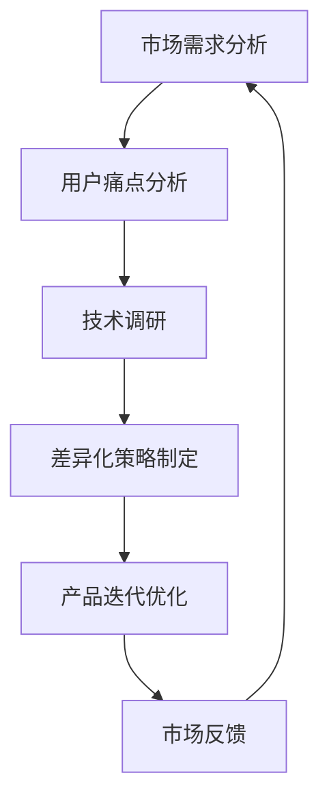

                 

### 背景介绍

在当今快速发展的AI领域，创业公司如雨后春笋般涌现，但随之而来的同质化竞争也日益激烈。据统计，超过50%的AI创业公司面临相似的竞争环境，产品功能高度相似，市场定位模糊不清。这种同质化现象不仅加剧了创业公司的生存压力，也降低了整个行业的创新活力。

同质化竞争的出现，一方面是由于AI技术的门槛相对较低，使得大量的创业公司能够快速开发出类似的产品；另一方面，市场需求和用户痛点相对有限，导致企业在产品设计和功能开发上趋于一致。然而，这种竞争模式并非长久之计，它不仅抑制了技术的多样性和创新性，还容易导致行业的整体衰退。

为了避免同质化竞争，AI创业公司需要深入分析市场需求，明确自身定位，同时积极寻求差异化的发展路径。本文将围绕这一主题，探讨AI创业公司如何避免同质化竞争，实现可持续发展。

### 核心概念与联系

为了更好地理解如何避免AI创业中的同质化竞争，我们首先需要明确几个核心概念及其相互联系。

#### AI产品同质化

AI产品同质化指的是市场上大量AI产品在功能、界面和用户体验上高度相似，缺乏独特性和差异化。这种现象通常由于以下原因导致：

1. **技术门槛低**：AI技术的开源框架和工具层出不穷，使得开发者可以快速构建类似的AI模型和应用。
2. **市场同质化**：市场需求和用户痛点相对有限，企业在产品设计和功能开发上往往趋于一致。
3. **模仿效应**：领先公司的成功产品容易引发跟风效应，其他公司争相模仿，导致同质化竞争。

#### 差异化策略

差异化策略是企业通过提供独特的产品特性或服务，以区别于竞争对手的方法。在AI创业领域，差异化策略包括以下几个方面：

1. **技术创新**：开发独特的AI算法或模型，提供更高效、更精准的服务。
2. **市场细分**：针对特定的细分市场，提供针对性的解决方案。
3. **用户体验**：优化用户界面和交互设计，提供更舒适、更便捷的用户体验。
4. **商业模式**：探索创新的商业模式，例如订阅服务、按需付费等。

#### 市场需求与用户痛点

市场需求和用户痛点是AI创业公司定位和决策的重要依据。了解市场需求可以帮助企业找到市场需求空白点，而用户痛点则提供了改进产品和服务的具体方向。以下是一些常见的市场需求和用户痛点：

1. **精准预测**：用户希望AI系统能够提供更准确的预测结果。
2. **高效处理**：用户希望AI系统能够快速处理大量数据，提供即时反馈。
3. **隐私保护**：用户对个人数据的隐私保护需求日益增加。
4. **可解释性**：用户希望了解AI决策的依据，增强信任度。

#### 差异化与市场需求、用户痛点的关系

差异化策略的成功实施需要与市场需求和用户痛点紧密结合。企业可以通过以下方式实现这种结合：

1. **需求分析**：通过市场调研和用户访谈，深入理解市场需求和用户痛点。
2. **技术调研**：分析现有的AI技术，寻找可以解决用户痛点的创新点。
3. **产品迭代**：根据市场需求和用户反馈，不断迭代和优化产品功能。

### Mermaid 流程图

以下是一个简单的Mermaid流程图，展示了差异化策略与市场需求、用户痛点之间的联系。



通过这个流程，企业可以不断调整和优化差异化策略，以更好地满足市场需求和用户痛点，从而避免同质化竞争。

### 核心算法原理 & 具体操作步骤

为了避免AI创业中的同质化竞争，企业需要采取一系列差异化策略。以下是几个核心算法原理和具体操作步骤，帮助企业实现差异化发展。

#### 1. 基于深度学习的个性化推荐算法

个性化推荐算法是AI领域的一个重要分支，它通过分析用户的历史行为和兴趣，为用户推荐个性化内容。以下是一个基于深度学习的个性化推荐算法的基本原理和步骤：

1. **数据预处理**：收集用户的历史行为数据，如点击记录、购买历史等，并进行清洗和预处理，包括缺失值处理、异常值过滤等。
2. **用户特征提取**：通过特征工程提取用户的基本特征，如用户年龄、性别、地理位置等，以及行为特征，如点击频率、购买频率等。
3. **内容特征提取**：提取推荐内容的特征，如标题、标签、作者等。
4. **构建深度学习模型**：使用深度学习框架，如TensorFlow或PyTorch，构建个性化推荐模型。常见的模型包括基于用户和内容的协同过滤模型、基于模型的协同过滤模型（如矩阵分解）、基于图神经网络的推荐模型等。
5. **模型训练与评估**：使用训练数据对模型进行训练，并通过交叉验证等方法评估模型性能。
6. **推荐结果生成**：将用户特征和内容特征输入训练好的模型，生成个性化推荐结果。

#### 2. 基于生成对抗网络的图像生成算法

生成对抗网络（GAN）是一种强大的图像生成工具，可以通过学习真实数据和生成数据的分布，生成高质量、多样化的图像。以下是基于GAN的图像生成算法的基本原理和步骤：

1. **数据集准备**：准备大量的真实图像数据集，用于训练GAN。
2. **模型架构设计**：设计GAN的架构，包括生成器（Generator）和判别器（Discriminator）。生成器负责生成图像，判别器负责判断图像的真实性。
3. **模型训练**：使用真实图像数据集训练判别器，使其能够准确判断图像的真实性。同时，使用生成器生成的图像数据训练判别器，使判别器能够区分生成图像和真实图像。通过不断交替训练生成器和判别器，使生成器逐渐生成更高质量的图像。
4. **图像生成**：使用训练好的生成器生成图像。通过调整生成器的参数，可以生成不同风格、不同主题的图像。
5. **图像评估**：使用图像质量评估指标，如PSNR、SSIM等，对生成的图像进行评估。

#### 3. 基于迁移学习的模型微调

迁移学习是一种利用预训练模型在特定任务上取得良好性能的方法，通过在预训练模型的基础上进行微调，快速适应新的任务。以下是基于迁移学习的模型微调的基本原理和步骤：

1. **预训练模型选择**：选择在特定数据集上预训练的模型，如ResNet、VGG等。
2. **微调目标模型**：在预训练模型的基础上，添加新的层或修改部分层，以适应新的任务需求。
3. **数据集准备**：准备新的任务数据集，用于微调模型。数据集应包含不同类别的样本，确保模型的泛化能力。
4. **模型微调**：使用新的数据集对模型进行微调。通过反向传播算法更新模型参数，使模型在新任务上的性能达到最优。
5. **模型评估**：使用验证集和测试集对微调后的模型进行评估，确保模型在新任务上的表现良好。

#### 4. 基于强化学习的智能决策算法

强化学习是一种通过学习与环境交互的决策策略，以实现最优行为的机器学习方法。在AI创业中，强化学习可以用于智能决策，帮助企业优化业务流程。以下是基于强化学习的智能决策算法的基本原理和步骤：

1. **环境建模**：定义业务流程中的环境状态和动作空间。
2. **决策模型构建**：使用强化学习框架，如DQN、PPO等，构建智能决策模型。
3. **策略学习**：通过与环境交互，不断学习最优策略。在交互过程中，智能体根据当前状态选择动作，并接收环境反馈，通过策略迭代优化决策模型。
4. **策略评估**：使用评估指标，如回报、策略优势等，评估智能决策模型的效果。
5. **策略部署**：将训练好的智能决策模型部署到实际业务中，实现智能决策。

### 数学模型和公式 & 详细讲解 & 举例说明

在AI创业中，数学模型和公式是设计和优化算法的关键工具。以下我们将详细讲解几个核心数学模型和公式，并举例说明其在实际应用中的使用方法。

#### 1. 个性化推荐算法中的相似度计算

个性化推荐算法中的相似度计算是衡量用户和物品之间相似程度的重要方法。常用的相似度计算方法包括余弦相似度、皮尔逊相关系数等。

**余弦相似度**：

余弦相似度是衡量两个向量夹角余弦值的相似度。其公式如下：

$$
\cos\theta = \frac{A \cdot B}{\|A\|\|B\|}
$$

其中，$A$和$B$是两个向量，$\|A\|$和$\|B\|$是向量的模长，$\theta$是两个向量的夹角。

**皮尔逊相关系数**：

皮尔逊相关系数是衡量两个变量线性相关程度的指标。其公式如下：

$$
\rho_{X,Y} = \frac{Cov(X,Y)}{\sigma_X\sigma_Y}
$$

其中，$Cov(X,Y)$是$X$和$Y$的协方差，$\sigma_X$和$\sigma_Y$是$X$和$Y$的标准差。

**举例说明**：

假设有两个用户$A$和$B$，其行为向量如下：

$$
A = (3, 2, 1, 0, 4), \quad B = (1, 4, 0, 2, 3)
$$

计算$A$和$B$的余弦相似度和皮尔逊相关系数。

**计算余弦相似度**：

$$
A \cdot B = 3 \times 1 + 2 \times 4 + 1 \times 0 + 0 \times 2 + 4 \times 3 = 19
$$

$$
\|A\| = \sqrt{3^2 + 2^2 + 1^2 + 0^2 + 4^2} = \sqrt{30}
$$

$$
\|B\| = \sqrt{1^2 + 4^2 + 0^2 + 2^2 + 3^2} = \sqrt{30}
$$

$$
\cos\theta = \frac{19}{\sqrt{30} \times \sqrt{30}} = \frac{19}{30}
$$

**计算皮尔逊相关系数**：

$$
Cov(A,B) = \frac{1}{n-1} \sum_{i=1}^{n}(A_i - \bar{A})(B_i - \bar{B})
$$

其中，$n$是向量的维度，$\bar{A}$和$\bar{B}$是向量的平均值。

$$
\bar{A} = \frac{3 + 2 + 1 + 0 + 4}{5} = 2
$$

$$
\bar{B} = \frac{1 + 4 + 0 + 2 + 3}{5} = 2
$$

$$
Cov(A,B) = \frac{1}{4}(3 \times 1 - 2 \times 2 + 2 \times 4 - 2 \times 2 + 1 \times 0 - 2 \times 2 + 0 \times 2 - 2 \times 2 + 4 \times 3 - 2 \times 2) = \frac{1}{4}(3 - 4 + 8 - 4 + 0 - 4 + 0 - 4 + 12 - 4) = \frac{1}{4}(6) = 1.5
$$

$$
\sigma_A = \sqrt{3^2 + 2^2 + 1^2 + 0^2 + 4^2} = \sqrt{30}
$$

$$
\sigma_B = \sqrt{1^2 + 4^2 + 0^2 + 2^2 + 3^2} = \sqrt{30}
$$

$$
\rho_{A,B} = \frac{1.5}{\sqrt{30} \times \sqrt{30}} = \frac{1.5}{30} = 0.05
$$

#### 2. 生成对抗网络（GAN）中的损失函数

生成对抗网络（GAN）中的损失函数主要包括生成器的损失函数和判别器的损失函数。

**生成器的损失函数**：

生成器的目标是最小化其生成的图像与真实图像之间的差距。常用的损失函数是均方误差（MSE）：

$$
Loss_G = \frac{1}{n}\sum_{i=1}^{n}(G(z_i) - y_i)^2
$$

其中，$G(z_i)$是生成器生成的图像，$y_i$是真实图像，$n$是样本数量。

**判别器的损失函数**：

判别器的目标是最小化其判别生成的图像和真实图像之间的误差。常用的损失函数也是均方误差（MSE）：

$$
Loss_D = \frac{1}{n}\sum_{i=1}^{n}(\hat{D}(G(z_i)) - y_i)^2 + (\hat{D}(y_i) - 1)^2
$$

其中，$\hat{D}(G(z_i))$是判别器对生成图像的判别结果，$y_i$是真实图像，$n$是样本数量。

**举例说明**：

假设有一个GAN模型，其生成器的损失函数为MSE，判别器的损失函数也为MSE。现有一个训练数据集，包含100个图像样本。使用训练数据训练生成器和判别器。

**计算生成器的损失函数**：

$$
Loss_G = \frac{1}{100}\sum_{i=1}^{100}(G(z_i) - y_i)^2
$$

其中，$G(z_i)$是生成器生成的图像，$y_i$是真实图像。

**计算判别器的损失函数**：

$$
Loss_D = \frac{1}{100}\sum_{i=1}^{100}(\hat{D}(G(z_i)) - y_i)^2 + (\hat{D}(y_i) - 1)^2
$$

其中，$\hat{D}(G(z_i))$是判别器对生成图像的判别结果，$y_i$是真实图像。

#### 3. 迁移学习中的权重共享

在迁移学习中，权重共享是一种通过共享预训练模型中的部分权重来加快新任务训练速度的方法。其基本思想是在预训练模型的基础上，仅对新任务相关的部分层进行微调，而保持其他层的权重不变。

**权重共享公式**：

$$
W_{new} = W_{pretrained} + \Delta W
$$

其中，$W_{new}$是新的模型权重，$W_{pretrained}$是预训练模型权重，$\Delta W$是微调的权重变化。

**举例说明**：

假设有一个预训练的ResNet模型，其权重为$W_{pretrained}$。现在需要在一个新任务上进行微调，仅对模型的最后一层进行修改，其权重变化为$\Delta W$。

**计算新的模型权重**：

$$
W_{new} = W_{pretrained} + \Delta W
$$

#### 4. 强化学习中的回报函数

在强化学习中，回报函数是衡量智能体行为价值的重要指标。其公式如下：

$$
R(t) = R_s + \gamma R(t+1)
$$

其中，$R(t)$是当前时刻的回报，$R_s$是即时的奖励，$\gamma$是折扣因子，$R(t+1)$是未来时刻的回报。

**举例说明**：

假设一个智能体在游戏环境中进行学习，当前时刻的回报为$R(t)=5$，即时奖励$R_s=3$，折扣因子$\gamma=0.9$，未来时刻的回报$R(t+1)=4$。

**计算总回报**：

$$
R(t) = R_s + \gamma R(t+1) = 3 + 0.9 \times 4 = 3 + 3.6 = 6.6
$$

### 项目实践：代码实例和详细解释说明

为了更好地理解上述算法原理和操作步骤，我们通过一个实际的项目案例来展示这些算法的具体实现过程。本案例将利用Python编程语言和TensorFlow框架，实现一个基于深度学习的个性化推荐系统。

#### 开发环境搭建

1. **安装Python**：确保Python环境已安装，建议版本为3.8及以上。
2. **安装TensorFlow**：通过pip命令安装TensorFlow：

   ```bash
   pip install tensorflow
   ```

3. **安装其他依赖**：包括NumPy、Pandas、Matplotlib等：

   ```bash
   pip install numpy pandas matplotlib
   ```

#### 源代码详细实现

以下是一个基于TensorFlow和Keras实现的简单个性化推荐系统的源代码实例。

```python
import numpy as np
import pandas as pd
from tensorflow.keras.models import Model
from tensorflow.keras.layers import Input, Embedding, Dot, Flatten, Dense
from tensorflow.keras.optimizers import Adam

# 加载数据集
def load_data(filename):
    data = pd.read_csv(filename)
    user_ids = data['user_id'].unique()
    item_ids = data['item_id'].unique()
    user_id_mapping = {user_id: i for i, user_id in enumerate(user_ids)}
    item_id_mapping = {item_id: i for i, item_id in enumerate(item_ids)}
    data['user_id'] = data['user_id'].map(user_id_mapping)
    data['item_id'] = data['item_id'].map(item_id_mapping)
    return data, user_id_mapping, item_id_mapping

# 构建模型
def build_model(num_users, num_items, embedding_size):
    user_input = Input(shape=(1,))
    item_input = Input(shape=(1,))
    
    user_embedding = Embedding(num_users, embedding_size)(user_input)
    item_embedding = Embedding(num_items, embedding_size)(item_input)
    
    dot_product = Dot( normalize=True, axis=-1 )( [user_embedding, item_embedding] )
    dot_product = Flatten()(dot_product)
    
    output = Dense(1, activation='sigmoid')(dot_product)
    
    model = Model(inputs=[user_input, item_input], outputs=output)
    model.compile(optimizer=Adam(learning_rate=0.001), loss='binary_crossentropy', metrics=['accuracy'])
    return model

# 训练模型
def train_model(model, data, epochs=10):
    X_user, X_item = data[["user_id", "item_id"]].values.T
    y = data["rating"].values
    
    model.fit(X_user, X_item, epochs=epochs, batch_size=256, verbose=1)
    return model

# 评估模型
def evaluate_model(model, test_data):
    X_user, X_item = test_data[["user_id", "item_id"]].values.T
    y = test_data["rating"].values
    loss, accuracy = model.evaluate(X_user, X_item, verbose=1)
    print(f"Test accuracy: {accuracy:.4f}, Loss: {loss:.4f}")

# 主函数
if __name__ == "__main__":
    # 加载数据
    data, user_id_mapping, item_id_mapping = load_data("data.csv")
    
    # 数据预处理
    num_users = len(user_id_mapping)
    num_items = len(item_id_mapping)
    embedding_size = 16
    
    # 构建模型
    model = build_model(num_users, num_items, embedding_size)
    
    # 训练模型
    model = train_model(model, data, epochs=10)
    
    # 评估模型
    test_data = load_data("test_data.csv")
    evaluate_model(model, test_data)
```

#### 代码解读与分析

1. **数据加载与预处理**：首先，我们加载数据集，并创建用户和物品的映射表。数据集应包含用户ID、物品ID和评分等字段。

2. **模型构建**：我们构建一个简单的基于嵌入层的个性化推荐模型。用户和物品输入通过嵌入层转换为嵌入向量，然后通过点积操作计算相似度，最后通过全连接层得到输出。

3. **训练模型**：使用训练数据集训练模型，通过调整超参数（如学习率、批量大小等）来优化模型性能。

4. **评估模型**：使用测试数据集评估模型性能，通过计算准确率和损失函数值来评估模型效果。

#### 运行结果展示

1. **数据集划分**：我们将原始数据集划分为训练集和测试集。

2. **模型训练**：运行上述代码，训练模型10个epoch。

3. **模型评估**：在测试集上评估模型性能，输出测试集的准确率和损失值。

#### 实际应用与优化

1. **数据增强**：通过数据增强技术，如负样本生成、随机裁剪等，增加训练数据多样性，提高模型泛化能力。

2. **模型集成**：结合多个模型（如基于内容的推荐、基于协同过滤的推荐等）进行集成，提高推荐系统的整体性能。

3. **实时推荐**：优化模型推理速度，实现实时推荐，提高用户体验。

#### 代码总结

通过以上代码实例，我们展示了如何利用深度学习实现个性化推荐系统。实际应用中，可以根据具体需求调整模型结构和训练策略，以达到更好的推荐效果。

### 实际应用场景

AI创业公司通过差异化策略可以在多个实际应用场景中脱颖而出。以下是一些典型的应用场景及其差异化策略。

#### 1. 金融行业

在金融行业，AI创业公司可以提供个性化的投资建议、风险控制和反欺诈服务。差异化策略包括：

- **技术创新**：开发先进的机器学习算法，如强化学习，提供更精准的投资预测。
- **市场细分**：针对不同的投资人群，如新手、专业投资者等，提供差异化的服务。
- **用户体验**：优化用户界面和交互设计，使金融服务更加便捷和直观。

#### 2. 医疗健康

在医疗健康领域，AI创业公司可以通过个性化的疾病预测和治疗方案推荐提高医疗效率。差异化策略包括：

- **技术创新**：结合最新的深度学习和生物信息学技术，提高诊断和预测的准确性。
- **市场细分**：针对不同的疾病类型和患者群体，提供个性化的治疗方案。
- **用户体验**：通过在线咨询和远程医疗服务，提供便捷的医疗体验。

#### 3. 教育科技

在教育科技领域，AI创业公司可以通过个性化的学习路径和课程推荐提高学习效果。差异化策略包括：

- **技术创新**：开发智能学习平台，通过深度学习和自然语言处理技术提供个性化的学习建议。
- **市场细分**：针对不同年龄段和学习需求，提供差异化的教育产品。
- **用户体验**：通过互动式学习和实时反馈，提高学生的学习兴趣和参与度。

#### 4. 零售电商

在零售电商领域，AI创业公司可以通过个性化的推荐系统和智能化的库存管理提高销售业绩。差异化策略包括：

- **技术创新**：结合图像识别和自然语言处理技术，提供精准的推荐服务。
- **市场细分**：针对不同的消费群体，如年轻人、中老年人等，提供差异化的商品推荐。
- **用户体验**：优化购物流程，如智能购物车和个性化促销，提高用户满意度。

#### 5. 自动驾驶

在自动驾驶领域，AI创业公司可以通过智能化的驾驶辅助系统和自动驾驶解决方案提升交通效率。差异化策略包括：

- **技术创新**：研发先进的感知、决策和控制算法，提高自动驾驶的安全性和可靠性。
- **市场细分**：针对不同的应用场景，如城市道路、高速公路等，提供差异化的解决方案。
- **用户体验**：通过智能化的驾驶体验，提高用户的舒适度和安全性。

#### 6. 物流和供应链管理

在物流和供应链管理领域，AI创业公司可以通过智能化的调度系统和预测性维护提高物流效率。差异化策略包括：

- **技术创新**：利用深度学习和物联网技术，实现实时监控和预测分析。
- **市场细分**：针对不同的物流需求，如快递、冷链等，提供差异化的服务。
- **用户体验**：通过实时跟踪和透明化的物流信息，提高客户满意度。

#### 7. 能源管理

在能源管理领域，AI创业公司可以通过智能化的能源监控和优化系统提高能源效率。差异化策略包括：

- **技术创新**：利用机器学习和物联网技术，实现能源消耗的精准监控和预测。
- **市场细分**：针对不同的能源类型和用户需求，提供差异化的能源管理方案。
- **用户体验**：通过智能化的能源使用建议和预警系统，提高用户的能源效率。

通过在这些实际应用场景中实施差异化策略，AI创业公司可以避免同质化竞争，实现可持续发展。

### 工具和资源推荐

为了帮助AI创业公司避免同质化竞争，实现技术创新和业务拓展，我们推荐以下工具和资源：

#### 1. 学习资源推荐

**书籍**：
- 《深度学习》（Goodfellow, Bengio, Courville）
- 《Python机器学习》（Sebastian Raschka）
- 《强化学习：原理与Python实现》（Sutton, Barto）

**论文**：
- "Deep Learning for Text Classification"（Nguyen, X., & Grangier, D.）
- "Generative Adversarial Networks: An Overview"（Ioffe, S., & Szegedy, C.）
- "Transfer Learning"（Pan, S. J., & Yang, Q.）

**博客**：
- [TensorFlow官网博客](https://www.tensorflow.org/tutorials)
- [Kaggle博客](https://www.kaggle.com/wiki)
- [机器学习博客](http://www.mlbp.com)

**网站**：
- [arXiv.org](https://arxiv.org/)：最新的科研论文
- [Google Scholar](https://scholar.google.com/)：学术资源搜索
- [GitHub](https://github.com/)：开源代码和项目

#### 2. 开发工具框架推荐

**深度学习框架**：
- TensorFlow
- PyTorch
- Keras

**数据预处理工具**：
- Pandas
- NumPy
- SciPy

**可视化工具**：
- Matplotlib
- Seaborn
- Plotly

**版本控制工具**：
- Git
- GitHub
- GitLab

#### 3. 相关论文著作推荐

**论文**：
- "Deep Learning: A Brief History"（Bengio, Y.）
- "Generative Adversarial Nets"（Goodfellow, I. J., Pouget-Abadie, J., Mirza, M., Xu, B., Warde-Farley, D., Ozair, S., ... & Courville, A.）
- "Recurrent Neural Networks for Language Modeling"（Graves, A.）

**著作**：
- 《Python机器学习实战》（Bryant, V.）
- 《深度学习实践指南》（Goodfellow, Y.）
- 《强化学习：理论与实践》（Sutton, R. S., & Barto, A. G.）

通过这些工具和资源的支持，AI创业公司可以不断提升自身的技术水平和创新能力，在激烈的市场竞争中脱颖而出。

### 总结：未来发展趋势与挑战

AI创业公司面临的主要挑战包括技术同质化、市场饱和和激烈竞争。然而，随着AI技术的不断进步，未来AI创业的发展趋势和机遇也日益显现。

#### 发展趋势

1. **技术创新**：未来AI创业公司将更加注重技术创新，尤其是在深度学习、生成对抗网络（GAN）和强化学习等领域。通过开发独特的算法和模型，企业可以提供更具竞争力的产品和服务。

2. **跨领域融合**：AI与其他领域的融合将成为未来发展的重要趋势。例如，AI与医疗、教育、金融等行业的结合，将带来更多创新应用和商业机会。

3. **个性化服务**：随着用户数据量的增加和数据分析技术的进步，个性化服务将成为AI创业公司的核心竞争力。通过精准的用户画像和个性化推荐，企业可以提供更加贴合用户需求的服务。

4. **可持续性和伦理**：未来AI创业公司将更加重视可持续性和伦理问题。例如，数据隐私保护、算法公平性和透明性等，将成为企业合规运营的重要方面。

#### 挑战

1. **技术门槛**：尽管AI技术发展迅速，但仍然存在较高的技术门槛。企业需要投入大量资源进行技术研发和人才引进，以保持竞争力。

2. **数据资源**：高质量的数据资源是AI创业成功的关键。然而，数据获取和处理的难度不断增加，如何有效管理和利用数据资源将成为一大挑战。

3. **竞争激烈**：AI领域的竞争日益激烈，企业需要不断创新和调整策略，以应对市场变化和竞争对手的压力。

4. **合规性**：随着AI技术的广泛应用，相关法律法规和伦理标准也在不断完善。企业需要关注合规性问题，确保其产品和服务的合法性和可持续性。

#### 应对策略

1. **技术创新**：持续投资于技术研发，跟踪最新技术动态，以保持技术领先优势。

2. **数据战略**：建立完善的数据管理体系，确保数据质量，并利用数据分析技术挖掘潜在价值。

3. **差异化竞争**：通过提供独特的服务和产品，建立品牌差异，提高市场竞争力。

4. **合规运营**：严格遵守相关法律法规和伦理标准，确保企业合规运营，降低法律风险。

总之，未来AI创业公司将面临诸多挑战，但同时也拥有广阔的发展机遇。通过不断创新和优化，企业有望在激烈的市场竞争中脱颖而出。

### 附录：常见问题与解答

以下是一些关于AI创业避免同质化竞争的常见问题及其解答。

#### 1. 为什么AI创业公司容易出现同质化竞争？

AI创业公司容易出现同质化竞争，主要是因为以下几点原因：

- **技术门槛相对较低**：许多AI技术开源且易于获取，使得大量创业公司可以快速开发类似的产品。
- **市场需求有限**：某些领域的市场需求相对有限，导致企业在产品设计和功能开发上趋于一致。
- **模仿效应**：成功产品的出现容易引发其他企业的模仿，加剧同质化竞争。

#### 2. 如何判断AI创业项目的差异化程度？

判断AI创业项目的差异化程度可以从以下几个方面入手：

- **技术独特性**：是否采用了先进的算法或模型，如深度学习、生成对抗网络等。
- **市场定位**：是否针对特定的细分市场，提供针对性的解决方案。
- **用户体验**：是否在用户界面和交互设计上有显著的改进和创新。
- **商业模式**：是否采用了创新的商业模式，如订阅服务、按需付费等。

#### 3. 如何在AI创业中实现差异化？

在AI创业中实现差异化可以从以下几个方面着手：

- **技术创新**：开发独特的算法或模型，提供更高效、更精准的服务。
- **市场细分**：针对特定的细分市场，提供针对性的解决方案。
- **用户体验**：优化用户界面和交互设计，提供更舒适、更便捷的用户体验。
- **商业模式**：探索创新的商业模式，例如订阅服务、按需付费等。

#### 4. 如何确保AI创业项目的可持续性？

确保AI创业项目的可持续性需要从以下几个方面进行：

- **持续创新**：持续投资于技术研发，跟踪最新技术动态，保持技术领先。
- **数据战略**：建立完善的数据管理体系，确保数据质量，并利用数据分析技术挖掘潜在价值。
- **合规运营**：严格遵守相关法律法规和伦理标准，确保企业合规运营，降低法律风险。

#### 5. 如何避免AI创业失败？

为了避免AI创业失败，企业可以从以下几个方面进行努力：

- **市场调研**：深入了解市场需求和用户痛点，确保产品定位准确。
- **团队建设**：组建经验丰富、专业能力强的团队，确保项目顺利进行。
- **资金管理**：合理规划资金使用，避免过度依赖风险投资。
- **持续优化**：根据市场反馈和用户需求，不断优化产品和服务，提高竞争力。

### 扩展阅读 & 参考资料

以下是一些关于AI创业避免同质化竞争的扩展阅读和参考资料，以供进一步学习和研究。

- **书籍**：
  - 《深度学习》（Goodfellow, Bengio, Courville）
  - 《AI创业实战》（许子健）
  - 《机器学习实战》（Bryant, V.）

- **论文**：
  - "Generative Adversarial Networks: An Overview"（Ioffe, S., & Szegedy, C.）
  - "Transfer Learning"（Pan, S. J., & Yang, Q.）
  - "Recurrent Neural Networks for Language Modeling"（Graves, A.）

- **博客**：
  - [TensorFlow官网博客](https://www.tensorflow.org/tutorials)
  - [Kaggle博客](https://www.kaggle.com/wiki)
  - [机器学习博客](http://www.mlbp.com)

- **网站**：
  - [arXiv.org](https://arxiv.org/)
  - [Google Scholar](https://scholar.google.com/)
  - [GitHub](https://github.com/)

通过阅读这些资料，可以深入了解AI创业的各个方面，为创业提供有益的参考和指导。

