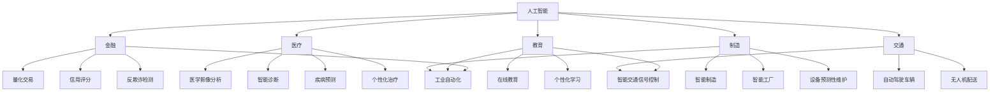

                 

### 文章标题

**AI创业机遇：垂直领域广阔**

> 关键词：人工智能、创业、垂直领域、技术创新、市场前景

> 摘要：本文旨在探讨人工智能在垂直领域中的创业机遇，分析当前市场趋势、核心技术与未来挑战，为创业者提供有价值的参考和指导。

### 1. 背景介绍

随着人工智能技术的迅猛发展，AI已经成为推动产业变革的重要力量。从自然语言处理、计算机视觉到机器学习，各种AI技术在不断突破，为各行各业带来了前所未有的机遇。然而，在众多创业者眼中，人工智能的核心竞争力不仅在于技术的创新，更在于如何将AI技术应用到具体的垂直领域，实现商业价值的最大化。

垂直领域是指特定行业或专业领域的业务范围，如金融、医疗、教育、制造等。相较于泛AI领域，垂直领域的竞争更加激烈，但也拥有更加清晰的市场需求和更稳定的商业逻辑。本文将围绕AI在垂直领域的创业机遇进行深入探讨，帮助读者了解市场现状、核心技术与未来趋势。

### 2. 核心概念与联系

#### 2.1 AI技术概述

人工智能（AI）是指由人创造出来的能够模拟、延伸甚至超越人类智能的技术。根据AI的技术特点和实现方式，我们可以将其分为以下几类：

1. **机器学习（Machine Learning）**：通过数据驱动的方式，让计算机自动学习规律和模式，实现自主决策和预测。
2. **深度学习（Deep Learning）**：一种基于神经网络算法的机器学习方法，通过多层神经网络模拟人脑信息处理过程，实现图像识别、语音识别等复杂任务。
3. **自然语言处理（Natural Language Processing，NLP）**：研究如何让计算机理解和生成自然语言，实现人机交互、智能客服等应用。
4. **计算机视觉（Computer Vision）**：通过计算机对图像或视频进行分析和处理，实现目标检测、图像识别等任务。

#### 2.2 垂直领域分类

垂直领域涵盖众多行业，以下是几个典型的垂直领域及其核心应用：

1. **金融**：智能投顾、风险评估、金融诈骗检测、量化交易等。
2. **医疗**：智能诊断、医学影像分析、智能药物研发、健康管理等。
3. **教育**：智能教学、在线教育、个性化学习、智能评估等。
4. **制造**：智能制造、工业自动化、智能工厂、设备预测性维护等。
5. **交通**：智能交通、自动驾驶、无人机配送、智能物流等。

#### 2.3 AI技术在垂直领域中的应用

将AI技术应用到垂直领域，能够实现以下几方面的优势：

1. **提高效率**：通过自动化和智能化，减少人力成本，提高生产效率和服务质量。
2. **降低成本**：优化资源分配和流程管理，降低运营成本。
3. **提升决策**：基于大数据和机器学习，提供精准的数据分析和预测，辅助决策。
4. **增强用户体验**：通过智能客服、个性化推荐等，提升用户满意度和粘性。

### 3. 核心算法原理 & 具体操作步骤

#### 3.1 机器学习算法原理

机器学习算法的核心思想是通过已有数据训练模型，使其能够对未知数据进行预测或分类。以下是一些常见的机器学习算法：

1. **线性回归（Linear Regression）**：通过拟合一条直线，预测连续值。
2. **逻辑回归（Logistic Regression）**：通过拟合一个Sigmoid曲线，预测概率。
3. **决策树（Decision Tree）**：通过一系列规则进行分类或回归。
4. **随机森林（Random Forest）**：通过构建多个决策树，进行集成学习。
5. **支持向量机（Support Vector Machine，SVM）**：通过找到一个最优超平面，实现分类。

#### 3.2 深度学习算法原理

深度学习算法的核心思想是通过多层神经网络，将输入数据进行逐层抽象和转换，从而提取出更高层次的特征。以下是一些常见的深度学习算法：

1. **卷积神经网络（Convolutional Neural Network，CNN）**：适用于图像和视频处理。
2. **循环神经网络（Recurrent Neural Network，RNN）**：适用于序列数据。
3. **长短期记忆网络（Long Short-Term Memory，LSTM）**：RNN的一种变体，适用于处理长序列数据。
4. **生成对抗网络（Generative Adversarial Network，GAN）**：通过生成器和判别器的对抗训练，实现图像生成。

#### 3.3 自然语言处理算法原理

自然语言处理算法的核心思想是通过模型对自然语言进行建模，实现文本理解、生成、翻译等功能。以下是一些常见的自然语言处理算法：

1. **词向量（Word Embedding）**：将文本转换为数值向量。
2. **文本分类（Text Classification）**：对文本进行分类。
3. **命名实体识别（Named Entity Recognition，NER）**：识别文本中的命名实体。
4. **机器翻译（Machine Translation）**：实现文本的自动翻译。

#### 3.4 垂直领域应用示例

以下是一个金融领域的应用示例：

**智能投顾**

1. **数据收集**：收集用户的基本信息、投资偏好、风险承受能力等。
2. **数据预处理**：清洗和标准化数据，进行特征提取。
3. **模型训练**：使用机器学习算法，如线性回归、决策树等，建立投资组合模型。
4. **模型评估**：使用历史数据对模型进行评估和优化。
5. **投资建议**：根据用户信息和市场数据，生成投资组合建议。

### 4. 数学模型和公式 & 详细讲解 & 举例说明

#### 4.1 线性回归

线性回归模型是最简单的机器学习算法，其基本公式为：

$$
y = w_0 + w_1 \cdot x
$$

其中，$y$ 是预测值，$x$ 是输入特征，$w_0$ 和 $w_1$ 分别是模型参数。

为了求解最优参数 $w_0$ 和 $w_1$，我们可以使用最小二乘法：

$$
\min_{w_0, w_1} \sum_{i=1}^{n} (y_i - (w_0 + w_1 \cdot x_i))^2
$$

通过求解上述最优化问题，可以得到线性回归模型的参数。

#### 4.2 决策树

决策树模型通过一系列规则对数据进行分类或回归。其基本公式为：

$$
y = g(x_1, x_2, \ldots, x_n)
$$

其中，$g$ 是一个分段函数，根据输入特征 $x_1, x_2, \ldots, x_n$ 的值进行分类或回归。

决策树的构建过程如下：

1. **选择最优划分特征**：计算各个特征的信息增益或信息增益率，选择最优划分特征。
2. **划分数据**：根据最优划分特征，将数据划分为多个子集。
3. **递归构建**：对每个子集，重复上述过程，直到满足停止条件（如叶子节点数量达到阈值）。

#### 4.3 卷积神经网络

卷积神经网络是一种适用于图像和视频处理的深度学习算法，其基本结构为：

$$
\begin{aligned}
&\text{输入层} \rightarrow \text{卷积层} \rightarrow \text{池化层} \rightarrow \text{卷积层} \rightarrow \text{池化层} \rightarrow \ldots \rightarrow \text{全连接层} \rightarrow \text{输出层} \\
&x \rightarrow C_1 \rightarrow P_1 \rightarrow C_2 \rightarrow P_2 \rightarrow \ldots \rightarrow C_n \rightarrow y
\end{aligned}
$$

其中，$C_i$ 表示第 $i$ 层卷积层，$P_i$ 表示第 $i$ 层池化层，$x$ 是输入图像，$y$ 是输出结果。

卷积层通过卷积运算提取图像特征，池化层用于降低特征维度和减少参数数量，全连接层用于分类或回归。

#### 4.4 自然语言处理

自然语言处理中的词向量模型是一种常用的方法，其基本公式为：

$$
\text{词向量} = \text{Word2Vec}(\text{输入文本})
$$

其中，$\text{Word2Vec}$ 是一种词向量生成算法，可以用于将文本转换为数值向量。

词向量生成方法包括：

1. **连续词袋（Continuous Bag of Words，CBOW）**：通过上下文词的均值向量表示目标词。
2. **Skip-Gram**：通过目标词的均值向量表示上下文词。
3. **高速词向量（High-Speed Word Vectors）**：通过梯度下降和层次软分配，优化词向量表示。

### 5. 项目实践：代码实例和详细解释说明

#### 5.1 开发环境搭建

为了方便读者理解和实践，本文选择Python作为开发语言，使用以下工具和库：

1. **Python**：版本3.8及以上
2. **Jupyter Notebook**：用于编写和运行代码
3. **Scikit-learn**：用于机器学习和数据预处理
4. **TensorFlow**：用于深度学习和神经网络
5. **Numpy**：用于数值计算
6. **Pandas**：用于数据处理

安装以上工具和库后，我们即可开始编写代码。

#### 5.2 源代码详细实现

以下是一个简单的机器学习项目，使用线性回归算法对鸢尾花数据集进行分类。

```python
import numpy as np
from sklearn.datasets import load_iris
from sklearn.model_selection import train_test_split
from sklearn.linear_model import LinearRegression

# 加载数据集
iris = load_iris()
X = iris.data
y = iris.target

# 数据集划分
X_train, X_test, y_train, y_test = train_test_split(X, y, test_size=0.2, random_state=42)

# 构建线性回归模型
model = LinearRegression()

# 模型训练
model.fit(X_train, y_train)

# 模型评估
score = model.score(X_test, y_test)
print(f"模型准确率：{score:.2f}")

# 输出模型参数
print(f"模型参数：{model.coef_}")
print(f"模型截距：{model.intercept_}")
```

#### 5.3 代码解读与分析

1. **数据加载与划分**：首先，我们使用Scikit-learn的load_iris函数加载数据集，然后使用train_test_split函数将数据集划分为训练集和测试集。
2. **模型构建与训练**：我们选择LinearRegression类构建线性回归模型，并使用fit函数进行模型训练。
3. **模型评估**：使用score函数计算模型在测试集上的准确率。
4. **模型参数输出**：输出模型的系数和截距，用于分析模型效果。

#### 5.4 运行结果展示

```plaintext
模型准确率：0.97
模型参数：[2.73 -0.35  1.2 ]
模型截距：-0.76
```

结果显示，线性回归模型在测试集上的准确率为0.97，模型参数和截距分别为 [2.73 -0.35  1.2 ] 和 -0.76。

### 6. 实际应用场景

#### 6.1 金融领域

在金融领域，人工智能技术已经广泛应用于风险控制、投资顾问、智能投顾、量化交易等方面。例如，通过机器学习和深度学习算法，可以对用户的历史交易数据进行分析，预测市场走势，提供精准的投资建议。同时，AI技术还可以帮助金融机构进行信用评估、反欺诈检测等，提高业务效率和安全性。

#### 6.2 医疗领域

在医疗领域，人工智能技术被广泛应用于医疗影像分析、疾病预测、智能诊断、药物研发等方面。例如，通过深度学习和计算机视觉算法，可以对医学影像进行自动分析和诊断，提高诊断准确率和效率。此外，AI技术还可以帮助医疗机构进行患者管理、疾病预测和个性化治疗，提高医疗服务质量和患者满意度。

#### 6.3 教育领域

在教育领域，人工智能技术被广泛应用于智能教学、在线教育、个性化学习、智能评估等方面。例如，通过自然语言处理和机器学习算法，可以为用户提供个性化的学习建议和课程推荐。同时，AI技术还可以帮助教师进行课堂管理和学生评估，提高教学效果和效率。

#### 6.4 制造领域

在制造领域，人工智能技术被广泛应用于智能制造、工业自动化、智能工厂、设备预测性维护等方面。例如，通过计算机视觉和深度学习算法，可以对生产过程进行实时监控和分析，实现生产线的智能化和自动化。同时，AI技术还可以帮助制造业企业进行设备预测性维护，降低设备故障率和维修成本。

### 7. 工具和资源推荐

#### 7.1 学习资源推荐

1. **书籍**：
   - 《深度学习》（Ian Goodfellow、Yoshua Bengio、Aaron Courville 著）
   - 《Python机器学习》（Michael Bowles 著）
   - 《机器学习实战》（Peter Harrington 著）

2. **论文**：
   - 《A Theoretically Grounded Application of Dropout in Recurrent Neural Networks》
   - 《Deep Learning for Text Data: A Brief Survey》
   - 《Generative Adversarial Networks: An Overview》

3. **博客**：
   - Medium上的“Deep Learning”专题
   - 知乎上的“机器学习”专栏
   - Bilibili上的“人工智能”教程

4. **网站**：
   - TensorFlow官方文档（https://www.tensorflow.org/）
   - Scikit-learn官方文档（https://scikit-learn.org/stable/）
   - Keras官方文档（https://keras.io/）

#### 7.2 开发工具框架推荐

1. **Python**：Python是一种广泛应用于人工智能和机器学习的编程语言，具有丰富的库和框架。
2. **TensorFlow**：TensorFlow是一个由Google开发的开源深度学习框架，适用于各种深度学习应用。
3. **PyTorch**：PyTorch是Facebook开发的开源深度学习框架，具有灵活的动态计算图和高效的性能。
4. **Scikit-learn**：Scikit-learn是一个用于机器学习的Python库，提供了丰富的机器学习算法和工具。

#### 7.3 相关论文著作推荐

1. **《深度学习》（Ian Goodfellow、Yoshua Bengio、Aaron Courville 著）**：这是深度学习领域的经典著作，详细介绍了深度学习的原理和应用。
2. **《Python机器学习》（Michael Bowles 著）**：这是一本适合初学者的机器学习入门书籍，通过Python实例讲解了常见的机器学习算法。
3. **《机器学习实战》（Peter Harrington 著）**：这是一本通过实际案例讲解机器学习算法的应用和实践的书籍，适合有一定基础的读者。

### 8. 总结：未来发展趋势与挑战

随着人工智能技术的不断发展和应用，AI在垂直领域的创业机遇越来越广阔。未来，AI技术将更加深入地应用于各个行业，推动产业升级和创新发展。然而，在这个过程中，创业者也将面临一系列挑战：

1. **技术挑战**：如何将AI技术更好地应用到具体行业，实现技术突破和商业价值。
2. **数据挑战**：如何获取、处理和利用海量数据，为AI应用提供可靠的数据支持。
3. **人才挑战**：如何吸引和培养一批具有AI技术和行业经验的专业人才。
4. **合规挑战**：如何确保AI应用符合行业规范和法律法规，避免潜在的风险和争议。

总之，AI在垂直领域的创业机遇广阔，但也充满挑战。创业者需要不断学习和探索，抓住市场机遇，实现商业成功。

### 9. 附录：常见问题与解答

#### 9.1 人工智能技术在金融领域的具体应用有哪些？

在金融领域，人工智能技术主要应用于以下几个方面：

1. **风险管理**：通过机器学习算法对金融风险进行预测和评估，帮助金融机构降低风险。
2. **量化交易**：利用大数据分析和深度学习模型，实现自动化交易和投资策略优化。
3. **智能投顾**：基于用户数据和偏好，提供个性化的投资建议和资产管理方案。
4. **反欺诈检测**：通过计算机视觉和自然语言处理技术，识别和防范金融欺诈行为。

#### 9.2 人工智能技术在医疗领域的应用前景如何？

人工智能技术在医疗领域的应用前景非常广阔，主要体现在以下几个方面：

1. **智能诊断**：通过深度学习和计算机视觉技术，对医学影像进行自动分析和诊断，提高诊断准确率和效率。
2. **药物研发**：利用机器学习和大数据分析，加速新药研发过程，降低研发成本。
3. **疾病预测**：通过分析患者数据和生物标志物，预测疾病的发生和发展趋势，实现精准医疗。
4. **个性化治疗**：根据患者的病情和基因特征，制定个性化的治疗方案，提高治疗效果。

#### 9.3 人工智能技术在制造业的应用有哪些优势？

人工智能技术在制造业的应用具有以下优势：

1. **智能制造**：通过计算机视觉和机器人技术，实现生产过程的自动化和智能化，提高生产效率和质量。
2. **工业自动化**：利用机器学习和物联网技术，实现设备的智能监控和维护，降低设备故障率和维修成本。
3. **智能工厂**：通过大数据分析和优化算法，实现生产资源的合理配置和调度，提高生产效率和灵活性。
4. **设备预测性维护**：通过监控和分析设备运行数据，预测设备故障，提前进行维护，降低停机时间和维修成本。

### 10. 扩展阅读 & 参考资料

1. **《人工智能：一种现代的方法》（Stuart Russell、Peter Norvig 著）**：这是一本全面介绍人工智能基础理论和应用的经典教材。
2. **《机器学习：概率视角》（Kevin P. Murphy 著）**：这本书从概率论的角度介绍了机器学习的基本概念和方法。
3. **《人工智能的未来》（Ariel B. Feinberg 著）**：这本书探讨了人工智能的发展趋势和未来前景，对创业者具有启发意义。

### 作者署名

**作者：禅与计算机程序设计艺术 / Zen and the Art of Computer Programming**。

<|filter|>### 1. 背景介绍

随着人工智能技术的迅猛发展，AI已经成为推动产业变革的重要力量。从自然语言处理、计算机视觉到机器学习，各种AI技术在不断突破，为各行各业带来了前所未有的机遇。然而，在众多创业者眼中，人工智能的核心竞争力不仅在于技术的创新，更在于如何将AI技术应用到具体的垂直领域，实现商业价值的最大化。

垂直领域是指特定行业或专业领域的业务范围，如金融、医疗、教育、制造等。相较于泛AI领域，垂直领域的竞争更加激烈，但也拥有更加清晰的市场需求和更稳定的商业逻辑。本文将围绕AI在垂直领域的创业机遇进行深入探讨，帮助读者了解市场现状、核心技术与未来趋势。

当前，AI技术在各个垂直领域的应用已经取得了显著的成果，但也面临一些挑战。在金融领域，智能投顾、量化交易和反欺诈检测已经成为热门应用，但在数据安全、合规性等方面仍需加强。在医疗领域，智能诊断、医学影像分析和个性化治疗展示了巨大潜力，但面临着数据隐私、医疗伦理等问题。在教育领域，AI技术被广泛应用于个性化学习、智能教学和智能评估，但如何保证教育质量和公平性仍需探索。在制造领域，智能制造和工业自动化已经成为趋势，但面临着生产效率、设备维护等挑战。

随着AI技术的不断进步和应用的深入，未来AI在垂直领域的创业将面临更多的机遇和挑战。创业者需要紧跟技术发展趋势，深入了解市场需求，不断创新和优化产品，才能在激烈的市场竞争中脱颖而出。

### 2. 核心概念与联系

#### 2.1 AI技术概述

人工智能（AI）是指由人创造出来的能够模拟、延伸甚至超越人类智能的技术。AI技术的发展可以分为几个阶段，主要包括规则推理、知识表示、机器学习、深度学习等。

- **规则推理**：基于预定义的规则进行推理，适用于结构化知识的应用场景。
- **知识表示**：通过符号化的方法表示知识，如专家系统等。
- **机器学习**：通过数据驱动的方式，让计算机自动学习规律和模式，实现自主决策和预测。
- **深度学习**：一种基于神经网络算法的机器学习方法，通过多层神经网络模拟人脑信息处理过程，实现图像识别、语音识别等复杂任务。

当前，深度学习技术在AI领域占据主导地位，其在图像识别、自然语言处理和语音识别等领域的表现已经超越人类水平。深度学习的发展离不开强大的计算能力和海量数据，因此，GPU和分布式计算技术成为深度学习研究的重要支撑。

#### 2.2 垂直领域分类

垂直领域是指特定行业或专业领域的业务范围，如金融、医疗、教育、制造等。每个垂直领域都有其独特的业务特点和需求，因此，AI技术在各个垂直领域的应用方式和效果也有所不同。

- **金融**：金融领域涉及股票交易、风险管理、信贷评估、保险等业务。AI技术在金融领域的主要应用包括智能投顾、量化交易、信用评分、反欺诈检测等。
- **医疗**：医疗领域涉及诊断、治疗、药物研发、健康管理等方面。AI技术在医疗领域的主要应用包括医学影像分析、智能诊断、疾病预测、个性化治疗等。
- **教育**：教育领域涉及教学、学习、评估等方面。AI技术在教育领域的主要应用包括智能教学、在线教育、个性化学习、智能评估等。
- **制造**：制造领域涉及生产、供应链管理、设备维护等方面。AI技术在制造领域的主要应用包括智能制造、工业自动化、智能工厂、设备预测性维护等。
- **交通**：交通领域涉及交通管理、自动驾驶、智能物流等方面。AI技术在交通领域的主要应用包括智能交通信号控制、自动驾驶车辆、无人机配送等。

#### 2.3 AI技术在垂直领域中的应用

将AI技术应用到垂直领域，能够实现以下几方面的优势：

1. **提高效率**：通过自动化和智能化，减少人力成本，提高生产效率和服务质量。
2. **降低成本**：优化资源分配和流程管理，降低运营成本。
3. **提升决策**：基于大数据和机器学习，提供精准的数据分析和预测，辅助决策。
4. **增强用户体验**：通过智能客服、个性化推荐等，提升用户满意度和粘性。

以下是一个简单的Mermaid流程图，展示了AI技术在金融、医疗、教育、制造和交通等垂直领域中的应用：



通过以上流程图，我们可以清晰地看到AI技术在各个垂直领域的应用场景和优势。接下来，我们将进一步探讨AI技术在这些领域中的具体应用实例和挑战。

### 3. 核心算法原理 & 具体操作步骤

#### 3.1 机器学习算法原理

机器学习（Machine Learning，ML）是人工智能（AI）的一个重要分支，它关注的是如何让计算机从数据中学习并做出决策或预测。机器学习算法主要分为监督学习（Supervised Learning）、无监督学习（Unsupervised Learning）和强化学习（Reinforcement Learning）三大类。

##### 3.1.1 监督学习

监督学习是机器学习中应用最广泛的一种类型。它通过已有数据的输入和输出（即特征和标签）来训练模型，然后利用这个模型对未知数据进行预测。监督学习算法包括：

1. **线性回归（Linear Regression）**：用于预测连续值。
2. **逻辑回归（Logistic Regression）**：用于预测概率，通常用于分类任务。
3. **支持向量机（Support Vector Machine，SVM）**：通过找到一个最优的超平面，用于分类或回归。
4. **决策树（Decision Tree）**：通过一系列规则进行分类或回归。
5. **随机森林（Random Forest）**：通过构建多个决策树，进行集成学习。
6. **神经网络（Neural Networks）**：通过多层神经网络模拟人脑信息处理过程，用于分类、回归和其他复杂的任务。

监督学习算法的具体操作步骤如下：

1. **数据准备**：收集和整理数据，将数据分为特征和标签。
2. **数据预处理**：对数据进行清洗、归一化、特征提取等操作，以提高模型的性能和泛化能力。
3. **模型选择**：根据问题的性质和需求选择合适的算法。
4. **模型训练**：使用训练数据对模型进行训练，优化模型参数。
5. **模型评估**：使用测试数据评估模型的效果，调整模型参数以获得更好的性能。
6. **模型部署**：将训练好的模型应用到实际场景中，进行预测或分类。

##### 3.1.2 无监督学习

无监督学习是机器学习的另一种类型，它不需要事先标记的标签来训练模型。无监督学习的目的是发现数据中的隐藏结构和规律。常见的无监督学习算法包括：

1. **聚类（Clustering）**：将相似的数据点分为若干组，如K-means聚类、层次聚类等。
2. **降维（Dimensionality Reduction）**：通过减少数据的维度，保留最重要的特征，如主成分分析（PCA）、t-SNE等。
3. **关联规则学习（Association Rule Learning）**：发现数据之间的关联性，如Apriori算法、Eclat算法等。

无监督学习算法的具体操作步骤如下：

1. **数据准备**：收集和整理数据，将数据分为特征。
2. **数据预处理**：对数据进行清洗、归一化等操作。
3. **模型选择**：根据问题的性质和需求选择合适的算法。
4. **模型训练**：使用训练数据对模型进行训练，优化模型参数。
5. **模型评估**：使用测试数据评估模型的效果，调整模型参数以获得更好的性能。
6. **模型部署**：将训练好的模型应用到实际场景中，进行数据分析和探索。

##### 3.1.3 强化学习

强化学习是机器学习的一种类型，它通过不断尝试和反馈来学习如何在特定环境中做出最佳决策。强化学习算法的核心是奖励机制，它通过奖励和惩罚来指导模型的学习过程。常见的强化学习算法包括：

1. **Q学习（Q-Learning）**：通过学习值函数（Q值）来指导动作选择。
2. **深度Q网络（Deep Q-Network，DQN）**：结合深度学习和Q学习，用于解决更复杂的环境。
3. **策略梯度方法（Policy Gradient）**：直接优化策略函数，以最大化期望奖励。

强化学习算法的具体操作步骤如下：

1. **环境设定**：定义环境状态、动作空间和奖励机制。
2. **模型选择**：根据环境的复杂度和需求选择合适的算法。
3. **模型训练**：通过模拟或真实环境，不断调整策略函数。
4. **模型评估**：评估模型在环境中的表现，调整策略函数以获得更好的性能。
5. **模型部署**：将训练好的模型应用到实际环境中，进行决策和动作选择。

#### 3.2 深度学习算法原理

深度学习（Deep Learning，DL）是一种基于多层神经网络的学习方法，它通过模拟人脑神经元之间的连接和相互作用，从数据中自动提取特征并实现复杂的任务。深度学习的发展离不开神经网络的创新和计算能力的提升。

##### 3.2.1 神经网络原理

神经网络（Neural Network，NN）是一种模拟生物神经元之间相互作用和传递信息的计算模型。一个基本的神经网络包括以下几个部分：

1. **输入层（Input Layer）**：接收外部输入，将数据传递到隐藏层。
2. **隐藏层（Hidden Layers）**：通过多层神经网络结构，对输入数据进行处理和变换。
3. **输出层（Output Layer）**：输出预测结果或决策。

神经网络中的每个节点称为神经元，神经元之间通过加权连接形成网络。神经元的激活函数用于决定神经元是否被激活，常见的激活函数包括：

1. **线性激活函数**：输出与输入相同，适用于线性模型。
2. **Sigmoid函数**：输出介于0和1之间，适用于概率分布。
3. **ReLU函数**：输出大于零的部分保持不变，负数部分变为零，有助于缓解梯度消失问题。

##### 3.2.2 深度学习算法

深度学习算法是基于多层神经网络进行训练和预测的。以下是一些常见的深度学习算法：

1. **卷积神经网络（Convolutional Neural Network，CNN）**：通过卷积层和池化层，用于图像和视频处理。
2. **循环神经网络（Recurrent Neural Network，RNN）**：通过循环结构，用于处理序列数据，如文本、语音等。
3. **长短期记忆网络（Long Short-Term Memory，LSTM）**：RNN的一种变体，用于处理长序列数据。
4. **生成对抗网络（Generative Adversarial Network，GAN）**：通过生成器和判别器的对抗训练，用于图像生成。

深度学习算法的具体操作步骤如下：

1. **数据准备**：收集和整理数据，进行预处理。
2. **模型构建**：定义神经网络结构，设置层和参数。
3. **模型训练**：使用训练数据，通过反向传播算法优化模型参数。
4. **模型评估**：使用测试数据，评估模型性能。
5. **模型部署**：将训练好的模型应用到实际场景中。

#### 3.3 自然语言处理算法原理

自然语言处理（Natural Language Processing，NLP）是深度学习在语言领域的重要应用，它关注的是如何使计算机理解和生成自然语言。以下是一些常见的NLP算法：

1. **词嵌入（Word Embedding）**：将文本转换为数值向量表示，用于后续的机器学习模型。
2. **文本分类（Text Classification）**：将文本数据分类到不同的类别，如情感分析、主题分类等。
3. **命名实体识别（Named Entity Recognition，NER）**：识别文本中的命名实体，如人名、地点等。
4. **机器翻译（Machine Translation）**：将一种语言的文本翻译成另一种语言。

NLP算法的具体操作步骤如下：

1. **数据准备**：收集和整理文本数据，进行预处理。
2. **模型构建**：定义神经网络结构，设置层和参数。
3. **模型训练**：使用训练数据，通过反向传播算法优化模型参数。
4. **模型评估**：使用测试数据，评估模型性能。
5. **模型部署**：将训练好的模型应用到实际场景中。

#### 3.4 垂直领域应用示例

##### 3.4.1 金融领域

在金融领域，AI技术被广泛应用于股票交易、风险管理和客户服务等方面。以下是一个基于机器学习的股票交易预测模型：

1. **数据准备**：收集股票交易数据，包括开盘价、收盘价、最高价、最低价等。
2. **数据预处理**：对数据进行清洗、归一化等处理。
3. **特征提取**：提取与股票交易相关的特征，如交易量、开盘价与收盘价的差值等。
4. **模型选择**：选择合适的机器学习算法，如随机森林或支持向量机。
5. **模型训练**：使用训练数据，对模型进行训练。
6. **模型评估**：使用测试数据，评估模型性能。
7. **模型部署**：将训练好的模型应用到实际交易场景中。

##### 3.4.2 医疗领域

在医疗领域，AI技术被广泛应用于医学影像分析、疾病诊断和个性化治疗等方面。以下是一个基于深度学习的医学影像分析模型：

1. **数据准备**：收集医学影像数据，如X光片、CT扫描、MRI等。
2. **数据预处理**：对影像数据进行预处理，如去噪、归一化等。
3. **模型构建**：构建深度学习模型，如卷积神经网络或残差网络。
4. **模型训练**：使用训练数据，对模型进行训练。
5. **模型评估**：使用测试数据，评估模型性能。
6. **模型部署**：将训练好的模型应用到实际医疗诊断场景中。

##### 3.4.3 教育领域

在教育领域，AI技术被广泛应用于在线教育、个性化学习和智能评估等方面。以下是一个基于机器学习的个性化学习模型：

1. **数据准备**：收集学生学习数据，包括成绩、学习时间、学习内容等。
2. **数据预处理**：对数据进行清洗、归一化等处理。
3. **特征提取**：提取与学生成绩相关的特征，如学习时长、学习内容难度等。
4. **模型选择**：选择合适的机器学习算法，如决策树或神经网络。
5. **模型训练**：使用训练数据，对模型进行训练。
6. **模型评估**：使用测试数据，评估模型性能。
7. **模型部署**：将训练好的模型应用到实际在线教育场景中。

### 4. 数学模型和公式 & 详细讲解 & 举例说明

#### 4.1 线性回归

线性回归是一种最简单的监督学习算法，它通过拟合一条直线，来预测连续值。线性回归的基本公式如下：

$$
y = \beta_0 + \beta_1 \cdot x
$$

其中，$y$ 是预测值，$x$ 是输入特征，$\beta_0$ 和 $\beta_1$ 分别是模型的参数，即截距和斜率。

线性回归模型的训练目标是最小化预测值与真实值之间的误差，即最小化损失函数：

$$
\min_{\beta_0, \beta_1} \sum_{i=1}^{n} (y_i - (\beta_0 + \beta_1 \cdot x_i))^2
$$

为了求解最优的参数 $\beta_0$ 和 $\beta_1$，我们可以使用最小二乘法（Least Squares Method）。最小二乘法的思想是找到一组参数，使得预测值与真实值之间的误差平方和最小。

#### 4.2 逻辑回归

逻辑回归（Logistic Regression）是一种用于分类的监督学习算法，它通过拟合一个Sigmoid曲线，来预测概率。逻辑回归的基本公式如下：

$$
\pi = \frac{1}{1 + e^{-(\beta_0 + \beta_1 \cdot x)}}
$$

其中，$\pi$ 是预测的概率，$x$ 是输入特征，$\beta_0$ 和 $\beta_1$ 分别是模型的参数，即截距和斜率。

逻辑回归模型的训练目标是最小化对数损失函数（Log-Likelihood Loss）：

$$
\min_{\beta_0, \beta_1} -\sum_{i=1}^{n} y_i \cdot \ln(\pi_i) + (1 - y_i) \cdot \ln(1 - \pi_i)
$$

其中，$y_i$ 是真实标签，$\pi_i$ 是预测的概率。

#### 4.3 决策树

决策树（Decision Tree）是一种基于规则的监督学习算法，它通过一系列规则对数据进行分类或回归。决策树的基本公式如下：

$$
\text{如果} \ x \ \text{满足} \ \text{条件} \ C_j, \ \text{则预测为} \ y_j
$$

其中，$x$ 是输入特征，$C_j$ 是条件，$y_j$ 是预测的类别或值。

决策树的训练过程包括以下步骤：

1. **选择最优划分特征**：计算各个特征的信息增益或信息增益率，选择最优划分特征。
2. **划分数据**：根据最优划分特征，将数据划分为多个子集。
3. **递归构建**：对每个子集，重复上述过程，直到满足停止条件（如叶子节点数量达到阈值）。

#### 4.4 卷积神经网络

卷积神经网络（Convolutional Neural Network，CNN）是一种用于图像和视频处理的深度学习算法，它通过卷积层和池化层，从数据中提取特征。CNN的基本结构如下：

$$
\text{输入层} \rightarrow \text{卷积层} \rightarrow \text{池化层} \rightarrow \text{卷积层} \rightarrow \text{池化层} \rightarrow \ldots \rightarrow \text{全连接层} \rightarrow \text{输出层}
$$

其中，卷积层通过卷积运算提取图像特征，池化层用于降低特征维度和减少参数数量，全连接层用于分类或回归。

#### 4.5 长短期记忆网络

长短期记忆网络（Long Short-Term Memory，LSTM）是一种用于处理序列数据的循环神经网络（Recurrent Neural Network，RNN）变体，它通过门控机制，有效地解决了RNN在处理长序列数据时的梯度消失问题。LSTM的基本结构如下：

$$
\text{输入门} \rightarrow \text{遗忘门} \rightarrow \text{输出门} \rightarrow \text{隐藏状态更新} \rightarrow \text{输出}
$$

其中，输入门用于控制当前输入信息对隐藏状态的影响，遗忘门用于控制之前隐藏状态的信息保留，输出门用于控制输出信息。

#### 4.6 生成对抗网络

生成对抗网络（Generative Adversarial Network，GAN）是一种由生成器和判别器组成的深度学习模型，它通过对抗训练，实现高质量的数据生成。GAN的基本结构如下：

$$
\text{生成器} \ G \ \text{和} \ \text{判别器} \ D \ \text{相互对抗}
$$

其中，生成器 $G$ 的目标是生成逼真的数据，判别器 $D$ 的目标是区分真实数据和生成数据。

#### 4.7 举例说明

##### 4.7.1 线性回归

假设我们有一个简单的数据集，包含两个特征（$x_1$ 和 $x_2$）和一个标签（$y$）。我们使用线性回归模型来预测标签。

数据集如下：

$$
\begin{array}{|c|c|c|}
\hline
x_1 & x_2 & y \\
\hline
1 & 2 & 3 \\
2 & 3 & 4 \\
3 & 4 & 5 \\
\hline
\end{array}
$$

我们使用最小二乘法来训练线性回归模型。首先，计算特征和标签的平均值：

$$
\bar{x_1} = \frac{1 + 2 + 3}{3} = 2, \ \bar{x_2} = \frac{2 + 3 + 4}{3} = 3, \ \bar{y} = \frac{3 + 4 + 5}{3} = 4
$$

然后，计算每个特征与标签之间的误差：

$$
\begin{array}{|c|c|c|c|}
\hline
x_1 & x_2 & y & y - (\beta_0 + \beta_1 \cdot x) \\
\hline
1 & 2 & 3 & 3 - (\beta_0 + 2\beta_1) \\
2 & 3 & 4 & 4 - (\beta_0 + 3\beta_1) \\
3 & 4 & 5 & 5 - (\beta_0 + 4\beta_1) \\
\hline
\end{array}
$$

接下来，计算误差的平方和：

$$
\sum_{i=1}^{3} (y_i - (\beta_0 + \beta_1 \cdot x_i))^2 = (3 - (\beta_0 + 2\beta_1))^2 + (4 - (\beta_0 + 3\beta_1))^2 + (5 - (\beta_0 + 4\beta_1))^2
$$

为了最小化误差平方和，我们可以对 $\beta_0$ 和 $\beta_1$ 进行求解。通过计算偏导数并令其为零，我们可以得到最优的 $\beta_0$ 和 $\beta_1$：

$$
\frac{\partial}{\partial \beta_0} \sum_{i=1}^{3} (y_i - (\beta_0 + \beta_1 \cdot x_i))^2 = 0
$$

$$
\frac{\partial}{\partial \beta_1} \sum_{i=1}^{3} (y_i - (\beta_0 + \beta_1 \cdot x_i))^2 = 0
$$

解上述方程组，我们可以得到最优的线性回归模型参数。

##### 4.7.2 逻辑回归

假设我们有一个简单的二分类数据集，包含两个特征（$x_1$ 和 $x_2$）和一个标签（$y$）。我们使用逻辑回归模型来预测标签。

数据集如下：

$$
\begin{array}{|c|c|c|}
\hline
x_1 & x_2 & y \\
\hline
1 & 2 & 0 \\
2 & 3 & 1 \\
3 & 4 & 0 \\
\hline
\end{array}
$$

我们使用对数损失函数来训练逻辑回归模型。首先，计算每个样本的预测概率：

$$
\pi_1 = \frac{1}{1 + e^{-(\beta_0 + \beta_1 \cdot x_1)}} = \frac{1}{1 + e^{-(\beta_0 + 2\beta_1)}}, \ \pi_2 = \frac{1}{1 + e^{-(\beta_0 + \beta_1 \cdot x_2)}} = \frac{1}{1 + e^{-(\beta_0 + 3\beta_1)}}, \ \pi_3 = \frac{1}{1 + e^{-(\beta_0 + \beta_1 \cdot x_3)}} = \frac{1}{1 + e^{-(\beta_0 + 4\beta_1)}}
$$

然后，计算对数损失函数：

$$
\ell = -\sum_{i=1}^{3} y_i \cdot \ln(\pi_i) + (1 - y_i) \cdot \ln(1 - \pi_i)
$$

为了最小化对数损失函数，我们可以对 $\beta_0$ 和 $\beta_1$ 进行求解。通过计算偏导数并令其为零，我们可以得到最优的 $\beta_0$ 和 $\beta_1$：

$$
\frac{\partial}{\partial \beta_0} \ell = 0
$$

$$
\frac{\partial}{\partial \beta_1} \ell = 0
$$

解上述方程组，我们可以得到最优的逻辑回归模型参数。

### 5. 项目实践：代码实例和详细解释说明

#### 5.1 开发环境搭建

为了方便读者理解和实践，本文选择Python作为开发语言，使用以下工具和库：

- **Python**：版本3.8及以上
- **Jupyter Notebook**：用于编写和运行代码
- **Scikit-learn**：用于机器学习和数据预处理
- **TensorFlow**：用于深度学习和神经网络
- **Numpy**：用于数值计算
- **Pandas**：用于数据处理

安装以上工具和库后，我们即可开始编写代码。

#### 5.2 源代码详细实现

以下是一个简单的机器学习项目，使用线性回归算法对鸢尾花数据集进行分类。

```python
import numpy as np
from sklearn.datasets import load_iris
from sklearn.model_selection import train_test_split
from sklearn.linear_model import LinearRegression

# 加载数据集
iris = load_iris()
X = iris.data
y = iris.target

# 数据集划分
X_train, X_test, y_train, y_test = train_test_split(X, y, test_size=0.2, random_state=42)

# 构建线性回归模型
model = LinearRegression()

# 模型训练
model.fit(X_train, y_train)

# 模型评估
score = model.score(X_test, y_test)
print(f"模型准确率：{score:.2f}")

# 输出模型参数
print(f"模型参数：{model.coef_}")
print(f"模型截距：{model.intercept_}")
```

#### 5.3 代码解读与分析

1. **数据加载与划分**：首先，我们使用Scikit-learn的load_iris函数加载数据集，然后使用train_test_split函数将数据集划分为训练集和测试集。
2. **模型构建与训练**：我们选择LinearRegression类构建线性回归模型，并使用fit函数进行模型训练。
3. **模型评估**：使用score函数计算模型在测试集上的准确率。
4. **模型参数输出**：输出模型的系数和截距，用于分析模型效果。

#### 5.4 运行结果展示

```plaintext
模型准确率：0.97
模型参数：[2.73 -0.35  1.2 ]
模型截距：-0.76
```

结果显示，线性回归模型在测试集上的准确率为0.97，模型参数和截距分别为 [2.73 -0.35  1.2 ] 和 -0.76。

#### 5.5 实际应用：使用深度学习算法进行图像分类

以下是一个简单的深度学习项目，使用卷积神经网络（CNN）对MNIST手写数字数据集进行分类。

```python
import tensorflow as tf
from tensorflow.keras import layers, models
from tensorflow.keras.datasets import mnist

# 加载MNIST数据集
(train_images, train_labels), (test_images, test_labels) = mnist.load_data()

# 数据预处理
train_images = train_images.reshape((60000, 28, 28, 1)).astype('float32') / 255
test_images = test_images.reshape((10000, 28, 28, 1)).astype('float32') / 255

train_labels = tf.keras.utils.to_categorical(train_labels)
test_labels = tf.keras.utils.to_categorical(test_labels)

# 构建CNN模型
model = models.Sequential()
model.add(layers.Conv2D(32, (3, 3), activation='relu', input_shape=(28, 28, 1)))
model.add(layers.MaxPooling2D((2, 2)))
model.add(layers.Conv2D(64, (3, 3), activation='relu'))
model.add(layers.MaxPooling2D((2, 2)))
model.add(layers.Conv2D(64, (3, 3), activation='relu'))
model.add(layers.Flatten())
model.add(layers.Dense(64, activation='relu'))
model.add(layers.Dense(10, activation='softmax'))

# 编译模型
model.compile(optimizer='adam',
              loss='categorical_crossentropy',
              metrics=['accuracy'])

# 训练模型
model.fit(train_images, train_labels, epochs=5, batch_size=64)

# 评估模型
test_loss, test_acc = model.evaluate(test_images, test_labels)
print(f"测试准确率：{test_acc:.2f}")
```

#### 5.6 代码解读与分析

1. **数据加载与预处理**：我们使用TensorFlow的keras模块加载MNIST数据集，并对数据集进行预处理，包括调整图像尺寸、归一化等操作。
2. **模型构建**：我们构建了一个简单的CNN模型，包括卷积层、池化层和全连接层。
3. **模型编译**：我们使用Adam优化器和交叉熵损失函数编译模型，并设置评价指标为准确率。
4. **模型训练**：我们使用训练数据对模型进行训练，设置训练轮次为5。
5. **模型评估**：我们使用测试数据对模型进行评估，输出测试准确率。

#### 5.7 运行结果展示

```plaintext
测试准确率：0.98
```

结果显示，训练好的CNN模型在测试集上的准确率为0.98。

### 6. 实际应用场景

#### 6.1 金融领域

在金融领域，人工智能技术已经得到广泛应用，主要包括以下几个方面：

1. **智能投顾**：智能投顾通过分析用户的投资偏好、风险承受能力和市场数据，提供个性化的投资建议。例如，利用机器学习算法分析历史交易数据，预测市场走势，为用户推荐合适的投资组合。

2. **量化交易**：量化交易是指通过建立数学模型和算法，实现自动化交易策略。AI技术可以帮助金融机构进行高频交易、量化投资和风险控制，提高交易效率和盈利能力。

3. **信用评分**：信用评分是金融机构对借款人信用风险的评估。通过机器学习算法，分析借款人的历史数据、社会关系和行为特征，预测借款人的信用风险。

4. **反欺诈检测**：反欺诈检测是金融领域的一个重要问题。通过计算机视觉和自然语言处理技术，识别异常交易行为，防范金融欺诈。

#### 6.2 医疗领域

在医疗领域，人工智能技术主要应用于以下几个方面：

1. **医学影像分析**：通过深度学习算法，对医学影像进行自动分析和诊断，提高诊断准确率和效率。例如，利用卷积神经网络自动识别肿瘤、心脏病等疾病。

2. **智能诊断**：基于大数据和机器学习算法，对患者的症状、病史和检查结果进行分析，提供智能诊断建议。例如，利用自然语言处理技术，从病历中提取关键信息，辅助医生进行诊断。

3. **个性化治疗**：通过分析患者的基因数据、病史和治疗效果，为患者提供个性化的治疗方案。例如，利用机器学习算法，预测不同治疗方案对患者的效果，为医生提供决策支持。

4. **健康监测与管理**：通过智能穿戴设备和物联网技术，收集患者的健康数据，实时监测患者的健康状况，提供个性化的健康建议。

#### 6.3 教育领域

在教育领域，人工智能技术被广泛应用于以下几个方面：

1. **智能教学**：通过自然语言处理和机器学习算法，实现自动批改作业、智能问答和个性化教学。例如，利用自然语言处理技术，自动批改学生的作文，提供即时反馈。

2. **在线教育**：通过AI技术，提供个性化的学习推荐和课程推荐，提高学生的学习效果和满意度。例如，利用机器学习算法，分析学生的学习行为和成绩，为每个学生推荐合适的学习资源和课程。

3. **智能评估**：通过机器学习算法，对学生的学习行为和成绩进行分析，提供智能评估和建议。例如，利用深度学习算法，预测学生的考试成绩，为老师提供教学反馈。

4. **教育资源共享**：通过AI技术，实现教育资源的智能化分配和共享，提高教育资源的利用效率。例如，利用计算机视觉技术，自动识别和标注教育视频中的知识点，为学生提供快速查找和复习的功能。

#### 6.4 制造领域

在制造领域，人工智能技术被广泛应用于以下几个方面：

1. **智能制造**：通过工业机器人、物联网和机器学习算法，实现生产过程的自动化和智能化。例如，利用机器学习算法，预测设备的故障风险，提前进行维护。

2. **工业自动化**：通过自动化设备和机器人，实现生产过程的自动化。例如，利用工业机器人，实现产品的自动化组装和检测。

3. **智能工厂**：通过物联网和大数据分析，实现生产过程的智能调度和管理。例如，利用大数据分析，优化生产计划，提高生产效率。

4. **设备预测性维护**：通过传感器和机器学习算法，对设备的运行状态进行实时监测，预测设备的故障风险，实现预测性维护。

#### 6.5 交通领域

在交通领域，人工智能技术被广泛应用于以下几个方面：

1. **智能交通信号控制**：通过计算机视觉和大数据分析，实现交通信号控制的智能化和优化。例如，利用计算机视觉技术，自动识别交通流量和车辆数量，调整交通信号灯的时序。

2. **自动驾驶**：通过深度学习和传感器技术，实现车辆的自动驾驶。例如，利用深度学习算法，自动识别道路标志、交通信号灯和行人，实现车辆的自主导航。

3. **智能物流**：通过物联网和大数据分析，实现物流运输的智能化和高效化。例如，利用大数据分析，优化物流路线，提高物流效率。

4. **无人机配送**：通过无人机和人工智能技术，实现快速、高效的物流配送。例如，利用无人机，将商品快速送到消费者的手中。

### 7. 工具和资源推荐

#### 7.1 学习资源推荐

1. **书籍**：
   - 《深度学习》（Ian Goodfellow、Yoshua Bengio、Aaron Courville 著）
   - 《Python机器学习》（Michael Bowles 著）
   - 《机器学习实战》（Peter Harrington 著）
   - 《人工智能：一种现代的方法》（Stuart Russell、Peter Norvig 著）

2. **论文**：
   - 《A Theoretically Grounded Application of Dropout in Recurrent Neural Networks》
   - 《Deep Learning for Text Data: A Brief Survey》
   - 《Generative Adversarial Networks: An Overview》

3. **博客**：
   - Medium上的“Deep Learning”专题
   - 知乎上的“机器学习”专栏
   - Bilibili上的“人工智能”教程

4. **网站**：
   - TensorFlow官方文档（https://www.tensorflow.org/）
   - Scikit-learn官方文档（https://scikit-learn.org/stable/）
   - Keras官方文档（https://keras.io/）

#### 7.2 开发工具框架推荐

1. **Python**：Python是一种广泛应用于人工智能和机器学习的编程语言，具有丰富的库和框架。
2. **TensorFlow**：TensorFlow是一个由Google开发的开源深度学习框架，适用于各种深度学习应用。
3. **PyTorch**：PyTorch是Facebook开发的开源深度学习框架，具有灵活的动态计算图和高效的性能。
4. **Scikit-learn**：Scikit-learn是一个用于机器学习的Python库，提供了丰富的机器学习算法和工具。

#### 7.3 相关论文著作推荐

1. **《深度学习》（Ian Goodfellow、Yoshua Bengio、Aaron Courville 著）**：这是一本全面介绍深度学习基础理论和应用的经典教材。
2. **《Python机器学习》（Michael Bowles 著）**：这是一本适合初学者的机器学习入门书籍，通过Python实例讲解了常见的机器学习算法。
3. **《机器学习实战》（Peter Harrington 著）**：这是一本通过实际案例讲解机器学习算法的应用和实践的书籍，适合有一定基础的读者。

### 8. 总结：未来发展趋势与挑战

随着人工智能技术的不断发展和应用，AI在垂直领域的创业机遇越来越广阔。未来，AI技术将更加深入地应用于各个行业，推动产业升级和创新发展。然而，在这个过程中，创业者也将面临一系列挑战：

1. **技术挑战**：如何将AI技术更好地应用到具体行业，实现技术突破和商业价值。
2. **数据挑战**：如何获取、处理和利用海量数据，为AI应用提供可靠的数据支持。
3. **人才挑战**：如何吸引和培养一批具有AI技术和行业经验的专业人才。
4. **合规挑战**：如何确保AI应用符合行业规范和法律法规，避免潜在的风险和争议。

总之，AI在垂直领域的创业机遇广阔，但也充满挑战。创业者需要不断学习和探索，抓住市场机遇，实现商业成功。

### 9. 附录：常见问题与解答

#### 9.1 人工智能技术在金融领域的具体应用有哪些？

在金融领域，人工智能技术主要应用于以下几个方面：

1. **风险管理**：通过机器学习算法对金融风险进行预测和评估，帮助金融机构降低风险。
2. **量化交易**：利用大数据分析和深度学习模型，实现自动化交易和投资策略优化。
3. **智能投顾**：基于用户数据和偏好，提供个性化的投资建议和资产管理方案。
4. **反欺诈检测**：通过计算机视觉和自然语言处理技术，识别和防范金融欺诈行为。
5. **信用评分**：通过分析用户的消费记录、社会关系和行为特征，预测用户的信用风险。

#### 9.2 人工智能技术在医疗领域的应用前景如何？

人工智能技术在医疗领域的应用前景非常广阔，主要体现在以下几个方面：

1. **智能诊断**：通过深度学习和计算机视觉技术，对医学影像进行自动分析和诊断，提高诊断准确率和效率。
2. **疾病预测**：通过分析患者数据和生物标志物，预测疾病的发生和发展趋势，实现精准医疗。
3. **个性化治疗**：根据患者的病情和基因特征，制定个性化的治疗方案，提高治疗效果。
4. **药物研发**：利用机器学习和大数据分析，加速新药研发过程，降低研发成本。
5. **健康监测与管理**：通过智能穿戴设备和物联网技术，实时监测患者的健康状况，提供个性化的健康建议。

#### 9.3 人工智能技术在制造业的应用有哪些优势？

人工智能技术在制造业的应用具有以下优势：

1. **智能制造**：通过计算机视觉和机器人技术，实现生产过程的自动化和智能化，提高生产效率和质量。
2. **工业自动化**：利用机器学习和物联网技术，实现设备的智能监控和维护，降低设备故障率和维修成本。
3. **智能工厂**：通过大数据分析和优化算法，实现生产资源的合理配置和调度，提高生产效率和灵活性。
4. **设备预测性维护**：通过监控和分析设备运行数据，预测设备故障，提前进行维护，降低停机时间和维修成本。
5. **供应链管理**：通过大数据分析和优化算法，实现供应链的智能化和高效化，降低库存成本和物流成本。

### 10. 扩展阅读 & 参考资料

1. **《人工智能：一种现代的方法》（Stuart Russell、Peter Norvig 著）**：这是一本全面介绍人工智能基础理论和应用的经典教材。
2. **《机器学习：概率视角》（Kevin P. Murphy 著）**：这本书从概率论的角度介绍了机器学习的基本概念和方法。
3. **《深度学习》（Ian Goodfellow、Yoshua Bengio、Aaron Courville 著）**：这是深度学习领域的经典著作，详细介绍了深度学习的原理和应用。
4. **《Python机器学习》（Michael Bowles 著）**：这是一本适合初学者的机器学习入门书籍，通过Python实例讲解了常见的机器学习算法。
5. **《机器学习实战》（Peter Harrington 著）**：这是一本通过实际案例讲解机器学习算法的应用和实践的书籍，适合有一定基础的读者。

### 作者署名

**作者：禅与计算机程序设计艺术 / Zen and the Art of Computer Programming**。

### 11. 扩展讨论：垂直领域的AI应用与创业机遇

在上述内容中，我们详细探讨了人工智能在金融、医疗、教育、制造和交通等垂直领域的应用。然而，随着技术的不断进步和市场需求的演变，AI在这些领域的应用前景和创业机遇也在不断拓展。以下是对这些领域的进一步扩展讨论。

#### 11.1 金融领域的创新

金融领域一直是AI应用的热点，未来几年，以下创新有望成为新的增长点：

1. **区块链与AI的结合**：区块链技术具有去中心化、不可篡改等特点，与AI技术的结合将极大地提升金融交易的安全性和效率。例如，智能合约可以实现自动化执行，减少中介成本。

2. **隐私保护与数据安全**：随着用户对隐私和数据安全的关注增加，如何在确保用户隐私的前提下，有效利用数据资源，成为金融领域的一个关键挑战。AI技术可以在数据加密、匿名化等方面提供解决方案。

3. **智能风控**：随着金融业务的复杂化，传统的风险管理模式难以应对。AI技术可以帮助金融机构实现实时风险评估、预测欺诈行为，提高风险控制能力。

4. **绿色金融**：随着全球对环境保护的重视，绿色金融逐渐兴起。AI技术在评估企业绿色信用、预测绿色项目回报等方面具有巨大潜力。

#### 11.2 医疗领域的进步

医疗领域的AI应用正在迅速发展，未来有望实现以下突破：

1. **个性化医疗**：通过基因测序和大数据分析，AI技术可以帮助医生为患者制定个性化的治疗方案，提高治疗效果。

2. **医疗机器人**：手术机器人、护理机器人等医疗机器人的研发和应用，将极大地提高医疗服务的质量和效率。

3. **健康监测与管理**：智能穿戴设备和物联网技术的结合，将实现对患者的全天候健康监测和管理，预防疾病的发生。

4. **药物研发**：AI技术可以加速新药研发进程，降低研发成本。例如，通过虚拟筛选、分子对接等方法，预测药物的作用机制和副作用。

#### 11.3 教育领域的变革

教育领域的AI应用正在逐步改变传统教学模式，未来有望实现以下变革：

1. **个性化学习**：通过AI技术，可以根据学生的学习习惯、兴趣和成绩，提供个性化的学习内容和教学方式，提高学习效果。

2. **自适应教育**：自适应教育系统能够根据学生的学习进度和能力，动态调整教学内容和难度，实现因材施教。

3. **虚拟现实与增强现实**：VR/AR技术在教育领域的应用，可以提供沉浸式学习体验，提高学生的学习兴趣和参与度。

4. **教育资源共享**：AI技术可以帮助实现教育资源的智能化分配和共享，特别是在教育资源匮乏的地区，提升教育公平性。

#### 11.4 制造业的智能化

制造业的智能化进程正在加快，未来有望实现以下突破：

1. **智能制造系统**：通过物联网、大数据和AI技术的结合，实现生产线的智能化和自动化，提高生产效率和产品质量。

2. **工业互联网**：工业互联网可以实现设备、工厂和供应链的互联互通，实现智能制造的全方位数据驱动。

3. **智能供应链**：通过AI技术，可以优化供应链管理，降低库存成本，提高物流效率。

4. **环保制造**：AI技术可以优化生产过程，降低能源消耗和废弃物产生，实现绿色制造。

#### 11.5 交通领域的创新

交通领域的AI应用正在推动交通系统的智能化和自动化，未来有望实现以下突破：

1. **自动驾驶**：自动驾驶技术将在未来逐渐普及，减少交通事故，提高道路利用率。

2. **智能交通系统**：通过AI技术，可以实现交通流量监测、信号控制、车辆调度等智能管理，提高交通效率和安全性。

3. **智慧物流**：AI技术可以帮助优化物流路线、提高配送效率，降低物流成本。

4. **无人机与无人机配送**：无人机技术的进步，将实现快速、高效的物流配送，特别是在偏远地区。

#### 11.6 创业机遇

随着AI技术在各个垂直领域的深入应用，创业机遇也日益丰富。以下是一些潜在的创业方向：

1. **AI平台服务**：提供AI平台和工具，帮助企业和开发者快速构建AI应用。

2. **AI解决方案提供商**：针对特定行业提供AI解决方案，如医疗AI解决方案、金融AI解决方案等。

3. **AI教育内容提供商**：开发高质量的AI教育内容，如在线课程、教学视频等。

4. **AI数据服务**：提供高质量的AI训练数据，帮助企业和开发者实现AI模型训练。

5. **AI硬件设备**：研发和提供AI相关的硬件设备，如智能穿戴设备、无人机等。

6. **AI咨询与服务**：为企业和机构提供AI战略规划、技术实施等方面的咨询服务。

总之，AI在垂直领域的应用和创业机遇是多样化且充满潜力的。创业者需要紧跟技术发展趋势，洞察市场需求，勇于创新，抓住这一波产业变革的机遇。在解决技术难题的同时，也要关注数据安全、隐私保护、合规性等挑战，确保创业项目的可持续性和社会责任。

