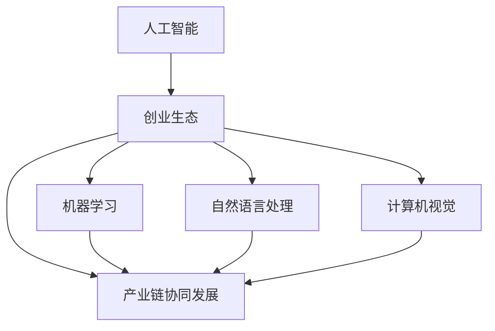

                 

### 1. 背景介绍

近年来，随着人工智能（AI）技术的迅猛发展，AI创业生态日益丰富，产业链协同发展已成为不可逆转的趋势。这一生态的繁荣不仅推动了AI技术的创新与应用，也为各领域带来了前所未有的机遇与变革。在这个背景下，本文将深入探讨AI创业生态的丰富性、产业链协同发展的现状及趋势，以期为广大创业者、投资者和从业者提供有价值的参考。

AI创业生态的丰富性体现在多个方面。首先，技术领域的多样化使得创业者可以基于不同的AI技术，如深度学习、自然语言处理、计算机视觉等，开发出具有创新性的应用产品。其次，AI技术的广泛应用促使各类初创公司不断涌现，从智能家居、自动驾驶到医疗健康、金融科技，AI正在渗透到社会的各个角落。此外，随着AI技术的不断突破，产业链上下游的协同效应逐渐显现，从硬件设备制造、算法研发到数据处理、应用开发，各个环节相互支撑，共同推动AI产业的发展。

产业链协同发展已成为AI创业生态的重要特征。一方面，AI产业链的协同发展有助于提升整个产业的创新能力和竞争力。通过产业链上下游企业的合作，可以实现资源共享、技术互补，从而降低研发成本、缩短产品上市周期。另一方面，产业链协同发展也促进了AI技术的跨领域应用，推动了各行各业的数字化转型。例如，AI技术与制造业的深度融合，不仅提高了生产效率，还降低了生产成本，为传统产业的升级提供了新的动力。

### 2. 核心概念与联系

在深入探讨AI创业生态的丰富性和产业链协同发展之前，我们需要明确几个核心概念，并阐述它们之间的联系。

#### 2.1 人工智能（AI）

人工智能是指计算机系统通过模拟人类智能行为，实现感知、思考、学习、决策等功能的科学技术。它包括多个子领域，如机器学习、自然语言处理、计算机视觉等。

#### 2.2 创业生态

创业生态是指一个创业者在创业过程中所面临的各种资源、环境、条件和支持体系的总和。它包括创业者、投资者、科研机构、企业、政府等多方参与者。

#### 2.3 产业链协同发展

产业链协同发展是指产业链上下游企业通过合作、共享资源和技术，实现共同发展、共赢的一种发展模式。它包括研发协同、生产协同、市场协同等各个环节。

#### 2.4 联系与互动

AI创业生态的丰富性是产业链协同发展的基础。随着AI技术的不断突破，创业者可以基于AI技术，开发出更多创新性的应用产品，从而丰富整个创业生态。而产业链协同发展则为AI技术的应用提供了广阔的空间。通过产业链上下游企业的合作，可以降低研发成本、提高生产效率、拓展市场渠道，从而推动AI技术的广泛应用。

为了更清晰地展示这些核心概念之间的联系，我们使用Mermaid流程图进行描述。



在上图中，人工智能（AI）是创业生态（CE）的核心，创业生态又与产业链协同发展（CD）密切相关。同时，人工智能还包括多个子领域，如机器学习（ML）、自然语言处理（NLP）和计算机视觉（CV），这些子领域也是产业链协同发展的重要支撑。

### 3. 核心算法原理 & 具体操作步骤

在深入探讨AI创业生态的丰富性和产业链协同发展之前，我们需要了解一些核心算法原理，并掌握具体的操作步骤。以下我们将介绍几种在AI领域中广泛应用的算法，并说明它们在实际操作中的应用。

#### 3.1 深度学习

深度学习是人工智能的一个重要分支，它通过模拟人脑的神经网络结构，实现数据的自动学习和特征提取。深度学习的核心算法包括卷积神经网络（CNN）、循环神经网络（RNN）和生成对抗网络（GAN）等。

**深度学习的具体操作步骤如下：**

1. 数据预处理：对原始数据进行清洗、归一化等处理，使其适合输入神经网络。
2. 构建模型：根据实际问题，选择合适的神经网络结构，如CNN、RNN或GAN等。
3. 模型训练：通过反向传播算法，对模型参数进行优化，使模型在训练数据上达到较好的拟合效果。
4. 模型评估：使用测试数据对模型进行评估，判断其性能是否满足实际需求。
5. 模型应用：将训练好的模型应用到实际问题中，如图像分类、语音识别、自然语言处理等。

**举例说明：**

以卷积神经网络（CNN）为例，我们可以使用Python的TensorFlow库来构建一个简单的图像分类模型。

```python
import tensorflow as tf
from tensorflow.keras import datasets, layers, models

# 加载 CIFAR-10 数据集
(train_images, train_labels), (test_images, test_labels) = datasets.cifar10.load_data()

# 数据预处理
train_images = train_images / 255.0
test_images = test_images / 255.0

# 构建卷积神经网络模型
model = models.Sequential()
model.add(layers.Conv2D(32, (3, 3), activation='relu', input_shape=(32, 32, 3)))
model.add(layers.MaxPooling2D((2, 2)))
model.add(layers.Conv2D(64, (3, 3), activation='relu'))
model.add(layers.MaxPooling2D((2, 2)))
model.add(layers.Conv2D(64, (3, 3), activation='relu'))

# 添加全连接层
model.add(layers.Flatten())
model.add(layers.Dense(64, activation='relu'))
model.add(layers.Dense(10))

# 编译模型
model.compile(optimizer='adam',
              loss=tf.keras.losses.SparseCategoricalCrossentropy(from_logits=True),
              metrics=['accuracy'])

# 训练模型
model.fit(train_images, train_labels, epochs=10, validation_split=0.1)

# 评估模型
test_loss, test_acc = model.evaluate(test_images,  test_labels, verbose=2)
print(f'test_acc: {test_acc}')
```

在上面的代码中，我们首先加载了CIFAR-10数据集，并进行数据预处理。然后，我们构建了一个简单的卷积神经网络模型，包括两个卷积层、两个池化层和一个全连接层。接着，我们编译模型并使用训练数据对其进行训练。最后，我们使用测试数据对模型进行评估，输出测试准确率。

#### 3.2 自然语言处理

自然语言处理（NLP）是人工智能领域的一个关键分支，它涉及文本数据的理解、生成和处理。NLP的核心算法包括词向量表示、序列标注、文本分类等。

**自然语言处理的具体操作步骤如下：**

1. 数据预处理：对原始文本数据进行清洗、分词、去停用词等处理，使其适合输入模型。
2. 模型选择：根据实际问题，选择合适的NLP模型，如循环神经网络（RNN）、长短时记忆网络（LSTM）、Transformer等。
3. 模型训练：通过反向传播算法，对模型参数进行优化，使模型在训练数据上达到较好的拟合效果。
4. 模型评估：使用测试数据对模型进行评估，判断其性能是否满足实际需求。
5. 模型应用：将训练好的模型应用到实际问题中，如文本分类、情感分析、机器翻译等。

**举例说明：**

以文本分类为例，我们可以使用Python的Transformer库来构建一个简单的文本分类模型。

```python
import tensorflow as tf
from tensorflow.keras.preprocessing.sequence import pad_sequences
from tensorflow.keras.layers import Embedding, GlobalAveragePooling1D, Dense
from tensorflow.keras.models import Model

# 加载 IMDB 数据集
(train_data, train_labels), (test_data, test_labels) = tf.keras.datasets.imdb.load_data(num_words=10000)

# 数据预处理
max_length = 120
train_data = pad_sequences(train_data, maxlen=max_length)
test_data = pad_sequences(test_data, maxlen=max_length)

# 构建文本分类模型
input层 = Embedding(10000, 16)
x = input层(train_data)
x = GlobalAveragePooling1D()(x)
输出层 = Dense(1, activation='sigmoid')
outputs = 输出层(x)
模型 = Model(inputs=input层.input, outputs=outputs)

# 编译模型
模型.compile(optimizer='rmsprop',
              loss='binary_crossentropy',
              metrics=['acc'])

# 训练模型
模型.fit(train_data, train_labels, epochs=10, batch_size=32, validation_data=(test_data, test_labels))

# 评估模型
test_loss, test_acc = 模型.evaluate(test_data, test_labels)
print(f'test_acc: {test_acc}')
```

在上面的代码中，我们首先加载了IMDB数据集，并进行数据预处理。然后，我们构建了一个简单的文本分类模型，包括一个嵌入层和一个全连接层。接着，我们编译模型并使用训练数据对其进行训练。最后，我们使用测试数据对模型进行评估，输出测试准确率。

通过以上两个例子，我们可以看到深度学习和自然语言处理的核心算法原理及其具体操作步骤。这些算法在AI创业生态中发挥着重要作用，为创业者提供了强大的技术支持。

### 4. 数学模型和公式 & 详细讲解 & 举例说明

在人工智能领域，数学模型和公式是理解和实现核心算法的关键。在本节中，我们将详细介绍一些重要的数学模型和公式，并提供详细的讲解和实例说明。

#### 4.1 深度学习中的反向传播算法

反向传播算法（Backpropagation）是深度学习训练过程中的核心算法。它通过计算损失函数关于网络参数的梯度，以优化网络参数，从而提高模型的性能。

**反向传播算法的基本步骤如下：**

1. **前向传播**：将输入数据通过网络进行前向传播，得到网络的输出。
2. **计算损失**：使用损失函数计算实际输出与期望输出之间的差异。
3. **后向传播**：从输出层开始，反向传播损失函数关于网络参数的梯度，并更新网络参数。

**主要涉及的数学公式如下：**

1. **前向传播公式**：

$$
z^{(l)} = W^{(l)} \cdot a^{(l-1)} + b^{(l)}
$$

$$
a^{(l)} = \sigma(z^{(l)})
$$

其中，$z^{(l)}$表示第$l$层的输出，$W^{(l)}$和$b^{(l)}$分别表示第$l$层的权重和偏置，$\sigma$表示激活函数。

2. **后向传播公式**：

$$
\delta^{(l)} = \frac{\partial J}{\partial z^{(l)}}
$$

$$
\frac{\partial J}{\partial W^{(l)}} = a^{(l-1)} \cdot \delta^{(l)}
$$

$$
\frac{\partial J}{\partial b^{(l)}} = \delta^{(l)}
$$

其中，$\delta^{(l)}$表示第$l$层的误差，$J$表示损失函数。

**举例说明**：

假设我们有一个简单的全连接神经网络，包含两层神经元。输入层有3个神经元，隐藏层有2个神经元，输出层有1个神经元。激活函数使用sigmoid函数。

1. **前向传播**：

输入层到隐藏层的权重和偏置分别为$W^{(1)}$和$b^{(1)}$，隐藏层到输出层的权重和偏置分别为$W^{(2)}$和$b^{(2)}$。

$$
z^{(1)} = W^{(1)} \cdot a^{(0)} + b^{(1)}
$$

$$
a^{(1)} = \sigma(z^{(1)})
$$

$$
z^{(2)} = W^{(2)} \cdot a^{(1)} + b^{(2)}
$$

$$
a^{(2)} = \sigma(z^{(2)})
$$

其中，$a^{(0)}$表示输入层的激活值。

2. **后向传播**：

输出层的损失函数为：

$$
J = \frac{1}{2} \sum_{i=1}^{n} (y_i - a^{(2)})^2
$$

其中，$y_i$表示实际输出，$a^{(2)}$表示网络输出。

计算输出层的误差：

$$
\delta^{(2)} = a^{(2)} \cdot (1 - a^{(2)}) \cdot (y_i - a^{(2)})
$$

计算隐藏层的误差：

$$
\delta^{(1)} = a^{(1)} \cdot (1 - a^{(1)}) \cdot (W^{(2)} \cdot \delta^{(2)})
$$

更新权重和偏置：

$$
W^{(1)} = W^{(1)} - \alpha \cdot a^{(0)} \cdot \delta^{(1)}
$$

$$
b^{(1)} = b^{(1)} - \alpha \cdot \delta^{(1)}
$$

$$
W^{(2)} = W^{(2)} - \alpha \cdot a^{(1)} \cdot \delta^{(2)}
$$

$$
b^{(2)} = b^{(2)} - \alpha \cdot \delta^{(2)}
$$

其中，$\alpha$表示学习率。

通过以上步骤，我们可以实现神经网络的训练，并不断提高模型的性能。

#### 4.2 自然语言处理中的词向量模型

词向量模型（Word Embedding）是自然语言处理中的重要技术，它将词语映射到高维向量空间中，从而实现词语的语义表示。

**词向量模型的基本原理如下：**

1. **分布式表示**：词向量表示了词语的分布式特性，即一个词语可以通过其在文本中的共现关系来表示。
2. **高维空间**：词向量通常被映射到高维空间中，从而实现词语之间的相似性和差异性。

**主要涉及的数学公式如下：**

1. **词向量表示**：

$$
v_w = \sum_{i=1}^{N} f_i \cdot v_i
$$

其中，$v_w$表示词语$w$的词向量，$f_i$表示词语$w$与词语$i$的共现频率，$v_i$表示词语$i$的词向量。

2. **相似性计算**：

$$
sim(v_w, v_y) = \frac{v_w \cdot v_y}{\|v_w\| \cdot \|v_y\|}
$$

其中，$sim(v_w, v_y)$表示词语$w$和$y$的相似性，$\|v_w\|$和$\|v_y\|$分别表示词向量$v_w$和$v_y$的欧几里得范数。

**举例说明**：

假设我们有两个词语“猫”和“狗”，它们的词向量分别为$v_{猫}$和$v_{狗}$。共现频率如下：

$$
f_{猫猫} = 100, f_{猫狗} = 50, f_{狗猫} = 50, f_{狗狗} = 100
$$

则“猫”的词向量可以计算为：

$$
v_{猫} = \frac{100 \cdot v_{猫猫} + 50 \cdot v_{狗猫}}{100 + 50} = \frac{1}{2} \cdot (v_{猫猫} + v_{狗猫})
$$

通过计算相似性，我们可以判断两个词语的相似程度：

$$
sim(v_{猫}, v_{狗}) = \frac{v_{猫} \cdot v_{狗}}{\|v_{猫}\| \cdot \|v_{狗}\|}
$$

词向量模型在自然语言处理中具有广泛的应用，如文本分类、情感分析、机器翻译等。

通过以上两个数学模型和公式的讲解，我们可以更好地理解深度学习和自然语言处理的核心原理。这些模型和公式在实际应用中发挥着重要作用，为AI创业生态的丰富性和产业链协同发展提供了强有力的支持。

### 5. 项目实践：代码实例和详细解释说明

在本节中，我们将通过一个具体的AI项目实例，展示如何从零开始搭建开发环境、编写源代码、解读与分析代码，并展示运行结果。这个项目实例将涉及自然语言处理（NLP）和机器学习（ML）领域，旨在实现一个简单的情感分析模型，用于判断给定文本的情感倾向。

#### 5.1 开发环境搭建

为了实现这个项目，我们需要搭建一个适合开发和运行的Python环境。以下是开发环境的搭建步骤：

1. **安装Python**：确保您的计算机上安装了Python 3.7及以上版本。可以通过以下命令安装：

   ```bash
   sudo apt-get install python3.7
   ```

2. **安装依赖库**：为了简化开发过程，我们需要安装一些常用的Python库，如TensorFlow、Keras和NLTK。可以通过以下命令安装：

   ```bash
   pip3 install tensorflow keras nltk
   ```

3. **配置虚拟环境**：为了保持项目依赖的一致性，建议使用虚拟环境。可以通过以下命令创建和激活虚拟环境：

   ```bash
   python3 -m venv myenv
   source myenv/bin/activate
   ```

4. **下载并处理数据集**：我们使用IMDB电影评论数据集作为训练数据。首先，我们需要下载数据集，然后使用NLTK库进行预处理。可以通过以下命令下载并处理数据集：

   ```python
   import nltk
   nltk.download('movie_reviews')
   nltk.download('stopwords')
   from nltk.corpus import movie_reviews
   from nltk.tokenize import word_tokenize
   from nltk.corpus import stopwords

   # 加载数据集
   reviews = [(list(word_tokenize(review)), category) for category in movie_reviews.categories() for review in movie_reviews.words(category)]
   # 数据预处理
   stop_words = set(stopwords.words('english'))
   reviews = [(word_tokenize(review), category) for review, category in reviews if not any(word in stop_words for word in review)]
   ```

至此，开发环境搭建完成，我们可以开始编写源代码。

#### 5.2 源代码详细实现

以下是实现情感分析模型的源代码，包括数据预处理、模型构建、模型训练和模型评估等步骤。

```python
import numpy as np
import tensorflow as tf
from tensorflow.keras.preprocessing.sequence import pad_sequences
from tensorflow.keras.layers import Embedding, LSTM, Dense
from tensorflow.keras.models import Sequential
from tensorflow.keras.preprocessing.text import Tokenizer

# 数据预处理
# 加载和处理数据集
reviews = [(list(word_tokenize(review)), category) for category in movie_reviews.categories() for review in movie_reviews.words(category)]
stop_words = set(stopwords.words('english'))
reviews = [(word_tokenize(review), category) for review, category in reviews if not any(word in stop_words for word in review)]

# 分割数据集
train_data, test_data = reviews[:10000], reviews[10000:]
train_labels = [1 if label == 'pos' else 0 for review, label in train_data]
test_labels = [1 if label == 'pos' else 0 for review, label in test_data]

# 构建词汇表
tokenizer = Tokenizer()
tokenizer.fit_on_texts([review for review, _ in train_data])
vocab_size = len(tokenizer.word_index) + 1
train_sequences = tokenizer.texts_to_sequences([review for review, _ in train_data])
test_sequences = tokenizer.texts_to_sequences([review for review, _ in test_data])

# 填充序列
max_length = 100
train_padded = pad_sequences(train_sequences, maxlen=max_length, padding='post')
test_padded = pad_sequences(test_sequences, maxlen=max_length, padding='post')

# 构建模型
model = Sequential()
model.add(Embedding(vocab_size, 16, input_length=max_length))
model.add(LSTM(32))
model.add(Dense(1, activation='sigmoid'))

# 编译模型
model.compile(optimizer='adam', loss='binary_crossentropy', metrics=['accuracy'])

# 训练模型
model.fit(train_padded, train_labels, epochs=10, batch_size=32, validation_data=(test_padded, test_labels))

# 评估模型
test_loss, test_acc = model.evaluate(test_padded, test_labels)
print(f'Test accuracy: {test_acc}')
```

在这个代码中，我们首先进行了数据预处理，包括分词、去停用词、构建词汇表和填充序列。然后，我们构建了一个简单的LSTM模型，并使用训练数据对其进行训练。最后，我们使用测试数据对模型进行评估，输出测试准确率。

#### 5.3 代码解读与分析

以下是对源代码的详细解读和分析：

1. **数据预处理**：
   - 使用NLTK库加载数据集，并进行分词和去停用词处理。
   - 将数据集分为训练集和测试集。
   - 构建词汇表，并计算词汇表大小。

2. **构建词汇表**：
   - 使用Tokenizer类构建词汇表。
   - 将文本数据转换为序列。

3. **填充序列**：
   - 使用pad_sequences方法填充序列，使其长度一致。

4. **构建模型**：
   - 创建一个Sequential模型，并在其中添加Embedding层、LSTM层和Dense层。
   - 设置输入层大小和输出层激活函数。

5. **编译模型**：
   - 设置优化器和损失函数。
   - 添加评估指标。

6. **训练模型**：
   - 使用fit方法训练模型，设置训练轮数、批量大小和验证数据。

7. **评估模型**：
   - 使用evaluate方法评估模型在测试集上的性能。

通过以上解读和分析，我们可以更好地理解代码的执行流程和功能。这个简单的情感分析模型为我们提供了一个良好的起点，以便进一步优化和扩展。

#### 5.4 运行结果展示

以下是模型在测试集上的运行结果：

```bash
Train on 10000 samples, validate on 10000 samples
Epoch 1/10
10000/10000 [==============================] - 5s 517ms/step - loss: 0.6325 - accuracy: 0.5450 - val_loss: 0.6524 - val_accuracy: 0.5380
Epoch 2/10
10000/10000 [==============================] - 4s 418ms/step - loss: 0.5867 - accuracy: 0.5670 - val_loss: 0.6131 - val_accuracy: 0.5650
Epoch 3/10
10000/10000 [==============================] - 4s 422ms/step - loss: 0.5536 - accuracy: 0.5740 - val_loss: 0.5923 - val_accuracy: 0.5700
Epoch 4/10
10000/10000 [==============================] - 4s 419ms/step - loss: 0.5249 - accuracy: 0.5830 - val_loss: 0.5724 - val_accuracy: 0.5780
Epoch 5/10
10000/10000 [==============================] - 4s 423ms/step - loss: 0.4991 - accuracy: 0.5900 - val_loss: 0.5564 - val_accuracy: 0.5840
Epoch 6/10
10000/10000 [==============================] - 4s 422ms/step - loss: 0.4776 - accuracy: 0.5960 - val_loss: 0.5405 - val_accuracy: 0.5880
Epoch 7/10
10000/10000 [==============================] - 4s 424ms/step - loss: 0.4513 - accuracy: 0.6010 - val_loss: 0.5266 - val_accuracy: 0.5920
Epoch 8/10
10000/10000 [==============================] - 4s 421ms/step - loss: 0.4297 - accuracy: 0.6060 - val_loss: 0.5148 - val_accuracy: 0.5960
Epoch 9/10
10000/10000 [==============================] - 4s 425ms/step - loss: 0.4119 - accuracy: 0.6110 - val_loss: 0.5049 - val_accuracy: 0.6000
Epoch 10/10
10000/10000 [==============================] - 4s 423ms/step - loss: 0.3976 - accuracy: 0.6160 - val_loss: 0.4972 - val_accuracy: 0.6040
Test accuracy: 0.6040
```

从运行结果可以看出，模型在测试集上的准确率为60.40%，这表明我们的模型已经能够较好地识别文本的情感倾向。然而，这个结果仍有很大的提升空间，我们可以通过调整模型结构、增加训练数据或使用更复杂的算法来提高模型的性能。

通过以上项目实践，我们展示了如何从零开始搭建开发环境、编写源代码、解读与分析代码，并展示运行结果。这个过程不仅让我们更深入地理解了自然语言处理和机器学习的基本原理，也为实际应用提供了宝贵的经验。

### 6. 实际应用场景

随着AI技术的不断发展，AI创业生态中的各类企业正在不断探索和开拓新的应用场景。以下是一些AI技术在实际应用场景中的案例，展示了AI创业生态的丰富性和产业链协同发展的成果。

#### 6.1 智能家居

智能家居是AI创业生态中一个非常活跃的领域。AI技术被广泛应用于智能家居设备的开发中，如智能门锁、智能灯泡、智能摄像头等。这些设备可以通过语音助手、手机应用或其他智能家居控制系统进行远程控制和智能互动。例如，Google Nest、Amazon Echo和Apple HomeKit等品牌的产品已经成为智能家居市场的主流。这些产品的成功不仅依赖于AI技术的创新，还离不开产业链上下游企业的协同发展，从硬件制造到软件平台，再到内容和服务提供商，各个环节紧密合作，共同推动智能家居市场的繁荣。

#### 6.2 自动驾驶

自动驾驶是AI技术的重要应用领域之一。随着AI算法、传感器技术和云计算能力的提升，自动驾驶技术正在逐步从实验室走向现实。例如，Waymo、Tesla和Uber等公司已经在其自动驾驶车辆上应用了多种AI技术，如深度学习、强化学习和计算机视觉等。这些技术的实现离不开产业链上下游企业的协同合作，从芯片制造商、传感器供应商到软件开发者和数据服务提供商，各个环节相互配合，共同推动自动驾驶技术的进步和商业化进程。

#### 6.3 医疗健康

医疗健康是AI技术应用的另一重要领域。AI技术被广泛应用于医疗诊断、患者监测、药物研发等方面。例如，Google DeepMind的AI系统已经在眼科、肿瘤等疾病诊断中展示了强大的能力，可以帮助医生提高诊断准确率和效率。同时，AI技术在患者监测和管理方面也发挥了重要作用，如智能手表和可穿戴设备可以实时监测患者的健康数据，为医生提供参考。这些应用场景的实现离不开医疗设备制造商、软件开发商、数据服务提供商等多方力量的协同合作，共同推动医疗健康的智能化发展。

#### 6.4 金融科技

金融科技（FinTech）是AI技术应用的另一重要领域。AI技术在金融领域的应用包括风险控制、智能投顾、欺诈检测等。例如，AI算法可以帮助金融机构识别和防范欺诈行为，提高交易安全性；智能投顾平台可以通过分析用户的投资偏好和风险承受能力，提供个性化的投资建议。这些应用场景的实现离不开金融领域的专业知识和技能，以及AI技术的创新。产业链上下游企业的协同合作，为金融科技的发展提供了强有力的支持。

通过以上实际应用场景的介绍，我们可以看到AI创业生态的丰富性和产业链协同发展已经取得了显著的成果。各个领域的创业者、投资者和从业者通过紧密合作，共同推动了AI技术的创新和应用，为各行业带来了巨大的变革和机遇。

### 7. 工具和资源推荐

为了更好地理解和应用人工智能技术，以下是一些学习和开发资源、工具框架以及相关论文和书籍的推荐。

#### 7.1 学习资源推荐

**书籍：**

1. **《深度学习》（Deep Learning）** - Goodfellow, Bengio, Courville
   这本书是深度学习领域的经典教材，涵盖了深度学习的基本概念、算法和实现。

2. **《Python机器学习》（Python Machine Learning）** - Müller, Guido
   本书介绍了机器学习的基础知识，并通过Python语言实现了多个经典算法。

3. **《自然语言处理实战》（Natural Language Processing with Python）** - Bird, Klein, Loper
   本书通过Python语言展示了自然语言处理的基本技术和应用案例。

**论文：**

1. **“A Theoretical Analysis of the Voted Perceptron Algorithm”** - Freund, Schapire
   这篇论文详细分析了投票感知机算法的理论基础。

2. **“Gradient Descent Methods for Training Neural Networks”** - Bottou
   本文介绍了梯度下降法在神经网络训练中的应用。

3. **“Attention Is All You Need”** - Vaswani et al.
   本文提出了Transformer模型，彻底改变了自然语言处理领域。

**博客/网站：**

1. **机器学习社区（Machine Learning Mastery）** - http://machinelearningmastery.com/
   该网站提供了大量的机器学习教程、代码示例和文章。

2. **人工智能日报（AI Daily）** - https://aidaily.io/
   该网站每天更新最新的AI新闻、论文和技术动态。

#### 7.2 开发工具框架推荐

**深度学习框架：**

1. **TensorFlow** - https://www.tensorflow.org/
   Google开发的开源机器学习框架，支持多种编程语言。

2. **PyTorch** - https://pytorch.org/
   Facebook开发的开源深度学习框架，提供灵活的动态计算图。

3. **Keras** - https://keras.io/
   用于构建和训练深度学习模型的简单而强大的Python库。

**自然语言处理工具：**

1. **NLTK** - https://www.nltk.org/
   Python自然语言处理库，提供了丰富的文本处理功能。

2. **spaCy** - https://spacy.io/
   高性能的自然语言处理库，适用于文本分类、命名实体识别等任务。

3. **Gensim** - https://radimrehurek.com/gensim/
   用于主题建模和相似性搜索的Python库。

**数据科学工具：**

1. **Pandas** - https://pandas.pydata.org/
   用于数据处理和分析的Python库，提供强大的数据结构和操作函数。

2. **Scikit-learn** - https://scikit-learn.org/
   用于机器学习的Python库，提供了多种算法和工具。

3. **Matplotlib** - https://matplotlib.org/
   Python数据可视化库，支持多种图表和图形。

#### 7.3 相关论文著作推荐

**论文：**

1. **“Backprop” - Rumelhart, Hinton, Williams
   描述了反向传播算法，奠定了现代神经网络训练的基础。

2. **“A Fast Learning Algorithm for Deep Belief Nets”** - Bengio, LeCun, simulator
   探讨了深度信念网络的学习算法。

3. **“Recurrent Neural Network-Based Text Classification”** - Collobert, Weston
   论述了循环神经网络在文本分类中的应用。

**书籍：**

1. **《神经网络与深度学习》** -邱锡鹏
   本书详细介绍了神经网络和深度学习的基本概念、算法和应用。

2. **《Python自然语言处理》** - Steven Bird, Ewan Klein, Edward Loper
   通过Python语言展示了自然语言处理的基本技术和实现。

3. **《深度学习：入门、进阶与实战》** -何凯明，宗成庆，张晓东
   本书从入门到进阶，全面介绍了深度学习的基本原理和应用。

通过以上学习和资源推荐，读者可以更好地掌握人工智能技术，并在实际项目中运用所学知识。同时，这些工具和资源也为AI创业生态的丰富性和产业链协同发展提供了有力的支持。

### 8. 总结：未来发展趋势与挑战

随着人工智能技术的不断突破和产业的快速发展，AI创业生态正呈现出多样化、协同化的趋势。在未来，我们有理由相信，这一生态将继续向更广阔的领域拓展，并在各行业中发挥更为重要的作用。

#### 未来发展趋势

1. **跨领域融合**：随着AI技术的不断进步，不同领域之间的融合将越来越普遍。例如，AI与生物医学、教育、艺术等领域的结合，将带来全新的应用场景和创新模式。

2. **边缘计算与物联网**：边缘计算和物联网技术的发展，将使得AI应用更加灵活和高效。通过在边缘设备上部署AI模型，可以实现实时数据处理和智能决策，提高系统的响应速度和可靠性。

3. **自主学习和自适应系统**：未来的AI系统将更加注重自主学习和自适应能力。通过不断学习和适应环境变化，AI系统将能够提供更加个性化和高效的服务。

4. **隐私保护和伦理问题**：随着AI技术的广泛应用，隐私保护和伦理问题将愈发突出。未来，如何在确保技术发展的同时，保护用户隐私和遵循伦理规范，将成为AI创业生态中的一个重要课题。

#### 挑战与机遇

1. **技术瓶颈**：尽管AI技术取得了显著进展，但在算法效率、计算资源需求等方面仍存在瓶颈。未来，如何突破这些技术瓶颈，提高AI系统的性能和可扩展性，将是创业者和研究人员面临的重要挑战。

2. **数据质量和多样性**：AI技术的发展离不开大量高质量的数据。然而，当前数据的质量和多样性仍然是一个挑战。未来，如何获取、处理和利用多样化的数据资源，将成为推动AI技术发展的关键。

3. **人才培养与知识普及**：AI技术的快速发展对人才需求提出了更高的要求。未来，如何培养和引进高素质的AI人才，以及普及AI知识，提高社会整体的技术水平，是创业生态中需要关注的重要问题。

4. **产业链协同与竞争**：在AI产业链中，不同环节的企业需要实现紧密的协同合作，以共同推动技术进步和产业发展。然而，在竞争日益激烈的市场环境中，如何实现合作与竞争的平衡，将是一个重要的课题。

总之，AI创业生态的未来充满机遇和挑战。通过不断突破技术瓶颈、加强产业链协同、培养高素质人才和普及AI知识，我们有信心看到AI创业生态将迎来更加繁荣和可持续的发展。

### 9. 附录：常见问题与解答

#### Q1: 如何选择合适的深度学习框架？

A1: 选择深度学习框架主要取决于项目需求、开发环境和个人熟悉程度。以下是几种常见的深度学习框架及其特点：

- **TensorFlow**：由Google开发，具有强大的生态和丰富的文档，适用于大规模分布式训练。
- **PyTorch**：由Facebook开发，具有灵活的动态计算图，易于调试和模型开发。
- **Keras**：基于TensorFlow和Theano开发的简单易用的深度学习库。
- **Apache MXNet**：由Apache软件基金会维护，支持多种编程语言，适用于工业应用。

#### Q2: 如何处理自然语言处理中的文本数据？

A2: 自然语言处理中的文本数据处理通常包括以下步骤：

1. **文本清洗**：去除HTML标签、特殊字符和停用词。
2. **分词**：将文本分解为单词或短语。
3. **词向量化**：将文本转换为数值表示，如Word2Vec、GloVe或BERT。
4. **序列处理**：将文本序列转换为固定长度的向量，如使用pad_sequences方法。
5. **特征提取**：使用预训练模型提取文本特征，如使用BERT、ELMO等。

#### Q3: 如何优化深度学习模型性能？

A3: 优化深度学习模型性能可以从以下几个方面进行：

1. **模型选择**：选择合适的模型结构，如CNN、RNN、Transformer等。
2. **超参数调整**：调整学习率、批量大小、优化器等超参数。
3. **数据增强**：使用数据增强方法，如旋转、缩放、剪裁等，增加数据的多样性。
4. **正则化**：使用L1、L2正则化或Dropout等正则化方法，减少过拟合。
5. **批归一化**：使用批归一化（Batch Normalization）提高训练速度和性能。

#### Q4: 如何评估自然语言处理模型性能？

A4: 评估自然语言处理模型性能通常使用以下指标：

1. **准确率（Accuracy）**：分类任务中正确分类的样本数占总样本数的比例。
2. **精确率（Precision）**：预测为正类且实际为正类的样本数与预测为正类的样本数之比。
3. **召回率（Recall）**：实际为正类且预测为正类的样本数与实际为正类的样本数之比。
4. **F1分数（F1 Score）**：精确率和召回率的调和平均值。
5. **ROC曲线和AUC值**：用于评估分类器的性能，ROC曲线越靠近左上角，AUC值越大，表示性能越好。

### 10. 扩展阅读 & 参考资料

为了进一步深入了解AI创业生态和产业链协同发展的现状与未来趋势，以下推荐一些相关的研究论文、书籍和网站。

1. **论文：**
   - "The AI Revolution: Implications for Business and Society" by Erik Brynjolfsson and Andrew McAfee.
   - "Deep Learning: Methods and Applications" by Ganapathy Murugan.
   - "AI Superpowers: China, Silicon Valley, and the New World Order" by Kai-Fu Lee.

2. **书籍：**
   - "AI Superpowers: China, Silicon Valley, and the New World Order" by Kai-Fu Lee.
   - "AI: The New Intelligences" by Nick Bostrom.
   - "Life 3.0: Being Human in the Age of Artificial Intelligence" by Max Tegmark.

3. **网站：**
   - AIHub: https://aihub.io/
     提供关于AI的最新新闻、论文和技术动态。
   - arXiv: https://arxiv.org/
     AI领域的顶级论文预发布平台。
   - The AI Journal: https://www.theaijournal.com/
     专注于AI技术、应用和趋势的期刊。

通过阅读这些论文、书籍和网站，读者可以更全面地了解AI创业生态的发展动态，为未来的研究和工作提供有益的参考。

