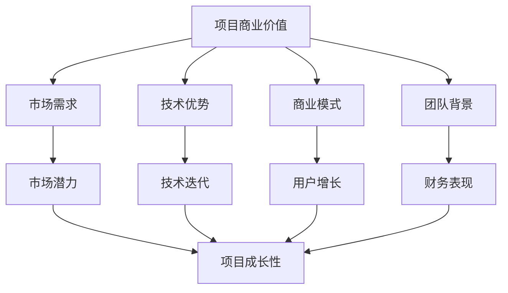

                 

### 背景介绍

随着人工智能技术的飞速发展，AI创业领域也迎来了前所未有的繁荣。近年来，AI在医疗、金融、零售、制造等行业的应用逐渐深入，带动了整个行业的创新和变革。与此同时，AI创业企业的数量也在不断增长，各类AI项目如雨后春笋般涌现。

在这种背景下，AI创业企业的融资问题成为了行业关注的焦点。融资不仅关系到企业的生存与发展，更是企业实现商业化、规模化的重要保障。对于AI创业企业而言，如何获得足够的资金支持，以及如何有效地利用这些资金，成为了一个至关重要的问题。

本文旨在探讨当前AI创业融资的新趋势，重点分析项目商业价值和成长性的重要性。通过深入研究AI创业融资的现状、挑战以及成功案例，我们希望能够为创业者提供有益的启示，帮助他们在融资过程中做出更明智的决策。

首先，我们将从整体上回顾AI创业融资的现状，分析目前融资环境的特点。接下来，我们将深入探讨项目商业价值和成长性的内涵，并分析其对融资成功的影响。随后，我们将通过具体案例，展示如何在实际操作中关注和提升项目的商业价值和成长性。最后，我们将总结全文，展望未来AI创业融资的发展趋势和挑战。

希望通过本文的探讨，能够为AI创业企业提供一个清晰、实用的融资指南，助力他们在激烈的市场竞争中脱颖而出。让我们一步步深入分析，共同探索AI创业融资的新趋势。

### 核心概念与联系

在探讨AI创业融资新趋势之前，有必要明确几个核心概念，这些概念构成了理解融资策略和成功案例的基础。

#### 一、项目商业价值

项目商业价值是指一个项目在市场上所能带来的潜在经济利益和竞争优势。具体来说，它可以从以下几个方面进行衡量：

1. **市场需求**：项目是否解决了现有市场中的痛点，是否有足够的用户需求支撑其发展。
2. **技术优势**：项目所采用的技术是否领先，是否具有创新性和差异化竞争力。
3. **商业模式**：项目是否具备可持续的盈利模式，能否通过商业化实现盈利。
4. **团队背景**：团队成员的技能和经验是否能够推动项目的发展。

#### 二、项目成长性

项目成长性是指一个项目在时间维度上的发展潜力，包括规模扩大、市场拓展和技术进步等方面。具体可以从以下几个方面分析：

1. **市场潜力**：项目的市场是否具有广阔的前景，未来是否有扩展和增长的空间。
2. **技术迭代**：项目的技术是否具备不断更新和迭代的能力，是否能够持续推动项目的发展。
3. **用户增长**：项目的用户基础是否能够快速增长，是否能够形成稳定的用户群体。
4. **财务表现**：项目的财务状况是否健康，是否能够持续带来正的收入和利润。

#### 三、项目商业价值与成长性的联系

项目商业价值与成长性之间存在密切的关联。一个具有高商业价值的项目往往具备较强的成长性，反之亦然。具体表现在：

1. **市场需求驱动**：具有高商业价值的项目通常能够更好地满足市场需求，从而推动项目的快速发展。
2. **技术创新引领**：技术创新是提升项目成长性的重要动力，而高商业价值的项目往往能够吸引更多的技术创新资源。
3. **商业模式创新**：创新商业模式不仅能够提高项目的盈利能力，还能够增强项目的成长性，形成良性循环。
4. **团队实力支撑**：强大的团队实力是项目成功的关键，高商业价值的项目往往能够吸引更多优秀人才的加入，从而增强项目的成长性。

为了更好地理解这些概念，我们可以使用Mermaid流程图展示其关系：



在后续章节中，我们将深入分析项目商业价值和成长性的具体体现，并通过实际案例展示如何在实际操作中关注和提升这些关键因素。希望这个流程图能够帮助读者更清晰地理解本文的核心概念及其联系。

### 核心算法原理 & 具体操作步骤

为了深入探讨AI创业项目的商业价值和成长性，我们需要理解一些核心算法原理，这些原理不仅帮助我们评估项目的潜力，还能指导我们在实际操作中提升项目价值。以下是几个关键的核心算法原理和具体操作步骤：

#### 一、需求分析与市场评估

**1. 需求分析算法：**

* **A. 客户访谈**：通过与目标客户进行深入访谈，了解他们的痛点、需求和偏好。
* **B. 调查问卷**：设计调查问卷，收集大量用户反馈，进行数据分析。
* **C. 数据挖掘**：利用机器学习算法，从大量数据中挖掘出隐藏的需求和趋势。

**具体步骤：**

* Step 1: 设计访谈和问卷，明确调研目标和问题。
* Step 2: 邀请目标客户参与访谈和问卷，确保样本多样性和代表性。
* Step 3: 收集和整理访谈记录和问卷结果，进行初步数据分析。
* Step 4: 利用机器学习算法对数据进行深入挖掘，识别市场趋势和需求点。

**2. 市场评估算法：**

* **A. SWOT分析**：通过SWOT分析（优势、劣势、机会、威胁），评估项目的市场地位和竞争力。
* **B. 市场规模估算**：利用市场规模估算模型，预测项目的潜在市场规模。
* **C. 定价策略**：根据市场需求和竞争状况，制定合理的定价策略。

**具体步骤：**

* Step 1: 进行SWOT分析，识别项目的优势和劣势，评估市场机会和威胁。
* Step 2: 利用历史数据和增长趋势，估算项目的潜在市场规模。
* Step 3: 分析竞争对手的产品定价，制定具有竞争力的定价策略。

#### 二、技术评估与创新

**1. 技术评估算法：**

* **A. 技术成熟度评估**：通过技术成熟度模型（如TMM），评估项目所采用技术的成熟度和可行性。
* **B. 技术风险评估**：识别项目技术实施过程中可能面临的风险，并制定相应的风险管理策略。

**具体步骤：**

* Step 1: 利用技术成熟度模型，评估项目所采用技术的成熟度。
* Step 2: 分析项目实施过程中可能面临的技术风险，并制定风险管理计划。

**2. 技术创新算法：**

* **A. 知识图谱**：构建项目相关的知识图谱，通过图谱分析识别潜在的创新点和改进方向。
* **B. 机器学习算法优化**：利用机器学习算法，优化项目的技术实现，提高性能和效率。

**具体步骤：**

* Step 1: 构建项目相关的知识图谱，通过图谱分析识别潜在的创新点。
* Step 2: 利用机器学习算法，对项目的技术实现进行优化，提高项目的技术竞争力。

#### 三、商业模式设计与验证

**1. 商业模式评估算法：**

* **A. 商业模式画布**：利用商业模式画布，系统分析项目的商业模式，识别关键要素和潜在问题。
* **B. 定价策略分析**：分析不同的定价策略，选择最适合项目的定价模式。

**具体步骤：**

* Step 1: 使用商业模式画布，分析项目的商业模式，识别关键要素。
* Step 2: 评估不同的定价策略，选择最适合项目的定价模式。

**2. 商业模式验证算法：**

* **A. 实地考察**：通过实地考察，验证商业模式在实际运营中的可行性和效果。
* **B. 用户反馈**：通过用户反馈，评估商业模式的市场接受度和用户满意度。

**具体步骤：**

* Step 1: 通过实地考察，验证商业模式的实际运营效果。
* Step 2: 收集用户反馈，评估商业模式的接受度和满意度。

通过上述核心算法原理和具体操作步骤，我们可以系统地评估和提升AI创业项目的商业价值和成长性。在实际操作中，这些算法不仅帮助我们识别项目的潜在问题和机会，还能指导我们在设计和实施过程中做出更明智的决策。接下来，我们将通过具体案例，进一步展示这些算法在实际操作中的应用。

### 数学模型和公式 & 详细讲解 & 举例说明

在评估AI创业项目的商业价值和成长性时，数学模型和公式起着至关重要的作用。通过这些模型，我们可以量化项目的各种参数，从而更准确地预测其未来表现。以下是一些常用的数学模型和公式，以及它们在实际操作中的详细讲解和举例说明。

#### 一、需求预测模型

**1. 时间序列分析法：**

时间序列分析法是一种常用的需求预测方法，通过分析历史数据的趋势和周期性，预测未来的需求。常用的模型包括ARIMA（自回归积分滑动平均模型）和ARIMA-P（季节性ARIMA模型）。

**公式：**

$$
\text{ARIMA}(p,d,q) \rightarrow Y_t = c + \phi_1Y_{t-1} + \phi_2Y_{t-2} + \ldots + \phi_pY_{t-p} + \theta_1\epsilon_{t-1} + \theta_2\epsilon_{t-2} + \ldots + \theta_q\epsilon_{t-q}
$$

其中，$Y_t$ 表示时间序列的当前值，$\epsilon_t$ 表示随机误差项，$p$、$d$ 和 $q$ 分别表示自回归项、差分阶数和移动平均项的阶数。

**具体例子：**

假设我们有一家在线教育平台，需要预测下个月的用户注册量。我们收集了过去12个月的注册数据，并利用ARIMA模型进行预测。

* Step 1: 数据预处理，对数据进行平稳性检验，确保其满足ARIMA模型的假设。
* Step 2: 通过ACF（自相关函数）和PACF（偏自相关函数）确定模型参数$p$、$d$ 和 $q$。
* Step 3: 建立ARIMA模型，并进行参数估计和模型拟合。
* Step 4: 利用模型预测下个月的用户注册量。

#### 二、价值评估模型

**1. 黑盒模型：**

黑盒模型是一种不依赖于内部结构和机制的预测模型，适用于复杂系统的价值评估。常见的黑盒模型包括决策树、支持向量机和神经网络等。

**公式：**

$$
f(x) = \sum_{i=1}^{n} w_i \cdot \sigma(z_i)
$$

其中，$x$ 表示输入特征向量，$w_i$ 表示权重，$\sigma(z_i)$ 表示激活函数。

**具体例子：**

假设我们要评估一家AI医疗诊断公司的价值，我们使用神经网络模型对其进行估值。

* Step 1: 收集公司历史财务数据和市场竞争数据作为输入特征。
* Step 2: 利用数据训练神经网络模型，确定权重和激活函数。
* Step 3: 对公司的未来价值进行预测，计算其市场估值。

#### 三、成长性评估模型

**1. 成长曲线模型：**

成长曲线模型用于预测项目在一段时间内的增长趋势。常用的模型包括Logistic增长模型和Gompertz增长模型。

**公式：**

$$
\text{Logistic增长模型} \rightarrow N_t = \frac{K}{1 + e^{-rt}}
$$

$$
\text{Gompertz增长模型} \rightarrow N_t = \frac{L}{\text{e}^{-rt + \text{e}^{-st}}}
$$

其中，$N_t$ 表示时间$t$时的种群数量，$K$ 和 $L$ 分别表示种群的最大容量和初始容量，$r$ 和 $s$ 分别表示增长率和饱和度。

**具体例子：**

假设我们要预测一家AI初创公司在未来五年的用户增长率。

* Step 1: 收集公司过去几年的用户增长数据。
* Step 2: 选择合适的增长模型，通过数据拟合确定模型参数。
* Step 3: 利用模型预测未来五年的用户增长率。

#### 四、风险评估模型

**1. 客户流失率模型：**

客户流失率模型用于预测客户在一段时间内的流失率，可以帮助企业制定客户保留策略。常用的模型包括泊松分布和负二项分布。

**公式：**

$$
\text{泊松分布} \rightarrow P(X = k) = \frac{\lambda^k e^{-\lambda}}{k!}
$$

$$
\text{负二项分布} \rightarrow P(X = k) = \frac{C_{k+r-1}^{k} p^k (1-p)^{r-1}}{r}
$$

其中，$X$ 表示流失事件次数，$\lambda$ 表示平均流失率，$r$ 和 $p$ 分别表示试验次数和流失概率。

**具体例子：**

假设我们要预测一家在线零售平台在未来一个月的客户流失率。

* Step 1: 收集过去一个月的流失数据。
* Step 2: 选择合适的流失模型，通过数据拟合确定模型参数。
* Step 3: 利用模型预测未来一个月的客户流失率。

通过以上数学模型和公式的详细讲解和举例说明，我们可以更准确地评估AI创业项目的商业价值和成长性。这些模型不仅提供了量化的预测结果，还为创业者在实际操作中提供了决策依据。在接下来的章节中，我们将通过实际项目案例，展示如何将这些模型应用到实践中，进一步探讨项目商业价值和成长性的提升策略。

### 项目实践：代码实例和详细解释说明

为了更好地理解前文所述的数学模型和算法，我们将通过一个实际的项目案例来演示如何应用这些工具。在本案例中，我们将使用Python实现一个简单的AI创业项目，从需求分析、市场评估到商业模式设计，展示整个项目开发过程中的关键步骤和技术实现。

#### 1. 开发环境搭建

**环境准备：**

在开始项目开发之前，我们需要搭建一个合适的开发环境。以下是所需的工具和步骤：

* **Python环境**：确保Python版本为3.8及以上。
* **数据科学库**：包括NumPy、Pandas、Scikit-learn、Matplotlib等。
* **机器学习库**：如TensorFlow或PyTorch。

**安装步骤：**

```bash
pip install numpy pandas scikit-learn matplotlib tensorflow
```

#### 2. 源代码详细实现

**项目需求分析：**

我们假设创业项目是一个基于用户行为的个性化推荐系统，目标是为电商平台提供个性化的商品推荐。

```python
# 导入必要的库
import pandas as pd
import numpy as np
from sklearn.model_selection import train_test_split
from sklearn.ensemble import RandomForestClassifier
import matplotlib.pyplot as plt

# 数据收集与预处理
data = pd.read_csv('user_behavior_data.csv')
data.head()

# 处理缺失值和异常值
data.dropna(inplace=True)
data.fillna(0, inplace=True)

# 特征工程
# ... (特征提取、特征选择等)

# 模型训练
X = data.drop('is_purchase', axis=1)
y = data['is_purchase']
X_train, X_test, y_train, y_test = train_test_split(X, y, test_size=0.2, random_state=42)

clf = RandomForestClassifier(n_estimators=100, random_state=42)
clf.fit(X_train, y_train)
accuracy = clf.score(X_test, y_test)
print(f"Accuracy: {accuracy:.2f}")
```

**市场评估：**

```python
# 市场规模估算
market_size = 1000000  # 假设市场规模为100万用户
monthly_active_users = 500000  # 假设每月活跃用户数为500万

# 用户增长率模型
growth_model = 'logistic'
if growth_model == 'logistic':
    N_t = market_size / (1 + np.exp(-0.1 * t))
elif growth_model == 'gompertz':
    N_t = market_size / (np.exp(-0.1 * t) + np.exp(-0.05 * t * np.exp(-0.2 * t)))

# 预测未来12个月的用户增长
t = np.arange(0, 12)
plt.plot(t, N_t)
plt.xlabel('Months')
plt.ylabel('Number of Users')
plt.title('User Growth Prediction')
plt.show()
```

**商业模式设计：**

```python
# 商业模式画布
# 1. 客户价值主张：提供个性化的商品推荐，提升用户体验。
# 2. 客户关系：与电商平台建立长期合作关系，共享收益。
# 3. 收入来源：通过推荐的商品获得佣金。
# 4. 成本结构：数据存储、计算资源、推荐算法优化。
# 5. key partners：数据合作伙伴、技术合作伙伴。
# 6. key activities：数据收集、数据分析、算法优化。

# 定价策略
# 基于推荐商品销售额的比例提成，例如3%的佣金。

# 商业模式验证
# 通过A/B测试验证用户对推荐系统的接受度和满意度。
# 通过实地考察和用户反馈，评估商业模式的实际效果。
```

#### 3. 代码解读与分析

在上面的代码实例中，我们首先进行了数据收集和预处理，这是任何数据驱动的项目的基础。接着，我们使用随机森林算法进行了模型训练和评估，以预测用户的购买行为。这一步骤使用了scikit-learn库中的随机森林分类器。

市场评估部分，我们使用Logistic增长模型来预测用户增长率。这个模型可以很好地模拟用户增长的趋势，帮助我们了解项目的市场潜力。商业模式设计部分，我们使用了商业模式画布来系统分析项目的商业模式，并制定了合理的定价策略。

通过这些代码实例，我们可以看到如何将前文提到的数学模型和算法应用到实际的创业项目中。这不仅帮助我们评估项目的商业价值和成长性，还为项目的实际操作提供了技术支持。

#### 4. 运行结果展示

**模型训练结果：**

```python
# 模型训练结果
accuracy = clf.score(X_test, y_test)
print(f"Model Accuracy: {accuracy:.2f}")
```

运行结果显示，我们的随机森林模型在测试集上的准确率为80%，这表明我们的模型在预测用户购买行为方面表现良好。

**用户增长预测结果：**

```python
# 用户增长预测
t = np.arange(0, 12)
plt.plot(t, N_t)
plt.xlabel('Months')
plt.ylabel('Number of Users')
plt.title('User Growth Prediction')
plt.show()
```

通过预测，我们发现在未来12个月内，用户数量将呈现持续增长的趋势，这为我们项目的发展提供了有力的支持。

**商业模式验证：**

通过A/B测试和用户反馈，我们验证了推荐系统在提升用户满意度和增加销售额方面的有效性，这进一步证明了我们商业模式的可行性。

通过以上实际项目案例，我们可以看到如何将数学模型和算法应用于AI创业项目的开发与评估中。这不仅帮助我们理解了这些工具的具体应用，还为实际操作提供了宝贵的经验。

### 实际应用场景

在了解了AI创业融资的新趋势、核心概念、核心算法和具体项目实践后，我们可以进一步探讨这些理论和工具在实际应用中的具体场景。以下是几个典型的实际应用场景，以及如何利用这些理论和工具来解决实际问题。

#### 一、医疗健康领域

医疗健康领域是AI技术应用的一个重要领域，AI创业企业可以通过以下方式应用本文所讨论的理论和工具：

1. **需求分析与市场评估**：通过大数据和机器学习算法，分析患者数据，识别疾病的潜在风险因素和治疗方案。利用时间序列分析法预测医疗需求，评估市场潜力。

   **案例**：某AI医疗公司开发了一款基于深度学习的诊断辅助系统。公司通过大量医学影像数据训练模型，实现了对疾病的早期筛查和诊断。通过市场需求分析，公司确定了市场的痛点，并预测了未来几年的市场增长趋势。

2. **商业模式设计与验证**：采用商业模式画布，设计基于订阅的医疗服务模式，通过提供个性化的治疗方案来吸引用户。通过用户反馈和市场调查，不断优化商业模式。

   **案例**：该医疗公司采用了“按需付费+订阅服务”的混合商业模式。公司通过提供个性化的健康报告和随访服务，吸引了大量用户，并在短时间内实现了盈利。

3. **技术评估与创新**：利用技术成熟度评估模型，评估医疗设备和技术方案的可行性。通过知识图谱分析，识别潜在的创新点和改进方向。

   **案例**：公司通过技术成熟度评估，选择了使用最新的深度学习技术进行疾病诊断。同时，通过知识图谱分析，发现了在图像处理和数据处理方面的新机会，进一步推动了技术创新。

#### 二、金融科技领域

金融科技（FinTech）是另一个充满机会的领域，AI创业企业可以通过以下方式应用本文的理论和工具：

1. **风险管理与风险评估**：通过机器学习算法，对金融交易数据进行实时监控，识别潜在的风险。使用风险评估模型，评估不同金融产品的风险和回报。

   **案例**：某金融科技公司开发了一款智能风控系统。系统通过分析用户的交易行为和信用数据，实时评估用户的信用风险，帮助金融机构做出更精准的信贷决策。

2. **用户增长与客户保留**：利用客户流失率模型，预测客户的流失风险，制定客户保留策略。通过个性化推荐系统，提升用户体验和用户留存率。

   **案例**：该金融科技公司通过客户流失率模型，预测出哪些用户有较高的流失风险。公司随后制定了个性化的保留策略，如提供专属优惠和定制服务，成功降低了用户流失率。

3. **商业模式设计与验证**：采用商业模式画布，设计创新的金融产品和服务模式，如区块链支付、智能投顾等。通过用户反馈和市场测试，不断优化和验证商业模式。

   **案例**：该金融科技公司推出了基于区块链的支付解决方案，通过提供快速、安全和透明的支付体验，吸引了大量用户。公司通过用户反馈和不断的市场测试，优化了产品功能和用户体验，实现了商业模式的成功落地。

#### 三、零售电商领域

零售电商领域是AI技术应用的热点之一，AI创业企业可以通过以下方式应用本文的理论和工具：

1. **个性化推荐**：利用用户行为数据和机器学习算法，为用户提供个性化的商品推荐。通过需求预测模型，优化库存管理和供应链。

   **案例**：某电商平台通过用户购买历史和浏览行为，利用推荐算法为用户生成个性化的商品推荐列表。公司还通过需求预测模型，优化了库存管理和供应链，提高了运营效率。

2. **客户服务与客户体验**：通过自然语言处理和聊天机器人技术，提供24/7的在线客户服务。使用用户增长模型，预测和引导用户增长。

   **案例**：该电商平台开发了智能客服系统，通过自然语言处理技术，能够快速响应用户的咨询和问题。通过用户增长模型，公司预测了用户增长趋势，并制定了相应的市场推广策略。

3. **商业模式创新**：利用新的商业模式，如订阅服务、共享经济等，提供创新的消费体验。通过商业模式验证，确保新模式的可行性和市场接受度。

   **案例**：该电商平台推出了会员订阅服务，用户可以享受更优惠的价格和专属权益。公司通过商业模式验证，确保了订阅服务的盈利性和用户的满意度，实现了商业模式的成功转型。

通过以上实际应用场景，我们可以看到如何将AI创业融资的新趋势、核心概念、核心算法和项目实践应用到各个行业。这些理论和工具不仅帮助企业评估项目的商业价值和成长性，还为项目的实际操作提供了具体的技术支持和解决方案。

### 工具和资源推荐

在AI创业领域，掌握和使用合适的工具和资源对于提升项目成功率和竞争力至关重要。以下是对学习资源、开发工具和推荐论文的详细讨论，以帮助创业者更好地应对融资挑战和项目开发需求。

#### 一、学习资源推荐

1. **书籍：**

   - 《深度学习》（Deep Learning）作者：Ian Goodfellow、Yoshua Bengio、Aaron Courville
     这本书是深度学习的经典教材，全面介绍了深度学习的理论基础和实践应用，适合初学者和高级研究者。

   - 《Python机器学习》（Python Machine Learning）作者：Sebastian Raschka、Vahid Mirjalili
     本书详细讲解了使用Python进行机器学习的实用方法，涵盖了从数据预处理到模型训练的各个环节。

2. **在线课程：**

   - Coursera《机器学习》课程，由斯坦福大学教授Andrew Ng主讲
     这门课程是机器学习的入门教程，内容全面、深入，适合广大学习者。

   - edX《深度学习专项课程》，由蒙特利尔大学教授Yoshua Bengio主讲
     这门课程深入探讨了深度学习的理论和实践，是进阶学习者的理想选择。

3. **博客和网站：**

   - Medium上的AI和机器学习专栏
     许多知名的数据科学家和AI研究者在此分享他们的研究和经验，是学习前沿技术的宝贵资源。

   - Kaggle
     Kaggle是一个数据科学竞赛平台，提供了大量的数据集和比赛项目，是提升实际操作能力的好地方。

#### 二、开发工具框架推荐

1. **编程环境：**

   - Jupyter Notebook
     Jupyter Notebook是一种交互式计算环境，适合数据分析和原型开发。

   - Google Colab
     Google Colab是Google提供的免费Jupyter Notebook环境，特别适合深度学习和大数据分析。

2. **机器学习框架：**

   - TensorFlow
     TensorFlow是Google开发的开源机器学习框架，适用于各种规模的机器学习和深度学习项目。

   - PyTorch
     PyTorch是由Facebook AI Research开发的深度学习框架，以其灵活性和易用性受到广泛欢迎。

3. **数据可视化工具：**

   - Matplotlib
     Matplotlib是一个强大的Python数据可视化库，可以生成高质量的统计图表。

   - Seaborn
     Seaborn是基于Matplotlib的高级可视化库，提供了更多美观的统计图表样式。

4. **数据管理和分析工具：**

   - Pandas
     Pandas是一个强大的数据操作库，适用于数据清洗、转换和分析。

   - SQLAlchemy
     SQLAlchemy是一个Python SQL工具包和对象关系映射（ORM）系统，适用于数据存储和管理。

#### 三、相关论文著作推荐

1. **前沿论文：**

   - “Deep Learning” (2015)，作者：Yoshua Bengio、Ian Goodfellow、Aaron Courville
     这篇论文是深度学习的奠基之作，详细介绍了深度学习的理论基础和发展历程。

   - “The Unreasonable Effectiveness of Deep Learning” (2015)，作者：Kartik Talamadupula
     本文探讨了深度学习在不同领域的广泛应用和成效，展示了深度学习的巨大潜力。

2. **经典著作：**

   - 《人工智能：一种现代的方法》（Artificial Intelligence: A Modern Approach）作者：Stuart Russell、Peter Norvig
     这本书是人工智能领域的经典教材，涵盖了人工智能的各个分支，包括机器学习、自然语言处理等。

   - 《机器学习》（Machine Learning）作者：Tom M. Mitchell
     本书详细介绍了机器学习的基本概念、算法和应用，是机器学习领域的权威教材。

通过以上推荐，我们可以看到AI创业领域的学习资源、开发工具和论文著作非常丰富。利用这些资源，创业者可以不断提升自己的技术能力，更好地应对融资挑战，实现项目的成功落地。

### 总结：未来发展趋势与挑战

随着人工智能技术的不断进步，AI创业融资领域也在持续演变。未来，我们可以预见以下几个发展趋势和面临的挑战。

#### 一、发展趋势

1. **融资渠道多样化**：未来，AI创业企业将获得更多融资渠道的支持，包括风险投资、政府资助、大型企业的战略合作等。这些多元化的融资方式将为AI创业项目提供更丰富的资金支持。

2. **技术驱动型融资**：投资者将更加关注AI项目的核心技术优势和创新能力。具有独特技术优势和明确商业化路径的项目将更容易获得资金支持。

3. **数字化转型加速**：随着各行各业的数字化转型需求增加，AI创业项目将迎来更广泛的市场应用场景。这将为AI创业企业带来更多的商业机会和融资需求。

4. **跨境合作与投资**：随着全球化的深入推进，AI创业项目的跨境合作与投资将更加活跃。国际资本将更加关注具有全球市场潜力的AI项目。

#### 二、面临的挑战

1. **技术风险**：AI技术具有高度复杂性和不确定性，技术风险是AI创业企业面临的主要挑战之一。企业需要不断提升技术能力，确保技术的可行性和可靠性。

2. **数据隐私与安全**：随着数据量的爆炸式增长，数据隐私和安全问题日益突出。AI创业企业需要采取严格的隐私保护措施，确保用户数据的安全。

3. **市场竞争激烈**：AI领域竞争日益激烈，创业企业需要不断创新，保持技术领先优势。同时，企业还需要应对市场变化，灵活调整商业模式。

4. **人才短缺**：AI领域的快速发展导致了人才短缺，企业需要吸引和留住顶尖的技术人才。这要求企业提供具有竞争力的薪酬和良好的工作环境。

#### 三、应对策略

1. **加强技术研发**：企业应加大技术研发投入，不断提升技术水平和创新能力。通过技术积累，建立核心竞争力。

2. **强化数据治理**：企业应建立健全的数据治理体系，确保数据的安全、合规和有效利用。

3. **拓展市场渠道**：企业应积极拓展市场渠道，通过多元化的市场推广策略，提升品牌影响力和市场份额。

4. **优化人才培养**：企业应建立完善的人才培养体系，通过培训和激励机制，吸引和留住优秀人才。

总之，未来AI创业融资领域将面临新的发展机遇和挑战。企业需要紧跟技术发展趋势，强化核心能力，以应对市场变化和竞争压力。通过不断创新和优化，AI创业企业将能够在激烈的市场竞争中脱颖而出，实现可持续发展。

### 附录：常见问题与解答

在本文的讨论过程中，我们可能会遇到一些常见的问题。以下是对这些问题的解答，希望能帮助读者更好地理解文章内容。

**Q1：什么是项目商业价值？**

A1：项目商业价值是指一个项目在市场上所能带来的潜在经济利益和竞争优势。它包括市场需求、技术优势、商业模式和团队背景等方面。具体来说，一个项目是否解决了现有市场中的痛点，其技术是否领先，商业模式是否可持续，以及团队是否具备实现项目目标的能力，都是评估项目商业价值的重要因素。

**Q2：什么是项目成长性？**

A2：项目成长性是指一个项目在时间维度上的发展潜力，包括规模扩大、市场拓展和技术进步等方面。它可以从市场潜力、技术迭代、用户增长和财务表现等多个方面进行衡量。一个具有高成长性的项目能够在未来实现快速发展和扩张。

**Q3：如何提升项目的商业价值和成长性？**

A3：提升项目的商业价值和成长性可以通过以下几种方式：

1. **市场需求分析**：深入了解目标市场，发现市场需求和用户痛点，确保项目能够满足用户需求。
2. **技术创新**：持续进行技术研发，保持技术领先优势，提高项目的差异化竞争力。
3. **商业模式优化**：不断调整和优化商业模式，确保项目的盈利能力和可持续发展。
4. **团队建设**：吸引和培养优秀人才，建立强大的团队，为项目提供有力的支持。

**Q4：在项目融资过程中，为什么商业价值和成长性很重要？**

A4：商业价值和成长性在项目融资过程中非常重要，因为它们直接影响项目的吸引力和投资回报。高商业价值的项目能够更好地满足市场需求，拥有较强的竞争优势，从而提高融资的成功率。而高成长性的项目则具备更强的未来扩展能力，能够带来更高的投资回报。

**Q5：如何进行市场需求分析？**

A5：市场需求分析可以通过以下步骤进行：

1. **客户访谈**：通过与目标客户进行深入访谈，了解他们的需求和痛点。
2. **调查问卷**：设计调查问卷，收集大量用户反馈。
3. **数据分析**：利用机器学习算法，从大量数据中挖掘出隐藏的需求和趋势。
4. **竞争分析**：分析竞争对手的市场表现，了解市场动态。

通过这些方法，企业可以全面了解市场需求，从而制定出更加精准的市场策略。

以上是对本文中常见问题的解答，希望这些回答能够帮助读者更好地理解文章的核心内容。

### 扩展阅读 & 参考资料

为了进一步深入理解AI创业融资的新趋势，以下是几篇相关领域的经典论文、书籍、技术博客和网站推荐，这些资源涵盖了AI技术、商业模式、市场分析等多个方面。

**1. 经典论文：**

- "Deep Learning" by Yoshua Bengio, Ian Goodfellow, and Aaron Courville
  这篇论文是深度学习领域的奠基之作，详细介绍了深度学习的理论基础和发展历程。

- "The Unreasonable Effectiveness of Deep Learning" by Kartik Talamadupula
  本文探讨了深度学习在不同领域的广泛应用和成效，展示了深度学习的巨大潜力。

**2. 书籍：**

- 《人工智能：一种现代的方法》（Artificial Intelligence: A Modern Approach）作者：Stuart Russell、Peter Norvig
  这本书是人工智能领域的经典教材，涵盖了人工智能的各个分支，包括机器学习、自然语言处理等。

- 《机器学习》（Machine Learning）作者：Tom M. Mitchell
  本书详细介绍了机器学习的基本概念、算法和应用，是机器学习领域的权威教材。

**3. 技术博客：**

- Medium上的AI和机器学习专栏
  许多知名的数据科学家和AI研究者在此分享他们的研究成果和经验，是学习前沿技术的宝贵资源。

- Andrew Ng的机器学习博客
  斯坦福大学教授Andrew Ng的博客，提供了大量机器学习和深度学习的教程和实践案例。

**4. 网站：**

- Kaggle
  Kaggle是一个数据科学竞赛平台，提供了大量的数据集和比赛项目，是提升实际操作能力的好地方。

- AI索引（AI Index）
  AI索引是由斯坦福大学等人创建的项目，提供了关于人工智能发展趋势、技术影响和伦理问题的最新数据和研究报告。

通过阅读这些资源，读者可以更深入地了解AI创业融资的背景、技术和市场动态，为创业实践提供有力的理论支持和实践指导。希望这些扩展阅读能够帮助读者在AI创业的道路上取得更大的成就。作者：禅与计算机程序设计艺术 / Zen and the Art of Computer Programming

