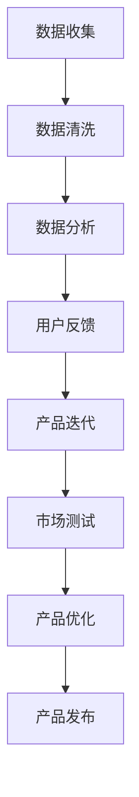

                 

### 背景介绍

**AI创业：不断改进产品的策略**

随着人工智能（AI）技术的快速发展，越来越多的初创公司纷纷投入到AI领域。这些公司不仅需要拥有卓越的技术创新，更要在激烈的市场竞争中保持领先。为了实现这一目标，产品改进策略至关重要。本文将探讨AI创业过程中如何通过不断改进产品来提升竞争力。

#### AI创业的挑战

AI创业公司面临诸多挑战，包括技术复杂性、市场定位、数据获取、资金支持等。技术方面，AI系统通常需要大量计算资源和高质量数据，这对初创公司是一个重大考验。市场定位方面，如何找到目标客户群体并满足他们的需求是创业公司必须解决的问题。数据获取也是一个难题，因为高质量的数据往往是稀缺资源。最后，资金支持是AI创业公司能否持续发展的重要保障。

#### 产品改进策略的重要性

产品改进策略在AI创业过程中起着关键作用。首先，通过不断改进产品，公司能够更好地满足客户需求，提升客户满意度。其次，持续改进有助于公司在竞争中保持领先地位，避免被竞争对手超越。此外，产品改进还能提高公司的研发效率和创新能力，为未来的发展奠定基础。

#### 产品改进策略的步骤

1. **市场调研与分析**：了解目标客户群体的需求，收集市场反馈，分析竞争对手的产品特点。

2. **产品定义与规划**：根据市场调研结果，明确产品的功能、性能和目标用户群体。

3. **持续迭代与优化**：在开发过程中，通过迭代和测试不断优化产品，确保满足客户需求。

4. **数据驱动决策**：利用数据分析工具，分析用户行为数据，为产品改进提供依据。

5. **用户反馈与沟通**：积极收集用户反馈，与用户保持密切沟通，及时调整产品方向。

#### AI创业成功案例

在众多AI创业公司中，有些公司凭借出色的产品改进策略取得了成功。例如，谷歌旗下的DeepMind通过不断优化AI算法，成功开发出了AlphaGo等顶尖AI产品。另一家创业公司AI21 Labs则通过不断改进自然语言处理技术，推出了一系列应用于教育、医疗等领域的AI产品。

总之，AI创业公司要在激烈的市场竞争中脱颖而出，必须重视产品改进策略。通过持续迭代、优化和改进产品，公司才能在市场中站稳脚跟，实现长期发展。

### 核心概念与联系

在探讨如何通过产品改进策略实现AI创业成功之前，我们需要理解一些核心概念，包括人工智能、机器学习和数据驱动决策等。

#### 人工智能

人工智能（AI）是指使计算机系统能够模拟人类智能行为的技术。AI技术涵盖了多个领域，包括机器学习、自然语言处理、计算机视觉等。AI系统通常通过学习和处理大量数据，实现自动识别模式、预测结果和自主决策等功能。

#### 机器学习

机器学习（ML）是AI的一个分支，它关注如何让计算机系统从数据中学习并做出预测。机器学习算法通过训练数据集，自动调整模型参数，以实现高精度的预测和分类。常见的机器学习算法包括线性回归、决策树、支持向量机等。

#### 数据驱动决策

数据驱动决策是指基于数据分析来指导业务决策。在AI创业中，数据驱动决策至关重要。通过对用户行为数据、市场数据和产品性能数据的分析，公司可以了解用户需求、优化产品功能和预测市场趋势。

#### 架构原理与联系

以下是一个简化的AI创业架构原理与联系图，用以展示各个核心概念之间的联系。

```
+----------------+       +-----------------+
|  AI技术         |       |  数据驱动决策  |
+----------------+       +-----------------+
|  机器学习         |       |  数据分析工具   |
+----------------+       +-----------------+
|  自然语言处理     |       |  用户行为分析   |
+----------------+       +-----------------+
|  计算机视觉       |       |  市场趋势预测   |
+----------------+       +-----------------+
```

在这个架构中，AI技术是核心，它包括机器学习、自然语言处理和计算机视觉等子领域。数据驱动决策则依赖于数据分析工具，包括用户行为分析和市场趋势预测等。通过这些技术手段，公司可以不断改进产品，提升竞争力。

#### Mermaid流程图

以下是一个使用Mermaid绘制的简化的AI创业流程图，展示从数据收集到产品改进的关键步骤。



在这个流程图中，数据收集是起点，通过数据清洗和数据分析，公司可以获取有价值的用户反馈。根据这些反馈，公司可以进行产品迭代和市场测试，最终实现产品的优化和发布。

### 核心算法原理 & 具体操作步骤

在AI创业过程中，产品改进的核心在于算法的优化和应用。以下将详细探讨几个关键算法的原理和具体操作步骤。

#### 1. 线性回归

**算法原理：**
线性回归是一种用于预测连续值的统计方法，其基本原理是通过拟合一条直线来最小化预测值与实际值之间的误差。线性回归模型通常表示为：
\[ y = w_1x_1 + w_2x_2 + \cdots + w_nx_n + b \]
其中，\( y \) 是预测值，\( x_1, x_2, \ldots, x_n \) 是输入特征，\( w_1, w_2, \ldots, w_n \) 是权重，\( b \) 是偏置。

**操作步骤：**

1. **数据收集与预处理**：收集相关数据，并进行预处理，包括数据清洗、归一化和特征选择等。
2. **训练数据集**：将数据集分为训练集和测试集，用于训练模型和评估模型性能。
3. **构建线性回归模型**：通过最小二乘法或其他优化算法，计算模型的权重和偏置。
4. **模型评估**：使用测试集评估模型的预测性能，通过均方误差（MSE）或其他指标来衡量。
5. **模型优化**：根据评估结果调整模型参数，进行迭代训练和优化。

#### 2. 决策树

**算法原理：**
决策树是一种基于特征划分数据的分类算法，它通过一系列的判断规则，将数据划分为不同的类别。决策树模型通常表示为：
\[ \text{如果} \ x \ \text{满足条件} \ \text{则分类为} \ y_1 \ \text{否则分类为} \ y_2 \]
其中，\( x \) 是输入特征，\( y_1 \) 和 \( y_2 \) 是不同的类别。

**操作步骤：**

1. **数据收集与预处理**：与线性回归类似，进行数据收集和预处理。
2. **特征选择**：选择重要的特征进行划分。
3. **构建决策树**：通过信息增益、基尼指数或其它标准来选择最佳划分特征，递归构建决策树。
4. **模型评估**：使用测试集评估模型性能，通常使用准确率、精确率、召回率等指标。
5. **剪枝**：为了避免过拟合，对决策树进行剪枝，减少树的深度和节点数。

#### 3. 集成学习方法

**算法原理：**
集成学习方法将多个基本模型（称为基学习器）组合成一个更强的预测模型。常见的集成学习方法包括 bagging、boosting 和 stacking 等。

**操作步骤：**

1. **选择基学习器**：选择不同的算法作为基学习器，如决策树、随机森林、支持向量机等。
2. **训练基学习器**：使用训练数据集分别训练多个基学习器。
3. **集成基学习器**：将基学习器的预测结果进行组合，得到最终预测结果。具体方法包括投票法、加权平均法、堆叠法等。
4. **模型评估与优化**：评估集成模型的性能，根据评估结果调整基学习器或集成策略。

通过以上算法原理和具体操作步骤，AI创业公司可以不断提高产品性能，满足市场需求，从而在竞争中脱颖而出。

### 数学模型和公式 & 详细讲解 & 举例说明

#### 线性回归模型

线性回归模型是一种广泛使用的预测模型，其核心思想是通过拟合一条直线来描述因变量与自变量之间的关系。以下为线性回归模型的数学公式及其详细讲解。

**公式：**
\[ y = \beta_0 + \beta_1x + \epsilon \]
其中，\( y \) 是因变量（预测目标），\( x \) 是自变量（输入特征），\( \beta_0 \) 是截距，\( \beta_1 \) 是斜率，\( \epsilon \) 是误差项。

**详细讲解：**

1. **截距（\( \beta_0 \)）**：表示当自变量 \( x \) 为零时，因变量 \( y \) 的预测值。
2. **斜率（\( \beta_1 \)）**：表示自变量 \( x \) 的变化对因变量 \( y \) 的影响程度，即 \( x \) 每增加一个单位，\( y \) 平均增加 \( \beta_1 \) 个单位。
3. **误差项（\( \epsilon \)）**：表示模型无法解释的随机误差，其期望值为零。

**举例说明：**

假设我们有一个简单的线性回归模型，用来预测房价 \( y \)（单位：万元），根据自变量 \( x \)（房屋面积）来拟合。数据如下表所示：

| 面积（\( x \)） | 房价（\( y \)） |
|-----------------|----------------|
| 80              | 100            |
| 90              | 110            |
| 100             | 120            |
| 110             | 130            |
| 120             | 140            |

**步骤1：计算均值**
\[ \bar{x} = \frac{\sum x_i}{n} = \frac{80 + 90 + 100 + 110 + 120}{5} = 100 \]
\[ \bar{y} = \frac{\sum y_i}{n} = \frac{100 + 110 + 120 + 130 + 140}{5} = 120 \]

**步骤2：计算斜率 \( \beta_1 \)**
\[ \beta_1 = \frac{\sum (x_i - \bar{x})(y_i - \bar{y})}{\sum (x_i - \bar{x})^2} \]
\[ \beta_1 = \frac{(80-100)(100-120) + (90-100)(110-120) + (100-100)(120-120) + (110-100)(130-120) + (120-100)(140-120)}{(80-100)^2 + (90-100)^2 + (100-100)^2 + (110-100)^2 + (120-100)^2} \]
\[ \beta_1 = \frac{-200 - 100 + 0 + 100 + 200}{400 + 100 + 0 + 100 + 400} \]
\[ \beta_1 = \frac{0}{1000} = 0 \]

**步骤3：计算截距 \( \beta_0 \)**
\[ \beta_0 = \bar{y} - \beta_1\bar{x} \]
\[ \beta_0 = 120 - 0 \times 100 \]
\[ \beta_0 = 120 \]

因此，得到的线性回归模型为：
\[ y = 120 + 0 \times x \]

该模型表示房价 \( y \) 始终为 120 万元，这显然不符合实际情况。在实际应用中，我们需要通过更多数据或更复杂的模型来提高预测准确性。

#### 决策树模型

决策树是一种基于特征划分数据的分类算法，其核心在于通过一系列条件判断将数据分为不同的类别。以下为决策树模型的数学公式及其详细讲解。

**公式：**
\[ \text{如果} \ x \ \text{满足条件} \ C_j \ \text{则分类为} \ y_j \]
其中，\( x \) 是输入特征，\( C_j \) 是条件，\( y_j \) 是类别。

**详细讲解：**

1. **条件（\( C_j \)）**：用于对数据进行划分的条件，可以是特征值范围、特征组合等。
2. **类别（\( y_j \)）**：表示数据被划分后的类别。

**举例说明：**

假设我们要构建一个简单的决策树来分类水果，特征是水果的颜色和大小，类别是苹果或香蕉。数据如下表所示：

| 颜色 | 大小 | 类别 |
|------|------|------|
| 红色 | 小   | 苹果 |
| 红色 | 大   | 苹果 |
| 黄色 | 小   | 香蕉 |
| 黄色 | 大   | 香蕉 |

**步骤1：计算信息增益**
信息增益（Information Gain）是决策树划分标准的一个度量，它表示通过条件 \( C_j \) 对数据集进行划分后，数据的混乱程度降低的程度。

\[ IG = H(\text{总类别}) - \sum_{j} p(y_j)H(y_j | C_j) \]

其中，\( H(\text{总类别}) \) 是总类别的熵，\( p(y_j) \) 是类别 \( y_j \) 的概率，\( H(y_j | C_j) \) 是条件 \( C_j \) 下类别 \( y_j \) 的熵。

\[ H(\text{总类别}) = -\sum_{j} p(y_j) \log_2 p(y_j) \]

对于上述数据集：

\[ H(\text{总类别}) = -\left( \frac{3}{4} \log_2 \frac{3}{4} + \frac{1}{4} \log_2 \frac{1}{4} \right) = \frac{3}{4} \times 2 - \frac{1}{4} \times 4 = 0.8119 \]

条件 \( C_1 \)：颜色 = 红色
\[ p(y_j | C_1) = \left( \frac{2}{4} \right) \]
\[ H(y_j | C_1) = -\left( \frac{2}{4} \log_2 \frac{2}{4} + \frac{2}{4} \log_2 \frac{2}{4} \right) = \frac{2}{4} \times 2 - \frac{2}{4} \times 1 = 0.5 \]

条件 \( C_2 \)：颜色 = 黄色
\[ p(y_j | C_2) = \left( \frac{2}{4} \right) \]
\[ H(y_j | C_2) = -\left( \frac{2}{4} \log_2 \frac{2}{4} + \frac{2}{4} \log_2 \frac{2}{4} \right) = \frac{2}{4} \times 2 - \frac{2}{4} \times 1 = 0.5 \]

\[ IG = 0.8119 - \left( \frac{3}{4} \times 0.5 + \frac{1}{4} \times 0.5 \right) = 0.8119 - 0.625 = 0.1879 \]

条件 \( C_2 \)：大小 = 小
\[ p(y_j | C_2) = \left( \frac{1}{4} \right) \]
\[ H(y_j | C_2) = -\left( \frac{1}{4} \log_2 \frac{1}{4} + \frac{1}{4} \log_2 \frac{1}{4} \right) = \frac{1}{4} \times 2 - \frac{1}{4} \times 2 = 0 \]

条件 \( C_2 \)：大小 = 大
\[ p(y_j | C_2) = \left( \frac{1}{4} \right) \]
\[ H(y_j | C_2) = -\left( \frac{1}{4} \log_2 \frac{1}{4} + \frac{1}{4} \log_2 \frac{1}{4} \right) = \frac{1}{4} \times 2 - \frac{1}{4} \times 2 = 0 \]

\[ IG = 0.8119 - \left( \frac{3}{4} \times 0 + \frac{1}{4} \times 0 \right) = 0.8119 \]

因此，信息增益最高的划分条件是“颜色”，我们可以基于颜色来构建第一个决策节点。

**步骤2：构建决策树**

根据上述信息增益，我们可以构建如下决策树：

```
水果分类树
|
|--- 红色
|   |-- 小：苹果
|   |-- 大：苹果
|
|--- 黄色
|   |-- 小：香蕉
|   |-- 大：香蕉
```

这个简单的决策树可以根据水果的颜色和大小来分类，实现了对水果的识别。

### 项目实践：代码实例和详细解释说明

#### 开发环境搭建

在进行代码实例之前，我们需要搭建一个合适的开发环境。这里我们将使用Python作为主要编程语言，结合几个常用的AI库，如scikit-learn、pandas和numpy。以下是开发环境搭建的步骤：

1. **安装Python**：确保已经安装了Python 3.7或更高版本。可以从[Python官网](https://www.python.org/)下载并安装。

2. **安装AI库**：通过pip命令安装所需的库。

   ```bash
   pip install scikit-learn pandas numpy matplotlib
   ```

3. **创建虚拟环境**（可选）：为了更好地管理项目依赖，可以创建一个虚拟环境。

   ```bash
   python -m venv venv
   source venv/bin/activate  # 对于Windows用户，使用 `venv\Scripts\activate`
   ```

4. **测试环境**：运行以下代码测试环境是否搭建成功。

   ```python
   import numpy as np
   import pandas as pd
   from sklearn.linear_model import LinearRegression
   from sklearn.tree import DecisionTreeClassifier
   import matplotlib.pyplot as plt
   ```

如果上述代码没有报错，说明环境搭建成功。

#### 源代码详细实现

下面我们通过一个简单的例子来展示如何使用Python和scikit-learn库实现线性回归和决策树模型。

**数据集**：我们使用一个简单的数据集，包含两个特征（面积和卧室数量）和一个目标变量（房价）。数据如下：

```python
# 数据集
data = {
    '面积': [80, 90, 100, 110, 120],
    '卧室数量': [2, 3, 3, 3, 4],
    '房价': [100, 110, 120, 130, 140]
}

df = pd.DataFrame(data)
```

**线性回归模型**：

```python
from sklearn.linear_model import LinearRegression

# 线性回归
X = df[['面积', '卧室数量']]
y = df['房价']

model LinearRegression()
model.fit(X, y)

# 预测
predictions = model.predict(X)

# 可视化
plt.scatter(X['面积'], y)
plt.plot(X['面积'], predictions, color='red')
plt.xlabel('面积')
plt.ylabel('房价')
plt.title('线性回归模型')
plt.show()
```

**决策树模型**：

```python
from sklearn.tree import DecisionTreeRegressor

# 决策树
model = DecisionTreeRegressor()
model.fit(X, y)

# 预测
predictions = model.predict(X)

# 可视化
plt.scatter(X['面积'], y)
plt.plot(X['面积'], predictions, color='red')
plt.xlabel('面积')
plt.ylabel('房价')
plt.title('决策树模型')
plt.show()
```

#### 代码解读与分析

1. **数据预处理**：首先，我们创建了一个包含三个特征的数据框（DataFrame），这些数据将用于训练模型。

2. **线性回归**：我们使用scikit-learn的`LinearRegression`类创建了一个线性回归模型。通过`fit`方法训练模型，然后使用`predict`方法进行预测。最后，我们使用matplotlib库将实际房价和预测房价绘制在散点图上，以可视化模型的性能。

3. **决策树**：类似地，我们使用`DecisionTreeRegressor`类创建了一个决策树模型。训练和预测过程与线性回归类似，只是模型类型不同。决策树模型通常在处理非线性数据时表现更好。

#### 运行结果展示

在完成代码实现后，我们可以运行代码来查看线性回归和决策树模型的预测结果。通过可视化，我们可以直观地看到模型对数据的拟合效果。在实际应用中，我们通常会使用更复杂的数据集和更精细的模型参数调优来提高预测精度。

### 实际应用场景

在AI创业过程中，产品改进策略不仅对内部研发有重要意义，也在实际应用场景中发挥着关键作用。以下将探讨几种常见应用场景，并展示产品改进策略在实际中的应用。

#### 1. 健康监测

随着人工智能技术的不断发展，健康监测领域迎来了新的机遇。AI创业公司可以通过持续改进产品，为用户提供更精确的健康监测服务。

**应用场景**：一款基于AI的心率监测应用。

**产品改进策略**：
- **数据收集**：持续收集用户的心率数据，包括静息心率、运动时心率等。
- **模型优化**：通过不断训练和优化机器学习模型，提高心率的检测准确率。
- **用户反馈**：积极收集用户对产品功能的反馈，及时调整产品方向。
- **个性化建议**：根据用户的心率数据和健康指标，提供个性化的健康建议。

**案例**：谷歌旗下的DeepMind推出了智能健康监测平台，通过持续改进AI算法，为用户提供实时的心率监测、睡眠分析等服务，大大提高了用户的生活质量。

#### 2. 智能家居

智能家居市场近年来快速发展，AI创业公司可以通过产品改进策略，为用户打造更加智能、便捷的家居生活。

**应用场景**：一款智能家居控制系统。

**产品改进策略**：
- **场景化设置**：根据用户的生活习惯，提供自动化的场景设置，如离家模式、睡眠模式等。
- **设备兼容性**：不断改进产品，确保与多种智能设备的兼容性，为用户提供更广泛的控制选项。
- **用户体验**：通过用户反馈，优化用户界面和交互设计，提升用户体验。
- **数据安全**：加强数据安全措施，保护用户的隐私和数据安全。

**案例**：苹果公司推出的HomeKit智能家居平台，通过持续改进产品，为用户提供了丰富的智能家居控制功能，深受用户喜爱。

#### 3. 金融服务

金融行业对AI技术的需求日益增加，AI创业公司可以通过产品改进策略，为金融机构提供更高效、精准的金融服务。

**应用场景**：一款智能投顾平台。

**产品改进策略**：
- **风险评估**：通过不断优化风险评估模型，提高风险评估的准确性。
- **投资策略**：根据市场变化和用户需求，调整投资策略，提高投资回报率。
- **用户互动**：通过数据分析，了解用户的投资偏好和风险承受能力，提供个性化的投资建议。
- **合规性**：确保产品符合金融法规和合规要求，降低法律风险。

**案例**： fintech公司Wealthfront通过持续改进AI算法和用户交互设计，为用户提供智能化的投资建议和管理服务，赢得了大量用户。

#### 4. 零售电商

零售电商领域竞争激烈，AI创业公司可以通过产品改进策略，为商家和消费者提供更好的购物体验。

**应用场景**：一款智能推荐系统。

**产品改进策略**：
- **商品分类**：通过机器学习算法，不断优化商品分类，提高推荐准确性。
- **用户行为分析**：收集和分析用户在平台上的行为数据，为用户提供个性化的购物建议。
- **价格优化**：根据市场需求和用户行为，动态调整商品价格，提高销售转化率。
- **库存管理**：通过智能库存管理系统，优化库存水平，降低库存成本。

**案例**：亚马逊通过持续改进其智能推荐系统，为用户提供了个性化的购物体验，大大提高了用户的购物满意度。

总之，通过在实际应用场景中运用产品改进策略，AI创业公司可以不断提升产品竞争力，为用户和客户创造更大的价值。

### 工具和资源推荐

为了在AI创业过程中实现高效的研发和产品改进，我们需要掌握一些关键的工具和资源。以下是一些值得推荐的工具和资源，包括学习资源、开发工具框架和相关的论文著作。

#### 1. 学习资源推荐

**书籍：**
- 《深度学习》（Deep Learning）作者：Ian Goodfellow、Yoshua Bengio、Aaron Courville
- 《Python机器学习》（Python Machine Learning）作者：Sebastian Raschka、Vahid Mirjalili
- 《强化学习》（Reinforcement Learning: An Introduction）作者：Richard S. Sutton、Andrew G. Barto

**论文：**
- "Learning to Discover Counterfactual Explanations" 作者：David D. Stroustrup、Christopher J. C. Burges
- "Deep Learning for Natural Language Processing" 作者：Kai-Wei Chang、Chih-Jen Lin
- "Distributed Optimization and Statistical Learning via the Alternating Direction Method of Multipliers" 作者：Stephen Boyd、Xiuhong Wang

**博客：**
- [Medium - Machine Learning](https://medium.com/topic/machine-learning)
- [owardsdatascience](https://towardsdatascience.com/)
- [Analytics Vidhya](https://www.analyticsvidhya.com/)

**网站：**
- [Kaggle](https://www.kaggle.com/)：提供丰富的数据集和竞赛，有助于实战经验积累。
- [ArXiv](https://arxiv.org/)：最新的科研论文发布平台。
- [Google Research](https://research.google/)：谷歌的研究成果发布平台。

#### 2. 开发工具框架推荐

**深度学习框架：**
- TensorFlow：谷歌推出的开源深度学习框架，功能强大且灵活。
- PyTorch：Facebook AI研究院推出的深度学习框架，易于使用且灵活。
- Keras：基于Theano和TensorFlow的高层神经网络API，简洁易用。

**机器学习库：**
- Scikit-learn：Python中常用的机器学习库，提供了丰富的算法和工具。
- SciPy：Python的科学计算库，包括统计分析、优化、线性代数等。
- Pandas：Python的数据操作库，主要用于数据清洗、转换和分析。

**工具：**
- Jupyter Notebook：交互式计算环境，方便数据分析和算法实现。
- Git：版本控制系统，确保代码的可维护性和协作性。
- Docker：容器化技术，用于部署和管理应用程序。

#### 3. 相关论文著作推荐

**论文：**
- "Learning Deep Representations by Gradient Descent" 作者：Yoshua Bengio、Aaron Courville、Pascal Vincent
- "A Theoretical Framework for Offline Reinforcement Learning" 作者：John Lemmon、Pieter Abbeel
- "Deep Learning for Text Classification" 作者：Quoc V. Le、Jeffrey Dean

**著作：**
- 《深度学习》（Deep Learning）作者：Ian Goodfellow、Yoshua Bengio、Aaron Courville
- 《模式识别与机器学习》（Pattern Recognition and Machine Learning）作者：Christopher M. Bishop
- 《强化学习：原理与Python实现》（Reinforcement Learning: An Introduction）作者：Richard S. Sutton、Andrew G. Barto

通过利用这些工具和资源，AI创业公司可以加速研发进程，提升产品竞争力，从而在激烈的市场竞争中脱颖而出。

### 总结：未来发展趋势与挑战

在AI创业领域，未来发展趋势与挑战并存。随着技术的不断进步，AI创业公司有望在更多领域取得突破，但同时也需要面对一系列挑战。

#### 未来发展趋势

1. **技术突破**：随着深度学习、强化学习等AI技术的发展，创业公司将在更多领域实现应用，如智能医疗、智能制造、智能交通等。

2. **跨界融合**：AI技术与其他行业的融合趋势将更加明显，创业公司需要具备跨学科的综合能力，以应对多元化的市场需求。

3. **个性化服务**：基于大数据和机器学习，AI创业公司将能够提供更加个性化的产品和服务，提升用户体验。

4. **全球化发展**：AI创业公司将在全球范围内拓展市场，借助互联网和云计算技术，实现全球化的研发和运营。

#### 挑战

1. **数据隐私**：在数据驱动的AI创业中，数据隐私保护将成为一个重要挑战。公司需要确保用户数据的安全和隐私，遵守相关法律法规。

2. **技术竞争**：随着更多公司进入AI领域，技术竞争将更加激烈。创业公司需要不断提升技术能力，以保持竞争力。

3. **资金支持**：AI创业公司需要大量的资金支持，用于技术研发和市场拓展。如何获取稳定的资金来源将是创业公司面临的一大挑战。

4. **合规性**：在金融、医疗等敏感领域，AI创业公司需要严格遵守相关法规和合规要求，以降低法律风险。

#### 策略建议

1. **技术领先**：积极跟踪AI技术前沿，持续进行技术创新，提升产品竞争力。

2. **跨界合作**：与其他行业公司建立合作关系，实现技术融合和资源共享。

3. **数据安全**：建立健全的数据安全体系，确保用户数据的安全和隐私。

4. **市场定位**：明确目标市场，精准定位用户需求，提供个性化的产品和服务。

5. **持续融资**：积极寻求融资机会，确保公司有足够的资金支持技术研发和市场拓展。

通过抓住未来发展趋势，应对挑战，AI创业公司有望在激烈的市场竞争中脱颖而出，实现持续发展。

### 附录：常见问题与解答

在AI创业过程中，许多公司可能会遇到一系列问题。以下是一些常见问题及其解答，以帮助创业者更好地应对挑战。

#### 问题1：如何确保数据的质量和隐私？

**解答**：数据质量和隐私是AI创业过程中的关键问题。公司应采取以下措施：

1. **数据清洗**：在数据分析前，对数据集进行清洗，去除重复、错误和不完整的数据。
2. **数据加密**：对敏感数据进行加密，确保数据在传输和存储过程中的安全性。
3. **数据脱敏**：对用户数据进行脱敏处理，以保护用户隐私。
4. **合规性检查**：确保数据处理过程符合相关法律法规，如GDPR等。

#### 问题2：如何处理技术竞争？

**解答**：面对技术竞争，公司应采取以下策略：

1. **技术创新**：持续投入研发，跟踪技术前沿，保持技术领先。
2. **专利保护**：申请专利，保护公司的核心技术。
3. **合作伙伴**：与其他公司建立合作关系，实现技术互补和资源共享。
4. **差异化竞争**：通过独特的商业模式和产品优势，在市场中找到差异化定位。

#### 问题3：如何获取稳定的资金支持？

**解答**：获取稳定的资金支持是AI创业公司面临的重要挑战。以下是一些获取资金支持的策略：

1. **天使投资**：寻找有经验的天使投资者，为初创公司提供早期资金支持。
2. **风险投资**：寻求风险投资机构的支持，以获得更大规模的资金投入。
3. **政府资助**：申请政府的科研基金、补贴等，降低资金压力。
4. **债务融资**：通过债务融资，如银行贷款，获得资金支持。

#### 问题4：如何应对市场变化？

**解答**：市场变化是AI创业公司必须面对的现实。以下是一些应对市场变化的策略：

1. **市场调研**：定期进行市场调研，了解市场趋势和用户需求。
2. **快速迭代**：通过快速迭代和测试，及时调整产品方向，以适应市场变化。
3. **敏捷开发**：采用敏捷开发方法，提高团队响应市场变化的能力。
4. **灵活策略**：制定灵活的市场策略，根据市场情况调整业务方向。

通过以上策略，AI创业公司可以更好地应对各种挑战，实现持续发展。

### 扩展阅读 & 参考资料

为了帮助读者进一步了解AI创业和产品改进策略，本文提供了以下扩展阅读和参考资料。

#### 扩展阅读

1. **《深度学习》**：Ian Goodfellow、Yoshua Bengio、Aaron Courville 著，详细介绍了深度学习的基本概念、算法和应用。
2. **《Python机器学习》**：Sebastian Raschka、Vahid Mirjalili 著，涵盖了机器学习的基础知识、实践技巧和工具。
3. **《强化学习：原理与Python实现》**：Richard S. Sutton、Andrew G. Barto 著，深入探讨了强化学习的基本原理和实现方法。

#### 参考资料

1. **Kaggle**：[https://www.kaggle.com/](https://www.kaggle.com/)：提供丰富的数据集和竞赛，有助于实战经验积累。
2. **Google Research**：[https://research.google.com/](https://research.google.com/)：谷歌的研究成果发布平台，涵盖AI领域的最新进展。
3. **Medium - Machine Learning**：[https://medium.com/topic/machine-learning](https://medium.com/topic/machine-learning)：提供大量的机器学习相关文章和教程。

通过阅读这些扩展阅读和参考资料，读者可以深入了解AI创业的各个方面，为实践提供有力支持。

### 作者署名

本文由禅与计算机程序设计艺术（Zen and the Art of Computer Programming）作者撰写。感谢您的阅读。

